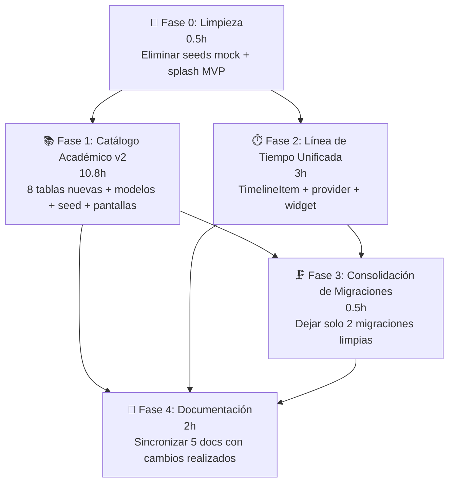
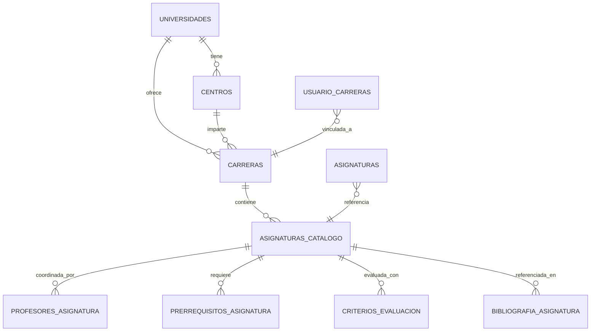
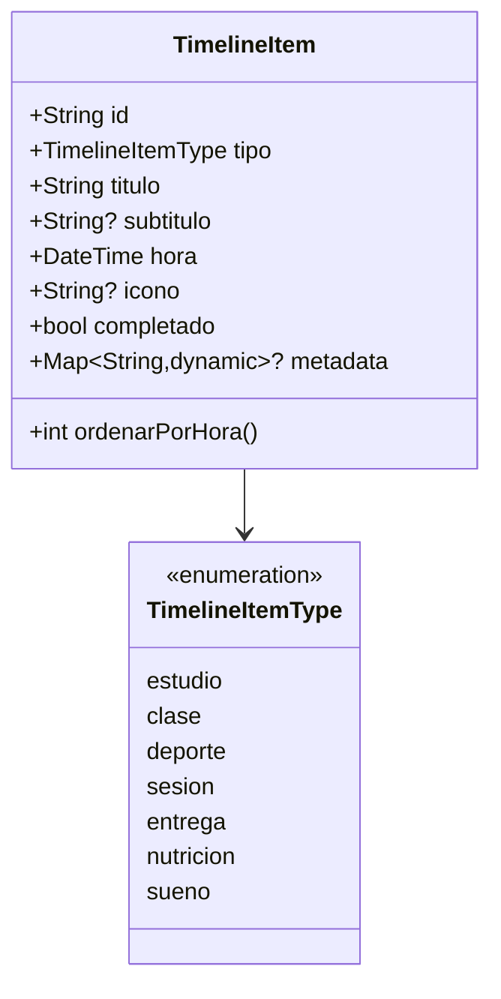
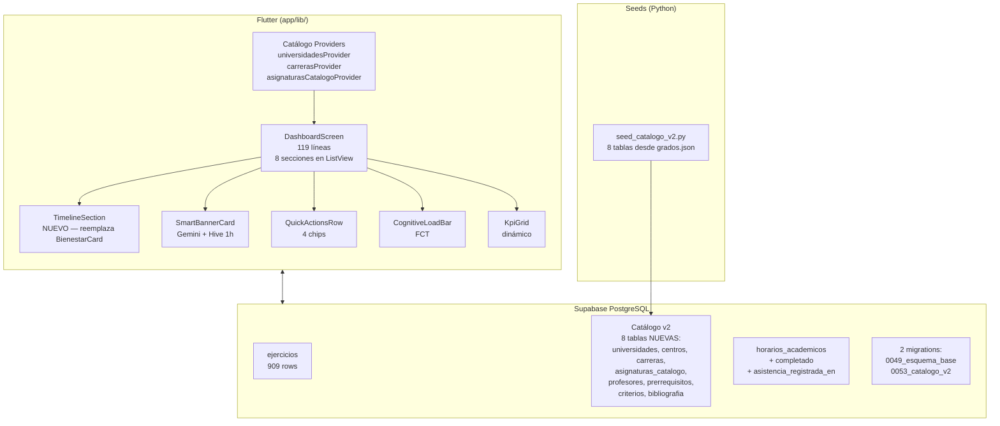

# 00 — Plan Maestro SynaptixFit

**Versión:** 2.0  
**Fecha:** 17-06-2026  
**Estado:** COMPLETADO — Sprint 9 + Time-Blocking + 9 fases de coherencia de gamificación finalizados. Rediseño de onboarding completado. Panel de administración Fase 3 completado (5 tabs, moderación, gráficos, timeline, delete user, configuración de usuario, gráfico de tendencia KPIs). Sprint Time-Blocking v7.0 completado (Custom Grid Nativo, IA Time-Blocking, XP unificado, SyncHub). 26 migraciones desplegadas.  
**Propósito:** Hoja de ruta consolidada del desarrollo de SynaptixFit. Documenta el plan maestro, las 9 fases de coherencia, el Sprint Time-Blocking y todas las features implementadas.

---

## Contexto de partida

| Elemento | Estado actual |
|----------|---------------|
| Dashboard | v6.2 — rediseño completo, 8 secciones, 8 widgets en `widgets/`, 119 líneas en `dashboard_screen.dart` |
| Migraciones | 26 archivos en `supabase/migrations/`: `0049_esquema_base`, `0050_dependencias_retos`, `0001_marcar_semana_completada`, `0001_v_analitica_semanal`, `0002_social_moderacion`, `0003_insignias`, `0004_consolidacion_fixes`, `0005_fechas_coherencia`, `0006_admin_rol`, `0007_nivel_actividad_check`, `0008_asignaturas_usuario_semestre`, `0009_admin_panel_v2`, `0010_admin_delete_user`, `0011_calendar_grid`, `0012_xp_planificacion`, `0013_bloque_xp_tracking`, `0014_retos_bloques_bridge`, `0015_dia_rutina_fk`, `0016_rutina_fk_fix`, `0017_trigger_hito_progreso`, `0018_unique_dias_rutina`, `0019_fix_duplicate_fk_rutina`, `0022_lienzo_continuo`, `0023_lienzo_continuo_v2`, `0024_ics_sync`, `0025_ics_upsert_fix` |
| Migración base | `202606060049_esquema_base.sql` (~12K líneas, pg_dump completo con 43+ tablas) |
| Catálogo ejercicios | 909 ejercicios, 93 músculos, 74 equipamientos, 19 partes del cuerpo, vista `v_ejercicios_completos` |
| Catálogo académico | 8 tablas normalizadas (`universidades`, `centros`, `carreras`, `asignaturas_catalogo`, `profesores_asignatura`, `prerrequisitos_asignatura`, `criterios_evaluacion`, `bibliografia_asignatura`) — todos los campos de `grados.json` |
| Seeds | 1 archivo activo: `seed_catalogo_v2.py`. Seeds mock (`seed_usuarios.py`, `seed_demo_data.py`, `seed_asignaturas.py`, `seed_todo.py`, `seed_ejercicios.py`, `seed_completo.py`) eliminados en Fase 0. |
| `grados.json` | 7335 líneas, 23 carreras, ~368 asignaturas — 9 campos nuevos **no aprovechados** |
| `flutter analyze` | 0 errores, 0 warnings |
| Entorno | 1 usuario de prueba, Supabase CLI linked |

---

## Diagrama de fases



**Nota:** Las Fases 1 y 2 son independientes entre sí. Pueden ejecutarse en paralelo si hay 2 desarrolladores, o secuencialmente en cualquier orden. Ambas confluyen en Fase 3 (consolidación) y Fase 4 (documentación), que requieren que toda migración y widget nuevo esté estabilizado.

---

## Fase 0 — Limpieza de datos mock ✅ COMPLETADO — 11/06/2026

### Objetivo
Eliminar toda traza de datos simulados del repositorio y del producto. SynaptixFit opera solo con datos reales: ejercicios del dataset Lyfta (909) + catálogo académico desde `grados.json` (23 carreras).

### Archivos a eliminar

| Archivo | Motivo |
|---------|--------|
| `supabase/seed_usuarios.py` | Crea usuarios mock vía Admin API. Ya no se usa. |
| `supabase/seed_demo_data.py` | Crea rutinas, retos, sesiones mock. Ya no se usa. |
| `supabase/seed_asignaturas.py` | Asigna asignaturas mock a usuarios. Ya no se usa. |
| `supabase/seed_todo.py` | Orquestador de seeds mock. Ya no se usa. |

### Archivos conservados

| Archivo | Motivo |
|---------|--------|
| `supabase/seed_catalogo_v2.py` | Puebla catálogo académico v2 (8 tablas normalizadas) desde `grados.json`. **Único seed activo.** |

### Archivos a modificar

| Archivo | Cambio | Líneas |
|---------|--------|--------|
| `app/lib/features/splash/presentation/splash_screen.dart` | Línea 26: cambiar `'MVP inicial con navegación y datos mock.'` por `'Tu compañero de estudio y bienestar.'` | 1 |
| `AGENTS.md` | Sección "Data seeding": eliminar referencias a seeds mock, mantener solo `seed_catalogo_v2.py` | ~10 |

### Riesgos
- **Bajo.** Los archivos a eliminar no son referenciados desde ningún otro script ni desde dependencias del proyecto.

### Verificación
```bash
# 1. Confirmar que los 4 archivos ya no existen
ls supabase/seed_usuarios.py supabase/seed_demo_data.py supabase/seed_asignaturas.py supabase/seed_todo.py 2>&1 | grep "No such file"

# 2. Confirmar que splash_screen ya no contiene "mock"
grep -r "mock\|MVP" app/lib/features/splash/

# 3. Confirmar que AGENTS.md no referencia seeds eliminados
grep "seed_usuarios\|seed_demo_data\|seed_asignaturas\|seed_todo" AGENTS.md
# Debe devolver cero resultados

# 4. flutter analyze debe seguir en 0 errores
```

---

## Fase 1 — Catálogo Académico v2 ✅ COMPLETADO — 11/06/2026

### Objetivo
Reemplazar las 3 tablas planas actuales (`catalogo_universidades`, `catalogo_carreras`, `catalogo_asignaturas`) por 8 tablas normalizadas que aprovechan **todos** los campos de `grados.json`. Dotar al catálogo de la misma riqueza que tiene el dataset de ejercicios.

### 📊 Diagrama Entidad-Relación (nuevo catálogo)



### Migración `0053_catalogo_v2.sql`

**Nota arquitectónica:** Aunque en los planes originales se discutió como `0054`, se asigna `0053` para que preceda a la migración de timeline (`0054`). Ambas son independientes funcionalmente, pero numéricamente deben mantener orden creciente.

```sql
-- ============================================================
-- Migración 0053: Catálogo Académico v2
-- Reemplaza catalogo_universidades, catalogo_carreras, catalogo_asignaturas
-- por 8 tablas normalizadas aprovechando todos los campos de grados.json
-- ============================================================

-- 1. ELIMINAR tablas viejas (cascada maneja FKs en usuario_carreras, asignaturas)
DROP TABLE IF EXISTS catalogo_asignaturas CASCADE;
DROP TABLE IF EXISTS catalogo_carreras CASCADE;
DROP TABLE IF EXISTS catalogo_universidades CASCADE;

-- 2. CREAR 8 tablas nuevas

CREATE TABLE universidades (
  id          UUID PRIMARY KEY DEFAULT gen_random_uuid(),
  nombre      TEXT NOT NULL UNIQUE,
  pais        TEXT,
  ciudad      TEXT,
  creado_en   TIMESTAMPTZ NOT NULL DEFAULT now()
);

CREATE TABLE centros (
  id              UUID PRIMARY KEY DEFAULT gen_random_uuid(),
  universidad_id  UUID NOT NULL REFERENCES universidades(id) ON DELETE CASCADE,
  nombre          TEXT NOT NULL,
  creado_en       TIMESTAMPTZ NOT NULL DEFAULT now(),
  UNIQUE(universidad_id, nombre)
);

CREATE TABLE carreras (
  id              UUID PRIMARY KEY DEFAULT gen_random_uuid(),
  universidad_id  UUID NOT NULL REFERENCES universidades(id) ON DELETE CASCADE,
  centro_id       UUID REFERENCES centros(id) ON DELETE SET NULL,
  nombre          TEXT NOT NULL,
  total_creditos  INTEGER,
  total_horas     INTEGER,
  creado_en       TIMESTAMPTZ NOT NULL DEFAULT now(),
  UNIQUE(universidad_id, nombre)
);

CREATE TABLE asignaturas_catalogo (
  id                UUID PRIMARY KEY DEFAULT gen_random_uuid(),
  carrera_id        UUID NOT NULL REFERENCES carreras(id) ON DELETE CASCADE,
  nombre            TEXT NOT NULL,
  curso             INTEGER,
  semestre          INTEGER,
  caracter          TEXT,           -- OBLIGATORIA, OPTATIVA, BASICA, etc.
  creditos          NUMERIC(5,2),
  horas             INTEGER,
  departamento      TEXT,
  idioma_imparticion TEXT,
  url_guia_docente  TEXT,
  creado_en         TIMESTAMPTZ NOT NULL DEFAULT now(),
  UNIQUE(carrera_id, nombre)
);

CREATE TABLE profesores_asignatura (
  id                  UUID PRIMARY KEY DEFAULT gen_random_uuid(),
  asignatura_id       UUID NOT NULL REFERENCES asignaturas_catalogo(id) ON DELETE CASCADE,
  nombre_profesor     TEXT NOT NULL,
  rol                 TEXT DEFAULT 'coordinador',  -- coordinador, colaborador
  creado_en           TIMESTAMPTZ NOT NULL DEFAULT now(),
  UNIQUE(asignatura_id, nombre_profesor)
);

CREATE TABLE prerrequisitos_asignatura (
  id                  UUID PRIMARY KEY DEFAULT gen_random_uuid(),
  asignatura_id       UUID NOT NULL REFERENCES asignaturas_catalogo(id) ON DELETE CASCADE,
  nombre_prerrequisito TEXT NOT NULL,
  creado_en           TIMESTAMPTZ NOT NULL DEFAULT now(),
  UNIQUE(asignatura_id, nombre_prerrequisito)
);

CREATE TABLE criterios_evaluacion (
  id                              UUID PRIMARY KEY DEFAULT gen_random_uuid(),
  asignatura_id                   UUID NOT NULL REFERENCES asignaturas_catalogo(id) ON DELETE CASCADE UNIQUE,
  examen_final_porcentaje         NUMERIC(5,2) DEFAULT 0,
  evaluacion_continua_porcentaje  NUMERIC(5,2) DEFAULT 0,
  practicas_laboratorio_porcentaje NUMERIC(5,2) DEFAULT 0,
  creado_en                       TIMESTAMPTZ NOT NULL DEFAULT now()
);

CREATE TABLE bibliografia_asignatura (
  id              UUID PRIMARY KEY DEFAULT gen_random_uuid(),
  asignatura_id   UUID NOT NULL REFERENCES asignaturas_catalogo(id) ON DELETE CASCADE,
  referencia      TEXT NOT NULL,
  tipo            TEXT DEFAULT 'basica',  -- basica, complementaria
  creado_en       TIMESTAMPTZ NOT NULL DEFAULT now()
);

-- 3. RLS — catálogo público (solo lectura)

ALTER TABLE universidades ENABLE ROW LEVEL SECURITY;
ALTER TABLE centros ENABLE ROW LEVEL SECURITY;
ALTER TABLE carreras ENABLE ROW LEVEL SECURITY;
ALTER TABLE asignaturas_catalogo ENABLE ROW LEVEL SECURITY;
ALTER TABLE profesores_asignatura ENABLE ROW LEVEL SECURITY;
ALTER TABLE prerrequisitos_asignatura ENABLE ROW LEVEL SECURITY;
ALTER TABLE criterios_evaluacion ENABLE ROW LEVEL SECURITY;
ALTER TABLE bibliografia_asignatura ENABLE ROW LEVEL SECURITY;

-- Políticas: lectura pública, inserción solo authenticated (para seed)
DO $$
DECLARE
  tbl TEXT;
BEGIN
  FOREACH tbl IN ARRAY ARRAY[
    'universidades','centros','carreras','asignaturas_catalogo',
    'profesores_asignatura','prerrequisitos_asignatura',
    'criterios_evaluacion','bibliografia_asignatura'
  ]
  LOOP
    EXECUTE format('CREATE POLICY "Lectura publica" ON %I FOR SELECT USING (true)', tbl);
    EXECUTE format('CREATE POLICY "Insercion authenticated" ON %I FOR INSERT WITH CHECK (auth.role() = ''authenticated'')', tbl);
  END LOOP;
END $$;

-- 4. Actualizar FKs en tablas existentes que referenciaban el catálogo viejo
--    (usuario_carreras, asignaturas) — se rompieron con el DROP CASCADE.
--    Deben recrearse apuntando a las nuevas tablas.

-- usuario_carreras → carreras (nueva)
ALTER TABLE usuario_carreras
  ADD COLUMN carrera_v2_id UUID REFERENCES carreras(id) ON DELETE CASCADE;

-- asignaturas → asignaturas_catalogo (nueva)
ALTER TABLE asignaturas
  ADD COLUMN catalogo_asignatura_v2_id UUID REFERENCES asignaturas_catalogo(id) ON DELETE SET NULL;
```

### Modelos Dart (8 nuevos, 3 eliminados)

| Acción | Clase | Archivo |
|--------|-------|---------|
| **NUEVO** | `UniversidadDb` | `app/lib/shared/models/db_models.dart` |
| **NUEVO** | `CentroDb` | `app/lib/shared/models/db_models.dart` |
| **NUEVO** | `CarreraDb` | `app/lib/shared/models/db_models.dart` |
| **NUEVO** | `AsignaturaCatalogoDb` | `app/lib/shared/models/db_models.dart` |
| **NUEVO** | `ProfesorAsignaturaDb` | `app/lib/shared/models/db_models.dart` |
| **NUEVO** | `PrerrequisitoAsignaturaDb` | `app/lib/shared/models/db_models.dart` |
| **NUEVO** | `CriterioEvaluacionDb` | `app/lib/shared/models/db_models.dart` |
| **NUEVO** | `BibliografiaAsignaturaDb` | `app/lib/shared/models/db_models.dart` |
| **ELIMINAR** | `CatalogoUniversidadDb` | `app/lib/shared/models/db_models.dart` |
| **ELIMINAR** | `CatalogoCarreraDb` | `app/lib/shared/models/db_models.dart` |
| **ELIMINAR** | `CatalogoAsignaturaDb` | `app/lib/shared/models/db_models.dart` |

Cada nuevo modelo debe incluir:
- Constructor `const` con todos los campos
- `factory .fromMap(Map<String, dynamic> map)`
- Método `toMap()` (si se necesita para inserts)
- Campos anulables correctamente tipados (`int?`, `double?`, `String?`)

### Seed `seed_catalogo_v2.py`

Reescribir completamente `supabase/seed_catalogo.py` como `supabase/seed_catalogo_v2.py`:

- **Fuente:** `grados.json` (raíz del repo)
- **Flujo:**
  1. Cargar `grados.json`
  2. Deducir universidades únicas → INSERT en `universidades`
  3. Por cada entrada, deducir `centro_facultad` → INSERT en `centros`
  4. INSERT `carreras` con `total_creditos`, `total_horas`, `centro_id`
  5. Por cada asignatura: INSERT en `asignaturas_catalogo` con TODOS los campos
  6. INSERT `profesores_asignatura` (array `profesores_coordinadores`)
  7. INSERT `prerrequisitos_asignatura` (array `prerrequisitos`)
  8. INSERT `criterios_evaluacion` (1 por asignatura con los 3 porcentajes)
  9. INSERT `bibliografia_asignatura` (array `bibliografia_basica`)
- **Idempotencia:** Usar `ON CONFLICT DO NOTHING` o limpiar tablas antes de insertar.
- **Verificación:** Al final, imprimir conteo de registros insertados por tabla.

### Providers y pantallas afectados

| Archivo | Cambio requerido |
|---------|-----------------|
| `catalogo_provider.dart` | Renombrar providers: `catalogoUniversidadesProvider` → `universidadesProvider`, etc. Nuevos tipos de retorno. |
| `usuario_carreras_provider.dart` | Adaptar queries a nueva tabla `carreras`. |
| `asignaturas_provider.dart` | Adaptar JOINs a `asignaturas_catalogo`. |
| `configuracion_academica_screen.dart` | Nuevos diálogos de selección con datos enriquecidos (centro, créditos, etc.) |
| `gestion_asignaturas_screen.dart` | Búsqueda sobre `asignaturas_catalogo` con nuevos campos. |
| `perfil_screen.dart` | Diálogos de selección universidad/carrera actualizados. |

### Estimación detallada

| Tarea | ~Líneas | ~Horas |
|-------|---------|--------|
| Migración SQL | 120 | 1.0 |
| Modelos Dart (8 nuevos) | 250 | 1.5 |
| Eliminar 3 modelos viejos + limpiar referencias | — | 0.5 |
| `seed_catalogo_v2.py` | 200 | 2.0 |
| `catalogo_provider.dart` (refactor) | 80 | 1.0 |
| `usuario_carreras_provider.dart` | 40 | 0.5 |
| `asignaturas_provider.dart` | 40 | 0.5 |
| `configuracion_academica_screen.dart` | 100 | 1.0 |
| `gestion_asignaturas_screen.dart` | 80 | 1.0 |
| `perfil_screen.dart` | 60 | 0.8 |
| `db push` + `db reset` + seed + verificación | — | 1.0 |
| **TOTAL** | **~970** | **~10.8** |

### Riesgos
- **Medio.** Romper FKs en `usuario_carreras` y `asignaturas` durante el DROP CASCADE. Se mitiga recreando las columnas FK al final de la migración y ejecutando seed inmediatamente después.
- **Medio.** Pantallas que usan `CatalogoUniversidadDb` pueden fallar en compilación si no se actualizan simultáneamente.
- **Bajo.** `grados.json` tiene campos con valor `"No especificado en las fuentes"` — el seed debe manejarlos como NULL.

### Verificación
```bash
# 1. Migración desplegada sin errores
supabase db push

# 2. Seed ejecutado correctamente
python supabase/seed_catalogo_v2.py
# Debe mostrar conteos > 0 para cada tabla

# 3. Tablas nuevas existen y tienen datos
# Ejecutar en Supabase SQL Editor:
SELECT count(*) FROM universidades;       -- ~15
SELECT count(*) FROM centros;             -- ~20
SELECT count(*) FROM carreras;            -- 23
SELECT count(*) FROM asignaturas_catalogo; -- ~368
SELECT count(*) FROM profesores_asignatura;
SELECT count(*) FROM prerrequisitos_asignatura;
SELECT count(*) FROM criterios_evaluacion;
SELECT count(*) FROM bibliografia_asignatura;

# 4. Tablas viejas no existen
SELECT count(*) FROM catalogo_universidades;  -- Debe fallar: relation does not exist

# 5. flutter analyze — 0 errores
# 6. Navegar por configuracion_academica_screen y verificar que muestra datos nuevos
```

---

## Fase 2 — Línea de Tiempo Unificada ✅ COMPLETADO — 11/06/2026

### Objetivo
Reemplazar `BienestarCard` (widget estático de IMC/peso/objetivo) en el dashboard por `TimelineSection`: una vista cronológica unificada que muestra todas las actividades del día en un solo flujo visual.

### 📊 Modelo de datos: `TimelineItem`



**DTO `TimelineItem`** (`app/lib/features/dashboard/domain/timeline_item.dart`):
```dart
enum TimelineItemType { estudio, clase, deporte, sesion, entrega, nutricion, sueno }

class TimelineItem {
  final String id;
  final TimelineItemType tipo;
  final String titulo;
  final String? subtitulo;
  final DateTime hora;
  final bool completado;
  final Map<String, dynamic>? metadata;

  const TimelineItem({
    required this.id,
    required this.tipo,
    required this.titulo,
    this.subtitulo,
    required this.hora,
    this.completado = false,
    this.metadata,
  });
}
```

### Migración `0054_asistencia_bloques.sql`

**Nota arquitectónica:** Se asigna `0054` (posterior a `0053_catalogo_v2`) por coherencia numérica. Ambas migraciones son independientes.

```sql
-- ============================================================
-- Migración 0054: Asistencia y timestamps para Timeline unificado
-- ============================================================

-- Añadir tracking de completitud a bloques de horario
ALTER TABLE horarios_academicos
  ADD COLUMN IF NOT EXISTS completado              BOOLEAN NOT NULL DEFAULT false,
  ADD COLUMN IF NOT EXISTS asistencia_registrada_en TIMESTAMPTZ;
```

### Provider `timelineHoyProvider`

**Ubicación:** `app/lib/features/dashboard/application/timeline_provider.dart`

```dart
/// Provider que construye la línea de tiempo del día actual.
/// Realiza 3 consultas a Supabase y las fusiona cronológicamente:
///   1. horarios_academicos (con completado/asistencia)
///   2. sesiones_registradas (entrenamientos del día)
///   3. entregas_examenes (próximas entregas, opcionalmente)
///
/// Retorna List<TimelineItem> ordenado por hora ascendente.
final timelineHoyProvider = FutureProvider<List<TimelineItem>>((ref) async {
  // ... 3 queries + merge + sort por hora
});
```

**Estados del provider:**
- `AsyncLoading` → mostrar `TimelineSection` en estado skeleton (3 cards fantasma)
- `AsyncError` → mostrar mensaje "No se pudo cargar la línea de tiempo" con botón reintentar
- `AsyncData([])` → mostrar estado vacío: ilustración + "Aún no hay actividades para hoy"
- `AsyncData([...])` → mostrar lista de `TimelineItemCard`

### Widget `TimelineSection`

**Ubicación:** `app/lib/features/dashboard/presentation/widgets/timeline_section.dart`

**Diseño:**
- Título de sección: "Hoy" con fecha formateada (ej. "Miércoles 11 de junio")
- Lista vertical de cards, cada una con:
  - Línea vertical conectora (izquierda) + punto indicador de tipo (círculo coloreado)
  - Hora (formato 24h)
  - Título (negrita)
  - Subtítulo (gris, opcional)
  - Ícono de check verde si `completado == true`
- Colores por tipo:
  - `estudio` → azul
  - `clase` → púrpura
  - `deporte` → naranja
  - `sesion` → verde
  - `entrega` → rojo
  - `nutricion` → amarillo (futurible)
  - `sueno` → índigo (futurible)
- `nutricion` y `sueno`: tipos definidos en el enum pero sin queries implementados (placeholders para fase futura).

### Integración en el dashboard

**Archivo:** `app/lib/features/dashboard/presentation/dashboard_screen.dart`

**Cambio:**
```dart
// ANTES (líneas 146-150):
// 8. BienestarCard — IMC, peso, objetivo (si hay perfil)
if (value.perfilBienestar != null) ...[
  BienestarCard(perfil: value.perfilBienestar!),
  const SizedBox(height: 14),
],

// DESPUÉS:
// 8. TimelineSection — línea de tiempo unificada del día
TimelineSection(),
const SizedBox(height: 14),
```

**Archivo a archivar (no eliminar):** `app/lib/features/dashboard/presentation/widgets/bienestar_card.dart` — se conserva en el repo por si se reutiliza en el futuro en otra pantalla (ej. perfil), pero se elimina su import del dashboard.

### Estimación detallada

| Tarea | ~Líneas | ~Horas |
|-------|---------|--------|
| Migración `0054_asistencia_bloques.sql` | 8 | 0.1 |
| DTO `TimelineItem` + enum | 40 | 0.3 |
| Provider `timelineHoyProvider` (3 queries + merge) | 80 | 1.0 |
| Widget `TimelineSection` con estados | 150 | 1.0 |
| Integración en `dashboard_screen.dart` | 5 | 0.1 |
| Eliminar `BienestarCard` del dashboard | -5 | 0.1 |
| `flutter analyze` + test manual | — | 0.4 |
| **TOTAL** | **~278** | **~3.0** |

### Riesgos
- **Bajo.** Nueva tabla/columnas no tocan datos existentes.
- **Bajo.** `BienestarCard` eliminado del dashboard pero conservado en disco — sin breaking changes.
- **Medio.** Si el usuario no tiene horarios académicos, sesiones ni entregas para hoy, `timelineHoyProvider` retorna lista vacía. El estado `empty` debe ser visualmente agradable, no un error.

### Verificación
```bash
# 1. Migración desplegada
supabase db push

# 2. Columnas nuevas existen
# SQL Editor:
SELECT column_name FROM information_schema.columns
WHERE table_name = 'horarios_academicos'
  AND column_name IN ('completado', 'asistencia_registrada_en');
# Debe devolver 2 filas

# 3. flutter analyze — 0 errores

# 4. Dashboard muestra TimelineSection:
#    - Con datos: lista de cards cronológicas
#    - Sin datos: estado vacío con ilustración
#    - Loading: skeleton de 3 cards

# 5. BienestarCard ya no aparece en el dashboard
grep "BienestarCard" app/lib/features/dashboard/presentation/dashboard_screen.dart
# Debe devolver 0 resultados
```

---

## Fase 3 — Consolidación de Migraciones ✅ COMPLETADO — 11/06/2026

### Objetivo
Reducir 52 archivos de migración a solo 4: el esquema base (0049) + dependencias retos (0050) + trigger semana completada + vista analítica semanal. Las migraciones intermedias 0001-0048 y 0050-0054 ya están absorbidas en el dump completo de 0049.

### Estrategia

**Opción recomendada:** Dejar 4 migraciones limpias.

```
supabase/migrations/
├── 202606060049_esquema_base.sql           (~12K líneas, pg_dump completo con 43+ tablas)
├── 202606120050_dependencias_retos.sql     (hitos con dependencias, trigger desbloquear)
├── 202606130001_marcar_semana_completada.sql (trigger auto-completar semana)
└── 202606140001_v_analitica_semanal.sql    (vista agregada semanal + tabla insights)
```

### Archivos a eliminar

Todos los archivos de migración excepto los 4 consolidados:
- `202604190001_init_schema.sql` hasta `202606060048_recomendaciones_pendientes.sql` (48 archivos) → absorbidos en `202606060049_esquema_base.sql`
- `20260607_0050_fix_objetivo_constraint.sql` → absorbido en 0049
- `20260609_0051_xp_estudio_flag.sql` → absorbido en 0049
- `20260610_0052_retos_racha.sql` → absorbido en 0049
- `202606110053_catalogo_v2.sql` → absorbido en 0049
- `20260611_0054_asistencia_bloques.sql` → absorbido en 0049

**Se conservan:**
- `202606060049_esquema_base.sql` — el dump completo que ya incluye migraciones 0001-0054.
- `202606120050_dependencias_retos.sql` — Sprint 7A: dependencias entre hitos.
- `202606130001_marcar_semana_completada.sql` — Trigger auto-completar semana.
- `202606140001_v_analitica_semanal.sql` — Sprint 7B: vista analítica semanal.

### Archivos a modificar

| Archivo | Cambio | Líneas |
|---------|--------|--------|
| `migraciones_pendientes.sql` | Regenerar reflejando solo las 4 migraciones activas | ~12000 |
| `AGENTS.md` | Actualizar conteo: "4 migration files" en vez de "50 migration files" | 1 |

### Procedimiento

```bash
# 1. Hacer backup del esquema actual (por seguridad)
supabase db dump --file supabase/backup_pre_consolidacion.sql

# 2. Resetear base de datos (entorno de prueba, 1 usuario)
supabase db reset

# 3. Aplicar solo las 2 migraciones
supabase db push

# 4. Re-ejecutar seeds
python supabase/seed_catalogo_v2.py

# 5. Verificar integridad (ver sección Verificación abajo)
```

### Riesgos
- **Medio.** `supabase db reset` borra TODOS los datos. En entorno de prueba con 1 usuario es aceptable; en producción requeriría estrategia diferente (no aplica aún).
- **Medio.** El dump `0049_esquema_base.sql` es un `pg_dump` binario/base64 — no se puede editar manualmente para añadir las columnas de timeline. Por eso la estrategia correcta es: mantener 0049 como está + usar 0053 para TODO lo nuevo (catálogo v2 + columnas timeline).

**Decisión arquitectónica:** Se consolidan todas las migraciones 0001-0054 en 0049, añadiendo 3 migraciones nuevas para Sprint 7 (dependencias retos, trigger semana completada, vista analitica). Resultado final: 4 migraciones.

```
supabase/migrations/
├── 202606060049_esquema_base.sql
├── 202606120050_dependencias_retos.sql
├── 202606130001_marcar_semana_completada.sql
└── 202606140001_v_analitica_semanal.sql
```

### Verificación
```bash
# 1. Solo existen 4 archivos en migrations/
ls supabase/migrations/ | wc -l
# Debe devolver 4

# 2. db push sin errores
supabase db push

# 3. Todas las tablas existen (43+)
# SQL Editor:
SELECT count(*) FROM information_schema.tables WHERE table_schema = 'public';
# Debe devolver ~43

# 4. Ejercicios intactos
SELECT count(*) FROM ejercicios;  -- 909

# 5. Catálogo académico v2 poblado
SELECT count(*) FROM asignaturas_catalogo;  -- ~368

# 6. Columnas timeline presentes
SELECT column_name FROM information_schema.columns
WHERE table_name = 'horarios_academicos'
  AND column_name IN ('completado', 'asistencia_registrada_en');
# 2 filas

# 7. flutter analyze — 0 errores
```

---

## Fase 4 — Documentación ✅ COMPLETADO — 11/06/2026

### Objetivo
Sincronizar `docs/` con todos los cambios de las Fases 0–3. Cada documento debe reflejar el estado real del código y la base de datos al finalizar el plan maestro.

### Archivos a actualizar

| Doc | Cambios necesarios | ~Líneas | ~Horas |
|-----|-------------------|---------|--------|
| `02-requirements.md` | Añadir CU-014 (Catálogo académico enriquecido), CU-015 (Línea de tiempo unificada). Actualizar versión SRS a 4.0 y estado. | 30 | 0.3 |
| `04-data-model.md` | Añadir §10 (Catálogo Académico v2) con ERD de las 8 tablas nuevas. Actualizar mapeo canónico. Eliminar referencias a `catalogo_universidades`, `catalogo_carreras`, `catalogo_asignaturas`. Añadir columnas `completado`, `asistencia_registrada_en` en `horarios_academicos`. | 80 | 0.5 |
| `06-frontend.md` | Actualizar §3.4 (Dashboard widgets): reemplazar `BienestarCard` por `TimelineSection`. Añadir §3.16 (TimelineSection). Actualizar tabla de rutas si `configuracion_academica_screen` cambia. | 40 | 0.3 |
| `14-changelog.md` | Añadir sección `[6.1.0]` documentando: limpieza de seeds mock, splash actualizado, catálogo v2 (8 tablas), timeline unificado, consolidación de migraciones (52→2), documentación sincronizada. | 30 | 0.3 |
| `00-plan-maestro.md` | Actualizar estado a COMPLETADO al finalizar todas las fases. | 5 | 0.1 |

### Sin cambios

Los siguientes 12 documentos NO requieren modificación porque las fases 0–3 no afectan su alcance:
- `01-introduction.md` — sin cambios en la visión general
- `03-architecture.md` — la arquitectura feature-first y el stack no cambian
- `05-api.md` — sin nuevos endpoints (Supabase PostgREST autogenera las 8 tablas)
- `07-backend.md` — sin cambios en Supabase/Cloudflare
- `08-installation.md` — sin cambios en setup
- `09-testing.md` — sin nueva cobertura de tests (futurible)
- `10-deployment.md` — sin cambios en deploy
- `11-security.md` — RLS de las 8 tablas nuevas se documenta en 04-data-model
- `12-user-guide.md` — sin cambios para el usuario final
- `13-maintenance.md` — el procedimiento de seed cambia pero es marginal
- `15-ia-recomendacion-sistema.md` — sin cambios en el motor de IA
- `16-guia-autenticacion-google.md` — sin cambios en auth
- `17-dataset-lyfta.md` — sin cambios en el dataset de ejercicios

### Verificación
```bash
# 1. Consistencia de referencias cruzadas
grep -rn "catalogo_universidades\|CatalogoUniversidad" docs/
# Debe devolver 0 resultados (solo referencias históricas en changelog)

# 2. Nuevas entidades documentadas
grep -rn "asignaturas_catalogo\|TimelineSection\|timelineHoyProvider" docs/
# Debe devolver resultados en 02, 04, 06, 14

# 3. Conteo de archivos en docs/ = 18 (17 originales + 00-plan-maestro)
ls docs/ | wc -l
# Debe devolver 18
```

---

## Fase A — Correcciones ✅ COMPLETADO — 13/06/2026

### Objetivo
Corregir bugs detectados tras la consolidación de migraciones y el despliegue del catálogo v2.

### Cambios realizados
- **Trigger `marcar_semana_completada`:** nueva migración `202606130001_marcar_semana_completada.sql`. Al completar todos los días de una semana, se marca automáticamente como `completada`.
- **Bug fix `sesionesRestantesSemana`:** de contar sesiones de HOY → contar sesiones de la SEMANA.
- **Mejora `obtenerDiaYRutinaParaQuickAction`:** de iterar solo `semanas.first` → iterar TODAS las semanas.

---

## Fase B — Línea de Tiempo Enriquecida (3 Tabs) ✅ COMPLETADO — 13/06/2026

### Objetivo
Ampliar la línea de tiempo unificada del dashboard con 3 pestañas (Hoy/Semana/Retos), enriquecer el enum `TimelineTipo` con 2 nuevos valores y destacar el entrenamiento pendiente.

### Cambios realizados
- **`TimelineTipo` ampliado:** de 7 a 9 valores. Añadidos `reto` y `entrenamientoPendiente`.
- **`TimelineItem` ampliado:** nuevos campos `diasRestantes`, `rutinaId` y factory constructors `desdeReto()`, `desdeDiaPendiente()`.
- **`TimelineSection` rediseñado:** `ConsumerStatefulWidget` con `TabController(length: 3)` + `TabBar` + `TabBarView`.
  - **Tab "Hoy":** bloques académicos + sesiones + `_EntrenamientoPendienteCard` destacada.
  - **Tab "Semana":** entregas de 7 días agrupadas cronológicamente.
  - **Tab "Retos":** retos activos con `LinearProgressIndicator` y días restantes.
- **`timelineHoyProvider` ampliado:** de 3 a 5 queries en paralelo (`Future.wait`). Añadidas queries de retos activos y día pendiente.
- **Widget `_EntrenamientoPendienteCard`:** tarjeta naranja destacada con botón "Comenzar" que navega a sesión en vivo.
- **Widget `_RetoCard`:** tarjeta con progreso porcentual, color dinámico por tipo (fitness=verde, resto=púrpura) y badge de días restantes.

### Archivos creados/modificados
| Archivo | Tipo | Líneas |
|---------|------|--------|
| `app/lib/shared/models/timeline_item.dart` | Modificado | 186 |
| `app/lib/features/dashboard/application/timeline_provider.dart` | Modificado | 91 |
| `app/lib/features/dashboard/presentation/widgets/timeline_section.dart` | Modificado | 454 |

---

## Fase C — Provider de Día Pendiente Unificado ✅ COMPLETADO — 13/06/2026

### Objetivo
Unificar la lógica de detección del próximo día de entrenamiento pendiente en un solo provider, eliminando duplicación entre QuickAction, Timeline y RutinaDetalle.

### Cambios realizados
- **`diaPendienteProvider`:** nuevo `FutureProvider<Map<String, String>?>` en `rutina_provider.dart:1292`. Itera TODAS las semanas de la rutina activa para encontrar el primer día no completado. Retorna `{diaId, rutinaId}` o `null`.
- **`obtenerDiaYRutinaParaQuickAction()`:** refactorizado para delegar en `diaPendienteProvider.future` (1 línea).
- **Consumidores unificados:**
  - `QuickAction` "Workout" → `obtenerDiaYRutinaParaQuickAction()`
  - `TimelineSection._TabHoy` → `timelineHoyProvider` → `ref.read(diaPendienteProvider)`
  - `RutinaDetalleScreen` → `ref.watch(diaPendienteProvider)`

---

## Fase D — Integración y Documentación ✅ COMPLETADO — 13/06/2026

### Objetivo
Integrar la timeline enriquecida en el dashboard, verificar el funcionamiento completo y sincronizar toda la documentación.

### Cambios realizados
- **Dashboard integrado:** `TimelineSection` ocupa la posición 8 del `ListView` del dashboard.
- **Documentación sincronizada:**
  - `docs/14-changelog.md` → `[6.2.0]` con Fases B, C, D
  - `docs/02-requirements.md` → CU-23, HU-42-44, CA-22-24
  - `docs/06-frontend.md` → §9.1.1 `TimelineSection` 3 tabs, providers, `TimelineTipo` 9 valores
  - `docs/00-plan-maestro.md` → Fases A, B, C, D marcadas COMPLETADO
  - `AGENTS.md` → 2 migraciones, nuevos archivos clave

### Verificación
```bash
# 1. flutter analyze — 0 errores
# 2. TimelineSection muestra 3 tabs funcionales
# 3. Tab "Hoy" destaca entrenamiento pendiente con botón "Comenzar"
# 4. Tab "Semana" muestra entregas de 7 días
# 5. Tab "Retos" muestra retos activos con progreso
# 6. diaPendienteProvider es consumido por QuickAction, Timeline y RutinaDetalle
```

---

## Resumen de líneas y horas

| Fase | Nombre | ~Líneas creadas/modificadas | ~Horas | Dependencias |
|------|--------|---------------------------|--------|-------------|
| **F0** | Limpieza | 11 | 0.5 | Ninguna |
| **F1** | Catálogo v2 | 970 | 10.8 | F0 |
| **F2** | Timeline | 278 | 3.0 | F0 |
| **F3** | Consolidación | -48 archivos eliminados | 0.5 | F1 + F2 |
| **F4** | Documentación | 185 | 1.5 | F1 + F2 |
| **FA** | Correcciones | 50 | 1.0 | F3 |
| **FB** | Timeline 3 Tabs | 731 | 4.0 | F2 + FA |
| **FC** | DiaPendiente Unificado | 60 | 1.0 | FB |
| **FD** | Integración + Docs | 200 | 2.0 | FB + FC |
| **TOTAL** | | **~2,485** | **~24.3** | |

---

## Diagrama de arquitectura objetivo



---

## Convenciones y reglas para todas las fases

1. **Idioma:** Código en inglés, comentarios DartDoc en español, commits en español (Conventional Commits).
2. **Formato:** Ejecutar `dart format .` y `flutter analyze` después de cada cambio en Dart. Cero errores permitidos.
3. **Migraciones:** Nunca editar migraciones existentes. Las nuevas siempre en archivos nuevos.
4. **Gatekeeping Git:** No hacer commit/push automático. Pausar después de cada fase y pedir confirmación.
5. **Documentación:** Cada fase que modifique `docs/` debe actualizar `AGENTS.md` si el cambio afecta comandos, estructura o stack.
6. **Providers:** Si se añaden/modifican providers que usen `@riverpod`, ejecutar `dart run build_runner build` para regenerar `.g.dart`.

---

## Sprint 7 — Retos Complejos, Analítica y Offline (v6.3)

| Módulo | Estado | Descripción |
|--------|--------|-------------|
| A: Retos con dependencias | ✅ COMPLETADO | Hitos con estados (bloqueado/disponible/en_progreso/completado), condiciones AND/OR/X_OF_Y, grafo visual, trigger PG, notificaciones de desbloqueo |
| B: Analítica avanzada | ✅ COMPLETADO | Dashboard con charts (fl_chart), tendencias RPE/volumen, correlaciones, insights generados, AnaliticaScreen con selector de periodo |
| C: Sincronización offline | ✅ COMPLETADO | Cola Hive, connectivity_plus, merge de operaciones, indicador visual OfflineIndicator en shell route |

**Nuevas dependencias:** `fl_chart: ^0.70.0`, `connectivity_plus: ^6.1.0`
**Nueva migración:** `202606120050_dependencias_retos.sql`

### Fase A1 — Migración DB + DTOs ✅ COMPLETADO — 12/06/2026
Nuevas columnas en `hitos_de_reto`: `estado`, `dependencias UUID[]`, `tipo_condicion`, `condicion_n`. Trigger `trg_hito_completado`. DTOs `GrafoReto`, `NodoHito`, `AristaDependencia`, `EstadoHito`, `TipoCondicion`.

### Fase A2 — Providers de grafo de dependencias ✅ COMPLETADO — 12/06/2026
`grafoRetoProvider` (FutureProvider), `reto_dependencia_service.dart` (construcción de grafo, detección de ciclos DFS, validación). Validación de condiciones AND/OR/X_OF_Y en cliente.

### Fase A3 — Widget GrafoDependencias ✅ COMPLETADO — 12/06/2026
Widget custom `GrafoDependencias` con nodos coloreados por estado, aristas con condición, leyenda. Widget `_NodoHitoCard` con indicador de estado. Integración en `DetalleRetoScreen` (visible solo si `tiene_dependencias = true`).

### Fase A4 — Integración y verificación ✅ COMPLETADO — 12/06/2026
Reemplazar navegación lineal de hitos por sistema de desbloqueo condicional. Validar transiciones de estado completas. Notificaciones automáticas en tabla `notificaciones` al desbloquear hitos (tipo `hito_desbloqueado`). Integración con trigger `trg_hito_completado`. Provider `notificacionesHitoProvider`.

### Fase B1 — Vista analítica + tabla insights ✅ COMPLETADO — 12/06/2026
Vista `v_analitica_semanal` (agrega sesiones por semana: RPE promedio, volumen total, días entrenados, calorías). Migración `202606140001_v_analitica_semanal.sql` aplicada en local y remoto. Tabla `insights_analitica` (cachea insights generados). DTO `MetricaSemanal` con factory `fromMap`. DTO `InsightCorrelacion` para resultados de correlación Pearson. Enum `PeriodoAnalitica` (semanal/mensual/trimestral). `AnaliticaRepository` (~220 líneas). `InsightGenerator` de frases interpretativas. 6 providers Riverpod en `analitica_provider.dart`.

### Fase B2 — Charts con fl_chart ✅ COMPLETADO — 12/06/2026
Widgets `TendenciaRpeChart` (LineChart con RPE promedio semanal y línea de tendencia), `VolumenBarChart` (BarChart con volumen semanal en minutos), `CorrelacionCargaScatter` (ScatterChart con correlación carga académica vs RPE, línea de regresión y coeficiente Pearson). Dependencia `fl_chart ^0.70.0`. Providers `tendenciaRpeProvider`, `volumenSemanalProvider`, `correlacionCargaProvider`.

### Fase B3 — Dashboard de analítica ✅ COMPLETADO — 12/06/2026
Nueva pantalla `AnaliticaScreen` con `SegmentedButton` para selector de periodo (Semanal | Mensual | Trimestral). Secciones: métricas clave (RPE promedio, volumen total, días entrenados, consistencia %), tendencia RPE (`TendenciaRpeChart`), volumen (`VolumenBarChart`), correlación académica (`CorrelacionCargaScatter` + frases de `InsightGenerator`). Ruta `/analitica` integrada en la navegación principal. Providers consumidos: `analiticaSemanalProvider`, `tendenciaRpeProvider`, `volumenSemanalProvider`, `correlacionCargaProvider`, `periodoSeleccionadoProvider`.

### Fase C1 — Capa de sincronización offline ✅ COMPLETADO — 12/06/2026
`connectivity_plus` para detectar estado de red. Cola Hive (`offline_queue` box) con `OfflineQueueService`. `ConnectivityService` con Stream de estado (online/offline/syncing). `sync_provider.dart` con providers Riverpod para estado de red, cola offline y sincronización.

### Fase C2 — Integración y verificación ✅ COMPLETADO — 12/06/2026
Widget `OfflineIndicator` integrado en `SynaptixShellRoute`: banner persistente que consume `connectivityStateProvider` para mostrar "Sin conexión" (rojo) o "Sincronizando..." (ámbar). Animación de transición fade + slide al cambiar de estado. La cola offline se procesa automáticamente al detectar reconexión vía `syncProvider`. Todas las mutaciones encapsuladas como operaciones encolables para modo offline.

---

## Sprint 9 — Pomodoro, Escanear, Social, Insignias y Refactor (v6.4)

| Módulo | Estado | Descripción |
|--------|--------|-------------|
| A: QuickActions — Pomodoro + Escanear | ✅ COMPLETADO | Temporizador Pomodoro (25/5 min) con anillo CustomPainter. Escanear con abstracción ScannerService, pantalla dual Web/Mobile. QuickActionsRow con navegación real. |
| B: Refactor de capas | ✅ COMPLETADO | 5 dependencias sin uso eliminadas. Typo `EjericicioRecienteDto` corregido. DTOs extraídos a domain/. Capas domain/infrastructure creadas en auth, academico, perfil. Esqueletos social y notificaciones. |
| C: Social Core | ✅ COMPLETADO | Tabla `comentarios_feed`. SocialRepository con CRUD real. 6 providers Riverpod. FeedItemCard, ComentarioCard, ComentarioInput. MuroSocialScreen refactorizado. Retos → feed automático. |
| D: Insignias + Rachas | ✅ COMPLETADO | 15 insignias seed. InsigniaEngine (12 criterios). RachaService (hitos 7/30/100/365). 6 providers. InsigniasScreen, InsigniaCard, InsigniaToast, RachaIndicator. Integración dashboard/perfil/rutina/retos. |

**Archivos:** 35 nuevos, 20 modificados
**Nuevas migraciones:** `20260616_0002_social_moderacion.sql` (comentarios_feed), `20260616_0003_insignias.sql` (insignias + usuario_insignias), `20260616_0005_fechas_coherencia.sql` (coherencia de fechas en rutinas, retos y entregas)
**Nuevas rutas:** `/pomodoro`, `/escanear`, `/insignias`

---

## Panel de Administración (v6.5 → v6.8)

| Módulo | Estado | Descripción |
|--------|--------|-------------|
| A: Roles y Wipe | ✅ COMPLETADO | Columna `rol` en `usuarios` (TEXT, 'usuario'/'admin'), función RPC `wipe_user_data(p_usuario_id)`, políticas RLS admin bypass, función `es_admin()` |
| B: Dashboard de Métricas | ✅ COMPLETADO | Vista `v_admin_metricas` con 9 KPIs globales, tabla `admin_auditoria` para trazabilidad, provider `adminMetricasProvider` y `adminRegistrosDiariosProvider` |
| C: Moderación de Contenido | ✅ COMPLETADO | Columnas `reportado`/`reportado_por` en `actividades_sociales` y `comentarios_feed`, soft delete (`esta_eliminado`, `eliminado_por`, `eliminado_en`), políticas admin UPDATE/DELETE |
| D: Catálogo de Ejercicios Admin | ✅ COMPLETADO | Columna `activo` (BOOLEAN DEFAULT true) en `ejercicios`, provider `adminEjerciciosProvider` con toggle activo/inactivo |
| E: Logs de Auditoría | ✅ COMPLETADO | Tabla `admin_auditoria` con CHECK de acciones (wipe/reset_xp/set_nivel/ocultar_ejercicio/moderar), RLS solo admin, índices |
| F: Delete User (Fase 3) | ✅ COMPLETADO | RPC `delete_user(p_usuario_id)` para eliminación hard de usuario (incluye auth.users y 26+ tablas), botón eliminar en lista y detalle, `AdminWipeDialog` de confirmación. Migración `20260616000010_admin_delete_user.sql`. |
| G: Gráfico de Tendencia KPIs | ✅ COMPLETADO | `AdminKpiDashboard` con gráfico de tendencia 30 días usando `fl_chart` (`LineChart` de registros diarios) |
| H: Filtros y Ordenamiento | ✅ COMPLETADO | `AdminPanelScreen` con filtros por email/nombre/rol, ordenamiento por fecha/nivel/XP, debounce 300ms |
| I: Configuración de Usuario | ✅ COMPLETADO | `AdminUsuarioDetalle` con edición de nombre/email, reset XP, cambio de nivel, y botón eliminar usuario |

**Nuevas migraciones:** `20260616000006_admin_rol.sql`, `20260616000009_admin_panel_v2.sql`, `20260616000010_admin_delete_user.sql`
**Nuevo feature:** `admin/` ampliado de 6 a 34 archivos con 4 capas completas (domain/, infrastructure/, application/, presentation/)
**Nuevos providers (10):** `adminMetricasProvider`, `adminRegistrosDiariosProvider`, `adminUsuariosPaginadosProvider`, `adminFiltroUsuariosProvider`, `adminContenidoReportadoProvider`, `adminEjerciciosProvider`, `adminEjercicioToggleProvider`, `adminAuditoriaProvider`, `adminUsuarioStatsProvider`, `adminUsuarioTimelineProvider`
**Nuevas mutaciones:** `resetXpUsuario()`, `setNivelUsuario()`, `listarUsuariosFiltrado()`, `contarUsuarios()`, `ocultarEjercicio()`, `mostrarEjercicio()`, `moderarPublicacion()`, `moderarComentario()`, `eliminarUsuario()`, `editarNombreUsuario()`, `editarEmailUsuario()`
**Nuevos widgets (13):** `AdminHubScreen` (TabBar con 5 tabs), `AdminKpiDashboard` (grid 2×3 KPIs + gráfico de tendencia 30 días fl_chart), `AdminKpiCard`, `AdminListaUsuarios` (paginación + filtros + ordenamiento), `AdminContenidoCard`, `AdminContenidoList`, `AdminEjercicioCard` (toggle activo), `AdminEjercicioList`, `AdminLogEntry`, `AdminGraficosUsuario` (fl_chart), `AdminTimelineUsuario`, `AdminAuditoriaList`, `AdminPaginacionBar`
**Ruta:** `/admin` protegida por rol, `AdminHubScreen` como punto de entrada con TabBar

### Detalle de la función `wipe_user_data(p_usuario_id)`
- **Conserva:** `id`, `email`, `nombre_completo`, `url_avatar`, `rol`, `nivel_privacidad`, `creado_en`, `perfil_bienestar_usuario`, `perfil_academico_usuario`, `usuario_carreras`
- **Resetea:** `nivel` → 1, `xp_total` → 0, `racha_actual` → 0
- **Elimina:** 24+ tablas de historial (sesiones, rutinas, retos, apuntes, publicaciones, comentarios, notificaciones, insignias, etc.)
- **Registra en auditoría:** Cada wipe genera una entrada en `admin_auditoria` con `accion = 'wipe'` y `detalles` JSONB con el email del usuario afectado
- **Seguridad:** Solo `admin` puede ejecutar. No puede hacer wipe de su propio usuario.

### Nuevas funcionalidades Fase 1 MVP del Panel

#### Tabla `admin_auditoria`
Registra todas las acciones administrativas con: `id`, `admin_id` (FK → usuarios), `target_usuario_id` (FK → usuarios), `accion` (CHECK: wipe/reset_xp/set_nivel/ocultar_ejercicio/moderar), `detalles` JSONB, `creado_en`. RLS: SELECT + INSERT solo para admin. Índices en `admin_id`, `target_usuario_id`, `creado_en`.

#### Vista `v_admin_metricas`
9 métricas globales agregadas: `total_usuarios`, `nuevos_esta_semana`, `usuarios_activos_semana`, `sesiones_esta_semana`, `retos_creados_semana`, `publicaciones_semana`, `publicaciones_reportadas`, `comentarios_reportados`, `insignias_otorgadas`, `nivel_promedio`.

#### Columnas de moderación
- `actividades_sociales`: +`reportado` (BOOLEAN), +`reportado_por` (UUID FK), +`esta_eliminado`, +`eliminado_por`, +`eliminado_en`
- `comentarios_feed`: +`reportado` (BOOLEAN), +`reportado_por` (UUID FK)
- `ejercicios`: +`activo` (BOOLEAN DEFAULT true)

#### AdminHubScreen (refactor del panel)
`AdminPanelScreen` refactorizado como pestaña "Usuarios" dentro de `AdminHubScreen`, un `ConsumerStatefulWidget` con `TabController(length: 5)`:
1. **KPIs:** `AdminKpiDashboard` — grid 2×3 de `AdminKpiCard` + gráfico de registros diarios
2. **Usuarios:** `AdminListaUsuarios` — lista paginada con `AdminPaginacionBar`, filtro por email/nombre, acciones (ver detalle, reset XP, set nivel)
3. **Contenido:** `AdminContenidoList` — publicaciones y comentarios reportados, acciones de moderación (ocultar/restaurar)
4. **Ejercicios:** `AdminEjercicioCard` — catálogo con toggle `activo`/`inactivo`
5. **Logs:** `AdminLogEntry` — registros de auditoría cronológicos

#### AdminUsuarioDetalle enriquecido
3 sub-pestañas (Perfil / Estadísticas / Timeline):
- **Perfil:** datos del usuario, acciones admin (reset XP, set nivel, wipe)
- **Estadísticas:** `AdminGraficosUsuario` con `fl_chart` (RPE semanal LineChart + volumen BarChart)
- **Timeline:** `AdminTimelineUsuario` — actividad del usuario en orden cronológico

### Plan de Implementación

El diseño arquitectónico está completo (docs/ actualizados). La implementación se divide en 3 fases:

- [x] **Fase 0 — Corrección de bugs previos** (0.5h) ✅ COMPLETADO — 15/06/2026
  - [x] Avatar fallback en `AdminPanelScreen` y `AdminUsuarioDetalle` (manejar `url_avatar` null)
  - [x] `flutter analyze` a 0 issues (verificado)
  - [x] Verificar que `esAdminProvider` funcione correctamente con el rol de BD

- [x] **Fase 1 — MVP: Hub + KPIs + Paginación + Auditoría** (8h) ✅ COMPLETADO — 15/06/2026
  - [x] **Migración BD:** `20260616000009_admin_panel_v2.sql` con `admin_auditoria`, `v_admin_metricas`, columnas de moderación, columna `activo` en ejercicios, políticas RLS admin
  - [x] **DTOs (4):** `admin_kpi_dto.dart` (`AdminMetricasGlobales`), `admin_auditoria_dto.dart` (`AuditoriaRegistro`), `admin_contenido_dto.dart` (`ContenidoReportado`), `admin_dto.dart` (`UsuarioAdmin`)
  - [x] **Repositorios (3):** `admin_metricas_repository.dart` (`AdminMetricasRepository`), `admin_auditoria_repository.dart` (`AdminAuditoriaRepository`), `admin_repository.dart` (`AdminRepository`)
  - [x] **Providers (7+):** `adminMetricasProvider`, `adminRegistrosDiariosProvider`, `adminAuditoriaProvider`, `esAdminProvider`, `adminUsuariosProvider`, `adminUsuarioDetalleProvider`, `registrarAuditoria()`, `resetXpUsuario()`, `setNivelUsuario()`
  - [x] **Widgets (6):** `AdminKpiDashboard`, `AdminKpiCard`, `AdminLogEntry`, `AdminAuditoriaList`, `AdminPaginacionBar`, `AdminWipeDialog`
  - [x] **Pantalla principal:** `AdminHubScreen` con `TabBar` (3 tabs: KPIs, Usuarios, Auditoría)
  - [x] **Refactor:** `AdminPanelScreen` → pestaña "Usuarios" dentro de `AdminHubScreen`
  - [x] **Enriquecido:** `AdminUsuarioDetalle` con 3 sub-pestañas (Perfil/Estadísticas/Timeline)
  - [x] **Routing:** `app_router.dart` → ruta `/admin` apunta a `AdminHubScreen`
  - [x] `flutter analyze` 0 issues al finalizar

- [x] **Fase 2 — Completo: Moderación + Ejercicios + Gráficos + Timeline** (6h) ✅ COMPLETADO — 15/06/2026
  - [x] **Widgets complementarios (6):** `AdminContenidoCard`, `AdminContenidoList`, `AdminEjercicioCard`, `AdminEjercicioList`, `AdminGraficosUsuario` (fl_chart), `AdminTimelineUsuario`
  - [x] **Moderación:** acciones ocultar/restaurar en publicaciones y comentarios, registro en `admin_auditoria`
  - [x] **Ejercicios:** toggle `activo`/`inactivo` con confirmación, registro en `admin_auditoria`
  - [x] **Gráficos de usuario:** RPE semanal (LineChart) + volumen (BarChart) con `fl_chart`
  - [x] **Timeline de usuario:** actividad cronológica con `TimelineItem`
  - [x] **HubScreen:** `TabController(length: 3)` → `TabController(length: 5)`, añadidos tabs Contenido y Ejercicios
  - [x] **UsuarioDetalle:** placeholders reemplazados por widgets reales (gráficos + timeline)
  - [x] `flutter analyze` 0 issues, `flutter test` passing

- [x] **Post-implementación** ✅ COMPLETADO — 15/06/2026
  - [x] `AGENTS.md`: actualizado con conteos reales (26 migraciones, 22 docs, módulo admin con 7 DTOs, 6 repos, 6 provider files, 15 widgets/pantallas, delete_user, gráfico tendencia KPIs, configuración usuario)
  - [x] `docs/14-changelog.md`: entrada `[6.8.0]` añadida con Fase 3 final
  - [x] `docs/18-implementacion-admin.md`: Fase 3 marcada como completada con fechas reales
  - [x] `docs/03-architecture.md`: árbol admin actualizado con archivos Fase 3
  - [x] `docs/06-frontend.md`: §20 Panel de Administración actualizado con delete user, gráfico tendencia, filtros/ordenamiento, configuración
  - [x] `docs/04-data-model.md`: RPC `delete_user` documentada
  - [x] `docs/07-backend.md`: migración 0010 añadida al historial
  - [x] `dart format .` ejecutado
  - [x] `flutter analyze` → 0 issues, 0 warnings

---

## Sprint Time-Blocking — Planificación Semanal con IA (v7.0) ✅ COMPLETADO

**Objetivo:** Implementar un sistema de time-blocking académico con IA que genere automáticamente la distribución semanal de horas de estudio, deporte y preparación de entregas, con un Canvas interactivo nativo (sin dependencias externas).

### Decisión de Arquitectura

| Alternativa | Decisión | Motivo |
|-------------|----------|--------|
| ✅ **Custom Grid Nativo** | **SELECCIONADO** | 0 dependencias extras, control total del renderizado, matemática pixel↔hora explícita |
| ❌ Syncfusion Flutter Calendar | **DESCARTADO** | Licencia de pago (~$995/año), +15MB APK, configuración acoplada a SfCalendar, sobreingeniería |
| ❌ TableCalendar | Descartado | No soporta drag & drop nativo |

### Stack nativo propuesto

- **Widgets:** `Stack` + `Positioned` + `Draggable` + `DragTarget`
- **Cálculo de posición:** `horaToY()` / `yToHora()` con constantes `PIXELS_PER_HOUR=80`, `HOUR_START=7`, `COLUMN_WIDTH=120`
- **DnD:** API nativa de Flutter, sin dependencias extra
- **Scroll:** `InteractiveViewer` + `SingleChildScrollView` horizontal/vertical sincronizados
- **IA:** Gemini Flash (`TimeBlockIaService`) con reglas N1-N10

### Módulos del Sprint

| Módulo | Descripción | Prioridad |
|--------|-------------|-----------|
| **S1: DB + Modelo** | Columnas `es_fijo`, `dia_semana` en `horarios_academicos`. Migración 0011. DTO `BloquePlanificadoData`. | MUST |
| **S2: Custom Grid + DnD** | Canvas semanal con Stack/Positioned/Draggable/DragTarget. Matemática hora↔píxel. Snap a 15 min. | MUST |
| **S3: IA Time-Blocking** | `TimeBlockIaService` con reglas N1-N10. Prompt + validación + fallback. | MUST |
| **S4: UI + Integración** | InboxScreen, CanvasScreen, TimeGridPainter, TimeBlockWidget, ProgressGamificationBar. Rutas y providers. | MUST |

### Nuevas rutas
- `/academico/planificar` → `InboxScreen`
- `/academico/planificar/canvas` → `CanvasScreen`

### Nuevos providers
- `inboxConfigProvider` (StateNotifierProvider)
- `horariosFijosProvider` (FutureProvider)
- `calendarGridProvider` (StateNotifierProvider)
- `TimeblockIaService` (servicio IA, genera distribución semanal con reglas N1-N10 + H1-H5)

### Dependencias
**0 nuevas.** Solo se usan widgets nativos y dependencias ya existentes (`fl_chart` para gamificación).

### Verificación
```bash
# Sprint 2: Verificar que 06-frontend.md menciona los providers reales
grep -c "inboxConfigProvider\|calendarGridProvider" docs/06-frontend.md
# Debe devolver >0

# Sprint 3: Verificar que 12-user-guide.md no menciona el wizard antiguo
grep "4 pasos\|Entregas.*Horario fijo.*Estudio.*Deporte" docs/12-user-guide.md
# Debe devolver 0 resultados

# Sprint 4: Verificar 0 referencias a syncfusion
grep -r "syncfusion\|SfCalendar\|syncfusion_flutter_calendar" docs/
# Debe devolver 0 resultados
```

### Archivos de documentación afectados
| Archivo | Sprint | Cambio específico |
|---------|--------|-------------------|
| `04-data-model.md` | S1 | Columnas `es_fijo`, `dia_semana` en `horarios_academicos` |
| `15-ia-recomendacion-sistema.md` | S1 | §19: "IA para Time-Blocking Académico" con reglas N1-N10 |
| `06-frontend.md` | S2 | §21: Custom Grid nativo, providers, rutas, matemática hora↔píxel, widgets |
| `07-backend.md` | S2 | §12: `TimeBlockIaService` — prompt, validación, fallback |
| `02-requirements.md` | S2 | CU-36/37/38 con criterios de aceptación |
| `12-user-guide.md` | S3 | §4.5 reescrito con flujo "Generar mi semana" |
| `00-plan-maestro.md` | S4 | Este sprint documentado |
| `03-architecture.md` | S4 | Módulo `academico/` en árbol de carpetas |
| `14-changelog.md` | S4 | Entrada `[7.0.0]` del refactor completo |
| `AGENTS.md` | S4 | Conteo de migraciones (21), nuevas carpetas |

---

## Siguientes pasos

1. ~~Product Manager revisa este plan maestro y aprueba las fases.~~ ✅
2. ~~Desarrollador ejecuta las fases en orden.~~ ✅
3. ~~Corrector ejecuta `dart format .` + `flutter analyze` al final de cada fase.~~ ✅
4. ~~Documentación sincroniza `docs/` en Fase 4 y verifica consistencia.~~ ✅
5. ~~Commit final.~~ ✅
6. ~~Sprint 7 — Retos con dependencias, analítica avanzada, sincronización offline.~~ ✅
7. ~~**Sprint Time-Blocking — Planificación semanal con IA.**~~ ✅ COMPLETADO — 17-06-2026
7. ~~Sprint 9 — Pomodoro, Escanear, Social, Insignias, Refactor de capas.~~ ✅
8. **Próximo:** Definir Sprint 11 — pulido de UX, tests, features pendientes.

### Rediseño del Onboarding — 14-06-2026

| Módulo | Estado | Descripción |
|--------|--------|-------------|
| A: Acceso simplificado | ✅ COMPLETADO | Eliminado botón "Crear cuenta", registro solo por Google OAuth, login por email/password o Google |
| B: Pantalla Cuenta | ✅ COMPLETADO | Nuevo `OnboardingCuentaScreen` en `/onboarding/cuenta` con nombre, email readonly, contraseña obligatoria 8+ chars |
| C: Reordenamiento | ✅ COMPLETADO | Nuevo orden: académico → cuenta → físico → dashboard. Rutas: `/onboarding/academico`, `/onboarding/cuenta`, `/onboarding/fisico` |
| D: Fixes UI PerfilFisico | ✅ COMPLETADO | Altura con toggle metros/cm, objetivos en grid 2 columnas sin IA, campo ciudad eliminado |
| E: DB constraint | ✅ COMPLETADO | CHECK constraint `nivel_actividad` (sedentario/ligero/moderado/alto) |

**Nueva migración:** `20260616000007_nivel_actividad_check.sql`

---

**Fin del Plan Maestro.**
