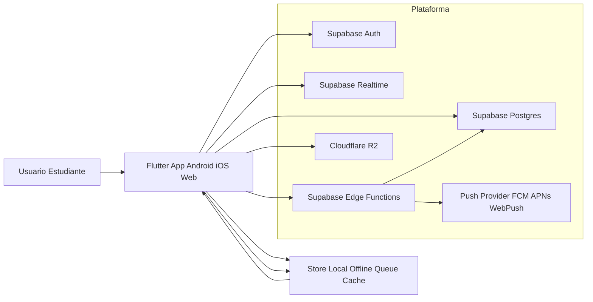
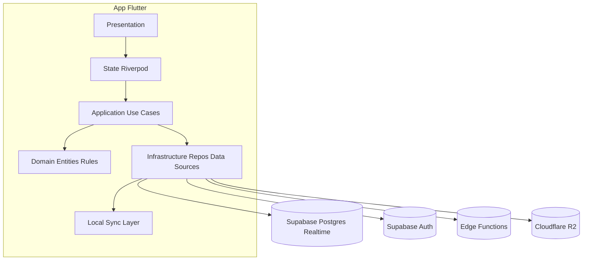
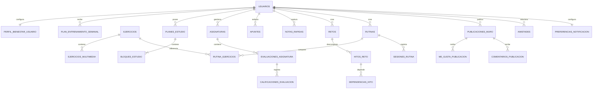
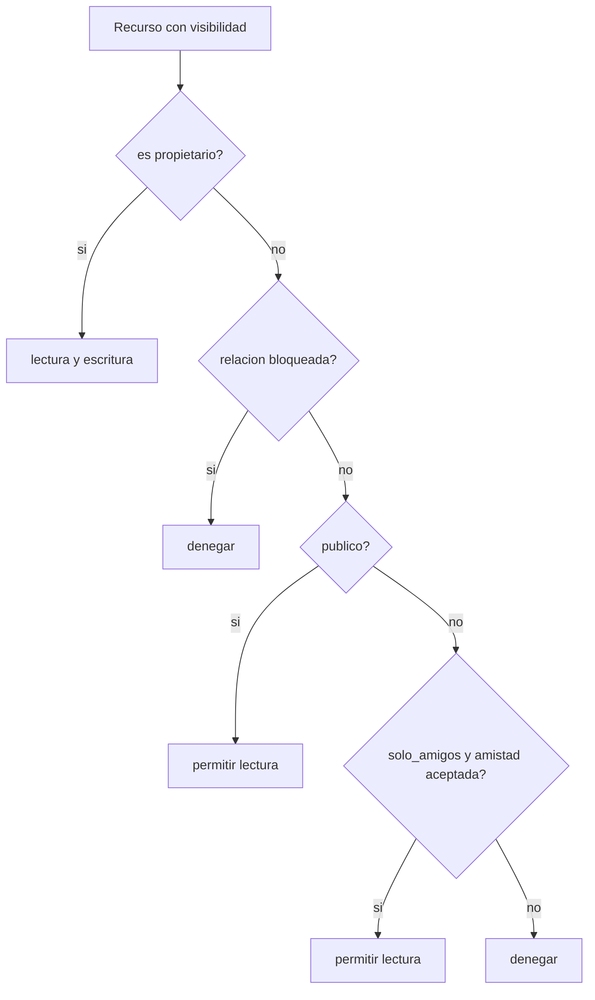
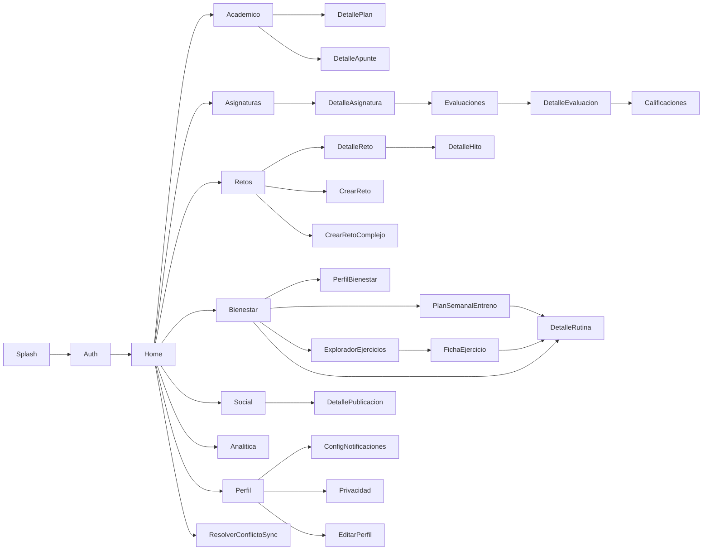

# 03 - Arquitectura del Sistema (SynaptixFit)

**Versión:** 2.5  
**Estado:** APROBADO  
**Fecha:** 19-04-2026  
**Autor:** Arquitectura  
**Referencia:** [02-requirements.md](02-requirements.md) (SRS v2.5)

## 1. Objetivo
Definir la arquitectura base para SynaptixFit (Flutter movil/web + backend gestionado), alineada con los casos de uso CU-01 a CU-19:
1. Estructura de carpetas y modulos.
2. Modelo de datos y permisos.
3. Contratos de servicios.
4. Estrategia tecnica por fases (MVP y crecimiento).

Este RFC no implementa logica final. Fija cimientos para desarrollo con foco en seguridad, escalabilidad gradual y viabilidad para TFG.

## 2. Decisiones de arquitectura

### 2.1 Stack principal
- Auth: Supabase Auth.
- Datos: Supabase Postgres.
- Realtime: Supabase Realtime.
- Orquestacion sensible: Supabase Edge Functions.
- Archivos: Cloudflare R2.
- Estado app: Riverpod.
- Persistencia local para offline-first: capa local (SQLite/Isar) desacoplada por repositorio.

### 2.2 Justificacion
1. Menor tiempo de salida para TFG con backend gestionado.
2. Modelo relacional robusto para trazabilidad y permisos.
3. Seguridad por RLS y politicas de acceso por visibilidad.
4. Soporte a flujos nuevos del SRS: perfil extendido, asignaturas con evaluaciones/calificaciones, retos complejos, bienestar con recomendacion adaptativa de entrenamiento, seleccion de ejercicios para rutinas, notificaciones adaptativas y sincronizacion offline.
5. Separacion de responsabilidades de datos: metadatos de ejercicios en Supabase y archivos multimedia en Cloudflare R2.

### 2.3 Decision de proveedor para catalogo de ejercicios
1. Proveedor fuente adoptado: ExerciseDB (AscendAPI), distribuido en Kaggle.
2. El repositorio `exercisedb-api` en GitHub se considera soporte de documentacion y licencia, no fuente principal de datos pesados.
3. Principio operativo vigente: el cliente Flutter no consumira APIs externas en runtime para pantallas core; los metadatos viviran en Supabase y la multimedia en Cloudflare R2.
4. Resultado esperado: Flutter consulta solo infraestructura propia (Supabase + R2), con refresco batch controlado del dataset.

### 2.4 Plan operativo de ingesta ExerciseDB (Kaggle -> Supabase + Cloudflare R2)
1. Objetivo de arquitectura: extraer, normalizar y alojar catalogo en infraestructura propia para eliminar dependencia runtime de terceros.
2. Estado de ejecucion: pipeline activo con proveedor aprobado.

#### 2.4.1 Obtener dataset oficial desde Kaggle
1. Buscar en Kaggle el dataset oficial de AscendAPI: Fitness Exercises Dataset (ExerciseDB).
2. Descargar el paquete completo (ZIP).
3. Verificar estructura minima requerida para SynaptixFit:
  - `exercises.json`
  - `muscles.json`
  - `equipments.json`
  - `bodyParts.json`
  - `gifs_180x180/` (resolucion abierta recomendada para MVP)

#### 2.4.2 Cargar a infraestructura propia
1. Traducir JSON fuente al espanol para campos funcionales del cliente (nombre, listas catalogo e instrucciones).
2. Normalizar JSON traducido al esquema interno de Supabase.
2. Subir multimedia de `gifs_180x180/` a bucket R2.
3. Persistir en Supabase metadatos y referencias (`r2_object_key` / URL firmada).

#### 2.4.3 Nota historica de decision
1. wger (Docker y API REST) queda documentado como alternativa descartada temporalmente por incidencias operativas y calidad de datos/multimedia insuficiente para MVP.

## 3. Arquitectura de alto nivel



## 4. Arquitectura logica por modulos



## 5. Estructura de carpetas propuesta

```text
synaptixfit/
  docs/
    02-requirements.md
    03-architecture-rfc.md

  app/
    lib/
      core/
        errors/
        utils/
        config/
        routing/
        design_system/
        sync/
      shared/
        widgets/
        services/
        models/
      features/
        auth/
          presentation/
          application/
          domain/
          infrastructure/
        academico/
          presentation/
          application/
          domain/
          infrastructure/
        retos/
          presentation/
          application/
          domain/
          infrastructure/
        bienestar/
          presentation/
          application/
          domain/
          infrastructure/
        social/
          presentation/
          application/
          domain/
          infrastructure/
        notificaciones/
          presentation/
          application/
          domain/
          infrastructure/
        analitica/
          presentation/
          application/
          domain/
          infrastructure/
      main.dart
    test/
    integration_test/

  backend/
    data_pipeline/
      catalogo_ejercicios/
        raw/
        transformed/
        scripts/
          descargar_exercisedb_kaggle.py
          upload_media_r2.py
          transform_exercisedb_to_synaptixfit.py
          import_exercisedb_supabase.py
    supabase/
      migrations/
      policies/
      functions/
        clonar_reto_publico/
        publicar_logro/
        validar_reto_complejo/
        recomendaciones_carga/
        recomendar_plan_entrenamiento/
        recalcular_plan_bienestar/
        recordatorios_programados/
      config.toml
    cloudflare/
      workers/
        firmar_url_r2/
      wrangler.toml
```

## 6. Modelo de datos relacional

### 6.1 Tablas principales (MVP)
- usuarios
- amistades
- perfil_bienestar_usuario
- plan_entrenamiento_semanal
- ejercicios
- ejercicios_multimedia
- rutina_ejercicios
- asignaturas
- evaluaciones_asignatura
- calificaciones_evaluacion
- planes_estudio
- bloques_estudio
- apuntes
- notas_rapidas
- retos
- rutinas
- sesiones_rutina
- publicaciones_muro
- me_gusta_publicacion
- preferencias_notificacion

### 6.2 Tablas previstas por crecimiento (Fase 2)
- hitos_reto
- dependencias_hito
- comentarios_publicacion
- recomendaciones_carga (materializada o vista logica)

### 6.3 ER conceptual (actualizado)



### 6.4 Campos clave por tabla (extracto)

1. usuarios
- id (uuid, referencia auth.users.id)
- nombre_mostrar
- correo
- carrera
- biografia
- avatar_url
- perfil_visibilidad (publico, solo_amigos, privado)
- meta_semanal_horas
- autopost_logros_habilitado (bool)
- creado_en
- actualizado_en

2. amistades
- id (uuid)
- solicitante_id
- destinatario_id
- estado (pendiente, aceptada, rechazada, bloqueada)
- creado_en
- actualizado_en

3. perfil_bienestar_usuario
- id (uuid)
- usuario_id
- peso_kg
- altura_cm
- nivel_condicion (inicial, intermedio, avanzado)
- limitaciones_fisicas (texto, nullable)
- actualizado_en

4. plan_entrenamiento_semanal
- id (uuid)
- usuario_id
- semana_inicio
- sesiones_recomendadas
- carga_objetivo_min
- nivel_intensidad (baja, media, alta)
- estado (propuesto, confirmado, ajustado)
- generado_por (sistema, usuario)
- actualizado_en

5. ejercicios
- id (uuid)
- id_fuente_origen (en esquema actual existe `id_wger` como campo legado)
- nombre
- objetivo (fuerza, resistencia, movilidad, mixto)
- grupo_muscular_principal
- equipamiento
- nivel (inicial, intermedio, avanzado)
- instrucciones
- fuente_dataset
- licencia_dataset
- version_dataset
- activo (bool)
- actualizado_en

6. ejercicios_multimedia
- id (uuid)
- ejercicio_id
- tipo (gif, mp4, jpg)
- r2_object_key
- checksum (nullable)
- tamano_bytes (nullable)
- es_principal (bool)
- actualizado_en

7. rutina_ejercicios
- id (uuid)
- rutina_id
- ejercicio_id
- orden
- series (nullable)
- repeticiones (nullable)
- duracion_seg (nullable)
- descanso_seg (nullable)
- observaciones (nullable)
- creado_en

8. asignaturas
- id (uuid)
- propietario_id
- nombre
- codigo
- docente
- estado (activa, archivada)
- creado_en
- actualizado_en

9. evaluaciones_asignatura
- id (uuid)
- asignatura_id
- tipo (examen, practica, entrega, otro)
- titulo
- fecha_programada
- nota_objetivo
- creado_en
- actualizado_en

10. calificaciones_evaluacion
- id (uuid)
- evaluacion_id
- valor
- escala_min
- escala_max
- registrada_en
- observaciones

11. retos
- id (uuid)
- propietario_id
- titulo
- descripcion
- tipo (simple, complejo)
- valor_objetivo
- valor_progreso
- unidad
- vence_en
- reto_origen_id
- visibilidad (publico, privado, solo_amigos)
- estado (borrador, activo, pausado, completado, vencido, cancelado)
- creado_en
- actualizado_en

12. hitos_reto (fase 2)
- id (uuid)
- reto_id
- titulo
- descripcion
- orden
- valor_objetivo
- valor_progreso
- inicia_en
- vence_en
- estado (pendiente, activo, completado, bloqueado)
- creado_en

13. dependencias_hito (fase 2)
- id (uuid)
- hito_id
- depende_de_hito_id
- creado_en

14. notas_rapidas
- id (uuid)
- propietario_id
- asignatura_id (nullable)
- contenido
- creada_en
- actualizada_en

15. rutinas
- id (uuid)
- propietario_id
- titulo
- objetivo (fuerza, resistencia, movilidad, mixto)
- nivel_exigencia (baja, media, alta)
- duracion_estimada_min
- requiere_equipamiento (bool)
- estado (activa, pausada, archivada)
- creado_en
- actualizado_en

16. sesiones_rutina
- id (uuid)
- rutina_id
- usuario_id
- fecha_sesion
- duracion_real_min
- esfuerzo_percibido (1-10)
- fatiga_reportada (baja, media, alta)
- completada (bool)
- creado_en

17. preferencias_notificacion
- usuario_id
- recordatorio_estudio
- recordatorio_retos
- recordatorio_bienestar
- recordatorio_social
- franja_silencio_inicio
- franja_silencio_fin
- limite_diario_envios
- modo_examenes_habilitado
- actualizado_en

### 6.5 Estrategia de almacenamiento del catalogo de ejercicios
1. Supabase almacena metadatos relacionales del catalogo (tabla ejercicios) y composicion de rutinas (rutina_ejercicios).
2. Cloudflare R2 almacena objetos multimedia de ejercicios (gif/mp4/jpg).
3. La app consume multimedia mediante URL firmada o mecanismo equivalente de acceso controlado.
4. El seeding actualiza metadatos y referencias de objetos sin acoplar el cliente a APIs externas en runtime.

### 6.6 Pipeline de ingesta ExerciseDB -> SynaptixFit (estado actual)
1. Estado: activo con proveedor aprobado (ExerciseDB via Kaggle).
2. Regla vigente: se ejecuta ingesta batch sobre copia local del dataset, sin llamadas runtime desde Flutter al proveedor externo.
3. Flujo operativo:
  - descargar ZIP oficial desde Kaggle,
  - traducir dataset con scripts locales de preprocesado,
  - transformar `exercises.json` + catalogos auxiliares,
  - cargar `gifs_180x180/` a R2,
  - importar metadatos a Supabase,
  - validar en Flutter con lote piloto antes de carga masiva.

## 7. Permisos y RLS

Visibilidad soportada: publico | privado | solo_amigos.



Reglas clave:
1. Solo propietario puede editar o borrar recursos propios.
2. publico permite lectura autenticada.
3. solo_amigos requiere amistad aceptada.
4. estado bloqueada en amistades anula visibilidad cruzada.
5. me gusta solo permitido si la publicacion es visible.
6. autopost de logros respeta preferencia del usuario.

## 8. Contratos de servicios

Nota: se prioriza supabase_flutter sobre PostgREST directo, con Edge Functions para validaciones criticas.

### 8.1 Repositorios de dominio
1. RepositorioPlanesEstudio
- crearPlan(input)
- actualizarPlan(planId, patch)
- eliminarPlan(planId)
- listarPlanesVisibles(filtros)

2. RepositorioApuntes
- crearApunte(input)
- actualizarApunte(apunteId, patch)
- eliminarApunte(apunteId)
- listarApuntesVisibles(filtros)

3. RepositorioAcademico
- crearAsignatura(input)
- actualizarAsignatura(asignaturaId, patch)
- archivarAsignatura(asignaturaId)
- crearEvaluacion(input)
- actualizarEvaluacion(evaluacionId, patch)
- registrarCalificacion(input)
- listarAsignaturasConProgreso(filtros)
- listarEvaluacionesPorCalendario(rango)

4. RepositorioRetos
- crearRetoSimple(input)
- crearRetoComplejo(input, hitos)
- reordenarHitos(retoId, nuevoOrden)
- actualizarProgresoReto(retoId, progreso)
- actualizarProgresoHito(hitoId, progreso)
- pausarReto(retoId)
- reprogramarReto(retoId, patchFechas)
- completarReto(retoId)
- clonarRetoPublico(retoId)
- listarRetosVisibles(filtros)

5. RepositorioBienestar
- guardarPerfilBienestar(input)
- obtenerPerfilBienestar(usuarioId)
- generarPlanSemanalRecomendado(usuarioId, semana)
- confirmarPlanSemanal(planId)
- recalcularPlanPorAdherencia(usuarioId, semana)
- crearRutina(input)
- listarCatalogoEjercicios(filtros, pagina)
- obtenerFichaEjercicio(ejercicioId)
- seleccionarEjerciciosParaRutina(rutinaId, ejerciciosOrdenados)
- reemplazarEjercicioEnRutina(rutinaId, ejercicioOrigenId, ejercicioNuevoId)
- obtenerUrlMediaEjercicio(ejercicioId)
- ejecutarPilotoCatalogoEjercicios(limite)
- completarRutina(rutinaId, sesionInput)
- listarRutinasVisibles(filtros)

6. RepositorioMuro
- listarMuro(pagina, tamanoPagina)
- darMeGusta(publicacionId)
- quitarMeGusta(publicacionId)

7. RepositorioNotificaciones
- actualizarPreferencias(input)
- obtenerPreferencias(usuarioId)
- previsualizarPlanEnvio(dia)

8. RepositorioAnalitica
- obtenerResumenSemanal(usuarioId, semana)
- detectarSobrecarga(usuarioId, semana)
- sugerirAjustes(usuarioId, semana)

9. RepositorioSincronizacion
- encolarOperacionLocal(operacion)
- sincronizarPendientes()
- resolverConflicto(conflictoId, estrategia)

### 8.2 RPC y Edge Functions sugeridas
1. rpc_clonar_reto_publico
- input: reto_id
- output: nuevo_reto_id
- validaciones: visibilidad publico, ownership, duplicado opcional

2. fn_publicar_logro
- input: tipo, referencia_id, mensaje?
- output: publicacion_id
- validaciones: evento valido, ownership, preferencia autopost

3. fn_validar_reto_complejo
- input: reto, hitos, dependencias
- output: valido(bool), errores[]

3.1 Regla de calculo de importancia por orden (server-side)
- El usuario no define pesos manuales.
- La importancia de cada hito se calcula automaticamente por el orden actual.
- Formula recomendada para n hitos y posicion i (1 = primer hito):
  importancia(i) = (n - i + 1) / (n * (n + 1) / 2)
- Al reordenar hitos, se recalcula el avance global del reto.

4. fn_recomendaciones_carga
- input: usuario_id, ventana
- output: sugerencias[]

4.1 fn_recomendar_plan_entrenamiento
- input: usuario_id, semana
- output: sesiones_recomendadas, carga_objetivo_min, intensidad, sugerencias[]
- validaciones: perfil_bienestar completo, disponibilidad minima, limites de seguridad

4.2 fn_recalcular_plan_bienestar
- input: usuario_id, semana, metricas_adherencia
- output: plan_ajustado
- validaciones: conservacion de dia de descanso, ajuste progresivo de carga

4.3 fn_sincronizar_catalogo_ejercicios
- input: fuente, version
- output: ejercicios_insertados, ejercicios_actualizados
- validaciones: licencia admitida, esquema valido, deduplicacion por clave natural

4.3.1 Fuente recomendada para MVP
- fuente por defecto: `exercisedb_kaggle`
- estrategia: sincronizacion batch desde dataset local validado para evitar dependencia de API publica en runtime

4.4 fn_resolver_media_r2_ejercicio
- input: ejercicio_id
- output: url_firmada, expira_en
- validaciones: objeto existente en R2, permisos de lectura del usuario

4.5 fn_importar_catalogo_exercisedb
- input: version, lote, dry_run
- output: resumen_importacion, errores_mapeo
- validaciones: integridad referencial entre ejercicios, multimedia, musculos y equipamiento

5. fn_recordatorios_programados (cron)
- input: none
- output: metricas_envio
- validaciones: franja_silencio, limite_diario, prioridad por urgencia

6. rpc_puede_acceder_recurso
- input: tipo_recurso, recurso_id, usuario_id
- output: permitido(bool), motivo

### 8.3 Realtime (canales)
1. canal_muro
- evento: insert en publicaciones_muro
- uso: refresco de feed

2. canal_retos_usuario
- evento: update en retos y hitos_reto
- uso: progreso en tiempo real

3. canal_amistades
- evento: update en amistades
- uso: solicitudes, aceptaciones, bloqueos

4. canal_notificaciones_usuario
- evento: eventos de recordatorios programados
- uso: refresco de centro de avisos

5. canal_bienestar_usuario
- evento: update en plan_entrenamiento_semanal y sesiones_rutina
- uso: refresco de recomendacion y adherencia semanal

6. canal_catalogo_ejercicios
- evento: update en ejercicios y rutina_ejercicios
- uso: refresco de explorador/ficha cuando haya cambios de catalogo

## 9. Navegacion y mapa de pantallas



## 10. Estrategia tecnica por fases

1. Sprint 1 (MVP)
- Base Flutter + Supabase Auth + Perfil.
- Estructura clean architecture, Riverpod y routing.

2. Sprint 2 (MVP)
- Modulo academico: asignaturas, planes, bloques, apuntes y notas rapidas.
- RLS de visibilidad y amistades.

3. Sprint 3 (MVP)
- Evaluaciones y calificaciones por asignatura.
- Retos simples, clonacion y estados.
- Perfil de bienestar, recomendacion semanal de entrenamiento, piloto de catalogo de ejercicios (10-20 ejercicios), seleccion de ejercicios por rutina, rutinas y sesiones completadas.

4. Sprint 4 (MVP)
- Carga y entrega de multimedia de ejercicios en R2 (con acceso firmado).
- Ingesta completa del catalogo ExerciseDB (AscendAPI via Kaggle) tras piloto validado.
- Feed, me gusta, notificaciones base.
- Preferencias de aviso y autopost.
- Hardening de seguridad y observabilidad.

5. Sprint 5 (post-MVP, Fase 2)
- Retos complejos por hitos y dependencias.
- Analitica de sobrecarga y recomendaciones avanzadas (academicas y bienestar).
- Sincronizacion offline avanzada con resolucion de conflictos.

## 11. Riesgos tecnicos y decisiones abiertas

### 11.1 Riesgos
1. Complejidad RLS combinando visibilidad, amistad y bloqueo.
2. Coste de consultas en feed con reglas de acceso.
3. Sincronizacion offline con conflictos en recursos sensibles.
4. Riesgo de sobre-notificacion si no se aplica priorizacion.
5. Inconsistencias de progreso academico si no se valida escala de calificaciones.
6. Riesgo de recomendaciones de entrenamiento poco realistas sin datos fisicos actualizados.
7. Riesgo de privacidad por manejo de datos fisicos sensibles.
8. Riesgo de desalineacion entre metadatos en Supabase y objetos multimedia en R2.
9. Riesgo de incumplimiento de licencias al importar dataset de ejercicios.
10. Riesgo operativo al usar pipelines dependientes de tooling externo no estandarizado entre equipos.

### 11.2 Decisiones abiertas
1. Alcance exacto de lectura publica (solo autenticados vs anonimo).
2. Entrada de comentarios en MVP o Fase 2.
3. Estrategia de resolucion por defecto en conflictos (ultima escritura gana vs resolucion manual segun entidad).
4. Politica final de recomendaciones de carga (solo sugerir vs autoaplicar).
5. Definicion de proveedor push unico o mixto por plataforma.
6. Politica de expiracion/retencion historica para datos de bienestar y sesiones.
7. Politica de expiracion para URL firmadas de R2 por tipo de cliente (movil/web).
8. Cadencia de refresco del dataset de ejercicios (manual, semanal o mensual).
9. Politica de versionado y actualizacion incremental del dataset ExerciseDB (diff por version y rollback de lote).

## 12. Criterio de aprobacion RFC
Aprobar este RFC habilita:
1. Definir esquema fisico SQL final (indices, constraints, politicas RLS).
2. Crear backlog tecnico por historias y casos de uso CU-01..CU-19.
3. Implementar base MVP y roadmap de Fase 2 sin rehacer arquitectura.
