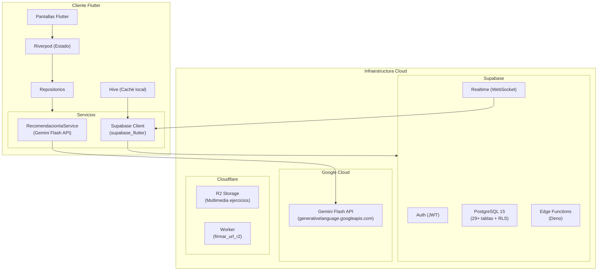
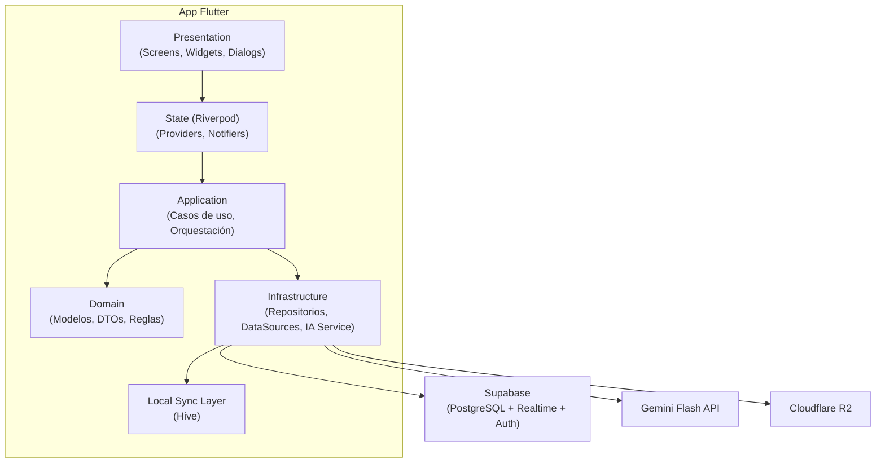
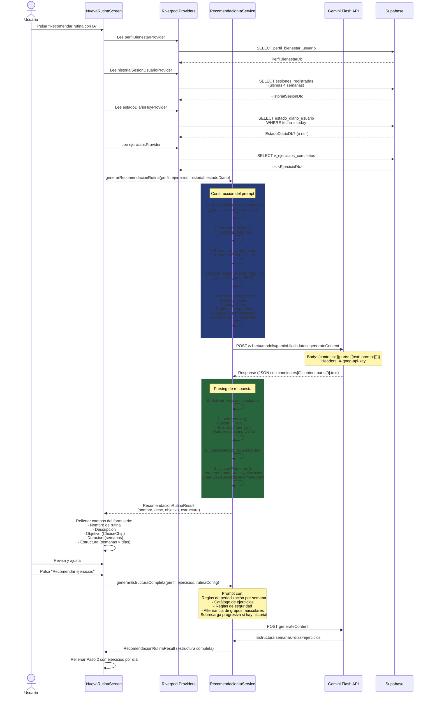
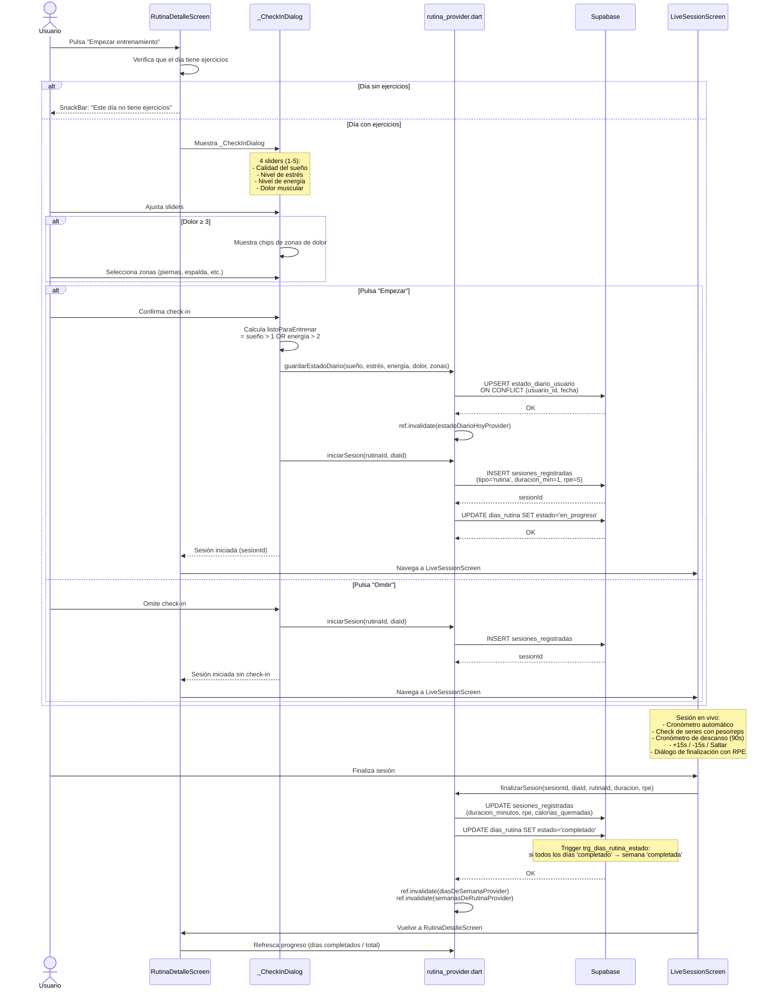
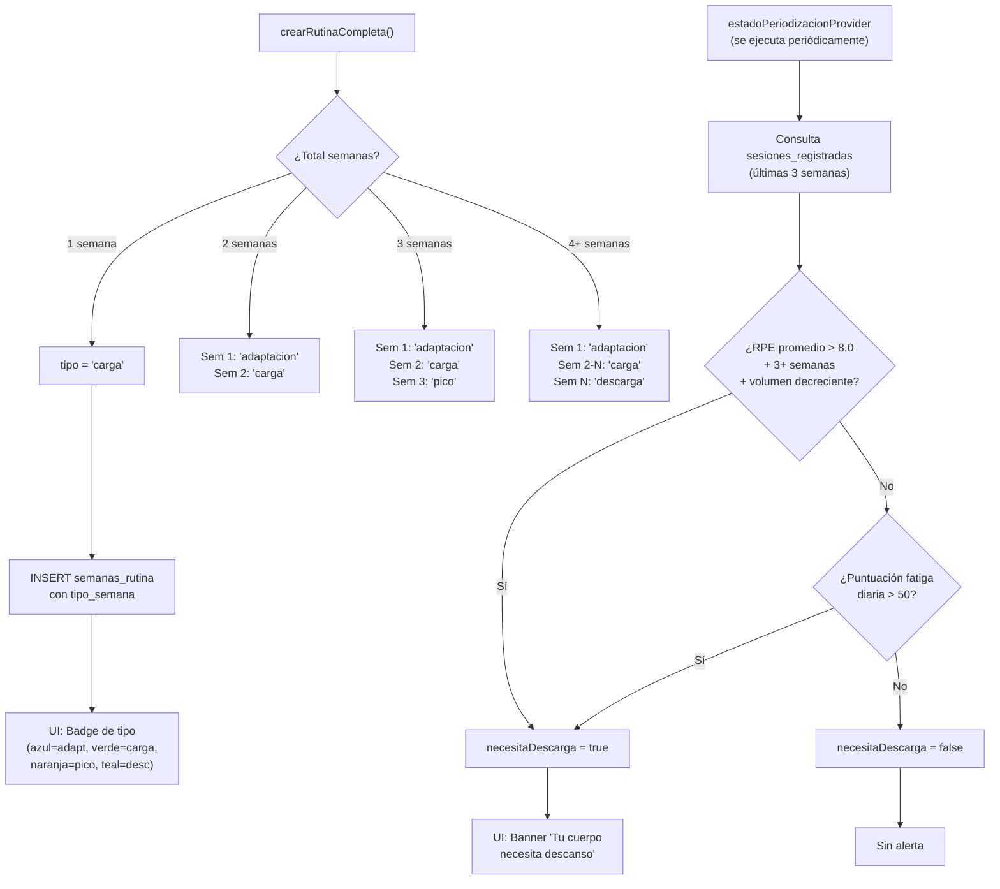
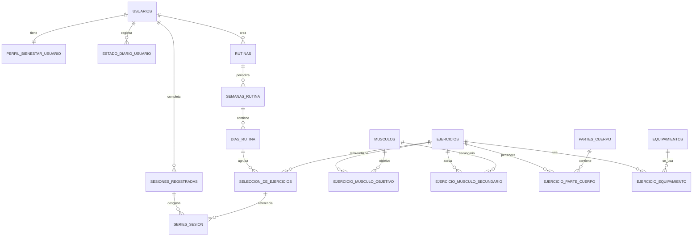
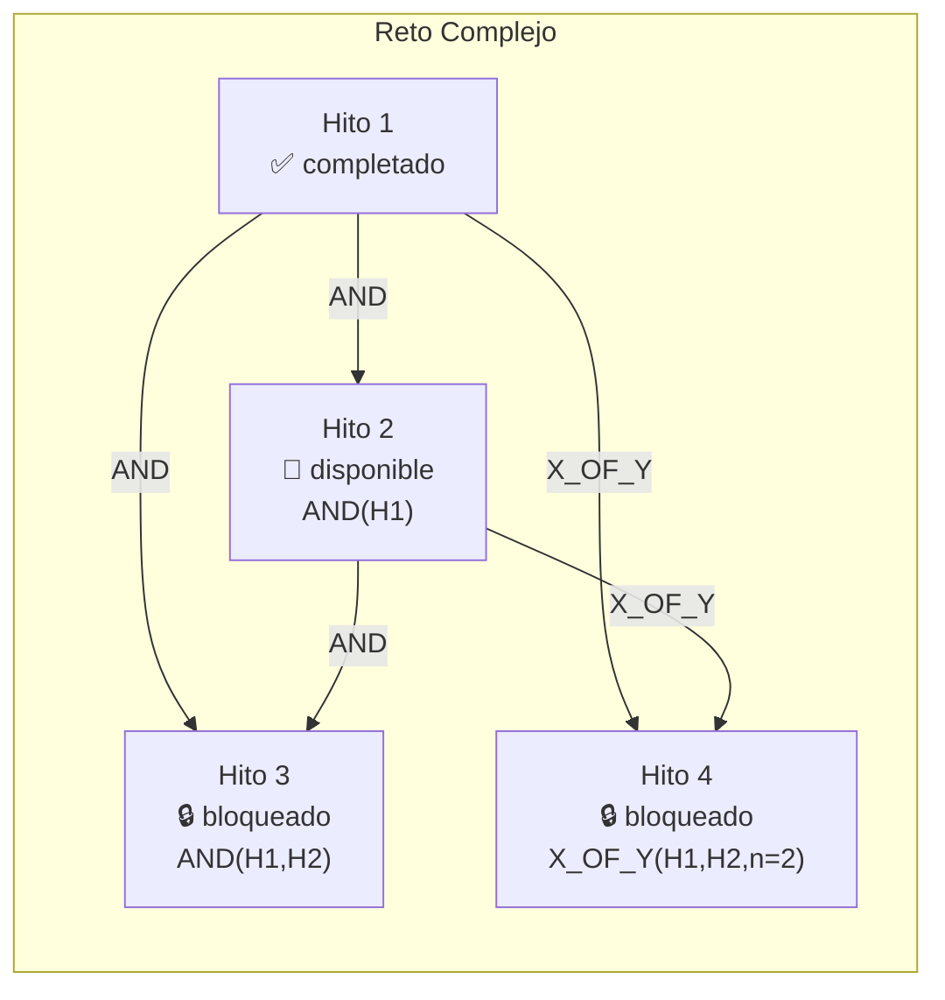
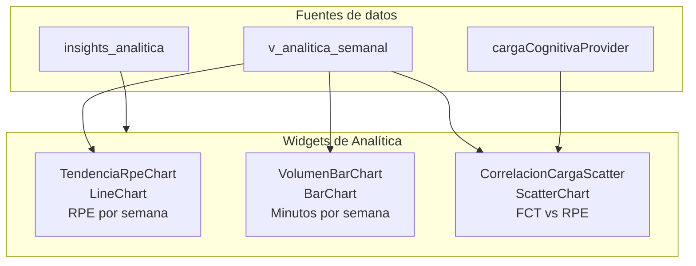
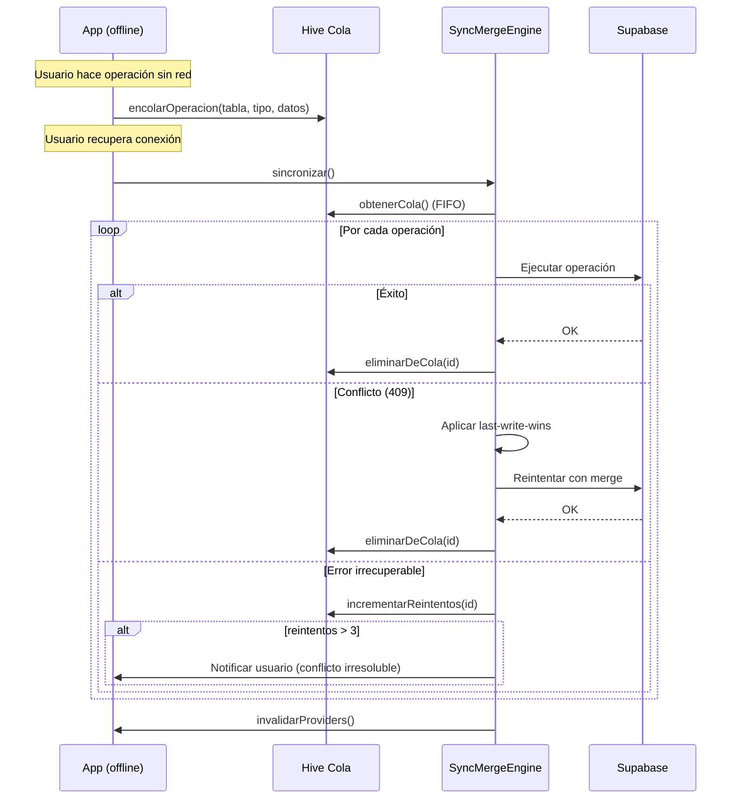

# 03 - Arquitectura del Sistema (SynaptixFit)

**Versión:** 5.1
**Estado:** APROBADO
**Fecha:** 14-06-2026
**Autor:** Arquitectura
**Referencia:** [02-requirements.md](02-requirements.md) (SRS v3.4)

## 1. Objetivo

Definir la arquitectura completa de SynaptixFit (Flutter móvil/web + Supabase + Gemini IA + Motor de Reglas Determinista), cubriendo:
1. Estructura de carpetas y módulos (incluyendo Fases 0-10 del Motor de Recomendaciones).
2. Modelo de datos y permisos (RLS) — 29 tablas.
3. Contratos de servicios (7 servicios de infraestructura nuevos).
4. Arquitectura del servicio de IA (Gemini Flash) + Motor de Reglas Determinista.
5. Sistema de check-in diario, periodización y feedback post-entrenamiento.
6. Estrategia técnica por fases (MVP → Crecimiento).

## 2. Decisiones de Arquitectura

### 2.1 Stack principal

| Capa | Tecnología | Justificación |
|------|-----------|---------------|
| **Frontend** | Flutter 3.x (Dart) + Riverpod + GoRouter | Multiplataforma, estado reactivo, routing declarativo |
| **Base de datos** | Supabase PostgreSQL 15 | Relacional, RLS nativo, Realtime |
| **Autenticación** | Supabase Auth (Google OAuth + Email) | JWT, refresh tokens, proveedores sociales |
| **Tiempo real** | Supabase Realtime (WebSocket) | Sincronización en vivo de catálogo y sesiones |
| **IA generativa** | Gemini Flash API (REST) | Cliente-side vía `dio`, sin SDK de Google |
| **Almacenamiento** | Cloudflare R2 + Worker de proxy | Multimedia de ejercicios, URLs públicas |
| **Persistencia local** | Hive | Caché offline, cola de sincronización |

### 2.2 ¿Por qué Gemini Flash y no otra IA?

| Criterio | Gemini Flash | OpenAI GPT-4o | Anthropic Claude |
|----------|-------------|---------------|-----------------|
| Latencia típica | ~2-3s | ~3-5s | ~4-6s |
| Capa gratuita | 15 RPM gratis | Pay-as-you-go | Pay-as-you-go |
| Calidad JSON | Buena con prompt engineering | Excelente | Buena |
| Disponibilidad | Global (Google Cloud) | Global | Global |

**Decisión:** Gemini Flash por su baja latencia (crítica para UX interactiva en entrenamiento) y capa gratuita generosa, adecuada para un TFG/MVP.

### 2.3 ¿Por qué IA en cliente y no en Edge Function?

| Opción | Ventaja | Desventaja |
|--------|---------|------------|
| **Cliente Flutter** (adoptado) | Sin latencia extra de red, sin coste de Edge Function, respuesta directa al UI | API key viaja en requests (mitigado: HTTPS) |
| **Edge Function Supabase** | API key nunca sale del backend | Doble latencia (cliente→Edge→Gemini→Edge→cliente), coste adicional |

**Decisión:** IA en cliente con `dio`. La API key de Gemini tiene scope limitado (solo generación de texto) y viaja sobre HTTPS. Para producción futura, se puede mover a Edge Function.

## 3. Arquitectura de Alto Nivel



## 4. Arquitectura Lógica por Módulos



## 5. Estructura de Carpetas

```
synaptixfit/
├── docs/                          # 18 archivos de documentación
├── app/
│   └── lib/
│       ├── core/                  # Errores, utils, config, routing, design system, sync
│       │   ├── config/
│       │   │   └── env_config.dart        # Lectura de .env (Supabase, Gemini, R2, Google)
│       │   └── routing/
│       │       ├── app_router.dart         # GoRouter con 20+ rutas
│       │       └── shell_route.dart        # StatefulShellRoute (5 tabs)
│       ├── shared/
│       │   ├── models/
│       │   │   └── db_models.dart          # 42+ modelos (~2330 líneas, incl. AsignaturaUsuarioSemestreDb)
│       │   ├── utils/
│       │   │   └── string_utils.dart       # ★ finalidadesEstandar + sanitizarObjetivo() (Fase 0)
│       │   └── widgets/
│       │       └── metric_gauge.dart        # ★ Gauge radial animado (248 líneas)
│       ├── features/
│       │   ├── auth/                       # Login, registro, onboarding
│       │   │   └── infrastructure/
│       │   │       ├── auth_repository.dart
│       │   │       └── bienestar_repository.dart  # CRUD perfil bienestar
│       │   ├── academico/                  # Planes, asignaturas, apuntes
│       │   ├── retos/                      # Retos simples y complejos
│       │   ├── bienestar/
│       │   │   ├── infrastructure/
│       │   │   │   ├── recomendacion_ia_service.dart        # ★ IA (1357 líneas) + refinarRutina() (Fase 6)
│       │   │   │   ├── recomendacion_reglas_service.dart    # ★ Motor de reglas determinista (Fase 2, 710 líneas)
│       │   │   │   ├── recomendacion_contexto_service.dart  # ★ Capa de contexto academia+fisiología (Fase 3, 381 líneas)
│       │   │   │   ├── recomendacion_orquestador_service.dart # ★ Orquestador del pipeline (Fase 8, 412 líneas)
│       │   │   │   ├── parametros_objetivo.dart             # ★ Tabla de 7 parámetros por objetivo (Fase 1, 196 líneas)
│       │   │   │   ├── progresion_calculator.dart           # ★ Sobrecarga progresiva con isométrico (Fase 4, 380 líneas)
│       │   │   │   ├── transicion_objetivo_service.dart     # ★ Transición entre objetivos (Fase 5, 155 líneas)
│       │   │   │   ├── feedback_engine.dart                 # ★ Feedback post-sesión (Fase 7, 130 líneas)
│       │   │   │   └── ejercicios_repository.dart
│       │   │   └── application/
│       │   │       ├── rutina_provider.dart                 # ★ 50+ providers incl. académicos y energéticos (1678 líneas)
│       │   │       ├── ejercicios_provider.dart
│       │   │       └── sesion_provider.dart
│       │   ├── social/                     # Muro, likes, comentarios
│       │   ├── notificaciones/             # Centro de notificaciones
│       │   ├── dashboard/                  # Dashboard principal
│       │   ├── perfil/                     # Perfil de usuario
│       │   ├── analitica/                  # Analítica avanzada — charts, correlaciones, insights (Sprint 7B)
│       │   └── sync/                       # Sincronización offline — connectivity_plus + cola Hive (Sprint 7C)
│       │   └── admin/                      # Panel de administración — wipe de datos, búsqueda de usuarios, rol admin
│       └── main.dart                       # Entry point, ProviderScope, Supabase.init
├── supabase/
│   ├── migrations/                         # 11 archivos de migración consolidados
│   └── seed_catalogo_v2.py                 # Seeding del catálogo académico v2 desde grados.json
├── cloudflare/
│   └── synaptixfit-r2-proxy/
│       └── worker.js                       # Proxy R2 con CORS
├── migraciones_pendientes.sql              # SQL consolidado para deploy manual
└── .env                                    # Variables de entorno (Supabase, Gemini, R2, Google OAuth)
```

## 6. Servicio de IA — Arquitectura en Profundidad

### 6.1 Diagrama de Secuencia: Recomendación de Rutina Completa



### 6.2 Diagrama de Secuencia: Check-in Diario y Sesión en Vivo



### 6.3 Diagrama de Flujo: Periodización Inteligente



## 7. Modelo de Datos Relacional (Resumen)

Ver [04-data-model.md](04-data-model.md) para el esquema SQL completo con RLS. A continuación el ER conceptual actualizado:



## 8. Servicio de IA — `RecomendacionIaService`

**Archivo:** `app/lib/features/bienestar/infrastructure/recomendacion_ia_service.dart` (1357 líneas)

### 8.1 DTOs (Data Transfer Objects)

| DTO | Propósito | Campos clave |
|-----|-----------|-------------|
| `EjercicioRecomendado` | Un ejercicio con sus parámetros sugeridos | `ejercicioId`, `series`, `repeticiones`, `segundosDescanso`, `pesoKg?` |
| `RecomendacionRutinaResult` | Resultado de recomendación de metadatos o estructura | `nombre`, `descripcion`, `objetivo`, `duracionSemanas`, `estructura` (Map<semana, Map<día, List<EjercicioRecomendado>>>), `error?` |
| `RecomendacionEjerciciosResult` | Resultado de sugerencia de ejercicios para un día | `ejercicios` (List<EjercicioRecomendado>), `error?` |
| `HistorialSesionDto` | Historial agregado de sesiones para contexto IA | `totalSesionesCompletadas`, `rpePromedio`, `volumenSemanalEstimado`, `ejerciciosRecientes`, `diasCompletadosUltimaSemana`, `semanasConsecutivasEntrenando`, `requiereDescarga` |
| `EjercicioRecienteDto` | Datos de un ejercicio del historial | `nombreEjercicio`, `pesoPromedio`, `repsPromedio`, `rpePromedio`, `ultimaFecha` |

### 8.2 Métodos del Servicio

#### `generarRecomendacionRutina()`
**Propósito:** Generar metadatos de una rutina (nombre, descripción, objetivo, duración, estructura semana×día) basados en el perfil, historial y estado diario.

**Parámetros:**
- `apiKey`: Clave de Gemini desde `.env`
- `perfil`: `PerfilBienestarDb` — datos antropométricos, objetivo, equipamiento, disponibilidad
- `ejerciciosDisponibles`: Catálogo completo de ejercicios (se filtra por equipamiento)
- `historial`: `HistorialSesionDto?` — historial de sesiones (opcional)
- `estadoDiario`: `EstadoDiarioDb?` — check-in del día (opcional)

**Flujo interno:**
1. Valida que `apiKey` no esté vacía → retorna error descriptivo
2. Filtra ejercicios por equipamiento compatible (`_ejercicioUsaEquipamiento`)
3. Si no hay ejercicios compatibles → retorna error con el equipamiento listado
4. Construye prompt con: perfil, historial formateado, estado diario, reglas de seguridad IMC, reglas de periodización, formato JSON esperado
5. Llama a `_callGemini()` → extrae JSON → parsea estructura
6. Si falla → retorna `RecomendacionRutinaResult` con `error`

**Estructura del prompt:** Ver sección 6.1 del código fuente. Incluye secciones: CONTEXTO DEL USUARIO, REGLAS DE SEGURIDAD, REGLAS DE EQUIPAMIENTO, HISTORIAL DEPORTIVO, REGLAS DE RECOMENDACIÓN SEGÚN OBJETIVO, PERIODIZACIÓN, FORMATO JSON ESPERADO.

#### `generarEstructuraCompleta()`
**Propósito:** Generar la estructura completa de ejercicios (semanas × días × ejercicios) para una rutina ya configurada.

**Diferencias con `generarRecomendacionRutina()`:**
- Recibe la rutina ya configurada (nombre, descripción, objetivo, semanas, días/semana)
- El prompt incluye reglas de periodización detalladas por semana (`_reglasPeriodizacion`)
- Incluye reglas de programación por objetivo (`_reglasPorObjetivo`)
- Incluye datos de sobrecarga progresiva si hay historial (`_formatearProgresion`)
- La respuesta solo incluye el campo `estructura` (no metadatos)
- Obliga a alternar grupos musculares entre días consecutivos

#### `generarRecomendacionEjercicios()`
**Propósito:** Sugerir 3-6 ejercicios adicionales para un día específico, sin repetir los ya agregados.

**Cuándo se usa:** En el Paso 2 de creación de rutina, por cada día, el botón "Sugerir ejercicios con IA".

**Particularidades:**
- El catálogo se filtra excluyendo `ejerciciosYaAgregados` (por `exerciseDbId`)
- El prompt incluye el catálogo filtrado completo como JSON embebido
- La respuesta es un array JSON, no un objeto con estructura
- Si la respuesta está vacía o no tiene ejercicios válidos → error

#### `generarProgresionEjercicio()`
**Propósito:** Sugerir la siguiente progresión de carga (peso/reps) para un ejercicio, basada en historial real.

**Reglas de progresión implementadas en el prompt:**

| RPE Última Sesión | Acción Recomendada |
|-------------------|-------------------|
| < 7 | Subir peso 5-10% o +1-2 reps (músculo infra-desafiado) |
| 7 - 8 | Subir peso 2.5-5% o mantener reps (zona óptima) |
| 8.5 - 9.5 | Mantener peso y reps (progresión sostenida) |
| = 10 (fallo) | **NO subir peso** en la próxima sesión |

**Modulación por objetivo:**
- `fuerza` → priorizar subir peso sobre reps
- `ganar_masa` → equilibrio peso/reps, rango 8-12
- `perder_peso` → mantener o bajar ligeramente peso, subir reps
- `resistencia` → mantener peso, subir reps

### 8.3 Helpers Privados

| Método | Propósito | Detalle |
|--------|-----------|---------|
| `_ejercicioUsaEquipamiento()` | Filtro de compatibilidad | Compara equipamiento del ejercicio con el del usuario. `peso_corporal` siempre es compatible. Incluye mapeo de equivalencias (mancuerna↔mancuernas, banda_elastica↔banda de resistencia, kettlebell↔pesa rusa) |
| `_reglasSeguridadIMC()` | Restricciones por biometría | Genera reglas condicionales: IMC>30→bajo impacto, IMC<18.5→evitar déficit, edad>50→fortalecimiento articular, edad<18→priorizar técnica |
| `_reglasPeriodizacion()` | Estructura de periodización | Para 4+ semanas: adaptación→carga→carga→descarga. Si `historial.requiereDescarga`, semana 1 es descarga. Para 2-3 semanas: adaptación→carga(+pico) |
| `_reglasPorObjetivo()` | Reglas de programación | Devuelve texto con reps, descanso, tipo de ejercicios según objetivo (fuerza/hipertrofia/resistencia/perder_peso/movilidad/fitness_general) |
| `_formatearHistorial()` | Contexto de historial | Formatea `HistorialSesionDto` a texto para el prompt. Incluye alerta si `requiereDescarga` |
| `_formatearEstadoDiario()` | Traducción fatiga→reglas | Convierte `EstadoDiarioDb` a instrucciones para IA: fatiga>50→reducir 30%, zonas dolor→sustituir, energía≤2→movilidad, sueño≤2→evitar peso muerto/squat máximo |
| `_formatearProgresion()` | Datos de sobrecarga | Lista los últimos 5 ejercicios con peso/reps/RPE para que la IA aplique progresión lógica |
| `_callGemini()` | Llamada HTTP a Gemini | POST a `generativelanguage.googleapis.com` con `X-goog-api-key`. Extrae texto de `candidates[0].content.parts[0].text` |
| `_extraerJson()` | Parsing robusto de JSON | 3 estrategias: (1) regex para bloques ```json...```, (2) búsqueda de primer `{` o `[`, (3) substring hasta último cierre. Previene fallos por Markdown espurio |
| `_parseError()` | Clasificación de errores | DioException 400/401/403→error de API key, otros→error de conexión. FormatException→JSON malformado. Genérico→mensaje truncado a 100 chars |

## 9. Sistema de Check-in Diario

### 9.1 Modelo `EstadoDiarioDb`

```dart
class EstadoDiarioDb {
  final int calidadSueno;    // 1 (muy mal) a 5 (excelente)
  final int nivelEstres;     // 1 (muy bajo) a 5 (muy alto)
  final int nivelEnergia;    // 1 (agotado) a 5 (pleno)
  final int dolorMuscular;   // 1 (ninguno) a 5 (intenso)
  final List<String> zonasDolor;  // ['piernas', 'espalda', 'hombros', ...]
  final bool listoParaEntrenar;   // sueño > 1 OR energía > 2

  // Puntuación compuesta 0-100 (mayor = peor estado)
  int get puntuacionFatiga {
    final suenoInv = (6 - calidadSueno) * 5;    // 0-25
    final estres = (nivelEstres - 1) * 5;       // 0-20
    final energiaInv = (6 - nivelEnergia) * 4;  // 0-20
    final dolor = (dolorMuscular - 1) * 7;      // 0-28
    return (suenoInv + estres + energiaInv + dolor).clamp(0, 100);
  }

  bool get requiereAdaptacion => puntuacionFatiga > 50;
}
```

### 9.2 Fórmula de Fatiga — Justificación

La fórmula pondera los 4 indicadores según su impacto en el rendimiento deportivo:

| Indicador | Peso | Rango | Justificación |
|-----------|------|-------|---------------|
| Sueño (invertido) | ×5 | 0-25 | El sueño es el factor #1 de recuperación (literatura: impacto directo en testosterona, cortisol, síntesis proteica) |
| Estrés | ×5 | 0-20 | Estrés elevado = cortisol alto = catabolismo. Afecta recuperación y motivación |
| Energía (invertido) | ×4 | 0-20 | Baja energía = sistema nervioso central fatigado. Riesgo de lesión por falta de concentración |
| Dolor muscular | ×7 | 0-28 | Mayor peso porque el dolor es la señal más directa de que el músculo no se ha recuperado. DOMS severo contraindica entrenamiento intenso |

**Umbral de adaptación (>50):** Seleccionado para que se active cuando al menos 2 indicadores están en valores malos (ej: sueño=2 + estrés=4 = 50 puntos) o 1 indicador está muy mal (dolor=5 = 28 puntos → necesita otros 22 de los demás).

### 9.3 Overlay `_CheckInOverlay` (durante el primer descanso)

Implementado como `_CheckInOverlay` dentro de `sesion_en_vivo_screen.dart`. Ya no es un diálogo bloqueante antes de empezar: el cronómetro arranca inmediatamente y el check-in se muestra como overlay no bloqueante durante el primer descanso:

```dart
// Flujo actual:
// 1. Usuario pulsa "Iniciar" → cronómetro visible de inmediato
// 2. Usuario completa 1ª serie → inicia descanso 90s
// 3. _lanzarCheckInOverlay() consulta estadoDiarioHoyProvider:
//    - Si ya existe check-in hoy → no muestra nada (silencio)
//    - Si no existe → muestra overlay con 4 sliders
// 4. Overlay: 4 sliders (1-5) + zonas de dolor si dolor>=3
// 5. Botones: "Guardar" (persiste) / "Omitir" (solo continúa)
```

**Importante (v3.4):** El overlay ya no muestra el mensaje "Ya has hecho check-in hoy". En su lugar, la verificación se hace antes de mostrar el overlay: si `estadoDiarioHoyProvider` devuelve un registro, el overlay simplemente no se muestra. Esto evita interrumpir al usuario innecesariamente.

**Indicador visual de fatiga:** Si `estadoDiarioHoyProvider` devuelve `requiereAdaptacion == true`, se muestra un banner naranja en `RutinaDetalleScreen` antes de iniciar la sesión: "Hoy tu cuerpo necesita un entrenamiento más ligero."

### 9.4 Integración con IA — `_formatearEstadoDiario()`

La IA recibe el estado diario traducido a reglas concretas:

```
ESTADO FISICO DE HOY (Check-in diario):
- Calidad del sueño: 2/5
- Nivel de estrés: 4/5
- Nivel de energía: 2/5
- Dolor muscular: 3/5
- Zonas con dolor: piernas, espalda
- Puntuación de fatiga: 67/100 (mayor = peor)
- ALERTA: El usuario necesita adaptación hoy. Reducir volumen un 30%.
  Evitar ejercicios en zonas con dolor.
- SUSTITUIR ejercicios que trabajen: piernas, espalda.
- Energía muy baja: priorizar movilidad y ejercicios de baja intensidad.
- Sueño deficiente: evitar ejercicios de alta demanda neuromuscular
  (peso muerto, squat máximo).
```

## 10. Sistema de Periodización Inteligente

### 10.1 Algoritmo `_calcularTipoSemana()`

```dart
String _calcularTipoSemana(int semanaNum, int totalSemanas) {
  if (totalSemanas <= 1) return 'carga';           // Rutina de 1 semana
  if (semanaNum == 1) return 'adaptacion';          // Primera semana siempre adaptación
  if (semanaNum == totalSemanas && totalSemanas >= 4) return 'descarga';  // Última de 4+ → descarga
  if (semanaNum == totalSemanas && totalSemanas >= 3) return 'pico';      // Última de 3 → pico
  return 'carga';                                   // Semanas intermedias → carga
}
```

**Tabla de decisión:**

| Total Semanas | Sem 1 | Sem 2 | Sem 3 | Sem 4 | Sem 5+ |
|---------------|-------|-------|-------|-------|--------|
| 1 | carga | — | — | — | — |
| 2 | adaptacion | carga | — | — | — |
| 3 | adaptacion | carga | pico | — | — |
| 4 | adaptacion | carga | carga | descarga | — |
| 5 | adaptacion | carga | carga | carga | descarga |

### 10.2 Detección de Necesidad de Descarga (`estadoPeriodizacionProvider`)

Algoritmo que se ejecuta periódicamente para detectar signos de sobre-entrenamiento:

```
1. Consultar sesiones_registradas de las últimas 3 semanas
2. Calcular RPE promedio de todas las sesiones
3. Agrupar volumen por semana (suma de duración en minutos)
4. Detectar si el volumen es decreciente (3 semanas consecutivas bajando)
5. Consultar check-in diario de hoy (estado_diario_usuario)
6. Calcular puntuación de fatiga diaria

necesitaDescarga = true SI:
  (RPE > 8.0 AND semanas ≥ 3 AND volumen decreciente)
  OR
  (puntuacionFatigaDiaria > 50)
```

**DTO `PeriodizacionEstado`:**

```dart
class PeriodizacionEstado {
  final bool necesitaDescarga;         // ¿Recomendar descarga?
  final double rpePromedioReciente;    // RPE promedio últimas 3 semanas
  final bool volumenDecreciente;       // ¿Volumen bajando 3 semanas?
  final int semanasConsecutivas;       // Semanas seguidas entrenando
  final int puntuacionFatigaDiaria;    // Puntuación del check-in de hoy
}
```

### 10.3 Badges Visuales en UI

En `RutinaDetalleScreen`, el selector horizontal de semanas muestra badges coloreados:

| Tipo | Color | Texto | Significado |
|------|-------|-------|-------------|
| `adaptacion` | Azul | "Adapt" | 70% volumen, énfasis en técnica |
| `carga` | Verde | "Carga" | 85-90% volumen, progresión |
| `pico` | Naranja | "Pico" | Máxima intensidad, volumen completo |
| `descarga` | Teal | "Desc" | 60% volumen, recuperación activa |

## 11. Barra de Progreso de Rutina

### 11.1 Cálculo

En `RutinaDetalleScreen`:

```dart
// Días completados / días totales
final diasCompletados = dias.where((d) => d.estado == 'completado').length;
final diasTotales = dias.length;
final progreso = diasTotales > 0 ? diasCompletados / diasTotales : 0.0;

// Tiempo acumulado: suma de duración de sesiones para los días de esta rutina
// vía tiempoDiaProvider(diaId)
```

### 11.2 Invalidaciones y Cascada

- Al marcar un día como completado → `diasDeSemanaProvider` + `semanasDeRutinaProvider(rutinaId)` se invalidan. El trigger `trg_dias_rutina_estado` en BD actualiza la semana automáticamente.
- Al añadir/quitar/editar ejercicios de un día → `ejerciciosDeDiaProvider(diaId)` + `nombresEjerciciosProvider(diaId)` se invalidan. Si el día estaba completado, se revierte a `pendiente` y el trigger de BD revierte la semana.
- Si un día tenía ejercicios y se vacía → el estado vuelve a `pendiente`
- Si un día no tiene ejercicios → botón "Iniciar" bloqueado con SnackBar

## 12. Proveedores Riverpod — Catálogo Completo

### 12.1 Módulo de Bienestar (IA + Periodización)

| Provider | Tipo | Propósito | Fuente de datos | Invalidación |
|----------|------|-----------|----------------|-------------|
| `perfilBienestarProvider` | `FutureProvider<PerfilBienestarDb?>` | Perfil físico del usuario | `BienestarRepository.obtenerPerfilBienestar()` → `perfil_bienestar_usuario` | Manual al editar perfil |
| `estadoDiarioHoyProvider` | `FutureProvider<EstadoDiarioDb?>` | Check-in del día actual | `estado_diario_usuario` WHERE fecha = today | `guardarEstadoDiario()` |
| `historialSesionUsuarioProvider` | `FutureProvider<HistorialSesionDto?>` | Historial agregado (4 semanas) | `sesiones_registradas` + `series_sesion` (JOIN) | Al completar sesión |
| `estadoPeriodizacionProvider` | `FutureProvider<PeriodizacionEstado>` | Detección de necesidad de descarga | `sesiones_registradas` (3 semanas) + `estado_diario_usuario` | Al completar sesión |
| `semanasDeRutinaProvider` | `FutureProvider.family<List<SemanaRutinaDb>, String>` | Semanas de una rutina | `semanas_rutina` WHERE rutina_id | Al crear/modificar semanas |
| `diasDeSemanaProvider` | `FutureProvider.family<List<DiaRutinaDb>, String>` | Días de una semana | `dias_rutina` WHERE semana_id | Al añadir día o cambiar estado |
| `ejerciciosDeDiaProvider` | `FutureProvider.family<List<SeleccionEjercicioDb>, String>` | Ejercicios de un día | `seleccion_de_ejercicios` WHERE dia_id | Al añadir/quitar/editar ejercicios |
| `nombresEjerciciosProvider` | `FutureProvider.family<Map<String, String>, String>` | Nombres de ejercicios de un día (JOIN) | `seleccion_de_ejercicios` JOIN `ejercicios` WHERE dia_id | Al añadir/quitar/editar ejercicios |
| `tiempoDiaProvider` | `FutureProvider.family<int, String>` | Duración de última sesión del día | `sesiones_registradas` WHERE dia_id (última) | Al finalizar sesión |
| `rutinasComunidadProvider` | `FutureProvider<List<RutinaComunidadDto>>` | Rutinas públicas de la comunidad | `rutinas` WHERE visibilidad='public' + JOIN `usuarios` | Manual |
| `rutinasUsuarioProvider` | `FutureProvider<List<RutinaDb>>` | Rutinas del usuario | `rutinas` WHERE usuario_id | Al crear/eliminar/clonar rutina |

### 12.1.1 Proveedores del Motor de Recomendaciones (Fases 0-10)

| Provider | Tipo | Propósito | Fuente de datos | Invalidación |
|----------|------|-----------|----------------|-------------|
| `geminiApiKeyProvider` | `Provider<String>` | API key de Gemini desde `.env` | `EnvConfig.geminiApiKey` | — |
| `recomendacionOrquestadorProvider` | `Provider<RecomendacionOrquestadorService>` | Orquestador del pipeline de 7 etapas | Instancia única, coordina 7 servicios | — |
| `generarRutinaProvider` | `FutureProvider.family<ResultadoGeneracion, ({String usuarioId, bool usarIa})>` | Pipeline completo: sanitización → reglas → contexto → transición → progresión → IA(opcional) | Invalida y recarga `perfilBienestar`, `ejercicios`, `historialSesion`, `estadoDiario` antes de ejecutar | Manual (botón "Generar") |

### 12.2 Funciones de Mutación (en `rutina_provider.dart`)

| Función | Operación | Tablas afectadas |
|---------|-----------|-----------------|
| `crearRutinaCompleta()` | INSERT | `rutinas` + `semanas_rutina` + `dias_rutina` + `seleccion_de_ejercicios` |
| `eliminarRutina()` | DELETE (CASCADE) | `rutinas` → cascada a semanas, días, ejercicios |
| `clonarRutina()` | INSERT (copia) | `rutinas` + `seleccion_de_ejercicios` (como privada) |
| `iniciarSesion()` | INSERT + UPDATE | `sesiones_registradas` + `dias_rutina.estado` |
| `finalizarSesion()` | UPDATE | `sesiones_registradas` (duración, RPE, calorías) + `dias_rutina.estado` (cascada a semana vía trigger) |
| `registrarSerie()` | INSERT | `series_sesion` |
| `guardarEstadoDiario()` | UPSERT | `estado_diario_usuario` ON CONFLICT (usuario_id, fecha) |
| `agregarEjercicioADia()` | INSERT | `seleccion_de_ejercicios` |
| `quitarEjercicioDeDia()` | DELETE | `seleccion_de_ejercicios` |
| `actualizarEjercicioDia()` | UPDATE | `seleccion_de_ejercicios` |
| `agregarDiaASemana()` | INSERT | `dias_rutina` |
| `actualizarEstadoSemana()` | UPDATE | `semanas_rutina.estado` |
| `actualizarEstadoDia()` | UPDATE | `dias_rutina.estado` |

### 12.3 Módulo de Ejercicios (Catálogo)

| Provider | Tipo | Propósito | Fuente |
|----------|------|-----------|--------|
| `ejerciciosProvider` | `StreamProvider<List<EjercicioDb>>` | Catálogo en tiempo real | `supabase.from('ejercicios').stream()` (Realtime) |
| `catalogosProvider` | `FutureProvider<CatalogosEjercicios>` | Listas de catálogo | `partes_cuerpo`, `musculos`, `equipamientos` |
| `ejerciciosFiltradosProvider` | `Family` | Búsqueda con filtros | `v_ejercicios_completos` con query params |
| `ejercicioDetalleProvider` | `FutureProvider.family<DetalleEjercicio?, String>` | Detalle de un ejercicio | `v_ejercicios_completos` WHERE id |

## 13. Estrategia Técnica por Fases

| Sprint | Alcance | Estado |
|--------|---------|--------|
| Sprint 1 | Base Flutter + Supabase Auth + Perfil + Clean Architecture | ✅ |
| Sprint 2 | Módulo académico (asignaturas, planes, bloques, apuntes) + RLS visibilidad | ✅ |
| Sprint 3 | Evaluaciones, calificaciones, retos, perfil bienestar, catálogo ejercicios, rutinas, sesiones | ✅ |
| Sprint 4 | Multimedia R2, ingesta completa ExerciseDB, feed social, notificaciones, hardening | ✅ |
| **Sprint 5** | **IA (Gemini), periodización, check-in diario, sobrecarga progresiva, perfil editable** | ✅ |
| **Sprint 6** | **Motor de Recomendaciones (Fases 0-10): reglas deterministas, contexto, transición, feedback, orquestador** | ✅ |
| Sprint 7 | Retos complejos con dependencias, analítica avanzada, sincronización offline | ✅ |

## 14. Riesgos Técnicos y Mitigaciones

| Riesgo | Impacto | Mitigación |
|--------|---------|-----------|
| API de Gemini no disponible | Alto — bloquea recomendaciones IA | Creación manual de rutinas siempre funciona. Timeout de 15s con Dio. |
| JSON malformado de Gemini | Medio — error en parsing | `_extraerJson()` con 3 estrategias de extracción. Error genérico sin crashear. |
| Fatiga mal calibrada sin check-in | Bajo — IA menos precisa | Check-in opcional. Sin datos, IA usa solo historial de sesiones. |
| Periodización mal aplicada | Medio — rutina inadecuada | Algoritmo determinista (`_calcularTipoSemana`). El usuario puede crear rutinas sin IA. |
| Coste de API en producción | Bajo (MVP) | Gemini Flash capa gratuita: 15 RPM. Prompts minimalistas (solo IDs). |

## 15. Arquitectura del Dashboard Rediseñado (v6.0)

### 15.1 Nuevos providers

| Provider | Tipo | Propósito |
|----------|------|-----------|
| `cargaCognitivaProvider` | `FutureProvider<CargaCognitivaData?>` | Factor de Carga Total (FCT) 0-100 combinando horas estudio, estrés, evaluaciones y sueño |
| `geminiServiceProvider` | `Provider<RecomendacionIaService>` | Instancia compartida del servicio Gemini para todo el app |
| `consejoSmartProvider` | `FutureProvider<SmartBannerState>` | Consejo IA con Gemini + cache Hive 1h + fallback determinista |
| `rutinaActivaSeleccionadaProvider` | `Provider<String?>` | ID de la primera rutina activa del usuario |

### 15.2 Layout del dashboard

ListView vertical con 8 secciones:
1. SaludoCard + StreakRow — avatar, nivel, XP, streaks
2. SmartBannerCard — consejo IA (Gemini o fallback)
3. QuickActionsRow — 4 chips: Pomodoro, Workout, Escanear, Nuevo reto
4. PlanWeekBar — "Semana X de Y" (condicional)
5. CognitiveLoadBar — barra de carga cognitiva (condicional)
6. EstadoSection — 3 MetricGauges (Energético, Adherencia, Carga)
7. KpiGrid — calorías + sesiones
8. TimelineSection — linea de tiempo unificada con 3 tabs (Hoy | Semana | Retos)

### 15.3 Estructura de archivos

```
features/dashboard/
├── application/
│   ├── dashboard_provider.dart    — DashboardData + dashboardProvider
│   └── smart_banner_provider.dart — consejoSmartProvider
├── domain/
│   └── smart_banner_dto.dart      — SmartBannerContext, SmartBannerState
└── presentation/
    ├── dashboard_screen.dart      — Pantalla principal (~355 líneas)
    └── widgets/                   — 12 widgets (SaludoCard, KpiGrid, RetosSection, etc.)
```

### 15.4 Hive para cache local

Se inicializa en `main.dart` vía `HiveConfig.init()`. Se usan 2 boxes:
- `smartcache` — cache del SmartBanner (TTL 1h)
- `offline_dash` — fallback offline del dashboard

---

## 16. Arquitectura de Retos con Dependencias (Sprint 7A)

### 16.1 Nuevas columnas en `hitos_de_reto`

| Columna | Tipo | Descripción |
|---------|------|-------------|
| `estado` | `TEXT` | `bloqueado`, `disponible`, `en_progreso`, `completado` (default: `bloqueado`) |
| `dependencias` | `UUID[]` | Array de IDs de hitos predecesores (vacío = sin dependencias) |
| `tipo_condicion` | `TEXT` | `AND` (todos), `OR` (al menos uno), `X_OF_Y` (n de m) |
| `condicion_n` | `INTEGER` | Para `X_OF_Y`: número requerido de predecesores completados |

### 16.2 Trigger `trg_hito_completado`

```sql
CREATE OR REPLACE FUNCTION desbloquear_hitos()
RETURNS TRIGGER AS $$
DECLARE
    hito RECORD;
    completados INT;
BEGIN
    -- Solo si el hito pasó a 'completado'
    IF NEW.estado = 'completado' AND OLD.estado != 'completado' THEN
        -- Iterar hitos que dependen de este
        FOR hito IN
            SELECT * FROM hitos_de_reto
            WHERE NEW.id = ANY(dependencias)
              AND reto_id = NEW.reto_id
        LOOP
            SELECT COUNT(*) INTO completados
            FROM hitos_de_reto
            WHERE id = ANY(hito.dependencias)
              AND estado = 'completado';

            -- Evaluar condición
            IF hito.tipo_condicion = 'AND' AND completados = array_length(hito.dependencias, 1) THEN
                UPDATE hitos_de_reto SET estado = 'disponible' WHERE id = hito.id;
            ELSIF hito.tipo_condicion = 'OR' AND completados >= 1 THEN
                UPDATE hitos_de_reto SET estado = 'disponible' WHERE id = hito.id;
            ELSIF hito.tipo_condicion = 'X_OF_Y' AND completados >= hito.condicion_n THEN
                UPDATE hitos_de_reto SET estado = 'disponible' WHERE id = hito.id;
            END IF;
        END LOOP;
    END IF;
    RETURN NEW;
END;
$$ LANGUAGE plpgsql;

CREATE TRIGGER trg_hito_completado
    AFTER UPDATE ON hitos_de_reto
    FOR EACH ROW EXECUTE FUNCTION desbloquear_hitos();
```

### 16.3 Modelo de datos — Grafo de dependencias



### 16.4 Providers de dependencias

| Provider | Tipo | Propósito |
|----------|------|-----------|
| `grafoRetoProvider` | `FutureProvider.family<GrafoDependencias, String>` | Construye el grafo completo de dependencias para un reto (nodos + aristas) |
| `puedeIniciarHitoProvider` | `FutureProvider.family<bool, ({String retoId, String hitoId})>` | Verifica si un hito específico está en estado `disponible` y puede iniciarse |
| `hitosDesbloqueadosProvider` | `FutureProvider.family<List<HitoDb>, String>` | Lista los hitos actualmente desbloqueados (`estado = 'disponible'`) para un reto |

### 16.5 Widget `GrafoDependencias`

- **Ubicación:** `app/lib/features/retos/presentation/widgets/grafo_dependencias.dart`
- **Tecnología:** `CustomPainter` para renderizado de grafos con nodos y aristas
- **Colores por estado:**
  - 🔴 `bloqueado` — rojo apagado
  - 🔵 `disponible` — azul primario
  - 🟡 `en_progreso` — ámbar
  - 🟢 `completado` — verde
- **Etiquetas en aristas:** `AND`, `OR`, `2/3` (para X_OF_Y)
- **Tooltips:** al tocar un nodo, muestra nombre del hito y condición requerida
- **Integración:** en `DetalleRetoScreen`, reemplaza la lista lineal de hitos

### 16.6 Corrección del disparo del trigger (Fase 2)

**Problema resuelto:** El trigger `trg_hito_completado` solo se dispara cuando la columna `estado` de `hitos_de_reto` cambia a `'completado'`. Anteriormente, `toggleTareaCompletada()` en Flutter solo actualizaba `progreso_actual` y `esta_completado`, sin tocar la columna `estado`, por lo que el trigger nunca se ejecutaba y los hitos dependientes no se desbloqueaban.

**Corrección:** `toggleTareaCompletada()` ahora actualiza la columna `estado`:
- Al completar un hito: `estado = 'completado'`
- Al descompletar un hito: `estado = 'en_progreso'`

Esto asegura que el trigger `trg_hito_completado` se dispare correctamente y la función `desbloquear_hitos()` evalúe las dependencias (AND/OR/X_OF_Y) para desbloquear los hitos sucesores.

---

## 17. Arquitectura de Analítica (Sprint 7B)

### 17.1 Vista agregada `v_analitica_semanal`

```sql
CREATE VIEW v_analitica_semanal AS
SELECT
    s.usuario_id,
    date_trunc('week', s.fecha_inicio)::DATE AS inicio_semana,
    COUNT(*) AS total_sesiones,
    ROUND(AVG(s.rpe)::numeric, 1) AS rpe_promedio,
    SUM(s.duracion_minutos) AS volumen_total_min,
    SUM(s.calorias_quemadas) AS calorias_totales,
    COUNT(DISTINCT e.nombre) AS ejercicios_distintos
FROM sesiones_registradas s
LEFT JOIN series_sesion ss ON s.id = ss.sesion_id
LEFT JOIN seleccion_de_ejercicios se ON ss.seleccion_ejercicio_id = se.id
LEFT JOIN ejercicios e ON se.ejercicio_id = e.id
GROUP BY s.usuario_id, date_trunc('week', s.fecha_inicio)
ORDER BY inicio_semana DESC;
```

### 17.2 Tabla `insights_analitica`

```sql
CREATE TABLE insights_analitica (
    id          UUID PRIMARY KEY DEFAULT gen_random_uuid(),
    usuario_id  UUID NOT NULL REFERENCES usuarios(id) ON DELETE CASCADE,
    tipo        TEXT NOT NULL,          -- 'tendencia', 'correlacion', 'recomendacion'
    titulo      TEXT NOT NULL,
    descripcion TEXT NOT NULL,
    datos_json  JSONB,                  -- Datos numéricos que respaldan el insight
    generado_en TIMESTAMPTZ NOT NULL DEFAULT now(),
    vigente_hasta TIMESTAMPTZ,         -- TTL opcional
    UNIQUE(usuario_id, tipo, titulo)
);

ALTER TABLE insights_analitica ENABLE ROW LEVEL SECURITY;
CREATE POLICY "Lectura owner" ON insights_analitica
    FOR SELECT USING (auth.uid() = usuario_id);
```

### 17.3 Providers de analítica

| Provider | Tipo | Propósito |
|----------|------|-----------|
| `analiticaSemanalProvider` | `FutureProvider<List<AnaliticaSemanalDto>>` | Datos agregados por semana (RPE, volumen, calorías) desde `v_analitica_semanal` |
| `tendenciaRpeProvider` | `FutureProvider<List<FlSpot>>` | Puntos (semana, RPE) para LineChart |
| `correlacionCargaProvider` | `FutureProvider<CorrelacionData?>` | Datos de correlación carga académica vs rendimiento para ScatterChart |
| `insightsAnaliticaProvider` | `FutureProvider<List<InsightAnaliticaDto>>` | Insights cacheados en `insights_analitica` (Gemini o deterministas) |
| `generarInsightsProvider` | `FutureProvider.family<void, String>` | Genera nuevos insights vía Gemini y los persiste en `insights_analitica` |

### 17.4 Charts con `fl_chart`



- **`TendenciaRpeChart`:** `LineChart` con puntos semanales + línea de tendencia (regresión simple). Tooltips al tocar punto.
- **`VolumenBarChart`:** `BarChart` con barras semanales, coloreadas según objetivo cumplido/excedido.
- **`CorrelacionCargaScatter`:** `ScatterChart` con FCT (eje X) vs RPE (eje Y). Línea de regresión opcional.

### 17.5 Integración en dashboard

Nueva sección `AnaliticaSection` en el dashboard (posición después de TimelineSection):
- Tab "Semanal": `TendenciaRpeChart` + `VolumenBarChart` en columna
- Tab "Mensual": agregación mensual con comparativa intermensual
- Tab "Insights": lista de insights generados + botón "Generar nuevos insights"

---

## 18. Arquitectura de Sincronización Offline (Sprint 7C)

### 18.1 Detección de conectividad

```dart
// connectivity_plus: ^6.1.0
final conectividadProvider = StreamProvider<List<ConnectivityResult>>((ref) {
  return Connectivity().onConnectivityChanged;
});

final isOnlineProvider = Provider<bool>((ref) {
  final conectividad = ref.watch(conectividadProvider);
  return conectividad.valueOrNull?.any((r) => r != ConnectivityResult.none) ?? true;
});
```

### 18.2 Cola Hive `offline_queue`

```dart
// Box: 'offline_queue' en Hive
class OperacionPendiente {
  final String id;            // UUID único de operación
  final String tabla;         // Tabla destino (ej. 'sesiones_registradas')
  final String tipo;          // 'insert', 'update', 'delete'
  final Map<String, dynamic> datos;
  final String? filtroId;     // Para updates/deletes: ID del registro
  final DateTime timestamp;   // Cuándo se encoló
  final int reintentos;       // Contador de reintentos (max 3)
}
```

### 18.3 Motor de merge `sync_merge_engine.dart`

**Archivo:** `app/lib/core/sync/sync_merge_engine.dart`



### 18.4 Widget `OfflineIndicator`

- **Ubicación:** `app/lib/core/sync/widgets/offline_indicator.dart`
- **Posición:** Barra superior persistente (debajo del AppBar) en todas las pantallas
- **Estados:**
  - 🟢 **Online:** sin indicador (se oculta)
  - 🟠 **Online sincronizando:** badge "Sincronizando X operaciones..." con spinner
  - 🔴 **Offline:** barra roja "Sin conexión — X operaciones pendientes"
  - ✅ **Sincronizado:** check verde fugaz (2s) "Todo sincronizado"

### 18.5 Integración con providers existentes

Todas las mutaciones en `rutina_provider.dart` y otros providers de escritura deben encapsularse:

```dart
Future<void> _ejecutarOEncolar({
  required String tabla,
  required String tipo,
  required Map<String, dynamic> datos,
  required Future<void> Function() operacionOnline,
}) async {
  final online = ref.read(isOnlineProvider);
  if (online) {
    await operacionOnline();
  } else {
    await _encolarOperacion(tabla: tabla, tipo: tipo, datos: datos);
  }
}
```

### 18.6 Nuevas dependencias

```yaml
# app/pubspec.yaml (adiciones)
dependencies:
  fl_chart: ^0.70.0
  connectivity_plus: ^6.1.0
```

### 18.7 Migraciones actuales

```
supabase/migrations/
├── 202606060049_esquema_base.sql          ← Esquema base (~12K líneas)
├── 202606120050_dependencias_retos.sql    ← Sprint 7A: dependencias entre hitos
├── 202606130001_marcar_semana_completada.sql ← Trigger de cascada semanas
├── 202606140001_v_analitica_semanal.sql   ← Sprint 7B: vista analítica
├── 20260616_0002_social_moderacion.sql    ← Sprint 9: moderación social
├── 20260616_0003_insignias.sql            ← Sprint 9: insignias y rachas
├── 20260616_0004_consolidacion_fixes.sql  ← Consolidación: tablas faltantes + columnas + índices
├── 20260616_0005_fechas_coherencia.sql    ← Sprint 9: coherencia de fechas en rutinas, retos y entregas
└── 20260616000006_admin_rol.sql           ← Panel de administración: columna rol, wipe_user_data, RLS admin
```

La migración `202606120050_dependencias_retos.sql` contiene:
- `ALTER TABLE hitos_de_reto ADD COLUMN estado ...`
- `ALTER TABLE hitos_de_reto ADD COLUMN dependencias UUID[] ...`
- `ALTER TABLE hitos_de_reto ADD COLUMN tipo_condicion ...`
- `ALTER TABLE hitos_de_reto ADD COLUMN condicion_n ...`
- `CREATE OR REPLACE FUNCTION desbloquear_hitos() ...`
- `CREATE TRIGGER trg_hito_completado ...`
- `CREATE VIEW v_analitica_semanal AS ...`
- `CREATE TABLE insights_analitica (...)`

---

**Documento compilado:** 12-06-2026
**Versión:** 4.2
**Clasificación:** PÚBLICO — Equipo jloen
