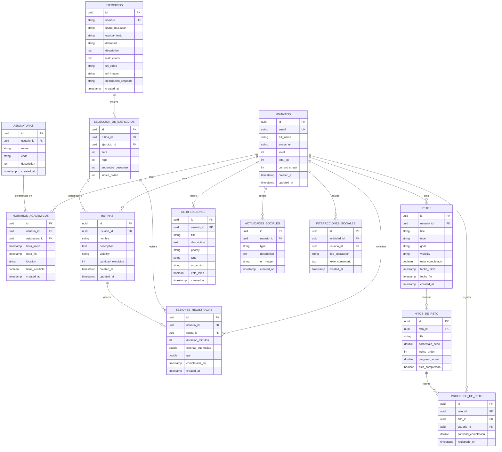

# 04 - Modelo de Datos (Supabase)

**Versión:** 1.0  
**Estado:** DISEÑO DE DATOS  
**Fecha:** 19-04-2026  
**Propósito:** Definición completa de tablas, relaciones, RLS y políticas Supabase

**Mapeo canónico entre documentos:**
- `usuarios` corresponde a los modelos funcionales de inicio de sesión, perfil físico, tablero principal, perfil de usuario y configuración de usuario.
- `ejercicios` corresponde a la lista y el detalle de ejercicios.
- `rutinas` y `seleccion_de_ejercicios` corresponden a la solicitud y guardado de rutinas.
- `sesiones_registradas` corresponde a la sesión completada, el tablero principal y el detalle de reto.
- `retos`, `hitos_de_reto` y `progreso_de_reto` corresponden a los modelos funcionales de retos.
- `notificaciones` corresponde a la notificación.
- `horarios_academicos` y `asignaturas` corresponden al horario académico y la asignatura.
- `perfil_academico_usuario` modela el contexto académico base del estudiante para personalización.
- `carga_academica_semanal` modela la carga real/percibida para ajustar entrenamiento y retos.
- `actividades_sociales` e `interacciones_sociales` correspon den a la actividad social y el elemento del muro social.

---

## 1. Diagrama Entidad-Relación (MVP)



---

## 2. Definición de Tablas

### 2.1 USUARIOS (tabla de usuarios)

```sql
CREATE TABLE usuarios (
  id UUID PRIMARY KEY DEFAULT gen_random_uuid(),
  email TEXT NOT NULL UNIQUE,
  nombre_completo TEXT NOT NULL,
  url_avatar TEXT,
  nivel INT DEFAULT 1,
  xp_total INT DEFAULT 0,
  racha_actual INT DEFAULT 0,
  id_perfil_fisico UUID,
  
  -- Metadatos
  creado_en TIMESTAMP DEFAULT now(),
  actualizado_en TIMESTAMP DEFAULT now(),
  eliminado_en TIMESTAMP,
  
  CONSTRAINT email_length CHECK (char_length(email) >= 5),
  CONSTRAINT nombre_completo_length CHECK (char_length(nombre_completo) >= 2)
);

CREATE INDEX idx_usuarios_email ON usuarios(email);
CREATE INDEX idx_usuarios_creado_en ON usuarios(created_at);
```

**Políticas RLS:**
```sql
-- Seleccionar: Cada usuario puede leer su propio perfil o perfiles públicos
CREATE POLICY "usuarios_seleccionar" ON usuarios
  FOR SELECT USING (
    auth.uid() = id OR 
    EXISTS(SELECT 1 FROM usuarios u WHERE u.id = auth.uid() AND u.nivel_privacidad = 'publico')
  );

-- Actualizar: Solo el usuario puede actualizar su propio perfil
CREATE POLICY "usuarios_actualizar" ON usuarios
  FOR UPDATE USING (auth.uid() = id);
```

---

### 2.2 EJERCICIOS (catalogo de ejercicios interno)

Fuente adoptada para seeding: ExerciseDB (AscendAPI) via Kaggle.

```sql
CREATE TABLE ejercicios (
  id UUID PRIMARY KEY DEFAULT gen_random_uuid(),
  nombre TEXT NOT NULL,
  grupo_muscular TEXT NOT NULL,
  equipamiento TEXT,
  dificultad TEXT DEFAULT 'medio',
  descripcion TEXT,
  instrucciones TEXT,
  url_video TEXT,  -- URL firmada de R2
  url_imagen TEXT,  -- URL firmada de R2
  descripcion_respaldo TEXT,
  
  -- Metadato de origen externo (campo legado; pendiente renombre a id_exercisedb)
  id_wger INT UNIQUE,
  creado_en TIMESTAMP DEFAULT now(),
  actualizado_en TIMESTAMP DEFAULT now(),
  
  CONSTRAINT nombre_length CHECK (char_length(nombre) >= 3),
  CONSTRAINT valid_muscle_group CHECK (grupo_muscular IN (
    'pecho', 'espalda', 'hombros', 'brazos', 'antebrazos', 
    'abdomen', 'oblicuos', 'espalda_baja', 'glúteos', 'cuádriceps', 
    'isquiotibiales', 'pantorrillas', 'múltiple'
  )),
  CONSTRAINT valid_equipment CHECK (equipamiento IN (
    'mancerna', 'barra', 'polea', 'máquina', 'peso_corporal', 
    'banda_elástica', 'kettlebell', 'medicina_ball'
  )),
  CONSTRAINT valid_difficulty CHECK (dificultad IN ('fácil', 'medio', 'difícil'))
);

CREATE INDEX idx_ejercicios_grupo_muscular ON ejercicios(grupo_muscular);
CREATE INDEX idx_ejercicios_equipamiento ON ejercicios(equipamiento);
CREATE INDEX idx_ejercicios_dificultad ON ejercicios(dificultad);
CREATE INDEX idx_ejercicios_id_wger ON ejercicios(id_wger);
CREATE FULL_TEXT_SEARCH INDEX idx_ejercicios_fts ON ejercicios USING GIN(
  to_tsvector('spanish', nombre || ' ' || descripcion)
);
```

**Políticas RLS:**
```sql
-- Seleccionar: Todos pueden leer ejercicios
CREATE POLICY "ejercicios_seleccionar" ON ejercicios
  FOR SELECT USING (true);
```

---

### 2.3 RUTINAS (rutinas de entrenamiento)

```sql
CREATE TABLE rutinas (
  id UUID PRIMARY KEY DEFAULT gen_random_uuid(),
  usuario_id UUID NOT NULL REFERENCES usuarios(id) ON DELETE CASCADE,
  nombre TEXT NOT NULL,
  descripcion TEXT,
  visibilidad TEXT DEFAULT 'private',
  cantidad_ejercicios INT DEFAULT 0,
  
  creado_en TIMESTAMP DEFAULT now(),
  actualizado_en TIMESTAMP DEFAULT now(),
  eliminado_en TIMESTAMP,
  
  CONSTRAINT nombre_length CHECK (char_length(nombre) >= 3),
  CONSTRAINT valid_visibility CHECK (visibilidad IN ('private', 'friends', 'public'))
);

CREATE INDEX idx_rutinas_usuario_id ON rutinas(usuario_id);
CREATE INDEX idx_rutinas_creado_en ON rutinas(creado_en);
CREATE INDEX idx_rutinas_visibilidad ON rutinas(visibilidad);
```

**Políticas RLS:**
```sql
-- Seleccionar: Propietario siempre, otros según visibilidad
CREATE POLICY "rutinas_seleccionar" ON rutinas
  FOR SELECT USING (
    auth.uid() = usuario_id OR 
    visibilidad != 'private'
  );

-- Insertar/Actualizar/Eliminar: Solo propietario
CREATE POLICY "rutinas_modificar" ON rutinas
  FOR ALL USING (auth.uid() = usuario_id);
```

---

### 2.4 SELECCIÓN DE EJERCICIOS (ejercicios en rutina)

```sql
CREATE TABLE seleccion_de_ejercicios (
  id UUID PRIMARY KEY DEFAULT gen_random_uuid(),
  rutina_id UUID NOT NULL REFERENCES rutinas(id) ON DELETE CASCADE,
  ejercicio_id UUID NOT NULL REFERENCES ejercicios(id) ON DELETE RESTRICT,
  series INT NOT NULL DEFAULT 3,
  repeticiones INT NOT NULL DEFAULT 10,
  segundos_descanso INT NOT NULL DEFAULT 90,
  indice_orden INT NOT NULL,
  
  CONSTRAINT valid_sets CHECK (series BETWEEN 1 AND 10),
  CONSTRAINT valid_reps CHECK (repeticiones BETWEEN 1 AND 100),
  CONSTRAINT valid_rest CHECK (segundos_descanso BETWEEN 30 AND 180),
  UNIQUE(rutina_id, ejercicio_id, indice_orden)
);

CREATE INDEX idx_seleccion_de_ejercicios_rutina_id ON seleccion_de_ejercicios(rutina_id);
CREATE INDEX idx_seleccion_de_ejercicios_ejercicio_id ON seleccion_de_ejercicios(ejercicio_id);
```

**Políticas RLS:**
```sql
-- Heredar de rutinas padre
CREATE POLICY "seleccion_de_ejercicios_seleccionar" ON seleccion_de_ejercicios
  FOR SELECT USING (
    EXISTS(SELECT 1 FROM rutinas r 
      WHERE r.id = rutina_id AND (
        auth.uid() = r.usuario_id OR r.visibility != 'private'
      ))
  );

CREATE POLICY "seleccion_de_ejercicios_modificar" ON seleccion_de_ejercicios
  FOR ALL USING (
    EXISTS(SELECT 1 FROM rutinas r 
      WHERE r.id = rutina_id AND auth.uid() = r.usuario_id)
  );
```

---

### 2.5 SESIONES REGISTRADAS (sesiones completadas)

```sql
CREATE TABLE sesiones_registradas (
  id UUID PRIMARY KEY DEFAULT gen_random_uuid(),
  usuario_id UUID NOT NULL REFERENCES usuarios(id) ON DELETE CASCADE,
  rutina_id UUID NOT NULL REFERENCES rutinas(id) ON DELETE SET NULL,
  duracion_minutos INT NOT NULL,
  calorias_quemadas DOUBLE PRECISION,
  rpe INT CHECK (rpe BETWEEN 1 AND 10), -- Escala de esfuerzo percibido
  
  completada_en TIMESTAMP NOT NULL,
  creado_en TIMESTAMP DEFAULT now(),
  
  CONSTRAINT valid_duration CHECK (duracion_minutos > 0)
);

CREATE INDEX idx_sesiones_registradas_usuario_id ON sesiones_registradas(usuario_id);
CREATE INDEX idx_sesiones_registradas_completada_en ON sesiones_registradas(completada_en);
CREATE INDEX idx_sesiones_registradas_rutina_id ON sesiones_registradas(rutina_id);
```

**Políticas RLS:**
```sql
-- Seleccionar: Usuario propio + amigos (si es público)
CREATE POLICY "sesiones_registradas_seleccionar" ON sesiones_registradas
  FOR SELECT USING (
    auth.uid() = usuario_id OR
    EXISTS(SELECT 1 FROM usuarios u 
      WHERE u.id = usuario_id AND u.nivel_privacidad = 'publico')
  );

-- Insertar: Solo usuario propio
CREATE POLICY "sesiones_registradas_insertar" ON sesiones_registradas
  FOR INSERT WITH CHECK (auth.uid() = usuario_id);

-- Actualizar/Eliminar: Solo usuario propio, en 5 minutos de creación
CREATE POLICY "sesiones_registradas_modificar" ON sesiones_registradas
  FOR ALL USING (
    auth.uid() = usuario_id AND 
    created_at > now() - INTERVAL '5 minutes'
  );
```

---

### 2.6 RETOS (retos)

```sql
CREATE TABLE retos (
  id UUID PRIMARY KEY DEFAULT gen_random_uuid(),
  usuario_id UUID NOT NULL REFERENCES usuarios(id) ON DELETE CASCADE,
  titulo TEXT NOT NULL,
  tipo TEXT NOT NULL, -- 'fitness', 'academic'
  meta TEXT NOT NULL,
  visibilidad TEXT DEFAULT 'private',
  esta_completado BOOLEAN DEFAULT false,
  
  fecha_inicio TIMESTAMP NOT NULL,
  fecha_fin TIMESTAMP NOT NULL,
  creado_en TIMESTAMP DEFAULT now(),
  actualizado_en TIMESTAMP DEFAULT now(),
  
  CONSTRAINT titulo_length CHECK (char_length(titulo) BETWEEN 5 AND 50),
  CONSTRAINT valid_type CHECK (tipo IN ('fitness', 'academic')),
  CONSTRAINT valid_dates CHECK (fecha_fin > fecha_inicio),
  CONSTRAINT valid_visibility CHECK (visibilidad IN ('private', 'friends', 'public'))
);

CREATE INDEX idx_retos_usuario_id ON retos(usuario_id);
CREATE INDEX idx_retos_creado_en ON retos(created_at);
CREATE INDEX idx_retos_esta_completado ON retos(esta_completado);
```

**Políticas RLS:**
```sql
-- Seleccionar: Propietario siempre, otros según visibilidad
CREATE POLICY "retos_seleccionar" ON retos
  FOR SELECT USING (
    auth.uid() = usuario_id OR 
    visibilidad != 'private'
  );

-- Insertar/Actualizar: Solo propietario
CREATE POLICY "retos_modificar" ON retos
  FOR ALL USING (auth.uid() = usuario_id);
```

---

### 2.7 HITOS DE RETO (hitos de reto)

```sql
CREATE TABLE hitos_de_reto (
  id UUID PRIMARY KEY DEFAULT gen_random_uuid(),
  reto_id UUID NOT NULL REFERENCES retos(id) ON DELETE CASCADE,
  titulo TEXT NOT NULL,
  porcentaje_peso DOUBLE PRECISION NOT NULL,
  indice_orden INT NOT NULL,
  progreso_actual DOUBLE PRECISION DEFAULT 0,
  esta_completado BOOLEAN DEFAULT false,
  
  CONSTRAINT titulo_length CHECK (char_length(titulo) BETWEEN 3 AND 50),
  CONSTRAINT valid_weight CHECK (porcentaje_peso BETWEEN 5 AND 100)
);

CREATE INDEX idx_hitos_de_reto_reto_id ON hitos_de_reto(reto_id);
CREATE UNIQUE INDEX idx_hitos_de_reto_orden ON hitos_de_reto(reto_id, indice_orden);
```

-- Validar que la suma de pesos de hitos sea exactamente 100%
CREATE FUNCTION validar_pesos_de_hitos()
RETURNS TRIGGER AS $$
BEGIN
  IF (SELECT SUM(porcentaje_peso) FROM hitos_de_reto 
      WHERE reto_id = NEW.reto_id) != 100 THEN
    RAISE EXCEPTION 'Suma de pesos de hitos debe ser 100%%';
  END IF;
  RETURN NEW;
END;
$$ LANGUAGE plpgsql;

CREATE TRIGGER trigger_validar_pesos_de_hitos
AFTER INSERT OR UPDATE ON hitos_de_reto
FOR EACH ROW EXECUTE FUNCTION validar_pesos_de_hitos();
```

---

### 2.8 PROGRESO DE RETO (registro de avance)

```sql
CREATE TABLE progreso_de_reto (
  id UUID PRIMARY KEY DEFAULT gen_random_uuid(),
  reto_id UUID NOT NULL REFERENCES retos(id) ON DELETE CASCADE,
  hito_id UUID REFERENCES hitos_de_reto(id) ON DELETE CASCADE, -- NULL si reto simple
  usuario_id UUID NOT NULL REFERENCES usuarios(id) ON DELETE CASCADE,
  cantidad_completada DOUBLE PRECISION NOT NULL,
  
  registrado_en TIMESTAMP NOT NULL,
  creado_en TIMESTAMP DEFAULT now(),
  
  CONSTRAINT valid_amount CHECK (cantidad_completada >= 0)
);

CREATE INDEX idx_progreso_de_reto_reto_id ON progreso_de_reto(reto_id);
CREATE INDEX idx_progreso_de_reto_hito_id ON progreso_de_reto(hito_id);
CREATE INDEX idx_progreso_de_reto_usuario_id ON progreso_de_reto(usuario_id);
CREATE INDEX idx_progreso_de_reto_registrado_en ON progreso_de_reto(registrado_en);
```

**Políticas RLS:**
```sql
-- Seleccionar: Usuario propio o reto es público
CREATE POLICY "progreso_de_reto_seleccionar" ON progreso_de_reto
  FOR SELECT USING (
    auth.uid() = usuario_id OR
    EXISTS(SELECT 1 FROM retos c 
      WHERE c.id = reto_id AND c.visibility = 'public')
  );

-- Insertar: Solo usuario propio
CREATE POLICY "progreso_de_reto_insertar" ON progreso_de_reto
  FOR INSERT WITH CHECK (auth.uid() = usuario_id);
```

---

### 2.9 NOTIFICACIONES (adaptativas)

```sql
CREATE TABLE notificaciones (
  id UUID PRIMARY KEY DEFAULT gen_random_uuid(),
  usuario_id UUID NOT NULL REFERENCES usuarios(id) ON DELETE CASCADE,
  titulo TEXT NOT NULL,
  descripcion TEXT,
  prioridad TEXT NOT NULL, -- 'critical', 'recommended', 'informative'
  tipo TEXT NOT NULL, -- 'conflict', 'fatigue_alert', 'milestone', 'social', 'academic'
  url_accion TEXT,
  etiqueta_accion TEXT,
  esta_leida BOOLEAN DEFAULT false,
  
  creado_en TIMESTAMP DEFAULT now(),
  leida_en TIMESTAMP,
  
  CONSTRAINT valid_priority CHECK (prioridad IN ('critical', 'recommended', 'informative')),
  CONSTRAINT valid_type CHECK (tipo IN ('conflict', 'fatigue_alert', 'milestone', 'social', 'academic'))
);

CREATE INDEX idx_notificaciones_usuario_id ON notificaciones(usuario_id);
CREATE INDEX idx_notificaciones_creado_en ON notificaciones(created_at);
CREATE INDEX idx_notificaciones_esta_leida ON notificaciones(esta_leida);
```

**Políticas RLS:**
```sql
-- Seleccionar/Actualizar: Solo usuario propio
CREATE POLICY "notificaciones_seleccionar" ON notificaciones
  FOR SELECT USING (auth.uid() = usuario_id);

CREATE POLICY "notificaciones_actualizar" ON notificaciones
  FOR UPDATE USING (auth.uid() = usuario_id);
```

---

### 2.10 HORARIOS ACADÉMICOS (calendario académico)

```sql
CREATE TABLE horarios_academicos (
  id UUID PRIMARY KEY DEFAULT gen_random_uuid(),
  usuario_id UUID NOT NULL REFERENCES usuarios(id) ON DELETE CASCADE,
  asignatura_id UUID NOT NULL REFERENCES asignaturas(id) ON DELETE CASCADE,
  hora_inicio TIMESTAMP NOT NULL,
  hora_fin TIMESTAMP NOT NULL,
  ubicacion TEXT,
  tiene_conflicto BOOLEAN DEFAULT false,
  
  creado_en TIMESTAMP DEFAULT now(),
  
  CONSTRAINT valid_times CHECK (hora_fin > hora_inicio),
  CONSTRAINT min_duration CHECK (EXTRACT(EPOCH FROM (hora_fin - hora_inicio)) >= 1800) -- 30 min
);

CREATE INDEX idx_horarios_academicos_usuario_id ON horarios_academicos(usuario_id);
CREATE INDEX idx_horarios_academicos_hora_inicio ON horarios_academicos(hora_inicio);
```

**Políticas RLS:**
```sql
-- Seleccionar/Modificar: Solo usuario propio
CREATE POLICY "horarios_academicos_todo" ON horarios_academicos
  FOR ALL USING (auth.uid() = usuario_id);
```

---

### 2.11 ASIGNATURAS (materias)

```sql
CREATE TABLE asignaturas (
  id UUID PRIMARY KEY DEFAULT gen_random_uuid(),
  usuario_id UUID NOT NULL REFERENCES usuarios(id) ON DELETE CASCADE,
  nombre TEXT NOT NULL,
  codigo TEXT,
  descripcion TEXT,
  dificultad_percibida INT NOT NULL DEFAULT 3,
  creditos INT NOT NULL DEFAULT 3,
  prioridad TEXT NOT NULL DEFAULT 'media',
  proxima_evaluacion TIMESTAMP,
  
  creado_en TIMESTAMP DEFAULT now(),
  
  CONSTRAINT nombre_length CHECK (char_length(nombre) >= 2),
  CONSTRAINT asignatura_dificultad_rango CHECK (dificultad_percibida BETWEEN 1 AND 5),
  CONSTRAINT asignatura_creditos_rango CHECK (creditos BETWEEN 1 AND 30),
  CONSTRAINT asignatura_prioridad_valida CHECK (prioridad IN ('baja', 'media', 'alta'))
);

CREATE INDEX idx_asignaturas_usuario_id ON asignaturas(usuario_id);
CREATE INDEX idx_asignaturas_proxima_evaluacion ON asignaturas(proxima_evaluacion);
```

**Políticas RLS:**
```sql
-- Todos: Solo usuario propio
CREATE POLICY "asignaturas_todo" ON asignaturas
  FOR ALL USING (auth.uid() = usuario_id);
```

---

### 2.11.1 PERFIL_ACADEMICO_USUARIO (contexto académico base)

```sql
CREATE TABLE perfil_academico_usuario (
  id UUID PRIMARY KEY DEFAULT gen_random_uuid(),
  usuario_id UUID NOT NULL UNIQUE REFERENCES usuarios(id) ON DELETE CASCADE,
  universidad TEXT,
  carrera TEXT,
  semestre_actual INT NOT NULL DEFAULT 1,
  modalidad TEXT NOT NULL DEFAULT 'presencial',
  creditos_semestre_actual INT NOT NULL DEFAULT 20,
  horas_objetivo_estudio_semana INT NOT NULL DEFAULT 14,
  promedio_objetivo DOUBLE PRECISION,
  creado_en TIMESTAMP DEFAULT now(),
  actualizado_en TIMESTAMP DEFAULT now(),

  CONSTRAINT perfil_acad_semestre_rango CHECK (semestre_actual BETWEEN 1 AND 20),
  CONSTRAINT perfil_acad_modalidad_valida CHECK (modalidad IN ('presencial', 'hibrida', 'virtual')),
  CONSTRAINT perfil_acad_creditos_rango CHECK (creditos_semestre_actual BETWEEN 1 AND 60),
  CONSTRAINT perfil_acad_horas_estudio_rango CHECK (horas_objetivo_estudio_semana BETWEEN 0 AND 80),
  CONSTRAINT perfil_acad_promedio_objetivo_rango CHECK (
    promedio_objetivo IS NULL OR (promedio_objetivo BETWEEN 0 AND 5)
  )
);

CREATE INDEX idx_perfil_academico_usuario_id ON perfil_academico_usuario(usuario_id);
```

**Políticas RLS:**
```sql
CREATE POLICY "perfil_academico_todo" ON perfil_academico_usuario
  FOR ALL USING (auth.uid() = usuario_id);
```

---

### 2.11.2 CARGA_ACADEMICA_SEMANAL (carga y estrés por semana)

```sql
CREATE TABLE carga_academica_semanal (
  id UUID PRIMARY KEY DEFAULT gen_random_uuid(),
  usuario_id UUID NOT NULL REFERENCES usuarios(id) ON DELETE CASCADE,
  semana_inicio DATE NOT NULL,
  horas_estudio_planeadas INT NOT NULL DEFAULT 0,
  horas_estudio_reales INT NOT NULL DEFAULT 0,
  evaluaciones_semana INT NOT NULL DEFAULT 0,
  entregas_semana INT NOT NULL DEFAULT 0,
  nivel_estres INT NOT NULL DEFAULT 5,
  horas_sueno_promedio DOUBLE PRECISION NOT NULL DEFAULT 7,
  notas TEXT,
  creado_en TIMESTAMP DEFAULT now(),
  actualizado_en TIMESTAMP DEFAULT now(),

  CONSTRAINT carga_acad_horas_planeadas_rango CHECK (horas_estudio_planeadas BETWEEN 0 AND 120),
  CONSTRAINT carga_acad_horas_reales_rango CHECK (horas_estudio_reales BETWEEN 0 AND 120),
  CONSTRAINT carga_acad_eval_rango CHECK (evaluaciones_semana BETWEEN 0 AND 20),
  CONSTRAINT carga_acad_entregas_rango CHECK (entregas_semana BETWEEN 0 AND 20),
  CONSTRAINT carga_acad_estres_rango CHECK (nivel_estres BETWEEN 1 AND 10),
  CONSTRAINT carga_acad_sueno_rango CHECK (horas_sueno_promedio BETWEEN 0 AND 14),
  UNIQUE(usuario_id, semana_inicio)
);

CREATE INDEX idx_carga_academica_usuario_id ON carga_academica_semanal(usuario_id);
CREATE INDEX idx_carga_academica_semana ON carga_academica_semanal(semana_inicio DESC);
```

**Políticas RLS:**
```sql
CREATE POLICY "carga_academica_todo" ON carga_academica_semanal
  FOR ALL USING (auth.uid() = usuario_id);
```

---

### 2.12 ACTIVIDADES SOCIALES (actividad social)

```sql
CREATE TABLE actividades_sociales (
  id UUID PRIMARY KEY DEFAULT gen_random_uuid(),
  usuario_id UUID NOT NULL REFERENCES usuarios(id) ON DELETE CASCADE,
  tipo TEXT NOT NULL, -- 'session_completed', 'challenge_completed', 'milestone_reached', 'badge_unlocked'
  descripcion TEXT NOT NULL,
  url_imagen TEXT, -- URL de R2
  
  creado_en TIMESTAMP DEFAULT now(),
  
  CONSTRAINT valid_type CHECK (tipo IN (
    'session_completed', 'challenge_completed', 'milestone_reached', 'badge_unlocked'
  ))
);

CREATE INDEX idx_actividades_sociales_usuario_id ON actividades_sociales(usuario_id);
CREATE INDEX idx_actividades_sociales_creado_en ON actividades_sociales(created_at);
```

**Políticas RLS:**
```sql
-- Seleccionar: Públicas siempre, privadas solo propietario
CREATE POLICY "actividades_sociales_seleccionar" ON actividades_sociales
  FOR SELECT USING (
    auth.uid() = usuario_id OR
    EXISTS(SELECT 1 FROM usuarios u 
      WHERE u.id = usuario_id AND u.nivel_privacidad = 'publico')
  );

-- Insertar: Solo usuario propio
CREATE POLICY "actividades_sociales_insertar" ON actividades_sociales
  FOR INSERT WITH CHECK (auth.uid() = usuario_id);
```

---

### 2.13 INTERACCIONES SOCIALES (me gusta / comentarios)

```sql
CREATE TABLE interacciones_sociales (
  id UUID PRIMARY KEY DEFAULT gen_random_uuid(),
  actividad_id UUID NOT NULL REFERENCES actividades_sociales(id) ON DELETE CASCADE,
  usuario_id UUID NOT NULL REFERENCES usuarios(id) ON DELETE CASCADE,
  tipo_interaccion TEXT NOT NULL, -- 'like', 'comment'
  texto_comentario TEXT,
  
  creado_en TIMESTAMP DEFAULT now(),
  
  CONSTRAINT valid_type CHECK (tipo_interaccion IN ('like', 'comment')),
  CONSTRAINT comment_length CHECK (
    tipo_interaccion != 'comment' OR char_length(texto_comentario) BETWEEN 1 AND 200
  ),
  UNIQUE(actividad_id, usuario_id, tipo_interaccion) -- Máximo 1 me gusta por usuario
);

CREATE INDEX idx_interacciones_sociales_actividad_id ON interacciones_sociales(actividad_id);
CREATE INDEX idx_interacciones_sociales_usuario_id ON interacciones_sociales(usuario_id);
```

**Políticas RLS:**
```sql
-- Seleccionar: Según privacidad de actividad
CREATE POLICY "interacciones_sociales_seleccionar" ON interacciones_sociales
  FOR SELECT USING (
    EXISTS(SELECT 1 FROM actividades_sociales sa 
      WHERE sa.id = actividad_id AND (
        auth.uid() = sa.usuario_id OR 
        EXISTS(SELECT 1 FROM usuarios u 
          WHERE u.id = sa.usuario_id AND u.nivel_privacidad = 'publico')
      ))
  );

-- Insertar: Solo usuario autenticado
CREATE POLICY "interacciones_sociales_insertar" ON interacciones_sociales
  FOR INSERT WITH CHECK (auth.uid() = usuario_id);

-- Eliminar: Solo propietario de la interacción
CREATE POLICY "interacciones_sociales_eliminar" ON interacciones_sociales
  FOR DELETE USING (auth.uid() = usuario_id);
```

---

## 3. Funciones de Negocio (Stored Procedures)

### 3.1 Detectar Conflictos Académico-Deportivos

```sql
CREATE FUNCTION detectar_conflictos_de_horario(p_usuario_id UUID, p_inicio_semana DATE)
RETURNS TABLE(
  id_conflicto UUID,
  id_bloque_estudio UUID,
  id_sesion_entrenamiento UUID,
  mensaje_conflicto TEXT
) AS $$
BEGIN
  RETURN QUERY
  SELECT 
    gen_random_uuid(),
    sc.id,
    sl.id,
    'Conflicto: Estudio solapado con entrenamiento el ' || to_char(sl.completada_en, 'DD/MM') || ' a las ' || to_char(sl.completada_en, 'HH24:MI')
  FROM horarios_academicos sc
  JOIN sesiones_registradas sl ON sc.usuario_id = sl.usuario_id
  WHERE sc.usuario_id = p_usuario_id
    AND DATE(sc.hora_inicio) >= p_inicio_semana
    AND DATE(sc.hora_inicio) < p_inicio_semana + INTERVAL '7 days'
    AND DATE(sl.completada_en) >= p_inicio_semana
    AND DATE(sl.completada_en) < p_inicio_semana + INTERVAL '7 days'
    -- Condición de solapamiento
    AND sc.hora_inicio < sl.completada_en + (sl.duracion_minutos || ' minutes')::INTERVAL
    AND sc.hora_fin > sl.completada_en;
END;
$$ LANGUAGE plpgsql STABLE;
```

### 3.2 Calcular Progreso de Reto

```sql
CREATE FUNCTION calcular_progreso_de_reto(p_reto_id UUID)
RETURNS DOUBLE PRECISION AS $$
DECLARE
  v_cantidad_hitos INT;
  v_progreso DOUBLE PRECISION;
BEGIN
  -- Si es reto simple
  IF NOT EXISTS(SELECT 1 FROM hitos_de_reto WHERE reto_id = p_reto_id) THEN
    RETURN COALESCE((
      SELECT SUM(cantidad_completada) 
      FROM progreso_de_reto 
      WHERE reto_id = p_reto_id
    ), 0);
  END IF;
  
  -- Si es reto complejo: ponderado por pesos
  RETURN COALESCE((
    SELECT SUM(
      (cm.porcentaje_peso / 100) * (
        COALESCE((
          SELECT SUM(cantidad_completada) 
          FROM progreso_de_reto 
          WHERE hito_id = cm.id
        ), 0) / 100
      )
    )
    FROM hitos_de_reto cm
    WHERE cm.reto_id = p_reto_id
  ), 0);
END;
$$ LANGUAGE plpgsql STABLE;
```

### 3.3 Incrementar XP y Nivel

```sql
CREATE FUNCTION otorgar_xp(p_usuario_id UUID, p_cantidad_xp INT)
RETURNS TABLE(
  nuevo_nivel INT,
  nueva_xp INT,
  sube_nivel BOOLEAN
) AS $$
DECLARE
  v_nivel_actual INT;
  v_xp_actual INT;
  v_xp_para_siguiente_nivel INT;
BEGIN
  SELECT level, xp_total INTO v_nivel_actual, v_xp_actual
  FROM usuarios WHERE id = p_usuario_id;
  
  v_xp_para_siguiente_nivel := 1000 * v_nivel_actual;
  
  IF v_xp_actual + p_cantidad_xp >= v_xp_para_siguiente_nivel THEN
    UPDATE usuarios 
    SET level = level + 1, 
        xp_total = (v_xp_actual + p_cantidad_xp) - v_xp_para_siguiente_nivel
    WHERE id = p_usuario_id;
    
    RETURN QUERY SELECT v_nivel_actual + 1, (v_xp_actual + p_cantidad_xp) - v_xp_para_siguiente_nivel, true;
  ELSE
    UPDATE usuarios 
    SET xp_total = xp_total + p_cantidad_xp
    WHERE id = p_usuario_id;
    
    RETURN QUERY SELECT v_nivel_actual, v_xp_actual + p_cantidad_xp, false;
  END IF;
END;
$$ LANGUAGE plpgsql;
```

---

## 4. Políticas de Acceso (RLS Resumen)

| Tabla | SELECT | INSERT | UPDATE | DELETE |
|-------|--------|--------|--------|--------|
| **usuarios** | Propio + público | - | Propio | - |
| **ejercicios** | Todos | - | - | - |
| **rutinas** | Propio + visibilidad | Propio | Propio | Propio |
| **seleccion_de_ejercicios** | Hereda | Hereda | Hereda | Hereda |
| **sesiones_registradas** | Propio + público | Propio (5min) | Propio (5min) | Propio (5min) |
| **retos** | Propio + visibilidad | Propio | Propio | Propio |
| **hitos_de_reto** | Hereda | Hereda | Hereda | Hereda |
| **progreso_de_reto** | Propio + público | Propio | - | - |
| **notificaciones** | Propio | Admin | Propio | - |
| **horarios_academicos** | Propio | Propio | Propio | Propio |
| **asignaturas** | Propio | Propio | Propio | Propio |
| **perfil_academico_usuario** | Propio | Propio | Propio | Propio |
| **carga_academica_semanal** | Propio | Propio | Propio | Propio |
| **actividades_sociales** | Propio + público | Propio | - | - |
| **interacciones_sociales** | Propio + público | Propio | - | Propio |

---

## 5. Índices para Performance

```sql
-- Búsquedas frecuentes (Dashboard)
CREATE INDEX idx_usuarios_con_racha ON usuarios(racha_actual DESC) WHERE deleted_at IS NULL;
CREATE INDEX idx_sesiones_registradas_usuario_tiempo ON sesiones_registradas(usuario_id, completada_en DESC);
CREATE INDEX idx_retos_usuario_activos ON retos(usuario_id, esta_completado, fecha_fin DESC);

-- Búsquedas de ejercicios (Explorador)
CREATE INDEX idx_ejercicios_grupo_dificultad ON ejercicios(grupo_muscular, dificultad);
CREATE FULL_TEXT_SEARCH INDEX idx_ejercicios_busqueda ON ejercicios USING GIN(
  to_tsvector('spanish', name || ' ' || description || ' ' || instructions)
);

-- Notificaciones adaptativas
CREATE INDEX idx_notificaciones_usuario_no_leidas ON notificaciones(usuario_id, esta_leida, created_at DESC);
```

---

## 6. Sincronizacion de ejercicios desde ExerciseDB (Kaggle)

Estado actual: pipeline de sincronizacion activo con proveedor aprobado.

### Edge Function objetivo: `sincronizar_ejercicios_desde_exercisedb`

```sql
CREATE FUNCTION sincronizar_ejercicios_desde_exercisedb()
RETURNS TABLE(
  cantidad_insertada INT,
  cantidad_actualizada INT,
  status TEXT
) AS $$
DECLARE
  v_insertado INT := 0;
  v_actualizado INT := 0;
BEGIN
  -- Esta funcion sera llamada desde Edge Function en Node.js
  -- tras validar el dataset oficial de Kaggle (ExerciseDB / AscendAPI)
  -- Estructura minima esperada: exercises.json + catalogos auxiliares
  
  INSERT INTO ejercicios (name, grupo_muscular, equipamiento, dificultad, description, id_wger)
  SELECT 
    json->'name',
    json->'muscle_group',
    json->'equipment',
    json->'difficulty',
    json->'description',
    (json->'id')::INT
  FROM (
    SELECT jsonb_array_elements(response) as json
    FROM exercisedb_kaggle_sync_response
  ) tmp
  ON CONFLICT (id_wger) DO UPDATE
  SET 
    name = EXCLUDED.name,
    description = EXCLUDED.description,
    updated_at = now()
  RETURNING 1 INTO v_actualizado;
  
  RETURN QUERY SELECT v_insertado, v_actualizado, 'success';
END;
$$ LANGUAGE plpgsql;
```

---

## 7. Próximas Fases

- [ ] Particionamiento de sesiones_registradas por usuario (optimizar consultas grandes)
- [ ] Materialized views para estadísticas (dashboard pre-calculado)
- [ ] Audit table para cambios críticos (HIPAA compliance futuro)
- [ ] Backup automático diario a Cloudflare R2

---

**Documento compilado:** 19-04-2026  
**Referencia:** RFC v2.5 - Arquitectura de datos  
**Validador:** Tech Lead + DBA

