# 04 - Modelo de Datos (Supabase)

**Versión:** 6.1
**Estado:** VIGENTE
**Fecha:** 01-07-2026
**Propósito:** Definición completa de las 50+ tablas, relaciones, RLS, índices, vistas, triggers y políticas Supabase. Incluye sistema de XP con level-up, trigger de cascada días→semanas, historial de objetivos, feedback post-entrenamiento, pipeline académico, motor de recomendaciones, dependencias entre hitos (AND/OR/X_OF_Y), tabla de insights de analítica, vista semanal de sesiones, infraestructura offline, planes de estudio, apuntes, sesiones focus (Pomodoro), migración de consolidación 0004, función `wipe_user_data` para panel de administración, función `delete_user` para eliminación hard de usuarios, columna `rol` en `usuarios`, tabla `asignaturas_usuario_semestre` para mapeo de transversales, tabla `admin_auditoria` para trazabilidad administrativa, vista `v_admin_metricas` para KPIs globales, columnas de moderación en `actividades_sociales`, `comentarios_feed` y `ejercicios`, columna `valor_met` (MET del Compendio de Adultos 2024) en `ejercicios`, dualidad planificación vs ejecución real (`duracion_objetivo_segundos`/`duracion_real_segundos`) en `seleccion_de_ejercicios`, y ★ Fórmulas Neurofisiológicas v8.0: tablas `estado_cognitivo_usuario`, `estado_regulacion_cruzada`, `registros_carga_fisica`, `registros_repaso_srs` + columnas `met_value`/`calorias_quemadas`/`carga_cognitiva_generada` en `horarios_academicos`. Catálogo actual: ~909 ejercicios, 93 músculos, 13 partes del cuerpo, 24 equipamientos (dataset final).

**Mapeo canónico entre documentos:**
- `usuarios` corresponde a los modelos funcionales de inicio de sesión, perfil físico, tablero principal, perfil de usuario y configuración de usuario.
- `ejercicios`, `partes_cuerpo`, `musculos`, `equipamientos`, `ejercicio_musculo_objetivo`, `ejercicio_musculo_secundario`, `ejercicio_parte_cuerpo`, `ejercicio_equipamiento` y `mv_ejercicios_completos` corresponden al catálogo de ejercicios normalizado (3NF con relaciones N:M, vista materializada).
- `rutinas` y `seleccion_de_ejercicios` corresponden a la solicitud y guardado de rutinas.
- `sesiones_registradas` corresponde a la sesión completada, el tablero principal y el detalle de reto.
- `retos`, `hitos_de_reto` y `progreso_de_reto` corresponden a los modelos funcionales de retos.
- `notificaciones` corresponde a la notificación.
- `horarios_academicos` y `asignaturas` corresponden al horario académico y la asignatura.
- `perfil_academico_usuario` modela el contexto académico base del estudiante para personalización.
- `carga_academica_semanal` modela la carga real/percibida para ajustar entrenamiento y retos.
- `universidades`, `centros`, `carreras`, `asignaturas_catalogo`, `profesores_asignatura`, `prerrequisitos_asignatura`, `criterios_evaluacion` y `bibliografia_asignatura` corresponden al catálogo académico público v2 (8 tablas normalizadas desde `grados.json`, solo lectura).
- `planes_estudio` y `usuario_carreras` corresponden a la planificación semanal y la vinculación de carreras al perfil del usuario.
- `apuntes` corresponde al CRUD de apuntes Markdown con visibilidad.
- `perfil_bienestar_usuario`, `historial_peso` y `plan_entrenamiento_semanal` modelan los datos de bienestar físico del usuario.
- `actividades_sociales`, `interacciones_sociales` y `amistades` corresponden a la actividad social y la red de contactos.
- `preferencias_notificacion` modela la configuración de entrega de notificaciones por usuario.
- `historial_objetivos` modela el registro de cambios de objetivo del usuario (Fase 5 — Transición de Objetivos).
- `recomendaciones_pendientes` modela las sugerencias post-sesión generadas por el motor de feedback (Fase 7).

---

## 1. Diagrama Entidad-Relación (MVP)

```mermaid
erDiagram
  USUARIOS ||--o{ HORARIOS_ACADEMICOS : crea
  USUARIOS ||--o{ RUTINAS : crea
  USUARIOS ||--o{ SESIONES_REGISTRADAS : completa
  USUARIOS ||--o{ RETOS : crea
  USUARIOS ||--o{ PROGRESO_DE_RETO : registra
  USUARIOS ||--o{ NOTIFICACIONES : recibe
  USUARIOS ||--o{ ACTIVIDADES_SOCIALES : genera
  USUARIOS ||--o{ INTERACCIONES_SOCIALES : realiza
    USUARIOS ||--o{ PERFIL_BIENESTAR_USUARIO : tiene
    USUARIOS ||--o{ HISTORIAL_PESO : registra
    USUARIOS ||--o{ PLAN_ENTRENAMIENTO_SEMANAL : planifica
    USUARIOS ||--o{ PERFIL_ACADEMICO_USUARIO : tiene
    USUARIOS ||--o{ CARGA_ACADEMICA_SEMANAL : reporta
    USUARIOS ||--o{ PREFERENCIAS_NOTIFICACION : configura
    USUARIOS ||--o{ AMISTADES : solicita
    USUARIOS ||--o{ APUNTES : redacta
    USUARIOS ||--o{ PLANES_ESTUDIO : planifica
    USUARIOS ||--o{ USUARIO_CARRERAS : vincula
    USUARIOS ||--o{ HISTORIAL_OBJETIVOS : registra_cambio
    USUARIOS ||--o{ RECOMENDACIONES_PENDIENTES : recibe
    USUARIOS ||--|| ESTADO_COGNITIVO_USUARIO : tiene
    USUARIOS ||--|| ESTADO_REGULACION_CRUZADA : tiene
    USUARIOS ||--o{ REGISTROS_CARGA_FISICA : acumula
    USUARIOS ||--o{ REGISTROS_REPASO_SRS : audita

   EJERCICIOS ||--o{ SELECCION_DE_EJERCICIOS : incluye
   EJERCICIOS ||--o{ EJERCICIO_MUSCULO_OBJETIVO : tiene
   EJERCICIOS ||--o{ EJERCICIO_MUSCULO_SECUNDARIO : activa
   EJERCICIOS ||--o{ EJERCICIO_PARTE_CUERPO : pertenece_a
   EJERCICIOS ||--o{ EJERCICIO_EQUIPAMIENTO : usa

   MUSCULOS ||--o{ EJERCICIO_MUSCULO_OBJETIVO : es_objetivo_en
   MUSCULOS ||--o{ EJERCICIO_MUSCULO_SECUNDARIO : es_secundario_en
   PARTES_CUERPO ||--o{ EJERCICIO_PARTE_CUERPO : contiene
   EQUIPAMIENTOS ||--o{ EJERCICIO_EQUIPAMIENTO : se_usa_en

   SELECCION_DE_EJERCICIOS }o--|| RUTINAS : pertenece_a

   RUTINAS ||--o{ SESIONES_REGISTRADAS : genera

   RETOS ||--o{ HITOS_DE_RETO : contiene
   HITOS_DE_RETO ||--o{ PROGRESO_DE_RETO : rastrea

   ASIGNATURAS ||--o{ HORARIOS_ACADEMICOS : "programado en"
   ASIGNATURAS ||--o{ APUNTES : clasifica

   UNIVERSIDADES ||--o{ CENTROS : tiene
   UNIVERSIDADES ||--o{ CARRERAS : ofrece
   CENTROS ||--o{ CARRERAS : imparte
   CARRERAS ||--o{ ASIGNATURAS_CATALOGO : contiene
   ASIGNATURAS_CATALOGO ||--o{ PROFESORES_ASIGNATURA : "coordinada por"
   ASIGNATURAS_CATALOGO ||--o{ PRERREQUISITOS_ASIGNATURA : requiere
   ASIGNATURAS_CATALOGO ||--o{ CRITERIOS_EVALUACION : "evaluada con"
   ASIGNATURAS_CATALOGO ||--o{ BIBLIOGRAFIA_ASIGNATURA : "referenciada en"
   CARRERAS ||--o{ USUARIO_CARRERAS : asociada_a
   ASIGNATURAS_CATALOGO ||--o{ ASIGNATURAS : "referencia de catálogo"
   ASIGNATURAS_CATALOGO ||--o{ ASIGNATURAS_USUARIO_SEMESTRE : "mapeada como transversal"
   USUARIOS ||--o{ ASIGNATURAS_USUARIO_SEMESTRE : "mapea transversales"

   PLANES_ESTUDIO ||--o{ HORARIOS_ACADEMICOS : agrupa

  USUARIOS {
        uuid id PK
        string email UK
        string full_name
        string avatar_url
        int level
        int total_xp
        int current_streak
        timestamp created_at
        timestamp updated_at
    }

    EJERCICIOS {
        uuid id PK
        string nombre UK
        string url_video "video MP4 del ejercicio en R2"
        string url_imagen "imagen preview del ejercicio en R2"
        string url_gif "GIF animado (legacy)"
        text[] instrucciones
        string dificultad "principiante | intermedio | avanzado"
        text descripcion
        text[] finalidad "multi-finalidad: fuerza, cardio, isometrico, hipertrofia, resistencia, movilidad"
        string fuente "origen del ejercicio: demic, exercisedb, gym_workout, lyfta"
        double valor_met "coeficiente MET del Compendio Adultos 2024 (default 6.0)"
        timestamp creado_en
        timestamp actualizado_en
    }

    MUSCULOS {
        int id PK
        string nombre UK
    }

    PARTES_CUERPO {
        int id PK
        string nombre UK
    }

    EQUIPAMIENTOS {
        int id PK
        string nombre UK
    }

    EJERCICIO_MUSCULO_OBJETIVO {
        uuid ejercicio_id FK
        int musculo_id FK
    }

    EJERCICIO_MUSCULO_SECUNDARIO {
        uuid ejercicio_id FK
        int musculo_id FK
    }

    EJERCICIO_PARTE_CUERPO {
        uuid ejercicio_id FK
        int parte_cuerpo_id FK
    }

    EJERCICIO_EQUIPAMIENTO {
        uuid ejercicio_id FK
        int equipamiento_id FK
    }
    
    RUTINAS {
        uuid id PK
        uuid usuario_id FK
        string nombre
        text description
        string visibility
        int cantidad_ejercicios
        timestamp created_at
        timestamp updated_at
    }
    
    SELECCION_DE_EJERCICIOS {
        uuid id PK
        uuid rutina_id FK
        uuid ejercicio_id FK
        int sets
        int reps
        int segundos_descanso
        int indice_orden
        uuid dia_id FK
        double peso_kg
        jsonb pesos_kg "peso por serie, ej: [50.0, 52.5, 55.0]"
        int duracion_objetivo_segundos
        int duracion_real_segundos
        int distancia_metros
        int tiempo_isometrico_segundos
    }
    
    SESIONES_REGISTRADAS {
        uuid id PK
        uuid usuario_id FK
        uuid rutina_id FK
        int duracion_minutos
        double calorias_quemadas
        double rpe
        timestamp completada_en
        timestamp created_at
    }
    
    RETOS {
        uuid id PK
        uuid usuario_id FK
        string title
        string type
        string goal
        string visibility
        boolean esta_completado
        timestamp fecha_inicio
        timestamp fecha_fin
        timestamp created_at
    }
    
    HITOS_DE_RETO {
        uuid id PK
        uuid reto_id FK
        string title
        double porcentaje_peso
        int indice_orden
        double progreso_actual
        boolean esta_completado
    }
    
    PROGRESO_DE_RETO {
        uuid id PK
        uuid reto_id FK
        uuid hito_id FK
        uuid usuario_id FK
        double cantidad_completada
        timestamp registrado_en
    }
    
    NOTIFICACIONES {
        uuid id PK
        uuid usuario_id FK
        string title
        text description
        string priority
        string type
        string url_accion
        boolean esta_leida
        timestamp created_at
    }
    
    HORARIOS_ACADEMICOS {
        uuid id PK
        uuid usuario_id FK
        uuid asignatura_id FK
        timestamp hora_inicio
        timestamp hora_fin
        string location
        boolean tiene_conflicto
        boolean es_fijo "indica horario fijo (clase, compromiso) vs generado por time-blocking"
        int dia_semana "1=Lunes..7=Domingo para anclar bloques a día específico"
        boolean es_hito_inamovible "bloques protegidos contra arrastre (exámenes, entregas)"
        timestamp created_at
    }
    
     ASIGNATURAS {
         uuid id PK
         uuid usuario_id FK
         string name
         string code
         text description
         uuid catalogo_asignatura_id FK
         string docente
         boolean archivado
         int dificultad_percibida
         int creditos
         string prioridad
         timestamp proxima_evaluacion
         timestamp created_at
     }
     
     APUNTES {
         uuid id PK
         uuid usuario_id FK
         uuid asignatura_id FK
         string titulo
         text contenido
         string visibilidad
         boolean es_nota_rapida
         timestamp creado_en
         timestamp actualizado_en
     }
     
     PLANES_ESTUDIO {
         uuid id PK
         uuid usuario_id FK
         string nombre
         date semana_inicio
         date semana_fin
         string visibilidad
         timestamp creado_en
         timestamp actualizado_en
     }
     
   UNIVERSIDADES {
        uuid id PK
        string nombre UK
        string pais
        string ciudad
        timestamp creado_en
    }

    CENTROS {
        uuid id PK
        uuid universidad_id FK
        string nombre
        timestamp creado_en
    }

    CARRERAS {
        uuid id PK
        uuid universidad_id FK
        uuid centro_id FK
        string nombre
        int total_creditos
        int total_horas
        timestamp creado_en
    }

    ASIGNATURAS_CATALOGO {
        uuid id PK
        uuid carrera_id FK
        string nombre
        int curso
        int semestre
        string caracter
        numeric creditos
        int horas
        string departamento
        string idioma_imparticion
        string url_guia_docente
        timestamp creado_en
    }

    PROFESORES_ASIGNATURA {
        uuid id PK
        uuid asignatura_id FK
        string nombre_profesor
        string rol
        timestamp creado_en
    }

    PRERREQUISITOS_ASIGNATURA {
        uuid id PK
        uuid asignatura_id FK
        string nombre_prerrequisito
        timestamp creado_en
    }

    CRITERIOS_EVALUACION {
        uuid id PK
        uuid asignatura_id FK
        numeric examen_final_porcentaje
        numeric evaluacion_continua_porcentaje
        numeric practicas_laboratorio_porcentaje
        timestamp creado_en
    }

    BIBLIOGRAFIA_ASIGNATURA {
        uuid id PK
        uuid asignatura_id FK
        string referencia
        string tipo
        timestamp creado_en
    }
     
     USUARIO_CARRERAS {
         uuid id PK
         uuid usuario_id FK
         uuid carrera_id FK
         timestamp creado_en
     }
     
     ASIGNATURAS_USUARIO_SEMESTRE {
         uuid id PK
         uuid usuario_id FK "usuario que mapea"
         uuid asignatura_id FK "asignatura del catálogo (semestre=0)"
         int curso "1+"
         int semestre "1 o 2"
         timestamp creado_en
     }
     
      HORARIOS_ACADEMICOS {
          uuid id PK
          uuid usuario_id FK
          uuid asignatura_id FK
          uuid plan_estudio_id FK
          string prioridad
          timestamp hora_inicio
          timestamp hora_fin
          string location
          boolean tiene_conflicto
          boolean es_fijo "indica horario fijo (clase, compromiso) vs generado por time-blocking"
          int dia_semana "1=Lunes..7=Domingo para anclar bloques a día específico"
          boolean es_hito_inamovible "bloques protegidos contra arrastre (exámenes, entregas)"
          timestamp created_at
      }
    
    ACTIVIDADES_SOCIALES {
        uuid id PK
        uuid usuario_id FK
        string type
        text description
        string url_imagen
        timestamp created_at
    }
    
    INTERACCIONES_SOCIALES {
        uuid id PK
        uuid actividad_id FK
        uuid usuario_id FK
        string tipo_interaccion
        text texto_comentario
        timestamp created_at
    }

    ESTADO_COGNITIVO_USUARIO {
        uuid usuario_id PK,FK
        numeric carga_cognitiva_actual
        numeric capacidad_atencion_actual
        integer duracion_ultimo_bloque_min
        timestamptz fecha_ultimo_descanso
        numeric rmr_base
        timestamptz creado_en
        timestamptz actualizado_en
    }

    ESTADO_REGULACION_CRUZADA {
        uuid usuario_id PK,FK
        numeric carga_aguda_7d
        numeric carga_cronica_28d
        numeric acwr_actual "GENERATED ALWAYS"
        integer min_estudio_max_recomendado
        integer dias_proximo_examen
        timestamptz creado_en
        timestamptz actualizado_en
    }

    REGISTROS_CARGA_FISICA {
        uuid id PK
        uuid usuario_id FK
        date fecha_registro
        smallint rpe_sesion
        integer duracion_minutos
        numeric carga_diaria "GENERATED ALWAYS AS rpe*duracion"
        uuid sesion_id FK
        timestamptz creado_en
    }

    REGISTROS_REPASO_SRS {
        uuid id PK
        uuid material_estudio_id FK
        timestamptz fecha_repaso
        smallint q_real
        numeric q_ajustado
        numeric coeficiente_fatiga
        timestamptz creado_en
    }
```



---

## 2. Definición de Tablas

### 2.1 USUARIOS (tabla de usuarios)

```sql
CREATE TABLE usuarios (
  id UUID PRIMARY KEY DEFAULT gen_random_uuid(),
  email TEXT NOT NULL UNIQUE,
  nombre_completo TEXT NOT NULL,
  url_avatar TEXT,
  nivel INT DEFAULT 1,
  xp_total INT DEFAULT 0,
  racha_actual INT DEFAULT 0,
  rol TEXT NOT NULL DEFAULT 'usuario'
    CHECK (rol IN ('usuario', 'admin')),
  nivel_privacidad TEXT NOT NULL DEFAULT 'privado'
    CHECK (nivel_privacidad IN ('publico', 'privado', 'amigos')),
  id_perfil_fisico UUID,
  
  -- Metadatos
  creado_en TIMESTAMP DEFAULT now(),
  actualizado_en TIMESTAMP DEFAULT now(),
  eliminado_en TIMESTAMP,
  
  CONSTRAINT email_length CHECK (char_length(email) >= 5),
  CONSTRAINT nombre_completo_length CHECK (char_length(nombre_completo) >= 2)
);

CREATE INDEX idx_usuarios_email ON usuarios(email);
CREATE INDEX idx_usuarios_creado_en ON usuarios(created_at);
```

**Políticas RLS:**
```sql
-- Seleccionar: Cada usuario puede leer su propio perfil o perfiles públicos
CREATE POLICY "usuarios_seleccionar" ON usuarios
  FOR SELECT USING (
    auth.uid() = id OR 
    EXISTS(SELECT 1 FROM usuarios u WHERE u.id = auth.uid() AND u.nivel_privacidad = 'publico')
  );

-- Actualizar: El propio usuario o un admin pueden actualizar
CREATE POLICY "usuarios_actualizar" ON usuarios
  FOR UPDATE USING (
    auth.uid() = id OR 
    EXISTS(SELECT 1 FROM usuarios u WHERE u.id = auth.uid() AND u.rol = 'admin')
  );
```

#### 2.1.1 Sistema de XP y Level-Up

**Función PostgreSQL `otorgar_xp()`:** Gestiona la adjudicación de experiencia y subida de nivel atómicamente:

```sql
CREATE OR REPLACE FUNCTION otorgar_xp(p_usuario_id UUID, p_cantidad_xp INT)
RETURNS TABLE (nuevo_nivel INT, nueva_xp INT, sube_nivel BOOLEAN)
LANGUAGE plpgsql SECURITY DEFINER
AS $$
DECLARE
  v_nivel_actual INT;
  v_xp_actual INT;
  v_nuevo_xp INT;
  v_nuevo_nivel INT;
  v_umbral INT;
  v_sube BOOLEAN := false;
BEGIN
  SELECT nivel, xp_total INTO v_nivel_actual, v_xp_actual
  FROM usuarios WHERE id = p_usuario_id;

  v_nuevo_xp := v_xp_actual + p_cantidad_xp;
  v_nuevo_nivel := v_nivel_actual;

  -- Umbral de level-up: 1000 × nivel
  v_umbral := 1000 * v_nuevo_nivel;

  WHILE v_nuevo_xp >= v_umbral LOOP
    v_nuevo_xp := v_nuevo_xp - v_umbral;
    v_nuevo_nivel := v_nuevo_nivel + 1;
    v_umbral := 1000 * v_nuevo_nivel;
    v_sube := true;
  END LOOP;

  UPDATE usuarios SET nivel = v_nuevo_nivel, xp_total = v_nuevo_xp
  WHERE id = p_usuario_id;

  RETURN QUERY SELECT v_nuevo_nivel, v_nuevo_xp, v_sube;
END;
$$;
```

**Fórmulas de XP por fuente:**

| Fuente | Fórmula | Rango típico | Dónde se llama |
|--------|---------|-------------|----------------|
| Sesión entrenamiento | `50 + min(duraciónMin, 90) + (RPE × 5)` | 56–190 XP | `finalizarSesion()` en `rutina_provider.dart` |
| Reto simple | 200 XP fijo | 200 XP | `completarReto()` en `retos_provider.dart` |
| Reto complejo | `100 × cantidadHitos + 300` | 400–1300 XP | `completarReto()` en `retos_provider.dart` |
| Meta estudio semanal | 150 XP (único por semana) | 150 XP | `syncCargaAcademicaSemanal()` en `rutina_provider.dart` |

**DTO `XpResultado`** (`app/lib/features/bienestar/application/rutina_provider.dart:727`):

```dart
class XpResultado {
  final int xpGanado;
  final int nuevoNivel;
  final int nuevaXp;
  final bool subeNivel;

  const XpResultado({
    required this.xpGanado,
    required this.nuevoNivel,
    required this.nuevaXp,
    required this.subeNivel,
  });
}
```

El DTO es retornado por `otorgarXp()` y `finalizarSesion()` para que la UI muestre feedback (SnackBar con "+XP" o "¡Subiste a nivel N!").

---

### 2.2 CATÁLOGO DE EJERCICIOS (modelo normalizado 3NF)

Fuente adoptada para seeding: ExerciseDB (AscendAPI) via Kaggle, traducido al español con terminología anatómica profesional.
Fuente adicional de ejercicios: Demic (videos descargados por lote con Internet Download Manager).

#### 2.2.1 Tablas de catálogo (datos maestros)

```sql
CREATE TABLE partes_cuerpo (
  id SERIAL PRIMARY KEY,
  nombre TEXT NOT NULL UNIQUE,
  creado_en TIMESTAMPTZ DEFAULT now()
);

CREATE TABLE musculos (
  id SERIAL PRIMARY KEY,
  nombre TEXT NOT NULL UNIQUE,
  url_imagen TEXT, -- Ruta R2 a la ilustracion del musculo (agregada en migracion 0029)
  creado_en TIMESTAMPTZ DEFAULT now()
);

CREATE TABLE equipamientos (
  id SERIAL PRIMARY KEY,
  nombre TEXT NOT NULL UNIQUE,
  creado_en TIMESTAMPTZ DEFAULT now()
);
```

**Políticas RLS — catálogos (lectura pública):**
```sql
CREATE POLICY partes_cuerpo_select ON partes_cuerpo FOR SELECT USING (true);
CREATE POLICY musculos_select ON musculos FOR SELECT USING (true);
CREATE POLICY equipamientos_select ON equipamientos FOR SELECT USING (true);
```

#### 2.2.2 Tabla de ejercicios (cabecera)

```sql
CREATE TABLE ejercicios (
  id UUID PRIMARY KEY DEFAULT gen_random_uuid(),
  exercise_db_id TEXT, -- deprecated, eliminada en migracion 0028
  nombre TEXT NOT NULL,
  url_gif TEXT,
  instrucciones TEXT[] NOT NULL DEFAULT '{}',
  dificultad TEXT NOT NULL DEFAULT 'intermedio',
  descripcion TEXT,
  finalidad TEXT[] NOT NULL DEFAULT '{fuerza}',
  fuente TEXT NOT NULL DEFAULT 'exercisedb',
  url_video TEXT,
  url_imagen TEXT,
  valor_met DOUBLE PRECISION NOT NULL DEFAULT 6.0,
  creado_en TIMESTAMPTZ NOT NULL DEFAULT now(),
  actualizado_en TIMESTAMPTZ NOT NULL DEFAULT now(),
  
  CONSTRAINT ck_ejercicios_nombre_len CHECK (char_length(nombre) >= 2),
  CONSTRAINT ck_ejercicios_dificultad CHECK (dificultad IN ('principiante', 'intermedio', 'avanzado'))
);

-- Índice GIN para búsqueda en arrays de finalidad
CREATE INDEX idx_ejercicios_finalidad_gin ON ejercicios USING GIN(finalidad);

CREATE INDEX idx_ejercicios_dificultad ON ejercicios(dificultad);
CREATE INDEX idx_ejercicios_finalidad ON ejercicios(finalidad);
CREATE INDEX idx_ejercicios_fts ON ejercicios USING GIN(
  to_tsvector('spanish', nombre || ' ' || coalesce(descripcion, ''))
);
```

**Diferencia clave con v1:** Los músculos, partes del cuerpo y equipamientos ya no son columnas `TEXT` o ENUM con valores fijos. Ahora son entidades en tablas de catálogo independientes, vinculadas mediante relaciones N:M. Esto permite usar terminología anatómica profesional sin restricciones de `CHECK`, facilita la traducción y permite evolución del catálogo sin migraciones.

#### 2.2.3 Tablas de relación N:M

```sql
CREATE TABLE ejercicio_musculo_objetivo (
  ejercicio_id UUID REFERENCES ejercicios(id) ON DELETE CASCADE,
  musculo_id INT REFERENCES musculos(id) ON DELETE CASCADE,
  PRIMARY KEY (ejercicio_id, musculo_id)
);

CREATE TABLE ejercicio_musculo_secundario (
  ejercicio_id UUID REFERENCES ejercicios(id) ON DELETE CASCADE,
  musculo_id INT REFERENCES musculos(id) ON DELETE CASCADE,
  PRIMARY KEY (ejercicio_id, musculo_id)
);

CREATE TABLE ejercicio_parte_cuerpo (
  ejercicio_id UUID REFERENCES ejercicios(id) ON DELETE CASCADE,
  parte_cuerpo_id INT REFERENCES partes_cuerpo(id) ON DELETE CASCADE,
  PRIMARY KEY (ejercicio_id, parte_cuerpo_id)
);

CREATE TABLE ejercicio_equipamiento (
  ejercicio_id UUID REFERENCES ejercicios(id) ON DELETE CASCADE,
  equipamiento_id INT REFERENCES equipamientos(id) ON DELETE CASCADE,
  PRIMARY KEY (ejercicio_id, equipamiento_id)
);
```

**Índices para JOINs rápidos:**
```sql
CREATE INDEX idx_emo_musculo ON ejercicio_musculo_objetivo(musculo_id);
CREATE INDEX idx_ems_musculo ON ejercicio_musculo_secundario(musculo_id);
CREATE INDEX idx_epc_parte ON ejercicio_parte_cuerpo(parte_cuerpo_id);
CREATE INDEX idx_ee_equip ON ejercicio_equipamiento(equipamiento_id);
```

**Políticas RLS — tablas de relación (lectura pública):**
```sql
CREATE POLICY emo_select ON ejercicio_musculo_objetivo FOR SELECT USING (true);
CREATE POLICY ems_select ON ejercicio_musculo_secundario FOR SELECT USING (true);
CREATE POLICY epc_select ON ejercicio_parte_cuerpo FOR SELECT USING (true);
CREATE POLICY ee_select ON ejercicio_equipamiento FOR SELECT USING (true);
```

#### 2.2.4 Vista única para consultas rápidas

El frontend consulta `v_ejercicios_completos` para obtener cada ejercicio con sus arrays de catálogos en una sola consulta. La vista usa subqueries escalares correlacionadas sobre las tablas base y se define con `SECURITY INVOKER` (migración 0022) para respetar las políticas RLS del usuario consultante.

```sql
CREATE OR REPLACE VIEW public.v_ejercicios_completos
SECURITY INVOKER
AS
SELECT
  e.id, e.exercise_db_id, e.nombre, e.url_gif, e.instrucciones,
  e.dificultad, e.descripcion, e.finalidad, e.creado_en, e.actualizado_en,
  coalesce(
    (SELECT array_agg(DISTINCT pc.nombre)
     FROM ejercicio_parte_cuerpo epc
     JOIN partes_cuerpo pc ON pc.id = epc.parte_cuerpo_id
     WHERE epc.ejercicio_id = e.id), '{}'
  ) AS partes_cuerpo,
  coalesce(
    (SELECT array_agg(DISTINCT mt.nombre)
     FROM ejercicio_musculo_objetivo emo
     JOIN musculos mt ON mt.id = emo.musculo_id
     WHERE emo.ejercicio_id = e.id), '{}'
  ) AS musculos_objetivo,
  coalesce(
    (SELECT array_agg(DISTINCT ms.nombre)
     FROM ejercicio_musculo_secundario ems
     JOIN musculos ms ON ms.id = ems.musculo_id
     WHERE ems.ejercicio_id = e.id), '{}'
  ) AS musculos_secundarios,
  coalesce(
    (SELECT array_agg(DISTINCT eq.nombre)
     FROM ejercicio_equipamiento ee
     JOIN equipamientos eq ON eq.id = ee.equipamiento_id
     WHERE ee.ejercicio_id = e.id), '{}'
  ) AS equipamientos
FROM ejercicios e;
```

**Historial de cambios:**
- Migración 0006 — creación inicial como vista materializada `mv_ejercicios_completos` con `LEFT JOIN LATERAL`.
- Migración 0014 — vista materializada con índices GIN y triggers de refresco automático.
- Migración 0018 — convertida a vista normal con subqueries escalares, añadiendo `finalidad`.
- Migración 0020 — `exercise_db_id` hecho nullable en la tabla, aún expuesto en la vista.
- Migración 0022 — añadido `SECURITY INVOKER` para respetar RLS del usuario consultante.

> Nota: La vista materializada `mv_ejercicios_completos` y sus triggers de refresco (creados en migración 0014) aún existen en la BD pero no son consultados por `v_ejercicios_completos` desde la migración 0018.

**Índices sobre la vista:**
```sql
CREATE INDEX idx_mv_ejercicios_nombre ON ejercicios (nombre);
CREATE INDEX idx_mv_ejercicios_dificultad ON ejercicios (dificultad);
CREATE INDEX idx_mv_ejercicios_finalidad ON ejercicios (finalidad);
CREATE INDEX idx_mv_ejercicios_fts ON ejercicios USING GIN (
  to_tsvector('spanish', coalesce(nombre,'') || ' ' || coalesce(descripcion,''))
);
```

El frontend consulta `v_ejercicios_completos` para obtener el ejercicio completo con todos sus catálogos en una sola consulta, manteniendo la integridad referencial en el backend.

#### 2.2.5 Realtime habilitado

Todas las tablas del catálogo de ejercicios tienen Supabase Realtime activado para sincronización automática con el frontend:

```sql
ALTER PUBLICATION supabase_realtime ADD TABLE ejercicios;
ALTER PUBLICATION supabase_realtime ADD TABLE partes_cuerpo;
ALTER PUBLICATION supabase_realtime ADD TABLE musculos;
ALTER PUBLICATION supabase_realtime ADD TABLE equipamientos;
ALTER PUBLICATION supabase_realtime ADD TABLE ejercicio_musculo_objetivo;
ALTER PUBLICATION supabase_realtime ADD TABLE ejercicio_musculo_secundario;
ALTER PUBLICATION supabase_realtime ADD TABLE ejercicio_parte_cuerpo;
ALTER PUBLICATION supabase_realtime ADD TABLE ejercicio_equipamiento;
```

#### 2.2.6 Permisos PostgREST

```sql
GRANT SELECT ON partes_cuerpo, musculos, equipamientos, ejercicios,
  ejercicio_musculo_objetivo, ejercicio_musculo_secundario,
  ejercicio_parte_cuerpo, ejercicio_equipamiento, v_ejercicios_completos
  TO anon, authenticated;
```

#### 2.2.7 Finalidad del Ejercicio (migraciones 0018 + 0019 + 0032)

Cada ejercicio se clasifica según su **finalidad** (tipo de esfuerzo). Desde la migración 0032, la columna `finalidad` es de tipo `TEXT[]` (multi-finalidad), permitiendo que un ejercicio tenga múltiples clasificaciones (ej: sentadilla puede ser `fuerza` e `hipertrofia`). La UI determina qué columnas de `seleccion_de_ejercicios` se utilizan según la primera finalidad del array:

| Finalidad | Constraint | Columnas en seleccion_de_ejercicios | UI renderiza |
|-----------|-----------|-------------------------------------|-------------|
| `fuerza` | Series, Repeticiones, Descanso, Peso | `series`, `repeticiones`, `segundos_descanso`, `peso_kg` | Grid 2×2 (Series, Reps, Descanso, Peso kg) |
| `cardio` | Intervalos, Duración, Distancia (opc), Descanso | `series` (=intervalos), `duracion_objetivo_segundos`, `distancia_metros` (opc), `segundos_descanso` | Intervalos, Duración (input libre tipo "5m 30s"), Distancia (m, opc), Descanso |
| `isometrico` | Series, Tiempo de sujeción, Descanso | `series`, `tiempo_isometrico_segundos`, `segundos_descanso` | Series, Tiempo de sujeción (s), Descanso |
| `hipertrofia` | Series, Repeticiones, Descanso, Peso | `series`, `repeticiones`, `segundos_descanso`, `peso_kg` | Grid 2×2 (Series, Reps, Descanso, Peso kg) |
| `resistencia` | Series, Repeticiones, Descanso, Peso | `series`, `repeticiones`, `segundos_descanso`, `peso_kg` | Grid 2×2 (Series, Reps, Descanso, Peso kg) |
| `movilidad` | Series, Repeticiones, Descanso | `series`, `repeticiones`, `segundos_descanso` | Series, Reps, Descanso |

**Nuevas columnas en `seleccion_de_ejercicios` (migración 0018):**
- `duracion_objetivo_segundos INT` — duración planificada del cardio en segundos (ej: 1800 = 30 min)
- `duracion_real_segundos INT` — duración real medida durante la sesión en vivo (migración 0021)
- `distancia_metros INT` — distancia recorrida en metros (opcional, solo cardio)
- `tiempo_isometrico_segundos INT` — tiempo de sujeción en segundos (solo isométrico)

**Migración 0019:** Amplía el CHECK de `finalidad` para aceptar `hipertrofia`, `resistencia` y `movilidad`.

**Migración 0020:** Hace `exercise_db_id` nullable y elimina su UNIQUE.

**Migración 0022:** `v_ejercicios_completos` pasa a `SECURITY INVOKER` para respetar las políticas RLS del usuario que consulta.

**Migración 0032:** Convierte `finalidad` de `TEXT` a `TEXT[]` (multi-finalidad). Elimina el CHECK antiguo. Un ejercicio puede tener múltiples finalidades.

**Migración 0045:** Añade columna `pesos_kg jsonb` a `seleccion_de_ejercicios` para asignar un peso diferente por cada serie del ejercicio. Si es `null`, todas las series usan el valor de `peso_kg`.

**Migración 0050:** Reemplaza constraint `ck_perfil_objetivo` por `ck_perfil_objetivo_estandar` que acepta los 7 valores de `finalidadesEstandar`.

**Migración 0020 (`20260626000020_valor_met_ejercicios.sql`):** Añade columna `valor_met DOUBLE PRECISION NOT NULL DEFAULT 6.0` a `ejercicios` y recrea `v_ejercicios_completos` para exponer el coeficiente MET del Compendio de Adultos 2024. Esto permite al `CalorieCalculatorService` estimar el gasto calórico con precisión científica.

**Migración 0021 (`20260626000021_duracion_real.sql`):** Renombra `duracion_segundos` → `duracion_objetivo_segundos` y añade `duracion_real_segundos INTEGER` en `seleccion_de_ejercicios` para soportar la dualidad planificación vs ejecución real. La duración real se captura vía sistema de laps por timestamp en `sesion_en_vivo_screen.dart`.

**Ampliación del CHECK de `tipo` en `sesiones_registradas`:** Se añadió `'reto'` como valor válido para registrar sesiones transaccionales de retos fitness completados, permitiendo que las calorías de retos contribuyan al total acumulado del perfil de actividad.

**Clasificación automática en la migración base:** La migración `202606060049_esquema_base.sql` incluye la clasificación de finalidad para los 909 ejercicios:
- **Cardio:** músculo objetivo `cardiovascular` en ExerciseDB, o nombre contiene palabras clave (correr, nadar, bicicleta, saltar, burpees, etc.)
- **Isométrico:** nombre contiene plancha, isométrico, wall sit, puente estático, plank, etc.
- **Fuerza/Hipertrofia/Resistencia/Movilidad:** todo lo demás (default)
- Desde la migración 0032, la clasificación asigna un array de finalidades (ej: un ejercicio puede ser `{fuerza,hipertrofia}`).

```

---

### 2.3 RUTINAS (rutinas de entrenamiento)

```sql
CREATE TABLE rutinas (
  id UUID PRIMARY KEY DEFAULT gen_random_uuid(),
  usuario_id UUID NOT NULL REFERENCES usuarios(id) ON DELETE CASCADE,
  nombre TEXT NOT NULL,
  descripcion TEXT,
  visibilidad TEXT DEFAULT 'private',
  cantidad_ejercicios INT DEFAULT 0,
  duracion_semanas INT NOT NULL DEFAULT 1,
  objetivo TEXT NOT NULL DEFAULT 'fuerza'
    CHECK (objetivo IN ('fuerza', 'resistencia', 'hipertrofia', 'movilidad', 'mixto')),
  estado TEXT NOT NULL DEFAULT 'activo'
    CHECK (estado IN ('activo', 'pausado', 'completado', 'archivado')),
  
  creado_en TIMESTAMP DEFAULT now(),
  actualizado_en TIMESTAMP DEFAULT now(),
  eliminado_en TIMESTAMP,
  
  CONSTRAINT nombre_length CHECK (char_length(nombre) >= 3),
  CONSTRAINT valid_visibility CHECK (visibilidad IN ('private', 'friends', 'public'))
);

CREATE INDEX idx_rutinas_usuario_id ON rutinas(usuario_id);
CREATE INDEX idx_rutinas_creado_en ON rutinas(creado_en);
CREATE INDEX idx_rutinas_visibilidad ON rutinas(visibilidad);
```

**Políticas RLS:**
```sql
-- Seleccionar: Propietario siempre, otros según visibilidad
CREATE POLICY "rutinas_seleccionar" ON rutinas
  FOR SELECT USING (
    auth.uid() = usuario_id OR 
    visibilidad != 'private'
  );

-- Insertar/Actualizar/Eliminar: Solo propietario
CREATE POLICY "rutinas_modificar" ON rutinas
  FOR ALL USING (auth.uid() = usuario_id);
```

---

### 2.4 SELECCIÓN DE EJERCICIOS (ejercicios en rutina)

```sql
CREATE TABLE seleccion_de_ejercicios (
  id UUID PRIMARY KEY DEFAULT gen_random_uuid(),
  rutina_id UUID NOT NULL REFERENCES rutinas(id) ON DELETE CASCADE,
  ejercicio_id UUID NOT NULL REFERENCES ejercicios(id) ON DELETE RESTRICT,
  series INT NOT NULL DEFAULT 3,
  repeticiones INT NOT NULL DEFAULT 10,
  segundos_descanso INT NOT NULL DEFAULT 90,
  indice_orden INT NOT NULL,
  duracion_objetivo_segundos INT,
  duracion_real_segundos INT,
  distancia_metros INT,
  tiempo_isometrico_segundos INT,
  pesos_kg JSONB,  -- Arreglo JSON con peso de cada serie, ej: [50.0, 52.5, 55.0]. Si null, usa peso_kg.
  
  CONSTRAINT valid_sets CHECK (series BETWEEN 1 AND 10),
  CONSTRAINT valid_reps CHECK (repeticiones BETWEEN 1 AND 100),
  CONSTRAINT valid_rest CHECK (segundos_descanso BETWEEN 30 AND 180),
  UNIQUE(rutina_id, ejercicio_id, indice_orden)
);

CREATE INDEX idx_seleccion_de_ejercicios_rutina_id ON seleccion_de_ejercicios(rutina_id);
CREATE INDEX idx_seleccion_de_ejercicios_ejercicio_id ON seleccion_de_ejercicios(ejercicio_id);
```

**Políticas RLS:**
```sql
-- Heredar de rutinas padre
CREATE POLICY "seleccion_de_ejercicios_seleccionar" ON seleccion_de_ejercicios
  FOR SELECT USING (
    EXISTS(SELECT 1 FROM rutinas r 
      WHERE r.id = rutina_id AND (
        auth.uid() = r.usuario_id OR r.visibility != 'private'
      ))
  );

CREATE POLICY "seleccion_de_ejercicios_modificar" ON seleccion_de_ejercicios
  FOR ALL USING (
    EXISTS(SELECT 1 FROM rutinas r 
      WHERE r.id = rutina_id AND auth.uid() = r.usuario_id)
  );
```

---

### 2.4.1 SEMANAS_RUTINA (periodización — semanas de entrenamiento)

```sql
CREATE TABLE semanas_rutina (
  id UUID PRIMARY KEY DEFAULT gen_random_uuid(),
  rutina_id UUID NOT NULL REFERENCES rutinas(id) ON DELETE CASCADE,
  numero_semana INT NOT NULL,
  nombre TEXT NOT NULL DEFAULT '',
  estado TEXT NOT NULL DEFAULT 'pendiente'
    CHECK (estado IN ('pendiente', 'en_progreso', 'completada')),
  tipo_semana TEXT NOT NULL DEFAULT 'carga'
    CHECK (tipo_semana IN ('adaptacion', 'carga', 'pico', 'descarga')),
  creado_en TIMESTAMPTZ NOT NULL DEFAULT now(),
  UNIQUE(rutina_id, numero_semana)
);

CREATE INDEX idx_semanas_rutina ON semanas_rutina(rutina_id);
CREATE INDEX idx_semanas_rutina_tipo ON semanas_rutina(rutina_id, numero_semana, tipo_semana);
```

**`tipo_semana`** permite periodización inteligente automática:
- `adaptacion`: Semana 1, 70% volumen, énfasis en técnica.
- `carga`: Semanas intermedias, 85-90% volumen, progresión.
- `pico`: Semanas finales de rutinas de 3 semanas, máxima intensidad.
- `descarga`: Última semana de rutinas de 4+ semanas, 60% volumen, recuperación activa.

El servicio IA (`RecomendacionIaService`) sugiere ejercicios coherentes con el tipo de semana. La función `_calcularTipoSemana` en `rutina_provider.dart` asigna automáticamente el tipo al crear la rutina.

### 2.4.2 DIAS_RUTINA (días de entrenamiento dentro de una semana)

```sql
CREATE TABLE dias_rutina (
  id UUID PRIMARY KEY DEFAULT gen_random_uuid(),
  semana_id UUID NOT NULL REFERENCES semanas_rutina(id) ON DELETE CASCADE,
  numero_dia INT NOT NULL,
  nombre TEXT NOT NULL DEFAULT '',
  estado TEXT NOT NULL DEFAULT 'pendiente'
    CHECK (estado IN ('pendiente', 'en_progreso', 'completado')),
  creado_en TIMESTAMPTZ NOT NULL DEFAULT now(),
  UNIQUE(semana_id, numero_dia)
);

CREATE INDEX idx_dias_semana ON dias_rutina(semana_id);
```

**Trigger de cascada `dias_rutina → semanas_rutina`** (migración `20260514_0020`):

El trigger `trg_dias_rutina_estado` mantiene `semanas_rutina.estado` sincronizado automáticamente con el estado de sus días. Se dispara en `INSERT`, `UPDATE OF estado` y `DELETE` sobre `dias_rutina`:

```sql
CREATE OR REPLACE FUNCTION public.actualizar_estado_semana()
RETURNS trigger LANGUAGE plpgsql SECURITY DEFINER SET search_path = ''
AS $$
DECLARE v_semana_id uuid;
BEGIN
  v_semana_id := COALESCE(NEW.semana_id, OLD.semana_id);
  UPDATE public.semanas_rutina
  SET estado = CASE
    WHEN (SELECT bool_and(estado = 'completado')
          FROM public.dias_rutina WHERE semana_id = v_semana_id)
    THEN 'completada'
    ELSE 'pendiente'
  END
  WHERE id = v_semana_id;
  RETURN NULL;
END;
$$;

CREATE TRIGGER trg_dias_rutina_estado
  AFTER INSERT OR UPDATE OF estado OR DELETE ON public.dias_rutina
  FOR EACH ROW EXECUTE FUNCTION public.actualizar_estado_semana();
```

Esto elimina la necesidad de lógica de cascada manual en el cliente: cualquier cambio de estado en `dias_rutina` actualiza automáticamente la semana padre.

**Modificación de `seleccion_de_ejercicios` para vincular a día:**

```sql
ALTER TABLE seleccion_de_ejercicios
  ADD COLUMN dia_id UUID REFERENCES dias_rutina(id) ON DELETE CASCADE,
  ADD COLUMN peso_kg DOUBLE PRECISION;

CREATE INDEX idx_seleccion_dia ON seleccion_de_ejercicios(dia_id);

-- Migración 0045: peso por serie (jsonb)
ALTER TABLE seleccion_de_ejercicios
  ADD COLUMN pesos_kg JSONB;
```

**Drop de constraints antiguos incompatibles con periodización:**
```sql
-- UNIQUE(rutina_id, indice_orden) y UNIQUE(rutina_id, ejercicio_id, indice_orden)
-- impedían que mismo ejercicio/índice apareciera en distintos días de la misma rutina
ALTER TABLE seleccion_de_ejercicios DROP CONSTRAINT IF EXISTS ...;
```

**Nuevo índice único:** mismo ejercicio no se repite en el mismo día y orden, pero SÍ puede estar en días distintos sin conflicto:
```sql
CREATE UNIQUE INDEX idx_seleccion_dia_ej_orden
  ON seleccion_de_ejercicios (rutina_id, COALESCE(dia_id, id), ejercicio_id, indice_orden);
```

### 2.4.3 SERIES_SESION (registro real de series ejecutadas por sesión)

```sql
CREATE TABLE series_sesion (
  id UUID PRIMARY KEY DEFAULT gen_random_uuid(),
  sesion_id UUID NOT NULL REFERENCES sesiones_registradas(id) ON DELETE CASCADE,
  seleccion_id UUID REFERENCES seleccion_de_ejercicios(id) ON DELETE SET NULL,
  numero_serie INT NOT NULL,
  repeticiones_realizadas INT,
  peso_kg DOUBLE PRECISION,
  completada BOOLEAN NOT NULL DEFAULT false,
  failed_reps INT NOT NULL DEFAULT 0 CHECK (failed_reps >= 0),  -- Migración 0047
  creado_en TIMESTAMPTZ NOT NULL DEFAULT now()
);

CREATE INDEX idx_series_sesion ON series_sesion(sesion_id);
```

**Columna `failed_reps` (migración 0047):** Permite registrar repeticiones fallidas por serie, alimentando el motor de feedback para degradación dinámica de carga. Cada repetición fallida descuenta 5% de carga en la siguiente sesión (clamp 70-95%).

**Políticas RLS — periodización (herencia del propietario vía rutina/sesión):**
```sql
-- semanas_rutina
CREATE POLICY semanas_select ON semanas_rutina FOR SELECT USING (
  EXISTS(SELECT 1 FROM rutinas r WHERE r.id = rutina_id AND (
    r.visibilidad != 'private' OR r.usuario_id = auth.uid()))
);
CREATE POLICY semanas_modificar ON semanas_rutina FOR ALL USING (
  EXISTS(SELECT 1 FROM rutinas r WHERE r.id = rutina_id AND r.usuario_id = auth.uid())
);

-- dias_rutina (hereda vía semana → rutina)
CREATE POLICY dias_select ON dias_rutina FOR SELECT USING (
  EXISTS(SELECT 1 FROM semanas_rutina s JOIN rutinas r ON r.id = s.rutina_id
    WHERE s.id = semana_id AND (r.visibilidad != 'private' OR r.usuario_id = auth.uid()))
);
CREATE POLICY dias_modificar ON dias_rutina FOR ALL USING (
  EXISTS(SELECT 1 FROM semanas_rutina s JOIN rutinas r ON r.id = s.rutina_id
    WHERE s.id = semana_id AND r.usuario_id = auth.uid())
);

-- series_sesion (hereda vía sesión)
CREATE POLICY series_select ON series_sesion FOR SELECT USING (
  EXISTS(SELECT 1 FROM sesiones_registradas s WHERE s.id = sesion_id AND s.usuario_id = auth.uid())
);
CREATE POLICY series_modificar ON series_sesion FOR ALL USING (
  EXISTS(SELECT 1 FROM sesiones_registradas s WHERE s.id = sesion_id AND s.usuario_id = auth.uid())
);
```

---

### 2.5 SESIONES REGISTRADAS (sesiones completadas)

```sql
CREATE TABLE sesiones_registradas (
  id UUID PRIMARY KEY DEFAULT gen_random_uuid(),
  usuario_id UUID NOT NULL REFERENCES usuarios(id) ON DELETE CASCADE,
  rutina_id UUID NOT NULL REFERENCES rutinas(id) ON DELETE SET NULL,
  dia_id UUID REFERENCES dias_rutina(id) ON DELETE SET NULL,
  duracion_minutos INT NOT NULL,
  calorias_quemadas DOUBLE PRECISION,
  rpe INT CHECK (rpe BETWEEN 1 AND 10),
  tipo TEXT NOT NULL DEFAULT 'libre'
    CHECK (tipo IN ('libre', 'rutina', 'semanal', 'reto')),
  
  completada_en TIMESTAMP NOT NULL,
  creado_en TIMESTAMP DEFAULT now(),
  
  CONSTRAINT valid_duration CHECK (duracion_minutos > 0)
);

CREATE INDEX idx_sesiones_registradas_usuario_id ON sesiones_registradas(usuario_id);
CREATE INDEX idx_sesiones_registradas_completada_en ON sesiones_registradas(completada_en);
CREATE INDEX idx_sesiones_registradas_rutina_id ON sesiones_registradas(rutina_id);
CREATE INDEX idx_sesiones_dia ON sesiones_registradas(dia_id);
```

**Políticas RLS:**
```sql
-- Seleccionar: Usuario propio + amigos (si es público)
CREATE POLICY "sesiones_registradas_seleccionar" ON sesiones_registradas
  FOR SELECT USING (
    auth.uid() = usuario_id OR
    EXISTS(SELECT 1 FROM usuarios u 
      WHERE u.id = usuario_id AND u.nivel_privacidad = 'publico')
  );

-- Insertar: Solo usuario propio
CREATE POLICY "sesiones_registradas_insertar" ON sesiones_registradas
  FOR INSERT WITH CHECK (auth.uid() = usuario_id);

-- Actualizar/Eliminar: Solo usuario propio, en 5 minutos de creación
CREATE POLICY "sesiones_registradas_modificar" ON sesiones_registradas
  FOR ALL USING (
    auth.uid() = usuario_id AND 
    created_at > now() - INTERVAL '5 minutes'
  );
```

---

### 2.5.1 ESTADO_DIARIO_USUARIO (check-in diario de fatiga)

```sql
CREATE TABLE estado_diario_usuario (
  id UUID PRIMARY KEY DEFAULT gen_random_uuid(),
  usuario_id UUID NOT NULL REFERENCES usuarios(id) ON DELETE CASCADE,
  fecha DATE NOT NULL DEFAULT current_date,
  calidad_sueno INT CHECK (calidad_sueno BETWEEN 1 AND 5),
  nivel_estres INT CHECK (nivel_estres BETWEEN 1 AND 5),
  nivel_energia INT CHECK (nivel_energia BETWEEN 1 AND 5),
  dolor_muscular INT CHECK (dolor_muscular BETWEEN 1 AND 5),
  zonas_dolor TEXT[] DEFAULT '{}',
  listo_para_entrenar BOOLEAN DEFAULT true,
  notas TEXT,
  creado_en TIMESTAMPTZ NOT NULL DEFAULT now(),
  UNIQUE(usuario_id, fecha)
);

CREATE INDEX idx_estado_diario_usuario_fecha
  ON estado_diario_usuario (usuario_id, fecha DESC);
```

**Políticas RLS:**
```sql
CREATE POLICY estado_diario_select ON estado_diario_usuario
  FOR SELECT USING (auth.uid() = usuario_id);
CREATE POLICY estado_diario_insert ON estado_diario_usuario
  FOR INSERT WITH CHECK (auth.uid() = usuario_id);
CREATE POLICY estado_diario_update ON estado_diario_usuario
  FOR UPDATE USING (auth.uid() = usuario_id);
```

**Modelo Dart `EstadoDiarioDb`:**
```dart
class EstadoDiarioDb {
  final String id;
  final String usuarioId;
  final DateTime fecha;
  final int calidadSueno;    // 1-5
  final int nivelEstres;     // 1-5
  final int nivelEnergia;    // 1-5
  final int dolorMuscular;   // 1-5
  final List<String> zonasDolor;
  final bool listoParaEntrenar;
  final String? notas;

  int get puntuacionFatiga;  // 0-100 compuesto: sueñoInv + estrés + energíaInv + dolor
  bool get requiereAdaptacion => puntuacionFatiga > 50;
}
```

La puntuación de fatiga se calcula como: `(6-sueño)×5 + (estrés-1)×5 + (6-energía)×4 + (dolor-1)×7`, limitado a 0-100. Valores > 50 activan `requiereAdaptacion`, indicando al servicio IA que reduzca volumen un 30% y evite ejercicios en zonas con dolor.

Se persiste mediante `guardarEstadoDiario()` (upsert por `usuario_id + fecha`) desde el check-in antes de cada sesión en vivo.

### 2.5.2 HISTORIAL_OBJETIVOS (cambios de objetivo del usuario — Fase 5)

**Migración 0046 (`202606060046_historial_objetivos.sql`):**

```sql
CREATE TABLE historial_objetivos (
  id UUID PRIMARY KEY DEFAULT gen_random_uuid(),
  usuario_id UUID NOT NULL REFERENCES usuarios(id) ON DELETE CASCADE,
  objetivo TEXT NOT NULL,
  objetivo_anterior TEXT,
  fecha_inicio DATE NOT NULL DEFAULT current_date,
  fecha_fin DATE,
  rutina_ids UUID[] DEFAULT '{}',
  creado_en TIMESTAMPTZ NOT NULL DEFAULT now()
);

CREATE INDEX idx_historial_objetivos_usuario
  ON historial_objetivos(usuario_id, fecha_inicio DESC);
```

**Propósito:** Registrar cada cambio de objetivo del usuario (ej: de `Hipertrofia Muscular` a `Fuerza Máxima`) para alimentar el servicio `TransicionObjetivoService`. La transición interpola parámetros en 3 fases durante 3 semanas.

**Políticas RLS:**
```sql
ALTER TABLE historial_objetivos ENABLE ROW LEVEL SECURITY;

CREATE POLICY historial_objetivos_select ON historial_objetivos
  FOR SELECT USING (auth.uid() = usuario_id);

CREATE POLICY historial_objetivos_insert ON historial_objetivos
  FOR INSERT WITH CHECK (auth.uid() = usuario_id);

CREATE POLICY historial_objetivos_update ON historial_objetivos
  FOR UPDATE USING (auth.uid() = usuario_id);
```

**Modelo Dart `HistorialObjetivoDb`:**
```dart
class HistorialObjetivoDb {
  final String id;
  final String usuarioId;
  final String objetivo;
  final String? objetivoAnterior;
  final DateTime fechaInicio;
  final DateTime? fechaFin;
  final List<String> rutinaIds;

  int get semanasActivo {
    final fin = fechaFin ?? DateTime.now();
    return fin.difference(fechaInicio).inDays ~/ 7;
  }
}
```

### 2.5.3 RECOMENDACIONES_PENDIENTES (sugerencias post-sesión — Fase 7)

**Migración 0048 (`202606060048_recomendaciones_pendientes.sql`):**

```sql
CREATE TABLE recomendaciones_pendientes (
  id UUID PRIMARY KEY DEFAULT gen_random_uuid(),
  usuario_id UUID NOT NULL REFERENCES usuarios(id) ON DELETE CASCADE,
  tipo TEXT NOT NULL CHECK (tipo IN ('progresion','degradacion','descarga','variante','academico')),
  titulo TEXT NOT NULL,
  descripcion TEXT,
  ejercicio_id UUID REFERENCES ejercicios(id) ON DELETE SET NULL,
  rutina_id UUID REFERENCES rutinas(id) ON DELETE SET NULL,
  datos JSONB DEFAULT '{}',
  aplicada BOOLEAN NOT NULL DEFAULT false,
  creado_en TIMESTAMPTZ NOT NULL DEFAULT now()
);

CREATE INDEX idx_recom_pend_usuario
  ON recomendaciones_pendientes(usuario_id, creado_en DESC);
```

**Propósito:** Almacenar sugerencias generadas automáticamente tras cada sesión por el `FeedbackEngine` (Fase 7) o por el job nocturno `pg_cron` (Fase 10). Tipos:
- `progresion`: Aumentar carga (RPE bajo, sin fallos)
- `degradacion`: Reducir carga (repeticiones fallidas detectadas)
- `descarga`: Semana de recuperación (fatiga alta o inactividad)
- `variante`: Sustituir ejercicio por variante similar
- `academico`: Ajuste por carga académica (modo exámenes)

**Políticas RLS:**
```sql
ALTER TABLE recomendaciones_pendientes ENABLE ROW LEVEL SECURITY;

CREATE POLICY recom_pend_select ON recomendaciones_pendientes
  FOR SELECT USING (auth.uid() = usuario_id);

CREATE POLICY recom_pend_insert ON recomendaciones_pendientes
  FOR INSERT WITH CHECK (auth.uid() = usuario_id);

CREATE POLICY recom_pend_update ON recomendaciones_pendientes
  FOR UPDATE USING (auth.uid() = usuario_id);
```

**Modelo Dart `RecomendacionPendienteDb`:**
```dart
class RecomendacionPendienteDb {
  final String id;
  final String usuarioId;
  final String tipo;         // progresion | degradacion | descarga | variante | academico
  final String titulo;
  final String? descripcion;
  final String? ejercicioId;
  final String? rutinaId;
  final Map<String, dynamic> datos;  // JSONB: factor_carga, dias_inactivo, fatiga_promedio
  final bool aplicada;
  final DateTime creadoEn;
}
```

---

### 2.6 RETOS (retos)

```sql
CREATE TABLE retos (
  id UUID PRIMARY KEY DEFAULT gen_random_uuid(),
  usuario_id UUID NOT NULL REFERENCES usuarios(id) ON DELETE CASCADE,
  titulo TEXT NOT NULL,
  tipo TEXT NOT NULL, -- 'fitness', 'academic'
  meta TEXT NOT NULL,
  visibilidad TEXT DEFAULT 'private',
  esta_completado BOOLEAN DEFAULT false,
  tiene_dependencias BOOLEAN NOT NULL DEFAULT false,  -- Sprint 7: indica si el reto tiene hitos con dependencias
  
  fecha_inicio TIMESTAMP NOT NULL,
  fecha_fin TIMESTAMP NOT NULL,
  creado_en TIMESTAMP DEFAULT now(),
  actualizado_en TIMESTAMP DEFAULT now(),
  
  CONSTRAINT titulo_length CHECK (char_length(titulo) BETWEEN 5 AND 50),
  CONSTRAINT valid_type CHECK (tipo IN ('fitness', 'academic')),
  CONSTRAINT valid_dates CHECK (fecha_fin > fecha_inicio),
  CONSTRAINT valid_visibility CHECK (visibilidad IN ('private', 'friends', 'public'))
);

CREATE INDEX idx_retos_usuario_id ON retos(usuario_id);
CREATE INDEX idx_retos_creado_en ON retos(created_at);
CREATE INDEX idx_retos_esta_completado ON retos(esta_completado);
```

**Políticas RLS:**
```sql
-- Seleccionar: Propietario siempre, otros según visibilidad
CREATE POLICY "retos_seleccionar" ON retos
  FOR SELECT USING (
    auth.uid() = usuario_id OR 
    visibilidad != 'private'
  );

-- Insertar/Actualizar: Solo propietario
CREATE POLICY "retos_modificar" ON retos
  FOR ALL USING (auth.uid() = usuario_id);
```

---

### 2.7 HITOS DE RETO (hitos de reto)

```sql
CREATE TABLE hitos_de_reto (
  id UUID PRIMARY KEY DEFAULT gen_random_uuid(),
  reto_id UUID NOT NULL REFERENCES retos(id) ON DELETE CASCADE,
  titulo TEXT NOT NULL,
  porcentaje_peso DOUBLE PRECISION NOT NULL,
  indice_orden INT NOT NULL,
  progreso_actual DOUBLE PRECISION DEFAULT 0,
  esta_completado BOOLEAN DEFAULT false,
  -- Sprint 7: dependencias entre hitos
  estado TEXT NOT NULL DEFAULT 'bloqueado'
    CHECK (estado IN ('bloqueado', 'disponible', 'en_progreso', 'completado')),
  dependencias UUID[] DEFAULT '{}',
  tipo_condicion TEXT NOT NULL DEFAULT 'AND'
    CHECK (tipo_condicion IN ('AND', 'OR', 'X_OF_Y')),
  condicion_n INTEGER NOT NULL DEFAULT 1
    CHECK (condicion_n >= 1),
  
  CONSTRAINT titulo_length CHECK (char_length(titulo) BETWEEN 3 AND 50),
  CONSTRAINT valid_weight CHECK (porcentaje_peso BETWEEN 5 AND 100)
);

CREATE INDEX idx_hitos_de_reto_reto_id ON hitos_de_reto(reto_id);
CREATE UNIQUE INDEX idx_hitos_de_reto_orden ON hitos_de_reto(reto_id, indice_orden);
```

#### 2.7.1 Sistema de dependencias entre hitos (Sprint 7)

**Nuevas columnas (migración `202606120050`):**

| Columna | Tipo | Descripción |
|---------|------|-------------|
| `estado` | `TEXT` | `bloqueado` → `disponible` → `en_progreso` → `completado` |
| `dependencias` | `UUID[]` | Array de IDs de hitos que deben cumplirse primero |
| `tipo_condicion` | `TEXT` | `AND` (todas requeridas), `OR` (1+ requerida), `X_OF_Y` (N+ requeridas) |
| `condicion_n` | `INTEGER` | Valor N para tipo `X_OF_Y` (cuántas dependencias satisfacer) |

**DTOs asociados** (`app/lib/features/retos/domain/`):

| DTO | Descripción |
|-----|-------------|
| `GrafoReto` | Contenedor: `retoId`, `List<NodoHito>`, `List<AristaDependencia>` |
| `NodoHito` | Nodo del grafo: `hitoId`, `titulo`, `estado` (enum `EstadoHito`), `porcentajePeso`, `estaCompletado`, `profundidad` |
| `AristaDependencia` | Arista: `desdeHitoId`, `haciaHitoId`, `condicion` (enum `TipoCondicion`), `condicionN` |
| `EstadoHito` (enum) | `bloqueado`, `disponible`, `enProgreso`, `completado` |
| `TipoCondicion` (enum) | `AND` (todas), `OR` (al menos 1), `X_OF_Y` (al menos N) |

**Trigger `trg_hito_completado`:** Al completar un hito (`estado → 'completado'`), ejecuta `desbloquear_hitos(reto_id)` que evalúa las dependencias de todos los hitos bloqueados del reto:

- `AND`: `completadas == total_deps`
- `OR`: `completadas >= 1`
- `X_OF_Y`: `completadas >= condicion_n`

Los hitos que satisfacen su condición pasan automáticamente a `estado = 'disponible'`.

-- Validar que la suma de pesos de hitos sea exactamente 100%
CREATE FUNCTION validar_pesos_de_hitos()
RETURNS TRIGGER AS $$
BEGIN
  IF (SELECT SUM(porcentaje_peso) FROM hitos_de_reto 
      WHERE reto_id = NEW.reto_id) != 100 THEN
    RAISE EXCEPTION 'Suma de pesos de hitos debe ser 100%%';
  END IF;
  RETURN NEW;
END;
$$ LANGUAGE plpgsql;

CREATE TRIGGER trigger_validar_pesos_de_hitos
AFTER INSERT OR UPDATE ON hitos_de_reto
FOR EACH ROW EXECUTE FUNCTION validar_pesos_de_hitos();
```

---

### 2.8 PROGRESO DE RETO (registro de avance)

```sql
CREATE TABLE progreso_de_reto (
  id UUID PRIMARY KEY DEFAULT gen_random_uuid(),
  reto_id UUID NOT NULL REFERENCES retos(id) ON DELETE CASCADE,
  hito_id UUID REFERENCES hitos_de_reto(id) ON DELETE CASCADE, -- NULL si reto simple
  usuario_id UUID NOT NULL REFERENCES usuarios(id) ON DELETE CASCADE,
  cantidad_completada DOUBLE PRECISION NOT NULL,
  
  registrado_en TIMESTAMP NOT NULL,
  creado_en TIMESTAMP DEFAULT now(),
  
  CONSTRAINT valid_amount CHECK (cantidad_completada >= 0)
);

CREATE INDEX idx_progreso_de_reto_reto_id ON progreso_de_reto(reto_id);
CREATE INDEX idx_progreso_de_reto_hito_id ON progreso_de_reto(hito_id);
CREATE INDEX idx_progreso_de_reto_usuario_id ON progreso_de_reto(usuario_id);
CREATE INDEX idx_progreso_de_reto_registrado_en ON progreso_de_reto(registrado_en);
```

**Políticas RLS:**
```sql
-- Seleccionar: Usuario propio o reto es público
CREATE POLICY "progreso_de_reto_seleccionar" ON progreso_de_reto
  FOR SELECT USING (
    auth.uid() = usuario_id OR
    EXISTS(SELECT 1 FROM retos c 
      WHERE c.id = reto_id AND c.visibility = 'public')
  );

-- Insertar: Solo usuario propio
CREATE POLICY "progreso_de_reto_insertar" ON progreso_de_reto
  FOR INSERT WITH CHECK (auth.uid() = usuario_id);
```

---

### 2.9 NOTIFICACIONES (adaptativas)

```sql
CREATE TABLE notificaciones (
  id UUID PRIMARY KEY DEFAULT gen_random_uuid(),
  usuario_id UUID NOT NULL REFERENCES usuarios(id) ON DELETE CASCADE,
  titulo TEXT NOT NULL,
  descripcion TEXT,
  prioridad TEXT NOT NULL, -- 'critical', 'recommended', 'informative'
  tipo TEXT NOT NULL, -- 'conflict', 'fatigue_alert', 'milestone', 'social', 'academic'
  url_accion TEXT,
  etiqueta_accion TEXT,
  esta_leida BOOLEAN DEFAULT false,
  
  creado_en TIMESTAMP DEFAULT now(),
  leida_en TIMESTAMP,
  
  CONSTRAINT valid_priority CHECK (prioridad IN ('critical', 'recommended', 'informative')),
  CONSTRAINT valid_type CHECK (tipo IN ('conflict', 'fatigue_alert', 'milestone', 'social', 'academic'))
);

CREATE INDEX idx_notificaciones_usuario_id ON notificaciones(usuario_id);
CREATE INDEX idx_notificaciones_creado_en ON notificaciones(created_at);
CREATE INDEX idx_notificaciones_esta_leida ON notificaciones(esta_leida);
```

**Políticas RLS:**
```sql
-- Seleccionar/Actualizar: Solo usuario propio
CREATE POLICY "notificaciones_seleccionar" ON notificaciones
  FOR SELECT USING (auth.uid() = usuario_id);

CREATE POLICY "notificaciones_actualizar" ON notificaciones
  FOR UPDATE USING (auth.uid() = usuario_id);
```

---

### 2.10 HORARIOS ACADÉMICOS (calendario académico)

```sql
CREATE TABLE horarios_academicos (
  id UUID PRIMARY KEY DEFAULT gen_random_uuid(),
  usuario_id UUID NOT NULL REFERENCES usuarios(id) ON DELETE CASCADE,
  asignatura_id UUID NOT NULL REFERENCES asignaturas(id) ON DELETE CASCADE,
  hora_inicio TIMESTAMP NOT NULL,
  hora_fin TIMESTAMP NOT NULL,
  ubicacion TEXT,
  tiene_conflicto BOOLEAN DEFAULT false,
  -- Migración 0004: columnas de planificación y tipo
  plan_estudio_id UUID REFERENCES planes_estudio(id) ON DELETE SET NULL,
  prioridad TEXT NOT NULL DEFAULT 'media',
  tipo_actividad TEXT NOT NULL DEFAULT 'estudio',
  rutina_id UUID,
  temas TEXT,
  completado BOOLEAN DEFAULT false,
  asistencia_registrada_en TIMESTAMP,
  -- Migración 0011: columnas de time-blocking
  es_fijo BOOLEAN NOT NULL DEFAULT true,  -- true=horario fijo (clase), false=bloque generado por IA
  dia_semana INT CHECK (dia_semana BETWEEN 1 AND 7),  -- 1=Lunes..7=Domingo, anclaje a día semanal
  -- Migración 0023: hitos inamovibles
  es_hito_inamovible BOOLEAN NOT NULL DEFAULT false,  -- bloques que no se pueden arrastrar (exámenes, entregas)
  -- Migración 20260629000026: metadatos de privacidad y tipo de clase
  is_private BOOLEAN NOT NULL DEFAULT false,  -- si es true, el bloque solo es visible para el dueño
  tipo_clase VARCHAR,  -- 'teoria' (teórica) o 'practica' (práctica). Nulo si no es clase
  -- ★ Migración 20260701000027: Fórmulas Neurofisiológicas 1 y 2
  met_value               NUMERIC(4,2)  DEFAULT 1.30,   -- MET cognitivo del bloque (1.3 lectura, 1.8 clase)
  calorias_quemadas       NUMERIC(6,2),                  -- kcal del bloque (Mifflin-St Jeor + MET)
  carga_cognitiva_generada NUMERIC(6,4),                 -- carga cognitiva generada (C_acum por bloque)
  
  creado_en TIMESTAMP DEFAULT now(),
  
  CONSTRAINT valid_times CHECK (hora_fin > hora_inicio),
  CONSTRAINT min_duration CHECK (EXTRACT(EPOCH FROM (hora_fin - hora_inicio)) >= 1800) -- 30 min
);

CREATE INDEX idx_horarios_academicos_usuario_id ON horarios_academicos(usuario_id);
CREATE INDEX idx_horarios_academicos_hora_inicio ON horarios_academicos(hora_inicio);
-- Migración 0023: índice para navegación por fechas
CREATE INDEX idx_horarios_fecha_rango ON horarios_academicos(usuario_id, hora_inicio);
```

**Políticas RLS:**
```sql
-- Seleccionar/Modificar: Solo usuario propio
CREATE POLICY "horarios_academicos_todo" ON horarios_academicos
  FOR ALL USING (auth.uid() = usuario_id);
```

---

### 2.11 ASIGNATURAS (materias)

```sql
CREATE TABLE asignaturas (
  id UUID PRIMARY KEY DEFAULT gen_random_uuid(),
  usuario_id UUID NOT NULL REFERENCES usuarios(id) ON DELETE CASCADE,
  nombre TEXT NOT NULL,
  codigo TEXT,
  descripcion TEXT,
  catalogo_asignatura_id UUID REFERENCES asignaturas_catalogo(id) ON DELETE SET NULL,
  docente TEXT,
  archivado BOOLEAN NOT NULL DEFAULT false,
  dificultad_percibida INT NOT NULL DEFAULT 3,
  creditos INT NOT NULL DEFAULT 3,
  prioridad TEXT NOT NULL DEFAULT 'media',
  proxima_evaluacion TIMESTAMP,
  
  creado_en TIMESTAMP DEFAULT now(),
  
  CONSTRAINT nombre_length CHECK (char_length(nombre) >= 2),
  CONSTRAINT asignatura_dificultad_rango CHECK (dificultad_percibida BETWEEN 1 AND 5),
  CONSTRAINT asignatura_creditos_rango CHECK (creditos BETWEEN 1 AND 30),
  CONSTRAINT asignatura_prioridad_valida CHECK (prioridad IN ('baja', 'media', 'alta'))
);

CREATE INDEX idx_asignaturas_usuario_id ON asignaturas(usuario_id);
CREATE INDEX idx_asignaturas_proxima_evaluacion ON asignaturas(proxima_evaluacion);
CREATE INDEX idx_asignaturas_archivado ON asignaturas(archivado);
```

**Políticas RLS:**
```sql
-- Todos: Solo usuario propio
CREATE POLICY "asignaturas_todo" ON asignaturas
  FOR ALL USING (auth.uid() = usuario_id);
```

---

### 2.11.1 CATÁLOGO ACADÉMICO v2 (catálogo público, solo lectura)

> **Nota histórica:** Las tablas `catalogo_universidades`, `catalogo_carreras` y `catalogo_asignaturas` fueron eliminadas en la migración `0053_catalogo_v2.sql`. El catálogo ahora usa 8 tablas normalizadas que aprovechan todos los campos de `grados.json`:

#### 2.11.1.1 universidades

```sql
CREATE TABLE universidades (
  id          UUID PRIMARY KEY DEFAULT gen_random_uuid(),
  nombre      TEXT NOT NULL UNIQUE,
  pais        TEXT,
  ciudad      TEXT,
  creado_en   TIMESTAMPTZ NOT NULL DEFAULT now()
);
```

#### 2.11.1.2 centros

```sql
CREATE TABLE centros (
  id              UUID PRIMARY KEY DEFAULT gen_random_uuid(),
  universidad_id  UUID NOT NULL REFERENCES universidades(id) ON DELETE CASCADE,
  nombre          TEXT NOT NULL,
  creado_en       TIMESTAMPTZ NOT NULL DEFAULT now(),
  UNIQUE(universidad_id, nombre)
);
```

#### 2.11.1.3 carreras

```sql
CREATE TABLE carreras (
  id              UUID PRIMARY KEY DEFAULT gen_random_uuid(),
  universidad_id  UUID NOT NULL REFERENCES universidades(id) ON DELETE CASCADE,
  centro_id       UUID REFERENCES centros(id) ON DELETE SET NULL,
  nombre          TEXT NOT NULL,
  total_creditos  INTEGER,
  total_horas     INTEGER,
  creado_en       TIMESTAMPTZ NOT NULL DEFAULT now(),
  UNIQUE(universidad_id, nombre)
);
```

#### 2.11.1.4 asignaturas_catalogo

```sql
CREATE TABLE asignaturas_catalogo (
  id                UUID PRIMARY KEY DEFAULT gen_random_uuid(),
  carrera_id        UUID NOT NULL REFERENCES carreras(id) ON DELETE CASCADE,
  nombre            TEXT NOT NULL,
  curso             INTEGER,
  semestre          INTEGER,
  caracter          TEXT,
  creditos          NUMERIC(5,2),
  horas             INTEGER,
  departamento      TEXT,
  idioma_imparticion TEXT,
  url_guia_docente  TEXT,
  creado_en         TIMESTAMPTZ NOT NULL DEFAULT now(),
  UNIQUE(carrera_id, nombre)
);
```

#### 2.11.1.5 profesores_asignatura

```sql
CREATE TABLE profesores_asignatura (
  id                  UUID PRIMARY KEY DEFAULT gen_random_uuid(),
  asignatura_id       UUID NOT NULL REFERENCES asignaturas_catalogo(id) ON DELETE CASCADE,
  nombre_profesor     TEXT NOT NULL,
  rol                 TEXT DEFAULT 'coordinador',
  creado_en           TIMESTAMPTZ NOT NULL DEFAULT now(),
  UNIQUE(asignatura_id, nombre_profesor)
);
```

#### 2.11.1.6 prerrequisitos_asignatura

```sql
CREATE TABLE prerrequisitos_asignatura (
  id                  UUID PRIMARY KEY DEFAULT gen_random_uuid(),
  asignatura_id       UUID NOT NULL REFERENCES asignaturas_catalogo(id) ON DELETE CASCADE,
  nombre_prerrequisito TEXT NOT NULL,
  creado_en           TIMESTAMPTZ NOT NULL DEFAULT now(),
  UNIQUE(asignatura_id, nombre_prerrequisito)
);
```

#### 2.11.1.7 criterios_evaluacion

```sql
CREATE TABLE criterios_evaluacion (
  id                              UUID PRIMARY KEY DEFAULT gen_random_uuid(),
  asignatura_id                   UUID NOT NULL REFERENCES asignaturas_catalogo(id) ON DELETE CASCADE UNIQUE,
  examen_final_porcentaje         NUMERIC(5,2) DEFAULT 0,
  evaluacion_continua_porcentaje  NUMERIC(5,2) DEFAULT 0,
  practicas_laboratorio_porcentaje NUMERIC(5,2) DEFAULT 0,
  creado_en                       TIMESTAMPTZ NOT NULL DEFAULT now()
);
```

#### 2.11.1.8 bibliografia_asignatura

```sql
CREATE TABLE bibliografia_asignatura (
  id              UUID PRIMARY KEY DEFAULT gen_random_uuid(),
  asignatura_id   UUID NOT NULL REFERENCES asignaturas_catalogo(id) ON DELETE CASCADE,
  referencia      TEXT NOT NULL,
  tipo            TEXT DEFAULT 'basica',
  creado_en       TIMESTAMPTZ NOT NULL DEFAULT now()
);
```

**Políticas RLS — catálogo académico v2 (lectura pública + inserción authenticated):**
```sql
-- Políticas: lectura pública, inserción solo authenticated (para seed)
DO $$
DECLARE
  tbl TEXT;
BEGIN
  FOREACH tbl IN ARRAY ARRAY[
    'universidades','centros','carreras','asignaturas_catalogo',
    'profesores_asignatura','prerrequisitos_asignatura',
    'criterios_evaluacion','bibliografia_asignatura'
  ]
  LOOP
    EXECUTE format('CREATE POLICY "Lectura publica" ON %I FOR SELECT USING (true)', tbl);
    EXECUTE format('CREATE POLICY "Insercion authenticated" ON %I FOR INSERT WITH CHECK (auth.role() = ''authenticated'')', tbl);
  END LOOP;
END $$;
```

---

### 2.11.2 USUARIO_CARRERAS (M:N — vinculación usuario ↔ carrera)

```sql
CREATE TABLE usuario_carreras (
  id UUID PRIMARY KEY DEFAULT gen_random_uuid(),
  usuario_id UUID NOT NULL REFERENCES usuarios(id) ON DELETE CASCADE,
  carrera_id UUID NOT NULL REFERENCES carreras(id) ON DELETE CASCADE,
  creado_en TIMESTAMPTZ NOT NULL DEFAULT now(),
  UNIQUE(usuario_id, carrera_id)
);

CREATE INDEX idx_usuario_carreras_usuario ON usuario_carreras(usuario_id);
```

**Políticas RLS:**
```sql
CREATE POLICY usuario_carreras_select ON usuario_carreras FOR SELECT USING (usuario_id = auth.uid());
CREATE POLICY usuario_carreras_insert ON usuario_carreras FOR INSERT WITH CHECK (usuario_id = auth.uid());
CREATE POLICY usuario_carreras_delete ON usuario_carreras FOR DELETE USING (usuario_id = auth.uid());
```

---

### 2.11.2a ASIGNATURAS_USUARIO_SEMESTRE (mapeo de transversales a curso+semestre)

**Migración 0008:** Permite a usuarios mapear asignaturas del catálogo con `semestre=0` (transversales/optativas sin temporalidad fija) a un curso y semestre específicos.

```sql
CREATE TABLE asignaturas_usuario_semestre (
  id            UUID PRIMARY KEY DEFAULT gen_random_uuid(),
  usuario_id    UUID NOT NULL,
  asignatura_id UUID NOT NULL,
  curso         INTEGER NOT NULL CHECK (curso >= 1),
  semestre      INTEGER NOT NULL CHECK (semestre IN (1, 2)),
  creado_en     TIMESTAMPTZ NOT NULL DEFAULT now(),
  UNIQUE(usuario_id, asignatura_id)
);
```

**Políticas RLS (propietario):**
```sql
ALTER TABLE public.asignaturas_usuario_semestre ENABLE ROW LEVEL SECURITY;

CREATE POLICY "Propietario: lectura"
  ON public.asignaturas_usuario_semestre
  FOR SELECT USING (usuario_id = auth.uid());

CREATE POLICY "Propietario: insert"
  ON public.asignaturas_usuario_semestre
  FOR INSERT WITH CHECK (usuario_id = auth.uid());

CREATE POLICY "Propietario: update"
  ON public.asignaturas_usuario_semestre
  FOR UPDATE USING (usuario_id = auth.uid());

CREATE POLICY "Propietario: delete"
  ON public.asignaturas_usuario_semestre
  FOR DELETE USING (usuario_id = auth.uid());

CREATE POLICY "Admin: todo"
  ON public.asignaturas_usuario_semestre
  FOR ALL USING (public.es_admin())
  WITH CHECK (public.es_admin());
```

**Modelo Dart** (`app/lib/shared/models/db_models.dart:1838`):
```dart
class AsignaturaUsuarioSemestreDb {
  final String id;
  final String usuarioId;
  final String asignaturaId;
  final int curso;
  final int semestre;
  final DateTime creadoEn;
}
```

---

### 2.11.3 PLANES_ESTUDIO (planes de estudio semanales)

```sql
CREATE TABLE planes_estudio (
  id UUID PRIMARY KEY DEFAULT gen_random_uuid(),
  usuario_id UUID NOT NULL REFERENCES usuarios(id) ON DELETE CASCADE,
  nombre TEXT NOT NULL,
  semana_inicio DATE NOT NULL,
  semana_fin DATE NOT NULL,
  visibilidad TEXT NOT NULL DEFAULT 'privado'
    CHECK (visibilidad IN ('publico', 'privado', 'solo_amigos')),
  creado_en TIMESTAMPTZ NOT NULL DEFAULT now(),
  actualizado_en TIMESTAMPTZ NOT NULL DEFAULT now(),
  CONSTRAINT ck_planes_fechas CHECK (semana_fin >= semana_inicio),
  CONSTRAINT ck_planes_nombre_len CHECK (char_length(nombre) >= 2)
);

CREATE INDEX idx_planes_estudio_usuario ON planes_estudio(usuario_id);
CREATE INDEX idx_planes_estudio_semana ON planes_estudio(semana_inicio, semana_fin);
```

**Nota:** Los `horarios_academicos` se vinculan a un plan mediante `plan_estudio_id` (FK opcional) y usan el campo `prioridad` para ordenar bloques dentro del plan.

```sql
ALTER TABLE horarios_academicos
  ADD COLUMN plan_estudio_id UUID REFERENCES planes_estudio(id) ON DELETE SET NULL,
  ADD COLUMN prioridad TEXT NOT NULL DEFAULT 'media'
    CHECK (prioridad IN ('alta', 'media', 'baja'));
```

**Políticas RLS — planes_estudio:**
```sql
CREATE POLICY planes_estudio_select ON planes_estudio
  FOR SELECT USING (
    visibilidad = 'publico'
    OR usuario_id = auth.uid()
    OR (visibilidad = 'solo_amigos' AND EXISTS(
      SELECT 1 FROM amistades
      WHERE ((solicitante_id = auth.uid() AND receptor_id = usuario_id)
         OR (receptor_id = auth.uid() AND solicitante_id = usuario_id))
        AND estado = 'aceptado'
    ))
  );

CREATE POLICY planes_estudio_insert ON planes_estudio
  FOR INSERT WITH CHECK (usuario_id = auth.uid());

CREATE POLICY planes_estudio_update ON planes_estudio
  FOR UPDATE USING (usuario_id = auth.uid());

CREATE POLICY planes_estudio_delete ON planes_estudio
  FOR DELETE USING (usuario_id = auth.uid());
```

---

### 2.11.4 APUNTES (notas Markdown con visibilidad)

```sql
CREATE TABLE apuntes (
  id UUID PRIMARY KEY DEFAULT gen_random_uuid(),
  usuario_id UUID NOT NULL REFERENCES usuarios(id) ON DELETE CASCADE,
  asignatura_id UUID REFERENCES asignaturas(id) ON DELETE SET NULL,
  titulo TEXT NOT NULL,
  contenido TEXT NOT NULL DEFAULT '',
  visibilidad TEXT NOT NULL DEFAULT 'privado'
    CHECK (visibilidad IN ('publico', 'privado', 'solo_amigos')),
  es_nota_rapida BOOLEAN NOT NULL DEFAULT false,
  creado_en TIMESTAMPTZ NOT NULL DEFAULT now(),
  actualizado_en TIMESTAMPTZ NOT NULL DEFAULT now(),
  CONSTRAINT ck_apuntes_titulo_len CHECK (char_length(titulo) >= 1)
);

CREATE INDEX idx_apuntes_usuario ON apuntes(usuario_id);
CREATE INDEX idx_apuntes_asignatura ON apuntes(asignatura_id);
```

**Políticas RLS — apuntes:**
```sql
CREATE POLICY apuntes_select ON apuntes
  FOR SELECT USING (
    visibilidad = 'publico'
    OR usuario_id = auth.uid()
    OR (visibilidad = 'solo_amigos' AND EXISTS(
      SELECT 1 FROM amistades
      WHERE ((solicitante_id = auth.uid() AND receptor_id = usuario_id)
         OR (receptor_id = auth.uid() AND solicitante_id = usuario_id))
        AND estado = 'aceptado'
    ))
  );

CREATE POLICY apuntes_insert ON apuntes
  FOR INSERT WITH CHECK (usuario_id = auth.uid());

CREATE POLICY apuntes_update ON apuntes
  FOR UPDATE USING (usuario_id = auth.uid());

CREATE POLICY apuntes_delete ON apuntes
  FOR DELETE USING (usuario_id = auth.uid());
```

---

### 2.11.4a SESIONES_FOCUS (registro de sesiones Pomodoro)

**Migración 0004 — Consolidación de correcciones:**

```sql
CREATE TABLE IF NOT EXISTS public.sesiones_focus (
    id                  UUID PRIMARY KEY DEFAULT gen_random_uuid(),
    usuario_id          UUID NOT NULL REFERENCES public.usuarios(id) ON DELETE CASCADE,
    duracion_minutos    INTEGER NOT NULL DEFAULT 25,
    ciclos_completados  INTEGER NOT NULL DEFAULT 1,
    tipo_fase           TEXT NOT NULL DEFAULT 'focus'
      CHECK (tipo_fase IN ('focus', 'short_break', 'long_break')),
    completada          BOOLEAN NOT NULL DEFAULT true,
    fecha               DATE NOT NULL DEFAULT CURRENT_DATE,
    creado_en           TIMESTAMPTZ NOT NULL DEFAULT now()
);

ALTER TABLE public.sesiones_focus ENABLE ROW LEVEL SECURITY;

CREATE POLICY "Owner access sesiones_focus" ON public.sesiones_focus
    FOR ALL USING (auth.uid() = usuario_id)
    WITH CHECK (auth.uid() = usuario_id);

CREATE INDEX IF NOT EXISTS idx_sesiones_focus_usuario_fecha
    ON public.sesiones_focus(usuario_id, fecha DESC);
```

**Propósito:** Registrar cada sesión de estudio Pomodoro completada por el usuario. La tabla es alimentada por `PomodoroProvider` (`app/lib/features/pomodoro/application/pomodoro_provider.dart`) al finalizar un ciclo de trabajo de 25 minutos.

**Campos:**

| Campo | Tipo | Descripción |
|-------|------|-------------|
| `duracion_minutos` | `INTEGER` | Duración de la sesión de focus (default: 25 min) |
| `ciclos_completados` | `INTEGER` | Número de ciclos trabajo-descanso completados (default: 1) |
| `tipo_fase` | `TEXT` | Fase del ciclo: `focus` (trabajo), `short_break` (descanso corto), `long_break` (descanso largo) |
| `completada` | `BOOLEAN` | Si la sesión se completó (true) o se canceló (false) |
| `fecha` | `DATE` | Fecha de la sesión (default: hoy) |

---

### 2.11.5 PERFIL_ACADEMICO_USUARIO (contexto académico base)

```sql
CREATE TABLE perfil_academico_usuario (
  id UUID PRIMARY KEY DEFAULT gen_random_uuid(),
  usuario_id UUID NOT NULL UNIQUE REFERENCES usuarios(id) ON DELETE CASCADE,
  universidad TEXT,
  carrera TEXT,
  semestre_actual INT NOT NULL DEFAULT 1,
  modalidad TEXT NOT NULL DEFAULT 'presencial',
  creditos_semestre_actual INT NOT NULL DEFAULT 20,
  horas_objetivo_estudio_semana INT NOT NULL DEFAULT 14,
  promedio_objetivo DOUBLE PRECISION,
  creado_en TIMESTAMP DEFAULT now(),
  actualizado_en TIMESTAMP DEFAULT now(),

  CONSTRAINT perfil_acad_semestre_rango CHECK (semestre_actual BETWEEN 1 AND 20),
  CONSTRAINT perfil_acad_modalidad_valida CHECK (modalidad IN ('presencial', 'hibrida', 'virtual')),
  CONSTRAINT perfil_acad_creditos_rango CHECK (creditos_semestre_actual BETWEEN 1 AND 60),
  CONSTRAINT perfil_acad_horas_estudio_rango CHECK (horas_objetivo_estudio_semana BETWEEN 0 AND 80),
  CONSTRAINT perfil_acad_promedio_objetivo_rango CHECK (
    promedio_objetivo IS NULL OR (promedio_objetivo BETWEEN 0 AND 5)
  )
);

CREATE INDEX idx_perfil_academico_usuario_id ON perfil_academico_usuario(usuario_id);
```

**Políticas RLS:**
```sql
CREATE POLICY "perfil_academico_todo" ON perfil_academico_usuario
  FOR ALL USING (auth.uid() = usuario_id);
```

---

### 2.11.6 CARGA_ACADEMICA_SEMANAL (carga y estrés por semana)

```sql
CREATE TABLE carga_academica_semanal (
  id UUID PRIMARY KEY DEFAULT gen_random_uuid(),
  usuario_id UUID NOT NULL REFERENCES usuarios(id) ON DELETE CASCADE,
  semana_inicio DATE NOT NULL,
  horas_estudio_planeadas INT NOT NULL DEFAULT 0,
  horas_estudio_reales INT NOT NULL DEFAULT 0,
  evaluaciones_semana INT NOT NULL DEFAULT 0,
  entregas_semana INT NOT NULL DEFAULT 0,
  nivel_estres INT NOT NULL DEFAULT 5,
  horas_sueno_promedio DOUBLE PRECISION NOT NULL DEFAULT 7,
  notas TEXT,
  xp_estudio_otorgado BOOLEAN NOT NULL DEFAULT false,  -- Migración 0051: XP único por semana
  creado_en TIMESTAMP DEFAULT now(),
  actualizado_en TIMESTAMP DEFAULT now(),

  CONSTRAINT carga_acad_horas_planeadas_rango CHECK (horas_estudio_planeadas BETWEEN 0 AND 120),
  CONSTRAINT carga_acad_horas_reales_rango CHECK (horas_estudio_reales BETWEEN 0 AND 120),
  CONSTRAINT carga_acad_eval_rango CHECK (evaluaciones_semana BETWEEN 0 AND 20),
  CONSTRAINT carga_acad_entregas_rango CHECK (entregas_semana BETWEEN 0 AND 20),
  CONSTRAINT carga_acad_estres_rango CHECK (nivel_estres BETWEEN 1 AND 10),
  CONSTRAINT carga_acad_sueno_rango CHECK (horas_sueno_promedio BETWEEN 0 AND 14),
  UNIQUE(usuario_id, semana_inicio)
);

CREATE INDEX idx_carga_academica_usuario_id ON carga_academica_semanal(usuario_id);
CREATE INDEX idx_carga_academica_semana ON carga_academica_semanal(semana_inicio DESC);
```

**Políticas RLS:**
```sql
CREATE POLICY "carga_academica_todo" ON carga_academica_semanal
  FOR ALL USING (auth.uid() = usuario_id);
```

**Modelo Dart `CargaAcademicaSemanalDb`** (`app/lib/shared/models/db_models.dart:1188`):

```dart
class CargaAcademicaSemanalDb {
  final String id;
  final String usuarioId;
  final DateTime semanaInicio;
  final int horasEstudioPlaneadas;
  final int horasEstudioReales;
  final int evaluacionesSemana;
  final int entregasSemana;
  final int nivelEstres;          // 1-10
  final double horasSuenoPromedio;
  final String? notas;
  final bool xpEstudioOtorgado;     // Migración 0051 — flag de XP semanal único
  final DateTime creadoEn;
  final DateTime actualizadoEn;

  factory CargaAcademicaSemanalDb.fromMap(Map<String, dynamic> map);
}
```

**DTO `ContextoAcademico`** (`app/lib/features/bienestar/infrastructure/recomendacion_contexto_service.dart:9`):

DTO que agrega datos académicos y energéticos para alimentar el pipeline de recomendación. **No es un modelo de BD**, sino un objeto de transferencia construido desde 4 providers:

```dart
class ContextoAcademico {
  final double horasEstudioReales;       // desde carga_academica_semanal
  final double nivelEstres;              // desde carga_academica_semanal (1-10)
  final int evaluacionesSemana;          // desde carga_academica_semanal
  final double horasSuenoPromedio;       // desde carga_academica_semanal
  final bool tieneExamenesProximos;      // desde entregas_examenes (próx. 7 días)
  final double adherenciaAcademica;      // desde adherenciaAcademicaProvider (0-100)
  final double estadoEnergetico;         // desde estadoEnergeticoProvider (0-100)
}
```

**Relación con el pipeline de recomendación:**

```
carga_academica_semanal ──→ cargaAcademicaSemanalProvider (timeout 8s)
                                    │
                    ┌───────────────┼───────────────┐
                    ▼               ▼               ▼
        adherenciaAcademicaProvider  estadoEnergeticoProvider  contextoAcademicoProvider
        (0-100, disciplina pura)    (0-100, gates no lineales)  (combina carga + exámenes
                    │               │                            + adherencia + energía)
                    └───────────────┼───────────────┘
                                    ▼
                    RecomendacionOrquestadorService
                      ├── calcularAjustes(academico, fisiologico, estadoDiario)
                      │     ├── _calcularFCT() → factor de carga total
                      │     ├── estadoEnergetico < 30 → ×0.40 volumen
                      │     └── estadoEnergetico < 50 → ×0.75 volumen
                      │
                      └── RecomendacionIaService.refinarRutina()
                            └── _formatearContextoCompleto()
                                  └── incluye CARGA ACADEMICA en el prompt
```

**`syncCargaAcademicaSemanal()`** (`app/lib/features/bienestar/application/rutina_provider.dart:1094`):

Función que auto-popula `carga_academica_semanal` desde datos reales antes de cada recomendación:
1. Consulta `horarios_academicos` (tipo='estudio') de la semana actual → calcula `horas_estudio_reales`
2. Consulta `entregas_examenes` de la semana → cuenta `evaluaciones_semana` y `entregas_semana`
3. UPSERT en `carga_academica_semanal` con `ON CONFLICT (usuario_id, semana_inicio)`
4. Si `horasReales ≥ 0.8 × horasPlaneadas` y `xp_estudio_otorgado == false` → otorga **150 XP** y marca el flag (único por semana)
5. Invalida 4 providers para refresh en cascada

---

### 2.11.7 INSIGHTS_ANALITICA (cache de insights generados por IA — Sprint 7)

```sql
CREATE TABLE insights_analitica (
  id UUID PRIMARY KEY DEFAULT gen_random_uuid(),
  usuario_id UUID NOT NULL REFERENCES usuarios(id) ON DELETE CASCADE,
  semana_inicio DATE NOT NULL,
  tipo TEXT NOT NULL CHECK (tipo IN ('tendencia', 'recomendacion', 'alerta', 'correlacion')),
  titulo TEXT NOT NULL,
  descripcion TEXT,
  datos JSONB DEFAULT '{}',
  generado_en TIMESTAMPTZ NOT NULL DEFAULT now(),
  UNIQUE(usuario_id, semana_inicio, tipo)
);

CREATE INDEX idx_insights_analitica_usuario
  ON insights_analitica(usuario_id, semana_inicio DESC);
```

**Propósito:** Cachear insights generados por Gemini (o el motor de reglas) sobre tendencias de rendimiento del usuario, evitando re-generación en cada carga del dashboard de analítica.

**Columnas:**

| Columna | Tipo | Descripción |
|---------|------|-------------|
| `id` | `UUID` | PK autogenerado |
| `usuario_id` | `UUID FK` | Usuario propietario |
| `semana_inicio` | `DATE` | Lunes de la semana analizada |
| `tipo` | `TEXT` | `tendencia` (RPE/volumen), `recomendacion` (sugerencia IA), `alerta` (sobrecarga/descarga), `correlacion` (estudio↔rendimiento) |
| `titulo` | `TEXT` | Título legible del insight |
| `descripcion` | `TEXT` | Descripción detallada (opcional) |
| `datos` | `JSONB` | Métricas asociadas (RPE promedio, volumen, etc.) |
| `generado_en` | `TIMESTAMPTZ` | Fecha de generación |

**Políticas RLS:**
```sql
ALTER TABLE insights_analitica ENABLE ROW LEVEL SECURITY;

CREATE POLICY insights_select ON insights_analitica
  FOR SELECT USING (auth.uid() = usuario_id);

CREATE POLICY insights_insert ON insights_analitica
  FOR INSERT WITH CHECK (auth.uid() = usuario_id);

CREATE POLICY insights_update ON insights_analitica
  FOR UPDATE USING (auth.uid() = usuario_id);
```

---

### 2.11.8 V_ANALITICA_SEMANAL (vista agregada de sesiones por semana — Sprint 7)

```sql
CREATE OR REPLACE VIEW v_analitica_semanal AS
SELECT
  s.usuario_id,
  date_trunc('week', s.completada_en)::date AS semana_inicio,
  COUNT(*) AS total_sesiones,
  ROUND(AVG(s.duracion_minutos), 1) AS duracion_promedio,
  ROUND(AVG(s.rpe)::numeric, 1) AS rpe_promedio,
  SUM(s.duracion_minutos) AS volumen_total_minutos,
  SUM(s.calorias_quemadas) AS calorias_totales,
  COUNT(DISTINCT s.rutina_id) AS rutinas_distintas
FROM sesiones_registradas s
GROUP BY s.usuario_id, date_trunc('week', s.completada_en)::date;
```

**Propósito:** Vista denormalizada que agrega métricas de entrenamiento por semana natural para alimentar el dashboard de analítica (Fase B2-B3) y el widget `TendenciaRpeChart` (LineChart con fl_chart). Sin RLS propia — hereda los permisos de `sesiones_registradas`.

**Métricas expuestas:**

| Métrica | Descripción |
|---------|-------------|
| `total_sesiones` | Número de sesiones completadas en la semana |
| `duracion_promedio` | Duración media de sesión en minutos |
| `rpe_promedio` | RPE promedio semanal (1-10) |
| `volumen_total_minutos` | Suma de minutos entrenados |
| `calorias_totales` | Suma de calorías quemadas |
| `rutinas_distintas` | Rutinas diferentes usadas |

---

### 2.11.9 MATERIALES_ESTUDIO (wrapper SM-2 para repaso espaciado)

**Migración:** `20260628000022_materiales_estudio.sql`

```sql
CREATE TABLE materiales_estudio (
    id                    UUID PRIMARY KEY DEFAULT gen_random_uuid(),
    usuario_id            UUID NOT NULL REFERENCES usuarios(id) ON DELETE CASCADE,
    asignatura_id         UUID NOT NULL REFERENCES asignaturas(id) ON DELETE CASCADE,

    tipo_origen           TEXT NOT NULL CHECK (tipo_origen IN ('archivo', 'apunte')),
    origen_id             UUID NOT NULL,
    titulo                TEXT NOT NULL,
    creado_en             TIMESTAMPTZ NOT NULL DEFAULT now(),

    -- SM-2 Spaced Repetition
    estado_dominio        TEXT NOT NULL DEFAULT 'sin_evaluar'
        CHECK (estado_dominio IN (
            'sin_evaluar', 'dominado', 'en_progreso', 'necesita_repaso', 'abandonado'
        )),
    ultimo_repaso_en      TIMESTAMPTZ,
    siguiente_repaso_en   TIMESTAMPTZ,
    intervalo_actual_dias INTEGER DEFAULT 0,
    facilidad             REAL DEFAULT 2.5,
    repasos_completados   INTEGER DEFAULT 0,
    repasos_fallidos      INTEGER DEFAULT 0,
    xp_practica_otorgado  BOOLEAN NOT NULL DEFAULT false,

    UNIQUE (usuario_id, tipo_origen, origen_id)
);
```

**Índices:**
```sql
CREATE INDEX idx_materiales_usuario_asignatura
    ON materiales_estudio(usuario_id, asignatura_id);

CREATE INDEX idx_materiales_siguiente_repaso
    ON materiales_estudio(usuario_id, siguiente_repaso_en)
    WHERE siguiente_repaso_en IS NOT NULL;
```

**Propósito:** Tabla wrapper que unifica apuntes y archivos de asignatura bajo una jerarquía de repaso espaciado con el algoritmo SM-2 (SuperMemo 2). Cada material (apunte o archivo) obtiene su propio ciclo de repaso independiente del contenido original.

**Campos SM-2:**

| Campo | Tipo | Descripción |
|-------|------|-------------|
| `estado_dominio` | `TEXT` | `sin_evaluar` → `en_progreso` → `dominado` / `necesita_repaso` / `abandonado` |
| `ultimo_repaso_en` | `TIMESTAMPTZ` | Fecha del último repaso completado |
| `siguiente_repaso_en` | `TIMESTAMPTZ` | Próxima fecha recomendada de repaso (calculada por SM-2) |
| `intervalo_actual_dias` | `INTEGER` | Días hasta el próximo repaso (I en SM-2) |
| `facilidad` | `REAL` | Factor de facilidad EF (rango 1.3–2.5, inicial 2.5) |
| `repasos_completados` | `INTEGER` | Repasos correctos consecutivos (n en SM-2) |
| `repasos_fallidos` | `INTEGER` | Repasos con calidad < 2 |
| `xp_practica_otorgado` | `BOOLEAN` | Flag anti-farmeo: XP de práctica otorgado solo la primera vez |

**RLS:**
```sql
ALTER TABLE materiales_estudio ENABLE ROW LEVEL SECURITY;

CREATE POLICY "Dueño gestiona sus materiales" ON materiales_estudio
    FOR ALL USING (auth.uid() = usuario_id);

CREATE POLICY "Admin ve todos los materiales" ON materiales_estudio
    FOR SELECT USING (EXISTS (
        SELECT 1 FROM usuarios WHERE usuarios.id = auth.uid() AND usuarios.rol = 'admin'
    ));
```

**Modelo Dart `MaterialEstudioDb`** (`app/lib/shared/models/db_models.dart`):
```dart
class MaterialEstudioDb {
  final String id;
  final String usuarioId;
  final String asignaturaId;
  final String tipoOrigen;       // 'archivo' | 'apunte'
  final String origenId;
  final String titulo;
  final DateTime creadoEn;

  // SM-2
  final String estadoDominio;    // 'sin_evaluar' | 'en_progreso' | 'necesita_repaso' | 'dominado' | 'abandonado'
  final DateTime? ultimoRepasoEn;
  final DateTime? siguienteRepasoEn;
  final int intervaloActualDias;
  final double facilidad;
  final int repasosCompletados;
  final int repasosFallidos;
  final bool xpPracticaOtorgado;

  factory MaterialEstudioDb.fromMap(Map<String, dynamic> map);
}
```

**Ampliaciones de CHECK en otras tablas (misma migración):**
- `horarios_academicos.tipo_actividad`: añade `'repaso'` (total 9 valores: estudio, deporte, clase, descanso, comida, sueno, examen, entrega, repaso)
- `documentos_ia.tipo`: añade `'practica'` (total 4 valores: resumen, mapa_mental, guia_docente, practica)
- `documentos_ia.fuente_tipo`: añade `'practica'` (total 4 valores: apunte, archivo, guia_docente, practica)

---

### 2.11.10 BANCOS_PREGUNTAS (tests generados por IA)

**Migración:** `20260628000023_bancos_preguntas.sql`

```sql
CREATE TABLE bancos_preguntas (
    id                UUID PRIMARY KEY DEFAULT gen_random_uuid(),
    material_id       UUID NOT NULL REFERENCES materiales_estudio(id) ON DELETE CASCADE,
    usuario_id        UUID NOT NULL REFERENCES usuarios(id) ON DELETE CASCADE,
    xp_otorgado       BOOLEAN NOT NULL DEFAULT false,
    generado_en       TIMESTAMPTZ NOT NULL DEFAULT now()
);

CREATE INDEX idx_bancos_material ON bancos_preguntas(material_id);
```

**Propósito:** Cabecera de un test de preguntas generado por IA y asociado a un material de estudio. Cada material puede tener un banco de preguntas. El flag `xp_otorgado` evita farmeo de XP (solo se otorga XP la primera vez que se completa el banco).

**RLS:** Dueño gestiona sus bancos. Admin ve todos (SELECT).

---

### 2.11.11 PREGUNTAS (preguntas de un banco)

```sql
CREATE TABLE preguntas (
    id                  UUID PRIMARY KEY DEFAULT gen_random_uuid(),
    banco_id            UUID NOT NULL REFERENCES bancos_preguntas(id) ON DELETE CASCADE,
    tipo                TEXT NOT NULL CHECK (tipo IN ('opcion_multiple', 'rellenar_hueco')),
    enunciado           TEXT NOT NULL,
    opciones            JSONB,
    respuesta_correcta  TEXT NOT NULL,
    explicacion         TEXT,
    orden               INTEGER NOT NULL DEFAULT 0
);

CREATE INDEX idx_preguntas_banco ON preguntas(banco_id);
```

**Propósito:** Pregunta individual dentro de un banco. Soporta dos tipos:
- `opcion_multiple`: `opciones` contiene un array JSON con las alternativas (ej: `["Opción A", "Opción B", "Opción C", "Opción D"]`), y `respuesta_correcta` contiene el texto de la opción correcta.
- `rellenar_hueco`: `opciones` es null, y `respuesta_correcta` contiene la palabra o frase exacta esperada.

**RLS (migración 0024):** Dueño gestiona sus preguntas vía banco (FOR ALL, heredado vía JOIN a `bancos_preguntas`). Admin ve todas (SELECT).

---

### 2.11.12 INTENTOS_PREGUNTA (historial de respuestas)

```sql
CREATE TABLE intentos_pregunta (
    id                UUID PRIMARY KEY DEFAULT gen_random_uuid(),
    usuario_id        UUID NOT NULL REFERENCES usuarios(id) ON DELETE CASCADE,
    pregunta_id       UUID NOT NULL REFERENCES preguntas(id) ON DELETE CASCADE,
    es_correcta       BOOLEAN NOT NULL,
    respondido_en     TIMESTAMPTZ NOT NULL DEFAULT now()
);

CREATE INDEX idx_intentos_usuario_pregunta
    ON intentos_pregunta(usuario_id, pregunta_id);
```

**Propósito:** Registro histórico de cada intento del usuario en una pregunta. Alimenta el cálculo de estadísticas (`estadisticasBanco()`) y la autoevaluación SM-2 al finalizar la práctica (porcentaje de aciertos determina la calidad).

**RLS:** Dueño gestiona sus intentos (FOR ALL). Admin ve todos (SELECT, añadido en migración 0024).

**Modelos Dart adicionales:**
```dart
class BancoPreguntasDb {
  final String id;
  final String materialId;
  final String usuarioId;
  final bool xpOtorgado;
  final DateTime generadoEn;

  factory BancoPreguntasDb.fromMap(Map<String, dynamic> map);
}

class PreguntaDb {
  final String id;
  final String bancoId;
  final String tipo;            // 'opcion_multiple' | 'rellenar_hueco'
  final String enunciado;
  final List<String>? opciones;
  final String respuestaCorrecta;
  final String? explicacion;
  final int orden;

  factory PreguntaDb.fromMap(Map<String, dynamic> map);
}

class IntentoPreguntaDb {
  final String id;
  final String usuarioId;
  final String preguntaId;
  final bool esCorrecta;
  final DateTime respondidoEn;

  factory IntentoPreguntaDb.fromMap(Map<String, dynamic> map);
}
```

---

### 2.12 ACTIVIDADES SOCIALES (actividad social)

```sql
CREATE TABLE actividades_sociales (
  id UUID PRIMARY KEY DEFAULT gen_random_uuid(),
  usuario_id UUID NOT NULL REFERENCES usuarios(id) ON DELETE CASCADE,
  tipo TEXT NOT NULL, -- 'session_completed', 'challenge_completed', 'milestone_reached', 'badge_unlocked'
  descripcion TEXT NOT NULL,
  url_imagen TEXT, -- URL de R2
  metadata TEXT, -- JSON opcional con metadatos adicionales (Migración 0004)
  
  creado_en TIMESTAMP DEFAULT now(),
  
  CONSTRAINT valid_type CHECK (tipo IN (
    'session_completed', 'challenge_completed', 'milestone_reached', 'badge_unlocked'
  ))
);

CREATE INDEX idx_actividades_sociales_usuario_id ON actividades_sociales(usuario_id);
CREATE INDEX idx_actividades_sociales_creado_en ON actividades_sociales(created_at);
```

**Políticas RLS:**
```sql
-- Seleccionar: Públicas siempre, privadas solo propietario
CREATE POLICY "actividades_sociales_seleccionar" ON actividades_sociales
  FOR SELECT USING (
    auth.uid() = usuario_id OR
    EXISTS(SELECT 1 FROM usuarios u 
      WHERE u.id = usuario_id AND u.nivel_privacidad = 'publico')
  );

-- Insertar: Solo usuario propio
CREATE POLICY "actividades_sociales_insertar" ON actividades_sociales
  FOR INSERT WITH CHECK (auth.uid() = usuario_id);
```

---

### 2.13 INTERACCIONES SOCIALES (me gusta / comentarios)

```sql
CREATE TABLE interacciones_sociales (
  id UUID PRIMARY KEY DEFAULT gen_random_uuid(),
  actividad_id UUID NOT NULL REFERENCES actividades_sociales(id) ON DELETE CASCADE,
  usuario_id UUID NOT NULL REFERENCES usuarios(id) ON DELETE CASCADE,
  tipo_interaccion TEXT NOT NULL, -- 'like', 'comment'
  texto_comentario TEXT,
  
  creado_en TIMESTAMP DEFAULT now(),
  
  CONSTRAINT valid_type CHECK (tipo_interaccion IN ('like', 'comment')),
  CONSTRAINT comment_length CHECK (
    tipo_interaccion != 'comment' OR char_length(texto_comentario) BETWEEN 1 AND 200
  ),
  UNIQUE(actividad_id, usuario_id, tipo_interaccion) -- Máximo 1 me gusta por usuario
);

CREATE INDEX idx_interacciones_sociales_actividad_id ON interacciones_sociales(actividad_id);
CREATE INDEX idx_interacciones_sociales_usuario_id ON interacciones_sociales(usuario_id);
```

**Políticas RLS:**
```sql
-- Seleccionar: Según privacidad de actividad
CREATE POLICY "interacciones_sociales_seleccionar" ON interacciones_sociales
  FOR SELECT USING (
    EXISTS(SELECT 1 FROM actividades_sociales sa 
      WHERE sa.id = actividad_id AND (
        auth.uid() = sa.usuario_id OR 
        EXISTS(SELECT 1 FROM usuarios u 
          WHERE u.id = sa.usuario_id AND u.nivel_privacidad = 'publico')
      ))
  );

-- Insertar: Solo usuario autenticado
CREATE POLICY "interacciones_sociales_insertar" ON interacciones_sociales
  FOR INSERT WITH CHECK (auth.uid() = usuario_id);

-- Eliminar: Solo propietario de la interacción
CREATE POLICY "interacciones_sociales_eliminar" ON interacciones_sociales
  FOR DELETE USING (auth.uid() = usuario_id);
```

---

### 2.14 ESTADO_COGNITIVO_USUARIO (★ Fórmulas 1 y 2 — Neurofisiología v8.0)

**Migración:** `20260701000027_cognitive_study_cost.sql`

```sql
CREATE TABLE IF NOT EXISTS public.estado_cognitivo_usuario (
  usuario_id                    UUID PRIMARY KEY REFERENCES public.usuarios(id) ON DELETE CASCADE,
  carga_cognitiva_actual        NUMERIC(6,4) NOT NULL DEFAULT 0,
  capacidad_atencion_actual     NUMERIC(4,3) NOT NULL DEFAULT 1.000
    CHECK (capacidad_atencion_actual BETWEEN 0 AND 1),
  duracion_ultimo_bloque_min    INTEGER NOT NULL DEFAULT 0,
  fecha_ultimo_descanso         TIMESTAMPTZ,
  rmr_base                      NUMERIC(6,2),
  creado_en                     TIMESTAMPTZ NOT NULL DEFAULT now(),
  actualizado_en                TIMESTAMPTZ NOT NULL DEFAULT now()
);
```

**Propósito:** Estado mutable 1:1 con `usuarios` que almacena la carga cognitiva acumulada del día y la capacidad atencional actual. Se actualiza en cada `completarBloqueEstudio()` y `desmarcarBloqueEstudio()` vía Dart, usando `CognitiveLoadCalculatorService`.

**Campos:**

| Campo | Tipo | Descripción |
|-------|------|-------------|
| `usuario_id` | `UUID PK,FK` | Usuario propietario |
| `carga_cognitiva_actual` | `NUMERIC(6,4)` | C_acum actual [0, 1]. Acumula carga de cada bloque completado |
| `capacidad_atencion_actual` | `NUMERIC(4,3)` | A(t) = A₀·e^(−β·t). Decae exponencialmente con la duración del bloque |
| `duracion_ultimo_bloque_min` | `INTEGER` | Duración del último bloque completado en minutos |
| `fecha_ultimo_descanso` | `TIMESTAMPTZ` | Marca de tiempo del último descanso registrado |
| `rmr_base` | `NUMERIC(6,2)` | RMR calculado vía Mifflin-St Jeor, cacheado para eficiencia |

**Trigger `trg_inicializar_estado_cognitivo`:**
```sql
CREATE OR REPLACE FUNCTION public.trg_inicializar_estado_cognitivo()
RETURNS TRIGGER AS $$
BEGIN
  INSERT INTO public.estado_cognitivo_usuario (usuario_id) VALUES (NEW.id)
    ON CONFLICT (usuario_id) DO NOTHING;
  RETURN NEW;
END;
$$ LANGUAGE plpgsql SECURITY DEFINER;

CREATE TRIGGER trg_inicializar_estado_cognitivo
  AFTER INSERT ON public.usuarios
  FOR EACH ROW EXECUTE FUNCTION public.trg_inicializar_estado_cognitivo();
```

**RLS:**
```sql
ALTER TABLE public.estado_cognitivo_usuario ENABLE ROW LEVEL SECURITY;
CREATE POLICY "Owner select" ON public.estado_cognitivo_usuario
  FOR SELECT USING (auth.uid() = usuario_id);
CREATE POLICY "Owner update" ON public.estado_cognitivo_usuario
  FOR UPDATE USING (auth.uid() = usuario_id);
CREATE POLICY "Admin all" ON public.estado_cognitivo_usuario
  FOR ALL USING (public.es_admin(auth.uid()));
```

**Modelo Dart `EstadoCognitivoUsuarioDb`:**
```dart
class EstadoCognitivoUsuarioDb {
  final String usuarioId;
  final double cargaCognitivaActual;    // [0, 1]
  final double capacidadAtencionActual; // [0, 1]
  final int duracionUltimoBloqueMin;
  final DateTime? fechaUltimoDescanso;
  final double? rmrBase;
  final DateTime creadoEn;
  final DateTime actualizadoEn;

  factory EstadoCognitivoUsuarioDb.fromMap(Map<String, dynamic> map);
}
```

---

### 2.15 ESTADO_REGULACION_CRUZADA (★ Fórmula 3 — Neurofisiología v8.0)

**Migración:** `20260701000028_physical_workload_and_srs.sql`

```sql
CREATE TABLE IF NOT EXISTS public.estado_regulacion_cruzada (
  usuario_id                    UUID PRIMARY KEY REFERENCES public.usuarios(id) ON DELETE CASCADE,
  carga_aguda_7d                NUMERIC(8,2),
  carga_cronica_28d             NUMERIC(8,2),
  acwr_actual                   NUMERIC(4,2) GENERATED ALWAYS AS (
    carga_aguda_7d / NULLIF(carga_cronica_28d, 0)
  ) STORED,
  min_estudio_max_recomendado   INTEGER NOT NULL DEFAULT 90,
  dias_proximo_examen           INTEGER,
  creado_en                     TIMESTAMPTZ NOT NULL DEFAULT now(),
  actualizado_en                TIMESTAMPTZ NOT NULL DEFAULT now()
);
```

**Propósito:** Cache materializado 1:1 que agrega la carga física (ACWR) y determina el tope de minutos de estudio (`T_max`) y la modulación de volumen deportivo (`V_mod`). Recalculado por la RPC `recalcular_regulacion_cruzada`.

**Campos:**

| Campo | Tipo | Descripción |
|-------|------|-------------|
| `usuario_id` | `UUID PK,FK` | Usuario propietario |
| `carga_aguda_7d` | `NUMERIC(8,2)` | Suma de carga_diaria últimos 7 días |
| `carga_cronica_28d` | `NUMERIC(8,2)` | Promedio de carga_diaria últimos 28 días |
| `acwr_actual` | `NUMERIC(4,2)` | Acute:Chronic Workload Ratio (GENERATED ALWAYS) |
| `min_estudio_max_recomendado` | `INTEGER` | T_max en minutos (default 90, reducido por ACWR>1.3) |
| `dias_proximo_examen` | `INTEGER` | Días hasta el próximo examen no completado (null si ninguno) |

**RLS:**
```sql
ALTER TABLE public.estado_regulacion_cruzada ENABLE ROW LEVEL SECURITY;
CREATE POLICY "Owner select" ON public.estado_regulacion_cruzada
  FOR SELECT USING (auth.uid() = usuario_id);
```

**Modelo Dart `EstadoRegulacionCruzadaDb`:**
```dart
class EstadoRegulacionCruzadaDb {
  final String usuarioId;
  final double? cargaAguda7d;
  final double? cargaCronica28d;
  final double? acwrActual;            // GENERATED, puede ser null si cargaCronica28d=0
  final int minEstudioMaxRecomendado;   // default 90
  final int? diasProximoExamen;
  final DateTime creadoEn;
  final DateTime actualizadoEn;

  factory EstadoRegulacionCruzadaDb.fromMap(Map<String, dynamic> map);
}
```

---

### 2.16 REGISTROS_CARGA_FISICA (★ Fórmula 3 — carga física diaria)

**Migración:** `20260701000028_physical_workload_and_srs.sql`

```sql
CREATE TABLE IF NOT EXISTS public.registros_carga_fisica (
  id               UUID PRIMARY KEY DEFAULT gen_random_uuid(),
  usuario_id       UUID NOT NULL REFERENCES public.usuarios(id) ON DELETE CASCADE,
  fecha_registro   DATE NOT NULL DEFAULT CURRENT_DATE,
  rpe_sesion       SMALLINT NOT NULL CHECK (rpe_sesion BETWEEN 1 AND 10),
  duracion_minutos INTEGER NOT NULL CHECK (duracion_minutos > 0),
  carga_diaria     NUMERIC(7,2) GENERATED ALWAYS AS
    (rpe_sesion * duracion_minutos) STORED,
  sesion_id        UUID REFERENCES public.sesiones_registradas(id),
  creado_en        TIMESTAMPTZ NOT NULL DEFAULT now()
);
```

**Propósito:** Registro de eventos atómicos de carga física (AU = Arbitrary Units = RPE × duración). Es insert-only desde el trigger `trg_insertar_carga_fisica`. La columna `carga_diaria` es GENERATED ALWAYS (no se inserta manualmente).

**Trigger bidireccional `trg_insertar_carga_fisica`:**
- **IDA:** Cuando `sesiones_registradas.completada_en` pasa de NULL a fecha → INSERT en `registros_carga_fisica`.
- **VUELTA:** Cuando `completada_en` pasa de fecha a NULL → DELETE de `registros_carga_fisica WHERE sesion_id = NEW.id`.
- Usa `NEW.duracion_minutos` (cronómetro real del cliente), no timestamps.

**RLS:**
```sql
ALTER TABLE public.registros_carga_fisica ENABLE ROW LEVEL SECURITY;
CREATE POLICY "Owner all" ON public.registros_carga_fisica
  FOR ALL USING (auth.uid() = usuario_id);
```

**Modelo Dart `RegistroCargaFisicaDb`:**
```dart
class RegistroCargaFisicaDb {
  final String id;
  final String usuarioId;
  final DateTime fechaRegistro;
  final int rpeSesion;          // 1-10
  final int duracionMinutos;
  final double cargaDiaria;     // GENERATED = rpe × duración
  final String? sesionId;
  final DateTime creadoEn;

  factory RegistroCargaFisicaDb.fromMap(Map<String, dynamic> map);
}
```

---

### 2.17 REGISTROS_REPASO_SRS (★ Fórmula 4 — auditoría SM-2-Physio)

**Migración:** `20260701000028_physical_workload_and_srs.sql`

```sql
CREATE TABLE IF NOT EXISTS public.registros_repaso_srs (
  id                   UUID PRIMARY KEY DEFAULT gen_random_uuid(),
  material_estudio_id  UUID NOT NULL REFERENCES public.materiales_estudio(id) ON DELETE CASCADE,
  fecha_repaso         TIMESTAMPTZ NOT NULL DEFAULT now(),
  q_real               SMALLINT NOT NULL CHECK (q_real BETWEEN 0 AND 5),
  q_ajustado           NUMERIC(3,2) NOT NULL,
  coeficiente_fatiga   NUMERIC(4,3) NOT NULL DEFAULT 0,
  creado_en            TIMESTAMPTZ NOT NULL DEFAULT now()
);
```

**Propósito:** Auditoría inmutable (insert-only) de cada repaso SRS. Registra la calidad real del usuario (`q_real` 0-5), la calidad ajustada por fatiga serotoninérgica (`q_ajustado`), y el coeficiente de fatiga (`carga_hoy / carga_max`). Permite análisis retrospectivo de la eficacia del perdón mnemotécnico post-ejercicio.

**Campos:**

| Campo | Tipo | Descripción |
|-------|------|-------------|
| `material_estudio_id` | `UUID FK` | Material evaluado |
| `fecha_repaso` | `TIMESTAMPTZ` | Momento del repaso |
| `q_real` | `SMALLINT 0-5` | Calidad real reportada por el usuario |
| `q_ajustado` | `NUMERIC(3,2)` | Q_adj = Q_real + η·(carga_hoy/carga_max), η=0.5 |
| `coeficiente_fatiga` | `NUMERIC(4,3)` | carga_hoy / carga_max (0 si carga_max=0) |

**RLS:**
```sql
ALTER TABLE public.registros_repaso_srs ENABLE ROW LEVEL SECURITY;
CREATE POLICY "Owner insert" ON public.registros_repaso_srs FOR INSERT WITH CHECK (
  EXISTS (SELECT 1 FROM public.materiales_estudio
          WHERE id = material_estudio_id AND usuario_id = auth.uid())
);
CREATE POLICY "Owner select" ON public.registros_repaso_srs FOR SELECT USING (
  EXISTS (SELECT 1 FROM public.materiales_estudio
          WHERE id = material_estudio_id AND usuario_id = auth.uid())
);
```

**Modelo Dart `RegistroRepasoSrsDb`:**
```dart
class RegistroRepasoSrsDb {
  final String id;
  final String materialEstudioId;
  final DateTime fechaRepaso;
  final int qReal;              // 0-5
  final double qAjustado;       // Q_adj sin redondeo
  final double coeficienteFatiga;
  final DateTime creadoEn;

  factory RegistroRepasoSrsDb.fromMap(Map<String, dynamic> map);
}
```

---

### 2.18 RPC `recalcular_regulacion_cruzada`

**Migración:** `20260701000028_physical_workload_and_srs.sql`

```sql
CREATE OR REPLACE FUNCTION public.recalcular_regulacion_cruzada(p_usuario_id UUID)
RETURNS void AS $$
DECLARE
  v_aguda    NUMERIC(8,2);
  v_cronica  NUMERIC(8,2);
  v_dias     INTEGER;
BEGIN
  SELECT COALESCE(SUM(carga_diaria), 0) INTO v_aguda
  FROM public.registros_carga_fisica
  WHERE usuario_id = p_usuario_id
    AND fecha_registro >= CURRENT_DATE - INTERVAL '7 days';

  SELECT COALESCE(SUM(carga_diaria) / 28.0, 0) INTO v_cronica
  FROM public.registros_carga_fisica
  WHERE usuario_id = p_usuario_id
    AND fecha_registro >= CURRENT_DATE - INTERVAL '28 days';

  SELECT EXTRACT(DAY FROM (MIN(fecha_limite) - CURRENT_DATE))::int INTO v_dias
  FROM public.entregas_examenes
  WHERE usuario_id = p_usuario_id
    AND esta_completado = false
    AND fecha_limite >= CURRENT_DATE;

  INSERT INTO public.estado_regulacion_cruzada (
    usuario_id, carga_aguda_7d, carga_cronica_28d, dias_proximo_examen
  ) VALUES (p_usuario_id, v_aguda, v_cronica, v_dias)
  ON CONFLICT (usuario_id) DO UPDATE SET
    carga_aguda_7d     = EXCLUDED.carga_aguda_7d,
    carga_cronica_28d  = EXCLUDED.carga_cronica_28d,
    dias_proximo_examen = EXCLUDED.dias_proximo_examen,
    actualizado_en     = now();
END;
$$ LANGUAGE plpgsql SECURITY DEFINER;
```

**Llamada desde Dart:** `finalizarSesion()` y `desmarcarSesion()` invocan esta RPC tras persistir/revertir la sesión. El trigger `trg_insertar_carga_fisica` ya insertó/eliminó el registro de carga física antes de que la RPC se ejecute.

---

## 3. Funciones de Negocio (Stored Procedures)

### 3.1 Detectar Conflictos Académico-Deportivos

```sql
CREATE FUNCTION detectar_conflictos_de_horario(p_usuario_id UUID, p_inicio_semana DATE)
RETURNS TABLE(
  id_conflicto UUID,
  id_bloque_estudio UUID,
  id_sesion_entrenamiento UUID,
  mensaje_conflicto TEXT
) AS $$
BEGIN
  RETURN QUERY
  SELECT 
    gen_random_uuid(),
    sc.id,
    sl.id,
    'Conflicto: Estudio solapado con entrenamiento el ' || to_char(sl.completada_en, 'DD/MM') || ' a las ' || to_char(sl.completada_en, 'HH24:MI')
  FROM horarios_academicos sc
  JOIN sesiones_registradas sl ON sc.usuario_id = sl.usuario_id
  WHERE sc.usuario_id = p_usuario_id
    AND DATE(sc.hora_inicio) >= p_inicio_semana
    AND DATE(sc.hora_inicio) < p_inicio_semana + INTERVAL '7 days'
    AND DATE(sl.completada_en) >= p_inicio_semana
    AND DATE(sl.completada_en) < p_inicio_semana + INTERVAL '7 days'
    -- Condición de solapamiento
    AND sc.hora_inicio < sl.completada_en + (sl.duracion_minutos || ' minutes')::INTERVAL
    AND sc.hora_fin > sl.completada_en;
END;
$$ LANGUAGE plpgsql STABLE;
```

### 3.2 Calcular Progreso de Reto

```sql
CREATE FUNCTION calcular_progreso_de_reto(p_reto_id UUID)
RETURNS DOUBLE PRECISION AS $$
DECLARE
  v_cantidad_hitos INT;
  v_progreso DOUBLE PRECISION;
BEGIN
  -- Si es reto simple
  IF NOT EXISTS(SELECT 1 FROM hitos_de_reto WHERE reto_id = p_reto_id) THEN
    RETURN COALESCE((
      SELECT SUM(cantidad_completada) 
      FROM progreso_de_reto 
      WHERE reto_id = p_reto_id
    ), 0);
  END IF;
  
  -- Si es reto complejo: ponderado por pesos
  RETURN COALESCE((
    SELECT SUM(
      (cm.porcentaje_peso / 100) * (
        COALESCE((
          SELECT SUM(cantidad_completada) 
          FROM progreso_de_reto 
          WHERE hito_id = cm.id
        ), 0) / 100
      )
    )
    FROM hitos_de_reto cm
    WHERE cm.reto_id = p_reto_id
  ), 0);
END;
$$ LANGUAGE plpgsql STABLE;
```

### 3.3 Incrementar XP y Nivel

```sql
CREATE FUNCTION otorgar_xp(p_usuario_id UUID, p_cantidad_xp INT)
RETURNS TABLE(
  nuevo_nivel INT,
  nueva_xp INT,
  sube_nivel BOOLEAN
) AS $$
DECLARE
  v_nivel_actual INT;
  v_xp_actual INT;
  v_xp_para_siguiente_nivel INT;
BEGIN
  SELECT level, xp_total INTO v_nivel_actual, v_xp_actual
  FROM usuarios WHERE id = p_usuario_id;
  
  v_xp_para_siguiente_nivel := 1000 * v_nivel_actual;
  
  IF v_xp_actual + p_cantidad_xp >= v_xp_para_siguiente_nivel THEN
    UPDATE usuarios 
    SET level = level + 1, 
        xp_total = (v_xp_actual + p_cantidad_xp) - v_xp_para_siguiente_nivel
    WHERE id = p_usuario_id;
    
    RETURN QUERY SELECT v_nivel_actual + 1, (v_xp_actual + p_cantidad_xp) - v_xp_para_siguiente_nivel, true;
  ELSE
    UPDATE usuarios 
    SET xp_total = xp_total + p_cantidad_xp
    WHERE id = p_usuario_id;
    
    RETURN QUERY SELECT v_nivel_actual, v_xp_actual + p_cantidad_xp, false;
  END IF;
END;
$$ LANGUAGE plpgsql;
```

### 3.4 Wipe de datos de usuario (admin)

```sql
CREATE OR REPLACE FUNCTION wipe_user_data(p_usuario_id UUID)
RETURNS VOID
LANGUAGE plpgsql SECURITY DEFINER
SET search_path = ''
AS $$
DECLARE
  v_admin_id UUID;
BEGIN
  -- Verificar que quien ejecuta es admin
  SELECT id INTO v_admin_id FROM public.usuarios
  WHERE id = auth.uid() AND rol = 'admin';
  
  IF v_admin_id IS NULL THEN
    RAISE EXCEPTION 'Solo administradores pueden ejecutar wipe_user_data';
  END IF;

  -- Verificar que el admin no se wipee a sí mismo
  IF v_admin_id = p_usuario_id THEN
    RAISE EXCEPTION 'No puedes eliminar tus propios datos';
  END IF;

  -- ===== ELIMINAR historial (orden FK-safe) =====
  DELETE FROM public.series_sesion WHERE sesion_id IN (
    SELECT id FROM public.sesiones_registradas WHERE usuario_id = p_usuario_id
  );
  DELETE FROM public.sesiones_registradas WHERE usuario_id = p_usuario_id;
  DELETE FROM public.progreso_de_reto WHERE usuario_id = p_usuario_id;
  DELETE FROM public.hitos_de_reto WHERE reto_id IN (
    SELECT id FROM public.retos WHERE usuario_id = p_usuario_id
  );
  DELETE FROM public.retos WHERE usuario_id = p_usuario_id;
  DELETE FROM public.interacciones_sociales WHERE actividad_id IN (
    SELECT id FROM public.actividades_sociales WHERE usuario_id = p_usuario_id
  );
  DELETE FROM public.actividades_sociales WHERE usuario_id = p_usuario_id;
  DELETE FROM public.notificaciones WHERE usuario_id = p_usuario_id;
  DELETE FROM public.horarios_academicos WHERE usuario_id = p_usuario_id;
  DELETE FROM public.planes_estudio WHERE usuario_id = p_usuario_id;
  DELETE FROM public.apuntes WHERE usuario_id = p_usuario_id;
  DELETE FROM public.sesiones_focus WHERE usuario_id = p_usuario_id;
  DELETE FROM public.estado_diario_usuario WHERE usuario_id = p_usuario_id;
  DELETE FROM public.carga_academica_semanal WHERE usuario_id = p_usuario_id;
  DELETE FROM public.historial_peso WHERE usuario_id = p_usuario_id;
  DELETE FROM public.historial_objetivos WHERE usuario_id = p_usuario_id;
  DELETE FROM public.recomendaciones_pendientes WHERE usuario_id = p_usuario_id;
  DELETE FROM public.insights_analitica WHERE usuario_id = p_usuario_id;
  DELETE FROM public.plan_entrenamiento_semanal WHERE usuario_id = p_usuario_id;
  DELETE FROM public.preferencias_notificacion WHERE usuario_id = p_usuario_id;
  DELETE FROM public.amistades WHERE solicitante_id = p_usuario_id OR receptor_id = p_usuario_id;
  DELETE FROM public.usuario_insignias WHERE usuario_id = p_usuario_id;
  DELETE FROM public.seleccion_de_ejercicios WHERE rutina_id IN (
    SELECT id FROM public.rutinas WHERE usuario_id = p_usuario_id
  );
  DELETE FROM public.dias_rutina WHERE semana_id IN (
    SELECT id FROM public.semanas_rutina WHERE rutina_id IN (
      SELECT id FROM public.rutinas WHERE usuario_id = p_usuario_id
    )
  );
  DELETE FROM public.semanas_rutina WHERE rutina_id IN (
    SELECT id FROM public.rutinas WHERE usuario_id = p_usuario_id
  );
  DELETE FROM public.rutinas WHERE usuario_id = p_usuario_id;

  -- ===== RESETEAR valores dinámicos =====
  UPDATE public.usuarios
  SET nivel = 1,
      xp_total = 0,
      racha_actual = 0,
      actualizado_en = now()
  WHERE id = p_usuario_id;

  -- ===== CONSERVAR (NO se tocan): =====
  --   id, email, nombre_completo, url_avatar, rol, nivel_privacidad, creado_en
  --   perfil_bienestar_usuario (tabla independiente)
  --   perfil_academico_usuario (tabla independiente)
  --   usuario_carreras (tabla independiente)
END;
$$;
```

**Política de ejecución:** Solo usuarios con `rol = 'admin'` pueden ejecutar esta función. Se verifica dentro del cuerpo con `auth.uid()`. La función se ejecuta como `SECURITY DEFINER` para bypassear RLS durante el wipe.

**Resumen de tablas afectadas:**

| Acción | Tablas |
|--------|--------|
| **Eliminadas** (20+ tablas) | `series_sesion`, `sesiones_registradas`, `progreso_de_reto`, `hitos_de_reto`, `retos`, `interacciones_sociales`, `actividades_sociales`, `notificaciones`, `horarios_academicos`, `planes_estudio`, `apuntes`, `sesiones_focus`, `estado_diario_usuario`, `carga_academica_semanal`, `historial_peso`, `historial_objetivos`, `recomendaciones_pendientes`, `insights_analitica`, `plan_entrenamiento_semanal`, `preferencias_notificacion`, `amistades`, `usuario_insignias`, `seleccion_de_ejercicios`, `dias_rutina`, `semanas_rutina`, `rutinas` |
| **Reseteadas** (UPDATE) | `usuarios` → `nivel=1, xp_total=0, racha_actual=0` |
| **Conservadas** (sin tocar) | `usuarios` (columnas: `id`, `email`, `nombre_completo`, `url_avatar`, `rol`, `nivel_privacidad`, `creado_en`), `perfil_bienestar_usuario`, `perfil_academico_usuario`, `usuario_carreras` |

### 3.4.1 Delete de usuario (hard delete — admin) — NUEVO v5.5

**Migración:** `20260616000010_admin_delete_user.sql`

```sql
CREATE OR REPLACE FUNCTION delete_user(p_usuario_id UUID)
RETURNS VOID
LANGUAGE plpgsql SECURITY DEFINER
SET search_path = ''
AS $$
DECLARE
  v_admin_id UUID;
BEGIN
  -- Verificar que quien ejecuta es admin
  SELECT id INTO v_admin_id FROM public.usuarios
  WHERE id = auth.uid() AND rol = 'admin';

  IF v_admin_id IS NULL THEN
    RAISE EXCEPTION 'Solo administradores pueden ejecutar delete_user';
  END IF;

  -- Verificar que el admin no se elimine a sí mismo
  IF v_admin_id = p_usuario_id THEN
    RAISE EXCEPTION 'No puedes eliminar tu propio usuario';
  END IF;

  -- 1. Eliminar datos del usuario en orden FK-safe (26+ tablas)
  DELETE FROM public.series_sesion WHERE sesion_id IN (
    SELECT id FROM public.sesiones_registradas WHERE usuario_id = p_usuario_id
  );
  DELETE FROM public.sesiones_registradas WHERE usuario_id = p_usuario_id;
  DELETE FROM public.progreso_de_reto WHERE usuario_id = p_usuario_id;
  DELETE FROM public.hitos_de_reto WHERE reto_id IN (
    SELECT id FROM public.retos WHERE usuario_id = p_usuario_id
  );
  DELETE FROM public.retos WHERE usuario_id = p_usuario_id;
  DELETE FROM public.interacciones_sociales WHERE actividad_id IN (
    SELECT id FROM public.actividades_sociales WHERE usuario_id = p_usuario_id
  );
  DELETE FROM public.comentarios_feed WHERE usuario_id = p_usuario_id;
  DELETE FROM public.actividades_sociales WHERE usuario_id = p_usuario_id;
  DELETE FROM public.notificaciones WHERE usuario_id = p_usuario_id;
  DELETE FROM public.horarios_academicos WHERE usuario_id = p_usuario_id;
  DELETE FROM public.planes_estudio WHERE usuario_id = p_usuario_id;
  DELETE FROM public.apuntes WHERE usuario_id = p_usuario_id;
  DELETE FROM public.sesiones_focus WHERE usuario_id = p_usuario_id;
  DELETE FROM public.estado_diario_usuario WHERE usuario_id = p_usuario_id;
  DELETE FROM public.carga_academica_semanal WHERE usuario_id = p_usuario_id;
  DELETE FROM public.historial_peso WHERE usuario_id = p_usuario_id;
  DELETE FROM public.historial_objetivos WHERE usuario_id = p_usuario_id;
  DELETE FROM public.recomendaciones_pendientes WHERE usuario_id = p_usuario_id;
  DELETE FROM public.insights_analitica WHERE usuario_id = p_usuario_id;
  DELETE FROM public.plan_entrenamiento_semanal WHERE usuario_id = p_usuario_id;
  DELETE FROM public.preferencias_notificacion WHERE usuario_id = p_usuario_id;
  DELETE FROM public.amistades WHERE solicitante_id = p_usuario_id OR receptor_id = p_usuario_id;
  DELETE FROM public.usuario_insignias WHERE usuario_id = p_usuario_id;
  DELETE FROM public.usuario_carreras WHERE usuario_id = p_usuario_id;
  DELETE FROM public.asignaturas_usuario_semestre WHERE usuario_id = p_usuario_id;
  DELETE FROM public.seleccion_de_ejercicios WHERE rutina_id IN (
    SELECT id FROM public.rutinas WHERE usuario_id = p_usuario_id
  );
  DELETE FROM public.dias_rutina WHERE semana_id IN (
    SELECT id FROM public.semanas_rutina WHERE rutina_id IN (
      SELECT id FROM public.rutinas WHERE usuario_id = p_usuario_id
    )
  );
  DELETE FROM public.semanas_rutina WHERE rutina_id IN (
    SELECT id FROM public.rutinas WHERE usuario_id = p_usuario_id
  );
  DELETE FROM public.rutinas WHERE usuario_id = p_usuario_id;

  -- 2. Eliminar perfiles del usuario
  DELETE FROM public.perfil_bienestar_usuario WHERE usuario_id = p_usuario_id;
  DELETE FROM public.perfil_academico_usuario WHERE usuario_id = p_usuario_id;

  -- 3. Eliminar registros de auditoría donde este usuario fue target
  DELETE FROM public.admin_auditoria WHERE target_usuario_id = p_usuario_id;

  -- 4. Eliminar al usuario de la tabla pública
  DELETE FROM public.usuarios WHERE id = p_usuario_id;

  -- 5. Eliminar de auth.users (si existe)
  DELETE FROM auth.users WHERE id = p_usuario_id;
END;
$$;
```

**Diferencia clave con `wipe_user_data`:**
| Aspecto | `wipe_user_data` | `delete_user` |
|---------|-----------------|---------------|
| **Propósito** | Resetear datos del usuario conservando cuenta | Eliminar completamente al usuario |
| **Conserva** | `usuarios` (perfil), `perfil_bienestar_usuario`, `perfil_academico_usuario` | Nada |
| **Elimina** | 26+ tablas de historial | 28+ tablas (historial + perfiles + usuario + auth.users) |
| **auth.users** | No lo toca | Lo elimina |
| **Uso** | Moderación ligera, "segunda oportunidad" | Eliminación definitiva, spam/abusos |

**Política de ejecución:** Solo usuarios con `rol = 'admin'` pueden ejecutar esta función. Se verifica dentro del cuerpo con `auth.uid()`. La función se ejecuta como `SECURITY DEFINER` para bypassear RLS durante la eliminación.

**Llamada desde Flutter:**
```dart
Future<void> deleteUser(WidgetRef ref, String usuarioId) async {
  final client = Supabase.instance.client;
  await client.rpc('delete_user', params: {'p_usuario_id': usuarioId});
  ref.invalidate(adminUsuariosProvider);
}
```

---

### 3.5 Tabla `admin_auditoria` — Trazabilidad de acciones administrativas (NUEVO v5.4)

**Migración:** `20260616000009_admin_panel_v2.sql`

```sql
CREATE TABLE admin_auditoria (
  id                UUID PRIMARY KEY DEFAULT gen_random_uuid(),
  admin_id          UUID NOT NULL REFERENCES usuarios(id) ON DELETE CASCADE,
  target_usuario_id UUID REFERENCES usuarios(id) ON DELETE SET NULL,
  accion            TEXT NOT NULL CHECK (accion IN (
                      'wipe', 'reset_xp', 'set_nivel', 'ocultar_ejercicio', 'moderar', 'delete_user'
                    )),
  detalles          JSONB DEFAULT '{}',
  creado_en         TIMESTAMPTZ NOT NULL DEFAULT now()
);

CREATE INDEX idx_admin_auditoria_admin ON admin_auditoria(admin_id);
CREATE INDEX idx_admin_auditoria_target ON admin_auditoria(target_usuario_id);
CREATE INDEX idx_admin_auditoria_creado ON admin_auditoria(creado_en DESC);
```

**Políticas RLS:**
```sql
ALTER TABLE admin_auditoria ENABLE ROW LEVEL SECURITY;

CREATE POLICY "Admin solo lectura de auditoria" ON admin_auditoria
  FOR SELECT USING (public.es_admin());

CREATE POLICY "Admin insercion de auditoria" ON admin_auditoria
  FOR INSERT WITH CHECK (public.es_admin());
```

**Modelo Dart `AuditoriaRegistroDb`** (`app/lib/features/admin/domain/admin_log_dto.dart`):
```dart
class AuditoriaRegistroDb {
  final String id;
  final String adminId;
  final String? targetUsuarioId;
  final String accion;         // wipe | reset_xp | set_nivel | ocultar_ejercicio | moderar
  final Map<String, dynamic> detalles;  // JSONB con contexto específico de la acción
  final DateTime creadoEn;
}
```

**Registro automático:** Cada mutación admin (`resetXpUsuario`, `setNivelUsuario`, `wipe_user_data`, `deleteUser`, `ocultarEjercicio`, `moderarPublicacion`, `moderarComentario`) inserta un registro en `admin_auditoria` con los detalles relevantes (email del usuario afectado, valores anteriores/nuevos, motivo).

### 3.6 Vista `v_admin_metricas` — KPIs globales para panel de administración (NUEVO v5.4)

**Migración:** `20260616000009_admin_panel_v2.sql`

```sql
CREATE VIEW v_admin_metricas AS
SELECT
  (SELECT COUNT(*) FROM usuarios) AS total_usuarios,
  (SELECT COUNT(*) FROM usuarios WHERE creado_en >= date_trunc('week', now())) AS nuevos_esta_semana,
  (SELECT COUNT(DISTINCT usuario_id) FROM sesiones_registradas
   WHERE completada_en >= date_trunc('week', now())) AS usuarios_activos_semana,
  (SELECT COUNT(*) FROM sesiones_registradas
   WHERE completada_en >= date_trunc('week', now())) AS sesiones_esta_semana,
  (SELECT COUNT(*) FROM retos
   WHERE creado_en >= date_trunc('week', now())) AS retos_creados_semana,
  (SELECT COUNT(*) FROM actividades_sociales
   WHERE creado_en >= date_trunc('week', now())) AS publicaciones_semana,
  (SELECT COUNT(*) FROM actividades_sociales WHERE reportado = true) AS publicaciones_reportadas,
  (SELECT COUNT(*) FROM comentarios_feed WHERE reportado = true) AS comentarios_reportados,
  (SELECT COUNT(*) FROM usuario_insignias) AS insignias_otorgadas,
  (SELECT ROUND(AVG(nivel), 1) FROM usuarios) AS nivel_promedio;
```

**RLS:** La vista hereda permisos de las tablas subyacentes. Accesible solo para admin mediante política en las tablas base.

**DTO `AdminMetricasGlobales`** (`app/lib/features/admin/domain/admin_kpi_dto.dart`):
```dart
class AdminMetricasGlobales {
  final int totalUsuarios;
  final int nuevosEstaSemana;
  final int usuariosActivosSemana;
  final int sesionesEstaSemana;
  final int retosCreadosSemana;
  final int publicacionesSemana;
  final int publicacionesReportadas;
  final int comentariosReportados;
  final int insigniasOtorgadas;
  final double nivelPromedio;

  factory AdminMetricasGlobales.fromMap(Map<String, dynamic> map) { ... }
}
```

### 3.7 Columnas de moderación — `actividades_sociales`, `comentarios_feed`, `ejercicios` (NUEVO v5.4)

**Migración:** `20260616000009_admin_panel_v2.sql`

#### `actividades_sociales` — columnas nuevas
```sql
ALTER TABLE actividades_sociales
  ADD COLUMN reportado      BOOLEAN NOT NULL DEFAULT false,
  ADD COLUMN reportado_por  UUID REFERENCES usuarios(id) ON DELETE SET NULL,
  ADD COLUMN esta_eliminado BOOLEAN NOT NULL DEFAULT false,
  ADD COLUMN eliminado_por  UUID REFERENCES usuarios(id) ON DELETE SET NULL,
  ADD COLUMN eliminado_en   TIMESTAMPTZ;
```

#### `comentarios_feed` — columnas nuevas
```sql
ALTER TABLE comentarios_feed
  ADD COLUMN reportado     BOOLEAN NOT NULL DEFAULT false,
  ADD COLUMN reportado_por UUID REFERENCES usuarios(id) ON DELETE SET NULL;
```

#### `ejercicios` — columna nueva
```sql
ALTER TABLE ejercicios
  ADD COLUMN activo BOOLEAN NOT NULL DEFAULT true;

CREATE INDEX idx_ejercicios_activo ON ejercicios(activo);
```

**Impacto en frontend:**
- `actividades_sociales`: el feed excluye publicaciones con `esta_eliminado = true` (`WHERE esta_eliminado = false`)
- `ejercicios`: las búsquedas y recomendaciones IA filtran por `activo = true`
- Los botones de reporte en el frontend (futurible) actualizarán `reportado = true` y `reportado_por`

**Nuevas políticas RLS admin para moderación:**
```sql
-- Admin puede UPDATE/DELETE en actividades_sociales (moderación)
CREATE POLICY "Admin modera publicaciones" ON actividades_sociales
  FOR UPDATE USING (public.es_admin());

CREATE POLICY "Admin elimina publicaciones" ON actividades_sociales
  FOR DELETE USING (public.es_admin());

-- Admin puede UPDATE en comentarios_feed (moderación)
CREATE POLICY "Admin modera comentarios" ON comentarios_feed
  FOR UPDATE USING (public.es_admin());

-- Admin puede UPDATE en ejercicios (toggle activo)
CREATE POLICY "Admin actualiza ejercicios" ON ejercicios
  FOR UPDATE USING (public.es_admin());
```

---

## 4. Políticas de Acceso (RLS Resumen)

| Tabla | SELECT | INSERT | UPDATE | DELETE |
|-------|--------|--------|--------|--------|
| **usuarios** | Propio + público | Propio | Propio + admin | - |
| **partes_cuerpo** | Todos | - | - | - |
| **musculos** | Todos | - | - | - |
| **equipamientos** | Todos | - | - | - |
| **ejercicios** | Todos | - | Admin | - |
| **ejercicio_musculo_objetivo** | Todos | - | - | - |
| **ejercicio_musculo_secundario** | Todos | - | - | - |
| **ejercicio_parte_cuerpo** | Todos | - | - | - |
| **ejercicio_equipamiento** | Todos | - | - | - |
| **rutinas** | Propio + visibilidad | Propio | Propio | Propio |
| **semanas_rutina** | Hereda de rutinas | Propio | Propio | Propio |
| **dias_rutina** | Hereda de rutinas | Propio | Propio | Propio |
| **series_sesion** | Hereda de sesiones | Propio | Propio | Propio |
| **seleccion_de_ejercicios** | Hereda | Hereda | Hereda | Hereda |
| **sesiones_registradas** | Propio + público | Propio | Propio | Propio |
| **retos** | Propio + visibilidad | Propio | Propio | Propio |
| **hitos_de_reto** | Hereda | Hereda | Hereda | Hereda |
| **progreso_de_reto** | Propio + público | Propio | Propio | Propio |
| **notificaciones** | Propio | Admin | Propio | Propio |
| **horarios_academicos** | Propio | Propio | Propio | Propio |
| **asignaturas** | Propio | Propio | Propio | Propio |
| **universidades** | Todos | — | — | — |
| **centros** | Todos | — | — | — |
| **carreras** | Todos | — | — | — |
| **asignaturas_catalogo** | Todos | — | — | — |
| **profesores_asignatura** | Todos | — | — | — |
| **prerrequisitos_asignatura** | Todos | — | — | — |
| **criterios_evaluacion** | Todos | — | — | — |
| **bibliografia_asignatura** | Todos | — | — | — |
| **usuario_carreras** | Propio | Propio | — | Propio |
| **asignaturas_usuario_semestre** | Propio | Propio | Propio | Propio + Admin |
| **planes_estudio** | Propio + visibilidad | Propio | Propio | Propio |
| **apuntes** | Propio + visibilidad | Propio | Propio | Propio |
| **perfil_academico_usuario** | Propio | Propio | Propio | Propio |
| **carga_academica_semanal** | Propio | Propio | Propio | Propio |
| **perfil_bienestar_usuario** | Propio | Propio | Propio | - |
| **historial_peso** | Propio | Propio | - | - |
| **plan_entrenamiento_semanal** | Propio | Propio | Propio | Propio |
| **estado_diario_usuario** | Propio | Propio | Propio | - |
| **historial_objetivos** | Propio | Propio | Propio | - |
| **recomendaciones_pendientes** | Propio | Propio | Propio | - |
| **insights_analitica** | Propio | Propio | Propio | - |
| **sesiones_focus** | Propio | Propio | Propio | - |
| **materiales_estudio** | Propio | Propio | Propio | Propio |
| **bancos_preguntas** | Propio | Propio | Propio | Propio |
| **preguntas** | Hereda de banco | Hereda de banco | Hereda de banco | Hereda de banco |
| **intentos_pregunta** | Propio | Propio | — | — |
| **actividades_sociales** | Propio + público | Propio | Admin | Admin |
| **interacciones_sociales** | Propio + público | Propio | - | Propio |
| **comentarios_feed** | Autenticado | Autenticado | Autor + Admin | Autor |
| **amistades** | Propio | Propio | Propio | Propio |
| **preferencias_notificacion** | Propio | Propio | Propio | - |
| **admin_auditoria** | Admin | Admin | - | - |

---

## 5. Índices para Performance

```sql
-- Búsquedas frecuentes (Dashboard)
CREATE INDEX idx_usuarios_con_racha ON usuarios(racha_actual DESC) WHERE deleted_at IS NULL;
CREATE INDEX idx_sesiones_registradas_usuario_tiempo ON sesiones_registradas(usuario_id, completada_en DESC);
CREATE INDEX idx_retos_usuario_activos ON retos(usuario_id, esta_completado, fecha_fin DESC);

-- Búsquedas de ejercicios (Explorador)
CREATE INDEX idx_ejercicios_exercise_db_id ON ejercicios(exercise_db_id);
CREATE INDEX idx_ejercicios_dificultad ON ejercicios(dificultad);
CREATE FULL_TEXT_SEARCH INDEX idx_ejercicios_busqueda ON ejercicios USING GIN(
  to_tsvector('spanish', nombre || ' ' || coalesce(descripcion, ''))
);

-- Notificaciones adaptativas
CREATE INDEX idx_notificaciones_usuario_no_leidas ON notificaciones(usuario_id, esta_leida, created_at DESC);

-- Migración 0004: índices de consolidación
CREATE INDEX idx_rutinas_usuario_estado ON rutinas(usuario_id, estado);
CREATE INDEX idx_horarios_academicos_plan ON horarios_academicos(plan_estudio_id);
CREATE INDEX idx_horarios_academicos_tipo ON horarios_academicos(tipo_actividad);
CREATE INDEX idx_sesiones_dia ON sesiones_registradas(dia_id);
CREATE INDEX idx_seleccion_ejercicios_dia ON seleccion_de_ejercicios(dia_id);
```

---

## 6. Ingesta de ejercicios (proceso unificado)

Estado actual: pipeline de ingesta batch activo con 3 fuentes (Demic, ExerciseDB, Gym Workout).

### 6.1 Script unificado

> **Nota histórica:** `supabase/seed_todo.py` fue un script de seeding unificado para ejercicios (reemplazó a `seed_ejercicios.py`, `seed_nuevos_ejercicios.py`, `seed_gym_workout.py`). Fue eliminado en la Fase 0 del Plan Maestro. Los ejercicios ahora se cargan directamente desde la migración base `202606060049_esquema_base.sql`.
1. Lee `nuevos_ejercicios.json` (89 ejercicios, campo `fuente`), `musculos.json` (51), `partes_cuerpo.json` (13).
2. Extrae equipamientos de los ejercicios (~37).
3. Upsert de catálogos (musculos, partes_cuerpo, equipamientos).
4. Inserta ejercicios nuevos (dedup por nombre normalizado).
5. Upsert de relaciones N:M (ejercicio_musculo_objetivo, _secundario, _parte_cuerpo, _equipamiento).
6. Restaura relaciones incluso para ejercicios ya existentes (idempotente).

### 6.2 Fuentes de ejercicios

| Fuente | Origen | Videos | Ruta R2 |
|--------|--------|--------|---------|
| `demic` | YouCan/Demic, descarga IDM | MP4 (55 slugs) | `ejercicios/demic/{slug}.mp4` |
| `exercisedb` | Kaggle ExerciseDB, traducido | GIF (30 slugs) | `ejercicios/exercisedb/{slug}.gif` |
| `gym_workout` | Gym Workout videos | MP4 (22 slugs) | `ejercicios/gym_workout/{slug}.mp4` |

### 6.3 Migración de limpieza

`supabase/migrations/20260528_0021_limpiar_ejercicios.sql` — DELETE en orden FK de: series_sesion → sesiones_registradas → rutinas → dias_rutina → semanas_rutina → seleccion_de_ejercicios → ejercicios → equipamientos → musculos → partes_cuerpo. Esta migración fue absorbida en `202606060049_esquema_base.sql`.

---

## 7. Próximas Fases

- [ ] Particionamiento de sesiones_registradas por usuario (optimizar consultas grandes)
- [x] Materialized views para estadísticas (`mv_ejercicios_completos` implementada con triggers de refresco automático)
- [x] Catálogo de ejercicios normalizado con terminología anatómica profesional
- [x] Catálogo académico (universidades, carreras, asignaturas) poblado desde grados.json
- [x] Tablas `planes_estudio`, `apuntes`, `sesiones_focus` creadas (migración 0004)
- [x] Columnas de planificación, tipo de actividad y enlace a rutinas en `horarios_academicos` (migración 0004)
- [ ] Audit table para cambios críticos (HIPAA compliance futuro)

---

**Documento compilado:** 29-06-2026
**Versión:** 6.0
**Referencia:** RFC v5.1 - Motor de Recomendaciones, Pipeline Académico v5.0, Sprint 7 - Retos Complejos y Sincronización Offline, Migración 0004 - Consolidación de Correcciones, Fase 3 - Panel de Administración, Migración 0020 - valor_met (MET Compendio Adultos 2024), Migración 0021 - dualidad planificación vs ejecución real, Migraciones 0022-0024 - Sistema de Repaso Espaciado SM-2 con tests generados por IA, Migración 0025 - test_sessions, Migración 0026 - horarios_metadata (is_private, tipo_clase).
**Validador:** Tech Lead + DBA


