# 04 - Modelo de Datos (Supabase)

**Versión:** 3.4
**Estado:** VIGENTE
**Fecha:** 28-05-2026
**Propósito:** Definición completa de las 27 tablas, relaciones, RLS, índices, vistas, triggers y políticas Supabase. Incluye trigger de cascada días→semanas. Catálogo actual: 95 ejercicios, 60 músculos, 13 partes del cuerpo, ~37 equipamientos.

**Mapeo canónico entre documentos:**
- `usuarios` corresponde a los modelos funcionales de inicio de sesión, perfil físico, tablero principal, perfil de usuario y configuración de usuario.
- `ejercicios`, `partes_cuerpo`, `musculos`, `equipamientos`, `ejercicio_musculo_objetivo`, `ejercicio_musculo_secundario`, `ejercicio_parte_cuerpo`, `ejercicio_equipamiento` y `mv_ejercicios_completos` corresponden al catálogo de ejercicios normalizado (3NF con relaciones N:M, vista materializada).
- `rutinas` y `seleccion_de_ejercicios` corresponden a la solicitud y guardado de rutinas.
- `sesiones_registradas` corresponde a la sesión completada, el tablero principal y el detalle de reto.
- `retos`, `hitos_de_reto` y `progreso_de_reto` corresponden a los modelos funcionales de retos.
- `notificaciones` corresponde a la notificación.
- `horarios_academicos` y `asignaturas` corresponden al horario académico y la asignatura.
- `perfil_academico_usuario` modela el contexto académico base del estudiante para personalización.
- `carga_academica_semanal` modela la carga real/percibida para ajustar entrenamiento y retos.
- `catalogo_universidades`, `catalogo_carreras` y `catalogo_asignaturas` corresponden al catálogo académico público (solo lectura, alimentado desde `grados.json`).
- `planes_estudio` y `usuario_carreras` corresponden a la planificación semanal y la vinculación de carreras al perfil del usuario.
- `apuntes` corresponde al CRUD de apuntes Markdown con visibilidad.
- `perfil_bienestar_usuario`, `historial_peso` y `plan_entrenamiento_semanal` modelan los datos de bienestar físico del usuario.
- `actividades_sociales`, `interacciones_sociales` y `amistades` corresponden a la actividad social y la red de contactos.
- `preferencias_notificacion` modela la configuración de entrega de notificaciones por usuario.

---

## 1. Diagrama Entidad-Relación (MVP)

```mermaid
erDiagram
  USUARIOS ||--o{ HORARIOS_ACADEMICOS : crea
  USUARIOS ||--o{ RUTINAS : crea
  USUARIOS ||--o{ SESIONES_REGISTRADAS : completa
  USUARIOS ||--o{ RETOS : crea
  USUARIOS ||--o{ PROGRESO_DE_RETO : registra
  USUARIOS ||--o{ NOTIFICACIONES : recibe
  USUARIOS ||--o{ ACTIVIDADES_SOCIALES : genera
  USUARIOS ||--o{ INTERACCIONES_SOCIALES : realiza
  USUARIOS ||--o{ PERFIL_BIENESTAR_USUARIO : tiene
  USUARIOS ||--o{ HISTORIAL_PESO : registra
  USUARIOS ||--o{ PLAN_ENTRENAMIENTO_SEMANAL : planifica
   USUARIOS ||--o{ PERFIL_ACADEMICO_USUARIO : tiene
   USUARIOS ||--o{ CARGA_ACADEMICA_SEMANAL : reporta
   USUARIOS ||--o{ PREFERENCIAS_NOTIFICACION : configura
   USUARIOS ||--o{ AMISTADES : solicita
   USUARIOS ||--o{ APUNTES : redacta
   USUARIOS ||--o{ PLANES_ESTUDIO : planifica
   USUARIOS ||--o{ USUARIO_CARRERAS : vincula

   EJERCICIOS ||--o{ SELECCION_DE_EJERCICIOS : incluye
   EJERCICIOS ||--o{ EJERCICIO_MUSCULO_OBJETIVO : tiene
   EJERCICIOS ||--o{ EJERCICIO_MUSCULO_SECUNDARIO : activa
   EJERCICIOS ||--o{ EJERCICIO_PARTE_CUERPO : pertenece_a
   EJERCICIOS ||--o{ EJERCICIO_EQUIPAMIENTO : usa

   MUSCULOS ||--o{ EJERCICIO_MUSCULO_OBJETIVO : es_objetivo_en
   MUSCULOS ||--o{ EJERCICIO_MUSCULO_SECUNDARIO : es_secundario_en
   PARTES_CUERPO ||--o{ EJERCICIO_PARTE_CUERPO : contiene
   EQUIPAMIENTOS ||--o{ EJERCICIO_EQUIPAMIENTO : se_usa_en

   SELECCION_DE_EJERCICIOS }o--|| RUTINAS : pertenece_a

   RUTINAS ||--o{ SESIONES_REGISTRADAS : genera

   RETOS ||--o{ HITOS_DE_RETO : contiene
   HITOS_DE_RETO ||--o{ PROGRESO_DE_RETO : rastrea

   ASIGNATURAS ||--o{ HORARIOS_ACADEMICOS : "programado en"
   ASIGNATURAS ||--o{ APUNTES : clasifica

   CATALOGO_UNIVERSIDADES ||--o{ CATALOGO_CARRERAS : ofrece
   CATALOGO_CARRERAS ||--o{ CATALOGO_ASIGNATURAS : contiene
   CATALOGO_CARRERAS ||--o{ USUARIO_CARRERAS : asociada_a
   CATALOGO_ASIGNATURAS ||--o{ ASIGNATURAS : "referencia de catálogo"

   PLANES_ESTUDIO ||--o{ HORARIOS_ACADEMICOS : agrupa

  USUARIOS {
        uuid id PK
        string email UK
        string full_name
        string avatar_url
        int level
        int total_xp
        int current_streak
        timestamp created_at
        timestamp updated_at
    }

    EJERCICIOS {
        uuid id PK
        string exercise_db_id "deprecated, nullable"
        string nombre
        string url_gif
        text[] instrucciones
        string dificultad
        text descripcion
        string finalidad "fuerza | cardio | isometrico | hipertrofia | resistencia | movilidad"
        timestamp creado_en
        timestamp actualizado_en
    }

    MUSCULOS {
        int id PK
        string nombre UK
    }

    PARTES_CUERPO {
        int id PK
        string nombre UK
    }

    EQUIPAMIENTOS {
        int id PK
        string nombre UK
    }

    EJERCICIO_MUSCULO_OBJETIVO {
        uuid ejercicio_id FK
        int musculo_id FK
    }

    EJERCICIO_MUSCULO_SECUNDARIO {
        uuid ejercicio_id FK
        int musculo_id FK
    }

    EJERCICIO_PARTE_CUERPO {
        uuid ejercicio_id FK
        int parte_cuerpo_id FK
    }

    EJERCICIO_EQUIPAMIENTO {
        uuid ejercicio_id FK
        int equipamiento_id FK
    }
    
    RUTINAS {
        uuid id PK
        uuid usuario_id FK
        string nombre
        text description
        string visibility
        int cantidad_ejercicios
        timestamp created_at
        timestamp updated_at
    }
    
    SELECCION_DE_EJERCICIOS {
        uuid id PK
        uuid rutina_id FK
        uuid ejercicio_id FK
        int sets
        int reps
        int segundos_descanso
        int indice_orden
        uuid dia_id FK
        double peso_kg
        int duracion_segundos
        int distancia_metros
        int tiempo_isometrico_segundos
    }
    
    SESIONES_REGISTRADAS {
        uuid id PK
        uuid usuario_id FK
        uuid rutina_id FK
        int duracion_minutos
        double calorias_quemadas
        double rpe
        timestamp completada_en
        timestamp created_at
    }
    
    RETOS {
        uuid id PK
        uuid usuario_id FK
        string title
        string type
        string goal
        string visibility
        boolean esta_completado
        timestamp fecha_inicio
        timestamp fecha_fin
        timestamp created_at
    }
    
    HITOS_DE_RETO {
        uuid id PK
        uuid reto_id FK
        string title
        double porcentaje_peso
        int indice_orden
        double progreso_actual
        boolean esta_completado
    }
    
    PROGRESO_DE_RETO {
        uuid id PK
        uuid reto_id FK
        uuid hito_id FK
        uuid usuario_id FK
        double cantidad_completada
        timestamp registrado_en
    }
    
    NOTIFICACIONES {
        uuid id PK
        uuid usuario_id FK
        string title
        text description
        string priority
        string type
        string url_accion
        boolean esta_leida
        timestamp created_at
    }
    
    HORARIOS_ACADEMICOS {
        uuid id PK
        uuid usuario_id FK
        uuid asignatura_id FK
        timestamp hora_inicio
        timestamp hora_fin
        string location
        boolean tiene_conflicto
        timestamp created_at
    }
    
     ASIGNATURAS {
         uuid id PK
         uuid usuario_id FK
         string name
         string code
         text description
         uuid catalogo_asignatura_id FK
         string docente
         boolean archivado
         int dificultad_percibida
         int creditos
         string prioridad
         timestamp proxima_evaluacion
         timestamp created_at
     }
     
     APUNTES {
         uuid id PK
         uuid usuario_id FK
         uuid asignatura_id FK
         string titulo
         text contenido
         string visibilidad
         boolean es_nota_rapida
         timestamp creado_en
         timestamp actualizado_en
     }
     
     PLANES_ESTUDIO {
         uuid id PK
         uuid usuario_id FK
         string nombre
         date semana_inicio
         date semana_fin
         string visibilidad
         timestamp creado_en
         timestamp actualizado_en
     }
     
     CATALOGO_UNIVERSIDADES {
         uuid id PK
         string nombre UK
         timestamp creado_en
     }
     
     CATALOGO_CARRERAS {
         uuid id PK
         uuid universidad_id FK
         string nombre
         timestamp creado_en
     }
     
     CATALOGO_ASIGNATURAS {
         uuid id PK
         uuid carrera_id FK
         string nombre
         int curso
         int semestre
         string caracter
         numeric creditos
         timestamp creado_en
     }
     
     USUARIO_CARRERAS {
         uuid id PK
         uuid usuario_id FK
         uuid carrera_id FK
         timestamp creado_en
     }
     
     HORARIOS_ACADEMICOS {
         uuid id PK
         uuid usuario_id FK
         uuid asignatura_id FK
         uuid plan_estudio_id FK
         string prioridad
         timestamp hora_inicio
         timestamp hora_fin
         string location
         boolean tiene_conflicto
         timestamp created_at
     }
    
    ACTIVIDADES_SOCIALES {
        uuid id PK
        uuid usuario_id FK
        string type
        text description
        string url_imagen
        timestamp created_at
    }
    
    INTERACCIONES_SOCIALES {
        uuid id PK
        uuid actividad_id FK
        uuid usuario_id FK
        string tipo_interaccion
        text texto_comentario
        timestamp created_at
    }
```



---

## 2. Definición de Tablas

### 2.1 USUARIOS (tabla de usuarios)

```sql
CREATE TABLE usuarios (
  id UUID PRIMARY KEY DEFAULT gen_random_uuid(),
  email TEXT NOT NULL UNIQUE,
  nombre_completo TEXT NOT NULL,
  url_avatar TEXT,
  nivel INT DEFAULT 1,
  xp_total INT DEFAULT 0,
  racha_actual INT DEFAULT 0,
  id_perfil_fisico UUID,
  
  -- Metadatos
  creado_en TIMESTAMP DEFAULT now(),
  actualizado_en TIMESTAMP DEFAULT now(),
  eliminado_en TIMESTAMP,
  
  CONSTRAINT email_length CHECK (char_length(email) >= 5),
  CONSTRAINT nombre_completo_length CHECK (char_length(nombre_completo) >= 2)
);

CREATE INDEX idx_usuarios_email ON usuarios(email);
CREATE INDEX idx_usuarios_creado_en ON usuarios(created_at);
```

**Políticas RLS:**
```sql
-- Seleccionar: Cada usuario puede leer su propio perfil o perfiles públicos
CREATE POLICY "usuarios_seleccionar" ON usuarios
  FOR SELECT USING (
    auth.uid() = id OR 
    EXISTS(SELECT 1 FROM usuarios u WHERE u.id = auth.uid() AND u.nivel_privacidad = 'publico')
  );

-- Actualizar: Solo el usuario puede actualizar su propio perfil
CREATE POLICY "usuarios_actualizar" ON usuarios
  FOR UPDATE USING (auth.uid() = id);
```

---

### 2.2 CATÁLOGO DE EJERCICIOS (modelo normalizado 3NF)

Fuente adoptada para seeding: ExerciseDB (AscendAPI) via Kaggle, traducido al español con terminología anatómica profesional.
Fuente adicional de ejercicios: Demic (videos descargados por lote con Internet Download Manager).

#### 2.2.1 Tablas de catálogo (datos maestros)

```sql
CREATE TABLE partes_cuerpo (
  id SERIAL PRIMARY KEY,
  nombre TEXT NOT NULL UNIQUE,
  creado_en TIMESTAMPTZ DEFAULT now()
);

CREATE TABLE musculos (
  id SERIAL PRIMARY KEY,
  nombre TEXT NOT NULL UNIQUE,
  creado_en TIMESTAMPTZ DEFAULT now()
);

CREATE TABLE equipamientos (
  id SERIAL PRIMARY KEY,
  nombre TEXT NOT NULL UNIQUE,
  creado_en TIMESTAMPTZ DEFAULT now()
);
```

**Políticas RLS — catálogos (lectura pública):**
```sql
CREATE POLICY partes_cuerpo_select ON partes_cuerpo FOR SELECT USING (true);
CREATE POLICY musculos_select ON musculos FOR SELECT USING (true);
CREATE POLICY equipamientos_select ON equipamientos FOR SELECT USING (true);
```

#### 2.2.2 Tabla de ejercicios (cabecera)

```sql
CREATE TABLE ejercicios (
  id UUID PRIMARY KEY DEFAULT gen_random_uuid(),
  exercise_db_id TEXT, -- deprecated, nullable desde migracion 0020
  nombre TEXT NOT NULL,
  url_gif TEXT,
  instrucciones TEXT[] NOT NULL DEFAULT '{}',
  dificultad TEXT NOT NULL DEFAULT 'medio',
  descripcion TEXT,
  finalidad TEXT NOT NULL DEFAULT 'fuerza'
    CHECK (finalidad IN ('fuerza', 'cardio', 'isometrico', 'hipertrofia', 'resistencia', 'movilidad')),
  creado_en TIMESTAMPTZ NOT NULL DEFAULT now(),
  actualizado_en TIMESTAMPTZ NOT NULL DEFAULT now(),
  
  CONSTRAINT ck_ejercicios_nombre_len CHECK (char_length(nombre) >= 2),
  CONSTRAINT ck_ejercicios_dificultad CHECK (dificultad IN ('facil', 'medio', 'dificil'))
);

CREATE INDEX idx_ejercicios_dificultad ON ejercicios(dificultad);
CREATE INDEX idx_ejercicios_finalidad ON ejercicios(finalidad);
CREATE INDEX idx_ejercicios_fts ON ejercicios USING GIN(
  to_tsvector('spanish', nombre || ' ' || coalesce(descripcion, ''))
);
```

**Diferencia clave con v1:** Los músculos, partes del cuerpo y equipamientos ya no son columnas `TEXT` o ENUM con valores fijos. Ahora son entidades en tablas de catálogo independientes, vinculadas mediante relaciones N:M. Esto permite usar terminología anatómica profesional sin restricciones de `CHECK`, facilita la traducción y permite evolución del catálogo sin migraciones.

#### 2.2.3 Tablas de relación N:M

```sql
CREATE TABLE ejercicio_musculo_objetivo (
  ejercicio_id UUID REFERENCES ejercicios(id) ON DELETE CASCADE,
  musculo_id INT REFERENCES musculos(id) ON DELETE CASCADE,
  PRIMARY KEY (ejercicio_id, musculo_id)
);

CREATE TABLE ejercicio_musculo_secundario (
  ejercicio_id UUID REFERENCES ejercicios(id) ON DELETE CASCADE,
  musculo_id INT REFERENCES musculos(id) ON DELETE CASCADE,
  PRIMARY KEY (ejercicio_id, musculo_id)
);

CREATE TABLE ejercicio_parte_cuerpo (
  ejercicio_id UUID REFERENCES ejercicios(id) ON DELETE CASCADE,
  parte_cuerpo_id INT REFERENCES partes_cuerpo(id) ON DELETE CASCADE,
  PRIMARY KEY (ejercicio_id, parte_cuerpo_id)
);

CREATE TABLE ejercicio_equipamiento (
  ejercicio_id UUID REFERENCES ejercicios(id) ON DELETE CASCADE,
  equipamiento_id INT REFERENCES equipamientos(id) ON DELETE CASCADE,
  PRIMARY KEY (ejercicio_id, equipamiento_id)
);
```

**Índices para JOINs rápidos:**
```sql
CREATE INDEX idx_emo_musculo ON ejercicio_musculo_objetivo(musculo_id);
CREATE INDEX idx_ems_musculo ON ejercicio_musculo_secundario(musculo_id);
CREATE INDEX idx_epc_parte ON ejercicio_parte_cuerpo(parte_cuerpo_id);
CREATE INDEX idx_ee_equip ON ejercicio_equipamiento(equipamiento_id);
```

**Políticas RLS — tablas de relación (lectura pública):**
```sql
CREATE POLICY emo_select ON ejercicio_musculo_objetivo FOR SELECT USING (true);
CREATE POLICY ems_select ON ejercicio_musculo_secundario FOR SELECT USING (true);
CREATE POLICY epc_select ON ejercicio_parte_cuerpo FOR SELECT USING (true);
CREATE POLICY ee_select ON ejercicio_equipamiento FOR SELECT USING (true);
```

#### 2.2.4 Vista materializada para consultas rápidas

Para evitar múltiples JOINs en el frontend, se expone una **vista materializada** que pre-calcula los arrays de catálogos. Esta vista reemplaza la versión original (`v_ejercicios_completos`) que usaba subqueries correlacionadas y degradaba el rendimiento en catálogos grandes.

La vista materializada `mv_ejercicios_completos` usa `LEFT JOIN LATERAL` para construir los arrays de catálogos en una sola pasada. Se expone mediante una vista wrapper `v_ejercicios_completos` que preserva compatibilidad hacia atrás.

La migración 0020 recreó `v_ejercicios_completos` como vista directamente (sin materializar) por simplicidad y para reflejar los cambios de schema en tiempo real, eliminando `exercise_db_id` de la proyección.

```sql
CREATE VIEW v_ejercicios_completos AS
SELECT
  e.id, e.nombre, e.url_gif, e.instrucciones,
  e.dificultad, e.descripcion, e.finalidad, e.creado_en, e.actualizado_en,
  coalesce(pc.partes_cuerpo, '{}')       AS partes_cuerpo,
  coalesce(mt.musculos_objetivo, '{}')    AS musculos_objetivo,
  coalesce(ms.musculos_secundarios, '{}') AS musculos_secundarios,
  coalesce(eq.equipamientos, '{}')        AS equipamientos
FROM ejercicios e
LEFT JOIN LATERAL (
  SELECT array_agg(DISTINCT pc2.nombre ORDER BY pc2.nombre)
  FROM ejercicio_parte_cuerpo epc JOIN partes_cuerpo pc2 ON pc2.id = epc.parte_cuerpo_id
  WHERE epc.ejercicio_id = e.id
) pc ON true
LEFT JOIN LATERAL (
  SELECT array_agg(DISTINCT mt2.nombre ORDER BY mt2.nombre)
  FROM ejercicio_musculo_objetivo emo JOIN musculos mt2 ON mt2.id = emo.musculo_id
  WHERE emo.ejercicio_id = e.id
) mt ON true
LEFT JOIN LATERAL (
  SELECT array_agg(DISTINCT ms2.nombre ORDER BY ms2.nombre)
  FROM ejercicio_musculo_secundario ems JOIN musculos ms2 ON ms2.id = ems.musculo_id
  WHERE ems.ejercicio_id = e.id
) ms ON true
LEFT JOIN LATERAL (
  SELECT array_agg(DISTINCT eq2.nombre ORDER BY eq2.nombre)
  FROM ejercicio_equipamiento ee JOIN equipamientos eq2 ON eq2.id = ee.equipamiento_id
  WHERE ee.ejercicio_id = e.id
) eq ON true;
```

**Vista única (no materializada):**

La migración 0018 convirtió `v_ejercicios_completos` en una vista normal por primera vez (incluyendo `finalidad`). La migración 0020 la recreó sin `exercise_db_id`. Ya no existe `mv_ejercicios_completos` ni triggers de refresco ya que la vista es directamente sobre las tablas base.

**Índices sobre la vista:**
```sql
CREATE INDEX idx_mv_ejercicios_nombre ON ejercicios (nombre);
CREATE INDEX idx_mv_ejercicios_dificultad ON ejercicios (dificultad);
CREATE INDEX idx_mv_ejercicios_finalidad ON ejercicios (finalidad);
CREATE INDEX idx_mv_ejercicios_fts ON ejercicios USING GIN (
  to_tsvector('spanish', coalesce(nombre,'') || ' ' || coalesce(descripcion,''))
);
```

El frontend consulta `v_ejercicios_completos` para obtener el ejercicio completo con todos sus catálogos en una sola consulta, manteniendo la integridad referencial en el backend.

#### 2.2.5 Realtime habilitado

Todas las tablas del catálogo de ejercicios tienen Supabase Realtime activado para sincronización automática con el frontend:

```sql
ALTER PUBLICATION supabase_realtime ADD TABLE ejercicios;
ALTER PUBLICATION supabase_realtime ADD TABLE partes_cuerpo;
ALTER PUBLICATION supabase_realtime ADD TABLE musculos;
ALTER PUBLICATION supabase_realtime ADD TABLE equipamientos;
ALTER PUBLICATION supabase_realtime ADD TABLE ejercicio_musculo_objetivo;
ALTER PUBLICATION supabase_realtime ADD TABLE ejercicio_musculo_secundario;
ALTER PUBLICATION supabase_realtime ADD TABLE ejercicio_parte_cuerpo;
ALTER PUBLICATION supabase_realtime ADD TABLE ejercicio_equipamiento;
```

#### 2.2.6 Permisos PostgREST

```sql
GRANT SELECT ON partes_cuerpo, musculos, equipamientos, ejercicios,
  ejercicio_musculo_objetivo, ejercicio_musculo_secundario,
  ejercicio_parte_cuerpo, ejercicio_equipamiento, v_ejercicios_completos
  TO anon, authenticated;
```

#### 2.2.7 Finalidad del Ejercicio (migraciones 0018 + 0019)

Cada ejercicio se clasifica según su **finalidad** (tipo de esfuerzo), lo que determina qué campos se muestran en la UI y qué columnas de `seleccion_de_ejercicios` se utilizan:

| Finalidad | Constraint | Columnas en seleccion_de_ejercicios | UI renderiza |
|-----------|-----------|-------------------------------------|-------------|
| `fuerza` | Series, Repeticiones, Descanso, Peso | `series`, `repeticiones`, `segundos_descanso`, `peso_kg` | Grid 2×2 (Series, Reps, Descanso, Peso kg) |
| `cardio` | Intervalos, Duración, Distancia (opc), Descanso | `series` (=intervalos), `duracion_segundos`, `distancia_metros` (opc), `segundos_descanso` | Intervalos, Duración (input libre tipo "5m 30s"), Distancia (m, opc), Descanso |
| `isometrico` | Series, Tiempo de sujeción, Descanso | `series`, `tiempo_isometrico_segundos`, `segundos_descanso` | Series, Tiempo de sujeción (s), Descanso |
| `hipertrofia` | Series, Repeticiones, Descanso, Peso | `series`, `repeticiones`, `segundos_descanso`, `peso_kg` | Grid 2×2 (Series, Reps, Descanso, Peso kg) |
| `resistencia` | Series, Repeticiones, Descanso, Peso | `series`, `repeticiones`, `segundos_descanso`, `peso_kg` | Grid 2×2 (Series, Reps, Descanso, Peso kg) |
| `movilidad` | Series, Repeticiones, Descanso | `series`, `repeticiones`, `segundos_descanso` | Series, Reps, Descanso |

**Nuevas columnas en `seleccion_de_ejercicios` (migración 0018):**
- `duracion_segundos INT` — duración del cardio en segundos (ej: 1800 = 30 min)
- `distancia_metros INT` — distancia recorrida en metros (opcional, solo cardio)
- `tiempo_isometrico_segundos INT` — tiempo de sujeción en segundos (solo isométrico)

**Migración 0019:** Amplía el CHECK de `finalidad` para aceptar `hipertrofia`, `resistencia` y `movilidad`.

**Migración 0020:** Hace `exercise_db_id` nullable y elimina su UNIQUE. Recrea `v_ejercicios_completos` sin `exercise_db_id`.

**Clasificación automática en seeding:** El script `seed_ejercicios.py` incluye la función `_generar_finalidad()` que clasifica ejercicios automáticamente:
- **Cardio:** músculo objetivo `cardiovascular` en ExerciseDB, o nombre contiene palabras clave (correr, nadar, bicicleta, saltar, burpees, etc.)
- **Isométrico:** nombre contiene plancha, isométrico, wall sit, puente estático, plank, etc.
- **Fuerza/Hipertrofia/Resistencia/Movilidad:** todo lo demás (default)

```

---

### 2.3 RUTINAS (rutinas de entrenamiento)

```sql
CREATE TABLE rutinas (
  id UUID PRIMARY KEY DEFAULT gen_random_uuid(),
  usuario_id UUID NOT NULL REFERENCES usuarios(id) ON DELETE CASCADE,
  nombre TEXT NOT NULL,
  descripcion TEXT,
  visibilidad TEXT DEFAULT 'private',
  cantidad_ejercicios INT DEFAULT 0,
  duracion_semanas INT NOT NULL DEFAULT 1,
  objetivo TEXT NOT NULL DEFAULT 'fuerza'
    CHECK (objetivo IN ('fuerza', 'resistencia', 'hipertrofia', 'movilidad', 'mixto')),
  estado TEXT NOT NULL DEFAULT 'activo'
    CHECK (estado IN ('activo', 'pausado', 'completado', 'archivado')),
  
  creado_en TIMESTAMP DEFAULT now(),
  actualizado_en TIMESTAMP DEFAULT now(),
  eliminado_en TIMESTAMP,
  
  CONSTRAINT nombre_length CHECK (char_length(nombre) >= 3),
  CONSTRAINT valid_visibility CHECK (visibilidad IN ('private', 'friends', 'public'))
);

CREATE INDEX idx_rutinas_usuario_id ON rutinas(usuario_id);
CREATE INDEX idx_rutinas_creado_en ON rutinas(creado_en);
CREATE INDEX idx_rutinas_visibilidad ON rutinas(visibilidad);
```

**Políticas RLS:**
```sql
-- Seleccionar: Propietario siempre, otros según visibilidad
CREATE POLICY "rutinas_seleccionar" ON rutinas
  FOR SELECT USING (
    auth.uid() = usuario_id OR 
    visibilidad != 'private'
  );

-- Insertar/Actualizar/Eliminar: Solo propietario
CREATE POLICY "rutinas_modificar" ON rutinas
  FOR ALL USING (auth.uid() = usuario_id);
```

---

### 2.4 SELECCIÓN DE EJERCICIOS (ejercicios en rutina)

```sql
CREATE TABLE seleccion_de_ejercicios (
  id UUID PRIMARY KEY DEFAULT gen_random_uuid(),
  rutina_id UUID NOT NULL REFERENCES rutinas(id) ON DELETE CASCADE,
  ejercicio_id UUID NOT NULL REFERENCES ejercicios(id) ON DELETE RESTRICT,
  series INT NOT NULL DEFAULT 3,
  repeticiones INT NOT NULL DEFAULT 10,
  segundos_descanso INT NOT NULL DEFAULT 90,
  indice_orden INT NOT NULL,
  duracion_segundos INT,
  distancia_metros INT,
  tiempo_isometrico_segundos INT,
  
  CONSTRAINT valid_sets CHECK (series BETWEEN 1 AND 10),
  CONSTRAINT valid_reps CHECK (repeticiones BETWEEN 1 AND 100),
  CONSTRAINT valid_rest CHECK (segundos_descanso BETWEEN 30 AND 180),
  UNIQUE(rutina_id, ejercicio_id, indice_orden)
);

CREATE INDEX idx_seleccion_de_ejercicios_rutina_id ON seleccion_de_ejercicios(rutina_id);
CREATE INDEX idx_seleccion_de_ejercicios_ejercicio_id ON seleccion_de_ejercicios(ejercicio_id);
```

**Políticas RLS:**
```sql
-- Heredar de rutinas padre
CREATE POLICY "seleccion_de_ejercicios_seleccionar" ON seleccion_de_ejercicios
  FOR SELECT USING (
    EXISTS(SELECT 1 FROM rutinas r 
      WHERE r.id = rutina_id AND (
        auth.uid() = r.usuario_id OR r.visibility != 'private'
      ))
  );

CREATE POLICY "seleccion_de_ejercicios_modificar" ON seleccion_de_ejercicios
  FOR ALL USING (
    EXISTS(SELECT 1 FROM rutinas r 
      WHERE r.id = rutina_id AND auth.uid() = r.usuario_id)
  );
```

---

### 2.4.1 SEMANAS_RUTINA (periodización — semanas de entrenamiento)

```sql
CREATE TABLE semanas_rutina (
  id UUID PRIMARY KEY DEFAULT gen_random_uuid(),
  rutina_id UUID NOT NULL REFERENCES rutinas(id) ON DELETE CASCADE,
  numero_semana INT NOT NULL,
  nombre TEXT NOT NULL DEFAULT '',
  estado TEXT NOT NULL DEFAULT 'pendiente'
    CHECK (estado IN ('pendiente', 'en_progreso', 'completada')),
  tipo_semana TEXT NOT NULL DEFAULT 'carga'
    CHECK (tipo_semana IN ('adaptacion', 'carga', 'pico', 'descarga')),
  creado_en TIMESTAMPTZ NOT NULL DEFAULT now(),
  UNIQUE(rutina_id, numero_semana)
);

CREATE INDEX idx_semanas_rutina ON semanas_rutina(rutina_id);
CREATE INDEX idx_semanas_rutina_tipo ON semanas_rutina(rutina_id, numero_semana, tipo_semana);
```

**`tipo_semana`** permite periodización inteligente automática:
- `adaptacion`: Semana 1, 70% volumen, énfasis en técnica.
- `carga`: Semanas intermedias, 85-90% volumen, progresión.
- `pico`: Semanas finales de rutinas de 3 semanas, máxima intensidad.
- `descarga`: Última semana de rutinas de 4+ semanas, 60% volumen, recuperación activa.

El servicio IA (`RecomendacionIaService`) sugiere ejercicios coherentes con el tipo de semana. La función `_calcularTipoSemana` en `rutina_provider.dart` asigna automáticamente el tipo al crear la rutina.

### 2.4.2 DIAS_RUTINA (días de entrenamiento dentro de una semana)

```sql
CREATE TABLE dias_rutina (
  id UUID PRIMARY KEY DEFAULT gen_random_uuid(),
  semana_id UUID NOT NULL REFERENCES semanas_rutina(id) ON DELETE CASCADE,
  numero_dia INT NOT NULL,
  nombre TEXT NOT NULL DEFAULT '',
  estado TEXT NOT NULL DEFAULT 'pendiente'
    CHECK (estado IN ('pendiente', 'en_progreso', 'completado')),
  creado_en TIMESTAMPTZ NOT NULL DEFAULT now(),
  UNIQUE(semana_id, numero_dia)
);

CREATE INDEX idx_dias_semana ON dias_rutina(semana_id);
```

**Trigger de cascada `dias_rutina → semanas_rutina`** (migración `20260514_0020`):

El trigger `trg_dias_rutina_estado` mantiene `semanas_rutina.estado` sincronizado automáticamente con el estado de sus días. Se dispara en `INSERT`, `UPDATE OF estado` y `DELETE` sobre `dias_rutina`:

```sql
CREATE OR REPLACE FUNCTION public.actualizar_estado_semana()
RETURNS trigger LANGUAGE plpgsql SECURITY DEFINER SET search_path = ''
AS $$
DECLARE v_semana_id uuid;
BEGIN
  v_semana_id := COALESCE(NEW.semana_id, OLD.semana_id);
  UPDATE public.semanas_rutina
  SET estado = CASE
    WHEN (SELECT bool_and(estado = 'completado')
          FROM public.dias_rutina WHERE semana_id = v_semana_id)
    THEN 'completada'
    ELSE 'pendiente'
  END
  WHERE id = v_semana_id;
  RETURN NULL;
END;
$$;

CREATE TRIGGER trg_dias_rutina_estado
  AFTER INSERT OR UPDATE OF estado OR DELETE ON public.dias_rutina
  FOR EACH ROW EXECUTE FUNCTION public.actualizar_estado_semana();
```

Esto elimina la necesidad de lógica de cascada manual en el cliente: cualquier cambio de estado en `dias_rutina` actualiza automáticamente la semana padre.

**Modificación de `seleccion_de_ejercicios` para vincular a día:**

```sql
ALTER TABLE seleccion_de_ejercicios
  ADD COLUMN dia_id UUID REFERENCES dias_rutina(id) ON DELETE CASCADE,
  ADD COLUMN peso_kg DOUBLE PRECISION;

CREATE INDEX idx_seleccion_dia ON seleccion_de_ejercicios(dia_id);
```

**Drop de constraints antiguos incompatibles con periodización:**
```sql
-- UNIQUE(rutina_id, indice_orden) y UNIQUE(rutina_id, ejercicio_id, indice_orden)
-- impedían que mismo ejercicio/índice apareciera en distintos días de la misma rutina
ALTER TABLE seleccion_de_ejercicios DROP CONSTRAINT IF EXISTS ...;
```

**Nuevo índice único:** mismo ejercicio no se repite en el mismo día y orden, pero SÍ puede estar en días distintos sin conflicto:
```sql
CREATE UNIQUE INDEX idx_seleccion_dia_ej_orden
  ON seleccion_de_ejercicios (rutina_id, COALESCE(dia_id, id), ejercicio_id, indice_orden);
```

### 2.4.3 SERIES_SESION (registro real de series ejecutadas por sesión)

```sql
CREATE TABLE series_sesion (
  id UUID PRIMARY KEY DEFAULT gen_random_uuid(),
  sesion_id UUID NOT NULL REFERENCES sesiones_registradas(id) ON DELETE CASCADE,
  seleccion_id UUID REFERENCES seleccion_de_ejercicios(id) ON DELETE SET NULL,
  numero_serie INT NOT NULL,
  repeticiones_realizadas INT,
  peso_kg DOUBLE PRECISION,
  completada BOOLEAN NOT NULL DEFAULT false,
  creado_en TIMESTAMPTZ NOT NULL DEFAULT now()
);

CREATE INDEX idx_series_sesion ON series_sesion(sesion_id);
```

**Políticas RLS — periodización (herencia del propietario vía rutina/sesión):**
```sql
-- semanas_rutina
CREATE POLICY semanas_select ON semanas_rutina FOR SELECT USING (
  EXISTS(SELECT 1 FROM rutinas r WHERE r.id = rutina_id AND (
    r.visibilidad != 'private' OR r.usuario_id = auth.uid()))
);
CREATE POLICY semanas_modificar ON semanas_rutina FOR ALL USING (
  EXISTS(SELECT 1 FROM rutinas r WHERE r.id = rutina_id AND r.usuario_id = auth.uid())
);

-- dias_rutina (hereda vía semana → rutina)
CREATE POLICY dias_select ON dias_rutina FOR SELECT USING (
  EXISTS(SELECT 1 FROM semanas_rutina s JOIN rutinas r ON r.id = s.rutina_id
    WHERE s.id = semana_id AND (r.visibilidad != 'private' OR r.usuario_id = auth.uid()))
);
CREATE POLICY dias_modificar ON dias_rutina FOR ALL USING (
  EXISTS(SELECT 1 FROM semanas_rutina s JOIN rutinas r ON r.id = s.rutina_id
    WHERE s.id = semana_id AND r.usuario_id = auth.uid())
);

-- series_sesion (hereda vía sesión)
CREATE POLICY series_select ON series_sesion FOR SELECT USING (
  EXISTS(SELECT 1 FROM sesiones_registradas s WHERE s.id = sesion_id AND s.usuario_id = auth.uid())
);
CREATE POLICY series_modificar ON series_sesion FOR ALL USING (
  EXISTS(SELECT 1 FROM sesiones_registradas s WHERE s.id = sesion_id AND s.usuario_id = auth.uid())
);
```

---

### 2.5 SESIONES REGISTRADAS (sesiones completadas)

```sql
CREATE TABLE sesiones_registradas (
  id UUID PRIMARY KEY DEFAULT gen_random_uuid(),
  usuario_id UUID NOT NULL REFERENCES usuarios(id) ON DELETE CASCADE,
  rutina_id UUID NOT NULL REFERENCES rutinas(id) ON DELETE SET NULL,
  dia_id UUID REFERENCES dias_rutina(id) ON DELETE SET NULL,
  duracion_minutos INT NOT NULL,
  calorias_quemadas DOUBLE PRECISION,
  rpe INT CHECK (rpe BETWEEN 1 AND 10),
  tipo TEXT NOT NULL DEFAULT 'libre'
    CHECK (tipo IN ('libre', 'rutina', 'semanal')),
  
  completada_en TIMESTAMP NOT NULL,
  creado_en TIMESTAMP DEFAULT now(),
  
  CONSTRAINT valid_duration CHECK (duracion_minutos > 0)
);

CREATE INDEX idx_sesiones_registradas_usuario_id ON sesiones_registradas(usuario_id);
CREATE INDEX idx_sesiones_registradas_completada_en ON sesiones_registradas(completada_en);
CREATE INDEX idx_sesiones_registradas_rutina_id ON sesiones_registradas(rutina_id);
CREATE INDEX idx_sesiones_dia ON sesiones_registradas(dia_id);
```

**Políticas RLS:**
```sql
-- Seleccionar: Usuario propio + amigos (si es público)
CREATE POLICY "sesiones_registradas_seleccionar" ON sesiones_registradas
  FOR SELECT USING (
    auth.uid() = usuario_id OR
    EXISTS(SELECT 1 FROM usuarios u 
      WHERE u.id = usuario_id AND u.nivel_privacidad = 'publico')
  );

-- Insertar: Solo usuario propio
CREATE POLICY "sesiones_registradas_insertar" ON sesiones_registradas
  FOR INSERT WITH CHECK (auth.uid() = usuario_id);

-- Actualizar/Eliminar: Solo usuario propio, en 5 minutos de creación
CREATE POLICY "sesiones_registradas_modificar" ON sesiones_registradas
  FOR ALL USING (
    auth.uid() = usuario_id AND 
    created_at > now() - INTERVAL '5 minutes'
  );
```

---

### 2.5.1 ESTADO_DIARIO_USUARIO (check-in diario de fatiga)

```sql
CREATE TABLE estado_diario_usuario (
  id UUID PRIMARY KEY DEFAULT gen_random_uuid(),
  usuario_id UUID NOT NULL REFERENCES usuarios(id) ON DELETE CASCADE,
  fecha DATE NOT NULL DEFAULT current_date,
  calidad_sueno INT CHECK (calidad_sueno BETWEEN 1 AND 5),
  nivel_estres INT CHECK (nivel_estres BETWEEN 1 AND 5),
  nivel_energia INT CHECK (nivel_energia BETWEEN 1 AND 5),
  dolor_muscular INT CHECK (dolor_muscular BETWEEN 1 AND 5),
  zonas_dolor TEXT[] DEFAULT '{}',
  listo_para_entrenar BOOLEAN DEFAULT true,
  notas TEXT,
  creado_en TIMESTAMPTZ NOT NULL DEFAULT now(),
  UNIQUE(usuario_id, fecha)
);

CREATE INDEX idx_estado_diario_usuario_fecha
  ON estado_diario_usuario (usuario_id, fecha DESC);
```

**Políticas RLS:**
```sql
CREATE POLICY estado_diario_select ON estado_diario_usuario
  FOR SELECT USING (auth.uid() = usuario_id);
CREATE POLICY estado_diario_insert ON estado_diario_usuario
  FOR INSERT WITH CHECK (auth.uid() = usuario_id);
CREATE POLICY estado_diario_update ON estado_diario_usuario
  FOR UPDATE USING (auth.uid() = usuario_id);
```

**Modelo Dart `EstadoDiarioDb`:**
```dart
class EstadoDiarioDb {
  final String id;
  final String usuarioId;
  final DateTime fecha;
  final int calidadSueno;    // 1-5
  final int nivelEstres;     // 1-5
  final int nivelEnergia;    // 1-5
  final int dolorMuscular;   // 1-5
  final List<String> zonasDolor;
  final bool listoParaEntrenar;
  final String? notas;

  int get puntuacionFatiga;  // 0-100 compuesto: sueñoInv + estrés + energíaInv + dolor
  bool get requiereAdaptacion => puntuacionFatiga > 50;
}
```

La puntuación de fatiga se calcula como: `(6-sueño)×5 + (estrés-1)×5 + (6-energía)×4 + (dolor-1)×7`, limitado a 0-100. Valores > 50 activan `requiereAdaptacion`, indicando al servicio IA que reduzca volumen un 30% y evite ejercicios en zonas con dolor.

Se persiste mediante `guardarEstadoDiario()` (upsert por `usuario_id + fecha`) desde el check-in antes de cada sesión en vivo.

---

### 2.6 RETOS (retos)

```sql
CREATE TABLE retos (
  id UUID PRIMARY KEY DEFAULT gen_random_uuid(),
  usuario_id UUID NOT NULL REFERENCES usuarios(id) ON DELETE CASCADE,
  titulo TEXT NOT NULL,
  tipo TEXT NOT NULL, -- 'fitness', 'academic'
  meta TEXT NOT NULL,
  visibilidad TEXT DEFAULT 'private',
  esta_completado BOOLEAN DEFAULT false,
  
  fecha_inicio TIMESTAMP NOT NULL,
  fecha_fin TIMESTAMP NOT NULL,
  creado_en TIMESTAMP DEFAULT now(),
  actualizado_en TIMESTAMP DEFAULT now(),
  
  CONSTRAINT titulo_length CHECK (char_length(titulo) BETWEEN 5 AND 50),
  CONSTRAINT valid_type CHECK (tipo IN ('fitness', 'academic')),
  CONSTRAINT valid_dates CHECK (fecha_fin > fecha_inicio),
  CONSTRAINT valid_visibility CHECK (visibilidad IN ('private', 'friends', 'public'))
);

CREATE INDEX idx_retos_usuario_id ON retos(usuario_id);
CREATE INDEX idx_retos_creado_en ON retos(created_at);
CREATE INDEX idx_retos_esta_completado ON retos(esta_completado);
```

**Políticas RLS:**
```sql
-- Seleccionar: Propietario siempre, otros según visibilidad
CREATE POLICY "retos_seleccionar" ON retos
  FOR SELECT USING (
    auth.uid() = usuario_id OR 
    visibilidad != 'private'
  );

-- Insertar/Actualizar: Solo propietario
CREATE POLICY "retos_modificar" ON retos
  FOR ALL USING (auth.uid() = usuario_id);
```

---

### 2.7 HITOS DE RETO (hitos de reto)

```sql
CREATE TABLE hitos_de_reto (
  id UUID PRIMARY KEY DEFAULT gen_random_uuid(),
  reto_id UUID NOT NULL REFERENCES retos(id) ON DELETE CASCADE,
  titulo TEXT NOT NULL,
  porcentaje_peso DOUBLE PRECISION NOT NULL,
  indice_orden INT NOT NULL,
  progreso_actual DOUBLE PRECISION DEFAULT 0,
  esta_completado BOOLEAN DEFAULT false,
  
  CONSTRAINT titulo_length CHECK (char_length(titulo) BETWEEN 3 AND 50),
  CONSTRAINT valid_weight CHECK (porcentaje_peso BETWEEN 5 AND 100)
);

CREATE INDEX idx_hitos_de_reto_reto_id ON hitos_de_reto(reto_id);
CREATE UNIQUE INDEX idx_hitos_de_reto_orden ON hitos_de_reto(reto_id, indice_orden);
```

-- Validar que la suma de pesos de hitos sea exactamente 100%
CREATE FUNCTION validar_pesos_de_hitos()
RETURNS TRIGGER AS $$
BEGIN
  IF (SELECT SUM(porcentaje_peso) FROM hitos_de_reto 
      WHERE reto_id = NEW.reto_id) != 100 THEN
    RAISE EXCEPTION 'Suma de pesos de hitos debe ser 100%%';
  END IF;
  RETURN NEW;
END;
$$ LANGUAGE plpgsql;

CREATE TRIGGER trigger_validar_pesos_de_hitos
AFTER INSERT OR UPDATE ON hitos_de_reto
FOR EACH ROW EXECUTE FUNCTION validar_pesos_de_hitos();
```

---

### 2.8 PROGRESO DE RETO (registro de avance)

```sql
CREATE TABLE progreso_de_reto (
  id UUID PRIMARY KEY DEFAULT gen_random_uuid(),
  reto_id UUID NOT NULL REFERENCES retos(id) ON DELETE CASCADE,
  hito_id UUID REFERENCES hitos_de_reto(id) ON DELETE CASCADE, -- NULL si reto simple
  usuario_id UUID NOT NULL REFERENCES usuarios(id) ON DELETE CASCADE,
  cantidad_completada DOUBLE PRECISION NOT NULL,
  
  registrado_en TIMESTAMP NOT NULL,
  creado_en TIMESTAMP DEFAULT now(),
  
  CONSTRAINT valid_amount CHECK (cantidad_completada >= 0)
);

CREATE INDEX idx_progreso_de_reto_reto_id ON progreso_de_reto(reto_id);
CREATE INDEX idx_progreso_de_reto_hito_id ON progreso_de_reto(hito_id);
CREATE INDEX idx_progreso_de_reto_usuario_id ON progreso_de_reto(usuario_id);
CREATE INDEX idx_progreso_de_reto_registrado_en ON progreso_de_reto(registrado_en);
```

**Políticas RLS:**
```sql
-- Seleccionar: Usuario propio o reto es público
CREATE POLICY "progreso_de_reto_seleccionar" ON progreso_de_reto
  FOR SELECT USING (
    auth.uid() = usuario_id OR
    EXISTS(SELECT 1 FROM retos c 
      WHERE c.id = reto_id AND c.visibility = 'public')
  );

-- Insertar: Solo usuario propio
CREATE POLICY "progreso_de_reto_insertar" ON progreso_de_reto
  FOR INSERT WITH CHECK (auth.uid() = usuario_id);
```

---

### 2.9 NOTIFICACIONES (adaptativas)

```sql
CREATE TABLE notificaciones (
  id UUID PRIMARY KEY DEFAULT gen_random_uuid(),
  usuario_id UUID NOT NULL REFERENCES usuarios(id) ON DELETE CASCADE,
  titulo TEXT NOT NULL,
  descripcion TEXT,
  prioridad TEXT NOT NULL, -- 'critical', 'recommended', 'informative'
  tipo TEXT NOT NULL, -- 'conflict', 'fatigue_alert', 'milestone', 'social', 'academic'
  url_accion TEXT,
  etiqueta_accion TEXT,
  esta_leida BOOLEAN DEFAULT false,
  
  creado_en TIMESTAMP DEFAULT now(),
  leida_en TIMESTAMP,
  
  CONSTRAINT valid_priority CHECK (prioridad IN ('critical', 'recommended', 'informative')),
  CONSTRAINT valid_type CHECK (tipo IN ('conflict', 'fatigue_alert', 'milestone', 'social', 'academic'))
);

CREATE INDEX idx_notificaciones_usuario_id ON notificaciones(usuario_id);
CREATE INDEX idx_notificaciones_creado_en ON notificaciones(created_at);
CREATE INDEX idx_notificaciones_esta_leida ON notificaciones(esta_leida);
```

**Políticas RLS:**
```sql
-- Seleccionar/Actualizar: Solo usuario propio
CREATE POLICY "notificaciones_seleccionar" ON notificaciones
  FOR SELECT USING (auth.uid() = usuario_id);

CREATE POLICY "notificaciones_actualizar" ON notificaciones
  FOR UPDATE USING (auth.uid() = usuario_id);
```

---

### 2.10 HORARIOS ACADÉMICOS (calendario académico)

```sql
CREATE TABLE horarios_academicos (
  id UUID PRIMARY KEY DEFAULT gen_random_uuid(),
  usuario_id UUID NOT NULL REFERENCES usuarios(id) ON DELETE CASCADE,
  asignatura_id UUID NOT NULL REFERENCES asignaturas(id) ON DELETE CASCADE,
  hora_inicio TIMESTAMP NOT NULL,
  hora_fin TIMESTAMP NOT NULL,
  ubicacion TEXT,
  tiene_conflicto BOOLEAN DEFAULT false,
  
  creado_en TIMESTAMP DEFAULT now(),
  
  CONSTRAINT valid_times CHECK (hora_fin > hora_inicio),
  CONSTRAINT min_duration CHECK (EXTRACT(EPOCH FROM (hora_fin - hora_inicio)) >= 1800) -- 30 min
);

CREATE INDEX idx_horarios_academicos_usuario_id ON horarios_academicos(usuario_id);
CREATE INDEX idx_horarios_academicos_hora_inicio ON horarios_academicos(hora_inicio);
```

**Políticas RLS:**
```sql
-- Seleccionar/Modificar: Solo usuario propio
CREATE POLICY "horarios_academicos_todo" ON horarios_academicos
  FOR ALL USING (auth.uid() = usuario_id);
```

---

### 2.11 ASIGNATURAS (materias)

```sql
CREATE TABLE asignaturas (
  id UUID PRIMARY KEY DEFAULT gen_random_uuid(),
  usuario_id UUID NOT NULL REFERENCES usuarios(id) ON DELETE CASCADE,
  nombre TEXT NOT NULL,
  codigo TEXT,
  descripcion TEXT,
  catalogo_asignatura_id UUID REFERENCES catalogo_asignaturas(id) ON DELETE SET NULL,
  docente TEXT,
  archivado BOOLEAN NOT NULL DEFAULT false,
  dificultad_percibida INT NOT NULL DEFAULT 3,
  creditos INT NOT NULL DEFAULT 3,
  prioridad TEXT NOT NULL DEFAULT 'media',
  proxima_evaluacion TIMESTAMP,
  
  creado_en TIMESTAMP DEFAULT now(),
  
  CONSTRAINT nombre_length CHECK (char_length(nombre) >= 2),
  CONSTRAINT asignatura_dificultad_rango CHECK (dificultad_percibida BETWEEN 1 AND 5),
  CONSTRAINT asignatura_creditos_rango CHECK (creditos BETWEEN 1 AND 30),
  CONSTRAINT asignatura_prioridad_valida CHECK (prioridad IN ('baja', 'media', 'alta'))
);

CREATE INDEX idx_asignaturas_usuario_id ON asignaturas(usuario_id);
CREATE INDEX idx_asignaturas_proxima_evaluacion ON asignaturas(proxima_evaluacion);
CREATE INDEX idx_asignaturas_archivado ON asignaturas(archivado);
```

**Políticas RLS:**
```sql
-- Todos: Solo usuario propio
CREATE POLICY "asignaturas_todo" ON asignaturas
  FOR ALL USING (auth.uid() = usuario_id);
```

---

### 2.11.1 CATÁLOGO ACADÉMICO (catálogo público, solo lectura)

Tablas pobladas desde `grados.json` mediante `supabase/seed_catalogo.py`. Proveen el catálogo de universidades, carreras y asignaturas predefinidas que los usuarios pueden consultar y vincular.

#### 2.11.1.1 catalogo_universidades

```sql
CREATE TABLE catalogo_universidades (
  id UUID PRIMARY KEY DEFAULT gen_random_uuid(),
  nombre TEXT NOT NULL UNIQUE,
  creado_en TIMESTAMPTZ NOT NULL DEFAULT now()
);
```

#### 2.11.1.2 catalogo_carreras

```sql
CREATE TABLE catalogo_carreras (
  id UUID PRIMARY KEY DEFAULT gen_random_uuid(),
  universidad_id UUID NOT NULL REFERENCES catalogo_universidades(id) ON DELETE CASCADE,
  nombre TEXT NOT NULL,
  creado_en TIMESTAMPTZ NOT NULL DEFAULT now(),
  UNIQUE(universidad_id, nombre)
);

CREATE INDEX idx_catalogo_carreras_univ ON catalogo_carreras(universidad_id);
```

#### 2.11.1.3 catalogo_asignaturas

```sql
CREATE TABLE catalogo_asignaturas (
  id UUID PRIMARY KEY DEFAULT gen_random_uuid(),
  carrera_id UUID NOT NULL REFERENCES catalogo_carreras(id) ON DELETE CASCADE,
  nombre TEXT NOT NULL,
  curso INT,
  semestre INT,
  caracter TEXT,
  creditos NUMERIC(4,1),
  creado_en TIMESTAMPTZ NOT NULL DEFAULT now(),
  UNIQUE(carrera_id, nombre)
);

CREATE INDEX idx_catalogo_asignaturas_carrera ON catalogo_asignaturas(carrera_id);
```

**Políticas RLS — catálogo académico (lectura pública):**
```sql
CREATE POLICY catalogo_universidades_select ON catalogo_universidades FOR SELECT USING (true);
CREATE POLICY catalogo_carreras_select ON catalogo_carreras FOR SELECT USING (true);
CREATE POLICY catalogo_asignaturas_select ON catalogo_asignaturas FOR SELECT USING (true);
```

---

### 2.11.2 USUARIO_CARRERAS (M:N — vinculación usuario ↔ carrera)

```sql
CREATE TABLE usuario_carreras (
  id UUID PRIMARY KEY DEFAULT gen_random_uuid(),
  usuario_id UUID NOT NULL REFERENCES usuarios(id) ON DELETE CASCADE,
  carrera_id UUID NOT NULL REFERENCES catalogo_carreras(id) ON DELETE CASCADE,
  creado_en TIMESTAMPTZ NOT NULL DEFAULT now(),
  UNIQUE(usuario_id, carrera_id)
);

CREATE INDEX idx_usuario_carreras_usuario ON usuario_carreras(usuario_id);
```

**Políticas RLS:**
```sql
CREATE POLICY usuario_carreras_select ON usuario_carreras FOR SELECT USING (usuario_id = auth.uid());
CREATE POLICY usuario_carreras_insert ON usuario_carreras FOR INSERT WITH CHECK (usuario_id = auth.uid());
CREATE POLICY usuario_carreras_delete ON usuario_carreras FOR DELETE USING (usuario_id = auth.uid());
```

---

### 2.11.3 PLANES_ESTUDIO (planes de estudio semanales)

```sql
CREATE TABLE planes_estudio (
  id UUID PRIMARY KEY DEFAULT gen_random_uuid(),
  usuario_id UUID NOT NULL REFERENCES usuarios(id) ON DELETE CASCADE,
  nombre TEXT NOT NULL,
  semana_inicio DATE NOT NULL,
  semana_fin DATE NOT NULL,
  visibilidad TEXT NOT NULL DEFAULT 'privado'
    CHECK (visibilidad IN ('publico', 'privado', 'solo_amigos')),
  creado_en TIMESTAMPTZ NOT NULL DEFAULT now(),
  actualizado_en TIMESTAMPTZ NOT NULL DEFAULT now(),
  CONSTRAINT ck_planes_fechas CHECK (semana_fin >= semana_inicio),
  CONSTRAINT ck_planes_nombre_len CHECK (char_length(nombre) >= 2)
);

CREATE INDEX idx_planes_estudio_usuario ON planes_estudio(usuario_id);
CREATE INDEX idx_planes_estudio_semana ON planes_estudio(semana_inicio, semana_fin);
```

**Nota:** Los `horarios_academicos` se vinculan a un plan mediante `plan_estudio_id` (FK opcional) y usan el campo `prioridad` para ordenar bloques dentro del plan.

```sql
ALTER TABLE horarios_academicos
  ADD COLUMN plan_estudio_id UUID REFERENCES planes_estudio(id) ON DELETE SET NULL,
  ADD COLUMN prioridad TEXT NOT NULL DEFAULT 'media'
    CHECK (prioridad IN ('alta', 'media', 'baja'));
```

**Políticas RLS — planes_estudio:**
```sql
CREATE POLICY planes_estudio_select ON planes_estudio
  FOR SELECT USING (
    visibilidad = 'publico'
    OR usuario_id = auth.uid()
    OR (visibilidad = 'solo_amigos' AND EXISTS(
      SELECT 1 FROM amistades
      WHERE ((solicitante_id = auth.uid() AND receptor_id = usuario_id)
         OR (receptor_id = auth.uid() AND solicitante_id = usuario_id))
        AND estado = 'aceptado'
    ))
  );

CREATE POLICY planes_estudio_insert ON planes_estudio
  FOR INSERT WITH CHECK (usuario_id = auth.uid());

CREATE POLICY planes_estudio_update ON planes_estudio
  FOR UPDATE USING (usuario_id = auth.uid());

CREATE POLICY planes_estudio_delete ON planes_estudio
  FOR DELETE USING (usuario_id = auth.uid());
```

---

### 2.11.4 APUNTES (notas Markdown con visibilidad)

```sql
CREATE TABLE apuntes (
  id UUID PRIMARY KEY DEFAULT gen_random_uuid(),
  usuario_id UUID NOT NULL REFERENCES usuarios(id) ON DELETE CASCADE,
  asignatura_id UUID REFERENCES asignaturas(id) ON DELETE SET NULL,
  titulo TEXT NOT NULL,
  contenido TEXT NOT NULL DEFAULT '',
  visibilidad TEXT NOT NULL DEFAULT 'privado'
    CHECK (visibilidad IN ('publico', 'privado', 'solo_amigos')),
  es_nota_rapida BOOLEAN NOT NULL DEFAULT false,
  creado_en TIMESTAMPTZ NOT NULL DEFAULT now(),
  actualizado_en TIMESTAMPTZ NOT NULL DEFAULT now(),
  CONSTRAINT ck_apuntes_titulo_len CHECK (char_length(titulo) >= 1)
);

CREATE INDEX idx_apuntes_usuario ON apuntes(usuario_id);
CREATE INDEX idx_apuntes_asignatura ON apuntes(asignatura_id);
```

**Políticas RLS — apuntes:**
```sql
CREATE POLICY apuntes_select ON apuntes
  FOR SELECT USING (
    visibilidad = 'publico'
    OR usuario_id = auth.uid()
    OR (visibilidad = 'solo_amigos' AND EXISTS(
      SELECT 1 FROM amistades
      WHERE ((solicitante_id = auth.uid() AND receptor_id = usuario_id)
         OR (receptor_id = auth.uid() AND solicitante_id = usuario_id))
        AND estado = 'aceptado'
    ))
  );

CREATE POLICY apuntes_insert ON apuntes
  FOR INSERT WITH CHECK (usuario_id = auth.uid());

CREATE POLICY apuntes_update ON apuntes
  FOR UPDATE USING (usuario_id = auth.uid());

CREATE POLICY apuntes_delete ON apuntes
  FOR DELETE USING (usuario_id = auth.uid());
```

---

### 2.11.5 PERFIL_ACADEMICO_USUARIO (contexto académico base)

```sql
CREATE TABLE perfil_academico_usuario (
  id UUID PRIMARY KEY DEFAULT gen_random_uuid(),
  usuario_id UUID NOT NULL UNIQUE REFERENCES usuarios(id) ON DELETE CASCADE,
  universidad TEXT,
  carrera TEXT,
  semestre_actual INT NOT NULL DEFAULT 1,
  modalidad TEXT NOT NULL DEFAULT 'presencial',
  creditos_semestre_actual INT NOT NULL DEFAULT 20,
  horas_objetivo_estudio_semana INT NOT NULL DEFAULT 14,
  promedio_objetivo DOUBLE PRECISION,
  creado_en TIMESTAMP DEFAULT now(),
  actualizado_en TIMESTAMP DEFAULT now(),

  CONSTRAINT perfil_acad_semestre_rango CHECK (semestre_actual BETWEEN 1 AND 20),
  CONSTRAINT perfil_acad_modalidad_valida CHECK (modalidad IN ('presencial', 'hibrida', 'virtual')),
  CONSTRAINT perfil_acad_creditos_rango CHECK (creditos_semestre_actual BETWEEN 1 AND 60),
  CONSTRAINT perfil_acad_horas_estudio_rango CHECK (horas_objetivo_estudio_semana BETWEEN 0 AND 80),
  CONSTRAINT perfil_acad_promedio_objetivo_rango CHECK (
    promedio_objetivo IS NULL OR (promedio_objetivo BETWEEN 0 AND 5)
  )
);

CREATE INDEX idx_perfil_academico_usuario_id ON perfil_academico_usuario(usuario_id);
```

**Políticas RLS:**
```sql
CREATE POLICY "perfil_academico_todo" ON perfil_academico_usuario
  FOR ALL USING (auth.uid() = usuario_id);
```

---

### 2.11.6 CARGA_ACADEMICA_SEMANAL (carga y estrés por semana)

```sql
CREATE TABLE carga_academica_semanal (
  id UUID PRIMARY KEY DEFAULT gen_random_uuid(),
  usuario_id UUID NOT NULL REFERENCES usuarios(id) ON DELETE CASCADE,
  semana_inicio DATE NOT NULL,
  horas_estudio_planeadas INT NOT NULL DEFAULT 0,
  horas_estudio_reales INT NOT NULL DEFAULT 0,
  evaluaciones_semana INT NOT NULL DEFAULT 0,
  entregas_semana INT NOT NULL DEFAULT 0,
  nivel_estres INT NOT NULL DEFAULT 5,
  horas_sueno_promedio DOUBLE PRECISION NOT NULL DEFAULT 7,
  notas TEXT,
  creado_en TIMESTAMP DEFAULT now(),
  actualizado_en TIMESTAMP DEFAULT now(),

  CONSTRAINT carga_acad_horas_planeadas_rango CHECK (horas_estudio_planeadas BETWEEN 0 AND 120),
  CONSTRAINT carga_acad_horas_reales_rango CHECK (horas_estudio_reales BETWEEN 0 AND 120),
  CONSTRAINT carga_acad_eval_rango CHECK (evaluaciones_semana BETWEEN 0 AND 20),
  CONSTRAINT carga_acad_entregas_rango CHECK (entregas_semana BETWEEN 0 AND 20),
  CONSTRAINT carga_acad_estres_rango CHECK (nivel_estres BETWEEN 1 AND 10),
  CONSTRAINT carga_acad_sueno_rango CHECK (horas_sueno_promedio BETWEEN 0 AND 14),
  UNIQUE(usuario_id, semana_inicio)
);

CREATE INDEX idx_carga_academica_usuario_id ON carga_academica_semanal(usuario_id);
CREATE INDEX idx_carga_academica_semana ON carga_academica_semanal(semana_inicio DESC);
```

**Políticas RLS:**
```sql
CREATE POLICY "carga_academica_todo" ON carga_academica_semanal
  FOR ALL USING (auth.uid() = usuario_id);
```

---

### 2.12 ACTIVIDADES SOCIALES (actividad social)

```sql
CREATE TABLE actividades_sociales (
  id UUID PRIMARY KEY DEFAULT gen_random_uuid(),
  usuario_id UUID NOT NULL REFERENCES usuarios(id) ON DELETE CASCADE,
  tipo TEXT NOT NULL, -- 'session_completed', 'challenge_completed', 'milestone_reached', 'badge_unlocked'
  descripcion TEXT NOT NULL,
  url_imagen TEXT, -- URL de R2
  
  creado_en TIMESTAMP DEFAULT now(),
  
  CONSTRAINT valid_type CHECK (tipo IN (
    'session_completed', 'challenge_completed', 'milestone_reached', 'badge_unlocked'
  ))
);

CREATE INDEX idx_actividades_sociales_usuario_id ON actividades_sociales(usuario_id);
CREATE INDEX idx_actividades_sociales_creado_en ON actividades_sociales(created_at);
```

**Políticas RLS:**
```sql
-- Seleccionar: Públicas siempre, privadas solo propietario
CREATE POLICY "actividades_sociales_seleccionar" ON actividades_sociales
  FOR SELECT USING (
    auth.uid() = usuario_id OR
    EXISTS(SELECT 1 FROM usuarios u 
      WHERE u.id = usuario_id AND u.nivel_privacidad = 'publico')
  );

-- Insertar: Solo usuario propio
CREATE POLICY "actividades_sociales_insertar" ON actividades_sociales
  FOR INSERT WITH CHECK (auth.uid() = usuario_id);
```

---

### 2.13 INTERACCIONES SOCIALES (me gusta / comentarios)

```sql
CREATE TABLE interacciones_sociales (
  id UUID PRIMARY KEY DEFAULT gen_random_uuid(),
  actividad_id UUID NOT NULL REFERENCES actividades_sociales(id) ON DELETE CASCADE,
  usuario_id UUID NOT NULL REFERENCES usuarios(id) ON DELETE CASCADE,
  tipo_interaccion TEXT NOT NULL, -- 'like', 'comment'
  texto_comentario TEXT,
  
  creado_en TIMESTAMP DEFAULT now(),
  
  CONSTRAINT valid_type CHECK (tipo_interaccion IN ('like', 'comment')),
  CONSTRAINT comment_length CHECK (
    tipo_interaccion != 'comment' OR char_length(texto_comentario) BETWEEN 1 AND 200
  ),
  UNIQUE(actividad_id, usuario_id, tipo_interaccion) -- Máximo 1 me gusta por usuario
);

CREATE INDEX idx_interacciones_sociales_actividad_id ON interacciones_sociales(actividad_id);
CREATE INDEX idx_interacciones_sociales_usuario_id ON interacciones_sociales(usuario_id);
```

**Políticas RLS:**
```sql
-- Seleccionar: Según privacidad de actividad
CREATE POLICY "interacciones_sociales_seleccionar" ON interacciones_sociales
  FOR SELECT USING (
    EXISTS(SELECT 1 FROM actividades_sociales sa 
      WHERE sa.id = actividad_id AND (
        auth.uid() = sa.usuario_id OR 
        EXISTS(SELECT 1 FROM usuarios u 
          WHERE u.id = sa.usuario_id AND u.nivel_privacidad = 'publico')
      ))
  );

-- Insertar: Solo usuario autenticado
CREATE POLICY "interacciones_sociales_insertar" ON interacciones_sociales
  FOR INSERT WITH CHECK (auth.uid() = usuario_id);

-- Eliminar: Solo propietario de la interacción
CREATE POLICY "interacciones_sociales_eliminar" ON interacciones_sociales
  FOR DELETE USING (auth.uid() = usuario_id);
```

---

## 3. Funciones de Negocio (Stored Procedures)

### 3.1 Detectar Conflictos Académico-Deportivos

```sql
CREATE FUNCTION detectar_conflictos_de_horario(p_usuario_id UUID, p_inicio_semana DATE)
RETURNS TABLE(
  id_conflicto UUID,
  id_bloque_estudio UUID,
  id_sesion_entrenamiento UUID,
  mensaje_conflicto TEXT
) AS $$
BEGIN
  RETURN QUERY
  SELECT 
    gen_random_uuid(),
    sc.id,
    sl.id,
    'Conflicto: Estudio solapado con entrenamiento el ' || to_char(sl.completada_en, 'DD/MM') || ' a las ' || to_char(sl.completada_en, 'HH24:MI')
  FROM horarios_academicos sc
  JOIN sesiones_registradas sl ON sc.usuario_id = sl.usuario_id
  WHERE sc.usuario_id = p_usuario_id
    AND DATE(sc.hora_inicio) >= p_inicio_semana
    AND DATE(sc.hora_inicio) < p_inicio_semana + INTERVAL '7 days'
    AND DATE(sl.completada_en) >= p_inicio_semana
    AND DATE(sl.completada_en) < p_inicio_semana + INTERVAL '7 days'
    -- Condición de solapamiento
    AND sc.hora_inicio < sl.completada_en + (sl.duracion_minutos || ' minutes')::INTERVAL
    AND sc.hora_fin > sl.completada_en;
END;
$$ LANGUAGE plpgsql STABLE;
```

### 3.2 Calcular Progreso de Reto

```sql
CREATE FUNCTION calcular_progreso_de_reto(p_reto_id UUID)
RETURNS DOUBLE PRECISION AS $$
DECLARE
  v_cantidad_hitos INT;
  v_progreso DOUBLE PRECISION;
BEGIN
  -- Si es reto simple
  IF NOT EXISTS(SELECT 1 FROM hitos_de_reto WHERE reto_id = p_reto_id) THEN
    RETURN COALESCE((
      SELECT SUM(cantidad_completada) 
      FROM progreso_de_reto 
      WHERE reto_id = p_reto_id
    ), 0);
  END IF;
  
  -- Si es reto complejo: ponderado por pesos
  RETURN COALESCE((
    SELECT SUM(
      (cm.porcentaje_peso / 100) * (
        COALESCE((
          SELECT SUM(cantidad_completada) 
          FROM progreso_de_reto 
          WHERE hito_id = cm.id
        ), 0) / 100
      )
    )
    FROM hitos_de_reto cm
    WHERE cm.reto_id = p_reto_id
  ), 0);
END;
$$ LANGUAGE plpgsql STABLE;
```

### 3.3 Incrementar XP y Nivel

```sql
CREATE FUNCTION otorgar_xp(p_usuario_id UUID, p_cantidad_xp INT)
RETURNS TABLE(
  nuevo_nivel INT,
  nueva_xp INT,
  sube_nivel BOOLEAN
) AS $$
DECLARE
  v_nivel_actual INT;
  v_xp_actual INT;
  v_xp_para_siguiente_nivel INT;
BEGIN
  SELECT level, xp_total INTO v_nivel_actual, v_xp_actual
  FROM usuarios WHERE id = p_usuario_id;
  
  v_xp_para_siguiente_nivel := 1000 * v_nivel_actual;
  
  IF v_xp_actual + p_cantidad_xp >= v_xp_para_siguiente_nivel THEN
    UPDATE usuarios 
    SET level = level + 1, 
        xp_total = (v_xp_actual + p_cantidad_xp) - v_xp_para_siguiente_nivel
    WHERE id = p_usuario_id;
    
    RETURN QUERY SELECT v_nivel_actual + 1, (v_xp_actual + p_cantidad_xp) - v_xp_para_siguiente_nivel, true;
  ELSE
    UPDATE usuarios 
    SET xp_total = xp_total + p_cantidad_xp
    WHERE id = p_usuario_id;
    
    RETURN QUERY SELECT v_nivel_actual, v_xp_actual + p_cantidad_xp, false;
  END IF;
END;
$$ LANGUAGE plpgsql;
```

---

## 4. Políticas de Acceso (RLS Resumen)

| Tabla | SELECT | INSERT | UPDATE | DELETE |
|-------|--------|--------|--------|--------|
| **usuarios** | Propio + público | Propio | Propio | - |
| **partes_cuerpo** | Todos | - | - | - |
| **musculos** | Todos | - | - | - |
| **equipamientos** | Todos | - | - | - |
| **ejercicios** | Todos | - | - | - |
| **ejercicio_musculo_objetivo** | Todos | - | - | - |
| **ejercicio_musculo_secundario** | Todos | - | - | - |
| **ejercicio_parte_cuerpo** | Todos | - | - | - |
| **ejercicio_equipamiento** | Todos | - | - | - |
| **rutinas** | Propio + visibilidad | Propio | Propio | Propio |
| **semanas_rutina** | Hereda de rutinas | Propio | Propio | Propio |
| **dias_rutina** | Hereda de rutinas | Propio | Propio | Propio |
| **series_sesion** | Hereda de sesiones | Propio | Propio | Propio |
| **seleccion_de_ejercicios** | Hereda | Hereda | Hereda | Hereda |
| **sesiones_registradas** | Propio + público | Propio | Propio | Propio |
| **retos** | Propio + visibilidad | Propio | Propio | Propio |
| **hitos_de_reto** | Hereda | Hereda | Hereda | Hereda |
| **progreso_de_reto** | Propio + público | Propio | Propio | Propio |
| **notificaciones** | Propio | Admin | Propio | Propio |
| **horarios_academicos** | Propio | Propio | Propio | Propio |
| **asignaturas** | Propio | Propio | Propio | Propio |
| **catalogo_universidades** | Todos | — | — | — |
| **catalogo_carreras** | Todos | — | — | — |
| **catalogo_asignaturas** | Todos | — | — | — |
| **usuario_carreras** | Propio | Propio | — | Propio |
| **planes_estudio** | Propio + visibilidad | Propio | Propio | Propio |
| **apuntes** | Propio + visibilidad | Propio | Propio | Propio |
| **perfil_academico_usuario** | Propio | Propio | Propio | Propio |
| **carga_academica_semanal** | Propio | Propio | Propio | Propio |
| **perfil_bienestar_usuario** | Propio | Propio | Propio | - |
| **historial_peso** | Propio | Propio | - | - |
| **plan_entrenamiento_semanal** | Propio | Propio | Propio | Propio |
| **estado_diario_usuario** | Propio | Propio | Propio | - |
| **actividades_sociales** | Propio + público | Propio | - | - |
| **interacciones_sociales** | Propio + público | Propio | - | Propio |
| **amistades** | Propio | Propio | Propio | Propio |
| **preferencias_notificacion** | Propio | Propio | Propio | - |

---

## 5. Índices para Performance

```sql
-- Búsquedas frecuentes (Dashboard)
CREATE INDEX idx_usuarios_con_racha ON usuarios(racha_actual DESC) WHERE deleted_at IS NULL;
CREATE INDEX idx_sesiones_registradas_usuario_tiempo ON sesiones_registradas(usuario_id, completada_en DESC);
CREATE INDEX idx_retos_usuario_activos ON retos(usuario_id, esta_completado, fecha_fin DESC);

-- Búsquedas de ejercicios (Explorador)
CREATE INDEX idx_ejercicios_exercise_db_id ON ejercicios(exercise_db_id);
CREATE INDEX idx_ejercicios_dificultad ON ejercicios(dificultad);
CREATE FULL_TEXT_SEARCH INDEX idx_ejercicios_busqueda ON ejercicios USING GIN(
  to_tsvector('spanish', nombre || ' ' || coalesce(descripcion, ''))
);

-- Notificaciones adaptativas
CREATE INDEX idx_notificaciones_usuario_no_leidas ON notificaciones(usuario_id, esta_leida, created_at DESC);
```

---

## 6. Ingesta de ejercicios (proceso unificado)

Estado actual: pipeline de ingesta batch activo con 3 fuentes (Demic, ExerciseDB, Gym Workout).

### 6.1 Script unificado

`supabase/seed_todo.py` reemplaza a los 3 scripts anteriores. Flujo:
1. Lee `nuevos_ejercicios.json` (95 ejercicios, campo `fuente`), `musculos.json` (60), `partes_cuerpo.json` (13).
2. Extrae equipamientos de los ejercicios (~37).
3. Upsert de catálogos (musculos, partes_cuerpo, equipamientos).
4. Inserta ejercicios nuevos (dedup por nombre normalizado).
5. Upsert de relaciones N:M (ejercicio_musculo_objetivo, _secundario, _parte_cuerpo, _equipamiento).
6. Restaura relaciones incluso para ejercicios ya existentes (idempotente).

### 6.2 Fuentes de ejercicios

| Fuente | Origen | Videos | Ruta R2 |
|--------|--------|--------|---------|
| `demic` | YouCan/Demic, descarga IDM | MP4 (55 slugs) | `ejercicios/demic/{slug}.mp4` |
| `exercisedb` | Kaggle ExerciseDB, traducido | GIF (30 slugs) | `ejercicios/exercisedb/{slug}.gif` |
| `gym_workout` | Gym Workout videos | MP4 (22 slugs) | `ejercicios/gym_workout/{slug}.mp4` |

### 6.3 Migración de limpieza

`supabase/migrations/20260528_0021_limpiar_ejercicios.sql` — DELETE en orden FK de: series_sesion → sesiones_registradas → rutinas → dias_rutina → semanas_rutina → seleccion_de_ejercicios → ejercicios → equipamientos → musculos → partes_cuerpo. Ejecutar en SQL Editor antes de seed_todo.py.

---

## 7. Próximas Fases

- [ ] Particionamiento de sesiones_registradas por usuario (optimizar consultas grandes)
- [x] Materialized views para estadísticas (`mv_ejercicios_completos` implementada con triggers de refresco automático)
- [x] Catálogo de ejercicios normalizado con terminología anatómica profesional
- [x] Catálogo académico (universidades, carreras, asignaturas) poblado desde grados.json
- [ ] Audit table para cambios críticos (HIPAA compliance futuro)

---

**Documento compilado:** 28-05-2026
**Versión:** 3.4
**Referencia:** RFC v3.4 - Arquitectura de datos
**Validador:** Tech Lead + DBA

