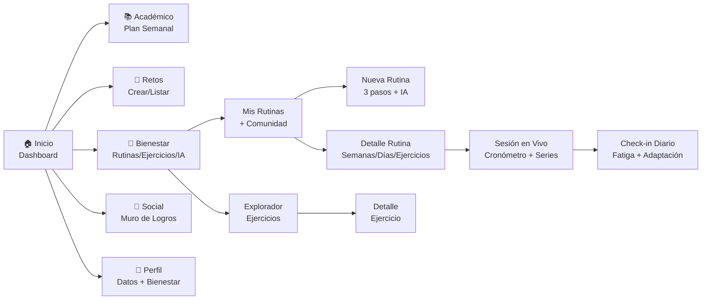
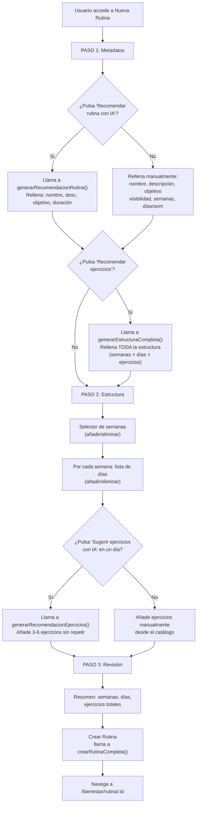
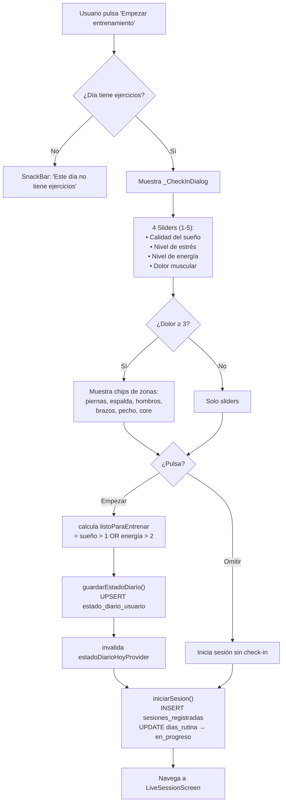
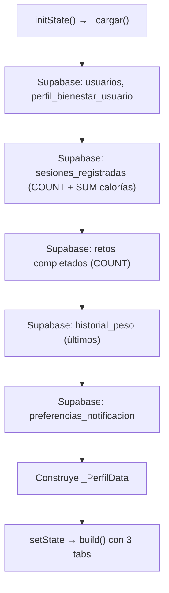

# 06 - Frontend (Estructura UI, Componentes y Pantallas)

**Proyecto:** SynaptixFit
**Versión:** 3.0
**Fecha:** 11-05-2026
**Referencia:** [03-architecture.md](03-architecture.md), [02-requirements.md](02-requirements.md)

---

## 1. Arquitectura de Información (MVP v3.0)



## 2. Navegación (GoRouter — ShellRoute)

**Diseño:** Bottom Navigation Bar con 5 tabs, glassmorphism (80% opacidad + 20px backdrop blur). Tab activo con color verde secundario y punto indicador de 4px. Avatar del usuario en el tab central de Perfil.

| Ruta | Pantalla | Descripción |
|------|----------|-------------|
| `/dashboard` | `DashboardScreen` | Inicio con KPIs, retos activos, acceso rápido |
| `/academico` | `PlanAcademicoScreen` | Plan académico semanal con horarios |
| `/academico/asignaturas` | `GestionAsignaturasScreen` | Búsqueda y gestión de asignaturas |
| `/academico/configuracion` | `ConfiguracionAcademicaScreen` | Selección universidad/carrera + carga masiva |
| `/academico/apuntes` | `ApuntesScreen` | Editor Markdown + explorador |
| `/academico/apuntes/editor` | `ApuntesEditorScreen` | Editor Markdown a pantalla completa |
| `/retos` | `RetosScreen` | Retos activos/explorar/completados |
| `/retos/simple` | `CrearRetoSimpleScreen` | Crear reto simple |
| `/retos/complejo` | `CrearRetoComplejoScreen` | Crear reto con hitos |
| `/retos/:id` | `DetalleRetoScreen` | Detalle y progreso |
| `/bienestar` | `RutinasComunidadScreen` | Comunidad y mis rutinas |
| `/bienestar/nueva-rutina` | `NuevaRutinaScreen` | **Crear rutina con IA (3 pasos)** |
| `/bienestar/explorador` | `ExploradorEjerciciosScreen` | Catálogo de ejercicios (~1300) |
| `/bienestar/ejercicio/:id` | `DetalleEjercicioScreen` | Detalle de ejercicio |
| `/bienestar/rutina/:id` | `RutinaDetalleScreen` | **Gestión: semanas, días, ejercicios, progreso, periodización** |
| `/bienestar/rutina/sesion` | `LiveSessionScreen` | **Entrenamiento en vivo + check-in diario** |
| `/bienestar/sesion-completada` | `SesionCompletadaScreen` | Historial de sesiones |
| `/perfil` | `PerfilScreen` | Perfil + bienestar editable + carreras + ajustes |
| `/notificaciones` | `NotificacionesScreen` | Centro de notificaciones |

**Nota importante:** La ruta `/bienestar/rutina/sesion` debe estar definida ANTES de `/bienestar/rutina/:id` en GoRouter para evitar que "sesion" sea capturado como parámetro `:id`.

## 3. Gestión de Estado (Riverpod) — Catálogo Completo

### 3.1 Estrategia General

| Provider Type | Uso | Ciclo de vida |
|--------------|-----|---------------|
| `FutureProvider` | Datos que se cargan una vez con refresh manual | Persiste mientras el provider tenga listeners |
| `FutureProvider.family` | Detalle de entidades por ID | Cacheado por parámetro |
| `StreamProvider` | Datos en tiempo real (Supabase Realtime) | Suscripción WebSocket activa mientras haya listeners |
| `StateNotifierProvider` | Estados con lógica de cambio compleja | Persiste en memoria |
| `FutureProvider.autoDispose` | Datos de pantallas que no necesitan persistencia | Se destruye al salir de la pantalla |

**Decisión de `autoDispose`:** Los providers de rutinas, comunidad, bloques y carreras NO usan `autoDispose` porque se consultan desde múltiples pantallas y mantenerlos en memoria evita re-fetching costoso al navegar entre tabs (gracias al `IndexedStack` del `StatefulShellRoute`).

### 3.2 Proveedores del Módulo de Bienestar (IA + Periodización)

| Provider | Tipo | Propósito | Fuente Supabase |
|----------|------|-----------|-----------------|
| `perfilBienestarProvider` | `FutureProvider<PerfilBienestarDb?>` | Perfil físico: antropometría, objetivo, equipamiento, disponibilidad | `perfil_bienestar_usuario` → `BienestarRepository.obtenerPerfilBienestar()` |
| `estadoDiarioHoyProvider` | `FutureProvider<EstadoDiarioDb?>` | Check-in diario de hoy (o null si no se ha hecho) | `estado_diario_usuario` WHERE `usuario_id` AND `fecha = today` |
| `historialSesionUsuarioProvider` | `FutureProvider<HistorialSesionDto?>` | Historial agregado de 4 semanas: RPE promedio, volumen, ejercicios recientes, semanas consecutivas | `sesiones_registradas` (30 últimas) + `series_sesion` (JOIN con `seleccion_de_ejercicios` → `ejercicios`) |
| `estadoPeriodizacionProvider` | `FutureProvider<PeriodizacionEstado>` | Detección de necesidad de descarga: RPE>8 + 3+ semanas + volumen decreciente O fatiga>50 | `sesiones_registradas` (3 semanas) + `estado_diario_usuario` (hoy) |
| `semanasDeRutinaProvider` | `FutureProvider.family<List<SemanaRutinaDb>, String>` | Semanas de una rutina con `tipo_semana` | `semanas_rutina` WHERE `rutina_id` |
| `diasDeSemanaProvider` | `FutureProvider.family<List<DiaRutinaDb>, String>` | Días de entrenamiento de una semana | `dias_rutina` WHERE `semana_id` |
| `ejerciciosDeDiaProvider` | `FutureProvider.family<List<SeleccionEjercicioDb>, String>` | Ejercicios de un día con series/reps/peso | `seleccion_de_ejercicios` WHERE `dia_id` |
| `tiempoDiaProvider` | `FutureProvider.family<int, String>` | Duración registrada de un día (última sesión) | `sesiones_registradas` WHERE `dia_id` (última) |
| `rutinasUsuarioProvider` | `FutureProvider<List<RutinaDb>>` | Rutinas del usuario autenticado | `rutinas` WHERE `usuario_id` |
| `rutinasComunidadProvider` | `FutureProvider<List<RutinaComunidadDto>>` | Rutinas públicas de la comunidad con nombre del autor | `rutinas` WHERE `visibilidad='public'` JOIN `usuarios` |

### 3.3 Proveedores del Módulo de Ejercicios

| Provider | Tipo | Propósito | Fuente |
|----------|------|-----------|--------|
| `ejerciciosProvider` | `StreamProvider<List<EjercicioDb>>` | Catálogo completo en tiempo real | `supabase.from('ejercicios').stream()` (Realtime) |
| `catalogosProvider` | `FutureProvider<CatalogosEjercicios>` | Datos maestros: partes_cuerpo, musculos, equipamientos | `partes_cuerpo`, `musculos`, `equipamientos` |
| `ejercicioDetalleProvider` | `FutureProvider.family<EjercicioDb?, String>` | Detalle completo de un ejercicio (incluye instrucciones) | `v_ejercicios_completos` WHERE `id` |
| `ejerciciosFiltradosProvider` | `Family` (lógica en provider) | Búsqueda con filtros por grupo muscular, equipamiento, parte del cuerpo, dificultad, texto | `v_ejercicios_completos` con filtros |

### 3.4 Proveedores del Dashboard

| Provider | Tipo | Propósito |
|----------|------|-----------|
| `proveedorUsuario` | `FutureProvider<UsuarioDb>` | Perfil del usuario autenticado |
| `proveedorTablero` | `FutureProvider` | Datos agregados del dashboard (KPIs, retos, racha) |
| `retosProvider` | `FutureProvider<List<RetoResumen>>` | Retos activos del usuario con `tieneHitos` vía batch query |
| `sesionesProvider` | `FutureProvider` | Sesiones recientes del usuario |

### 3.5 Funciones de Mutación (en `rutina_provider.dart`)

| Función | Operación SQL | Invalidaciones |
|---------|--------------|----------------|
| `crearRutinaCompleta({nombre, objetivo, visibilidad, duracionSemanas, estructura, ref})` | INSERT `rutinas` + `semanas_rutina` (con `tipo_semana`) + `dias_rutina` + `seleccion_de_ejercicios` | `rutinasUsuarioProvider` |
| `eliminarRutina(rutinaId, ref)` | DELETE `rutinas` (CASCADE) | `rutinasUsuarioProvider` |
| `clonarRutina(rutinaId, ref)` | INSERT `rutinas` (copia como privada) + `seleccion_de_ejercicios` | `rutinasUsuarioProvider` |
| `iniciarSesion({rutinaId, diaId, ref})` | INSERT `sesiones_registradas` + UPDATE `dias_rutina.estado='en_progreso'` | `diasDeSemanaProvider` |
| `finalizarSesion({sesionId, diaId, duracionSegundos, rpe, ref})` | UPDATE `sesiones_registradas` (duración, RPE, calorías) + UPDATE `dias_rutina.estado='completado'` | `diasDeSemanaProvider` |
| `registrarSerie({sesionId, seleccionId, numeroSerie, reps, peso})` | INSERT `series_sesion` | — |
| `guardarEstadoDiario({sueño, estrés, energía, dolor, zonas, listo, ref})` | UPSERT `estado_diario_usuario` ON CONFLICT (`usuario_id`, `fecha`) | `estadoDiarioHoyProvider` |
| `agregarEjercicioADia({rutinaId, diaId, ejercicioId, series, reps, descanso, ref})` | INSERT `seleccion_de_ejercicios` | `ejerciciosDeDiaProvider(diaId)` |
| `quitarEjercicioDeDia(seleccionId, diaId, ref)` | DELETE `seleccion_de_ejercicios` | `ejerciciosDeDiaProvider(diaId)` |
| `actualizarEjercicioDia(seleccionId, patch, diaId, ref)` | UPDATE `seleccion_de_ejercicios` | `ejerciciosDeDiaProvider(diaId)` |
| `agregarDiaASemana(semanaId, numeroDia, ref)` | INSERT `dias_rutina` | `diasDeSemanaProvider(semanaId)` |

### 3.6 Proveedores del Módulo de Perfil

| Provider | Tipo | Propósito |
|----------|------|-----------|
| `usuarioCarrerasProvider` | `FutureProvider` | Carreras vinculadas del usuario (M:N) |
| `carrerasUsuarioConNombreProvider` | `Family` | Carreras con nombre de universidad resuelto vía JOIN |

## 4. Pantalla: Nueva Rutina con IA (`NuevaRutinaScreen`)

**Archivo:** `app/lib/features/bienestar/presentation/nueva_rutina_screen.dart`
**Ruta:** `/bienestar/nueva-rutina`

### 4.1 Flujo de 3 Pasos



### 4.2 Datos de Entrada al Prompt IA

Los siguientes datos se recopilan antes de cada llamada a la IA:

| Dato | Provider/Origen | Uso en el prompt |
|------|----------------|------------------|
| Edad, sexo, peso, altura, IMC | `perfilBienestarProvider` | Reglas de seguridad biométrica |
| Objetivo principal | `perfilBienestarProvider` | Reglas de programación (reps, descanso, tipo de ejercicios) |
| Nivel de actividad | `perfilBienestarProvider` | Intensidad base de la rutina |
| Equipamiento disponible | `perfilBienestarProvider` | Filtro de compatibilidad (solo se envían ejercicios del equipamiento) |
| Días disponibles / semana | `perfilBienestarProvider` | Número de días en la estructura |
| Minutos por sesión | `perfilBienestarProvider` | Volumen total por día |
| Historial de sesiones | `historialSesionUsuarioProvider` | RPE promedio, volumen, ejercicios recientes, semanas consecutivas |
| Estado diario (hoy) | `estadoDiarioHoyProvider` | Sueño, estrés, energía, dolor, zonas → adaptación |
| Catálogo de ejercicios | `ejerciciosProvider` | Filtrado por equipamiento, enviado como JSON al prompt |
| Ejercicios ya agregados | Estado local del formulario | Lista de exclusión para no repetir |

### 4.3 Manejo de Errores de IA

| Escenario | Comportamiento |
|-----------|---------------|
| `GEMINI_API_KEY` no configurada | Error descriptivo: "Falta GEMINI_API_KEY en el archivo .env". El formulario sigue funcionando en modo manual. |
| Sin ejercicios compatibles con equipamiento | Error: "No hay ejercicios compatibles con tu equipamiento (peso_corporal, mancuerna)." |
| Gemini no responde (timeout 15s) | Error: "No se pudo conectar con Gemini en este momento." |
| Gemini responde con JSON malformado | `_extraerJson()` intenta 3 estrategias de parsing. Si falla: "Gemini generó una respuesta con formato no válido." |
| Gemini responde con array/objeto vacío | Error específico: "Gemini no generó ejercicios válidos." |

## 5. Pantalla: Detalle de Rutina (`RutinaDetalleScreen`)

**Archivo:** `app/lib/features/bienestar/presentation/rutina_detalle_screen.dart`
**Ruta:** `/bienestar/rutina/:id`

### 5.1 Componentes del Header

| Elemento | Fuente de datos | Descripción |
|----------|----------------|-------------|
| Nombre de rutina | `RutinaDb.nombre` | Título principal |
| Badge de objetivo | `RutinaDb.objetivo` | Chip coloreado: fuerza (rojo), resistencia (azul), hipertrofia (púrpura), movilidad (teal), mixto (gris) |
| Badge de estado | `RutinaDb.estado` | Chip: activo (verde), pausado (ámbar), completado (azul) |
| Duración | `RutinaDb.duracionSemanas` | "4 semanas" |
| Barra de progreso | Cálculo: días completados / días totales | Barra lineal con porcentaje |
| Días completados | Suma de días con `estado='completado'` | "8/16 días" |
| Tiempo total | Suma de `tiempoDiaProvider` para todos los días | "3h 25min acumulados" |

### 5.2 Selector de Semanas con Periodización

```
[Sem 1 Adapt] [Sem 2 Carga] [Sem 3 Carga] [Sem 4 Desc]
    ████          ████         ████          ████
```

Cada chip de semana muestra:
- **Número de semana** (1, 2, 3, 4...)
- **Tipo de semana** con badge coloreado: Adapt (azul), Carga (verde), Pico (naranja), Desc (teal)
- **Icono de check** (✓) si la semana está completada
- **Indicador de ejercicios**: "5 ejercicios" o conteo de días

### 5.3 Lista de Días

Cada día muestra:
- **Número y nombre** ("Día 1", "Día 2 - Pierna"...)
- **Estado:** pendiente (gris), en_progreso (ámbar), completado (verde con fondo)
- **Ejercicios:** lista con nombre, series × reps, peso (kg), descanso
- **Edición inline:** botones ± para series/reps/descanso, campo de peso
- **Botón "Iniciar"** → navega a `LiveSessionScreen` (bloqueado si no hay ejercicios)
- **Botón "Añadir ejercicio"** → abre buscador de catálogo
- **Long-press en ejercicio** → opción de sustituir

### 5.4 Validación Pre-Inicio

```dart
// En RutinaDetalleScreen, antes de navegar a sesión en vivo:
if (ejerciciosDelDia.isEmpty) {
  ScaffoldMessenger.of(context).showSnackBar(
    const SnackBar(content: Text('Este día no tiene ejercicios. Añade al menos uno.')),
  );
  return; // No navega
}
// Si tiene ejercicios → muestra _CheckInDialog → inicia sesión
```

### 5.5 Bloqueo de Día sin Ejercicios

- El botón "Iniciar" se muestra deshabilitado (gris) si `ejerciciosDeDiaProvider` devuelve lista vacía
- Tooltip: "Añade ejercicios a este día antes de empezar"

### 5.6 Invalidación al Modificar Ejercicios

Cuando se añade, quita o edita un ejercicio de un día completado:
1. `ejerciciosDeDiaProvider(diaId)` se invalida → UI se refresca
2. El estado del día NO cambia automáticamente (solo cambia al finalizar/iniciar sesión)
3. Pero la barra de progreso SÍ se actualiza (porque `diasDeSemanaProvider` se refresca)

## 6. Pantalla: Sesión en Vivo (`LiveSessionScreen`)

**Archivo:** `app/lib/features/bienestar/presentation/sesion_en_vivo_screen.dart`
**Ruta:** `/bienestar/rutina/sesion`

### 6.1 Check-in Diario (Pre-Sesión)



### 6.2 Funcionalidad Durante la Sesión

| Componente | Comportamiento |
|------------|---------------|
| **Cronómetro** | Se inicia automáticamente al entrar. Muestra `HH:MM:SS` en AppBar. |
| **Lista de ejercicios** | Cada ejercicio muestra sus series como filas con: checkbox circular, campo de peso (kg) editable, campo de reps editable. |
| **Check de serie** | Al marcar completada → `registrarSerie()` + inicia cronómetro de descanso (90s). |
| **Cronómetro de descanso** | Cuenta atrás visible. Botones: `+15s`, `-15s`, `Saltar`. Al llegar a 0, desaparece automáticamente. |
| **Edición de peso/reps** | Campos editables inline durante la sesión. Se guardan en `series_sesion`. |

### 6.3 Diálogo de Finalización

Al pulsar "Finalizar sesión":
1. Muestra duración total en formato legible (ej: "45 min 30 s")
2. **Slider RPE** (1-10): Rate of Perceived Exertion
3. **ChoiceChips de persistencia:**
   - "Solo hoy": los cambios de peso/reps NO se guardan en `seleccion_de_ejercicios` (solo en `series_sesion`)
   - "Para siempre": los cambios de peso/reps SÍ se actualizan en `seleccion_de_ejercicios` para futuras sesiones
4. Al confirmar → `finalizarSesion()` actualiza `sesiones_registradas` (duración, RPE, calorías) y marca el día como `completado`
5. Navegación de vuelta a `RutinaDetalleScreen`

### 6.4 Indicador de Fatiga

En `RutinaDetalleScreen`, antes de pulsar "Empezar entrenamiento":
- Si `estadoDiarioHoyProvider` devuelve `requiereAdaptacion == true` → banner naranja:
  > ⚠️ Hoy tu cuerpo necesita un entrenamiento más ligero. La IA adaptará las recomendaciones.

## 7. Pantalla: Perfil de Usuario (`PerfilScreen`)

**Archivo:** `app/lib/features/perfil/presentation/perfil_screen.dart` (~1277 líneas)
**Ruta:** `/perfil`

Estructura: `NestedScrollView` con `DefaultTabController(length: 3)` — 3 pestañas bajo un Hero Header común.

### 7.1 Hero Header (`_HeroHeader`)

Widget `SliverToBoxAdapter` al inicio del `NestedScrollView`, con diseño atlético moderno:

| Elemento | Descripción |
|----------|-------------|
| **Fondo** | `LinearGradient` de 3 tonos navy: `#0A1628` → `#152238` → `#0D1B2A` |
| **Avatar** | `Container` 88px circular con anillo de gradiente verde (`#72FE8G` → `#006E2D`) y `boxShadow` glow. Contenido: `ClipOval` con `Image.network` (carga progresiva con `loadingBuilder`) y fallback a inicial estilizada (`_avatarInitial()`: texto verde sobre fondo `#1A2A40`) |
| **Nombre** | `Text` blanco 22px `FontWeight.w800`, `maxLines: 1`. Icono `Icons.edit` a la derecha con `InkWell` → diálogo `_editarNombre()` → `BienestarRepository.actualizarNombre()` → invalida `perfilBienestarProvider` + `dashboardProvider` |
| **Email** | Texto con opacidad 50%, 13px |
| **Badge de nivel** | Chip con `Icons.stars_rounded` verde + "Nivel X". Barra XP: `LinearProgressIndicator` con progreso `xpTotal / (1000 × nivel)`, color `#72FE8G` |
| **Mini stats** | Fila: racha (🔥), días/semana (📅), minutos/sesión (⏱) — emoji 18px + valor blanco 15px bold + label 10px gris |

Datos del header: `UsuarioDb` (nombre, email, nivel, xpTotal, rachaActual, urlAvatar) + `PerfilBienestarDb` (diasDisponiblesSemana, minutosPorSesion).

### 7.2 Pestaña 1 — Estadísticas (`_EstadisticasTab`)

`ListView` con grid de 2 columnas de tarjetas de métricas (glass cards):

| Métrica | Valor | Color | Subtítulo |
|---------|-------|-------|-----------|
| **XP Total** | `usuario.xpTotal` | `#72FE8G` (verde) | "Nivel X" |
| **Sesiones** | `sesiones` (COUNT desde `sesiones_registradas`) | `#60A5FA` (azul) | — |
| **Retos** | `logros` (COUNT retos completados) | `#E8A838` (dorado) | — |
| **Calorías** | `caloriasAcumuladas` (SUM `calorias_quemadas`) | `#FF6B35` (naranja) | — |
| **Racha actual** | `usuario.rachaActual` | `#A78BFA` (violeta) | "días consecutivos" |

Estilo de tarjeta `_metricCard()`:
- `BorderRadius.circular(16)`, padding 16px
- Fondo: `color.withValues(alpha: 0.06)`, borde: `color.withValues(alpha: 0.12)`
- Valor numérico: `fontSize: 28`, `FontWeight.w800`, color semántico, `letterSpacing: -1`
- Label: 13px, `FontWeight.w600`, color `#94A3B8`. Subtítulo opcional: 11px, `#64748B`

### 7.3 Pestaña 2 — Bienestar (`_BienestarTab`)

`ListView` con 3 secciones en cards. **Todos los campos del onboarding ahora son editables desde el perfil.**

#### 7.3.1 Perfil físico (9 campos editables)

| Campo | Widget de edición | Rango | Persistencia |
|-------|-------------------|-------|-------------|
| **Peso (kg)** | `AlertDialog` con `TextField` numérico decimal | 30–250 kg | `_guardar({'peso_kg': v, 'altura_cm': p.alturaCm})` |
| **Altura (cm)** | `AlertDialog` con `TextField` numérico decimal | 120–230 cm | `_guardar({'altura_cm': v, 'peso_kg': p.pesoKg})` |
| **IMC** | Solo lectura | Calculado automáticamente | `p.imc.toStringAsFixed(1) · p.imcCategoria` |
| **Sexo** | `SimpleDialog` con radio buttons | `masculino`, `femenino`, `prefiero_no_decirlo` | `_guardar({'sexo': result})` |
| **Edad** | `AlertDialog` con `TextField` numérico entero | 1–120 años | `_guardar({'edad': edad})` |
| **Objetivo principal** | `SimpleDialog` con radio buttons | `fitness_general`, `perder_peso`, `ganar_masa`, `fuerza`, `resistencia`, `movilidad` | `_guardar({'objetivo_principal': result})` |
| **Nivel de actividad** | `SimpleDialog` con radio buttons | `sedentario`, `ligero`, `moderado`, `alto` | `_guardar({'nivel_actividad': result})` |
| **Días/semana** | `AlertDialog` con `TextField` numérico entero | 1–7 | `_guardar({'dias_disponibles_semana': val})` |
| **Minutos/sesión** | `AlertDialog` con `TextField` numérico entero | 10–180 | `_guardar({'minutos_por_sesion': val})` |

Todos los valores muestran `'—'` si son 0 o no existen. Cada fila editable muestra `Icons.edit` a la derecha con `InkWell`.

#### 7.3.2 Equipamiento

- Muestra chips configurados con `Wrap` (fondo `#006E2D` al 8%, texto verde oscuro 12px bold)
- Si no hay equipamiento: texto "Sin equipamiento configurado"
- Botón `OutlinedButton.icon` "Configurar equipamiento" → `_editarEquipamiento()`: diálogo con `StatefulBuilder` + `FilterChip` multi-selección de 8 opciones: `peso_corporal`, `mancuernas`, `barra`, `banda_elastica`, `kettlebell`, `polea`, `maquina`, `medicina_ball`

#### 7.3.3 Evolución de peso

- Lista de últimos 5 registros desde `historial_peso` (orden `registrado_en DESC`)
- Formato: `día/mes/año` → `X kg · IMC Y`
- Si vacío: "Sin registros aún"

### 7.4 Pestaña 3 — Ajustes (`_AjustesTab`)

`ConsumerWidget` con `ListView`:

| Elemento | Descripción | Acción |
|----------|-------------|--------|
| **Visibilidad del perfil** | `ListTile` con icono `visibility_rounded`. Subtítulo: "Privado · Solo tus amigos pueden ver tus rutinas" | `onTap: () {}` (placeholder) |
| **Notificaciones** | `ListTile` con icono `notifications_rounded`. Subtítulo: "Modo: X · Y/día" desde `PrefsNotificacionDb` | `context.push('/notificaciones')` |
| **Modo silencio** | `ListTile` con icono `dark_mode_rounded`. Subtítulo: horario desde `PrefsNotificacionDb` | `onTap: () {}` (placeholder) |
| **Carreras universitarias** | `_CarrerasCard` (`ConsumerWidget`): muestra count + botón "Gestionar carreras" → `/academico/configuracion`. Se oculta si `usuarioCarrerasProvider` está vacío | `context.push('/academico/configuracion')` |
| **Cerrar sesión** | `OutlinedButton.icon` rojo (`#EF4444`) con borde `#3B1C1C`, altura 44px | `authController.logout()` → `context.go('/acceso')` |

### 7.5 Flujo de carga y datos



- `_PerfilData` es un DTO interno que agrupa: `UsuarioDb`, `PerfilBienestarDb`, `sesiones`, `logros`, `caloriasAcumuladas`, `historial`, `preferencias`
- Tras cada edición en Bienestar: `_onPerfilActualizado()` → invalida `perfilBienestarProvider` + `dashboardProvider` + recarga `_cargar()`
- `BienestarRepository.actualizarPerfilParcial(data)` persiste los cambios parciales en `perfil_bienestar_usuario`

### 7.6 Sincronización

- `perfilBienestarProvider` se invalida manualmente tras cada edición (`ref.invalidate(perfilBienestarProvider)`)
- Avatar: `Image.network` con `loadingBuilder` (muestra inicial durante carga) y `errorBuilder` (fallback a inicial estilizada)
- El nombre se lee de `usuarios.nombre_completo` (tabla pública), no de `perfil_bienestar_usuario`
- `_TabBarDelegate` (`SliverPersistentHeaderDelegate`) mantiene el `TabBar` fijado al hacer scroll

## 8. Componentes Reutilizables

| Componente | Descripción | Uso |
|-----------|-------------|-----|
| `BottomNavBar` | 5 tabs con glassmorphism, avatar en Perfil | ShellRoute |
| `KpiCard` | Anillo, contador, gráfico | Dashboard |
| `ExerciseCard` | GIF, nombre, grupo muscular, equipamiento | Explorador, Constructor |
| `ChallengeProgressBar` | Lineal, circular | Dashboard, Detalle de Reto |
| `MilestoneCard` | Título, peso, progreso | Crear Reto Complejo, Detalle |
| `NotificationCard` | Ícono, prioridad, acción rápida | Centro de Notificaciones |
| `FeedCard` | Avatar, logro, interacciones | Muro Social |
| `SkeletonLoader` | Shimmer effect | Todas las pantallas con carga |
| `EmptyState` | Ilustración + mensaje | Todos los estados vacíos |
| `SemanaBadge` | Chip coloreado con tipo de semana | RutinaDetalleScreen |
| `FatigaBanner` | Banner naranja de advertencia | Pre-sesión |

## 9. Manejo de Errores

| Código/Situación | Acción del Cliente |
|------------------|-------------------|
| HTTP 400 | Toast con mensaje específico del campo |
| HTTP 401 | Redirigir a pantalla de login |
| HTTP 500 | Retry automático con backoff exponencial |
| Network timeout | Banner "Sin conexión" |
| `GEMINI_API_KEY` no configurada | Error inline en formulario, creación manual habilitada |
| Gemini timeout (15s) | Toast: "No se pudo conectar con Gemini. Inténtalo de nuevo." |
| Gemini JSON malformado | Toast: "Gemini generó una respuesta con formato no válido." |
| Sin ejercicios compatibles | Error inline con lista de equipamiento del usuario |

## 10. Métricas de Rendimiento

| Pantalla | Objetivo | Notas |
|----------|---------|-------|
| Dashboard | < 2s carga inicial | `Future.wait` paraleliza queries |
| Explorador de Ejercicios | < 3s con filtros | Vista materializada `mv_ejercicios_completos` |
| Detalle de Ejercicio | < 1.5s carga GIF R2 | URL pública de R2, sin firma |
| Recomendación IA | < 8s por prompt | Gemini Flash ~2-3s + parsing |
| Interacciones locales | < 300ms | Sin llamadas de red |

## 11. Cobertura de Casos de Uso (v3.0)

| CU ID | Nombre | Pantallas | Estado |
|-------|--------|-----------|--------|
| CU-01 | Registro y autenticación | Bienvenida, Acceso | ✅ |
| CU-02 | Configurar perfil físico | Perfil Físico, Onboarding | ✅ |
| CU-03 | Dashboard | Dashboard | ✅ |
| CU-04 | Planificar semana académica | Plan Académico Semanal | ✅ |
| CU-06 | Crear rutina personal | Explorador, Constructor, NuevaRutinaScreen | ✅ |
| CU-07 | Registrar sesión completada | LiveSessionScreen, Sesión Completada | ✅ |
| CU-10 | Crear reto simple | Crear Reto Simple | ✅ |
| CU-11 | Crear reto complejo | Crear Reto Complejo | ✅ |
| CU-19 | Buscar y seleccionar ejercicios | Explorador, Detalle, Constructor | ✅ |
| **CU-20** | **Crear rutina con recomendación IA** | **NuevaRutinaScreen (3 pasos + IA)** | ✅ |
| **CU-21** | **Check-in diario antes de entrenar** | **RutinaDetalleScreen → _CheckInDialog → LiveSessionScreen** | ✅ |

---

**Documento compilado:** 11-05-2026
**Última revisión:** v3.0
**Referencia:** Alineado con SRS v3.0, Arquitectura v3.0
