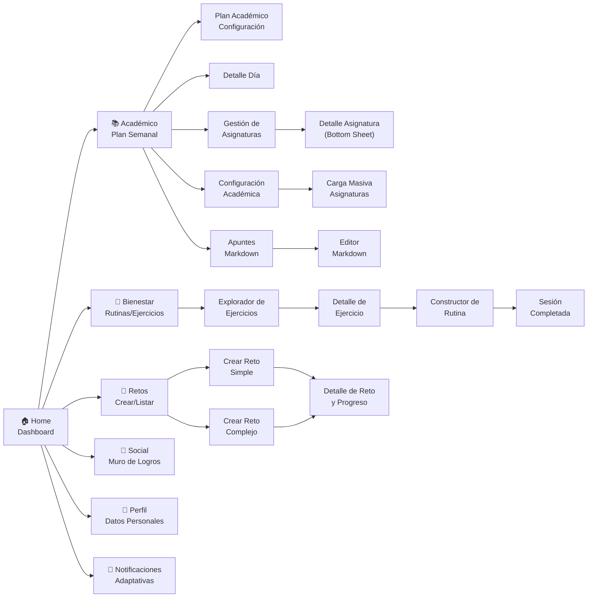
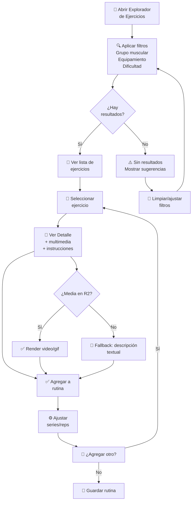
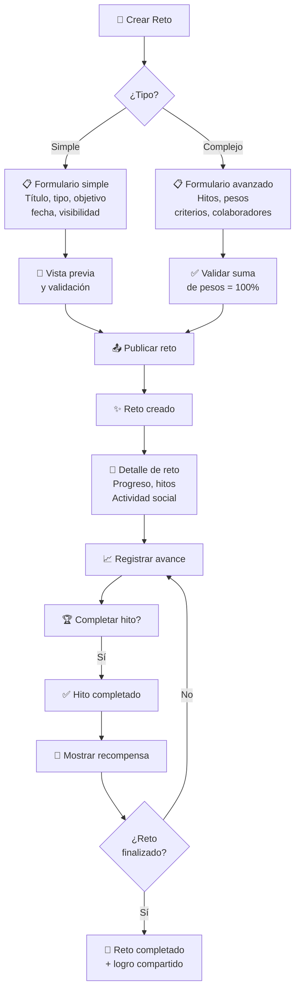

# 06 - Frontend (Estructura UI, Componentes y Pantallas)

**Proyecto:** SynaptixFit  
**Versión:** 2.7  
**Fecha:** 09-05-2026  
**Referencia:** [01-introduction.md](01-introduction.md) (Design System), [02-requirements.md](02-requirements.md) (Casos de Uso)

---

## 1. Arquitectura de Información (MVP)



---

## 2. Navegación (Bottom Nav — 5 Tabs)

```
Tab 0: 🏠 Inicio (Dashboard)
Tab 1: 📚 Académico (Plan Semanal / Plan Académico)
Tab 2: 🎯 Retos (Crear / Listar)
Tab 3: 👥 Social (Muro Social)
Tab 4: 👤 Perfil (Perfil de Usuario)
```

**Diseño:** Glassmorphism (80% opacidad + 20px backdrop blur). Tab activo con color verde secundario y punto indicador de 4px.

### Rutas principales (GoRouter)

| Ruta | Pantalla | Descripción |
|------|----------|-------------|
| `/dashboard` | `DashboardScreen` | Inicio con KPIs y acceso rápido |
| `/academico` | `PlanAcademicoScreen` | Plan académico semanal |
| `/academico/asignaturas` | `GestionAsignaturasScreen` | Búsqueda y gestión de asignaturas |
| `/academico/configuracion` | `ConfiguracionAcademicaScreen` | Selección universidad/carrera |
| `/academico/apuntes` | `ApuntesScreen` | Editor Markdown + explorador |
| `/retos` | `RetosScreen` | Retos activos/explorar/completados |
| `/retos/simple` | `CrearRetoSimpleScreen` | Crear reto simple |
| `/retos/complejo` | `CrearRetoComplejoScreen` | Crear reto con tareas |
| `/retos/:id` | `DetalleRetoScreen` | Detalle y progreso |
| `/bienestar` | `ExploradorEjerciciosScreen` | Catálogo de ejercicios |
| `/bienestar/rutina` | `ConstructorRutinaScreen` | Constructor de rutina |
| `/bienestar/sesion` | `SesionCompletadaScreen` | Registro de sesión |
| `/social` | `MuroSocialScreen` | Muro de logros |
| `/perfil` | `PerfilScreen` | Perfil + carreras + ajustes |
| `/notificaciones` | `NotificacionesScreen` | Centro de notificaciones |

---

## 3. Gestión de Estado (Riverpod)

```dart
// Proveedores principales
final proveedorUsuario = FutureProvider((ref) => obtenerPerfilUsuario());

final proveedorTablero = FutureProvider((ref) {
  final usuario = ref.watch(proveedorUsuario);
  return obtenerDatosTablero(usuario.id);
});

final proveedorNotificaciones = StreamProvider((ref) {
  return supabase.suscribirseANotificaciones();
});
```

**Estrategia:**
- `FutureProvider` para datos que se cargan una vez con refresh manual.
- `StreamProvider` para datos en tiempo real (Supabase Realtime).
- `StateNotifier` para estados con lógica de cambio compleja (filtros, constructor de rutina).
- `FutureProvider.family` para detalle de entidades (reto, ejercicio, apunte).
- `FutureProvider.autoDispose` para pantallas que no necesitan persistencia.

### Proveedores del módulo académico

| Provider | Tipo | Propósito |
|----------|------|-----------|
| `asignaturasActivasProvider` | `AutoDisposeFutureProvider` | Asignaturas activas del usuario |
| `asignaturasArchivadasProvider` | `AutoDisposeFutureProvider` | Asignaturas archivadas |
| `universidadesProvider` | `AutoDisposeFutureProvider` | Catálogo de universidades |
| `carrerasPorUniversidadProvider` | `Family` | Carreras filtradas por universidad |
| `catalogoAsignaturasPorCarreraProvider` | `Family` | Asignaturas del catálogo por carrera |
| `usuarioCarrerasProvider` | `AutoDisposeFutureProvider` | Carreras del usuario (M:N) |
| `carrerasUsuarioConNombreProvider` | `Family` | Carreras con nombre y universidad resuelta |
| `apunteDetalleProvider` | `Family` | Detalle de un apunte |
| `apuntesPublicosProvider` | `FutureProvider` | Apuntes públicos para explorar |
| `planesUsuarioProvider` | `FutureProvider` | Planes de estudio del usuario |

### Proveedores del módulo de retos

| Provider | Tipo | Propósito |
|----------|------|-----------|
| `retosProvider` | `FutureProvider` | Retos activos del usuario con `tieneHitos` vía batch query |
| `retosPublicosProvider` | `AutoDisposeFutureProvider` | Retos públicos para explorar y clonar |
| `retoDetalleProvider` | `Family` | Detalle completo de un reto (tareas, progreso, metadatos) |

---

## 4. Manejo Offline

- **Caché local:** Hive / Sembast para persistir ejercicios, rutinas y retos.
- **Sincronización:** Al reconectar, se envían operaciones pendientes.
- **Indicador visual:** Banner "Sin conexión" cuando no hay red.

---

## 5. Manejo de Errores

| Código HTTP | Acción del cliente |
|-------------|-------------------|
| `400` | Toast con mensaje específico del campo |
| `401` | Redirigir a pantalla de login |
| `500` | Retry automático con backoff exponencial |
| Network timeout | Mostrar banner "Sin conexión" |

---

## 6. Métricas de Rendimiento

| Pantalla | Objetivo |
|----------|---------|
| Dashboard | < 2s carga inicial |
| Explorador de Ejercicios | < 3s lista con filtros |
| Detalle de Ejercicio | < 1.5s carga multimedia R2 |
| Constructor de Rutina | Sin latencia en reorder |
| Interacciones generales | < 300ms |

---

## 7. Cobertura de Casos de Uso (MVP)

| CU ID | Nombre | Pantallas Asociadas | Estado |
|-------|--------|---------------------|--------|
| CU-01 | Registro y autenticación | Bienvenida | ✅ Base |
| CU-02 | Configurar perfil físico | Perfil Físico y Bienestar Inicial | ✅ Completo |
| CU-03 | Ver resumen personal | Dashboard | ✅ Completo |
| CU-04 | Planificar semana académica | Plan Académico Semanal | ✅ Completo |
| CU-05 | Ver plan integrado | Plan Semanal | ✅ Completo |
| CU-06 | Crear rutina personal | Explorador, Detalle, Constructor, Sesión | ✅ Completo |
| CU-07 | Registrar sesión completada | Sesión Completada | ✅ Completo |
| CU-10 | Crear reto simple | Crear Reto Simple, Detalle de Reto | ✅ Completo |
| CU-11 | Crear reto complejo | Crear Reto Complejo, Detalle de Reto | ✅ Completo |
| CU-12 | Completar reto | Detalle de Reto y Progreso | ✅ Completo |
| CU-13 | Gestionar perfil | Perfil | ✅ Base |
| CU-14 | Ver muro social | Muro Social | ✅ Base |
| CU-17 | Recomendación adaptativa | Centro de Notificaciones, Plan Académico | ✅ Completo |
| CU-19 | Seleccionar ejercicios | Explorador, Detalle, Constructor | ✅ Completo |

---

## 8. Inventario de Pantallas Stitch (15 pantallas)

| # | Pantalla | Prioridad | CU/RF Vinculado |
|---|---------|-----------|----------------|
| 1 | SynaptixFit — Bienvenida (ES) | P0 | CU-01 |
| 2 | Perfil Físico y Bienestar Inicial (ES) | P0 | CU-02 |
| 3 | Dashboard (ES) | P0 | CU-03 |
| 4 | Explorar Ejercicios (ES) | P0 | RF-BIE-11, CU-19 |
| 5 | Detalle de Ejercicio (ES) | P0 | RF-BIE-12, CU-19 |
| 6 | Constructor de Rutina (ES) | P0 | CU-06, CU-19 |
| 7 | Sesión Completada (ES) | P1 | CU-07 |
| 8 | Plan Académico Semanal (ES) | P1 | CU-04, CU-06 |
| 9 | Plan Semanal (ES) | P1 | CU-05 |
| 10 | Crear Reto Simple (ES) | P1 | CU-10 |
| 11 | Crear Reto Complejo (ES) | P1 | CU-11 |
| 12 | Detalle de Reto y Progreso (ES) | P1 | CU-10, CU-11, CU-12 |
| 13 | Centro de Notificaciones Adaptativas (ES) | P1 | CU-17, RF-Not-01 |
| 14 | Muro Social (ES) | P1 | CU-14 |
| 15 | Perfil (ES) | P1 | CU-13 |

---

## 9. Flujos UX Prioritarios

### 9.1 Flujo de Ejercicios (CU-19)



### 9.2 Flujo de Retos (CU-10/CU-11)



---

## 10. Especificaciones por Pantalla

### 10.1 Bienvenida (Login/Registro)

**Objetivo:** Pantalla de acceso a la aplicación.

**Flujo UX:**
```
Registro → Datos básicos → Enviar OTP → Verificar → Perfil Físico
```

**Componentes:**
- Logo SynaptixFit prominente.
- Campos: email, contraseña.
- Botón: Iniciar sesión / Crear cuenta.
- Enlace: Términos y condiciones (webview).

**Integraciones servidor:**
- `POST /auth/login` → JWT + usuario.
- `POST /auth/registro` → JWT + `requiere_onboarding: true`.

**Estados especiales:**
- ⏳ Carga: Indicador centrado (2-3s).
- ❌ Error: Notificación roja (correo no existe, contraseña incorrecta).
- ✅ Validación: Email RFC 5322, contraseña ≥8 chars, ≥1 mayúscula, ≥1 número.

---

### 10.2 Perfil Físico y Bienestar Inicial (Onboarding)

**Objetivo:** Recolectar antropometría y bienestar para calibrar recomendaciones.

**Flujo UX:**
```
Pantalla 1: Datos demográficos (edad, sexo, ciudad) → Pantalla 2
Pantalla 2: Peso + Altura → Calcular IMC → Mostrar → Pantalla 3
Pantalla 3: Nivel de actividad actual + objetivos → Guardar → Dashboard
```

**Componentes:**
- Picker: Edad (slider 15-60), sexo (radio), ciudad (dropdown con búsqueda).
- TextField: Peso (kg), altura (cm).
- Slider: Nivel de actividad (sedentario → muy activo).
- Chips: Objetivos (perder peso, ganar masa, fitness general, fuerza, resistencia).
- Tarjeta: Resumen IMC con color (azul=normal, naranja=sobrepeso, rojo=obeso).

**Modelo de datos:**
```dart
class PerfilFisico {
  final String usuarioId;
  final int edad;
  final String sexo; // 'M', 'F', 'Otro'
  final String ciudad;
  final double pesoKg;
  final double alturaCm;
  final String nivelActividad; // 'sedentario', 'ligero', 'moderado', 'intenso'
  final List<String> objetivos; // ['peso', 'masa', 'fuerza', ...]
  final DateTime creadoEn;
}
```

**Validaciones:** Peso: 30-200 kg · Altura: 140-220 cm · Edad: 15-80 años.

---

### 10.3 Dashboard

**Objetivo:** Resumen personalizado con KPIs, bienestar y retos activos.

**Componentes:**
- Tarjeta de saludo con gradiente, avatar, nombre, nivel, barra XP y racha.
- KPIs: calorías hoy, sesiones completadas, horas de estudio.
- Resumen de bienestar si el perfil está configurado.
- Lista de retos activos con barra de progreso.
- FAB "+" con BottomSheet de creación: Nueva rutina, Reto simple, Reto complejo, Plan semanal, Nuevo apunte (5 opciones, navegación con `push`).
- Navegación inferior: 5 pestañas.

**Ruta:** `/dashboard` (ShellRoute)  
**Archivo:** [app/lib/features/dashboard/presentation/dashboard_screen.dart](app/lib/features/dashboard/presentation/dashboard_screen.dart)  
**Provider:** [dashboard_provider.dart](app/lib/features/dashboard/application/dashboard_provider.dart)

---

### 10.4 Explorar Ejercicios

**Objetivo:** Buscar y filtrar ejercicios del catálogo normalizado de SynaptixFit con terminología anatómica profesional.

**Componentes:**
- Barra de búsqueda (autocompletado, mín. 2 chars, búsqueda full-text en español).
- Chips de filtro: Parte del cuerpo, músculo objetivo, equipamiento (desde tablas de catálogo).
- Vista lista/cuadrícula: Tarjeta con GIF animado, nombre, músculo principal, equipamiento.
- Badge: Número de resultados.
- Streaming en tiempo real: `ejerciciosProvider` usa `supabase.from('ejercicios').stream()` para reflejar cambios en vivo (inserciones, actualizaciones, eliminaciones).

**Modelo de datos:**
```dart
class FiltroEjercicio {
  final String? busqueda;
  final int? parteCuerpoId;    // ID de catálogo
  final int? musculoId;         // ID de catálogo
  final int? equipamientoId;    // ID de catálogo
  final String? dificultad;
  final int pagina;
  final int tamanioPagina;
}

class TarjetaEjercicio {
  final String id;
  final String nombre;
  final String? urlGif;
  final String dificultad;
  final String? musculoPrincipal;     // Primer músculo objetivo
  final String? equipamientoPrincipal; // Primer equipamiento
  final String? parteCuerpoPrincipal;  // Primera parte del cuerpo
}

class CatalogosEjercicios {
  final List<ParteCuerpoDb> partesCuerpo;
  final List<MusculoDb> musculos;
  final List<EquipamientoDb> equipamientos;
}
```

**Integraciones:** `GET /v_ejercicios_completos` (vista denormalizada) · Caché 1 hora · URLs R2 para GIFs · Realtime via `.stream()`.

**Validaciones:** Búsqueda ≥ 2 chars · Máx. 50 por página.

---

### 10.5 Detalle de Ejercicio

**Objetivo:** Vista completa con GIF animado, metadatos anatómicos, instrucciones y opción de agregar a rutina.

**Componentes:**
- Visor de GIF animado desde R2 (URL pública, patrón fallback).
- Chips de metadatos: Parte del cuerpo, músculos objetivo, músculos secundarios, equipamiento, dificultad.
- Tarjeta de instrucciones (lista numerada desde `instrucciones TEXT[]`).
- Selectores numéricos: Series (1-10), repeticiones (1-100), descanso (30-300s).
- Botón: "Agregar a rutina".
- Tabs: Instrucciones, Información general.

**Patrón Fallback Multimedia:**
1. Intentar GIF desde R2 (`url_gif`).
2. Si falla → mostrar placeholder con ícono de ejercicio.
3. Si falla → mostrar descripción textual + instrucciones.

**Modelo de datos:**
```dart
class DetalleEjercicio {
  final String id;
  final String? exerciseDbId;
  final String nombre;
  final String? urlGif;
  final List<String> instrucciones;
  final String dificultad;
  final String? descripcion;
  final List<String> partesCuerpo;          // Desde catálogo N:M
  final List<String> musculosObjetivo;      // Desde catálogo N:M
  final List<String> musculosSecundarios;   // Desde catálogo N:M
  final List<String> equipamientos;         // Desde catálogo N:M
}
```

---

### 10.6 Constructor de Rutina

**Objetivo:** Ensamblar rutina: agregar ejercicios, reordenar, ajustar, guardar.

**Componentes:**
- Lista de ejercicios con series/reps editables.
- Lista reordenable (drag-and-drop, P1+).
- Tarjeta por ejercicio: nombre, grupo, series×reps, botón eliminar.
- FAB: "Agregar ejercicio".
- Panel inferior: Nombre + descripción + visibilidad.

**Modelo de datos:**
```dart
class ConstructorRutina {
  final List<SeleccionEjercicio> ejercicios;
  final String? nombre;
  final String? descripcion;
  final String visibilidad; // 'privado', 'solo_amigos', 'publico'
}
```

**Integraciones:** `POST /rutinas` → `RespuestaGuardadoRutina`.

**Validaciones:** Mín. 3 ejercicios · Nombre 3-50 chars · Series 1-10, reps 1-100.

**Estados:** Vacío: "Agrega ejercicios" · < 3: botón Guardar deshabilitado · Guardando: modal (2-5s).

---

### 10.7 Sesiones de Entrenamiento

**Objetivo:** Listado de sesiones completadas y registro de nuevas sesiones.

**Componentes:**
- Lista de sesiones con tarjeta por sesión: nombre de rutina, duración, RPE, calorías, XP.
- FAB "Registrar sesión" (visible si el usuario tiene rutinas guardadas).
- Diálogo de registro: selector de rutina, slider de duración (5-120 min), slider de esfuerzo percibido RPE (1-10).
- Cálculo automático de calorías estimadas en tiempo real.
- Pull-to-refresh para ver nuevas sesiones.

**Ruta:** `/bienestar/sesion-completada`  
**Archivo:** [app/lib/features/bienestar/presentation/sesion_completada_screen.dart](app/lib/features/bienestar/presentation/sesion_completada_screen.dart)  
**Provider:** `sesionesProvider`, `rutinasUsuarioProvider`, `registrarSesion()` en [sesion_provider.dart](app/lib/features/bienestar/application/sesion_provider.dart)

---

### 10.8 Plan Académico Semanal

**Objetivo:** Vista del horario semanal con detección de conflictos.

**Componentes:**
- Listado de bloques (horarios) agrupados por asignatura.
- ConflictBanner: aviso visual si hay solapamientos.
- Acceso rápido a **Apuntes** y **Gestionar Asignaturas** desde AppBar.

**Ruta:** `/academico`  
**Archivo:** [app/lib/features/academico/presentation/plan_academico_screen.dart](app/lib/features/academico/presentation/plan_academico_screen.dart)

---

### 10.8.1 Gestionar Asignaturas

**Objetivo:** CRUD de asignaturas con archivado suave (soft delete).

**Componentes:**
- Tabs Activas / Archivadas.
- Diálogo de formulario: nombre, código, docente, descripción.
- PopupMenu por asignatura: Editar, Archivar/Desarchivar, Eliminar.
- Catálogo: vinculación opcional a `catalogo_asignaturas`.

**Ruta:** `/academico/asignaturas`  
**Archivo:** [app/lib/features/academico/presentation/gestion_asignaturas_screen.dart](app/lib/features/academico/presentation/gestion_asignaturas_screen.dart)  
**Provider:** `asignaturasActivasProvider`, `asignaturasArchivadasProvider`, CRUD en [asignaturas_provider.dart](app/lib/features/academico/application/asignaturas_provider.dart)

---

### 10.8.2 Apuntes (Markdown)

**Objetivo:** CRUD de apuntes con contenido Markdown y vista previa.

**Componentes:**
- Pestañas "Mis apuntes" / "Explorar" (SegmentedButton).
  - **Mis apuntes:** lista con cards, FAB para crear, al tocar abre editor.
  - **Explorar:** apuntes públicos y de amigos (RLS filtra automáticamente), muestra nombre del autor.
- Editor full-screen: campos título, asignatura opcional, visibilidad, nota rápida.
- Editor Markdown multilínea con toggle **Vista previa** renderizada con `flutter_markdown`.
- Visibilidad chips (privado / público / solo_amigos).

**Rutas:** `/academico/apuntes`, `/academico/apuntes/editor`  
**Archivos:** [apuntes_screen.dart](app/lib/features/academico/presentation/apuntes_screen.dart), [apuntes_editor_screen.dart](app/lib/features/academico/presentation/apuntes_screen.dart) (mismo archivo, widgets separados)  
**Provider:** `apuntesProvider`, `apuntesPublicosProvider` con DTO `ApuntePublicoDto`, CRUD en [apuntes_provider.dart](app/lib/features/academico/application/apuntes_provider.dart)

---

### 10.8.3 Planes de Estudio Semanales (Académico + Bienestar)

**Objetivo:** Planificación semanal unificada con dos vistas: planes académicos y tablero de bienestar.

**Componentes:**
- SegmentedButton "Académico" / "Bienestar" en la parte superior.
- **Pestaña Académico:** Listado de planes expandibles con rango de fechas y badge de visibilidad. Crear plan, añadir/eliminar bloques con asignatura, hora, prioridad.
- **Pestaña Bienestar:** Anillo de progreso circular con % de cumplimiento semanal, indicadores planificado vs completado, tarjeta de plan activo (intensidad, duración, estado), tendencia vs semana anterior con flecha, sugerencia contextual en tarjeta destacada.

**Ruta:** `/plan-semanal`  
**Archivo:** [app/lib/features/academico/presentation/plan_semanal_screen.dart](app/lib/features/academico/presentation/plan_semanal_screen.dart)  
**Providers:** `planesEstudioProvider`, `bloquesPorPlanProvider`, `bienestarSemanalProvider`

---

### 10.10 Crear Reto Simple

**Objetivo:** Formulario para retos sin hitos.

**Componentes:**
- TextField: Título (máx. 50).
- RadioGroup: Tipo (fitness/académico).
- TextField: Meta (ej: "50 km en bici").
- DatePicker: Inicio, fin.
- RadioGroup: Visibilidad.
- Tarjeta: Vista previa en vivo.
- Botones: Vista previa, Publicar, Cancelar.

**Integraciones:** `POST /retos/simple`.

**Validaciones:** Título 5-50 chars · Meta 5-100 chars · Duración 1-365 días · Fin > inicio.

---

### 10.11 Crear Reto Complejo

**Objetivo:** Formulario avanzado con hitos y pesos porcentuales.

**Componentes:**
- Formulario base (igual que simple).
- Lista reordenable de hitos.
- Tarjeta por hito: Título, peso %, botón eliminar.
- Chip de suma dinámica (rojo si <100%, verde si =100%).
- Botón: "Agregar hito" (máx. 10).
- ProgressIndicator: Barra visual de suma.

**Integraciones:** `POST /retos/complejo` · Validación servidor: suma = 100%.

**Validaciones:** Título 5-50 chars · Hitos 2-10 · Peso por hito 5-50% · Suma exactamente 100%.

---

### 10.12 Detalle de Reto y Progreso

**Objetivo:** Vista de progreso, hitos, actividad social y registro de avance.

**Componentes:**
- Encabezado: Título + imagen + barra de progreso general.
- Tarjeta por hito: Barra progreso, peso %.
- Botón: "Registrar avance" → modal con hito y cantidad.
- Indicador de progreso: Anillos concéntricos.
- Feed de actividad: Comentarios y me gusta.
- FAB: "Compartir" (si progreso = 100%).

**Integraciones:** `GET /retos/{id}` · `POST /retos/{id}/progreso` · Realtime para actualizaciones.

**Validaciones:** Avance 0-100% por hito · No permitir retroceso.

**Estados:** Completado: confetti + insignia + "Compartir" · Vencido: banner rojo.

---

### 10.13 Centro de Notificaciones Adaptativas

**Objetivo:** Hub de notificaciones categorizadas por prioridad.

**Componentes:**
- Tabs: Crítica, Recomendada, Informativa.
- Tarjeta: Ícono + título + descripción + acción rápida.
- Acciones deslizables: Marcar leída, archivar, actuar.
- Badge: Contador de no leídas por tab.
- Botón: "Marcar todo como leído".

**Integraciones:** `GET /notificaciones?prioridad={p}` · `PATCH /notificaciones/{id}` · Realtime.

---

### 10.14 Muro Social

**Objetivo:** Feed de logros entre pares.

**Componentes:**
- Tarjeta de feed: Avatar, nombre, logro, ícono, timestamp.
- Fila de interacción: 👍 Me gusta + 💬 Comentar.
- Panel de comentarios: Modal (máx. 5 iniciales, "Ver más").
- Filtros: Hoy, semana, mes.
- FAB: "Compartir logro".

**Integraciones:** `GET /muro?periodo={p}` · `POST /muro/{id}/me-gusta` · `POST /muro/{id}/comentario` · Realtime.

**Validaciones:** Comentario 1-200 chars.

---

### 10.15 Perfil de Usuario

**Objetivo:** Datos personales, historial, logros, configuración.

**Componentes:**
- Header: Avatar (toque para cambiar), nombre, correo.
- Fila de estadísticas: Nivel, XP, racha.
- Tabs: Historial, Logros, Configuración.
- Tarjeta de sesión: Fecha, rutina, duración, calorías.
- Cuadrícula de insignias.
- Lista de ajustes: switches, dropdowns, "Cerrar sesión".

**Integraciones:** `GET /usuarios/{id}/perfil` · `PATCH /usuarios/{id}/perfil` · `POST /usuarios/{id}/avatar`.

**Validaciones:** Nombre 2-50 chars · Avatar JPG/PNG, máx. 2 MB.

---

## 11. Componentes Reutilizables

| Componente | Uso en pantallas |
|-----------|-----------------|
| `BottomNavBar` (5 tabs, glassmorphism) | Todas las pantallas principales |
| `KpiCard` (anillo, contador, gráfico) | Dashboard |
| `ExerciseCard` (foto, nombre, grupo) | Explorador, Constructor |
| `ChallengeProgressBar` (lineal, circular) | Dashboard, Detalle de Reto |
| `MilestoneCard` (título, peso, progreso) | Crear Reto Complejo, Detalle de Reto |
| `NotificationCard` (ícono, prioridad, acción) | Centro de Notificaciones |
| `FeedCard` (avatar, logro, interacciones) | Muro Social |
| `SkeletonLoader` (shimmer effect) | Todas las pantallas con carga |
| `EmptyState` (ilustración + mensaje) | Todas las pantallas con estados vacíos |

---

## 12. Decisiones de Diseño Notables

### 12.1 Adaptación Inteligente (CU-17)
Las notificaciones se agrupan por prioridad con acciones rápidas sin abandonar el contexto. Incluyen: conflictos horarios, alertas de fatiga, sugerencias IA, hitos próximos y actividad social.

### 12.2 Fallback Multimedia (patrón en capas)
El Detalle de Ejercicio implementa fallback progresivo: video → imagen → texto.

### 12.3 Validación de Hitos
El Crear Reto Complejo valida que la suma = 100% con feedback inline dinámico.

### 12.4 Detección de Conflictos
El Plan Académico detecta solapamientos entre estudio y entrenamiento con función SQL server-side.

---

## 13. Plan de Mejoras Post-MVP (Fase 2)

- [ ] Skeleton states en Explorador de Ejercicios.
- [ ] Estados vacíos con ilustraciones personalizadas.
- [ ] Pantalla "Mis Retos" con filtros avanzados.
- [ ] Microinteracciones drag-and-drop en Constructor.
- [ ] Integración batch de actualización de ejercicios.

---

**Documento compilado:** 19-04-2026  
**Última revisión:** v1.0  
**Referencia:** Alineado con SRS v2.5, RFC v2.5 y Design System Synapse Velocity
