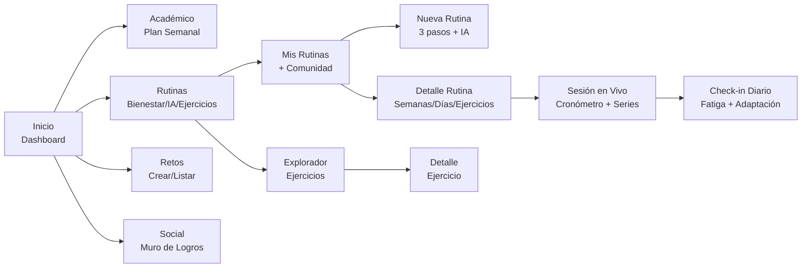
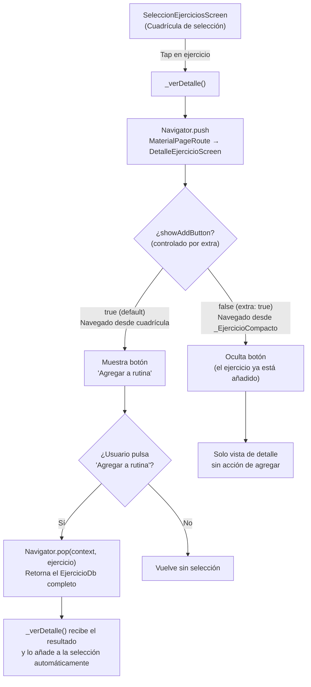
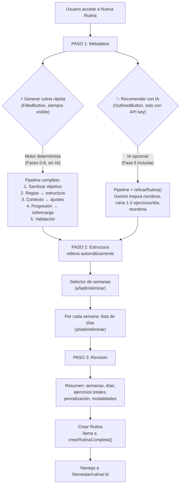
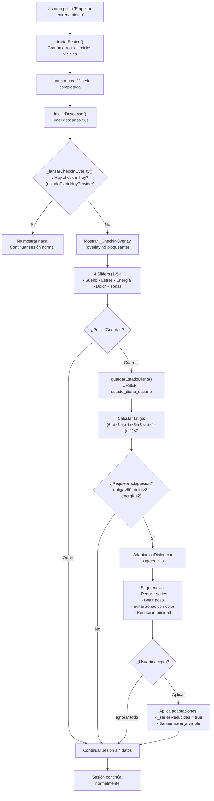
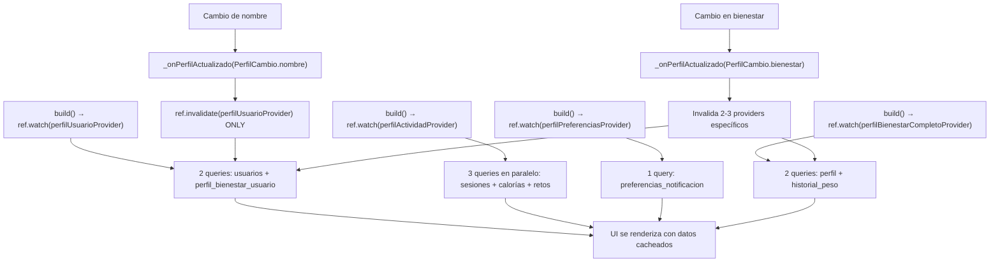
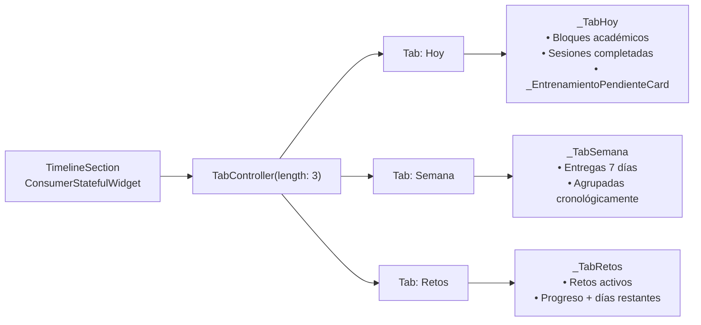

# 06 - Frontend (Estructura UI, Componentes y Pantallas)

**Proyecto:** SynaptixFit
**Versión:** 6.0
**Fecha:** 12-06-2026
**Referencia:** [03-architecture.md](03-architecture.md), [02-requirements.md](02-requirements.md), [15-ia-recomendacion-sistema.md](15-ia-recomendacion-sistema.md), [04-data-model.md](04-data-model.md)

---

## 1. Arquitectura de Información (MVP v3.0)



## 2. Navegación (GoRouter — ShellRoute)

**Diseño:** Bottom Navigation Bar con 5 tabs, glassmorphism (80% opacidad + 20px backdrop blur). Tab activo con color verde secundario y punto indicador de 4px. Avatar del usuario en el tab central de Perfil.

| Ruta | Pantalla | Descripción |
|------|----------|-------------|
| `/dashboard` | `DashboardScreen` | Inicio con KPIs, retos activos, acceso rápido |
| `/academico` | `PlanAcademicoScreen` | Plan académico semanal con horarios |
| `/academico/asignaturas` | `GestionAsignaturasScreen` | Búsqueda y gestión de asignaturas |
| `/academico/configuracion` | `ConfiguracionAcademicaScreen` | Selección universidad/carrera + carga masiva |
| `/academico/apuntes` | `ApuntesScreen` | Editor Markdown + explorador |
| `/academico/apuntes/editor` | `ApuntesEditorScreen` | Editor Markdown a pantalla completa |
| `/retos` | `RetosScreen` | Retos activos/explorar/completados |
| `/retos/simple` | `CrearRetoSimpleScreen` | Crear reto simple |
| `/retos/complejo` | `CrearRetoComplejoScreen` | Crear reto con hitos |
| `/retos/:id` | `DetalleRetoScreen` | Detalle y progreso |
| `/bienestar` | `RutinasComunidadScreen` | Comunidad y mis rutinas |
| `/bienestar/nueva-rutina` | `NuevaRutinaScreen` | **Crear rutina con IA (3 pasos)** |
| `/bienestar/explorador` | `ExploradorEjerciciosScreen` | Catálogo de ejercicios (~1300) |
| `/bienestar/ejercicio/:id` | `DetalleEjercicioScreen` | Detalle de ejercicio. Soporta `extra: true` para ocultar botón "Agregar a rutina" (usado desde editor de rutina `_EjercicioCompacto`) |
| `/bienestar/rutina/:id` | `RutinaDetalleScreen` | **Gestión: semanas, días, ejercicios, progreso, periodización** |
| `/bienestar/rutina/sesion` | `LiveSessionScreen` | **Entrenamiento en vivo + check-in diario** |
| `/bienestar/sesion-completada` | `SesionCompletadaScreen` | Historial de sesiones |
| `/perfil` | `PerfilScreen` | Perfil + bienestar editable + carreras + ajustes |
| `/notificaciones` | `NotificacionesScreen` | Centro de notificaciones |

**Nota importante:** La ruta `/bienestar/rutina/sesion` debe estar definida ANTES de `/bienestar/rutina/:id` en GoRouter para evitar que "sesion" sea capturado como parámetro `:id`.

### 2.1 Flujo "Agregar a Rutina" desde Detalle de Ejercicio

La pantalla de detalle de ejercicio (`DetalleEjercicioScreen`) implementa un flujo de navegación bidireccional con retorno de datos que permite agregar ejercicios a una selección desde la vista de detalle:



**Parámetro `showAddButton`:**

| Archivo | Línea | Descripción |
|---------|-------|-------------|
| `detalle_ejercicio_screen.dart` | Constructor | `final bool showAddButton` (default `true`). Controla la visibilidad del botón "Agregar a rutina". |
| `app_router.dart` | Ruta `/bienestar/ejercicio/:id` | Acepta `extra: true` para establecer `showAddButton: false`. |
| `seleccion_ejercicios_screen.dart` | `_verDetalle()` | Usa `await Navigator.of(context).push<EjercicioDb>(MaterialPageRoute(...))`. Al recibir el `EjercicioDb` de vuelta, lo añade a la selección. |
| `nueva_rutina_screen.dart` | `_EjercicioCompacto` | Navega con `extra: true` para ocultar "Agregar a rutina" (el ejercicio ya está en la rutina). |

**Comportamiento contextual:**
- **Desde la cuadrícula de selección:** `showAddButton = true` (default). El botón "Agregar a rutina" está visible y al pulsarlo retorna el ejercicio seleccionado mediante `Navigator.pop`.
- **Desde el editor de rutina (`_EjercicioCompacto`):** `showAddButton = false` (vía `extra: true`). El botón se oculta porque el ejercicio ya forma parte de la rutina. El usuario solo puede ver los detalles del ejercicio.

## 3. Gestión de Estado (Riverpod) — Catálogo Completo

### 3.1 Estrategia General

| Provider Type | Uso | Ciclo de vida |
|--------------|-----|---------------|
| `FutureProvider` | Datos que se cargan una vez con refresh manual | Persiste mientras el provider tenga listeners |
| `FutureProvider.family` | Detalle de entidades por ID | Cacheado por parámetro |
| `StreamProvider` | Datos en tiempo real (Supabase Realtime) | Suscripción WebSocket activa mientras haya listeners |
| `StateNotifierProvider` | Estados con lógica de cambio compleja | Persiste en memoria |
| `FutureProvider.autoDispose` | Datos de pantallas que no necesitan persistencia | Se destruye al salir de la pantalla |

**Decisión de `autoDispose`:** Los providers de rutinas, comunidad, bloques y carreras NO usan `autoDispose` porque se consultan desde múltiples pantallas y mantenerlos en memoria evita re-fetching costoso al navegar entre tabs (gracias al `IndexedStack` del `StatefulShellRoute`).

### 3.2 Proveedores del Módulo de Bienestar (IA + Periodización)

| Provider | Tipo | Propósito | Fuente Supabase |
|----------|------|-----------|-----------------|
| `perfilBienestarProvider` | `FutureProvider<PerfilBienestarDb?>` | Perfil físico: antropometría, objetivo, equipamiento, disponibilidad | `perfil_bienestar_usuario` → `BienestarRepository.obtenerPerfilBienestar()` |
| `estadoDiarioHoyProvider` | `FutureProvider<EstadoDiarioDb?>` | Check-in diario de hoy (o null si no se ha hecho) | `estado_diario_usuario` WHERE `usuario_id` AND `fecha = today` |
| `historialSesionUsuarioProvider` | `FutureProvider<HistorialSesionDto?>` | Historial agregado de 4 semanas: RPE promedio, volumen, ejercicios recientes, semanas consecutivas | `sesiones_registradas` (30 últimas) + `series_sesion` (JOIN con `seleccion_de_ejercicios` → `ejercicios`) |
| `estadoPeriodizacionProvider` | `FutureProvider<PeriodizacionEstado>` | Detección de necesidad de descarga: RPE>8 + 3+ semanas + volumen decreciente O fatiga>50 | `sesiones_registradas` (3 semanas) + `estado_diario_usuario` (hoy) |
| `semanasDeRutinaProvider` | `FutureProvider.family<List<SemanaRutinaDb>, String>` | Semanas de una rutina con `tipo_semana` | `semanas_rutina` WHERE `rutina_id` |
| `diasDeSemanaProvider` | `FutureProvider.family<List<DiaRutinaDb>, String>` | Días de entrenamiento de una semana | `dias_rutina` WHERE `semana_id` |
| `ejerciciosDeDiaProvider` | `FutureProvider.family<List<SeleccionEjercicioDb>, String>` | Ejercicios de un día con series/reps/peso | `seleccion_de_ejercicios` WHERE `dia_id` |
| `tiempoDiaProvider` | `FutureProvider.family<int, String>` | Duración registrada de un día (última sesión) | `sesiones_registradas` WHERE `dia_id` (última) |
| `rutinasUsuarioProvider` | `FutureProvider<List<RutinaDb>>` | Rutinas del usuario autenticado | `rutinas` WHERE `usuario_id` |
| `rutinasComunidadProvider` | `FutureProvider<List<RutinaComunidadDto>>` | Rutinas públicas de la comunidad con nombre del autor | `rutinas` WHERE `visibilidad='public'` JOIN `usuarios` |

### 3.2.1 Proveedores del Motor de Recomendaciones (Fases 0-10)

| Provider | Tipo | Propósito |
|----------|------|-----------|
| `geminiApiKeyProvider` | `Provider<String>` | Lee `GEMINI_API_KEY` de `EnvConfig`. Cadena vacía si no configurada. |
| `recomendacionOrquestadorProvider` | `Provider<RecomendacionOrquestadorService>` | Instancia única del orquestador que coordina los 7 servicios del pipeline |
| `generarRutinaProvider` | `FutureProvider.family<ResultadoGeneracion, ({String usuarioId, bool usarIa})>` | Ejecuta el pipeline completo: sanitización → reglas → contexto → transición → progresión → IA (opcional). Invalida y recarga los 4 providers de contexto antes de ejecutar. |

### 3.3 Proveedores del Módulo de Ejercicios

| Provider | Tipo | Propósito | Fuente |
|----------|------|-----------|--------|
| `ejerciciosProvider` | `StreamProvider<List<EjercicioDb>>` | Catálogo completo en tiempo real | `supabase.from('ejercicios').stream()` (Realtime) |
| `catalogosProvider` | `FutureProvider<CatalogosEjercicios>` | Datos maestros: partes_cuerpo, musculos, equipamientos | `partes_cuerpo`, `musculos`, `equipamientos` |
| `ejercicioDetalleProvider` | `FutureProvider.family<EjercicioDb?, String>` | Detalle completo de un ejercicio (incluye instrucciones) | `v_ejercicios_completos` WHERE `id` |
| `ejerciciosFiltradosProvider` | `Family` (lógica en provider) | Búsqueda con filtros por grupo muscular, equipamiento, parte del cuerpo, dificultad, texto | `v_ejercicios_completos` con filtros |

### 3.4 Proveedores del Dashboard

[OBSOLETO v6.0 — Reemplazado por §9 Dashboard Rediseñado]

> **Nota Sprint 9A:** Los QuickActions Pomodoro y Escanear ya no son placeholders — tienen navegación real a `/pomodoro` y `/escanear`. El `QuickActionsRow` es ahora un `ConsumerWidget` que consume `diaPendienteProvider` para el botón Workout.

| Provider | Tipo | Propósito |
|----------|------|-----------|
| `dashboardProvider` | `FutureProvider<DashboardData>` | Datos agregados: usuario, calorías, sesiones, retos activos, notificaciones, perfil bienestar, plan semanal, rutinas activas. 7 queries en paralelo con `Future.wait`. |

### 3.4.1 Proveedores del Pipeline Académico (NUEVOS v5.0)

| Provider | Tipo | Propósito | Fuente Supabase |
|----------|------|-----------|-----------------|
| `cargaAcademicaSemanalProvider` | `FutureProvider<CargaAcademicaSemanalDb?>` | Carga académica de la semana actual (horas estudio, evaluaciones, estrés, sueño). Timeout 8s. | `carga_academica_semanal` WHERE `usuario_id` AND `semana_inicio = lunes` |
| `adherenciaAcademicaProvider` | `FutureProvider<double>` (0-100) | Disciplina académica pura: `cumplimientoHoras(60%) + completitudTareas(30%) + rachaDias(10%)`. NO usa biometrías. | `carga_academica_semanal` + `entregas_examenes` + `horarios_academicos` |
| `estadoEnergeticoProvider` | `FutureProvider<double>` (0-100) | Estado energético compuesto: base lineal (energía 30%, sueño 25%, recuperación 20%, cognitiva 15%, estrés 10%) × 3 gates no lineales. Previene falsos positivos. | `estado_diario_usuario` (hoy) + `carga_academica_semanal` |
| `contextoAcademicoProvider` | `FutureProvider<ContextoAcademico?>` | DTO que agrega carga semanal + exámenes próximos (7 días) + adherencia + energía. Alimenta el pipeline de recomendación. | `carga_academica_semanal` + `entregas_examenes` + `adherenciaAcademicaProvider` + `estadoEnergeticoProvider` |

**Función `syncCargaAcademicaSemanal(ref)`** (`app/lib/features/bienestar/application/rutina_provider.dart:1094`):
- Se ejecuta automáticamente antes de `_recomendarRutina()` en `NuevaRutinaScreen`
- Consulta `horarios_academicos` (tipo='estudio') → calcula horas reales
- Consulta `entregas_examenes` → cuenta evaluaciones y entregas
- UPSERT en `carga_academica_semanal`
- Invalida 4 providers: `cargaAcademicaSemanalProvider`, `adherenciaAcademicaProvider`, `estadoEnergeticoProvider`, `contextoAcademicoProvider`

**Cálculo de `adherenciaAcademicaProvider`:**
- `cumplimientoHoras` (60%): `horasEstudioReales / horasEstudioPlaneadas`
- `completitudTareas` (30%): `entregas_completadas / total_entregas`
- `rachaDias` (10%): `diasUnicosEstudio / 7`
- Resultado: clamp(0, 100). SIN penalización por sueño o estrés.

**Cálculo de `estadoEnergeticoProvider`:**
- Base: `energíaDiaria×0.30 + sueño×0.25 + recuperación×0.20 + cargaCognitiva×0.15 + estrésInvertido×0.10`
- Gate sueño ≤1 → ×0.40
- Gate dolor ≥4 → ×0.60
- Gate energía ≤1 → ×0.50
- Resultado: clamp(0, 100). Previene falsos positivos como "energía=75 con sueño=0".

### 3.5 Funciones de Mutación (en `rutina_provider.dart`)

| Función | Operación SQL | Invalidaciones |
|---------|--------------|----------------|
| `crearRutinaCompleta({nombre, objetivo, visibilidad, duracionSemanas, estructura, ref})` | INSERT `rutinas` + `semanas_rutina` (con `tipo_semana`) + `dias_rutina` + `seleccion_de_ejercicios` | `rutinasUsuarioProvider` |
| `eliminarRutina(rutinaId, ref)` | DELETE `rutinas` (CASCADE) | `rutinasUsuarioProvider` |
| `clonarRutina(rutinaId, ref)` | INSERT `rutinas` (copia como privada) + `seleccion_de_ejercicios` | `rutinasUsuarioProvider` |
| `iniciarSesion({rutinaId, diaId, ref})` | INSERT `sesiones_registradas` + UPDATE `dias_rutina.estado='en_progreso'` | `diasDeSemanaProvider` |
| `finalizarSesion({sesionId, diaId, rutinaId, duracionSegundos, rpe, ref})` | UPDATE `sesiones_registradas` (duración, RPE, calorías) + UPDATE `dias_rutina.estado='completado'` (cascada a semana vía trigger `trg_dias_rutina_estado`) + **`otorgarXp()`** (cálculo: `50 + min(duraciónMin, 90) + rpe × 5`). Retorna `XpResultado?`. | `diasDeSemanaProvider` + `semanasDeRutinaProvider(rutinaId)` + `dashboardProvider` |
| `registrarSerie({sesionId, seleccionId, numeroSerie, reps, peso})` | INSERT `series_sesion` | — |
| `guardarEstadoDiario({sueño, estrés, energía, dolor, zonas, listo, ref})` | UPSERT `estado_diario_usuario` ON CONFLICT (`usuario_id`, `fecha`) | `estadoDiarioHoyProvider` |
| `agregarEjercicioADia({rutinaId, diaId, ejercicioId, series, reps, descanso, ref})` | INSERT `seleccion_de_ejercicios` | `ejerciciosDeDiaProvider(diaId)` + `nombresEjerciciosProvider(diaId)` |
| `quitarEjercicioDeDia(seleccionId, diaId, ref)` | DELETE `seleccion_de_ejercicios` | `ejerciciosDeDiaProvider(diaId)` + `nombresEjerciciosProvider(diaId)` |
| `actualizarEjercicioDia(seleccionId, patch, diaId, ref)` | UPDATE `seleccion_de_ejercicios` — soporta `pesos_kg` (jsonb) como parte del patch | `ejerciciosDeDiaProvider(diaId)` + `nombresEjerciciosProvider(diaId)` |
| `agregarDiaASemana(semanaId, numeroDia, ref)` | INSERT `dias_rutina` | `diasDeSemanaProvider(semanaId)` |

### 3.6 Proveedores del Módulo de Perfil

| Provider | Tipo | Propósito |
|----------|------|-----------|
| `perfilUsuarioProvider` | `FutureProvider<PerfilUsuario>` | Usuario + perfil bienestar (2 queries, cacheado). Se invalida solo cuando cambia nombre o perfil. |
| `perfilBienestarCompletoProvider` | `FutureProvider<PerfilBienestarCompleto?>` | Perfil bienestar + historial peso (2 queries). Se invalida solo en cambios de bienestar. |
| `perfilActividadProvider` | `FutureProvider<PerfilActividad>` | Sesiones, logros, calorías (3 queries en paralelo con `Future.wait`). |
| `perfilPreferenciasProvider` | `FutureProvider<PreferenciasNotificacionDb>` | Preferencias de notificación (1 query). |
| `perfilCompletoProvider` | `FutureProvider<PerfilCompleto>` | Compuesto que delega en los 4 providers anteriores. Para compatibilidad con otras pantallas. |
| `usuarioCarrerasProvider` | `FutureProvider` | Carreras vinculadas del usuario (M:N) |
| `carrerasUsuarioConNombreProvider` | `Family` | Carreras con nombre de universidad resuelto vía JOIN |
| `carreraConAsignaturasProvider` | `FutureProvider<List<({CarreraDb, List<AsignaturaCatalogoDb>})>>` | Carreras del usuario con sus asignaturas del catálogo. Intenta primero `usuario_carreras` (FK); fallback a búsqueda por nombre desde `perfil_academico_usuario.carrera`. Útil para la sección Plan de estudios en PerfilScreen. |
| `asignaturasUsuarioSemestreProvider` | `FutureProvider<List<AsignaturaUsuarioSemestreDb>>` | Asignaturas del catálogo con `semestre=0` que el usuario ha mapeado a un curso+semestre mediante la tabla `asignaturas_usuario_semestre`. |
| `asignaturasSinSemestreProvider` | `FutureProvider<List<AsignaturaCatalogoDb>>` | Asignaturas del catálogo con `semestre=0` (optativas/transversales sin temporalidad fija) que el usuario puede mapear manualmente. Filtra por carrera del usuario. |
| `_getCarrerasUsuario()` | Función helper | Devuelve `List<String>` de `carrera_id` del usuario. Consulta `usuario_carreras` primero; fallback a búsqueda por nombre desde `perfil_academico_usuario.carrera`. Usada por `asignaturasUsuarioSemestreProvider` y `asignaturasSinSemestreProvider`. |

**Invalidación selectiva (`PerfilCambio` enum):**
- `PerfilCambio.nombre` → solo `perfilUsuarioProvider` (2 queries vs 7)
- `PerfilCambio.bienestar` → `perfilBienestarCompletoProvider` + `perfilUsuarioProvider` + `perfilBienestarProvider` (3-4 queries vs 7)
- `PerfilCambio.preferencias` → solo `perfilPreferenciasProvider` (1 query vs 7)
- `PerfilCambio.todo` → todos los providers
- Sin `autoDispose` → keepAlive implícito en memoria tras primera carga

## 4. Pantalla: Nueva Rutina con IA (`NuevaRutinaScreen`)

**Archivo:** `app/lib/features/bienestar/presentation/nueva_rutina_screen.dart`
**Ruta:** `/bienestar/nueva-rutina`

### 4.1 Flujo de 3 Pasos (v5.0 — con Motor de Recomendaciones)



**Cambios clave respecto a v4.x:**
- **Eliminados:** Botón redundante "Recomendar ejercicios" y método `_recomendarEjercicios()` (~140 líneas). Método `_llenarEstructuraDesdeRecomendacion()` (~30 líneas).
- **Eliminado:** Método privado `_sanitizarObjetivo()` — ahora usa `sanitizarObjetivo()` de `string_utils.dart`.
- **Nuevo:** Botón "⚡ Generar rutina rápida" (FilledButton, siempre visible) ejecuta el pipeline determinista completo en <2s.
- **Nuevo:** Botón "✨ Recomendar rutina con IA" (OutlinedButton, solo visible si `GEMINI_API_KEY` configurada) añade refinamiento con Gemini.
- **`_DiaEditorCard`** ahora recibe `objetivo` como parámetro para defaults contextuales al añadir ejercicios manualmente.
- **`_generarRutinaRapida()`** resuelve nombres de ejercicios desde el catálogo real y aplica defaults por objetivo.

### 4.2 Datos de Entrada al Motor de Recomendaciones

El pipeline determinista (y el refinamiento IA opcional) reciben los siguientes datos, recopilados de providers Riverpod:

| Dato | Provider/Origen | Uso en el pipeline |
|------|----------------|-------------------|
| Edad, sexo, peso, altura, IMC | `perfilBienestarProvider` | `ParametrosObjetivo` + `RecomendacionContextoService` (tendencia peso) |
| Objetivo principal | `perfilBienestarProvider` | `sanitizarObjetivo()` → `ParametrosObjetivo.de()` → tabla de 7 parámetros |
| Nivel de actividad | `perfilBienestarProvider` | `determinarSplit()` y `_nivelNumerico()` en reglas |
| Equipamiento disponible | `perfilBienestarProvider` | Filtro de compatibilidad en `_aplicarFiltros()` |
| Días disponibles / semana | `perfilBienestarProvider` | `determinarSplit()` — árbol de decisión del split |
| Minutos por sesión | `perfilBienestarProvider` | No usado directamente por el motor de reglas (usa `ejerciciosPorDia` de `ParametrosObjetivo`) |
| Historial de sesiones | `historialSesionUsuarioProvider` | `ProgresionCalculator` (sobrecarga) + `RecomendacionReglasService` (filtro de ejercicios recientes) |
| Estado diario (hoy) | `estadoDiarioHoyProvider` | `RecomendacionContextoService` (FCT, fatiga, listoParaEntrenar) |
| Catálogo de ejercicios | `ejerciciosProvider` | Filtrado por equipamiento, enviado a los 5 filtros del motor de reglas |
| Contexto académico | `cargaAcademicaSemanal` | `RecomendacionContextoService.calcularFCT()` — pondera estudio, estrés, evaluaciones |
| Historial de objetivos | `historial_objetivos` | `TransicionObjetivoService` — interpola si hubo cambio de objetivo |
| Ejercicios ya agregados | Estado local del formulario | Lista de exclusión en el motor de reglas (no repite músculos primarios) |

### 4.3 Botón de Cancelación y Pantalla de Generación IA

**Pantalla de carga profesional unificada** para "Recomendar rutina", "Recomendar ejercicios" y "Sugerir Rutina con IA":

```
┌─────────────────────────────────────────────┐
│                                             │
│         (Icono IA con gradiente             │
│          verde, pulsa suavemente)            │
│                                             │
│           SynaptixFit AI                    │
│   Generando tu rutina personalizada          │
│      (o: Generando estructura de ejercicios) │
│                                             │
│      ━━━━━━━━━━━━━━━━━━━━━━━━              │
│      (barra de progreso animada)            │
│                                             │
│   ┌─────────────────────────────────┐      │
│   │ ◌  Analizando tu perfil...      │      │
│   └─────────────────────────────────┘      │
│                                             │
│              [ Cancelar ]                    │
│                                             │
└─────────────────────────────────────────────┘
```

**Secuencias de mensajes por tipo de carga:**

| Etapa | Rutina | Ejercicios |
|-------|--------|------------|
| 1 | Analizando tu perfil físico... | Analizando estructura de la rutina... |
| 2 | Consultando tu historial de entrenamiento... | Evaluando periodización por semana... |
| 3 | Revisando tu estado diario... | Distribuyendo grupos musculares... |
| 4 | Procesando catálogo de ejercicios... | Seleccionando ejercicios compatibles... |
| 5 | Aplicando reglas de periodización... | Ajustando volumen e intensidad... |
| 6 | Personalizando según tu objetivo... | Organizando días de entrenamiento... |
| 7 | Estructurando semanas y días... | Verificando progresión de cargas... |
| 8 | ¡Casi listo! Ajustando detalles finales... | ¡Casi listo! Últimos ajustes... |

**Botón Cancelar:**
- `TextButton.icon` con `Icons.close`, texto "Cancelar", color `theme.colorScheme.error`.
- Llama a `_cancelarCargaIA()`: detiene el `Timer` de mensajes, limpia `_loadingIA` y `_tipoCarga`.
- Muestra Snackbar: "Recomendación cancelada."
- Guard `if (!_loadingIA) return;` tras cada `await` de Gemini descarta respuestas tardías.

**Comportamiento del botón Cancelar:**

| Acción | Resultado |
|--------|-----------|
| Pulsar "Cancelar" durante carga | Se detiene la secuencia de mensajes y se oculta la pantalla de carga. El formulario Paso 1 se muestra intacto. |
| Indicador visual | Pantalla completa de generación con icono pulsante, barra de progreso, mensajes secuenciales y botón Cancelar. |
| Cobertura | Aplica a los 2 botones de IA en Paso 1: "Recomendar rutina" y "Recomendar ejercicios" (vía `_tipoCarga`). |

### 4.4 Campo de Peso con Soporte Decimal

El campo de peso (`pesoKg`) en el editor de ejercicios (Paso 2) ha sido mejorado:

| Aspecto | Antes | Ahora |
|---------|-------|-------|
| Tipo de entrada | `TextInputType.numberWithOptions(decimal: true)` — pero con comportamiento errático en enteros | `TextInputType.numberWithOptions(decimal: true)` con `inputFormatters` que permiten decimales (ej: `75.5`) |
| Facilidad de entrada | Difícil introducir cifras de varios dígitos | Campo numérico fluido con soporte para punto decimal |
| Validación | `double.tryParse(v)` — acepta nulos | `double.tryParse(v)` — acepta nulos y decimales correctamente |
| UI | `TextField` con hint "— kg" | `TextField` con hint "— kg", label "Peso", icono de balanza, teclado numérico optimizado |

### 4.5 Manejo de Errores de IA

| Escenario | Comportamiento |
|-----------|---------------|
| `GEMINI_API_KEY` no configurada | Error descriptivo: "Falta GEMINI_API_KEY en el archivo .env". El formulario sigue funcionando en modo manual. |
| Sin ejercicios compatibles con equipamiento | Error: "No hay ejercicios compatibles con tu equipamiento (peso_corporal, mancuerna)." |
| Gemini no responde (timeout 15s) | Error: "No se pudo conectar con Gemini en este momento." |
| Gemini responde con JSON malformado | `_extraerJson()` intenta 3 estrategias de parsing. Si falla: "Gemini generó una respuesta con formato no válido." |
| Gemini responde con array/objeto vacío | Error específico: "Gemini no generó ejercicios válidos." |
| Usuario cancela manualmente | Snackbar: "Recomendación cancelada". El formulario queda intacto. |

### 4.6 Botón "Sugerir Rutina con IA" y Auto-Trigger

Desde la pantalla de **Rutinas** (`RutinasComunidadScreen`), el usuario dispone de un acceso rápido para generar una rutina con IA sin pasar manualmente por los 3 pasos:

```
RutinasComunidadScreen
  │
  ├── FAB "Nueva rutina" → /bienestar/nueva-rutina (modo manual normal)
  │
  └── Botón "Sugerir Rutina con IA"
        │  FilledButton.tonalIcon verde con Icons.auto_awesome
        │  Ubicado bajo el SegmentedButton de tabs
        │
        └── Navega a /bienestar/nueva-rutina
              extra: {'autoRecomendar': true}
                    │
                    ▼
              NuevaRutinaScreen(autoRecomendar: true)
                    │
                    │  initState() → addPostFrameCallback
                    │
                    └── _recomendarRutina() se dispara automáticamente
                          │
                          ├── Rellena: nombre, descripción, objetivo, duración
                          ├── Muestra SnackBar: "¡Rutina recomendada!"
                          └── El usuario continúa manualmente desde Paso 1
```

**Pantalla de generación IA** (`_buildPantallaGeneracion`):

Cuando se activa el modo auto, en lugar del formulario Paso 1 se muestra una pantalla de carga profesional:

```
┌─────────────────────────────────────────────┐
│                                             │
│         (Icono IA con gradiente             │
│          verde, pulsa suavemente)            │
│                                             │
│           SynaptixFit AI                    │
│      Generando tu rutina personalizada       │
│                                             │
│      ━━━━━━━━━━━━━━━━━━━━━━━━              │
│      (barra de progreso animada)            │
│                                             │
│   ┌─────────────────────────────────┐      │
│   │ ◌  Analizando tu perfil físico...│      │
│   └─────────────────────────────────┘      │
│                                             │
└─────────────────────────────────────────────┘
```

**Secuencia de mensajes animados** (8 etapas, 1800ms cada una):
1. "Analizando tu perfil físico..."
2. "Consultando tu historial de entrenamiento..."
3. "Revisando tu estado diario..."
4. "Procesando catálogo de ejercicios..."
5. "Aplicando reglas de periodización..."
6. "Personalizando según tu objetivo..."
7. "Estructurando semanas y días..."
8. "¡Casi listo! Ajustando detalles finales..."

**Elementos visuales:**
- Icono de IA: círculo 96px con gradiente `#006E2D → #00C853`, glow verde, icono `auto_awesome`.
- Pulso animado: `TweenAnimationBuilder` escala 0.92 → 1.08 en 1200ms, bucle infinito.
- Barra de progreso: `LinearProgressIndicator` indeterminada, 200px, color `#00C853`.
- Mensajes: `AnimatedSwitcher` con `ValueKey` para transición suave entre mensajes.

**Fix de teclado:**
- `autofocus` del campo Nombre ahora es condicional: `autofocus: !widget.autoRecomendar`.
- En modo auto-generación el teclado no se abre, permitiendo ver la pantalla completa.

**Implementación en el router** (`app_router.dart:107-115`):
```dart
GoRoute(
  path: '/bienestar/nueva-rutina',
  builder: (context, state) {
    final extra = state.extra;
    final autoRecomendar =
        extra is Map && extra['autoRecomendar'] == true;
    return NuevaRutinaScreen(autoRecomendar: autoRecomendar);
  },
),
```

**Implementación en la pantalla** (`nueva_rutina_screen.dart:92-98`):
```dart
@override
void initState() {
  super.initState();
  _inicializarEstructura();
  _cargarObjetivoPerfil();
  if (widget.autoRecomendar) {
    WidgetsBinding.instance.addPostFrameCallback((_) => _recomendarRutina());
  }
}
```

El usuario ve la pantalla de generación IA con los mensajes progresivos. Al finalizar, se muestra el Paso 1 con los campos ya rellenados.

| Escenario | Comportamiento |
|-----------|---------------|
| `GEMINI_API_KEY` no configurada | Error descriptivo: "Falta GEMINI_API_KEY en el archivo .env". El formulario sigue funcionando en modo manual. |
| Sin ejercicios compatibles con equipamiento | Error: "No hay ejercicios compatibles con tu equipamiento (peso_corporal, mancuerna)." |
| Gemini no responde (timeout 15s) | Error: "No se pudo conectar con Gemini en este momento." |
| Gemini responde con JSON malformado | `_extraerJson()` intenta 3 estrategias de parsing. Si falla: "Gemini generó una respuesta con formato no válido." |
| Gemini responde con array/objeto vacío | Error específico: "Gemini no generó ejercicios válidos." |
| Usuario cancela manualmente | Snackbar: "Recomendación cancelada". El formulario queda intacto. |


### 4.7 Progreso de Rutinas en "Mis rutinas" (RutinasComunidadScreen)

En la pestaña "Mis rutinas" de la pantalla principal de bienestar (RutinasComunidadScreen), se presentará un resumen visual y creativo sobre el progreso del usuario.

**Elementos UI/UX:**
- **Tarjetas interactivas de rutinas:** Cada rutina activa mostrará una barra de progreso circular o lineal, destacando el porcentaje de completitud.
- **Resumen rápido:** Estadísticas visibles de un vistazo, como "3/12 sesiones completadas", "Faltan 2 días para terminar la semana de carga", y el próximo hito.
- **Incentivos visuales:** Se usarán códigos de colores para reflejar el estado actual (ej. verde para ritmo óptimo, naranja si se aproxima una semana de descarga).
- **Llamada a la acción clara:** Botón prominente de "Continuar entrenamiento" en la rutina activa que lleva directamente a la siguiente sesión pendiente en RutinaDetalleScreen.


## 5. Pantalla: Detalle de Rutina (`RutinaDetalleScreen`)

**Archivo:** `app/lib/features/bienestar/presentation/rutina_detalle_screen.dart`
**Ruta:** `/bienestar/rutina/:id`

### 5.0 Sistema de Drill-Down (Semana → Día → Ejercicios)

La pantalla de detalle implementa un patrón de navegación jerárquico de 3 niveles:

```
┌─────────────────────────────────────────────────┐
│  NIVEL 1: Selector de Semanas                    │
│  ┌─────────┐ ┌─────────┐ ┌─────────┐           │
│  │ Sem 1   │ │ Sem 2   │ │ Sem 3   │ ...       │
│  │ Adapt   │ │ Carga   │ │ Pico    │           │
│  │ 5 ejerc │ │ 6 ejerc │ │ 4 ejerc │           │
│  └────┬────┘ └─────────┘ └─────────┘           │
│       │ (tap)                                   │
│       ▼                                         │
│  ═══════════════════════════════════════════    │
│  NIVEL 2: Lista de Días (Semana seleccionada)   │
│  ┌─────────────────────────────────────────┐   │
│  │ Día 1 — Pierna         4 ejercicios  ▶ │   │
│  │ ▸ Sentadilla con barra   4×8×90s        │   │
│  │ ▸ Prensa de pierna       3×12×60s       │   │
│  │ ▸ Extensión de cuádriceps 3×15×45s      │   │
│  │ ▸ Peso muerto rumano    3×10×90s        │   │
│  ├─────────────────────────────────────────┤   │
│  │ Día 2 — Empuje          5 ejercicios  ▶ │   │
│  │ ▸ Press banca plano      4×8×120s       │   │
│  │ ▸ Press militar          3×10×90s       │   │
│  │ ▸ ... (colapsado)                        │   │
│  └─────────────────────────────────────────┘   │
│       │ (tap en día)                            │
│       ▼                                         │
│  ═══════════════════════════════════════════    │
│  NIVEL 3: Detalle de Día (expansión completa)   │
│  ┌─────────────────────────────────────────┐   │
│  │ Día 1 — Pierna          ▼               │   │
│  │                                          │   │
│  │ 1. Sentadilla con barra                  │   │
│  │    Series: 4  Reps: 8  Descanso: 90s     │   │
│  │    Peso: 80 kg                           │   │
│  │    [−] [Series] [+] [−] [Reps] [+]       │   │
│  │                                          │   │
│  │ 2. Prensa de pierna                      │   │
│  │    Series: 3  Reps: 12  Descanso: 60s    │   │
│  │    Peso: 120 kg                          │   │
│  │    [−] [Series] [+] [−] [Reps] [+]       │   │
│  │    ...                                   │   │
│  └─────────────────────────────────────────┘   │
└─────────────────────────────────────────────────┘
```

**Interacciones de drill-down:**

| Nivel | Acción | Resultado |
|-------|--------|-----------|
| Semana | Tap en chip de semana | Se despliega el nivel 2 con los días de esa semana y vista previa de ejercicios (miniatura) |
| Día (colapsado) | Tap en card de día | El día se expande mostrando el **listado completo de ejercicios** con todos sus detalles editables |
| Día (expandido) | Tap en card de día | El día se colapsa ocultando los detalles |
| Ejercicio | Tap en fila de ejercicio | Entra en **modo edición inline**: se habilitan steppers ± para series, reps, descanso y campo de peso |
| Ejercicio | Long-press | Menú contextual: "Sustituir ejercicio" (abre buscador) o "Eliminar de este día" |

**Estados visuales de días:**

| Estado | Estilo |
|--------|--------|
| `pendiente` | Fondo gris claro, borde sutil, texto "Pendiente" |
| `en_progreso` | Fondo ámbar suave, borde ámbar, icono de reloj |
| `completado` | Fondo verde (#006E2D al 8%), borde verde, check en badge, highlight sutil |

**Animaciones:**
- Expansión/colapso de días con `AnimatedCrossFade` o `AnimatedSize` para transición suave.
- Los ejercicios dentro de un día expandido usan `ListView` con separadores para rendimiento.
- La barra de progreso en el header se actualiza en tiempo real al cambiar estados.

### 5.1 Componentes del Header

| Elemento | Fuente de datos | Descripción |
|----------|----------------|-------------|
| Nombre de rutina | `RutinaDb.nombre` | Título principal |
| Badge de objetivo | `RutinaDb.objetivo` | Chip coloreado: fuerza (rojo), resistencia (azul), hipertrofia (púrpura), movilidad (teal), mixto (gris) |
| Badge de estado | `RutinaDb.estado` | Chip: activo (verde), pausado (ámbar), completado (azul) |
| Duración | `RutinaDb.duracionSemanas` | "4 semanas" |
| Barra de progreso | Cálculo: días completados / días totales | Barra lineal con porcentaje |
| Días completados | Suma de días con `estado='completado'` | "8/16 días" |
| Tiempo total | Suma de `tiempoDiaProvider` para todos los días | "3h 25min acumulados" |

### 5.2 Selector de Semanas con Periodización

```
[Sem 1 Adapt] [Sem 2 Carga] [Sem 3 Carga] [Sem 4 Desc]
    ████          ████         ████          ████
```

Cada chip de semana muestra:
- **Número de semana** (1, 2, 3, 4...)
- **Tipo de semana** con badge coloreado: Adapt (azul), Carga (verde), Pico (naranja), Desc (teal)
- **Icono de check** (✓) si la semana está completada
- **Indicador de ejercicios**: "5 ejercicios" o conteo de días

### 5.3 Lista de Días

Cada día muestra:
- **Número y nombre** ("Día 1", "Día 2 - Pierna"...)
- **Estado:** pendiente (gris), en_progreso (ámbar), completado (verde con fondo)
- **Ejercicios:** lista con nombre, series × reps, peso (kg), descanso
- **Edición inline:** botones ± para series/reps/descanso, campo de peso
- **Botón "Iniciar"** → navega a `LiveSessionScreen` (bloqueado si no hay ejercicios)
- **Botón "Añadir ejercicio"** → abre buscador de catálogo
- **Long-press en ejercicio** → opción de sustituir

### 5.4 Validación Pre-Inicio

```dart
// En RutinaDetalleScreen, antes de navegar a sesión en vivo:
if (ejerciciosDelDia.isEmpty) {
  ScaffoldMessenger.of(context).showSnackBar(
    const SnackBar(content: Text('Este día no tiene ejercicios. Añade al menos uno.')),
  );
  return; // No navega
}
// Si tiene ejercicios → inicia sesión (check-in se hace durante el primer descanso vía _CheckInOverlay)
```

### 5.5 Bloqueo de Día sin Ejercicios

- El botón "Iniciar" se muestra deshabilitado (gris) si `ejerciciosDeDiaProvider` devuelve lista vacía
- Tooltip: "Añade ejercicios a este día antes de empezar"

### 5.6 Invalidación al Modificar Ejercicios

Cuando se añade, quita o edita un ejercicio de un día:
1. `ejerciciosDeDiaProvider(diaId)` + `nombresEjerciciosProvider(diaId)` se invalidan → UI se refresca con nombres actualizados
2. Si el día estaba `completado` → se revierte a `pendiente` en BD y se invalidan `diasDeSemanaProvider` + `semanasDeRutinaProvider`
3. La cascada de semana se delega al trigger `trg_dias_rutina_estado` en BD: si algún día deja de estar completado, la semana se revierte automáticamente
4. El botón "Iniciar" reaparece porque el día vuelve a estar pendiente

### 5.7 Rutina Completada: UI Read-Only + Reutilizar

Cuando todas las semanas de una rutina tienen estado `'completada'`, la UI cambia a modo read-only:

| Elemento | Estado normal | Rutina completada |
|----------|--------------|-------------------|
| Icono editar (AppBar actions) | `edit_outlined` visible | **Oculto** |
| Icono reutilizar (AppBar actions) | No existe | `refresh_rounded` visible |
| Botón inferior | "Completar rutina" | "Reutilizar rutina" |
| Edición inline de ejercicios | Permitida | Bloqueada vía safety gate `_editarRutina()` |
| Diálogo de celebración | No | `_CelebracionDialog` al detectar completitud |

**Flujo "Completar rutina":**

```dart
Future<void> _completarRutina() async {
  // UPDATE rutinas SET estado='completado'
  // Invalida rutinasUsuarioProvider + semanasDeRutinaProvider
  // Navega a context.go('/bienestar')
}
```

- El botón se muestra solo cuando `!todasCompletadas` (quedan semanas pendientes).
- Se invalida `rutinasUsuarioProvider` y `semanasDeRutinaProvider` tras la actualización.
- Navega de vuelta a la lista de rutinas (`/bienestar`).

**Flujo "Reutilizar rutina" (`_reutilizarRutina()`):**

Clona la jerarquía completa de la rutina:

1. **Crear nueva rutina:** INSERT en `rutinas` con nombre `"{original} (copia)"`, visibilidad `'private'`, estado `'activo'`.
2. **Iterar semanas:** Por cada `semanas_rutina` → INSERT con `tipo_semana` preservado.
3. **Iterar días:** Por cada `dias_rutina` → INSERT en la nueva semana.
4. **Copiar ejercicios:** Por cada `seleccion_de_ejercicios` del día original → INSERT con todos los parámetros:
   - `peso_kg`, `pesos_kg` (jsonb), `duracion_segundos`, `distancia_metros`, `tiempo_isometrico_segundos`
5. **Actualizar contador:** `UPDATE rutinas SET cantidad_ejercicios = total`.
6. **Invalidar y navegar:** `ref.invalidate(rutinasUsuarioProvider)` → `context.go('/bienestar/rutina/$nuevoId')`.

**Safety gate:** `_editarRutina()` verifica `todasCompletadas` al inicio y retorna temprano si es `true`.

### 5.8 Pesos por Serie con Toggle "Mismo peso en todas las series"

**Archivo:** `app/lib/features/bienestar/presentation/rutina_detalle_screen.dart`

En la edición inline de ejercicios dentro del detalle de rutina (Nivel 3 expandido), se incorporó un nuevo sistema de pesos por serie:

**Toggle "Mismo peso en todas las series":**
- Cuando está activado (default): las series usan el campo `peso_kg` único.
- Cuando se desactiva: aparecen `N` campos de peso (uno por serie) con steppers ± independientes.

**Estado local:**
```dart
late List<double> _pesosKg;          // Inicializado desde e.pesosKg ?? List.filled(e.series, 0.0)
bool _mismoPeso = e.pesosKg == null;  // true si pesos_kg es null en BD
```

**Comportamiento:**
- Al cambiar el número de series: la lista `_pesosKg` se redimensiona preservando valores existentes.
- Si `_mismoPeso`: se serializa `pesos_kg: null` en el UPDATE.
- Si `!_mismoPeso`: se serializa `pesos_kg: [50.0, 52.5, 55.0, ...]` en el UPDATE a `actualizarEjercicioDia()`.
- Cada campo de peso por serie se muestra en una fila con steppers ±1.0kg / ±0.5kg y sufijo "kg".

**Integración con `actualizarEjercicioDia()`:**

```dart
// En rutina_detalle_screen.dart:1195-1200
final updateMap = <String, dynamic>{...};
if (_mismoPeso) {
  updateMap['pesos_kg'] = null;        // Limpia jsonb, usa peso_kg
} else {
  updateMap['pesos_kg'] = _pesosKg;    // Guarda array de pesos
}
await actualizarEjercicioDia(e.id, updateMap, diaId, ref);
```

## 6. Pantalla: Sesión en Vivo (`LiveSessionScreen`)

**Archivo:** `app/lib/features/bienestar/presentation/sesion_en_vivo_screen.dart`
**Ruta:** `/bienestar/rutina/sesion`

### 6.1 Check-in Diario (durante el primer descanso) + Adaptación IA

El check-in ya no bloquea el inicio de la sesión. El cronómetro aparece **inmediatamente** al pulsar "Empezar entrenamiento", y el check-in se muestra durante el **primer descanso** (tras completar la primera serie). **Si el usuario ya hizo check-in hoy, el overlay no se muestra en absoluto** (verificación silenciosa antes de mostrar).

**Texto del overlay mejorado:** "Tus respuestas adaptan el entrenamiento y mejoran las recomendaciones futuras."



**Reglas de adaptación (locales, sin IA):**

| Condición | Sugerencia | Efecto |
|-----------|-----------|--------|
| `fatiga > 50` | Reducir 1 serie por ejercicio | `_seriesReducidas = true` → efecto en UI (ver más abajo) |
| `fatiga > 50` | Bajar peso 10% en compuestos | Sugerencia visual (no se aplica automáticamente al peso del TextField) |
| `dolor ≥ 3` + zonas | Evitar ejercicios de [zonas] | `_ejerciciosEvitados` se rellena. Banner rojo visible. |
| `energía ≤ 2` | Reducir intensidad general | `_seriesReducidas = true` (mismo efecto) |

**Consumo efectivo de `_seriesReducidas` en la UI:**

La bandera `_seriesReducidas` se pasa desde `_LiveSessionScreenState` → `_EjerciciosList` → `_EjercicioLiveCard`:

```dart
// En _EjercicioLiveCard (sesion_en_vivo_screen.dart:714-715)
final seriesEfectivas =
    seriesReducidas ? (e.series - 1).clamp(1, 99) : e.series;
```

| Aspecto | Normal | `seriesReducidas == true` |
|---------|--------|--------------------------|
| Series por ejercicio | `e.series` | `(e.series - 1).clamp(1, 99)` |
| Texto de series | `"4×10 · 90s"` | `"3×10 · 90s (adaptado)"` en naranja |
| Borde de tarjeta | `outlineVariant` | Naranja con opacidad 30% |
| `List.generate` | `e.series` iteraciones | `seriesEfectivas` iteraciones |

**Prellenado de pesos por serie desde `pesos_kg`:**

```dart
// En _EjercicioLiveCard (sesion_en_vivo_screen.dart:822-834)
final pesoInicial = (e.pesosKg != null &&
        i < e.pesosKg!.length &&
        e.pesosKg![i] > 0)
    ? e.pesosKg![i]
    : e.pesoKg;
```

Cada campo de peso en la sesión en vivo se inicializa con el valor del array `pesos_kg` para esa serie específica. Si no existe o es 0, usa `peso_kg` como fallback.

**Banners de estado durante la sesión:**
- Banner naranja: "Sesión adaptada: -1 serie por ejercicio" (visible si `_seriesReducidas == true`)
- Banner rojo: "Se evitarán ejercicios de: [zonas]" (visible si `_ejerciciosEvitados` no está vacío)

### 6.2 Funcionalidad Durante la Sesión

| Componente | Comportamiento |
|------------|---------------|
| **Cronómetro** | Se inicia automáticamente al entrar. Muestra `HH:MM:SS` en AppBar. |
| **Lista de ejercicios** | Cada ejercicio muestra sus series como filas con: checkbox circular, campo de peso (kg) editable, campo de reps editable. |
| **Check de serie** | Al marcar completada → `registrarSerie()` + inicia cronómetro de descanso (90s). |
| **Cronómetro de descanso** | Cuenta atrás visible. Botones: `+15s`, `-15s`, `Saltar`. Al llegar a 0, desaparece automáticamente. |
| **Edición de peso/reps** | Campos editables inline durante la sesión. Se guardan en `series_sesion`. |

### 6.3 Diálogo de Finalización

Al pulsar "Finalizar sesión":
1. Muestra duración total en formato legible (ej: "45 min 30 s")
2. **Slider RPE** (1-10): Rate of Perceived Exertion
3. **ChoiceChips de persistencia:**
   - "Solo hoy": los cambios de peso/reps NO se guardan en `seleccion_de_ejercicios` (solo en `series_sesion`)
   - "Para siempre": los cambios de peso/reps SÍ se actualizan en `seleccion_de_ejercicios` para futuras sesiones
4. Al confirmar → `finalizarSesion()` actualiza `sesiones_registradas` (duración, RPE, calorías), calcula XP (`50 + min(duraciónMin, 90) + rpe × 5`), llama `otorgarXp()` y retorna `XpResultado?`.
5. **NUEVO v5.2 — Feedback de XP:** Tras finalizar, se muestra SnackBar:
   - **Sin level-up:** `"+130 XP 🔥"` (duración 2s)
   - **Con level-up:** `"¡Subiste a nivel 5! 🎉 +130 XP"` (duración 3s)
6. Navegación de vuelta a `RutinaDetalleScreen`

**Cambio en navegación post "Completar rutina":**
- Desde `RutinaDetalleScreen`, el botón "Completar rutina" ahora navega a `context.go('/bienestar')` (vuelve a la lista principal), en lugar de permanecer en la misma pantalla.

### 6.4 Indicador de Fatiga

En `RutinaDetalleScreen`, antes de pulsar "Empezar entrenamiento":
- Si `estadoDiarioHoyProvider` devuelve `requiereAdaptacion == true` → banner naranja:
  > ⚠️ Hoy tu cuerpo necesita un entrenamiento más ligero. La IA adaptará las recomendaciones.

## 7. Pantalla: Perfil de Usuario (`PerfilScreen`)

**Archivo:** `app/lib/features/perfil/presentation/perfil_screen.dart` (~1277 líneas)
**Ruta:** `/perfil`

Estructura: `NestedScrollView` con `DefaultTabController(length: 3)` — 3 pestañas bajo un Hero Header común.

### 7.1 Hero Header (`_HeroHeader`)

Widget `SliverToBoxAdapter` al inicio del `NestedScrollView`, con diseño atlético moderno:

| Elemento | Descripción |
|----------|-------------|
| **Fondo** | `LinearGradient` de 3 tonos navy: `#0A1628` → `#152238` → `#0D1B2A` |
| **Avatar** | `Container` 88px circular con anillo de gradiente verde (`#72FE8G` → `#006E2D`) y `boxShadow` glow. Contenido: `ClipOval` con `Image.network` (carga progresiva con `loadingBuilder`) y fallback a inicial estilizada (`_avatarInitial()`: texto verde sobre fondo `#1A2A40`) |
| **Nombre** | `Text` blanco 22px `FontWeight.w800`, `maxLines: 1`. Icono `Icons.edit` a la derecha con `InkWell` → diálogo `_editarNombre()` → `BienestarRepository.actualizarNombre()` → invalida `_onPerfilActualizado(cambio: PerfilCambio.nombre)` → solo `perfilUsuarioProvider` (2 queries) |
| **Email** | Texto con opacidad 50%, 13px |
| **Badge de nivel** | Chip con `Icons.stars_rounded` verde + "Nivel X". Barra XP: `LinearProgressIndicator` con progreso `xpTotal / (1000 × nivel)`, color `#72FE8G` |
| **Mini stats** | Fila: racha (🔥), días/semana (📅), minutos/sesión (⏱) — emoji 18px + valor blanco 15px bold + label 10px gris |

Datos del header: `UsuarioDb` (nombre, email, nivel, xpTotal, rachaActual, urlAvatar) + `PerfilBienestarDb` (diasDisponiblesSemana, minutosPorSesion).

### 7.2 Pestaña 1 — Estadísticas (`_EstadisticasTab`)

`Row` con 4 `Expanded` stats: Sesiones, XP, Calorías, Retos (separados por `_statDivider`).

| Stat | Valor | Icono |
|------|-------|-------|
| **Sesiones** | `act.sesiones` | `Icons.fitness_center_rounded` |
| **XP** | `_formatNum(widget.usuario.xpTotal)` | `Icons.stars_rounded` |
| **Calorías** | `_formatNum(act.caloriasAcumuladas)` | `Icons.local_fire_department_rounded` |
| **Retos** | `act.logros` | `Icons.emoji_events_rounded` |

Cada stat se renderiza con `_statItem()`: icono, valor numérico grande (`fontSize: 22`, `FontWeight.w800`), label descriptivo. Los separadores verticales (`_statDivider`) dividen las 4 columnas.

### 7.3 Pestaña 2 — Bienestar (`_BienestarTab`)

`ListView` con 3 secciones en cards. **Todos los campos del onboarding ahora son editables desde el perfil.**

#### 7.3.1 Perfil físico (9 campos editables)

| Campo | Widget de edición | Rango | Persistencia |
|-------|-------------------|-------|-------------|
| **Peso (kg)** | `AlertDialog` con `TextField` numérico decimal | 30–250 kg | `_guardar({'peso_kg': v, 'altura_cm': p.alturaCm})` |
| **Altura (cm)** | `AlertDialog` con `TextField` numérico decimal | 120–230 cm | `_guardar({'altura_cm': v, 'peso_kg': p.pesoKg})` |
| **IMC** | Solo lectura | Calculado automáticamente | `p.imc.toStringAsFixed(1) · p.imcCategoria` |
| **Sexo** | `SimpleDialog` con radio buttons | `masculino`, `femenino`, `prefiero_no_decirlo` | `_guardar({'sexo': result})` |
| **Edad** | `AlertDialog` con `TextField` numérico entero | 1–120 años | `_guardar({'edad': edad})` |
| **Objetivo principal** | `SimpleDialog` con radio buttons | `fitness_general`, `perder_peso`, `ganar_masa`, `fuerza`, `resistencia`, `movilidad` | `_guardar({'objetivo_principal': result})` |
| **Nivel de actividad** | `SimpleDialog` con radio buttons | `sedentario`, `ligero`, `moderado`, `alto` | `_guardar({'nivel_actividad': result})` |
| **Días/semana** | `AlertDialog` con `TextField` numérico entero | 1–7 | `_guardar({'dias_disponibles_semana': val})` |
| **Minutos/sesión** | `AlertDialog` con `TextField` numérico entero | 10–180 | `_guardar({'minutos_por_sesion': val})` |

Todos los valores muestran `'—'` si son 0 o no existen. Cada fila editable muestra `Icons.edit` a la derecha con `InkWell`.

#### 7.3.2 Equipamiento

- Muestra chips configurados con `Wrap` (fondo `#006E2D` al 8%, texto verde oscuro 12px bold)
- Si no hay equipamiento: texto "Sin equipamiento configurado"
- Botón `OutlinedButton.icon` "Configurar equipamiento" → `_editarEquipamiento()`: diálogo con `StatefulBuilder` + `FilterChip` multi-selección de 8 opciones: `peso_corporal`, `mancuernas`, `barra`, `banda_elastica`, `kettlebell`, `polea`, `maquina`, `medicina_ball`

#### 7.3.3 Evolución de peso

- Lista de últimos 5 registros desde `historial_peso` (orden `registrado_en DESC`)
- Formato: `día/mes/año` → `X kg · IMC Y`
- Si vacío: "Sin registros aún"

### 7.4 Pestaña 3 — Ajustes (`_AjustesTab`)

`ConsumerWidget` con `ListView`:

| Elemento | Descripción | Acción |
|----------|-------------|--------|
| **Visibilidad del perfil** | `ListTile` con icono `visibility_rounded`. Subtítulo: "Privado · Solo tus amigos pueden ver tus rutinas" | `onTap: () {}` (placeholder) |
| **Notificaciones** | `ListTile` con icono `notifications_rounded`. Subtítulo: "Modo: X · Y/día" desde `PrefsNotificacionDb` | `context.push('/notificaciones')` |
| **Modo silencio** | `ListTile` con icono `dark_mode_rounded`. Subtítulo: horario desde `PrefsNotificacionDb` | `onTap: () {}` (placeholder) |
| **Carreras universitarias** | `_CarrerasCard` (`ConsumerWidget`): muestra count + botón "Gestionar carreras" → `/academico/configuracion`. Se oculta si `usuarioCarrerasProvider` está vacío | `context.push('/academico/configuracion')` |
| **Cerrar sesión** | `OutlinedButton.icon` rojo (`#EF4444`) con borde `#3B1C1C`, altura 44px | `authController.logout()` → `context.go('/acceso')` |

### 7.5 Flujo de carga y datos (v3.2 — Caché con invalidación selectiva)



**Arquitectura de providers:**

| Provider | Queries | Invalida con | Tiempo estimado |
|----------|---------|-------------|-----------------|
| `perfilUsuarioProvider` | 2 (usuarios + perfil_bienestar) | `PerfilCambio.nombre` | ~200ms |
| `perfilActividadProvider` | 3 (paralelas con `Future.wait`) | `PerfilCambio.todo` | ~200ms |
| `perfilPreferenciasProvider` | 1 | `PerfilCambio.preferencias` | ~100ms |
| `perfilBienestarCompletoProvider` | 2 | `PerfilCambio.bienestar` | ~200ms |

- Sin `autoDispose` → datos permanecen en memoria tras primera carga.
- La UI se actualiza instantáneamente porque cada provider se invalida individualmente.
- Antes (v3.1): cada cambio invalidaba 7 queries secuenciales (~800ms).
- Ahora (v3.2): cambio de nombre → 2 queries (~200ms). Cambio de bienestar → ~3 queries (~250ms).

### 7.6 Sincronización

- `_onPerfilActualizado(cambio: PerfilCambio)` recibe el tipo de cambio para invalidación selectiva.
- `BienestarRepository.actualizarPerfilParcial(data)` persiste cambios parciales en `perfil_bienestar_usuario`.
- Avatar: `Image.network` con `loadingBuilder` (muestra inicial durante carga) y `errorBuilder` (fallback a inicial estilizada).
- El nombre se lee de `usuarios.nombre_completo` (tabla pública), no de `perfil_bienestar_usuario`.
- `_TabBarDelegate` (`SliverPersistentHeaderDelegate`) mantiene el `TabBar` fijado al hacer scroll.

### 7.7 Plan de estudios (sección académica en PerfilScreen)

Widget `_PlanEstudiosView` (StatefulWidget con providers) que se muestra como vista adicional dentro del perfil. Contiene:

#### 7.7.1 Cabecera — Institución y semestre actual

- **Card de institución** (`_buildInstitucionCard`): gradiente sutil, icono `school`, nombre de universidad (editable) y carrera.
- **"Curso X · Y° Semestre"** — texto estático que refleja `perfilAcademicoProvider.cursoActual` y `perfilAcademicoProvider.semestreEnCurso`.

#### 7.7.2 Plan de estudios — Cards de curso

Una fila (`Row`) con tarjetas por cada curso disponible, usando `_buildCursoCards()`:

```
┌─────────┐ ┌─────────┐ ┌─────────┐
│  1°     │ │  2°     │ │  3°     │
│  Curso  │ │  Curso  │ │  Curso  │
│ 5 asig. │ │ 6+1 asig│ │ 7 asig. │
└─────────┘ └─────────┘ └─────────┘
```

- Cada card muestra el número de curso, label "Curso", y contador de asignaturas.
- **Contador en tiempo real**: si hay transversales mapeadas (`asignaturasUsuarioSemestreProvider`), se muestra como "5+1 asig." donde el `+1` son las transversales mapeadas a ese curso.
- El contador usa color `tertiary` si hay transversales, `primary` si no.
- Tap en cada card abre `_showCursoBottomSheet()`: `DraggableScrollableSheet` con `DefaultTabController` (un tab por semestre) mostrando asignaturas del curso filtradas por semestre, con `_buildCursoSubjectRow()`.

#### 7.7.3 Asignaturas transversales (colapsable)

Sección `ExpansionTile` con título "Asignaturas transversales" + badge con conteo. Visible solo si `asignaturasSinSemestreProvider` tiene datos.

Cada fila (`_buildSinSemestreRow`) muestra:
- Icono `menu_book_outlined`
- Nombre de la asignatura
- Badge de créditos (ej: "6 ECTS")
- Badge de estado de mapeo: "Curso 2 · 1° Sem" (si ya mapeada) o "Sin asignar" (si no)
- **Botón +** (si no mapeada): agrega la asignatura al curso y semestre actual del usuario (`INSERT` en `asignaturas_usuario_semestre` con `cursoActual` y `semestreEnCurso`). Invalida `asignaturasUsuarioSemestreProvider` tras la inserción.
- **Botón ✕** (si ya mapeada): elimina el mapeo (`DELETE` de `asignaturas_usuario_semestre`). Invalida `asignaturasUsuarioSemestreProvider`.

#### 7.7.4 Curso y Semestre — Edición

Después de la sección de transversales, se muestran filas editables:

| Campo | Widget | Comportamiento |
|-------|--------|---------------|
| **Curso** | `_editTile` read-only | Muestra `p.cursoActual`. Al hacer tap abre `_seleccionarCurso()`: `SimpleDialog` con `RadioGroup<int>` de 1 hasta `maxCurso` (derivado del catálogo de asignaturas). |
| **Semestre** | `_editTile` editable | Muestra `p.semestreEnCurso°`. Al hacer tap abre `_seleccionarSemestre()`: `SimpleDialog` con `RadioGroup<int>` de solo `[1, 2]` (1° o 2° semestre). |
| **Créditos del semestre** | `_readTile` (solo lectura) | Calculados desde `asignaturas_catalogo` filtrando por curso+semestre actual + transversales mapeadas al mismo curso+semestre. Fallback: `p.creditosSemestreActual`. Formato: "60 ECTS" |
| **Horas estimadas / sem** | `_readTile` (solo lectura) | Mismo cálculo que créditos pero para horas. Fallback: `p.horasObjetivoEstudioSemana`. Formato: "150h" |
| **Promedio objetivo** | `_editTile` editable | Decimal editable (0-5) vía `_editarNumeroDecimal()`. Persiste en `perfil_academico_usuario`. |

#### 7.7.5 Cálculo de créditos y horas

```dart
// En la build de _PlanEstudiosView:
int creditosCalculados = 0;
int horasCalculadas = 0;
// 1. Asignaturas del catálogo filtradas por cursoActual + semestreEnCurso
for (final entry in carreraData) {
  for (final s in entry.subjects) {
    if (s.curso == p.cursoActual && s.semestre == p.semestreEnCurso) {
      creditosCalculados += (s.creditos ?? 0).round();
      horasCalculadas += (s.horas ?? 0);
    }
  }
}
// 2. Incluir transversales mapeadas al mismo curso+semestre
if (mapeos.isNotEmpty) {
  final mappedIds = mapeos
    .where((m) => m.curso == p.cursoActual && m.semestre == p.semestreEnCurso)
    .map((m) => m.asignaturaId).toSet();
  // Sumar créditos/horas de esas asignaturas
}
```

## 8. Componentes Reutilizables

| Componente | Descripción | Uso |
|-----------|-------------|-----|
| `BottomNavBar` | 5 tabs con glassmorphism, avatar en Perfil | ShellRoute |
| `KpiCard` | Anillo, contador, gráfico | Dashboard |
| `ExerciseCard` | GIF, nombre, grupo muscular, equipamiento | Explorador, Constructor |
| `ChallengeProgressBar` | Lineal, circular | Dashboard, Detalle de Reto |
| `MilestoneCard` | Título, peso, progreso | Crear Reto Complejo, Detalle |
| `NotificationCard` | Ícono, prioridad, acción rápida | Centro de Notificaciones |
| `FeedCard` | Avatar, logro, interacciones | Muro Social |
| `SkeletonLoader` | Shimmer effect | Todas las pantallas con carga |
| `EmptyState` | Ilustración + mensaje | Todos los estados vacíos |
| `SemanaBadge` | Chip coloreado con tipo de semana | RutinaDetalleScreen |
| `FatigaBanner` | Banner naranja de advertencia | Pre-sesión |
| `FinalidadBadge` | Chip coloreado con finalidad del ejercicio (naranja=fuerza, teal=cardio, índigo=isométrico) | NuevaRutinaScreen, RutinaDetalleScreen |
| `_MiniGifPreview` | Miniatura de GIF de ejercicio (42-48px). Tap abre diálogo a tamaño completo (280px). | Buscador de ejercicios, tarjeta de ejercicio compacta |
| `MetricGauge` | **NUEVO v5.0** — CustomPainter con arco animado 1200ms, punto brillante en el extremo, color dinámico rojo→naranja→amarillo→verde→teal según valor 0-100, alertas contextuales. | Dashboard: sección "Estado Actual" (Energético, Adherencia Académica, Estudio) |

### 8.0 Widget `MetricGauge` (NUEVO v5.0)

**Archivo:** `app/lib/shared/widgets/metric_gauge.dart` (~248 líneas)

Gauge radial animado usado en la sección "Estado Actual" del dashboard para visualizar métricas 0-100:

```dart
class MetricGauge extends StatefulWidget {
  final double value;        // 0-100
  final String label;        // "Energético", "Adherencia", "Estudio"
  final String? subtitle;    // "Académica", "25/30h"
  final String? alert;       // "Descanso recomendado", "Necesita atención"
  final double size;         // 110-130px
}
```

**Características visuales:**
- Arco de 270° con `CustomPainter` (`_GaugePainter`)
- Animación `easeOutCubic` de 1200ms en carga inicial
- Re-animación cuando cambia `value` (transición suave entre valores)
- Punto brillante (círculo 5px) en el extremo del arco
- Color dinámico por umbrales: `<30` rojo, `<50` naranja, `<70` amarillo, `<85` verde, `≥85` teal
- Valor numérico central grande (`fontSize: 28-32`, `FontWeight.w700`)
- Sufijo `/100` debajo del valor
- Chip de alerta contextual con color de fondo semitransparente

**Uso en el dashboard** (`app/lib/features/dashboard/presentation/dashboard_screen.dart:156-279`):

```dart
MetricGauge(
  value: energia,                    // desde estadoEnergeticoProvider
  label: 'Energético',
  alert: energia < 30 ? 'Descanso recomendado' : null,
  size: 130,
),
MetricGauge(
  value: adherencia,                 // desde adherenciaAcademicaProvider
  label: 'Adherencia',
  subtitle: 'Académica',
  alert: adherencia < 40 ? 'Necesita atención' : null,
  size: 130,
),
MetricGauge(
  value: estudioPct,                 // calculado de cargaAcademicaSemanalProvider
  label: 'Estudio',
  subtitle: '${horasReales}/${horasPlaneadas}h',
  size: 130,
),
```

### 8.0.1 Dashboard — Sección "Estado Actual" (NUEVA v5.0) + Limpieza de KPIs (v5.2)

[OBSOLETO v6.0 — Reemplazado por §9 Dashboard Rediseñado]

**Limpieza de KPIs (v5.2):**

Los siguientes KPIs fueron eliminados del dashboard por ser métricas sin datos reales ("métricas muertas"):
- **KPI "Horas de estudio"** — eliminado (dato no persistido ni calculado correctamente en BD)
- **KPI "Racha actual"** — eliminado (la racha nunca se actualizaba → siempre era 0)
- **Badge 🔥 del `_SaludoCard`** — eliminado (ahora solo muestra nivel + XP con punto de energía)

**KPI "Calorías hoy"** ahora se oculta cuando `calorias == 0` (antes siempre visible con valor 0, mostrando una métrica vacía).

**Grid de KPIs dinámico** (`_buildKpiGrid` en `dashboard_screen.dart:312`):
- `crossAxisCount` ahora es `children.length.clamp(1, 2)` en vez de un valor fijo
- Cuando solo queda "Sesiones completadas" (calorías = 0), el grid muestra 1 columna
- Cuando hay 2 KPIs (calorías > 0 + sesiones), el grid muestra 2 columnas
- `_buildKpiColumn` refactorizado de arrow function a método con cuerpo para legibilidad

**Indicador de energía en SaludoCard:**
- Punto de color (🟢 verde, 🟡 amarillo, 🟠 naranja, 🔴 rojo) junto al nivel/XP
- Basado en `estadoEnergeticoProvider`: `<30` rojo, `<50` naranja, `<70` amarillo, `≥70` verde
- **v5.2:** Badge de racha (🔥) eliminado. Solo se muestra nivel + XP con punto de energía.

### 8.1 Enum `FinalidadEjercicio`

**Archivo:** `app/lib/shared/models/db_models.dart:96-137`

```dart
enum FinalidadEjercicio {
  fuerza,      // Pesas, reps, descanso — naranja
  cardio,      // Duración, distancia — teal
  isometrico;  // Tiempo de sujeción — índigo

  static FinalidadEjercicio fromString(String value);  // desde BD
  String get etiqueta;  // 'Fuerza', 'Cardio', 'Isométrico'
  String get icono;     // '🏋️', '🏃', '🧘'
}
```

El enum se usa en:
- `EjercicioDb.finalidad` — campo del modelo, leído desde la columna `finalidad` en BD
- `_EjercicioCompacto._finalidadChip()` — badge de color + icono + etiqueta
- `_EjercicioCompacto._buildCamposDinamicos()` — switch para renderizar campos específicos
- `RecomendacionIaService` — prompts de IA incluyen reglas por finalidad

### 8.2 Widget `_EjercicioCompacto` (Campos Dinámicos por Finalidad)

**Archivo:** `app/lib/features/bienestar/presentation/nueva_rutina_screen.dart:1748-2067`

Cada tarjeta de ejercicio en el Paso 2 (Editor de estructura) ahora muestra campos diferentes según la `finalidad` del ejercicio, mediante un `switch` en `_buildCamposDinamicos()`:

```
┌─ Fuerza (naranja 🏋️) ──────────────────────────────┐
│  [Series: 3] [Reps: 10]                            │
│  [Descanso: 90s]   [Peso: — kg]                    │
└────────────────────────────────────────────────────┘

┌─ Cardio (teal 🏃) ─────────────────────────────────┐
│  [Intervalos: 5]   [Duración: 5m 30s]              │
│  [Distancia: — m]  [Descanso: 60s]                 │
└────────────────────────────────────────────────────┘

┌─ Isométrico (índigo 🧘) ───────────────────────────┐
│  [Series: 3]  [Sujeción: 45s]                      │
│  [Descanso: 60s]                                   │
└────────────────────────────────────────────────────┘
```

**Campos por finalidad:**

| Finalidad | Campos | Widget |
|-----------|--------|--------|
| `fuerza` | Series, Reps, Descanso, Peso(kg) | `_paramPill` steppers ± y `_pesoPill` (TextField decimal) |
| `cardio` | Intervalos (=series), Duración, Distancia (opc), Descanso | `_paramPill`, `_duracionPill` (input libre tipo "5m 30s" → parseado a segundos), `_distanciaPill` |
| `isometrico` | Series, Tiempo de sujeción (s), Descanso | `_paramPill`, `_tiempoIsometricoPill` (TextField numérico) |

**Nuevo: Pesos por serie con toggle:** El widget `_EjercicioCompacto` en `nueva_rutina_screen.dart` también incorpora el sistema de pesos por serie:
- Estado local `_pesosKg` (`List<double>`), `_mismoPeso` (`bool`).
- Toggle "Mismo peso en todas las series" en el editor.
- Cuando se desactiva, aparecen `N` campos de peso por serie con steppers ±1.0kg/±0.5kg.
- Al cambiar el número de series, `_pesosKg` se redimensiona: añade el último valor si crece, o recorta si se reduce.
- Serialización: si `_mismoPeso == true` → no se envía `pesos_kg` al INSERT. Si `false` → se envía `pesos_kg: _pesosKg`.
- `EjercicioInput.pesosKg` (`List<double>?`) transporta los pesos por serie desde `_EjercicioCompacto` hasta `crearRutinaCompleta()`.

**Parser de duración libre (`_parseDuracion()`):** Acepta formatos como `"5m 30s"`, `"5:30"`, `"300"` (segundos puros), `"5 min"`, `"5m"`. Se almacena en segundos en `duracionSegundos`.

### 8.3 Widget `_MiniGifPreview`

**Archivo:** `app/lib/features/bienestar/presentation/nueva_rutina_screen.dart:1544-1623`

Muestra una miniatura del GIF del ejercicio con tamaño configurable:

| Ubicación | Tamaño | Comportamiento |
|-----------|--------|---------------|
| Buscador de ejercicios (`_BuscadorEjerciciosSheet`) | 48px | Tap → diálogo 280px con GIF a tamaño completo |
| Tarjeta de ejercicio compacta (`_EjercicioCompacto`) | 42px | Tap → mismo diálogo ampliado |

Usa `CachedNetworkImage` con `placeholder` (icono de imagen) y `errorWidget` (icono de pesa). El diálogo de vista ampliada tiene fondo negro semitransparente, borde redondeado 20px, y botón de cierre en la esquina superior derecha.

### 8.4 Pantalla de Resumen de Rutina (`_buildPaso3`) — Enriquecida

**Archivo:** `app/lib/features/bienestar/presentation/nueva_rutina_screen.dart`

El Paso 3 (revisión antes de guardar) fue enriquecido con visualización avanzada de metadatos, periodización y parámetros dinámicos:

#### 8.4.1 Corrección de Bug — `Expanded` en Filas

**Problema:** Los `Row` con `_resumenFila` causaban `RenderFlex` con `BoxConstraints(unconstrained)` cuando los hijos no tenían restricciones explícitas.

**Solución:** Todos los hijos de `Row` en el resumen ahora se envuelven en `Expanded` para garantizar que cada columna reciba restricciones de ancho del padre:

```dart
Row(
  children: [
    Expanded(child: _resumenFila('Objetivo', ...)),
    Expanded(child: _resumenFila('Duración', ...)),
  ],
)
```

#### 8.4.2 Visualización de Descripción

El campo `_descCtrl.text` (descripción de la rutina) ahora se muestra en el resumen cuando no está vacío, mediante una card dedicada con icono `description` y fondo sutil.

#### 8.4.3 Chips de Periodización (`tipo_semana`)

Cada semana muestra un chip coloreado indicando su fase de periodización:

| Tipo | Color | Significado |
|------|-------|-------------|
| `adaptacion` | Ámbar | 70% volumen, énfasis en técnica |
| `carga` | Naranja | 85-90% volumen, progresión |
| `pico` | Rojo | Máxima intensidad |
| `descarga` | Teal | 60% volumen, recuperación activa |

**Implementación:** Nuevo helper `_calcularTipoSemana()` en `nueva_rutina_screen.dart` que replica la lógica de `rutina_provider.dart`. El chip se renderiza mediante `_buildTipoSemanaChip()` con `ChoiceChip` estilizado.

#### 8.4.4 Fila de Resumen por Ejercicio (`_buildExerciseSummaryRow`)

Reescrito para mostrar chips informativos por cada ejercicio en el resumen:

| Chip | Condición | Color | Ejemplo |
|------|-----------|-------|---------|
| **Circuito** | `esCircuito == true` | Púrpura | `🔄 Circuito` |
| **Finalidad** | Siempre visible | Variable (ver tabla) | `🏋️ Fuerza` |
| **Modalidad** | Siempre visible | Variable | `⚡ Fuerza` |

**Colores de finalidad** (helper `_colorFinalidad()`):

| Finalidad | Color |
|-----------|-------|
| Hipertrofia | Púrpura |
| Fuerza | Rojo |
| Cardio | Verde |
| Resistencia | Azul |
| Movilidad | Teal |
| Isométrico | Índigo |
| (default) | Gris |

**Modalidades de entrenamiento** (helper `_buildModalidadChip()`):
- Fuerza (rojo), Aeróbica (verde), Metabólica (naranja), Movilidad (teal)

#### 8.4.5 Parámetros de Ejercicio Dinámicos (`_buildParametrosEjercicio`)

Reescrito para usar `tipoMedicion` (array) en lugar de `finalidad` (string único), permitiendo ejercicios con múltiples tipos de medición. Muestra dinámicamente:

| Tipo de Medición | Campos Mostrados | Formato |
|-----------------|-----------------|---------|
| Fuerza / Hipertrofia | Series × Reps | `4×8` |
| Isométrico | Series × Tiempo | `3×45s` |
| Cardio | Duración, Distancia (opcional) | `30 min · 5 km` |
| Todos | Peso (kg), Descanso (s) | `60 kg · 90s` |

**Modo Circuito (`esCircuito == true`):**
- Oculta series × repeticiones
- Muestra solo duración total del circuito
- Chip "Circuito" visible (púrpura)

#### 8.4.6 Helpers Nuevos

| Helper | Propósito |
|--------|-----------|
| `_calcularTipoSemana(int semanaNum, int totalSemanas)` | Asigna tipo de periodización a cada semana |
| `_buildTipoSemanaChip(String tipo)` | Renderiza chip de periodización coloreado |
| `_finalidadBadge(String finalidad)` | Chip coloreado con icono de finalidad |
| `_circuitoChip()` | Chip púrpura "Circuito" con icono `loop` |
| `_buildModalidadChip(String modalidad)` | Chip de modalidad de entrenamiento |
| `_colorFinalidad(String finalidad)` | Devuelve `Color` según finalidad |
| `_fmtDistancia(int metros)` | Formatea distancia: `<1000m` → `"X m"`, `≥1000m` → `"X.X km"` |

#### 8.4.7 Función Top-Level `fmtDuracion(int segundos)`

**Archivo:** `app/lib/features/bienestar/presentation/nueva_rutina_screen.dart` (top-level)

Extraída para ser compartida entre `_NuevaRutinaScreenState` y `_EjercicioCompactoState`. Convierte segundos a formato legible:

```dart
String fmtDuracion(int segundos) {
  if (segundos < 60) return '$segundos s';
  final min = segundos ~/ 60;
  final sec = segundos % 60;
  if (sec == 0) return '$min min';
  return '${min}m ${sec}s';
}
```

### 8.5 Widget `_EjercicioCompacto` — Modo Circuito

**Archivo:** `app/lib/features/bienestar/presentation/nueva_rutina_screen.dart`

Cuando `esCircuito == true`, los campos de Series y Reps se ocultan en `_camposFuerza`, mostrando en su lugar un único campo de Duración:

```dart
// En _camposFuerza:
if (widget.esCircuito) {
  // Muestra solo campo de Duración (oculta Series + Reps)
  return _duracionPill(context, ...);
} else {
  // Muestra pills normales de Series, Reps, Descanso, Peso
  return Row(
    children: [
      _paramPill(...), // Series
      _paramPill(...), // Reps
      _paramPill(...), // Descanso
      _pesoField(),    // Peso kg
    ],
  );
}
```

Esta lógica ya existía en versiones anteriores y se verificó su correcto funcionamiento.

## 9. Dashboard Rediseñado (v6.0)

### 9.1 Widgets nuevos

| Widget | Tipo | Provider | Archivo |
|--------|------|----------|---------|
| `SaludoCard` | StatelessWidget | recibe `DashboardData` | `widgets/saludo_card.dart` |
| `SmartBannerCard` | ConsumerWidget | `consejoSmartProvider` | `widgets/smart_banner_card.dart` |
| `QuickActionsRow` | ConsumerWidget | `diaPendienteProvider` | `widgets/quick_actions_row.dart` |
| `PlanWeekBar` | ConsumerWidget | `rutinaActivaSeleccionadaProvider` | `widgets/plan_week_bar.dart` |
| `CognitiveLoadBar` | ConsumerWidget | `cargaCognitivaProvider` | `widgets/cognitive_load_bar.dart` |
| `StreakRow` | StatelessWidget | recibe params | `widgets/streak_badge.dart` |
| `KpiGrid` | StatelessWidget | recibe `DashboardData` | `widgets/kpi_grid.dart` |
| `TimelineSection` | ConsumerStatefulWidget | `timelineHoyProvider` + `retosProvider` | `widgets/timeline_section.dart` |

### 9.1.1 TimelineSection — 3 Tabs (NUEVO v6.2)

**Archivo:** `app/lib/features/dashboard/presentation/widgets/timeline_section.dart` (454 líneas)
**Modelo:** `app/lib/shared/models/timeline_item.dart` (186 líneas)
**Provider:** `app/lib/features/dashboard/application/timeline_provider.dart` (91 líneas)

La línea de tiempo unificada del dashboard ahora tiene navegación por pestañas con 3 vistas:



**Estructura del widget:**
- `TabController(length: 3, vsync: this)` con `SingleTickerProviderStateMixin`
- `Card` con header (icono timeline + título + botón "Plan" → `/plan-semanal`)
- `TabBar` con 3 tabs: "Hoy", "Semana", "Retos"
- `TabBarView` con altura fija 280px

**Tab "Hoy" (`_TabHoy`):**
- Consume `timelineHoyProvider` (5 queries en paralelo)
- Separa entrenamiento pendiente (`TimelineTipo.entrenamientoPendiente`) del resto
- Muestra `_EntrenamientoPendienteCard` destacada (naranja, con botón "Comenzar")
- Muestra resto de items con `_TimelineTarjeta` (max 4-5)
- Loading: `CircularProgressIndicator`, Error: texto "Error al cargar", Empty: "Sin actividades hoy"

**Tab "Semana" (`_TabSemana`):**
- Filtra items del `timelineHoyProvider` con `tipo == TimelineTipo.entrega`
- Muestra max 7 entregas con `_TimelineTarjeta`
- Empty: "Sin entregas esta semana"

**Tab "Retos" (`_TabRetos`):**
- Consume `retosProvider` (provider existente del módulo de retos)
- Muestra max 5 retos con `_RetoCard`: título, `LinearProgressIndicator` con %, días restantes
- Color dinámico: `fitness` → verde, resto → púrpura
- Empty: "Sin retos activos"

#### TimelineTipo — 9 valores

| Valor | Color | Ícono | Label | Origen de datos |
|-------|-------|-------|-------|-----------------|
| `estudio` | Azul `#2196F3` | `menu_book` | Estudio | `horarios_academicos` (tipo='estudio') |
| `clase` | Púrpura `#9C27B0` | `school` | Clase | `horarios_academicos` (tipo='clase') |
| `deporte` | Verde `#4CAF50` | `fitness_center` | Deporte | `horarios_academicos` (tipo='deporte') o `sesiones_registradas` |
| `sesion` | Verde `#4CAF50` | `check_circle` | Sesion | `sesiones_registradas` (completada) |
| `entrega` | Rojo `#FF5722` | `assignment_turned_in` | Entrega | `entregas_examenes` (no completadas, 7 días) |
| `reto` | Púrpura `#7C4DFF` | `emoji_events` | Reto | `retos` (activos, no completados) |
| `entrenamientoPendiente` | Naranja `#FF9800` | `fitness_center` | Pendiente | `diaPendienteProvider` |
| `nutricion` | Cyan `#00BCD4` | `restaurant` | Nutricion | FUTURIBLE — sin query |
| `sueno` | Índigo `#3F51B5` | `bedtime` | Sueno | FUTURIBLE — sin query |

#### Nuevos providers de timeline

| Provider | Tipo | Propósito | Fuentes |
|----------|------|-----------|---------|
| `timelineHoyProvider` | `FutureProvider<List<TimelineItem>>` | Línea de tiempo unificada del día con 5 queries en paralelo | `horarios_academicos` (hoy) + `sesiones_registradas` (hoy) + `entregas_examenes` (7d, no completadas) + `retos` (activos) + `diaPendienteProvider` |
| `diaPendienteProvider` | `FutureProvider<Map<String, String>?>` | Primer día no completado de la rutina activa, iterando TODAS las semanas. Retorna `{diaId, rutinaId}` o `null`. Unificado para QuickAction, Timeline y RutinaDetalle. | `dashboardProvider` → `semanasDeRutinaProvider(rutinaId)` → `diasDeSemanaProvider(semanaId)` |

**`timelineHoyProvider` — 5 queries en paralelo:**
```dart
final resultados = await Future.wait([
  // 1. Horarios académicos de hoy
  client.from('horarios_academicos').select()...,
  // 2. Sesiones registradas hoy
  client.from('sesiones_registradas').select()...,
  // 3. Entregas pendientes (7 días, no completadas)
  client.from('entregas_examenes').select()...,
  // 4. Retos activos
  client.from('retos').select()...,
]);
// 5. Día pendiente (vía ref.read, no Future.wait)
final diaPend = ref.read(diaPendienteProvider).valueOrNull;
```

**`diaPendienteProvider` — lógica unificada:**
```dart
final diaPendienteProvider = FutureProvider<Map<String, String>?>((ref) async {
  final data = ref.watch(dashboardProvider).valueOrNull;
  if (data == null || data.rutinasActivas.isEmpty) return null;
  final rutinaId = data.rutinasActivas.first.rutina.id;
  // Itera TODAS las semanas, no solo la primera
  final semanas = await ref.watch(semanasDeRutinaProvider(rutinaId).future);
  for (final semana in semanas) {
    final dias = await ref.watch(diasDeSemanaProvider(semana.id).future);
    for (final dia in dias) {
      if (dia.estado != 'completado') {
        return {'diaId': dia.id, 'rutinaId': rutinaId};
      }
    }
  }
  return null;
});
```

#### TimelineItem — DTO unificado

| Campo | Tipo | Descripción |
|-------|------|-------------|
| `id` | `String` | ID único del item |
| `tipo` | `TimelineTipo` | Tipo de actividad (9 valores) |
| `titulo` | `String` | Título principal |
| `subtitulo` | `String` | Subtítulo descriptivo |
| `horaInicio` | `DateTime` | Hora de inicio |
| `horaFin` | `DateTime` | Hora de fin |
| `completado` | `bool` | Si la actividad está completada |
| `datosOriginales` | `Object?` | Referencia al modelo original (HorarioAcademicoDb, SesionRegistradaDb, etc.) |
| `duracionMinutos` | `int?` | Duración en minutos |
| `rpe` | `int?` | RPE de la sesión (si aplica) |
| `diasRestantes` | `int?` | Días hasta el vencimiento (entregas, retos) |
| `rutinaId` | `String?` | ID de la rutina asociada |

**Factory constructors:**
- `TimelineItem.desdeHorario(HorarioAcademicoDb)` — tipo según `tipoActividad`
- `TimelineItem.desdeSesion(SesionRegistradaDb)` — tipo `deporte`, completado=true
- `TimelineItem.desdeEntrega(EntregaExamenDb)` — tipo `entrega`, subtítulo "Vence en X días"
- `TimelineItem.desdeReto(RetoDb)` — tipo `reto`, subtítulo "Quedan X días"
- `TimelineItem.desdeDiaPendiente(Map<String, String>)` — tipo `entrenamientoPendiente`

### 9.2 Funciones compartidas

Extraídas a `app/lib/shared/widgets/dashboard_dialogs.dart`:

- `colorParaScore(double)` — mapea valor a color
- `buildFormulaBar(...)` — barra de fórmula con items
- `buildCalcRow(...)` — fila de cálculo raw/contrib
- `buildGateRow(...)` — fila visual de gate con chips
- `buildStatCard(...)` — tarjeta de estadística
- `mostrarDialogoEnergia(...)` — diálogo de estado energético
- `mostrarDialogoAdherencia(...)` — diálogo de adherencia académica
- `mostrarDialogoEstudio(...)` — diálogo de progreso de estudio

### 9.3 Estados del dashboard

- **Carga:** SmartBanner muestra skeleton shimmer mientras Gemini responde
- **Sin datos:** PlanWeekBar y CognitiveLoadBar se ocultan con `SizedBox.shrink()`
- **Error:** SmartBanner muestra fallback determinista si Gemini falla

## 10. Manejo de Errores

| Código/Situación | Acción del Cliente |
|------------------|-------------------|
| HTTP 400 | Toast con mensaje específico del campo |
| HTTP 401 | Redirigir a pantalla de login |
| HTTP 500 | Retry automático con backoff exponencial |
| Network timeout | Banner "Sin conexión" |
| `GEMINI_API_KEY` no configurada | Error inline en formulario, creación manual habilitada |
| Gemini timeout (15s) | Toast: "No se pudo conectar con Gemini. Inténtalo de nuevo." |
| Gemini JSON malformado | Toast: "Gemini generó una respuesta con formato no válido." |
| Sin ejercicios compatibles | Error inline con lista de equipamiento del usuario |

## 11. Métricas de Rendimiento

| Pantalla | Objetivo | Notas |
|----------|---------|-------|
| Dashboard | < 2s carga inicial | `Future.wait` paraleliza queries |
| Explorador de Ejercicios | < 3s con filtros | Vista materializada `mv_ejercicios_completos` |
| Detalle de Ejercicio | < 1.5s carga GIF R2 | URL pública de R2, sin firma |
| Recomendación IA | < 8s por prompt | Gemini Flash ~2-3s + parsing |
| Interacciones locales | < 300ms | Sin llamadas de red |

## 12. Cobertura de Casos de Uso (v3.0)

| CU ID | Nombre | Pantallas | Estado |
|-------|--------|-----------|--------|
| CU-01 | Registro y autenticación | Bienvenida, Acceso | ✅ |
| CU-02 | Configurar perfil físico | Perfil Físico, Onboarding | ✅ |
| CU-03 | Dashboard | Dashboard | ✅ |
| CU-04 | Planificar semana académica | Plan Académico Semanal | ✅ |
| CU-06 | Crear rutina personal | Explorador, Constructor, NuevaRutinaScreen | ✅ |
| CU-07 | Registrar sesión completada | LiveSessionScreen, Sesión Completada | ✅ |
| CU-10 | Crear reto simple | Crear Reto Simple | ✅ |
| CU-11 | Crear reto complejo | Crear Reto Complejo | ✅ |
| CU-19 | Buscar y seleccionar ejercicios | Explorador, Detalle, Constructor | ✅ |
| **CU-20** | **Crear rutina con recomendación IA** | **NuevaRutinaScreen (3 pasos + IA)** | ✅ |
| **CU-21** | **Check-in diario durante primer descanso** | **LiveSessionScreen → _CheckInOverlay (no bloqueante)** | ✅ |
| **CU-22** | **Crear reto complejo con dependencias** | **CrearRetoComplejoScreen (3 pasos: metadatos, hitos, dependencias)** | ✅ |
| **CU-23** | **Visualizar grafo de dependencias** | **DetalleRetoScreen → GrafoDependencias** | ✅ |

---

## 13. Pantallas de Retos (Sprint 7 — Fase A3)

### 13.1 `DetalleRetoScreen` — Integración del Grafo de Dependencias

**Archivo:** `app/lib/features/retos/presentation/detalle_reto_screen.dart`
**Ruta:** `/retos/:id`

Cuando un reto tiene `tiene_dependencias = true`, la pantalla de detalle ahora incluye el widget `GrafoDependencias` entre la cabecera y la lista de hitos. El grafo se construye desde el provider `grafoRetoProvider(retoId)`:

```dart
// En detalle_reto_screen.dart, dentro del build():
if (reto.tieneDependencias) ...[
  const SizedBox(height: 12),
  Consumer(
    builder: (context, ref, _) {
      final grafoAsync = ref.watch(grafoRetoProvider(retoId));
      return grafoAsync.when(
        data: (grafo) => GrafoDependencias(grafo: grafo),
        loading: () => const _SkeletonGrafo(),
        error: (e, _) => _ErrorGrafoCard(error: e.toString()),
      );
    },
  ),
  const SizedBox(height: 12),
],
```

### 13.2 `CrearRetoComplejoScreen` — 3 Pasos

**Archivo:** `app/lib/features/retos/presentation/crear_reto_complejo_screen.dart`
**Ruta:** `/retos/complejo`

El flujo de creación de retos complejos se ha ampliado a 3 pasos:

| Paso | Nombre | Contenido |
|------|--------|-----------|
| 1 | Metadatos | Título, tipo (fitness/academic), meta, fechas, visibilidad |
| 2 | Hitos | Lista de hitos con título, porcentaje de peso, orden. Añadir/eliminar hitos dinámicamente |
| 3 | Dependencias | Configuración de dependencias entre hitos: seleccionar dependencias (checkboxes), tipo de condición (AND/OR/X_OF_Y), valor N para X_OF_Y |

### 13.3 Widget `GrafoDependencias`

**Archivo:** `app/lib/features/retos/presentation/widgets/grafo_dependencias.dart` (~233 líneas)

Widget que visualiza el grafo de dependencias de los hitos de un reto como un `Card` con layout estratificado por profundidad:

```
┌─────────────────────────────────────────────────┐
│ 🔗 Dependencias                    Leyenda      │
│                                                 │
│  ┌──────────┐    ┌──────────┐    ┌──────────┐  │
│  │  Hito 1  │    │  Hito 2  │    │  Hito 3  │  │
│  │  20% ✅  │    │  30% 🔒  │    │  50% 🔒  │  │
│  └────┬─────┘    └────┬─────┘    └──────────┘  │
│       │ AND           │ OR                      │
│       └──────┬────────┘                         │
│              ▼                                   │
│  ┌──────────────────────┐                       │
│  │       Hito 4         │                       │
│  │       50% 🔒         │                       │
│  │  Cond: X OF Y (1/2)  │                       │
│  └──────────────────────┘                       │
└─────────────────────────────────────────────────┘
```

**Colores por estado:**

| Estado | Color de fondo | Color de borde | Icono |
|--------|---------------|----------------|-------|
| `bloqueado` | `surfaceContainerHighest` | `grey.shade300` | `lock_rounded` |
| `disponible` | `blue.withValues(alpha: 0.15)` | `blue` | `radio_button_unchecked` |
| `enProgreso` | `orange.withValues(alpha: 0.15)` | `orange` | `play_circle_rounded` |
| `completado` | `green.withValues(alpha: 0.15)` | `green` | `check_circle_rounded` |

**Leyenda de condiciones en aristas:**

| Condición | Label |
|-----------|-------|
| `AND` | "Requiere todas" |
| `OR` | "Requiere 1" |
| `X_OF_Y` | "Requiere N de Y" |

### 13.4 Widget `_NodoHitoCard`

**Archivo:** `app/lib/features/retos/presentation/widgets/grafo_dependencias.dart` (widget privado)

Tarjeta individual que representa un hito dentro del grafo:

- **Icono de estado** (22px a la izquierda): coloreado según `EstadoHito`
- **Título del hito** con peso porcentual (`"Hito 1 — 20%"`)
- **Barra de progreso** (`LinearProgressIndicator`) con el progreso actual del hito
- **Chip de condición de desbloqueo**: visible solo si el hito está bloqueado y tiene dependencias. Muestra el tipo de condición y el progreso actual (ej: "AND (1/2)")
- **Indicador visual**: borde coloreado según estado, opacidad reducida para hitos bloqueados

### 13.5 Providers del Módulo de Retos (Sprint 7)

| Provider | Tipo | Propósito | Fuente |
|----------|------|-----------|--------|
| `grafoRetoProvider` | `FutureProvider.family<GrafoReto?, String>` | Construye el grafo de dependencias desde `hitos_de_reto`. Usa `RetoDependenciaService` para construir nodos, aristas, detección de ciclos (DFS) y asignación de profundidad | `hitos_de_reto` WHERE `reto_id` |
| `retoDependenciaServiceProvider` | `Provider<RetoDependenciaService>` | Servicio de construcción y validación de grafos de dependencias | — |

---

## 14. Sincronización Offline (Sprint 7 — Fase C1)

### 14.1 Arquitectura

```
┌─────────────────────────────────────────────────────────────┐
│                     UI Layer (Riverpod)                      │
│  ┌─────────────────┐  ┌──────────────┐  ┌───────────────┐  │
│  │ OfflineIndicator│  │ SyncButton   │  │ ColaBadge     │  │
│  │ Widget          │  │ Widget       │  │ (pendientes)  │  │
│  └────────┬────────┘  └──────┬───────┘  └───────┬───────┘  │
│           │                  │                   │           │
├───────────┼──────────────────┼───────────────────┼───────────┤
│           ▼                  ▼                   ▼           │
│  ┌─────────────────────────────────────────────────────┐    │
│  │           sync_provider.dart (Providers)              │    │
│  │  connectivityStateProvider  ── Stream<State>         │    │
│  │  offlineQueueLengthProvider ── int (cola Hive)       │    │
│  │  syncProgressProvider       ── double (0.0-1.0)     │    │
│  │  sincronizarColaOffline()   ── Future<void>          │    │
│  └──────────┬───────────────────────────────────────────┘    │
│             │                                                 │
├─────────────┼─────────────────────────────────────────────────┤
│             ▼                                                 │
│  ┌──────────────────────┐  ┌────────────────────────┐       │
│  │ ConnectivityService  │  │ OfflineQueueService    │       │
│  │ connectivity_plus    │  │ Hive box: offline_queue│       │
│  │ Stream<State>        │  │ encolar()/procesarCola()│       │
│  └──────────────────────┘  └────────────────────────┘       │
└─────────────────────────────────────────────────────────────┘
```

### 14.2 Servicios

#### `ConnectivityService`
**Archivo:** `app/lib/features/sync/infrastructure/connectivity_service.dart` (35 líneas)

- Usa `connectivity_plus ^6.1.0` para monitorear conectividad
- `Stream<ConnectivityState> onStateChange` — emite cambios de conectividad en tiempo real
- `Future<ConnectivityState> checkNow()` — verificación puntual del estado actual
- `Future<bool> isOnline` — conveniencia booleana
- Enum `ConnectivityState`: `online`, `offline`, `syncing`

#### `OfflineQueueService`
**Archivo:** `app/lib/features/sync/infrastructure/offline_queue_service.dart` (116 líneas)

- **Cola Hive:** box `offline_queue` inicializada en `main.dart`
- **Operaciones soportadas:** `INSERT`, `UPDATE`, `DELETE`
- **DTO `OperacionPendiente`:** `id`, `tabla`, `operacion`, `datos` (JSON), `creadoEn`, `identificador` (opcional, para UPDATE/DELETE), `reintentos` (máx 3)
- **`encolar({tabla, operacion, datos, identificador?})`:** añade operación al final de la cola
- **`procesarCola()`:** recorre la cola secuencialmente, ejecutando cada operación contra Supabase. Si una operación falla, incrementa `reintentos` y continúa con la siguiente. Operaciones con `reintentos >= maxReintentos` se descartan
- **`longitud`:** cantidad de operaciones pendientes

### 14.3 Providers

| Provider | Tipo | Propósito |
|----------|------|-----------|
| `connectivityServiceProvider` | `Provider<ConnectivityService>` | Instancia única del servicio de conectividad |
| `connectivityStateProvider` | `StreamProvider<ConnectivityState>` | Stream del estado de conectividad (online/offline/syncing) |
| `offlineQueueServiceProvider` | `Provider<OfflineQueueService>` | Instancia única de la cola offline |
| `offlineQueueLengthProvider` | `Provider<int>` | Longitud actual de la cola (pendientes) |
| `syncProgressProvider` | `StateProvider<double>` | Progreso de sincronización (0.0 → 1.0) |

### 14.4 Flujo de Sincronización

1. **Sin conexión** → la UI muestra `OfflineIndicator` (banner naranja). Las mutaciones se encolan en Hive.
2. **Reconexión** → `connectivityStateProvider` emite `ConnectivityState.online`. La UI llama a `sincronizarColaOffline(ref)`.
3. **Sincronización** → `syncProgressProvider` se actualiza mientras `OfflineQueueService.procesarCola()` recorre la cola.
4. **Completado** → `syncProgressProvider = 1.0`. La UI muestra confirmación y los providers afectados se invalidan.

### 14.5 DTO `OperacionPendiente`

**Archivo:** `app/lib/features/sync/domain/operacion_pendiente_dto.dart` (21 líneas)

```dart
class OperacionPendiente {
  final String id;
  final String tabla;           // tabla Supabase destino
  final String operacion;       // 'INSERT' | 'UPDATE' | 'DELETE'
  final Map<String, dynamic> datos;  // payload de la operación
  final DateTime creadoEn;
  final String? identificador;  // ID del registro (para UPDATE/DELETE)
  final int reintentos;         // intentos fallidos

  static const maxReintentos = 3;
}
```

---

## 15. Analítica Avanzada (Sprint 7B)

### 15.1 Arquitectura

El módulo de analítica proporciona visualización de tendencias de rendimiento del usuario mediante gráficos interactivos (`fl_chart`) y generación de insights interpretativos en español.

```
┌─────────────────────────────────────────────────────────────┐
│                   AnaliticaScreen                            │
│  ┌─────────────────────────────────────────────────────┐    │
│  │  SegmentedButton: Semanal | Mensual | Trimestral   │    │
│  └─────────────────────────────────────────────────────┘    │
│  ┌──────────────────┐ ┌──────────────────┐                │
│  │ RPE Promedio     │ │ Volumen Total    │                │
│  │      7.2         │ │    320 min       │                │
│  └──────────────────┘ └──────────────────┘                │
│  ┌──────────────────┐ ┌──────────────────┐                │
│  │ Días Entrenados  │ │ Consistencia %   │                │
│  │      4/7         │ │      85%         │                │
│  └──────────────────┘ └──────────────────┘                │
│  ┌──────────────────────────────────────────────────────┐  │
│  │         TendenciaRpeChart (LineChart)                 │  │
│  │  RPE semanal con línea de tendencia                  │  │
│  └──────────────────────────────────────────────────────┘  │
│  ┌──────────────────────────────────────────────────────┐  │
│  │         VolumenBarChart (BarChart)                    │  │
│  │  Minutos por semana con colores por objetivo         │  │
│  └──────────────────────────────────────────────────────┘  │
│  ┌──────────────────────────────────────────────────────┐  │
│  │     CorrelacionCargaScatter (ScatterChart)            │  │
│  │  Carga académica (FCT) vs RPE + línea regresión      │  │
│  │  📊 Coeficiente Pearson: r = -0.42                    │  │
│  │  💬 "A mayor carga académica, tiendes a reportar     │  │
│  │      menor esfuerzo en tus entrenamientos"            │  │
│  └──────────────────────────────────────────────────────┘  │
└─────────────────────────────────────────────────────────────┘
```

### 15.2 Pantalla `AnaliticaScreen`

**Archivo:** `app/lib/features/analitica/presentation/analitica_screen.dart`
**Ruta:** `/analitica` (integrada en navegación principal)

- **Selector de periodo:** `SegmentedButton<PeriodoAnalitica>` con 3 opciones: Semanal, Mensual, Trimestral
- **Métricas clave:** 4 tarjetas (`_MetricaCard`) con RPE promedio, volumen total (min), días entrenados, consistencia (%)
- **Charts:** `TendenciaRpeChart` (LineChart), `VolumenBarChart` (BarChart), `CorrelacionCargaScatter` (ScatterChart)
- **Insights:** Frases generadas por `InsightGenerator` desde correlaciones y tendencias

### 15.3 Charts con `fl_chart`

#### `TendenciaRpeChart`
- **Tipo:** `LineChart` de `fl_chart ^0.70.0`
- **Datos:** RPE promedio semanal desde `v_analitica_semanal`
- **Visualización:** Puntos semanales + línea de tendencia (regresión simple)
- **Tooltips:** Al tocar punto: "Semana 12 jun — RPE 7.2"
- **Provider fuente:** `tendenciaRpeProvider`

#### `VolumenBarChart`
- **Tipo:** `BarChart` de `fl_chart`
- **Datos:** Volumen total en minutos por semana desde `v_analitica_semanal`
- **Colores:** Barras coloreadas según objetivo cumplido (verde) o por debajo (naranja)
- **Provider fuente:** `volumenSemanalProvider`

#### `CorrelacionCargaScatter`
- **Tipo:** `ScatterChart` de `fl_chart`
- **Datos:** Eje X = FCT (Factor de Carga Total, 0-100), Eje Y = RPE promedio (1-10)
- **Visualización:** Puntos de dispersión + línea de regresión lineal + coeficiente de Pearson
- **Provider fuente:** `correlacionCargaProvider`
- **InsightGenerator:** Frases interpretativas en español como:
  - `"A mayor carga académica, tiendes a reportar menor esfuerzo en tus entrenamientos"` (correlación negativa)
  - `"Tu rendimiento es consistente independientemente de la carga académica"` (correlación débil)

### 15.4 Providers de Analítica

| Provider | Tipo | Propósito | Fuente |
|----------|------|-----------|--------|
| `analiticaRepositoryProvider` | `Provider<AnaliticaRepository>` | Repositorio que consulta `v_analitica_semanal` + `carga_academica_semanal`, calcula correlación Pearson (~220 líneas) | `v_analitica_semanal` |
| `analiticaSemanalProvider` | `FutureProvider<List<MetricaSemanal>>` | Datos agregados por semana (RPE, volumen, calorías, días) | `v_analitica_semanal` |
| `tendenciaRpeProvider` | `FutureProvider<List<FlSpot>>` | Puntos (semana, RPE) para LineChart | Derivado de `analiticaSemanalProvider` |
| `volumenSemanalProvider` | `FutureProvider<List<BarChartGroupData>>` | Datos de volumen para BarChart | Derivado de `analiticaSemanalProvider` |
| `correlacionCargaProvider` | `FutureProvider<InsightCorrelacion?>` | Correlación Pearson: FCT vs RPE con frases interpretativas | `AnaliticaRepository` |
| `periodoSeleccionadoProvider` | `StateProvider<PeriodoAnalitica>` | Periodo actual seleccionado (semanal/mensual/trimestral) | Estado local |

### 15.5 DTOs

#### `MetricaSemanal`
**Archivo:** `app/lib/features/analitica/domain/metrica_semanal_dto.dart`
- `inicioSemana` (DateTime), `totalSesiones` (int), `rpePromedio` (double)
- `volumenTotalMin` (int), `caloriasTotales` (int), `ejerciciosDistintos` (int)
- `factory fromMap(Map<String, dynamic>)` para datos de `v_analitica_semanal`

#### `InsightCorrelacion`
**Archivo:** `app/lib/features/analitica/domain/insight_correlacion_dto.dart`
- `coeficientePearson` (double), `puntos` (List<Map<String, double>>)
- `fraseInterpretativa` (String) — generada por `InsightGenerator`

#### `PeriodoAnalitica` (enum)
**Archivo:** `app/lib/features/analitica/domain/periodo_analitica.dart`
- Valores: `semanal`, `mensual`, `trimestral`
- Getters: `semanas` (int), `etiqueta` (String)

### 15.6 `InsightGenerator`

**Archivo:** `app/lib/features/analitica/infrastructure/insight_generator.dart`

Generador estático de frases interpretativas en español:
- **Racha:** `"Llevas {n} semanas consecutivas entrenando. ¡Sigue así!"`
- **Consistencia:** `"Tu consistencia es del {pct}%. {recomendacion}"`
- **Volumen:** `"Esta semana acumulaste {min} minutos de entrenamiento"`
- **Correlación:** `"A mayor carga académica, tiendes a reportar {tendencia} esfuerzo"`

### 15.7 `AnaliticaRepository`

**Archivo:** `app/lib/features/analitica/infrastructure/analitica_repository.dart` (~220 líneas)

- `obtenerMetricasSemanales(usuarioId, semanas)` → consulta `v_analitica_semanal`
- `obtenerCorrelacionCarga(usuarioId)` → cruza `v_analitica_semanal` con `carga_academica_semanal`, calcula correlación Pearson
- `obtenerCargaAcademicaSemanal(usuarioId)` → consulta `carga_academica_semanal`

---

---

## 16. Pantalla Pomodoro (Sprint 9A)

**Ruta:** `/pomodoro`
**Archivos:** `features/pomodoro/` con domain/application/presentation/

### 16.1 Arquitectura

```
features/pomodoro/
├── domain/
│   └── pomodoro_session.dart       # DTO con estados de la sesión
├── application/
│   └── pomodoro_provider.dart      # StateNotifier con Timer.periodic
└── presentation/
    ├── pomodoro_screen.dart         # Pantalla principal
    └── widgets/
        └── pomodoro_progress_painter.dart  # Anillo CustomPainter
```

### 16.2 Provider `pomodoroProvider`

**Tipo:** `StateNotifierProvider<PomodoroNotifier, PomodoroState>`
**Archivo:** `app/lib/features/pomodoro/application/pomodoro_provider.dart`

Gestiona el ciclo de temporizador Pomodoro (25 minutos de estudio + 5 minutos de descanso):

| Estado | Descripción |
|--------|-------------|
| `idle` | Sin sesión activa |
| `estudio` | Temporizador de estudio (25 min) en curso |
| `descanso` | Temporizador de descanso (5 min) en curso |
| `pausado` | Sesión pausada manualmente |

**Métodos del notifier:**
- `iniciar()` — inicia temporizador de estudio (25 min)
- `pausar()` — pausa el temporizador actual
- `reanudar()` — reanuda desde donde se pausó
- `reiniciar()` — reinicia desde 25:00
- `saltarDescanso()` — salta al siguiente ciclo de estudio
- `skip()` — finaliza la sesión actual

**Implementación:** `Timer.periodic` con intervalo de 1 segundo. Cada tick decrementa el contador y actualiza el estado.

### 16.3 Pantalla `PomodoroScreen`

**Archivo:** `app/lib/features/pomodoro/presentation/pomodoro_screen.dart`

Pantalla de temporizador con diseño minimalista:

- **Anillo CustomPainter** (`PomodoroProgressPainter`): arco circular que decrece visualmente con el tiempo restante. Color dinámico: azul (estudio), verde (descanso).
- **Tiempo restante** en el centro del anillo (formato `MM:SS`), fuente grande.
- **Etiqueta de fase:** "Estudio" / "Descanso"
- **Controles inferiores:** botones Iniciar, Pausar, Reanudar, Reiniciar, Skip
- **Contador de ciclos:** "Ciclo X completado"

---

## 17. Pantalla Escanear (Sprint 9A)

**Ruta:** `/escanear`
**Archivos:** `features/escanear/` con domain/application/infrastructure/presentation/

### 17.1 Arquitectura

```
features/escanear/
├── domain/
│   └── escanear_result.dart        # DTO con texto escaneado y metadatos
├── application/
│   └── escanear_provider.dart      # Provider del servicio de escaneo
├── infrastructure/
│   └── scanner_service.dart        # Abstracción ScannerService
└── presentation/
    └── escanear_screen.dart         # Pantalla dual Web/Mobile
```

### 17.2 Abstracción `ScannerService`

**Archivo:** `app/lib/features/escanear/infrastructure/scanner_service.dart`

Define la interfaz de escaneo con dos implementaciones condicionales por plataforma:

| Plataforma | Comportamiento |
|-----------|----------------|
| **Web** | Muestra mensaje informativo: "El escaneo con cámara no está disponible en Web. Escribe o pega el texto manualmente." |
| **Mobile (Android/iOS)** | Permite escribir/pegar texto libremente en un `TextField` multilínea |

### 17.3 Pantalla `EscanearScreen`

**Archivo:** `app/lib/features/escanear/presentation/escanear_screen.dart`

Flujo completo de escaneo → guardado como apunte Markdown:

1. **Entrada de texto:** `TextField` multilínea donde el usuario escribe o pega el contenido
2. **Selección de asignatura:** dropdown con las asignaturas del usuario (desde `asignaturasProvider`)
3. **Título opcional:** campo de texto para el título del apunte
4. **Botón "Guardar":** crea un apunte Markdown vinculado a la asignatura seleccionada en `apuntes`
5. **Confirmación:** SnackBar "Apunte guardado correctamente" y navegación de vuelta

---

## 18. Feed Social con Comentarios (Sprint 9C)

**Archivos:** `features/social/` ahora con las 4 capas completas (domain, infrastructure, application, presentation)

### 18.1 Arquitectura

```
features/social/
├── domain/
│   └── social_dto.dart             # DTOs Publicacion y Comentario
├── infrastructure/
│   └── social_repository.dart      # CRUD real: feed, likes, comentarios
├── application/
│   └── social_provider.dart        # 6 providers + mutaciones
└── presentation/
    ├── muro_social_screen.dart      # ConsumerStatefulWidget con filtros
    └── widgets/
        ├── feed_item_card.dart      # Card de publicación con comentarios
        ├── comentario_card.dart     # Card individual de comentario
        └── comentario_input.dart    # Barra de input de comentario
```

### 18.2 Migración: tabla `comentarios_feed`

**Archivo:** `supabase/migrations/20260616_0002_social_moderacion.sql`

- Tabla `comentarios_feed`: `id`, `publicacion_id` (FK → `actividades_sociales`), `usuario_id`, `contenido`, `creado_en`, `editado_en`, `eliminado`
- RLS: autor puede editar/eliminar sus comentarios. Lectura: cualquier usuario autenticado.
- Soft delete con columna `eliminado`.

### 18.3 SocialRepository con CRUD real

**Archivo:** `app/lib/features/social/infrastructure/social_repository.dart`

| Método | Descripción |
|--------|-------------|
| `obtenerFeed(usuarioId, pagina, limite, tipoFiltro)` | Feed paginado con JOINs: `actividades_sociales` + `usuarios` + conteo de likes y comentarios |
| `toggleLike(publicacionId, usuarioId)` | Alterna like: INSERT si no existe, DELETE si existe. Retorna nuevo conteo |
| `obtenerLikeState(publicacionId, usuarioId)` | Verifica si el usuario dio like a una publicación |
| `publicarEnFeed(usuarioId, tipo, contenido)` | INSERT en `actividades_sociales` |
| `obtenerComentarios(publicacionId)` | SELECT con JOIN a `usuarios` para avatar/nombre |
| `enviarComentario(publicacionId, usuarioId, contenido)` | INSERT en `comentarios_feed` |
| `editarComentario(comentarioId, nuevoContenido)` | UPDATE soft |
| `eliminarComentario(comentarioId)` | UPDATE `eliminado = true` |

### 18.4 Providers Riverpod

**Archivo:** `app/lib/features/social/application/social_provider.dart`

| Provider | Tipo | Propósito |
|----------|------|-----------|
| `socialFeedProvider` | `FutureProvider<List<Publicacion>>` | Feed paginado con JOINs (usuarios, conteos, mi_like) |
| `socialCommentsProvider.family` | `FutureProvider.family<List<Comentario>, String>` | Comentarios de una publicación por ID |
| `likeStateProvider.family` | `FutureProvider.family<bool, String>` | Estado de like del usuario para una publicación |

**Mutaciones:**
| Mutación | Descripción |
|----------|-------------|
| `toggleLike(publicacionId, ref)` | Alterna like y revalida `socialFeedProvider` |
| `publicarEnFeed(contenido, tipo, ref)` | Crea publicación y revalida feed |
| `enviarComentario(publicacionId, contenido, ref)` | Inserta comentario y revalida `socialCommentsProvider` |
| `editarComentarioMutation(comentarioId, nuevoContenido, ref)` | Edita comentario y revalida |
| `eliminarComentarioMutation(comentarioId, ref)` | Soft delete y revalida |

### 18.5 Widgets

#### `FeedItemCard`
**Archivo:** `app/lib/features/social/presentation/widgets/feed_item_card.dart`

- Avatar del autor + nombre + tiempo relativo
- Contenido de la publicación con tipo (logro, sesión, reto, etc.)
- Botón de like con animación (`AnimatedScale` + color)
- Conteo de likes y comentarios
- Sección de comentarios expandible: al tocar "X comentarios", se despliega con `socialCommentsProvider`
- `ComentarioInput` integrado al final de la sección expandida

#### `ComentarioCard`
**Archivo:** `app/lib/features/social/presentation/widgets/comentario_card.dart`

- Avatar pequeño + nombre del autor
- Contenido del comentario
- Botones de editar/eliminar visibles solo para el autor del comentario
- Indicador "editado" si `editado_en != null`

#### `ComentarioInput`
**Archivo:** `app/lib/features/social/presentation/widgets/comentario_input.dart`

- `TextField` con validación 1-500 caracteres
- Botón de enviar (deshabilitado si está vacío)
- Teclado optimizado para texto

### 18.6 MuroSocialScreen refactorizado

**Archivo:** `app/lib/features/social/presentation/muro_social_screen.dart`

Convertido a `ConsumerStatefulWidget`:
- **Filtros temporales:** chips Horizontales (3 días, 7 días, 30 días, Todo)
- **RefreshIndicator:** pull-to-refresh en el feed
- **FAB funcional:** abre `BottomSheet` con formulario para crear publicación (contenido + tipo)
- **Integración con retos:** al completar un reto, se publica automáticamente en el feed con tipo `logro`

---

## 19. Insignias y Rachas (Sprint 9D)

**Ruta:** `/insignias`
**Archivos:** `features/insignias/` completo con las 4 capas

### 19.1 Arquitectura

```
features/insignias/
├── domain/
│   └── insignia_dto.dart           # DTOs Insignia y RachaState
├── infrastructure/
│   ├── insignias_repository.dart   # Consulta catálogo + usuario_insignias
│   ├── insignia_engine.dart        # Motor de evaluación (12 criterios)
│   └── racha_service.dart          # Cálculo de rachas diarias
├── application/
│   └── insignias_provider.dart     # 6 providers Riverpod
└── presentation/
    ├── insignias_screen.dart        # Pantalla principal con grid
    └── widgets/
        ├── insignia_card.dart       # Card con color por rareza
        └── racha_indicator.dart     # Widget de racha con progreso
```

### 19.2 Migración: tablas `insignias` + `usuario_insignias`

**Archivo:** `supabase/migrations/20260616_0003_insignias.sql`

- **`insignias` (catálogo público, 15 insignias seed):**

| Categoría | Insignias |
|-----------|-----------|
| 🏋️ Entrenamiento | Primer Entreno, Cien Sesiones, Bestia del Gym, Guerrera de Hierro |
| 🧠 Académico | Estudiante Dedicado, Mente Brillante, Máquina de Apuntes |
| 🎯 Retos | Retador Novato, Maestro de Retos, Imparable |
| 💪 Esfuerzo | Sin Excusas, Consistencia de Acero, Madrugador |
| 🔥 Rachas | Racha Imparable |
| ☑️ Social | Social Butterfly |

- **`usuario_insignias` (M:N):** `usuario_id`, `insignia_id`, `obtenida_en`. UNIQUE constraint previene duplicados.
- **RLS:** catálogo público (lectura), `usuario_insignias` solo propietario.

**Campos de `insignias`:**
| Campo | Tipo | Descripción |
|-------|------|-------------|
| `id` | UUID | PK |
| `nombre` | TEXT | Nombre de la insignia |
| `descripcion` | TEXT | Cómo obtenerla |
| `categoria` | TEXT | entrenamiento, academico, retos, esfuerzo, rachas, social |
| `rareza` | TEXT | comun, rara, epica, legendaria |
| `icono` | TEXT | Emoji representativo |
| `color_hex` | TEXT | Color primario en hex |
| `criterio` | TEXT | Criterio de evaluación |

**Colores por rareza:**
| Rareza | Color | Borde |
|--------|-------|-------|
| Común | Gris `#9E9E9E` | Sutil |
| Rara | Azul `#42A5F5` | Brillo leve |
| Épica | Púrpura `#AB47BC` | Glow medio |
| Legendaria | Dorado `#FFD700` | Glow intenso + partículas |

### 19.3 InsigniaEngine (Motor de Evaluación)

**Archivo:** `app/lib/features/insignias/infrastructure/insignia_engine.dart` (~170 líneas)

Evalúa 12 criterios contra la base de datos y otorga insignias automáticamente cuando se cumplen:

| # | Criterio | Consulta | Insignia |
|---|----------|----------|----------|
| 1 | Primera sesión completada | `COUNT sesiones_registradas >= 1` | Primer Entreno |
| 2 | 100 sesiones completadas | `COUNT sesiones_registradas >= 100` | Cien Sesiones |
| 3 | 10 check-ins | `COUNT estado_diario_usuario >= 10` | Sin Excusas |
| 4 | RPE promedio ≥ 8 (últimas 10 sesiones) | `AVG(rpe) >= 8` | Bestia del Gym |
| 5 | 50 sesiones + check-ins | `COUNT >= 50` | Guerrera de Hierro |
| 6 | Racha ≥ 7 días | `racha_actual >= 7` | Racha Imparable |
| 7 | 10+ bloques de estudio | `COUNT horarios_academicos tipo='estudio' >= 10` | Estudiante Dedicado |
| 8 | 5+ apuntes creados | `COUNT apuntes >= 5` | Máquina de Apuntes |
| 9 | 3+ retos completados | `COUNT retos estado='completado' >= 3` | Retador Novato |
| 10 | 10+ retos completados | `COUNT >= 10` | Maestro de Retos |
| 11 | 5+ publicaciones en feed | `COUNT actividades_sociales >= 5` | Social Butterfly |
| 12 | 10+ insignias obtenidas | `COUNT usuario_insignias >= 10` | Imparable |

**Método principal:** `evaluarInsignias(usuarioId, client)` — ejecuta los 12 criterios, compara con las ya obtenidas, e inserta las nuevas vía UNIQUE constraint.

### 19.4 RachaService

**Archivo:** `app/lib/features/insignias/infrastructure/racha_service.dart`

Servicio de cálculo de rachas de actividad diaria:

- **`calcularRacha(usuarioId)`:** consulta `sesiones_registradas` + `estado_diario_usuario` + `horarios_academicos` (estudio). Cuenta días consecutivos hacia atrás desde hoy. Retorna `RachaState`.
- **Detección de riesgo:** si la última actividad fue hace <4 horas, el usuario está en zona de riesgo de perder la racha.
- **Hitos de racha:** 7 días, 30 días, 100 días, 365 días.
- **Mejor racha histórica:** consulta `usuarios.mejor_racha` como récord personal.
- **DTO `RachaState`:** `diasConsecutivos`, `mejorRacha`, `hitosAlcanzados`, `riesgo` (bool), `progreso` (float 0-1 hacia el siguiente hito).

### 19.5 Providers Riverpod

**Archivo:** `app/lib/features/insignias/application/insignias_provider.dart`

| Provider | Tipo | Propósito |
|----------|------|-----------|
| `insigniasRepositoryProvider` | `Provider<InsigniasRepository>` | Instancia única del repositorio |
| `catalogoInsigniasProvider` | `FutureProvider<List<Insignia>>` | Catálogo completo de 15 insignias |
| `insigniasUsuarioProvider` | `FutureProvider<List<Insignia>>` | Insignias obtenidas por el usuario (LEFT JOIN) |
| `insigniasCountProvider` | `Provider<int>` | Conteo: obtenidas/total |
| `rachaStateProvider` | `FutureProvider<RachaState>` | Estado de racha actual del usuario |
| `insigniasRecienObtenidasProvider` | `StateProvider<List<Insignia>>` | Cola de insignias recién obtenidas para mostrar toast |

**Acción `evaluarInsignias(usuarioId, ref)`:**
- Ejecuta `InsigniaEngine.evaluarInsignias(usuarioId, client)`
- Compara resultado con `insigniasUsuarioProvider` para detectar nuevas
- Añade nuevas a `insigniasRecienObtenidasProvider` y muestra toast animado
- Revalida `insigniasUsuarioProvider` y `insigniasCountProvider`

**Integración en rutina_provider y retos_provider:**
- `finalizarSesion()` → al finalizar, llama `evaluarInsignias()`
- `completarReto()` → al completar, llama `evaluarInsignias()`
- Ambas funciones son puntos de entrada del motor de insignias

### 19.6 Widgets

#### `InsigniasScreen`
**Archivo:** `app/lib/features/insignias/presentation/insignias_screen.dart`

`ConsumerStatefulWidget` con:
- **Filtro por categoría:** 6 `FilterChip`s horizontales (Todas, Entrenamiento, Académico, Retos, Esfuerzo, Social)
- **Grid 2 columnas:** `SliverGrid` con `InsigniaCard` para cada insignia
- **Contador:** "X / 15 insignias" en el header
- **Detalle BottomSheet:** al tocar una insignia, muestra nombre, descripción, categoría, rareza y fecha de obtención

#### `InsigniaCard`
**Archivo:** `app/lib/features/insignias/presentation/widgets/insignia_card.dart`

- **Obtenida:** color vibrante según rareza, icono grande, nombre y fecha
- **Bloqueada:** escala de grises, icono de candado, descripción del criterio
- **Animación:** `AnimatedScale` al aparecer en el grid

#### `InsigniaToast` (animación slide-up)
- Se muestra brevemente (3s) cuando se obtiene una nueva insignia
- Animación: slide desde abajo + fade in
- Muestra icono, nombre y rareza de la insignia obtenida
- Auto-descarta tras 3 segundos

#### `RachaIndicator`
**Archivo:** `app/lib/features/insignias/presentation/widgets/racha_indicator.dart`

- **Barra de progreso:** `LinearProgressIndicator` hacia el siguiente hito (7, 30, 100, 365)
- **Contador:** "🔥 X días consecutivos"
- **Alerta de riesgo:** si quedan <4h para perder la racha, fondo rojo + texto "¡No pierdas tu racha!"
- **Récord:** "🏆 Mejor racha: X días"
- **Integrado en:** perfil (sección superior), dashboard (StreakRow)

### 19.7 Integración con Dashboard

- **StreakRow** ahora consume `rachaStateProvider` para mostrar racha real (antes era placeholder)
- **InsigniaToast** se dispara automáticamente desde `insigniasRecienObtenidasProvider` al obtener una nueva insignia
- El toast usa `Overlay` para aparecer sobre cualquier pantalla

---

**Documento compilado:** 13-06-2026
**Última revisión:** v6.2 — Sprint 9 completado: añadidas §§16-19 (Pomodoro, Escanear, Social, Insignias). QuickActions actualizados.
**Referencia:** Alineado con SRS v4.0, Arquitectura v4.3, Plan Maestro v1.3
