# 08 - Guía de Instalación

**Proyecto:** SynaptixFit  
**Versión:** 1.0  
**Fecha:** 19-04-2026

---

## 1. Requisitos Previos

### 1.1 Software obligatorio

| Herramienta | Versión mínima | Uso |
|-------------|---------------|-----|
| Flutter SDK | 3.x (estable) | Framework de desarrollo |
| Dart SDK | 3.x (incluido con Flutter) | Lenguaje de programación |
| Git | 2.x | Control de versiones |
| Python | 3.12+ | Scripts de seeding de datos (`supabase/seed_*.py`) |
| Supabase CLI | Última | Despliegue de migraciones (opcional — `migraciones_pendientes.sql` como alternativa) |

### 1.2 Cuentas requeridas

| Servicio | Propósito | Plan |
|----------|----------|------|
| Supabase | Base de datos, auth, realtime | Free tier suficiente para MVP |
| Cloudflare | R2 storage + Worker proxy para multimedia de ejercicios | Free tier (10 GB) suficiente para MVP |
| Google Cloud | OAuth 2.0 (Google Sign-In), Gemini Flash API | Cuenta gratuita |
| Stitch (Google) | Diseño UI (solo referencia) | Gratuito |

---

## 2. Variables de Entorno

Crear un archivo `.env` en la raíz del proyecto con las siguientes variables:

```env
# === Supabase ===
SUPABASE_URL=https://tu-proyecto.supabase.co
SUPABASE_ANON_KEY=eyJhbGciOiJIUzI1NiIsInR5cCI6IkpXVCJ9...

# === Cloudflare R2 ===
R2_ACCOUNT_ID=tu_account_id
R2_ACCESS_KEY_ID=tu_access_key
R2_SECRET_ACCESS_KEY=tu_secret_key
R2_BUCKET_NAME=synaptixfit-media
R2_PUBLIC_URL=https://pub-150303d1abd547199a65ccac4b8fe45b.r2.dev

# === Gemini ===
GEMINI_API_KEY=AIzaSy...

# === App (Flutter) ===
APP_ENV=development
```

> ⚠️ **NUNCA** subir claves de servicio al repositorio. Agregar `.env` al `.gitignore`. La lectura de variables se hace vía `EnvConfig` en `app/lib/core/config/env_config.dart`.

---

## 3. Instalación Local

### 3.1 Clonar el repositorio

```bash
git clone https://github.com/jloen/synaptixfit.git
cd synaptixfit
```

### 3.2 Instalar dependencias Flutter

```bash
cd app
flutter pub get
```

### 3.3 Verificar entorno

```bash
flutter doctor
```

Todos los checks deben estar en verde para la plataforma objetivo (Android/iOS/Web).

### 3.4 Ejecutar en modo desarrollo

```bash
# Android
flutter run -d android

# iOS (requiere macOS + Xcode)
flutter run -d ios

# Web
flutter run -d chrome
```

---

## 4. Configuración de Supabase

### 4.1 Crear proyecto en Supabase

1. Ir a [app.supabase.com](https://app.supabase.com).
2. Crear nuevo proyecto con región más cercana.
3. Copiar `URL` y `anon key` al archivo `.env`.

### 4.2 Ejecutar migraciones

```bash
cd supabase
supabase db push
```

Si el CLI no está vinculado al proyecto, ejecutar `migraciones_pendientes.sql` directamente en el SQL Editor de Supabase.

### 4.3 Configurar políticas RLS

Las políticas se aplican automáticamente con las migraciones. Ver detalle en [04-data-model.md](04-data-model.md).

### 4.4 Edge Functions (no implementadas)

El proyecto **no usa Edge Functions de Supabase** en el MVP. Toda la lógica de negocio (motor de recomendaciones, validaciones, generación de rutinas) se ejecuta en el cliente Flutter vía servicios Dart. Las Edge Functions quedan como optimización futura si se requiere lógica centralizada.

---

## 5. Configuración de Cloudflare R2

### 5.1 Crear bucket

1. Ir al dashboard de Cloudflare → R2.
2. Crear bucket `synaptixfit-media`.
3. Habilitar acceso público o configurar Workers para URLs firmadas.

### 5.2 Configurar CORS

```json
[
  {
    "AllowedOrigins": ["*"],
    "AllowedMethods": ["GET"],
    "AllowedHeaders": ["*"],
    "MaxAgeSeconds": 86400
  }
]
```

---

## 6. Dataset de Ejercicios

Estado actual: **dataset final unificado** con ~909 ejercicios y 93 músculos.

### 6.1 Origen

El dataset se compone de tres fuentes procesadas y unificadas:

| Fuente | Ejercicios Aportados | Estado |
|--------|---------------------|--------|
| Lyfta (original vía scraping) | 682 ejercicios con video | Integrado |
| ExerciseDB (Kaggle) | +200 ejercicios complementarios | Integrado |
| Duplicados/solapados | Eliminados en limpieza | Depurado |

### 6.2 Pipeline de ingesta

Los scripts de seeding se ejecutan desde la raíz del proyecto:

```bash
# Poblar catálogo académico v2 desde grados.json
python supabase/seed_catalogo_v2.py
```

El catálogo de ejercicios (909 ejercicios, 93 músculos) ya está incluido en la migración base `202606060049_esquema_base.sql` (~12K líneas) y no requiere seed externo. Los seeds mock (`seed_ejercicios.py`, `seed_usuarios.py`, `seed_demo_data.py`, `seed_asignaturas.py`, `seed_todo.py`) fueron eliminados en la Fase 0 del Plan Maestro.

Ver detalle operativo y criterios de mantenimiento en [13-maintenance.md](13-maintenance.md).

---

## 7. Estructura de Carpetas del Proyecto

```text
synaptixfit/
  docs/                          ← Documentación (22 archivos: 00-plan-maestro → 21-plan-definitivo)
  app/
    lib/
      core/                      ← Errores, utils, config, routing, design system, sync
      shared/                    ← Widgets, servicios y modelos compartidos
      features/                  ← Módulos por feature (Clean Architecture)
        auth/
        academico/
        retos/
        bienestar/               ← Motor de recomendaciones (9 servicios + orquestador)
        social/
        notificaciones/
        analitica/               ← Analítica avanzada (Sprint 7B)
        sync/                    ← Sincronización offline (Sprint 7C)
      main.dart
    test/
    integration_test/
  supabase/
    migrations/                  ← 26 migraciones SQL (0049-0025)
  cloudflare/
    synaptixfit-r2-proxy/        ← Worker para proxy de imágenes R2
```

> No existe carpeta `backend/`. Las migraciones de Supabase están en `supabase/migrations/`, no en `backend/supabase/`.

---

## 8. Configuración de Autenticación (Google + Correo/Contraseña)

Esta guía usa la nomenclatura real de paneles en español de Google Cloud y cubre opciones adicionales que suelen omitirse en configuraciones rápidas.

### 8.1 Datos de referencia del proyecto

- URL pública del proyecto Supabase: `https://bimivpacrelltwfwrdnq.supabase.co`
- Callback OAuth obligatorio para Google en Supabase: `https://bimivpacrelltwfwrdnq.supabase.co/auth/v1/callback`
- Origen JavaScript autorizado (cliente web): `https://bimivpacrelltwfwrdnq.supabase.co`

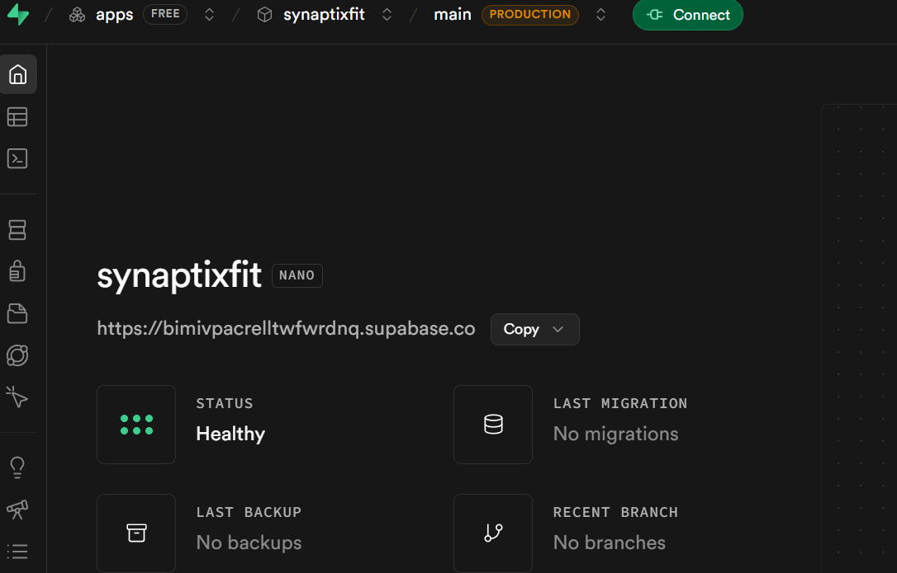

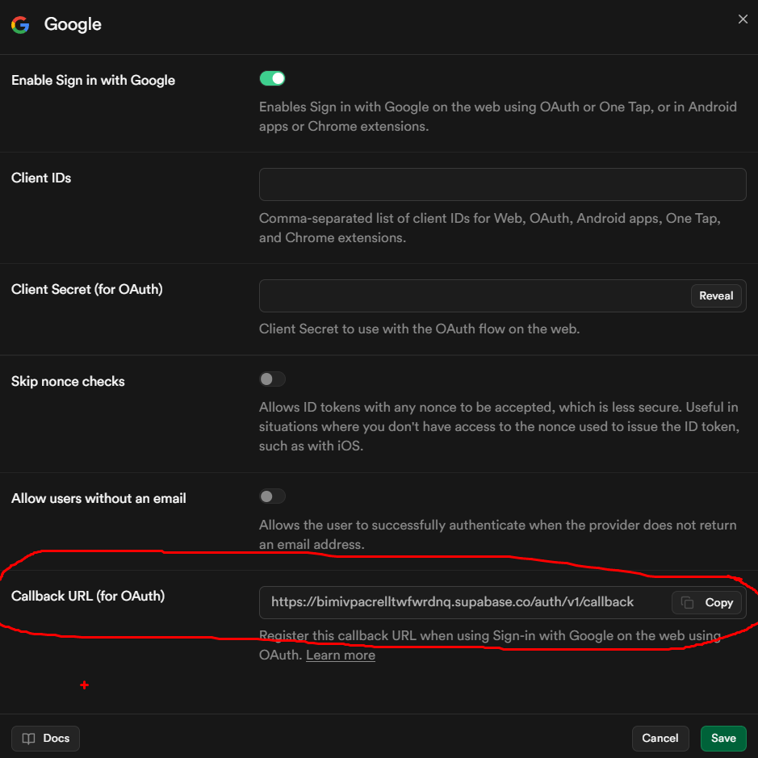

### 8.2 Google Cloud Console (interfaz en español)

#### 8.2.1 Configurar la pantalla de consentimiento

Ruta recomendada en la interfaz nueva: **Google Auth Platform**.

1. Abre **Descripción general** y completa **Información de la app** (nombre y correo de asistencia).
2. En **Público**, selecciona **Usuarios externos** para pruebas con cuentas fuera de la organización.
3. En **Información de contacto**, agrega el correo para notificaciones de Google.

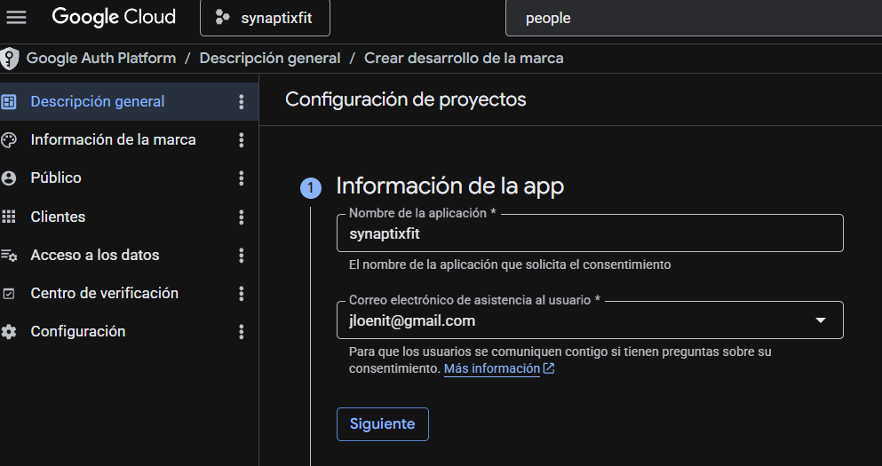

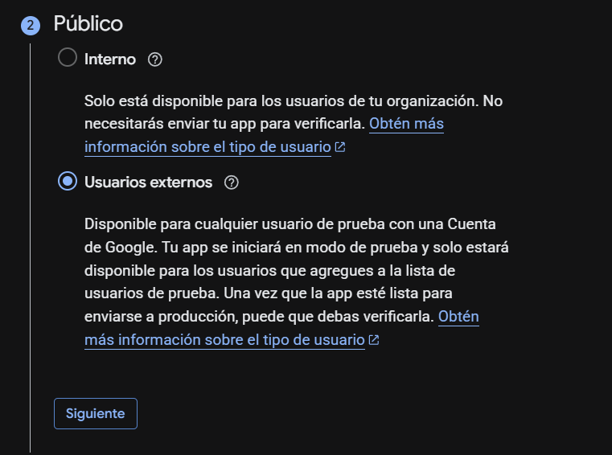

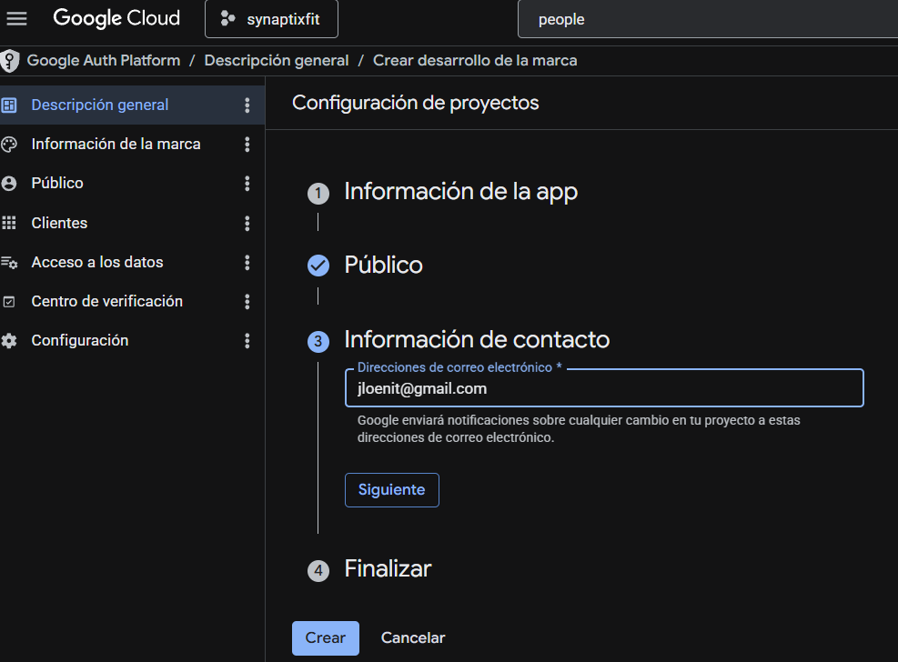

#### 8.2.2 Definir permisos (scopes)

1. Entra en **Acceso a los datos**.
2. Pulsa **Agregar o quitar permisos**.
3. Marca como mínimo:
   - `.../auth/userinfo.email`
   - `.../auth/userinfo.profile`
   - `openid`
4. Si vas a usar Google People API para ampliar perfil/contactos, habilita antes la API en **Biblioteca de APIs de Google** y añade `https://www.googleapis.com/auth/contacts.readonly`.

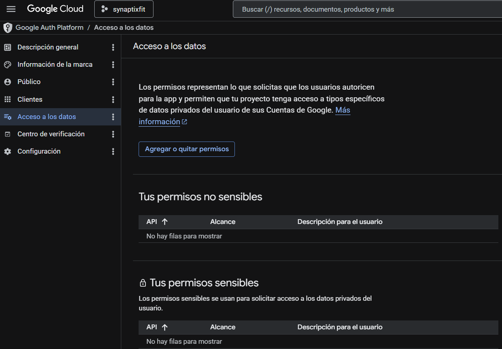

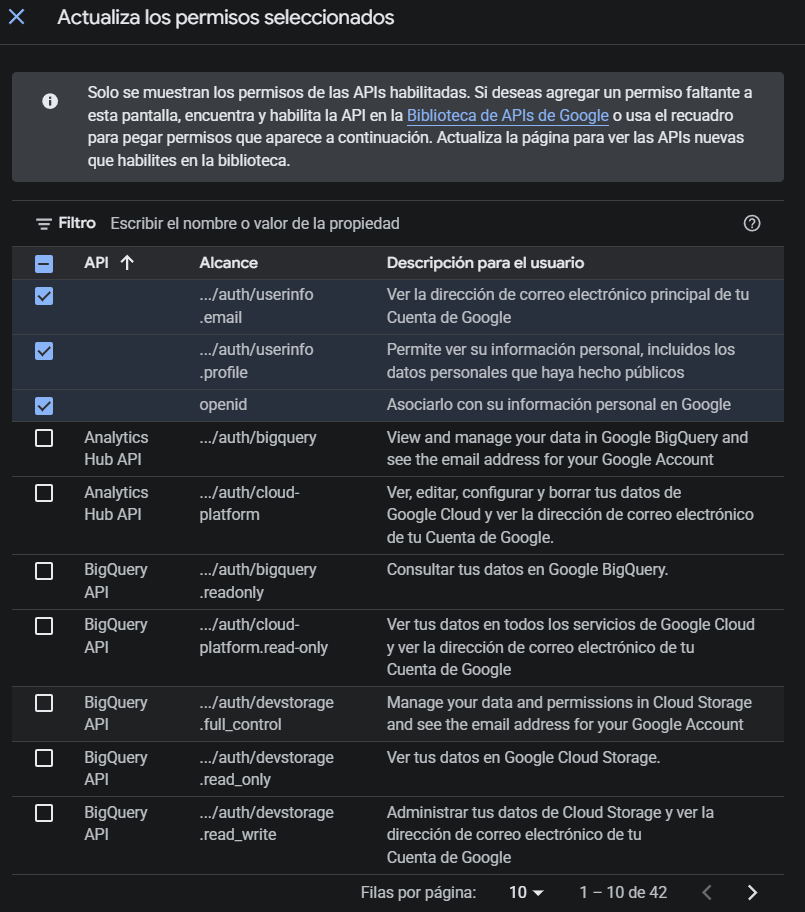

#### 8.2.3 Crear credencial OAuth 2.0 (cliente web)

1. Ve a **APIs y servicios > Credenciales**.
2. Pulsa **Crear credenciales** y selecciona **ID de cliente de OAuth**.
3. En **Tipo de aplicación**, selecciona **Aplicación web**.

> Nota: en esta pantalla también aparecen otras opciones (Android, iOS, Extensión de Chrome, TVs y dispositivos de entrada limitada, App de escritorio). Para el flujo con callback de Supabase debes usar **Aplicación web**.

4. Configura:
   - **Orígenes autorizados de JavaScript**: `https://bimivpacrelltwfwrdnq.supabase.co`
   - **URIs de redireccionamiento autorizados**: `https://bimivpacrelltwfwrdnq.supabase.co/auth/v1/callback`
5. Copia y guarda de forma segura el **ID de cliente** y el **Secreto del cliente**.

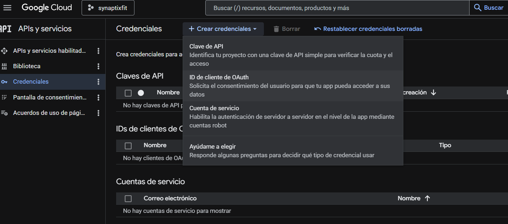

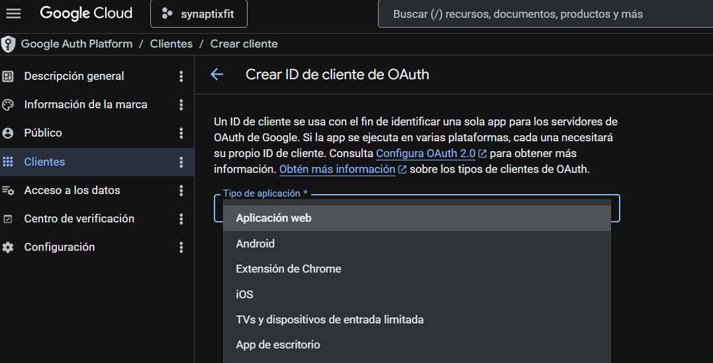

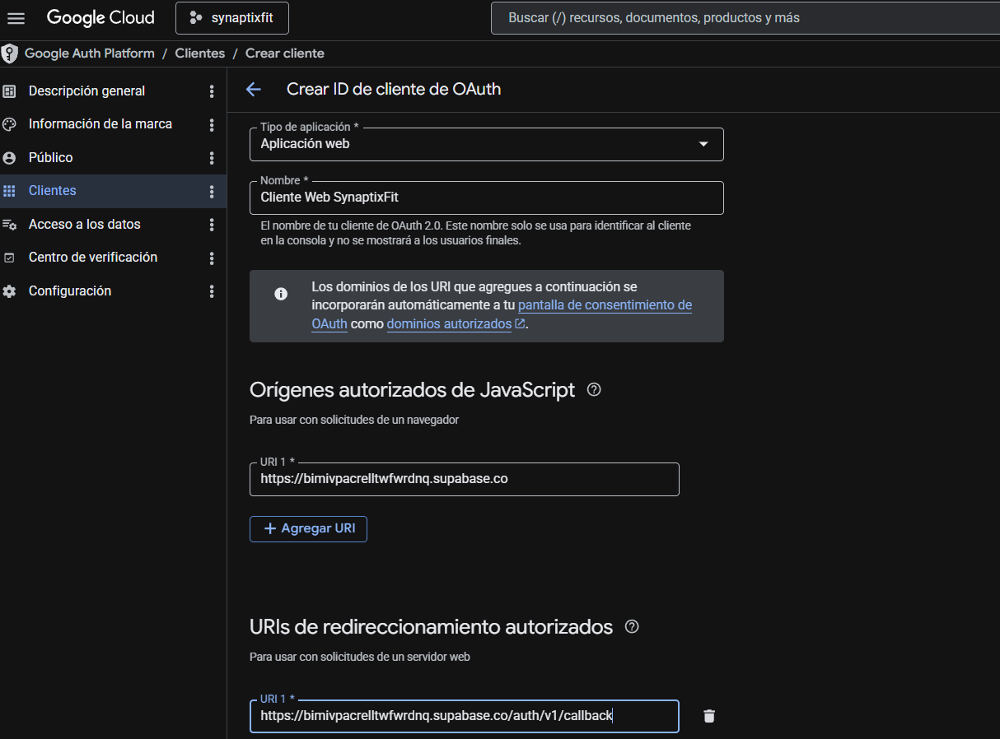

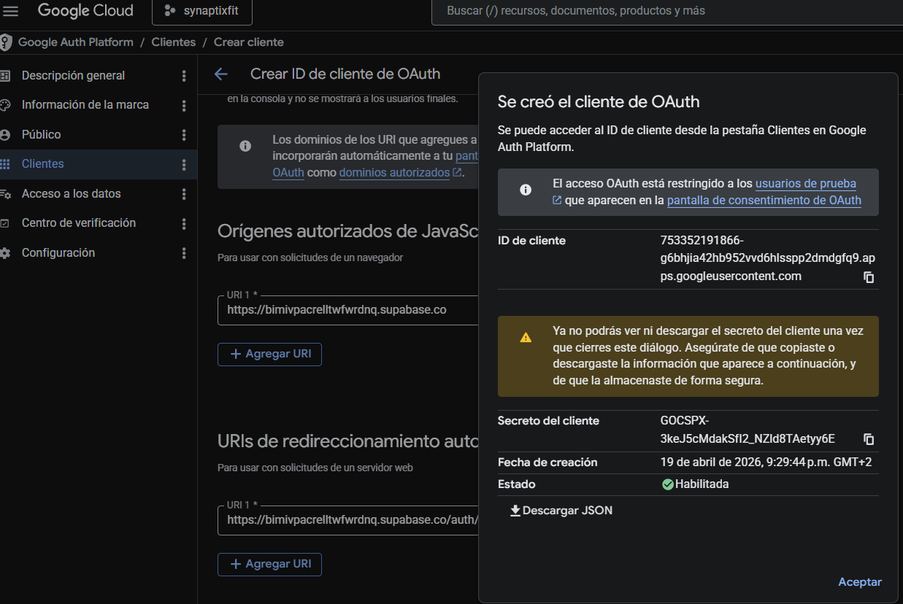

### 8.3 Configurar Google en Supabase

1. En Supabase, entra a **Authentication > Sign In / Providers**.
2. En la fila **Google**, abre la configuración (aunque esté en estado **Disabled**).
3. Configura los campos siguientes en el modal de Google:
   - **Enable Sign in with Google**: Activado.
   - **Client IDs**: Pega el ID de cliente OAuth web de Google (si manejas varias plataformas, acepta múltiples IDs separados por comas).
   - **Client Secret (for OAuth)**: Pega el secreto OAuth de Google.
   - **Skip nonce checks**: Desactivado (recomendado por seguridad).
   - **Allow users without an email**: Desactivado (recomendado).
4. Verifica que el **Callback URL (for OAuth)** coincida con el URI autorizado en Google Cloud.
5. Pulsa **Save**.

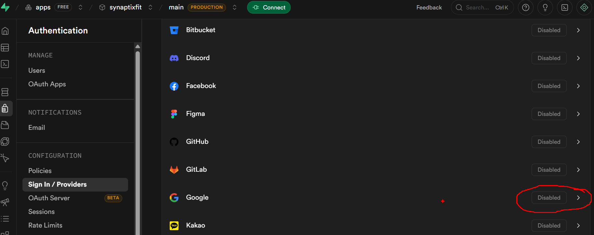

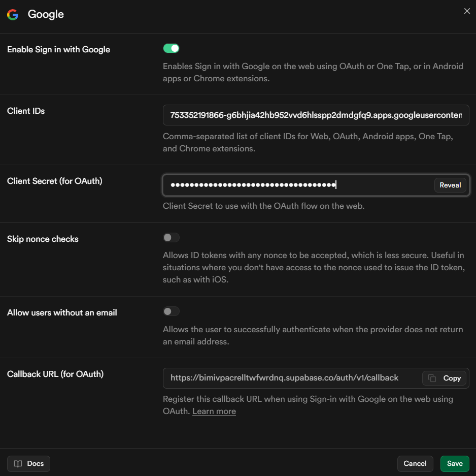

### 8.3.1 ¿Hace falta añadir OAuth Client de Android?

Respuesta corta: **para el MVP web + OAuth con callback de Supabase, no es obligatorio**.

Cuándo sí debes añadirlo:

1. Si vas a publicar y priorizar Android en producción.
2. Si usarás inicio de Google nativo en Android (no solo navegador).
3. Si detectas errores de audiencia/cliente en móvil (`invalid_aud`, `client_id mismatch`, etc.).

Recomendación del proyecto:

1. Mantener el **cliente web** para el flujo actual de Supabase OAuth.
2. Añadir también **cliente Android** para endurecer el despliegue móvil y evitar incidencias por firma de app.

### 8.3.2 Pasos para crear OAuth Client de tipo Android

1. En Google Cloud, abre **APIs y servicios > Credenciales**.
2. Pulsa **Crear credenciales > ID de cliente de OAuth**.
3. En **Tipo de aplicación**, selecciona **Android**.
4. Completa:
  - **Nombre**: por ejemplo, `SynaptixFit Android`.
  - **Nombre del paquete**: el `applicationId` de Android (ejemplo: `com.jloen.synaptixfit`).
  - **Huella digital SHA-1**: la firma del keystore (debug y/o release según entorno).
5. Guarda y copia el **Client ID** generado para Android.
6. En Supabase, vuelve a **Authentication > Sign In / Providers > Google**.
7. En **Client IDs**, deja el ID web y agrega también el ID Android, separados por comas.
    [Configuración Google Provider con múltiples Client IDs](../app/assets/images/documentacion/google_auth/id_clientes_web_android_supabase.png)
8. Guarda cambios y valida login en dispositivo Android real.

Nota práctica para firmas:

- En desarrollo Android, registra al menos la huella **debug SHA-1**.
- Antes de publicar en Play Store, añade también la huella **release SHA-1** (o App Signing de Google Play si aplica).

### 8.3.3 Obtener huella SHA-1 en Windows (validado)

Comando recomendado (probado en este proyecto):

```powershell
cd app/android
.\gradlew signingReport
```

El comando anterior devuelve las huellas por variante. Ejemplo real obtenido:

```text
Variant: debug
SHA1: ...

Variant: release
SHA1: ...
```

Keystore detectado en entorno local:

```text
C:\Users\JLOel\.android\debug.keystore
```

Alternativa (si Gradle falla) usando `keytool` sobre keystore debug:

```powershell
keytool -list -v -alias androiddebugkey -keystore "$env:USERPROFILE\.android\debug.keystore" -storepass android -keypass android
```

Si no reconoce `keytool`, ejecuta primero:

```powershell
& "$env:JAVA_HOME\bin\keytool.exe" -list -v -alias androiddebugkey -keystore "$env:USERPROFILE\.android\debug.keystore" -storepass android -keypass android
```

Referencias de capturas a añadir manualmente:

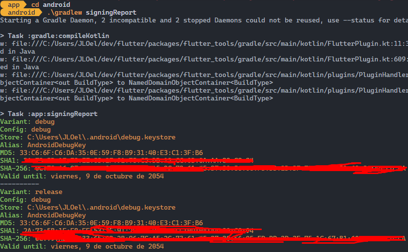

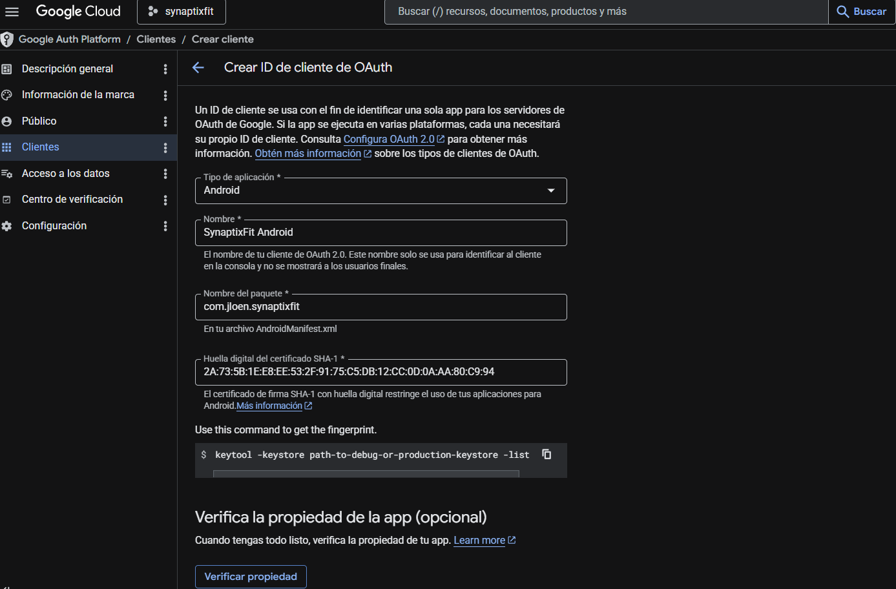

### 8.4 Configurar login por correo y contraseña

1. En **Authentication > Sign In / Providers**, habilita **Email**.
2. Activa **Confirm email** para validar la cuenta del usuario.
3. Activa **Enable Magic Link log in** para el primer acceso sin contraseña (flujo recomendado del proyecto).
4. Una vez autenticado, el usuario define contraseña en **Perfil > Configuración** (cliente Flutter con `updateUser`).

### 8.5 Código de referencia en Flutter

Ejemplo base en `app/lib/features/auth/`:

```dart
import 'package:supabase_flutter/supabase_flutter.dart';

Future<void> signInWithGoogle() async {
  await Supabase.instance.client.auth.signInWithOAuth(
    OAuthProvider.google,
    redirectTo: 'io.supabase.synaptixfit://login-callback',
    scopes:
        'email profile openid https://www.googleapis.com/auth/contacts.readonly',
  );
}

Future<void> signInWithEmailOTP(String email) async {
  await Supabase.instance.client.auth.signInWithOtp(email: email);
}

Future<void> updatePassword(String newPassword) async {
  await Supabase.instance.client.auth.updateUser(
    UserAttributes(password: newPassword),
  );
}
```

### 8.6 Checklist de validación

- En Google Cloud, el OAuth Client está creado y en estado habilitado.
- En Supabase, Google Provider está activado y guardado sin errores.
- El callback en Google y Supabase coincide exactamente.
- El login por correo (OTP/Magic Link) funciona y luego permite fijar contraseña desde perfil.
- No se versionan secretos en git ni se suben capturas con credenciales visibles en texto plano.

---

**Documento compilado:** 08-06-2026  
**Última revisión:** v1.1
