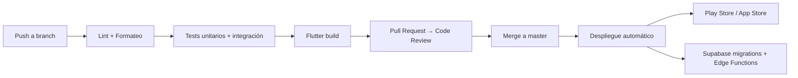

# 10 - Despliegue (Deployment)

**Proyecto:** SynaptixFit  
**Versión:** 1.0  
**Fecha:** 19-04-2026

---

## 1. Entornos

| Entorno | Propósito | Supabase | R2 Bucket |
|---------|----------|----------|-----------|
| **Development** | Desarrollo local | Proyecto dev | `synaptixfit-media-dev` |
| **Staging** | Pruebas pre-producción | Proyecto staging | `synaptixfit-media-staging` |
| **Production** | Usuarios finales | Proyecto prod | `synaptixfit-media` |

---

## 2. Infraestructura

### 2.1 Supabase (Backend gestionado)

| Componente | Configuración MVP |
|------------|------------------|
| Base de datos | PostgreSQL (plan Free/Pro) |
| Autenticación | Email/password + proveedores sociales |
| Edge Functions | Deno runtime |
| Realtime | WebSocket (máx. conexiones según plan) |
| Región | Más cercana al público objetivo |

### 2.2 Cloudflare R2 (Almacenamiento multimedia)

| Aspecto | Configuración |
|---------|--------------|
| Bucket | `synaptixfit-media` |
| Acceso | URLs firmadas vía Cloudflare Workers |
| CORS | Habilitado para dominio de la app |
| Límite free tier | 10 GB almacenamiento, 10M solicitudes/mes |

### 2.3 Distribución de la App

| Plataforma | Canal |
|------------|-------|
| Android | Google Play Store |
| iOS | Apple App Store |
| Web | Hosting estático (Cloudflare Pages / Vercel) |

---

## 3. Pipeline CI/CD



### 3.1 Comandos de build

```bash
# Android (APK para testing)
flutter build apk --release

# Android (App Bundle para Play Store)
flutter build appbundle --release

# iOS
flutter build ipa --release

# Web
flutter build web --release
```

### 3.2 Despliegue de backend

```bash
# Migraciones de base de datos
supabase db push

# Edge Functions
supabase functions deploy --all

# Verificar estado
supabase status
```

---

## 4. Variables de Entorno por Entorno

Ver [08-installation.md](08-installation.md) para la lista completa. Cada entorno debe tener su propio archivo `.env` con las credenciales correspondientes.

> ⚠️ Las claves de `SERVICE_ROLE_KEY` nunca deben estar en el cliente. Solo en Edge Functions y scripts de backend.

---

## 5. Monitorización

| Aspecto | Herramienta | Métrica |
|---------|------------|---------|
| Errores de app | Supabase Analytics / Crashlytics | Tasa de errores < 1% |
| Rendimiento BD | Supabase Dashboard | Queries lentas > 500ms |
| Disponibilidad | Supabase Health | ≥ 99.5% mensual (RNF-CON-01) |
| Uso R2 | Cloudflare Dashboard | Almacenamiento y solicitudes |

---

## 6. Estrategia de Rollback

1. **Migraciones SQL:** Cada migración tiene su script de reversión en `backend/supabase/migrations/`.
2. **Edge Functions:** Versionadas en Git. Rollback = redesplegar versión anterior.
3. **App:** Publicación gradual (staged rollout) en Play Store. Rollback manual si tasa de errores sube.

## 7. Guía de Despliegue de Cloudflare Worker

A continuación, se detalla el proceso paso a paso para crear y desplegar el Cloudflare Worker encargado de gestionar las solicitudes a los buckets R2.

### Paso 1: Navegar a Workers & Pages
En el panel de control de Cloudflare, dirígete a la sección **Workers & Pages**.


### Paso 2: Crear una nueva aplicación
Haz clic en el botón para **Create application**.


### Paso 3: Seleccionar plantilla
Elige crear un Worker, utilizando la plantilla básica (por ejemplo, **Hello World**).


### Paso 4: Nombrar el Worker
Asigna un nombre descriptivo a tu Worker, como `synaptixfit-media-worker`, y procede a desplegarlo inicialmente.


### Paso 5: Confirmación de despliegue
Espera a que el despliegue inicial se complete exitosamente.


### Paso 6: Editar el código
Haz clic en **Edit code** para reemplazar el código generado por defecto con la lógica necesaria para manejar las peticiones a nuestro bucket R2.


*Nota: Asegúrate de configurar las variables de entorno necesarias (como la URL de tu backend o las claves si requiere autenticación de servidor a servidor) en la configuración del Worker.*

---

**Documento compilado:** 19-04-2026  
**Última revisión:** 22-04-2026
