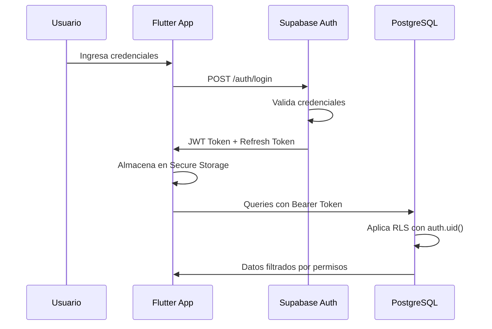
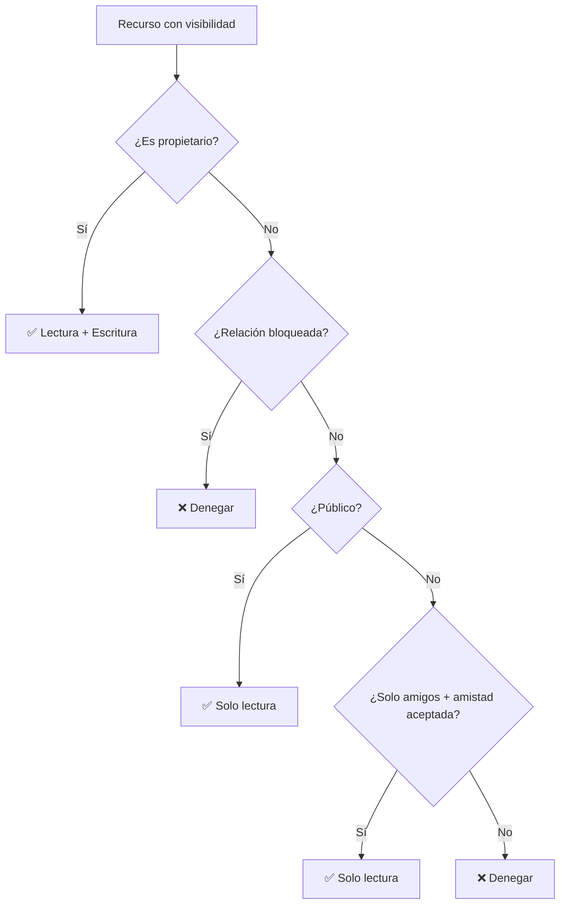

# 11 - Seguridad

**Proyecto:** SynaptixFit  
**Versión:** 1.1  
**Fecha:** 03-05-2026  
**Referencia:** [03-architecture.md](03-architecture.md) (sección 7), [04-data-model.md](04-data-model.md) (RLS)

---

## 1. Modelo de Autenticación

### 1.1 Proveedor

| Aspecto | Detalle |
|---------|--------|
| Servicio | Supabase Auth |
| Métodos | Email/password + proveedores OAuth (Google, etc.) |
| Token | JWT (JSON Web Token) |
| Expiración | 1 hora (configurable con refresh token) |
| Almacenamiento en cliente | Secure Storage (no SharedPreferences) |

### 1.2 Flujo de autenticación

### 1.3 Reglas de contraseña

- Mínimo 8 caracteres.
- Al menos 1 letra mayúscula.
- Al menos 1 número.
- Sin espacios al inicio ni al final.

---

## 2. Row-Level Security (RLS)

### 2.1 Principio general

Todas las tablas tienen RLS habilitado. Ninguna query puede ejecutarse sin pasar por las políticas de acceso.

### 2.2 Modelo de visibilidad

SynaptixFit implementa un modelo de visibilidad por recurso con tres niveles:

### 2.3 Matriz de políticas de acceso

| Tabla | SELECT | INSERT | UPDATE | DELETE |
|-------|--------|--------|--------|--------|
| `usuarios` | Propio + públicos | — | Solo propio | — |
| `partes_cuerpo` | Todos (catálogo público) | — | — | — |
| `musculos` | Todos (catálogo público) | — | — | — |
| `equipamientos` | Todos (catálogo público) | — | — | — |
| `ejercicios` | Todos (catálogo público) | — | — | — |
| `ejercicio_musculo_objetivo` | Todos (catálogo público) | — | — | — |
| `ejercicio_musculo_secundario` | Todos (catálogo público) | — | — | — |
| `ejercicio_parte_cuerpo` | Todos (catálogo público) | — | — | — |
| `ejercicio_equipamiento` | Todos (catálogo público) | — | — | — |
| `rutinas` | Propio + según visibilidad | Solo propio | Solo propio | Solo propio |
| `seleccion_de_ejercicios` | Hereda de `rutinas` | Hereda | Hereda | Hereda |
| `sesiones_registradas` | Propio + públicos | Solo propio | Propio | Propio |
| `retos` | Propio + según visibilidad | Solo propio | Solo propio | Solo propio |
| `hitos_de_reto` | Hereda de `retos` | Hereda | Hereda | Hereda |
| `progreso_de_reto` | Propio + públicos | Solo propio | Solo propio | Solo propio |
| `notificaciones` | Solo propio | Funciones admin | Solo propio | Solo propio |
| `horarios_academicos` | Solo propio | Solo propio | Solo propio | Solo propio |
| `asignaturas` | Solo propio | Solo propio | Solo propio | Solo propio |
| `perfil_academico_usuario` | Solo propio | Solo propio | Solo propio | Solo propio |
| `carga_academica_semanal` | Solo propio | Solo propio | Solo propio | Solo propio |
| `perfil_bienestar_usuario` | Solo propio | Solo propio | Solo propio | — |
| `historial_peso` | Solo propio | Solo propio | — | — |
| `plan_entrenamiento_semanal` | Solo propio | Solo propio | Solo propio | Solo propio |
| `actividades_sociales` | Propio + públicos | Solo propio | — | — |
| `interacciones_sociales` | Según visibilidad de actividad | Autenticado | — | Solo propio |
| `amistades` | Solo propio | Solo propio | Solo propio | Solo propio |
| `preferencias_notificacion` | Solo propio | Solo propio | Solo propio | — |

---

## 3. Protección de Datos Sensibles

### 3.1 Datos físicos del estudiante

| Campo | Sensibilidad | Visibilidad por defecto |
|-------|-------------|------------------------|
| `peso_kg` | Alta | `privado` (RB-20) |
| `altura_cm` | Alta | `privado` |
| `nivel_condicion` | Media | `privado` |
| `limitaciones_fisicas` | Crítica | `privado` (nunca se expone públicamente) |

### 3.2 Datos académicos sensibles

| Campo | Sensibilidad | Visibilidad por defecto |
|-------|-------------|------------------------|
| `carrera` | Media | `privado` |
| `semestre_actual` | Media | `privado` |
| `creditos_semestre_actual` | Media | `privado` |
| `nivel_estres` | Alta | `privado` |
| `horas_sueno_promedio` | Alta | `privado` |

### 3.3 Reglas de negocio de privacidad

- **RB-11:** Las publicaciones automáticas de logros respetan la preferencia de `autopost_logros_habilitado`.
- **RB-20:** Los datos físicos son siempre privados por defecto.
- **RF-SAF-03:** El usuario puede desactivar publicaciones automáticas de logros para reducir presión social.

---

## 4. Seguridad de Claves

| Clave | Ubicación segura | Nunca expuesta en |
|-------|-----------------|-------------------|
| `SUPABASE_ANON_KEY` | `.env` del cliente | — (es pública por diseño) |
| `SUPABASE_SERVICE_ROLE_KEY` | Edge Functions / Scripts backend | ❌ Cliente Flutter |
| `R2_SECRET_ACCESS_KEY` | Cloudflare Workers / Scripts backend | ❌ Cliente Flutter |
| JWT del usuario | Secure Storage (dispositivo) | ❌ SharedPreferences, logs |

---

## 5. URLs Firmadas (Cloudflare R2)

| Aspecto | Configuración |
|---------|--------------|
| Método | HMAC-SHA256 signature |
| Expiración | 1 hora (configurable por tipo de cliente) |
| Generación | Cloudflare Worker `firmar_url_r2` |
| Caché cliente | Riverpod con TTL = expiración - margen de 5 min |

---

## 6. Salvaguardas de Bienestar (RNF-SAF)

| Regla | Implementación |
|-------|---------------|
| RNF-SAF-01 | Evitar lenguaje punitivo en mensajes de incumplimiento |
| RNF-SAF-02 | Mecanismos para reducir presión social (ocultar rachas, desactivar autopost) |
| RNF-SAF-03 | Separación explícita entre recomendaciones de bienestar y consejo clínico |
| RF-SAF-01 | Mensajes de uso responsable ("Esta app no sustituye atención profesional") |
| RF-SAF-02 | Recursos de ayuda cuando se reporte alto estrés o bloqueo sostenido |

---

## 7. Auditoría y Trazabilidad

Eventos que deben quedar registrados (según sección 10.2 del SRS):

1. Cambio de visibilidad de cualquier recurso.
2. Eliminación de contenido.
3. Completar reto o rutina.
4. Error de acceso por permisos.
5. Alta o archivo de asignatura.
6. Registro o corrección de calificación.
7. Actualización de perfil físico.
8. Recálculo de plan de entrenamiento semanal.
9. Selección o reemplazo de ejercicios en una rutina.

---

**Documento compilado:** 19-04-2026  
**Última revisión:** v1.0
