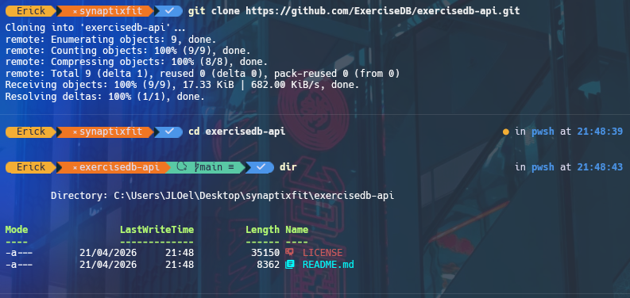
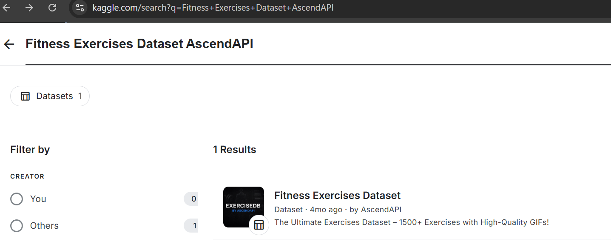
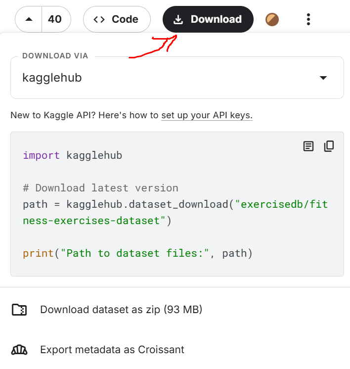
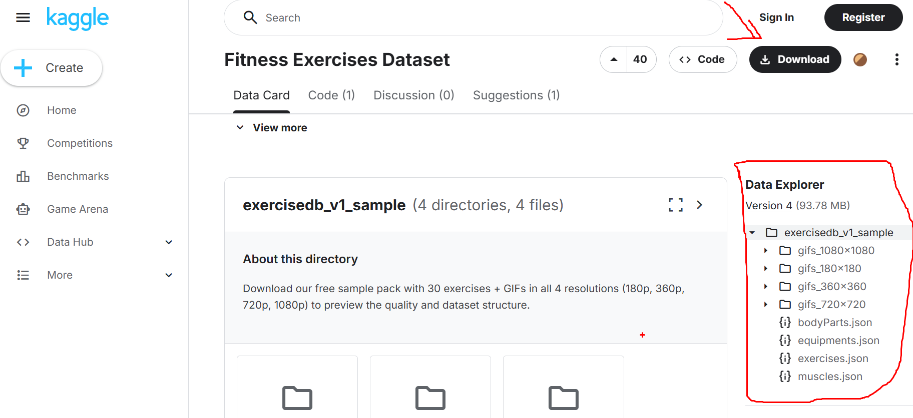
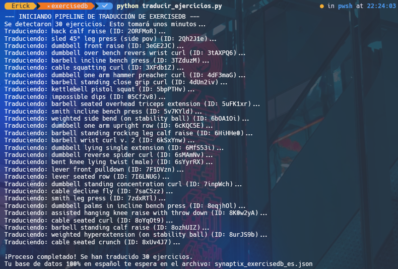
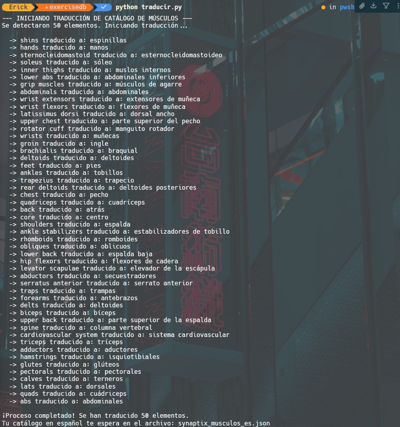
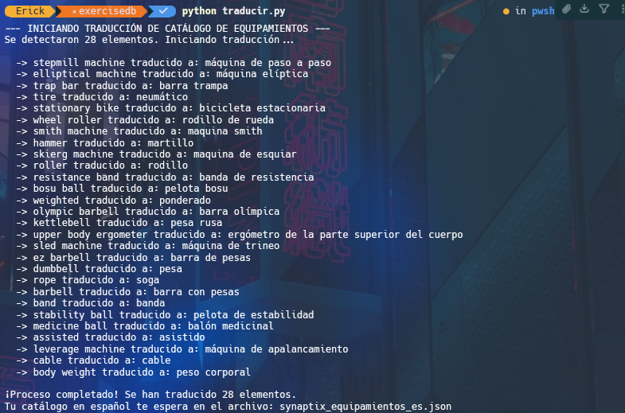
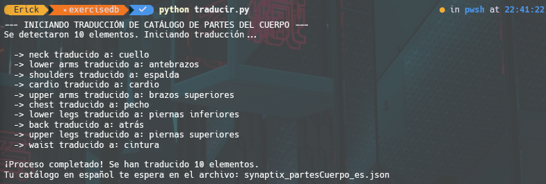

# 13 - Mantenimiento

**Proyecto:** SynaptixFit  
**Versión:** 1.3
**Fecha:** 28-05-2026
**Referencia:** [03-architecture.md](03-architecture.md) (sección 8.3), [04-data-model.md](04-data-model.md) (sección 6)

---

## 1. Gobierno del Catálogo de Ejercicios

### 1.1 Estado actual

1. Proveedor adoptado: **ExerciseDB (AscendAPI)** via Kaggle + **Demic** como fuente secundaria de ejercicios con video.
2. Estado del pipeline: **activo** para ingesta batch hacia Supabase + Cloudflare R2.
3. Fuente runtime de la app: datos internos (Supabase y R2), sin dependencia directa del proveedor externo durante uso normal.
4. wger queda como opcion descartada temporalmente y documentada solo como historial tecnico.

### 1.2 Fuente oficial y evidencia de obtencion

#### 1.2.1 Estado del repositorio GitHub del proveedor

El repositorio `exercisedb-api` se utiliza como cascaron documental/legal (README + LICENSE). El dataset pesado ya no se mantiene completo dentro de GitHub.



#### 1.2.2 Descarga oficial desde Kaggle

1. Buscar en Kaggle: Fitness Exercises Dataset AscendAPI.
2. Descargar el ZIP oficial del dataset.
3. Si aplica, usar cuenta gratuita de Kaggle para habilitar la descarga.





#### 1.2.3 Estructura validada del paquete

El paquete descargado debe incluir, como minimo:
1. `exercises.json`.
2. `muscles.json`.
3. `equipments.json`.
4. `bodyParts.json`.
5. `gifs_180x180/` (resolucion abierta recomendada para MVP por ligereza y rapidez de carga en Flutter).



### 1.3 Flujo operativo vigente (ExerciseDB -> SynaptixFit)

1. Descargar y descomprimir el dataset oficial en `backend/data_pipeline/exercisedb/raw`.
2. Traducir el dataset al espanol en preprocesado local.
3. Transformar la estructura ExerciseDB al esquema interno de SynaptixFit.
4. Subir `gifs_180x180/` a Cloudflare R2.
5. Importar ejercicios y catalogos auxiliares a Supabase.
6. Ejecutar validacion por lote piloto antes de carga completa.

### 1.3a Flujo operativo vigente — Demic (ejercicios con video)

1. Obtener los datos en formato JSON (`nuevos_ejercicios.json`) desde Demic.
2. Descargar los videos MP4 por lote usando **Internet Download Manager**.
3. Guardar los videos en `demic/nuevos_para_r2/` con nombres slugificados (lowercase, underscores, sin acentos).
4. Generar `demic/nombres_videos.txt` con la lista maestra de slugs para subida a R2.
5. Ejecutar `seed_nuevos_ejercicios.py` que:
   - Sincroniza catálogos (partes_cuerpo, musculos, equipamientos) agregando solo lo nuevo.
   - Inserta ejercicios nuevos detectando duplicados por `nombre` (case-insensitive).
   - Restaura relaciones N:M incluso para ejercicios ya existentes (idempotente).
6. Subir los videos a Cloudflare R2 bajo `ejercicios/videos/{slug}.mp4`.

Nota de entorno en Windows:
1. Si `pip` no esta disponible en PATH, instalar dependencias con `python -m pip install supabase python-dotenv`.
2. Si el entorno usa el lanzador de Windows, tambien es valido `py -m pip install supabase python-dotenv`.
3. Los scripts `seed_ejercicios.py` y `seed_nuevos_ejercicios.py` buscan automáticamente el archivo `.env` en `supabase/.env`, en la raíz del workspace y en `app/.env`.

### 1.3b Catálogo actual (29-05-2026) — Fuentes unificadas

| Recurso | Cantidad |
|---------|----------|
| Ejercicios únicos | 89 (56 demic + 21 exercisedb + 12 gym_workout) |
| Partes del cuerpo | 13 |
| Musculos | 51 (9 redundantes eliminados vía migración 0030) |
| Equipamientos | 24 (extraídos de ejercicios) |
| Videos/GIFs para R2 | 107 (55 demic + 30 exercisedb + 22 gym_workout) |
| Migraciones aplicadas | 30 |
| PNGs ilustrativos de músculos | 51 (en `musculos/`, URL en columna `url_imagen` de la tabla) |

### 1.3c Script de seed unificado

`supabase/seed_todo.py` reemplaza a los 3 scripts anteriores (`seed_ejercicios.py`, `seed_nuevos_ejercicios.py`, `seed_gym_workout.py`). Lee `nuevos_ejercicios.json` (campo `fuente`), `musculos.json` y `partes_cuerpo.json`. Flujo: upsert catálogos → insert ejercicios (dedup nombre) → upsert relaciones N:M.

Archivos listos para R2 en `r2_staging/`: `demic/` (55), `exercisedb/` (30), `gym_workout/` (22).

#### 1.3.1 Ejecucion real de traduccion (scripts usados)

Scripts utilizados:
1. `exercisedb/traducir_ejercicios.py` sobre `exercises.json`.
2. `exercisedb/traducir.py` sobre `muscles.json` con salida `synaptix_musculos_es.json`.
3. `exercisedb/traducir.py` sobre `equipments.json` con salida `synaptix_equipamientos_es.json`.
4. `exercisedb/traducir.py` sobre `bodyParts.json` con salida `synaptix_partesCuerpo_es.json`.

Artefactos de salida esperados:
1. `synaptix_exercisedb_es.json`.
2. `synaptix_musculos_es.json`.
3. `synaptix_equipamientos_es.json`.
4. `synaptix_partesCuerpo_es.json`.

Evidencias de ejecucion:









Reglas de control:
1. Mantener copia de JSON original (EN) y JSON traducido (ES).
2. Registrar fecha de traduccion y version de dataset usada.
3. Validar terminologia de dominios criticos (musculos/equipamiento) antes de importacion final.

### 1.4 Validaciones minimas de mantenimiento

| Criterio | Minimo requerido |
|---|---|
| Integridad relacional | Coincidencia entre ejercicios, musculos, equipos y partes del cuerpo |
| Calidad multimedia | GIF 180x180 accesible y renderizable en Flutter |
| Licencia | Uso compatible con alcance academico y distribucion del proyecto |
| Reproducibilidad | Proceso de importacion repetible entre equipos |
| Trazabilidad | Version del dataset y fecha de ingesta registradas |

### 1.5 Historial de decision (contexto) y Manejo de Multimedia (GIFs)

1. Antes de ExerciseDB se evaluo wger (Docker y API REST).
2. wger se descarto temporalmente por incidencias operativas y cobertura/calidad de multimedia insuficiente para el objetivo UX.
3. Las capturas historicas de esa evaluacion permanecen en `app/assets/images/documentacion/wger/` para auditoria tecnica.

**El problema de los GIFs rotos en Bases de Datos Públicas:**
Durante el desarrollo se evidenció que la visualización de GIFs es un obstáculo muy común al trabajar con bases de datos públicas de fitness. Dependiendo de la fuente exacta, hay tres razones principales por las que los enlaces a los GIFs aparecen rotos o no cargan:

1. **Estrategia de monetización del autor (Kaggle):** En el dataset de *Fitness Exercises Dataset* de Kaggle, se incluye una columna `gifUrl`. Sin embargo, el creador advierte que estas URLs pueden no funcionar, ya que ofrece los datos en texto gratis pero vende el paquete de los 1,324 archivos GIF reales de forma externa.
2. **Restricciones contra el almacenamiento / Caching (ExerciseDB):** Muchos datasets gratuitos extraen sus datos de ExerciseDB. Sin embargo, los términos de uso de ExerciseDB prohíben estrictamente el almacenamiento (caching) de sus GIFs. Sus enlaces están protegidos; si intentas cargar un enlace viejo o guardarlo en la BD sin realizar una petición fresca a su API, el servidor bloqueará el acceso con un error `404 Not Found`.
3. **Uso de URLs Firmadas Temporalmente (FitGIF y YMove):** Proveedores de animaciones como FitGIF y Your Move utilizan URLs firmadas con caducidad (ej. 48 horas) para evitar el robo de ancho de banda. Pasado ese tiempo, el enlace dejará de mostrar la imagen.

**Decisión adoptada:** Debido a esto, la aplicación almacena y sirve los recursos multimedia a través de una infraestructura propia (Supabase / R2 Proxy) para garantizar que los enlaces nunca expiren, que no haya problemas de caché o CORS, y que la UX sea fluida y constante sin depender del proveedor externo en tiempo de ejecución.

### 1.6 Clasificación automática de finalidad (`_generar_finalidad()`)

El script `seed_ejercicios.py` incluye la función `_generar_finalidad(ej: dict) -> str` que clasifica automáticamente cada ejercicio en una de las siguientes finalidades:

| Finalidad | Criterios de detección |
|-----------|----------------------|
| `cardio` | Músculo objetivo `cardiovascular` en ExerciseDB, o parte del cuerpo `cardio`, o nombre contiene: correr, nadar, bicicleta, saltar, burpees, mountain climber, box jump, tuck jump, etc. (25+ palabras clave bilingües) |
| `isometrico` | Nombre contiene: plancha, plank, isométrico, wall sit, puente estático, static hold, L-sit, hollow body, dead hang, sentadilla estática, etc. |
| `fuerza` | Todo lo demás (default hasta la migración 0019) |
| `hipertrofia`, `resistencia`, `movilidad` | Soporte de schema añadido en la migración 0019 |

La función se invoca tanto al insertar ejercicios nuevos como al actualizar existentes (para migrar datos antiguos que no tenían el campo `finalidad`). Tras ejecutar `seed_ejercicios.py`, todos los ejercicios del catálogo tienen su `finalidad` correctamente asignada.

### 1.7 Deprecación de `exercise_db_id`

A partir de la migración 0020:
- El campo `exercise_db_id` es nullable y ya no tiene constraint UNIQUE.
- El índice `idx_ejercicios_exercise_db_id` fue eliminado.
- La vista `v_ejercicios_completos` ya no expone `exercise_db_id`.
- Los seed scripts ya no incluyen `exercise_db_id` en el payload de inserción.
- El código Flutter eliminó toda dependencia del campo `exerciseDbId`.

---

## 2. Backups

### 2.1 Base de datos (Supabase)

| Tipo | Frecuencia | Retención |
|------|-----------|-----------|
| Automático (Supabase) | Diario | 7 días (plan Free) / 30 días (plan Pro) |
| Manual (pg_dump) | Semanal | Almacenado en R2 (`synaptixfit-backups/`) |

### 2.2 Multimedia (Cloudflare R2)

| Tipo | Frecuencia | Retención |
|------|-----------|-----------|
| R2 inherente | Continuo | Ilimitado (dentro del límite de almacenamiento) |
| Cross-region | Mensual (futuro) | Replicación a segundo bucket |

---

## 3. Migraciones de Base de Datos

### 3.1 Crear nueva migración

```bash
supabase migration new nombre_descriptivo
# Editar: backend/supabase/migrations/YYYYMMDDHHMMSS_nombre_descriptivo.sql
```

### 3.2 Aplicar migraciones

```bash
# Desarrollo local
supabase db push

# Producción (con revisión previa)
supabase db push --linked
```

### 3.3 Revertir migración

Cada migración debe tener su script de rollback:

```
backend/supabase/migrations/
  20260419100000_crear_tabla_retos.sql       ← UP
  20260419100000_crear_tabla_retos_down.sql  ← DOWN (rollback)
```

---

## 4. Actualización de Dependencias

### 4.1 Flutter y Dart

```bash
# Verificar dependencias desactualizadas
flutter pub outdated

# Actualizar a últimas compatibles
flutter pub upgrade

# Actualizar restricciones de versión
flutter pub upgrade --major-versions
```

### 4.2 Supabase CLI

```bash
# Actualizar Supabase CLI
npm update -g supabase
```

### 4.3 Edge Functions (Deno)

Las Edge Functions usan el runtime de Supabase. No requieren actualización manual de Deno.

---

## 5. Monitoreo Operativo

### 5.1 Alertas críticas

| Evento | Umbral | Acción |
|--------|--------|--------|
| Queries lentas | > 500ms | Revisar índices y query plan |
| Tasa de errores 5xx | > 1% | Revisar logs de Edge Functions |
| Espacio R2 | > 80% del límite | Evaluar upgrade o limpieza |
| Conexiones Realtime | > 80% del límite | Evaluar upgrade de plan |

### 5.2 Logs

| Fuente | Ubicación |
|--------|----------|
| Edge Functions | Supabase Dashboard → Edge Functions → Logs |
| Base de datos | Supabase Dashboard → Database → Query Performance |
| Aplicación Flutter | Consola de debug / Crashlytics (producción) |

---

**Documento compilado:** 28-05-2026  
**Última revisión:** v1.2
