# 15 - Sistema de Recomendación por IA (Rutinas y Ejercicios)

**Proyecto:** SynaptixFit
**Versión:** 3.4
**Fecha:** 19-05-2026
**Referencia:** [03-architecture.md](03-architecture.md), [06-frontend.md](06-frontend.md), [04-data-model.md](04-data-model.md), [14-changelog.md](14-changelog.md)

---

## 1. Resumen Ejecutivo

El sistema de recomendación por IA de SynaptixFit permite que un usuario
genere una rutina de entrenamiento completa semana a semana, día a día y
ejercicio a ejercicio mediante inteligencia artificial (Google Gemini Flash)
ejecutada directamente desde el cliente Flutter. La IA recibe el perfil del
usuario (27 factores detallados en §4), su historial de entrenamiento, su estado
diario de fatiga/sueño/estrés y el catálogo completo de ejercicios (~1300) para
generar recomendaciones personalizadas.

El campo `minutos_por_sesion` (configurado con un slider de 15 a 120 minutos
durante el onboarding) es uno de los factores que la IA recibe y utiliza para
determinar cuántos ejercicios caben en cada sesión, qué volumen asignar y cómo
estructurar los descansos.

---

## 2. Arquitectura General

```
╔══════════════════════════════════════════════════════════════════════════════╗
║                         SynaptixFit — Cliente Flutter                        ║
║                                                                              ║
║  ┌─────────────────────┐          ┌──────────────────────────────────┐      ║
║  │ PerfilFisicoScreen   │          │       NuevaRutinaScreen           │      ║
║  │ (Onboarding 4 pasos) │          │   (Creación de rutina, 3 pasos)   │      ║
║  │                     │          │                                  │      ║
║  │ Paso 1: Datos demo  │          │ Paso 1: Nombre, objetivo,        │      ║
║  │ Paso 2: Peso/altura  │          │         duración, días/semana    │      ║
║  │         + IA objetivo│          │         → "Recomendar rutina"   │      ║
║  │ Paso 3: Actividad +  │          │         → "Recomendar ejercicios"│      ║
║  │         objetivo ppal│          │ Paso 2: Editor de ejercicios    │      ║
║  │ Paso 4: Disponibilidad│          │         → "Sugerir ejercicios" │      ║
║  │  ▶ Días/semana       │          │         → Buscador manual       │      ║
║  │  ▶ Minutos/sesión    │          │ Paso 3: Revisión y crear        │      ║
║  │  ▶ Equipamiento      │          └──────────────┬───────────────────┘      ║
║  └──────────┬───────────┘                         │                          ║
║             │                                     │                          ║
║             ▼                                     ▼                          ║
║  ┌─────────────────────┐          ┌──────────────────────────────────┐      ║
║  │  ObjetivoIaService   │          │     RecomendacionIaService        │      ║
║  │                     │          │                                  │      ║
║  │ generarSugerencias() │          │ 1. generarRecomendacionRutina()   │      ║
║  │ → 5 objetivos breves│          │ 2. generarEstructuraCompleta()    │      ║
║  └──────────┬───────────┘          │ 3. generarRecomendacionEjercicios()│     ║
║             │                      │ 4. generarProgresionEjercicio()  │      ║
║             │                      └──────────────┬───────────────────┘      ║
║             │                                     │                          ║
║             └──────────────┬──────────────────────┘                          ║
║                            ▼                                                  ║
║  ┌──────────────────────────────────────────────────────────────────────┐   ║
║  │                    Dio HTTP POST                                      │   ║
║  │  https://generativelanguage.googleapis.com/v1beta/models/             │   ║
║  │       gemini-flash-latest:generateContent                             │   ║
║  │  Header: X-goog-api-key: $GEMINI_API_KEY                              │   ║
║  └──────────────────────────────────────────────────────────────────────┘   ║
╚══════════════════════════════════════════════════════════════════════════════╝

                                    │
                                    ▼
╔══════════════════════════════════════════════════════════════════════════════╗
║                         Infraestructura Externa                              ║
║                                                                              ║
║  ┌─────────────────────┐          ┌──────────────────────────────────┐      ║
║  │  Google Gemini Flash │          │    Supabase PostgreSQL            │      ║
║  │                     │          │                                  │      ║
║  │ Procesa el prompt   │          │ 27 tablas con RLS                │      ║
║  │ con contexto del     │          │ perfil_bienestar_usuario         │      ║
║  │ usuario y devuelve   │          │ rutinas, semanas_rutina,        │      ║
║  │ JSON estructurado    │          │ dias_rutina, seleccion_         │      ║
║  │ con la rutina        │          │ de_ejercicios, sesiones_        │      ║
║  └─────────────────────┘          │ registradas, series_sesion,      │      ║
║                                   │ estado_diario_usuario,           │      ║
║                                   │ v_ejercicios_completos (view)    │      ║
║                                   └──────────────────────────────────┘      ║
╚══════════════════════════════════════════════════════════════════════════════╝
```

### 2.1 Por qué IA del lado cliente

| Opción | Ventaja | Desventaja |
|--------|---------|------------|
| **Cliente Flutter** (actual) | Sin latencia extra, sin coste de Edge Function, respuesta directa al UI | API key en request HTTPS |
| Edge Function Supabase | API key oculta | Doble latencia, coste adicional |

**Modelo:** `gemini-flash-latest` (~2-3s de latencia, capa gratuita 15 RPM).

---

## 3. Flujo de Onboarding — Cómo se Configuran los Minutos por Sesión

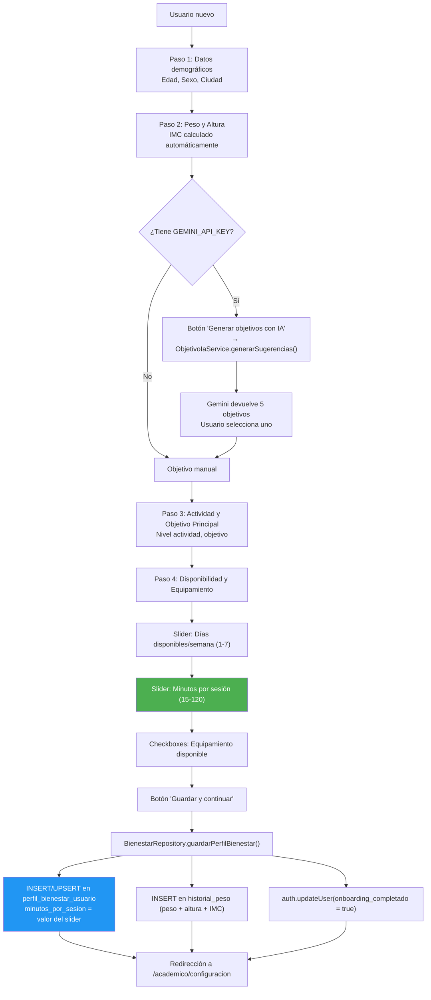

### 3.1 Configuración del Slider

| Propiedad | Valor |
|-----------|-------|
| Mínimo | 15 min |
| Máximo | 120 min |
| Divisiones | 21 (steps de 5 min) |
| Default | 45 min |
| DB constraint | `CHECK (minutos_por_sesion BETWEEN 10 AND 180)` |
| Archivo | `perfil_fisico_screen.dart:766-790` |
| Guardado | `bienestar_repository.dart:53,77` → `minutos_por_sesion` |

---

## 4. Flujo de Creación de Rutina con IA (3 Pasos)

### 4.0 Vía Rápida: "Sugerir Rutina con IA" desde la pantalla Rutinas

Desde la versión 3.3, el usuario puede iniciar el flujo de recomendación directamente
desde la pantalla de Rutinas (`RutinasComunidadScreen`) sin pasar por los pasos manuales:

```
RutinasComunidadScreen
  └── Botón "Sugerir Rutina con IA"
        │  FilledButton.tonalIcon verde con Icons.auto_awesome
        │
        └── Navega a NuevaRutinaScreen(autoRecomendar: true)
              │
              │  initState() → addPostFrameCallback → _recomendarRutina()
              │
              └── La IA rellena automáticamente nombre, descripción,
                    objetivo y duración. El usuario aterriza en Paso 1
                    con los campos ya completados.
```

El router (`app_router.dart`) pasa `autoRecomendar: true` vía `state.extra['autoRecomendar']`.
El `initState` de `NuevaRutinaScreen` detecta este flag y dispara `_recomendarRutina()`
en el siguiente frame (vía `addPostFrameCallback`), asegurando que el widget esté montado.

### 4.1 Flujo Manual (3 Pasos)

```mermaid
flowchart TD
    subgraph "PASO 1 — Metadatos"
        A["Usuario introduce:<br/>Nombre, Objetivo,<br/>Duración (1-12 sem),<br/>Días/semana (1-7)"] 
        --> B["Botón: 'Recomendar rutina con IA'"]
        B --> C["_recomendarRutina() en nueva_rutina_screen.dart:611"]
        C --> D["Lee: perfilBienestarProvider<br/>+ ejerciciosProvider<br/>+ historialSesionUsuarioProvider<br/>+ estadoDiarioHoyProvider"]
        D --> E["RecomendacionIaService<br/>.generarRecomendacionRutina()"]
        E --> F["Construye Prompt #1<br/>con 27 factores de contexto"]
        F --> G["POST a Gemini Flash"]
        G --> H["Gemini devuelve JSON:<br/>{nombre, descripcion, objetivo,<br/>duracionSemanas, estructura}"]
        H --> I["Auto-rellena los metadatos"]
        I --> J["Flag: _rutinaRecomendada = true"]
        J --> K["SnackBar: '¡Rutina recomendada!<br/>Configúrala y luego<br/>recomienda ejercicios'"]
    end

    subgraph "PASO 2 — Ejercicios (estructura completa)"
        K --> L["Botón: 'Recomendar ejercicios'"]
        L --> M["_recomendarEjercicios() en nueva_rutina_screen.dart:697"]
        M --> N["RecomendacionIaService<br/>.generarEstructuraCompleta()"]
        N --> O["Construye Prompt #2<br/>+ catálogo completo de ejercicios<br/>+ periodización exacta<br/>+ reglas de objetivo"]
        O --> P["POST a Gemini Flash"]
        P --> Q["Gemini devuelve JSON:<br/>{estructura: {semana: {dia: [ejercicios]}}}"]
        Q --> R["_llenarEstructuraDesdeRecomendacion()<br/>→ Mapea exerciseDbId a UUID real del ejercicio<br/>→ Busca nombre en catálogo"]
        R --> S["Naviga al editor de ejercicios (paso 2)"]
    end

    subgraph "PASO 2b — Sugerencia por día"
        S --> T["Usuario ve tarjetas por día<br/>con ejercicios asignados"]
        T --> U["Botón por día: 'Sugerir ejercicios con IA'"]
        U --> V["_sugerirEjerciciosIA(semana, dia)<br/>en nueva_rutina_screen.dart:812"]
        V --> W["RecomendacionIaService<br/>.generarRecomendacionEjercicios()"]
        W --> X["Construye Prompt #3<br/>+ ejercicios YA agregados<br/>(para no repetir)"]
        X --> Y["POST a Gemini Flash"]
        Y --> Z["Gemini devuelve 3-6 ejercicios<br/>en array JSON"]
        Z --> AA["Añade ejercicios al día<br/>+ SnackBar: 'X ejercicios añadidos'"]
    end

    subgraph "PASO 3 — Revisión y Guardado"
        S --> AB["Usuario edita ejercicios<br/>manualmente si quiere"]
        AB --> AC["Botón: 'Revisar y crear'"]
        AC --> AD["Muestra resumen completo<br/>semanas × días × ejercicios"]
        AD --> AE["Botón: 'Crear rutina'"]
        AE --> AF["_crearRutina() → crearRutinaCompleta()"]
        AF --> AG["INSERT en 4 tablas encadenadas:<br/>1. rutinas<br/>2. semanas_rutina<br/>3. dias_rutina<br/>4. seleccion_de_ejercicios"]
        AG --> AH["Redirección a /bienestar/rutina/:id"]
    end

    style K fill:#FF9800,color:white
    style R fill:#4CAF50,color:white
    style AG fill:#2196F3,color:white
```

---

## 5. Los 4 Prompts a Gemini

### 5.1 Prompt #1 — Recomendación de Metadatos de Rutina

**Método:** `generarRecomendacionRutina()` (`recomendacion_ia_service.dart:121`)
**Rol IA:** "Eres un entrenador personal profesional con amplia experiencia en prescripción de ejercicio"
**Output:** JSON con `nombre`, `descripcion`, `objetivo`, `duracionSemanas`, `estructura`

**Contexto enviado a Gemini:**

```
CONTEXTO DEL USUARIO:
- Objetivo principal: ${perfil.objetivoPrincipal}
- Nivel de actividad: ${perfil.nivelActividad}
- Equipamiento disponible (SOLO esto): ${equipamiento.join(', ')}
- Días disponibles por semana: ${perfil.diasDisponiblesSemana}
- Minutos por sesión: ${perfil.minutosPorSesion}              ◄──
- Biometría: Edad X, Sexo X, Peso X kg, Altura X cm, IMC X.X (Categoría)
- HISTORIAL DE ENTRENAMIENTO: (si existe)
- ESTADO FÍSICO DE HOY: (si existe check-in diario)

REGLAS DE SEGURIDAD SEGÚN BIOMETRÍA:
- IMC > 30: Priorizar bajo impacto articular
- IMC < 18.5: Evitar déficit calórico extremo
- Edad > 50: Sin 1RM, rangos 8-15 reps, calentamiento
- Edad < 18: Técnica sobre carga, evitar pesos máximos

REGLAS DE EQUIPAMIENTO:
- SOLO recomendar ejercicios que usen el equipamiento listado

REGLAS DE RECOMENDACIÓN SEGÚN OBJETIVO:
- perder_peso: circuitos, 15-20 reps, descanso 45-60s
- ganar_masa: hipertrofia 8-12 reps, descanso 60-90s
- fuerza: 3-6 reps, descanso 120-180s
- resistencia: 15-25 reps, descanso 30-45s
- movilidad: rango completo, peso corporal o ligero
- fitness_general: equilibrio, 10-12 reps, descanso 60-90s

PERIODIZACIÓN:
- Semana 1: ADAPTACIÓN (70% volumen)
- Semanas intermedias: CARGA PROGRESIVA (85-90%)
- Si 4+ semanas: última semana DESCARGA ACTIVA (60%)

Formato JSON esperado:
{ "nombre": "...", "descripcion": "...", "objetivo": "...",
  "duracionSemanas": 4, "estructura": { "1": { "1": [...] } } }

Cada día debe tener entre 4 y 7 ejercicios.
Los días deben alternar grupos musculares.
```

### 5.2 Prompt #2 — Estructura Completa (Semanas × Días)

**Método:** `generarEstructuraCompleta()` (`recomendacion_ia_service.dart:351`)
**Rol IA:** "Eres un entrenador personal profesional. Genera la estructura completa de ejercicios para una rutina ya configurada."
**Output:** JSON con estructura semanas × días × ejercicios detallados

**Diferencias con Prompt #1:**
- Incluye el **catálogo completo filtrado** como JSON inline (~50 ejercicios con `exerciseId`, `nombre`, `musculosObjetivo`, `equipamientos`)
- Las semanas/días ya están fijados por el usuario
- Incluye periodización exacta para la duración elegida (ej: 4 semanas → adaptacion/carga/carga/descarga)
- Incluye reglas de programación por objetivo detalladas
- Incluye sobrecarga progresiva basada en historial real si existe

### 5.3 Prompt #3 — Ejercicios para un Día Específico

**Método:** `generarRecomendacionEjercicios()` (`recomendacion_ia_service.dart:256`)
**Rol IA:** "Eres un entrenador personal. Recomienda entre 3 y 6 ejercicios adicionales para un día de entrenamiento."
**Output:** Array JSON de 3-6 ejercicios

**Contexto clave:**
```
- Rutina: "X"
- Día número: 2
- Minutos por sesión: 45                                   ◄──
- Ejercicios YA agregados (NO los repitas): [id1, id2]
- Catálogo disponible: [JSON completo filtrado]
```

### 5.4 Prompt #4 — Progresión de Ejercicio (Sobrecarga Progresiva)

**Método:** `generarProgresionEjercicio()` (`recomendacion_ia_service.dart:488`)
**Rol IA:** "Eres un entrenador personal experto en sobrecarga progresiva."
**Output:** JSON con `series`, `repeticiones`, `segundosDescanso`, `pesoKg`

**Reglas de progresión:**
| RPE Última Sesión | Acción | Incremento |
|-------------------|--------|------------|
| < 7 (infradesafiado) | Subir peso | +5-10% |
| 7-8 (zona óptima) | Subir peso | +2.5-5% |
| 8.5-9.5 (sostenido) | Mantener | 0% |
| 10 (fallo) | No subir peso | 0% |

### 5.5 Reglas de Series Dinámicas (v3.2)

Desde la versión 3.2, las series **no son fijas en 3**. La IA recibe
instrucciones explícitas en los 4 prompts para personalizar el número de
series de cada ejercicio según el contexto completo del usuario:

| Factor | Cómo afecta las series |
|--------|----------------------|
| **Objetivo** | fuerza: 3-5, ganar_masa: 3-4, perder_peso: 2-3, resistencia: 2-3, movilidad: 2-3, fitness_general: 3 |
| **Minutos/sesión** | <30 min → 2-3 series, 30-45 min → 2-4, 45-90 min → 3-5, >90 min → 4-5 |
| **Tipo ejercicio** | Compuestos (sentadilla, press banca, peso muerto): +1 serie extra. Aislados (curl, extensión): -1 serie |
| **Fatiga diaria** | Si `puntuacionFatiga > 50`: reduce 1 serie a todos los ejercicios |
| **Semana periodización** | Adaptación: 2-3, Carga: 3-4, Pico: 4-5, Descarga: 2 |
| **Nivel actividad** | Mayor nivel → más tolerancia al volumen → series al extremo superior del rango |

### 5.6 Reglas para Descripciones de Rutina (v3.2)

El Prompt #1 incluye reglas explícitas para que la descripción generada por la
IA **no incluya números concretos** (días, semanas, sesiones). Esto evita que
la descripción quede obsoleta si el usuario modifica manualmente la duración
o los días por semana después de la recomendación:

- **NO incluir:** "Programa de 2 días", "Rutina de 4 semanas", "Plan de 3 sesiones"
- **SÍ incluir:** Filosofía de entrenamiento, enfoque, metodología, tipo de ejercicios
- **Ejemplos correctos:** "Rutina de fuerza centrada en ejercicios compuestos con progresión semanal", "Entrenamiento de hipertrofia con enfoque en volumen y descansos controlados"
- **Ejemplos incorrectos:** "Programa de 2 días orientado a la ganancia muscular", "Rutina de 4 semanas con..."

### 5.7 Reglas de Finalidad del Ejercicio (v3.4)

Desde la versión 3.4, los 3 prompts de recomendación incluyen reglas explícitas para
asignar correctamente los campos según la **finalidad** del ejercicio (`fuerza`, `cardio`, `isometrico`).
La IA recibe la finalidad de cada ejercicio en el catálogo (campo `finalidad`) y debe
respetar el mapeo de columnas:

```
REGLAS SEGUN FINALIDAD DEL EJERCICIO (campo "finalidad" en el catalogo):
- fuerza: Usa "series", "repeticiones", "segundosDescanso" y "pesoKg"
- cardio: Usa "duracionSegundos" (600-3600s), opcionalmente "distanciaMetros".
  "series" equivale a intervalos. PON "repeticiones": 0 y "pesoKg": null.
- isometrico: Usa "tiempoIsometricoSegundos" (10-120s). Series: 2-4.
  PON "repeticiones": 0 y "pesoKg": null.
- NUNCA combines campos de distintas finalidades en un mismo ejercicio.
```

**Reglas adicionales de cardio:**
- Duración recomendada: 600-3600 segundos (10-60 min)
- Distancia opcional: 500-10000 metros
- Intervalos (series): 1-10
- Descanso entre intervalos: 30-120 segundos

**Reglas adicionales de isométrico:**
- Sujeción por serie: 10-120 segundos
- Series por ejercicio isométrico: 2-4

**Formato JSON esperado (ejercicio con todos los campos):**
```json
{
  "exerciseId": "...",
  "series": 4,
  "repeticiones": 8,
  "segundosDescanso": 90,
  "pesoKg": null,
  "duracionSegundos": null,
  "distanciaMetros": null,
  "tiempoIsometricoSegundos": null
}
```

El catálogo de ejercicios enviado a Gemini ahora incluye el campo `finalidad`:
```dart
'finalidad': e.finalidad.name,  // 'fuerza', 'cardio' o 'isometrico'
```

El Prompt #1 incluye reglas explícitas para que la descripción generada por la
IA **no incluya números concretos** (días, semanas, sesiones). Esto evita que
la descripción quede obsoleta si el usuario modifica manualmente la duración
o los días por semana después de la recomendación:

- **NO incluir:** "Programa de 2 días", "Rutina de 4 semanas", "Plan de 3 sesiones"
- **SÍ incluir:** Filosofía de entrenamiento, enfoque, metodología, tipo de ejercicios
- **Ejemplos correctos:** "Rutina de fuerza centrada en ejercicios compuestos con progresión semanal", "Entrenamiento de hipertrofia con enfoque en volumen y descansos controlados"
- **Ejemplos incorrectos:** "Programa de 2 días orientado a la ganancia muscular", "Rutina de 4 semanas con..."

---

## 6. Influencia del Tiempo por Sesión en la Recomendación

### 6.1 ¿Qué es `minutos_por_sesion`?

Es un campo `INT` en la tabla `perfil_bienestar_usuario` que representa cuántos
minutos tiene disponibles el usuario para cada sesión de entrenamiento. Se
configura durante el onboarding mediante un Slider (15-120 min, default 45) y
se puede modificar posteriormente desde el perfil.

### 6.2 ¿Dónde aparece en los prompts?

Se envía en **los 3 prompts de recomendación de rutina**:

| Prompt | Línea en código | Valor enviado |
|--------|-----------------|---------------|
| `#1` Metadatos | `recomendacion_ia_service.dart:170` | `- Minutos por sesion: ${perfil.minutosPorSesion}` |
| `#2` Estructura completa | `recomendacion_ia_service.dart:420` | `- Minutos por sesion: ${perfil.minutosPorSesion}` |
| `#3` Ejercicios por día | `recomendacion_ia_service.dart:299` | `- Minutos por sesion: ${perfil.minutosPorSesion}` |

### 6.3 ¿Cómo lo usa Gemini?

**No hay reglas explícitas en código.** El modelo de IA recibe el valor como
contexto y decide implícitamente cómo afecta a:

```
┌─────────────────────────────────────────────────────────────────────────────┐
│               INFLUENCIA DE minutos_por_sesion EN LA RUTINA                  │
├─────────────────────────────────────────────────────────────────────────────┤
│                                                                             │
│  30 min/sesión                                                              │
│  ┌────────────────────────────────┐                                         │
│  │ "Poco tiempo"                  │                                         │
│  │ → 4 ejercicios por día         │                                         │
│  │ → 3 series × 10-12 reps        │                                         │
│  │ → Descansos 45-60s             │                                         │
│  │ → Volumen total: ~12 series    │                                         │
│  └────────────────────────────────┘                                         │
│                                                                             │
│  45 min/sesión (default)                                                    │
│  ┌────────────────────────────────┐                                         │
│  │ "Tiempo estándar"              │                                         │
│  │ → 5 ejercicios por día         │                                         │
│  │ → 3-4 series × 8-12 reps       │                                         │
│  │ → Descansos 60-90s             │                                         │
│  │ → Volumen total: ~16 series    │                                         │
│  └────────────────────────────────┘                                         │
│                                                                             │
│  60-90 min/sesión                                                           │
│  ┌────────────────────────────────┐                                         │
│  │ "Tiempo amplio"                │                                         │
│  │ → 6 ejercicios por día         │                                         │
│  │ → 4 series × 8-12 reps         │                                         │
│  │ → Descansos 60-120s            │                                         │
│  │ → Volumen total: ~20 series    │                                         │
│  └────────────────────────────────┘                                         │
│                                                                             │
│  90-120 min/sesión                                                          │
│  ┌────────────────────────────────┐                                         │
│  │ "Tiempo extenso"               │                                         │
│  │ → 7 ejercicios por día          │                                         │
│  │ → 4-5 series × 6-15 reps       │                                         │
│  │ → Descansos variables           │                                         │
│  │ → Volumen total: ~24 series    │                                         │
│  └────────────────────────────────┘                                         │
│                                                                             │
│  ⚠ IMPORTANTE: Estos valores son INDICATIVOS. Gemini decide libremente      │
│  la estructura final. La IA puede ser inconsistente entre llamadas.         │
└─────────────────────────────────────────────────────────────────────────────┘
```

### 6.4 Relación entre Minutos/Sesión y Objetivo

El tiempo por sesión interactúa con el objetivo del usuario para determinar
los tiempos de descanso, y por tanto cuántos ejercicios caben:

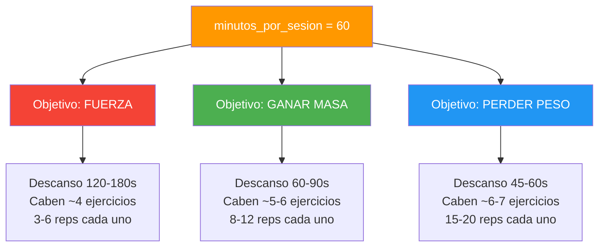

---

## 7. Todos los Factores que Influyen en la Recomendación

### 7.1 Factores del Perfil de Bienestar (10)

| # | Factor | Campo DB | Cómo Influye |
|---|--------|----------|--------------|
| 1 | **Edad** | `edad` | >50: ejercicios de bajo impacto, sin 1RM, calentamiento obligatorio. <18: técnica sobre carga, pesos moderados. |
| 2 | **Sexo** | `sexo` | Contexto general para la IA. |
| 3 | **Peso** | `peso_kg` | Cálculo de IMC y contexto de carga. |
| 4 | **Altura** | `altura_cm` | Cálculo de IMC. |
| 5 | **IMC** | `imc` (calculado) | 4 categorías con reglas de seguridad específicas (ver §7.4). |
| 6 | **Objetivo Principal** | `objetivo_principal` | Define rangos de reps, tiempos de descanso, tipo de ejercicios, RPE objetivo. |
| 7 | **Nivel Actividad** | `nivel_actividad` | sedentario/ligero/moderado/alto → volumen base sugerido. |
| 8 | **Equipamiento** | `equipamiento_disponible` | **Filtra el catálogo completo.** Solo se envían a Gemini los ejercicios compatibles. |
| 9 | **Días/Semana** | `dias_disponibles_semana` | Define la estructura semanal (1-7 días). |
| 10 | **Minutos/Sesión** | `minutos_por_sesion` | Determina cuántos ejercicios caben (10-180 min). |

### 7.2 Factores del Estado Diario (5)

| # | Factor | Campo DB | Cómo Influye |
|---|--------|----------|--------------|
| 11 | **Calidad Sueño** | `calidad_sueno` (1-5) | Si ≤2: evitar ejercicios de alta demanda neuromuscular. |
| 12 | **Nivel Estrés** | `nivel_estres` (1-5) | Contribuye al score de fatiga. |
| 13 | **Nivel Energía** | `nivel_energia` (1-5) | Si ≤2: priorizar movilidad y baja intensidad. |
| 14 | **Dolor Muscular** | `dolor_muscular` (1-5) | Reduce volumen si está elevado. |
| 15 | **Zonas con Dolor** | `zonas_dolor` (text[]) | La IA sustituye ejercicios que trabajen esas zonas. |

### 7.3 Factores del Historial de Entrenamiento (7)

| # | Factor | Campo/Fuente | Cómo Influye |
|---|--------|-------------|--------------|
| 16 | **Total Sesiones** | Agregado `sesiones_registradas` | Contexto de experiencia del usuario. |
| 17 | **RPE Promedio** | Agregado `sesiones_registradas.rpe` | Si >8.0: alerta de sobre-entrenamiento. |
| 18 | **Volumen Semanal** | Calculado `peso × reps` | Para periodización y progresión. |
| 19 | **Días Completados** | Agregado última semana | Mide adherencia real. |
| 20 | **Semanas Consecutivas** | Calculado por fechas | Si ≥4 + RPE>8 = requiere descarga. |
| 21 | **Requiere Descarga** | `requiereDescarga` (bool) | Fuerza semana inicial de descarga. |
| 22 | **Historial Ejercicios** | `series_sesion` JOIN `ejercicios` | Para sobrecarga progresiva (peso, reps, RPE por ejercicio). |

### 7.4 Factores de la Rutina (5)

| # | Factor | Tipo | Cómo Influye |
|---|--------|------|--------------|
| 23 | **Nombre Rutina** | Input usuario | Contexto semántico para la IA. |
| 24 | **Objetivo Rutina** | Selección usuario | Puede diferir del objetivo principal del perfil. |
| 25 | **Duración Semanas** | Input usuario | Define la periodización exacta. |
| 26 | **Días/Semana** | Input usuario | Puede diferir del perfil. |
| 27 | **Ejercicios Ya Agregados** | Estado actual del editor | La IA no repite ejercicios ya existentes en el día. |

### 7.4 Reglas de Seguridad por IMC y Edad

| Condición | Regla en el Prompt |
|-----------|-------------------|
| IMC > 30 | Priorizar **bajo impacto** articular. Evitar plyométricos. Evitar carga excesiva en rodillas y lumbar. |
| IMC 25-30 | Moderar ejercicios de alto impacto. Buena técnica ante todo. |
| IMC < 18.5 | Evitar déficit calórico extremo. Priorizar **ganancia de masa muscular**. |
| Edad > 50 | Sin 1RM. Rangos 8-15 reps. **Calentamiento articular 5-10 min obligatorio.** |
| Edad < 18 | **Técnica sobre carga.** Evitar pesos máximos. Enfásis en peso corporal. |

### 7.5 Reglas de Programación por Objetivo

| Objetivo | Ejercicios/Día | Reps | Descanso | Peso | RPE |
|----------|---------------|------|----------|------|-----|
| `perder_peso` | 3-4 (circuito) | 15-20 | 45-60s | Moderado | 6-8 |
| `ganar_masa` | 4-5 | 8-12 | 60-90s | Moderado-alto | 7-9 |
| `fuerza` | 3-4 (compuestos) | 3-6 | 120-180s | Alto | 8-9.5 |
| `resistencia` | 5-6 | 15-25 | 30-45s | Bajo-moderado | 5-7 |
| `movilidad` | Variable | 12-15 | 45-60s | Corporal/ligero | 4-6 |
| `fitness_general` | 4-5 | 10-12 | 60-90s | Moderado | 6-8 |

---

## 8. Sistema de Periodización y Detección de Fatiga

### 8.1 Algoritmo de Periodización (`_calcularTipoSemana`)

Cada semana de la rutina recibe automáticamente un tipo al guardarse:

```
rutina_provider.dart:875

_calcularTipoSemana(semanaNum, totalSemanas):
  si totalSemanas ≤ 1 → 'carga'
  si semanaNum == 1  → 'adaptacion'
  si semanaNum == totalSemanas y totalSemanas ≥ 4 → 'descarga'
  si semanaNum == totalSemanas y totalSemanas ≥ 3 → 'pico'
  resto → 'carga'
```

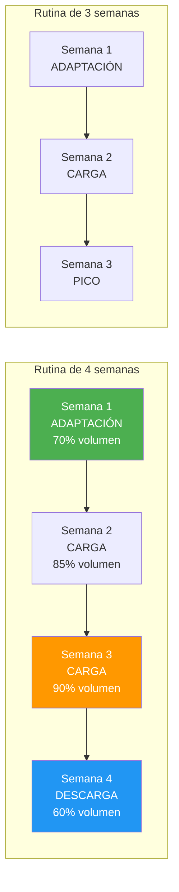

### 8.2 Detección de Fatiga Diaria

El check-in diario alimenta un score compuesto:

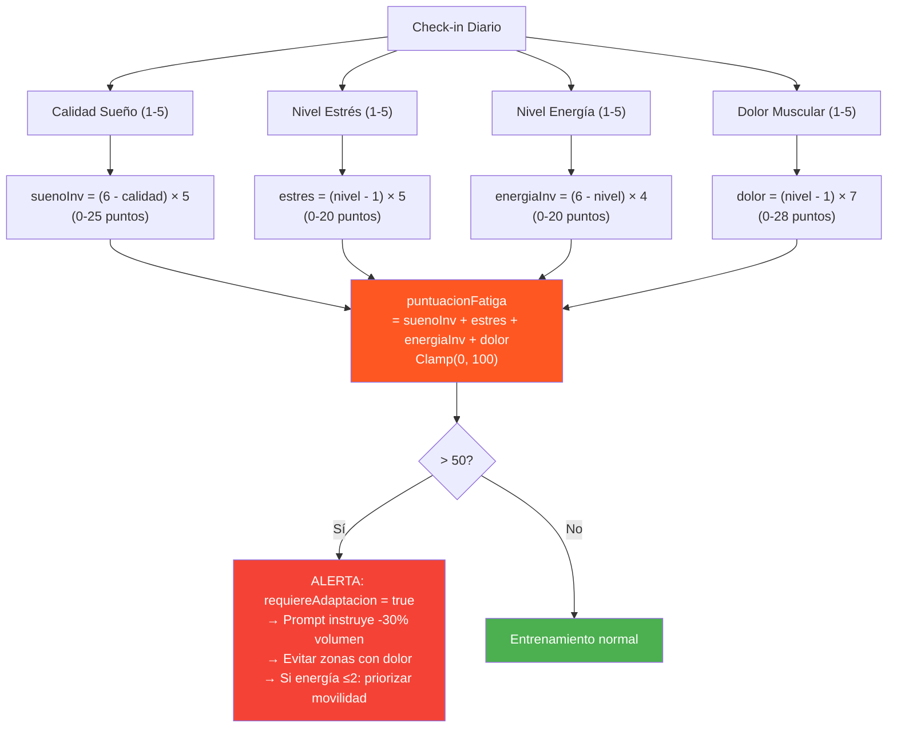

### 8.3 Detección de Sobre-entrenamiento (Periodización)

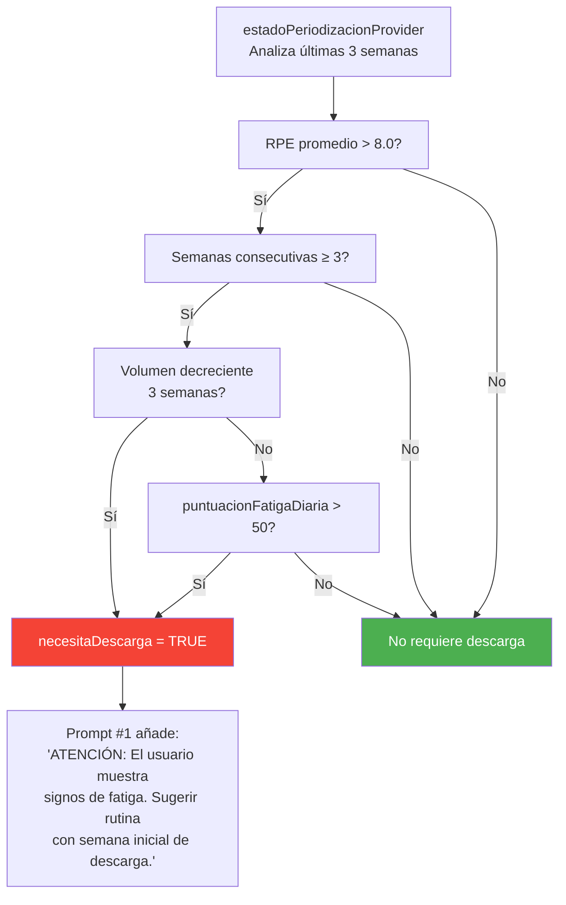

---

## 9. Flujo de Guardado en Base de Datos

### 9.1 Encadenamiento de INSERTs

Cuando el usuario presiona "Crear rutina", se ejecuta `crearRutinaCompleta()`
en `rutina_provider.dart:439`. Las inserciones son **secuenciales**
(no en paralelo) porque cada una depende del `id` generado por la anterior:

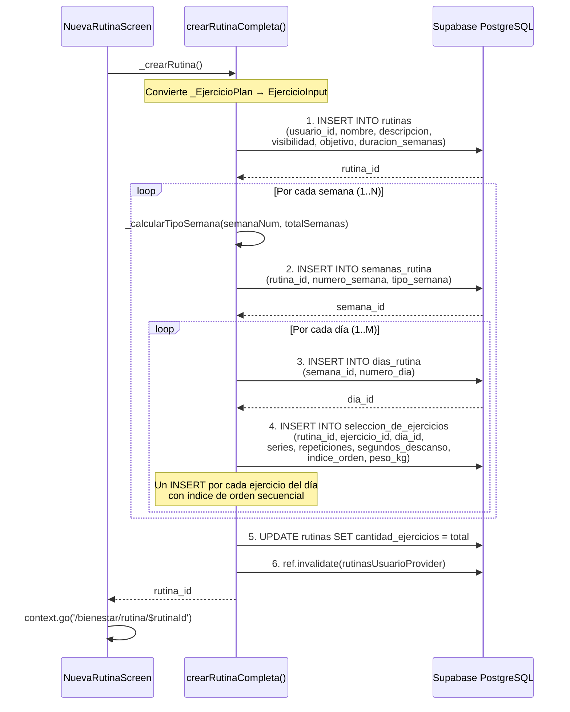

### 9.2 Estructura Jerárquica de Datos

```
rutinas (1)
├── id: UUID
├── usuario_id: FK → auth.users
├── nombre: "Rutina de Fuerza"
├── objetivo: "fuerza"
├── duracion_semanas: 4
├── cantidad_ejercicios: 48
│
├── semanas_rutina (N)
│   ├── semana_id: UUID
│   ├── numero_semana: 1
│   ├── tipo_semana: "adaptacion" | "carga" | "pico" | "descarga"
│   │
│   ├── dias_rutina (M)
│   │   ├── dia_id: UUID
│   │   ├── numero_dia: 1
│   │   │
│   │   ├── seleccion_de_ejercicios (K)
│   │   │   ├── ejercicio_id: FK → ejercicios
│   │   │   ├── series: 3
│   │   │   ├── repeticiones: 10
│   │   │   ├── segundos_descanso: 90
│   │   │   ├── indice_orden: 1
│   │   │   └── peso_kg: null | 22.5
```

---

## 10. Mapeo de Respuestas de IA a Datos Reales

La IA devuelve `exerciseDbId` (string), que es un identificador del catálogo
externo de ejercicios (ExerciseDB). El código debe hacer un match con el UUID
real de la tabla `ejercicios`:

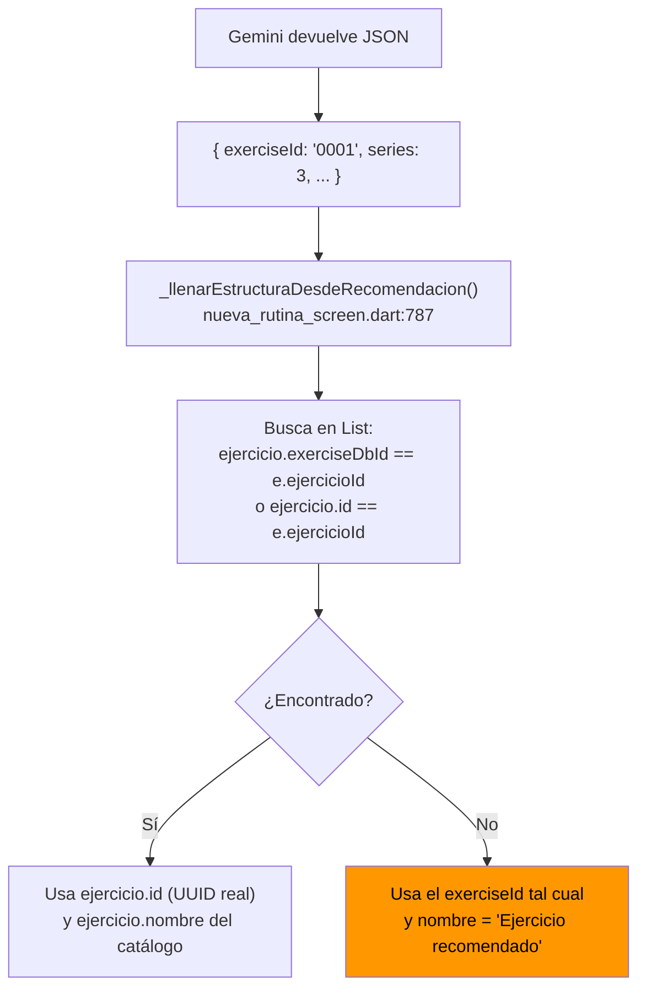

**⚠ Limitación:** Si Gemini devuelve un `exerciseId` que no existe en el
catálogo, el ejercicio se guarda con el ID incorrecto y nombre genérico.

---

## 11. Seguimiento Semanal de Bienestar (Feedback Loop)

El sistema también incluye un provider de seguimiento semanal que no alimenta
directamente a la IA, pero proporciona feedback al usuario sobre su adherencia:

```
bienestar_semanal_provider.dart

BienestarSemanalDto:
  - plan: PlanEntrenamientoSemanalDb?     ← plan creado desde el perfil
  - sesionesCompletadas: int              ← COUNT de sesiones_registradas esta semana
  - sesionesPlanificadas: int             ← plan.sesiones_planificadas
  - cumplimiento: double                  ← sesionesCompletadas / sesionesPlanificadas
  - cumplimientoAnterior: double          ← comparación con semana anterior
  - tendencia: "Mejorando" | "Estable" | "Bajando"
  - proximaAccion: String                 ← sugerencia textual según cumplimiento
```

---

## 12. Manejo de Errores y Cancelación

### 12.1 Cancelación Manual por el Usuario

Desde la versión 3.3, los 3 botones de recomendación IA incluyen un botón de
**"Cancelar"** visible durante la carga. El usuario puede interrumpir la llamada
a Gemini en cualquier momento antes de recibir respuesta:

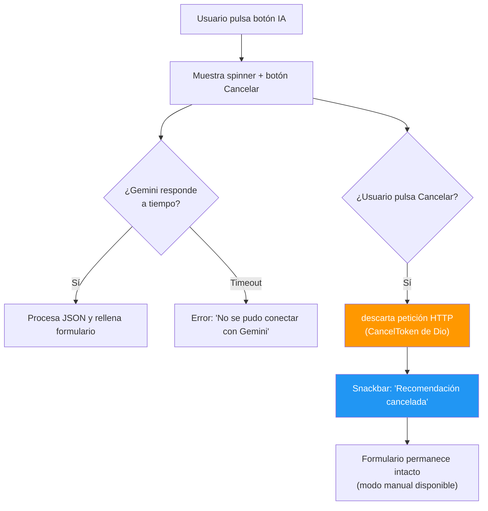

**Implementación técnica:**
- `_callGemini()` recibe un `CancelToken` opcional de `dio`.
- Cada método de recomendación (`_recomendarRutina`, `_recomendarEjercicios`, `_sugerirEjerciciosIA`) crea su propio `CancelToken`.
- Al pulsar "Cancelar", se llama a `cancelToken.cancel()` y se limpia el estado `_cargandoRecomendacion`.
- El botón de cancelar usa un `TextButton` con icono `Icons.close` y texto "Cancelar", visible solo cuando `_cargandoRecomendacion == true`.

### 12.2 Errores en el Servicio de IA

| Tipo de Error | Causa | Mensaje al Usuario |
|---------------|-------|-------------------|
| API Key vacía | `.env` sin `GEMINI_API_KEY` | "Falta GEMINI_API_KEY en el archivo .env" |
| Perfil sin completar | `perfilBienestarProvider` devuelve null | "Completa tu perfil de bienestar para recibir recomendaciones" |
| Sin ejercicios compatibles | Equipamiento no tiene ejercicios | "No hay ejercicios compatibles con tu equipamiento (X, Y)" |
| Gemini auth error | API key inválida (HTTP 400/401/403) | "Error de autenticación con Gemini. Revisa GEMINI_API_KEY." |
| Gemini connection error | Sin internet / timeout | "No se pudo conectar con Gemini en este momento." |
| Gemini sin respuesta | JSON vacío o candidates[] vacío | "Gemini no devolvió respuesta válida" |
| JSON mal formado | Gemini devolvió texto no-JSON | "Gemini generó una respuesta con formato no válido. Inténtalo de nuevo." |
| Sin ejercicios generados | Array vacío en respuesta válida | "Gemini no generó ejercicios válidos" / "La IA no generó ejercicios. Intenta de nuevo." |
| **Usuario cancela** | **CancelToken cancelado por el usuario** | **"Recomendación cancelada" (snackbar informativo, sin penalización)** |

### 12.3 Extracción Robusta de JSON

El método `_extraerJson()` (`recomendacion_ia_service.dart:822`) maneja
múltiples formatos de respuesta de Gemini:

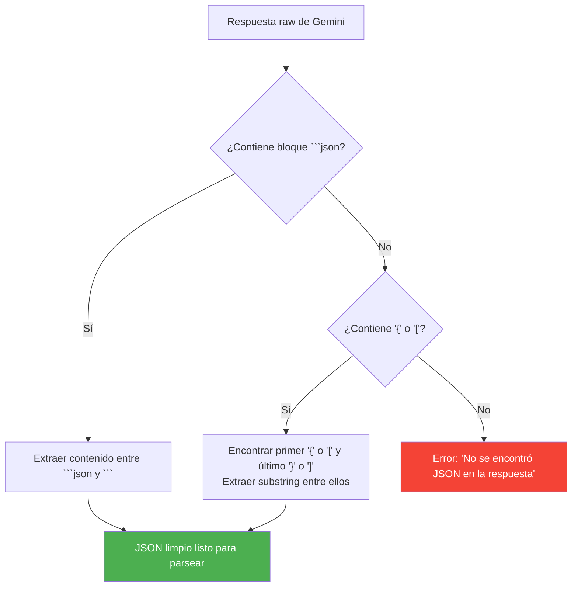

### 12.4 Validación de Ejercicios por Equipamiento

Antes de enviar cualquier prompt, el código filtra el catálogo de ejercicios
para incluir SOLO los compatibles con el equipamiento del usuario:

```
_ejercicioUsaEquipamiento(ejercicio, equipamientoUsuario):
  - peso_corporal siempre es compatible
  - Compara cada equipamiento del ejercicio contra cada equipamiento del usuario
  - Usa mapeo de equivalencias:
    mancuerna ↔ mancuernas
    barra ↔ barra
    polea ↔ polea
    máquina ↔ maquina
    banda_elastica ↔ banda de resistencia
    kettlebell ↔ pesa rusa
```

---

## 13. Selector Manual de Ejercicios

Además de la IA, el usuario puede añadir ejercicios manualmente mediante un
buscador en `_BuscadorEjerciciosSheet`:

```
DiaEditorCard → Botón "Añadir ejercicio" → BottomSheet
  → Buscador con filtros:
    - TextSearch (nombre/descripción)
    - Por parte del cuerpo
    - Por músculo objetivo/secundario
    - Por equipamiento
  → Muestra resultados de v_ejercicios_completos (view denormalizado)
  → Al seleccionar: añade con 3×10×90s por defecto
  → Usuario puede ajustar series/reps/descanso/peso en el editor
```

---

## 14. Diagrama de Arquitectura de Providers (Riverpod)

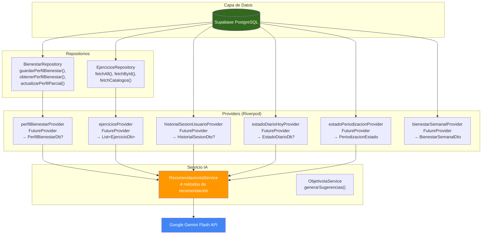

---

## 15. Referencias en el Código Fuente

| Archivo | Líneas Clave | Propósito |
|---------|-------------|-----------|
| `app/lib/features/bienestar/infrastructure/recomendacion_ia_service.dart` | 1-867 | Servicio central de IA: 4 prompts, helpers, parseo JSON |
| `app/lib/features/auth/infrastructure/objetivo_ia_service.dart` | 1-122 | IA que sugiere 5 objetivos en onboarding |
| `app/lib/features/bienestar/application/rutina_provider.dart` | 439-524 | `crearRutinaCompleta()` — guarda en 4 tablas |
| `app/lib/features/bienestar/application/rutina_provider.dart` | 711-817 | `historialSesionUsuarioProvider` — agrega historial |
| `app/lib/features/bienestar/application/rutina_provider.dart` | 823-838 | `estadoDiarioHoyProvider` — lee check-in diario |
| `app/lib/features/bienestar/application/rutina_provider.dart` | 840-868 | `guardarEstadoDiario()` — upsert check-in |
| `app/lib/features/bienestar/application/rutina_provider.dart` | 875-881 | `_calcularTipoSemana()` — periodización |
| `app/lib/features/bienestar/application/rutina_provider.dart` | 886-972 | `estadoPeriodizacionProvider` — detección fatiga |
| `app/lib/features/bienestar/application/rutina_provider.dart` | 609-675 | `iniciarSesion()`, `finalizarSesion()`, `registrarSerie()` |
| `app/lib/features/bienestar/application/ejercicios_provider.dart` | 1-87 | Providers de ejercicios con filtrado en memoria |
| `app/lib/features/bienestar/application/bienestar_semanal_provider.dart` | 1-135 | Seguimiento semanal de bienestar |
| `app/lib/features/bienestar/infrastructure/ejercicios_repository.dart` | 1-148 | Repositorio de ejercicios (v_ejercicios_completos) |
| `app/lib/features/auth/infrastructure/bienestar_repository.dart` | 43-92 | `guardarPerfilBienestar()` — guarda minutos_por_sesion |
| `app/lib/features/bienestar/presentation/nueva_rutina_screen.dart` | 611-695 | `_recomendarRutina()` — llama al Prompt #1 |
| `app/lib/features/bienestar/presentation/nueva_rutina_screen.dart` | 697-785 | `_recomendarEjercicios()` — llama al Prompt #2 |
| `app/lib/features/bienestar/presentation/nueva_rutina_screen.dart` | 787-810 | `_llenarEstructuraDesdeRecomendacion()` — mapea exerciseDbId |
| `app/lib/features/bienestar/presentation/nueva_rutina_screen.dart` | 812-911 | `_sugerirEjerciciosIA()` — llama al Prompt #3 |
| `app/lib/features/bienestar/presentation/nueva_rutina_screen.dart` | 913-941 | `_crearRutina()` — dispara el guardado |
| `app/lib/features/auth/presentation/perfil_fisico_screen.dart` | 39, 766-790 | Slider de minutos por sesión |
| `app/lib/features/auth/presentation/perfil_fisico_screen.dart` | 280-294 | Guarda perfil con minutos_por_sesion |
| `app/lib/shared/models/db_models.dart` | 770-898 | Modelo `PerfilBienestarDb` con `minutosPorSesion` |
| `app/lib/shared/models/db_models.dart` | 903-972 | Modelo `EstadoDiarioDb` con `puntuacionFatiga` |
| `supabase/sql/schema.sql` | 552, 566 | Schema: `minutos_por_sesion INT DEFAULT 45 CHECK (10-180)` |

---

## 16. Limitaciones y Consideraciones Técnicas

### 16.1 Inconsistencia de la IA

- Gemini **no siempre respeta** el límite de 4-7 ejercicios.
- Los minutos por sesión influyen **indirectamente**: no hay una regla dura
  como `floor(minutos / 15) = ejercicios`. La IA decide libremente.
- Dos llamadas con los mismos parámetros pueden dar resultados diferentes.

### 16.2 Sin Validación Post-Gemini

- El código confía en que Gemini respete las reglas del prompt.
- Si Gemini devuelve un ejercicio con equipamiento incompatible, se muestra igual.
- Si Gemini devuelve un `exerciseId` inexistente, se usa el string crudo como ID.

### 16.3 Rendimiento

- Cada llamada a IA requiere **4 consultas a Supabase** (perfil + ejercicios +
  historial + estado diario). El historial agrega los datos de `series_sesion`.
- Sin caché: cada pulsación hace una nueva llamada a Gemini.
- Las inserciones en BD son secuenciales, no en batch. Para una rutina de 4
  semanas × 4 días × 5 ejercicios = **1 + 4 + 16 + 80 = 101 roundtrips HTTP**.

### 16.4 Seguridad de la API Key

- `GEMINI_API_KEY` se lee de `.env` en cliente Flutter.
- Se envía en el header `X-goog-api-key` de cada request HTTPS.
- No se almacena en BD ni se envía a Supabase.

---

## 17. Resumen Visual del Sistema Completo

```
╔═══════════════════════════════════════════════════════════════════════════════╗
║                    SYNAPTIXFIT — IA RECOMMENDATION SYSTEM                     ║
╠═══════════════════════════════════════════════════════════════════════════════╣
║                                                                               ║
║  ┌─ ONBOARDING ──────────────────────────────────────────────────────────┐  ║
║  │ PerfilFisicoScreen (4 pasos) → PerfilBienestarDb                       │  ║
║  │  ├─ edad, sexo, ciudad                                                 │  ║
║  │  ├─ peso, altura → IMC                                                 │  ║
║  │  ├─ nivelActividad, objetivoPrincipal                                  │  ║
║  │  │   └─ ObjetivoIaService → 5 sugerencias IA                           │  ║
║  │  └─ diasDisponiblesSemana, minutosPorSesion, equipamientoDisponible    │  ║
║  └────────────────────────────────────────────────────────────────────────┘  ║
║                                      │                                        ║
║                                      ▼                                        ║
║  ┌─ CHECK-IN DIARIO ──────────────────────────────────────────────────────┐  ║
║  │ SesionEnVivoScreen → EstadoDiarioDb                                    │  ║
║  │  ├─ calidadSueno (1-5)                                                 │  ║
║  │  ├─ nivelEstres (1-5)                                                  │  ║
║  │  ├─ nivelEnergia (1-5)                                                 │  ║
║  │  ├─ dolorMuscular (1-5)                                                │  ║
║  │  ├─ zonasDolor (text[])                                                │  ║
║  │  └─ puntuacionFatiga (0-100) → requiereAdaptacion si > 50              │  ║
║  └────────────────────────────────────────────────────────────────────────┘  ║
║                                      │                                        │  ║
║                                      ▼                                        │  ║
║  ┌─ CREACIÓN DE RUTINA (3 pasos) ────────────────────────────────────────┐  ║
║  │ NuevaRutinaScreen                                                      │  ║
║  │                                                                         │  ║
║  │  Paso 1: Metadatos                                                     │  ║
║  │  ┌──────────────────────────────────────────────────────────────┐     │  ║
║  │  │ "Recomendar rutina con IA"                                     │     │  ║
║  │  │   → RecomendacionIaService.generarRecomendacionRutina()        │     │  ║
║  │  │   → Prompt #1 → Gemini → {nombre, desc, objetivo, duración}   │     │  ║
║  │  └──────────────────────────────────────────────────────────────┘     │  ║
║  │                                                                         │  ║
║  │  Paso 2: Ejercicios (editor semana×día)                                │  ║
║  │  ┌──────────────────────────────────────────────────────────────┐     │  ║
║  │  │ "Recomendar ejercicios"                                        │     │  ║
║  │  │   → RecomendacionIaService.generarEstructuraCompleta()         │     │  ║
║  │  │   → Prompt #2 → Gemini → {estructura: semanas×días×ejercicios}│     │  ║
║  │  │                                                                │     │  ║
║  │  │ "Sugerir ejercicios con IA" (por día)                          │     │  ║
║  │  │   → RecomendacionIaService.generarRecomendacionEjercicios()    │     │  ║
║  │  │   → Prompt #3 → Gemini → [3-6 ejercicios]                     │     │  ║
║  │  │                                                                │     │  ║
║  │  │ "Añadir ejercicio" (manual)                                    │     │  ║
║  │  │   → BottomSheet con buscador+filtros del catálogo              │     │  ║
║  │  └──────────────────────────────────────────────────────────────┘     │  ║
║  │                                                                         │  ║
║  │  Paso 3: Revisión → "Crear rutina"                                     │  ║
║  │   → crearRutinaCompleta() → 4 tablas en cascada                        │  ║
║  │   → _calcularTipoSemana() asigna tipo a cada semana                    │  ║
║  └────────────────────────────────────────────────────────────────────────┘  ║
║                                                                               ║
║  ┌─ POST-CREACIÓN ───────────────────────────────────────────────────────┐  ║
║  │ RutinaDetalleScreen → gestión de rutina existente                      │  ║
║  │ SesionEnVivoScreen → entrenamiento en vivo + registro de series        │  ║
║  │   → iniciarSesion() → finalizarSesion(rpe, duracion) → registrarSerie()│  ║
║  │                                                                         │  ║
║  │ Sobrecarga Progresiva (por ejercicio):                                  │  ║
║  │   → RecomendacionIaService.generarProgresionEjercicio()                 │  ║
║  │   → Prompt #4 → Gemini → {series, reps, descanso, pesoKg}              │  ║
║  └────────────────────────────────────────────────────────────────────────┘  ║
║                                                                               ║
╚═══════════════════════════════════════════════════════════════════════════════╝
```

---

*Documento generado automáticamente a partir del análisis del código fuente
(12-05-2026). Actualizado 19-05-2026 con reglas de finalidad. Para consultar cambios o ampliar secciones, referirse a los
archivos listados en §15.*
