# 15 - Sistema de Recomendación por IA (Rutinas y Ejercicios)

**Proyecto:** SynaptixFit
**Versión:** 5.0
**Fecha:** 09-06-2026
**Referencia:** [03-architecture.md](03-architecture.md), [06-frontend.md](06-frontend.md), [04-data-model.md](04-data-model.md), [14-changelog.md](14-changelog.md)

---

## 1. Resumen Ejecutivo

El sistema de recomendación de SynaptixFit ha evolucionado de un enfoque puramente basado en IA (Gemini Flash) a una arquitectura híbrida con un **motor de reglas determinista como base** y **refinamiento IA opcional** (Fases 0-10). La versión 5.0 introduce **paralelización de providers**, **JSON mode forzado en Gemini**, **catálogo inteligente top 60**, **contexto académico real** y **parámetros personalizados por modalidad**.

**Arquitectura actual (v5.0):**
```
Pipeline Determinista (7 etapas, ~3s)         Refinamiento IA (opcional, ~9s)
┌──────────────────────────────────┐         ┌──────────────────────────────┐
│ 0. Future.wait (4 providers)     │         │                              │
│ 1. sanitizarObjetivo()           │         │ 7. refinarRutina()            │
│ 2. Reglas → split + ejercicios   │  ────→  │    JSON mode + catálogo top  │
│ 3. Contexto → ajustes (FCT, EE)  │         │    60 + contexto unificado   │
│ 4. Transición → interpolación    │         │    → validación extendida    │
│ 5. Progresión → sobrecarga       │         │    → preservar params pre-IA │
│ 6. Validación → estructura final │         │                              │
└──────────────────────────────────┘         └──────────────────────────────┘
```

**Mejoras clave v5.0:**
- **Paralelización**: `generarRutinaProvider` carga perfil, catálogo, historial y estado diario en paralelo con `Future.wait` (redujo 24s → 12s).
- **Timeouts explícitos**: queries de perfil, historial y ejercicios tienen timeouts de 8-12s.
- **Catálogo inteligente**: `_filtrarCatalogoParaIA()` filtra top 60 ejercicios por equipamiento, dificultad y score de relevancia (~200KB → ~15KB enviado a Gemini).
- **JSON mode**: `_callGemini()` activa `response_mime_type: application/json` forzando salida JSON válida. Con fallback a `_extraerJson()` legacy.
- **Contexto unificado**: `_formatearContextoCompleto()` genera bloque estructurado con PERFIL FÍSICO + HISTORIAL DEPORTIVO + ESTADO DIARIO + CARGA ACADÉMICA + SEGURIDAD BIOMÉTRICA.
- **ContextoAcademico real**: El orquestador recibe el objeto `ContextoAcademico` completo con `adherenciaAcademica` y `estadoEnergetico`, no solo un string.
- **Parámetros personalizados por modalidad**: `_toInput()` calcula valores basados en perfil — peso según % peso corporal × tipo de ejercicio, duración aeróbica según minutos/sesión y nivel, tiempo isométrico escalado con nivel.
- **Progresión isométrica**: `ProgresionEjercicio` ahora tiene `nuevoTiempoIsometricoSegundos`. La calculadora de progresión maneja ejercicios isométricos con gates RPE.
- **Validación extendida**: `_validarEjercicio()` valida duracionSegundos (30-7200), distanciaMetros (50-42195), tiempoIsometrico (5-300), pesoKg (0-300) con fallback a valores base.
- **Preservación post-IA**: `_preservarParamsPreIa()` restaura duracion, distancia e isométrico del pre-IA cuando la IA los deja null.

El campo `minutos_por_sesion` ya no es un factor primario del motor determinista; en su lugar se usa `ejerciciosPorDia` de la tabla `ParametrosObjetivo`.

---

## 2. Arquitectura General (v5.0 — Híbrida: Reglas + IA + Pipeline Académico)

```
╔══════════════════════════════════════════════════════════════════════════════╗
║                         SynaptixFit — Cliente Flutter                        ║
║                                                                              ║
║  ┌──────────────────────────────────────────────────────────────────────┐   ║
║  │          generarRutinaProvider (Future.wait paralelo)                  │   ║
║  │  ┌───────────────┐ ┌──────────────┐ ┌──────────────┐ ┌────────────┐  │   ║
║  │  │perfilBienestar│ │ ejercicios   │ │ historial    │ │ estadoDiario│  │   ║
║  │  │Provider(8s)   │ │ Provider(12s)│ │ Provider(10s)│ │ Provider(8s)│  │   ║
║  │  └───────┬───────┘ └──────┬───────┘ └──────┬───────┘ └──────┬─────┘  │   ║
║  │          └────────────────┼────────────────┼───────────────┘         │   ║
║  │                           ▼                                         │   ║
║  │  ┌──────────────────────────────────────────────────────────────┐   │   ║
║  │  │         RecomendacionOrquestadorService (Fase 8)               │   │   ║
║  │  │                                                                │   │   ║
║  │  │   ┌──────────┐  ┌──────────┐  ┌────────────┐  ┌───────────┐  │   │   ║
║  │  │   │ Reglas   │  │ Contexto │  │ Transición │  │Progresión │  │   │   ║
║  │  │   │ (Fase 2) │→ │ (Fase 3) │→ │  (Fase 5)  │→ │ (Fase 4)  │  │   │   ║
║  │  │   └──────────┘  └─────┬────┘  └────────────┘  └───────────┘  │   │   ║
║  │  │                       │                                       │   │   ║
║  │  │         ┌─────────────┴─────────────┐                         │   │   ║
║  │  │         │  ContextoAcademico real    │                         │   │   ║
║  │  │         │  ├ adherenciaAcademica     │                         │   │   ║
║  │  │         │  ├ estadoEnergetico        │                         │   │   ║
║  │  │         │  ├ horasEstudio + estrés   │                         │   │   ║
║  │  │         │  └ examenesProximos        │                         │   │   ║
║  │  │         └───────────────────────────┘                         │   │   ║
║  │  │                                                                │   │   ║
║  │  │   ┌──────────────────┐     ┌──────────────────────────────┐   │   │   ║
║  │  │   │ Feedback Engine  │     │  Refinamiento IA (Fase 6)     │   │   │   ║
║  │  │   │ (Fase 7)         │     │  ├ _filtrarCatalogoParaIA()   │   │   │   ║
║  │  │   │ Post-sesión      │     │  │   top 60 ejercicios        │   │   │   ║
║  │  │   └──────────────────┘     │  ├ _formatearContextoCompleto│   │   │   ║
║  │  │                            │  │   bloque unificado         │   │   │   ║
║  │  │                            │  ├ _callGemini() → JSON mode  │   │   │   ║
║  │  │                            │  └ _validarEjercicio()        │   │   │   ║
║  │  │                            └──────────────────────────────┘   │   │   ║
║  │  └──────────────────────────────────────────────────────────────┘   │   ║
║  └──────────────────────────────────────────────────────────────────────┘   ║
║                                                                              ║
║  ┌─────────────────────┐  ┌────────────────────────────┐  ┌──────────────┐  ║
║  │  NuevaRutinaScreen   │  │  syncCargaAcademicaSemanal │  │ string_utils │  ║
║  │                     │  │  (antes de recomendar)     │  │ Fase 0       │  ║
║  │ ⚡ Generar rápida   │  │  → carga_academica_semanal │  │ sanitizarObj │  ║
║  │ ✨ Recomendar con IA│  │  → adherencia + energético │  └──────────────┘  ║
║  └─────────────────────┘  └────────────────────────────┘                    ║
╚══════════════════════════════════════════════════════════════════════════════╝

                                     │
                                     ▼
╔══════════════════════════════════════════════════════════════════════════════╗
║                         Infraestructura                                      ║
║                                                                              ║
║  ┌─────────────────────┐  ┌──────────────────────┐  ┌───────────────────┐  ║
║  │  Supabase PostgreSQL │  │  Google Gemini Flash  │  │  pg_cron (2 AM)   │  ║
║  │  29+ tablas + RLS    │  │  JSON mode forzado    │  │  Job nocturno     │  ║
║  │  carga_academica_    │  │  response_mime_type:  │  │  Inactividad +    │  ║
║  │  semanal             │  │  application/json     │  │  fatiga alta      │  ║
║  │  entregas_examenes   │  │                        │  │                   │  ║
║  │  historial_objetivos │  │                        │  │                   │  ║
║  │  recomendaciones_    │  │                        │  │                   │  ║
║  │  pendientes          │  │                        │  │                   │  ║
║  └─────────────────────┘  └──────────────────────┘  └───────────────────┘  ║
╚══════════════════════════════════════════════════════════════════════════════╝
```

### 2.1 Por qué IA del lado cliente

| Opción | Ventaja | Desventaja |
|--------|---------|------------|
| **Cliente Flutter** (actual) | Sin latencia extra, sin coste de Edge Function, respuesta directa al UI | API key en request HTTPS |
| Edge Function Supabase | API key oculta | Doble latencia, coste adicional |

**Modelo:** `gemini-flash-latest` (~2-3s de latencia, capa gratuita 15 RPM).

---

## 3. Flujo de Onboarding — Cómo se Configuran los Minutos por Sesión

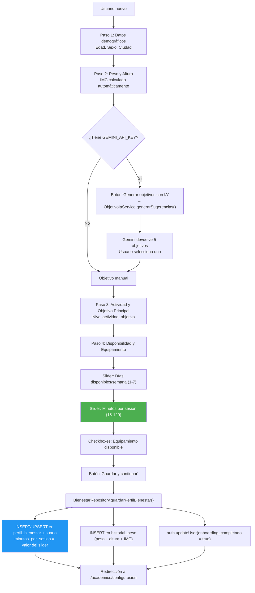

### 3.1 Configuración del Slider

| Propiedad | Valor |
|-----------|-------|
| Mínimo | 15 min |
| Máximo | 120 min |
| Divisiones | 21 (steps de 5 min) |
| Default | 45 min |
| DB constraint | `CHECK (minutos_por_sesion BETWEEN 10 AND 180)` |
| Archivo | `perfil_fisico_screen.dart:766-790` |
| Guardado | `bienestar_repository.dart:53,77` → `minutos_por_sesion` |

---

## 4. Flujo de Creación de Rutina con IA (3 Pasos)

### 4.0 Vía Rápida: "Sugerir Rutina con IA" desde la pantalla Rutinas

Desde la versión 3.3, el usuario puede iniciar el flujo de recomendación directamente
desde la pantalla de Rutinas (`RutinasComunidadScreen`) sin pasar por los pasos manuales:

```
RutinasComunidadScreen
  └── Botón "Sugerir Rutina con IA"
        │  FilledButton.tonalIcon verde con Icons.auto_awesome
        │
        └── Navega a NuevaRutinaScreen(autoRecomendar: true)
              │
              │  initState() → addPostFrameCallback → _recomendarRutina()
              │
              └── La IA rellena automáticamente nombre, descripción,
                    objetivo y duración. El usuario aterriza en Paso 1
                    con los campos ya completados.
```

El router (`app_router.dart`) pasa `autoRecomendar: true` vía `state.extra['autoRecomendar']`.
El `initState` de `NuevaRutinaScreen` detecta este flag y dispara `_recomendarRutina()`
en el siguiente frame (vía `addPostFrameCallback`), asegurando que el widget esté montado.

### 4.1 Flujo Manual (3 Pasos)

```mermaid
flowchart TD
    subgraph "PASO 1 — Metadatos"
        A["Usuario introduce:<br/>Nombre, Objetivo,<br/>Duración (1-12 sem),<br/>Días/semana (1-7)"] 
        --> B["Botón: 'Recomendar rutina con IA'"]
        B --> C["_recomendarRutina() en nueva_rutina_screen.dart:611"]
        C --> D["Lee: perfilBienestarProvider<br/>+ ejerciciosProvider<br/>+ historialSesionUsuarioProvider<br/>+ estadoDiarioHoyProvider"]
        D --> E["RecomendacionIaService<br/>.generarRecomendacionRutina()"]
        E --> F["Construye Prompt #1<br/>con 27 factores de contexto"]
        F --> G["POST a Gemini Flash"]
        G --> H["Gemini devuelve JSON:<br/>{nombre, descripcion, objetivo,<br/>duracionSemanas, estructura}"]
        H --> I["Auto-rellena los metadatos"]
        I --> J["Flag: _rutinaRecomendada = true"]
        J --> K["SnackBar: '¡Rutina recomendada!<br/>Configúrala y luego<br/>recomienda ejercicios'"]
    end

    subgraph "PASO 2 — Ejercicios (estructura completa)"
        K --> L["Botón: 'Recomendar ejercicios'"]
        L --> M["_recomendarEjercicios() en nueva_rutina_screen.dart:697"]
        M --> N["RecomendacionIaService<br/>.generarEstructuraCompleta()"]
        N --> O["Construye Prompt #2<br/>+ catálogo completo de ejercicios<br/>+ periodización exacta<br/>+ reglas de objetivo"]
        O --> P["POST a Gemini Flash"]
        P --> Q["Gemini devuelve JSON:<br/>{estructura: {semana: {dia: [ejercicios]}}}"]
        Q --> R["_llenarEstructuraDesdeRecomendacion()<br/>→ Mapea exerciseDbId a UUID real del ejercicio<br/>→ Busca nombre en catálogo"]
        R --> S["Naviga al editor de ejercicios (paso 2)"]
    end

    subgraph "PASO 2b — Sugerencia por día"
        S --> T["Usuario ve tarjetas por día<br/>con ejercicios asignados"]
        T --> U["Botón por día: 'Sugerir ejercicios con IA'"]
        U --> V["_sugerirEjerciciosIA(semana, dia)<br/>en nueva_rutina_screen.dart:812"]
        V --> W["RecomendacionIaService<br/>.generarRecomendacionEjercicios()"]
        W --> X["Construye Prompt #3<br/>+ ejercicios YA agregados<br/>(para no repetir)"]
        X --> Y["POST a Gemini Flash"]
        Y --> Z["Gemini devuelve 3-6 ejercicios<br/>en array JSON"]
        Z --> AA["Añade ejercicios al día<br/>+ SnackBar: 'X ejercicios añadidos'"]
    end

    subgraph "PASO 3 — Revisión y Guardado"
        S --> AB["Usuario edita ejercicios<br/>manualmente si quiere"]
        AB --> AC["Botón: 'Revisar y crear'"]
        AC --> AD["Muestra resumen completo<br/>semanas × días × ejercicios"]
        AD --> AE["Botón: 'Crear rutina'"]
        AE --> AF["_crearRutina() → crearRutinaCompleta()"]
        AF --> AG["INSERT en 4 tablas encadenadas:<br/>1. rutinas<br/>2. semanas_rutina<br/>3. dias_rutina<br/>4. seleccion_de_ejercicios"]
        AG --> AH["Redirección a /bienestar/rutina/:id"]
    end

    style K fill:#FF9800,color:white
    style R fill:#4CAF50,color:white
    style AG fill:#2196F3,color:white
```

---

## 5. Los Prompts a Gemini (v4.0 — Refinamiento IA, no generación)

> **Importante (v4.0):** Los prompts #1-#4 legacy (que generaban rutinas desde cero) han sido reemplazados por el motor de reglas determinista (Fases 0-5). Gemini ahora solo se usa en la Fase 6 (`refinarRutina()`) para mejorar una estructura ya generada. Los prompts legacy se mantienen documentados por compatibilidad con versiones anteriores.

### 5.0 Sistema Unificado de Objetivos (Fase 0)

**Archivo:** `app/lib/shared/utils/string_utils.dart`

Antes de cualquier llamada a Gemini o al motor de reglas, el objetivo se sanitiza con `sanitizarObjetivo()`:

```dart
const finalidadesEstandar = [
  'Hipertrofia Muscular',
  'Fuerza Máxima',
  'Potencia y Explosividad',
  'Fuerza Resistencia',
  'Movilidad y Flexibilidad',
  'Estabilidad y Control Motor',
  'Acondicionamiento Metabólico',
];

String sanitizarObjetivo(String raw) {
  // 1. Coincidencia exacta contra finalidadesEstandar
  // 2. Mapa legacy: hipertrofia→Hipertrofia Muscular, fuerza→Fuerza Máxima, ...
  // 3. Fallback: 'Hipertrofia Muscular'
}
```

Los 4 prompts de Gemini (legacy) y el motor de reglas usan esta misma función, garantizando consistencia en todo el sistema.

### 5.0.1 Prompt de Refinamiento — `refinarRutina()` (Fase 6)

**Método:** `refinarRutina()` en `RecomendacionIaService`
**Rol IA:** "Eres un entrenador personal profesional. Refina esta rutina ya generada."
**Input:** Estructura base completa (series, reps, descanso, pesos, ejercicios)
**Output:** Estructura refinada con nombres mejorados, 1-2 ejercicios variados, reordenados

**Reglas estrictas del prompt de refinamiento:**
- **NO modificar** series, repeticiones ni tiempos de descanso
- **NO modificar** pesos ni progresiones
- **SÍ mejorar** nombre de la rutina
- **SÍ mejorar** descripción
- **SÍ variar** máximo 1-2 ejercicios por día (sustituir por variantes)
- **SÍ reordenar** ejercicios dentro de cada día

**Post-procesamiento `_validarYReparar()`:**
1. Validar que cada `ejercicioId` existe en el catálogo
2. Validar compatibilidad de equipamiento
3. Validar que la dificultad es válida
4. Validar que los parámetros están en rango
5. Si cualquier validación falla → revertir al ejercicio original del motor de reglas

### 5.1 Prompt #1 — Recomendación de Metadatos de Rutina (LEGACY, v3.x)

**Método:** `generarRecomendacionRutina()` (`recomendacion_ia_service.dart:121`)
**Rol IA:** "Eres un entrenador personal profesional con amplia experiencia en prescripción de ejercicio"
**Output:** JSON con `nombre`, `descripcion`, `objetivo`, `duracionSemanas`, `estructura`

**Contexto enviado a Gemini:**

```
CONTEXTO DEL USUARIO:
- Objetivo principal: ${perfil.objetivoPrincipal}
- Nivel de actividad: ${perfil.nivelActividad}
- Equipamiento disponible (SOLO esto): ${equipamiento.join(', ')}
- Días disponibles por semana: ${perfil.diasDisponiblesSemana}
- Minutos por sesión: ${perfil.minutosPorSesion}              ◄──
- Biometría: Edad X, Sexo X, Peso X kg, Altura X cm, IMC X.X (Categoría)
- HISTORIAL DE ENTRENAMIENTO: (si existe)
- ESTADO FÍSICO DE HOY: (si existe check-in diario)

REGLAS DE SEGURIDAD SEGÚN BIOMETRÍA:
- IMC > 30: Priorizar bajo impacto articular
- IMC < 18.5: Evitar déficit calórico extremo
- Edad > 50: Sin 1RM, rangos 8-15 reps, calentamiento
- Edad < 18: Técnica sobre carga, evitar pesos máximos

REGLAS DE EQUIPAMIENTO:
- SOLO recomendar ejercicios que usen el equipamiento listado

REGLAS DE RECOMENDACIÓN SEGÚN OBJETIVO:
- perder_peso: circuitos, 15-20 reps, descanso 45-60s
- ganar_masa: hipertrofia 8-12 reps, descanso 60-90s
- fuerza: 3-6 reps, descanso 120-180s
- resistencia: 15-25 reps, descanso 30-45s
- movilidad: rango completo, peso corporal o ligero
- fitness_general: equilibrio, 10-12 reps, descanso 60-90s

PERIODIZACIÓN:
- Semana 1: ADAPTACIÓN (70% volumen)
- Semanas intermedias: CARGA PROGRESIVA (85-90%)
- Si 4+ semanas: última semana DESCARGA ACTIVA (60%)

Formato JSON esperado:
{ "nombre": "...", "descripcion": "...", "objetivo": "...",
  "duracionSemanas": 4, "estructura": { "1": { "1": [...] } } }

Cada día debe tener entre 4 y 7 ejercicios.
Los días deben alternar grupos musculares.
```

### 5.2 Prompt #2 — Estructura Completa (Semanas × Días)

**Método:** `generarEstructuraCompleta()` (`recomendacion_ia_service.dart:351`)
**Rol IA:** "Eres un entrenador personal profesional. Genera la estructura completa de ejercicios para una rutina ya configurada."
**Output:** JSON con estructura semanas × días × ejercicios detallados

**Diferencias con Prompt #1:**
- Incluye el **catálogo completo filtrado** como JSON inline (~50 ejercicios con `exerciseId`, `nombre`, `musculosObjetivo`, `equipamientos`)
- Las semanas/días ya están fijados por el usuario
- Incluye periodización exacta para la duración elegida (ej: 4 semanas → adaptacion/carga/carga/descarga)
- Incluye reglas de programación por objetivo detalladas
- Incluye sobrecarga progresiva basada en historial real si existe

### 5.3 Prompt #3 — Ejercicios para un Día Específico

**Método:** `generarRecomendacionEjercicios()` (`recomendacion_ia_service.dart:256`)
**Rol IA:** "Eres un entrenador personal. Recomienda entre 3 y 6 ejercicios adicionales para un día de entrenamiento."
**Output:** Array JSON de 3-6 ejercicios

**Contexto clave:**
```
- Rutina: "X"
- Día número: 2
- Minutos por sesión: 45                                   ◄──
- Ejercicios YA agregados (NO los repitas): [id1, id2]
- Catálogo disponible: [JSON completo filtrado]
```

### 5.4 Prompt #4 — Progresión de Ejercicio (Sobrecarga Progresiva)

**Método:** `generarProgresionEjercicio()` (`recomendacion_ia_service.dart:488`)
**Rol IA:** "Eres un entrenador personal experto en sobrecarga progresiva."
**Output:** JSON con `series`, `repeticiones`, `segundosDescanso`, `pesoKg`

**Reglas de progresión:**
| RPE Última Sesión | Acción | Incremento |
|-------------------|--------|------------|
| < 7 (infradesafiado) | Subir peso | +5-10% |
| 7-8 (zona óptima) | Subir peso | +2.5-5% |
| 8.5-9.5 (sostenido) | Mantener | 0% |
| 10 (fallo) | No subir peso | 0% |

### 5.5 Reglas de Series Dinámicas (v3.2)

Desde la versión 3.2, las series **no son fijas en 3**. La IA recibe
instrucciones explícitas en los 4 prompts para personalizar el número de
series de cada ejercicio según el contexto completo del usuario:

| Factor | Cómo afecta las series |
|--------|----------------------|
| **Objetivo** | fuerza: 3-5, ganar_masa: 3-4, perder_peso: 2-3, resistencia: 2-3, movilidad: 2-3, fitness_general: 3 |
| **Minutos/sesión** | <30 min → 2-3 series, 30-45 min → 2-4, 45-90 min → 3-5, >90 min → 4-5 |
| **Tipo ejercicio** | Compuestos (sentadilla, press banca, peso muerto): +1 serie extra. Aislados (curl, extensión): -1 serie |
| **Fatiga diaria** | Si `puntuacionFatiga > 50`: reduce 1 serie a todos los ejercicios |
| **Semana periodización** | Adaptación: 2-3, Carga: 3-4, Pico: 4-5, Descarga: 2 |
| **Nivel actividad** | Mayor nivel → más tolerancia al volumen → series al extremo superior del rango |

### 5.6 Reglas para Descripciones de Rutina (v3.2)

El Prompt #1 incluye reglas explícitas para que la descripción generada por la
IA **no incluya números concretos** (días, semanas, sesiones). Esto evita que
la descripción quede obsoleta si el usuario modifica manualmente la duración
o los días por semana después de la recomendación:

- **NO incluir:** "Programa de 2 días", "Rutina de 4 semanas", "Plan de 3 sesiones"
- **SÍ incluir:** Filosofía de entrenamiento, enfoque, metodología, tipo de ejercicios
- **Ejemplos correctos:** "Rutina de fuerza centrada en ejercicios compuestos con progresión semanal", "Entrenamiento de hipertrofia con enfoque en volumen y descansos controlados"
- **Ejemplos incorrectos:** "Programa de 2 días orientado a la ganancia muscular", "Rutina de 4 semanas con..."

### 5.7 Reglas de Finalidad del Ejercicio (v3.4)

Desde la versión 3.4, los 3 prompts de recomendación incluyen reglas explícitas para
asignar correctamente los campos según la **finalidad** del ejercicio (`fuerza`, `cardio`, `isometrico`).
La IA recibe la finalidad de cada ejercicio en el catálogo (campo `finalidad`) y debe
respetar el mapeo de columnas:

```
REGLAS SEGUN FINALIDAD DEL EJERCICIO (campo "finalidad" en el catalogo):
- fuerza: Usa "series", "repeticiones", "segundosDescanso" y "pesoKg"
- cardio: Usa "duracionSegundos" (600-3600s), opcionalmente "distanciaMetros".
  "series" equivale a intervalos. PON "repeticiones": 0 y "pesoKg": null.
- isometrico: Usa "tiempoIsometricoSegundos" (10-120s). Series: 2-4.
  PON "repeticiones": 0 y "pesoKg": null.
- NUNCA combines campos de distintas finalidades en un mismo ejercicio.
```

**Reglas adicionales de cardio:**
- Duración recomendada: 600-3600 segundos (10-60 min)
- Distancia opcional: 500-10000 metros
- Intervalos (series): 1-10
- Descanso entre intervalos: 30-120 segundos

**Reglas adicionales de isométrico:**
- Sujeción por serie: 10-120 segundos
- Series por ejercicio isométrico: 2-4

**Formato JSON esperado (ejercicio con todos los campos):**
```json
{
  "exerciseId": "...",
  "series": 4,
  "repeticiones": 8,
  "segundosDescanso": 90,
  "pesoKg": null,
  "duracionSegundos": null,
  "distanciaMetros": null,
  "tiempoIsometricoSegundos": null
}
```

El catálogo de ejercicios enviado a Gemini ahora incluye el campo `finalidad`:
```dart
'finalidad': e.finalidad.name,  // 'fuerza', 'cardio' o 'isometrico'
```

El Prompt #1 incluye reglas explícitas para que la descripción generada por la
IA **no incluya números concretos** (días, semanas, sesiones). Esto evita que
la descripción quede obsoleta si el usuario modifica manualmente la duración
o los días por semana después de la recomendación:

- **NO incluir:** "Programa de 2 días", "Rutina de 4 semanas", "Plan de 3 sesiones"
- **SÍ incluir:** Filosofía de entrenamiento, enfoque, metodología, tipo de ejercicios
- **Ejemplos correctos:** "Rutina de fuerza centrada en ejercicios compuestos con progresión semanal", "Entrenamiento de hipertrofia con enfoque en volumen y descansos controlados"
- **Ejemplos incorrectos:** "Programa de 2 días orientado a la ganancia muscular", "Rutina de 4 semanas con..."

---

### 5.8 Pipeline de Fallback — IA → Reglas

Cuando la IA falla (timeout, error de API, JSON malformado, respuesta vacía), el orquestador mantiene la estructura determinista intacta y continúa sin interrupción:

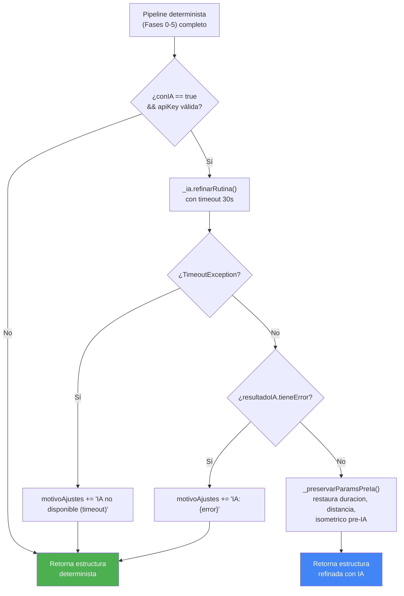

### 5.9 Diagrama de Flujo del Pipeline Completo

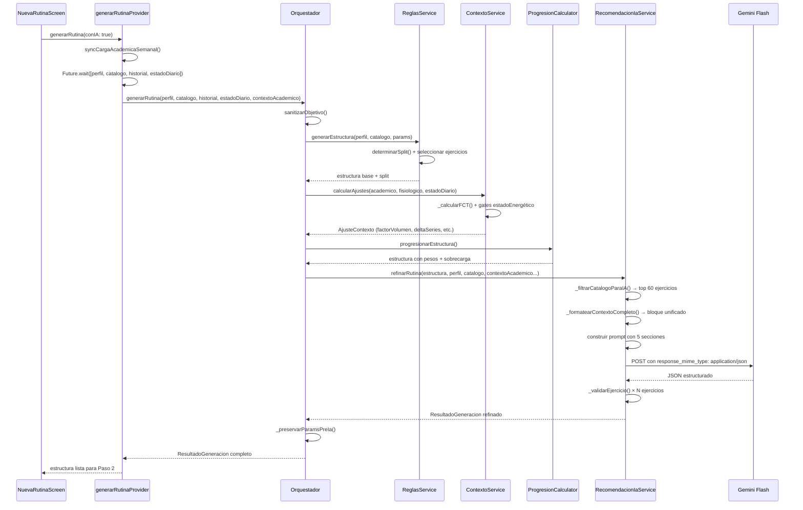

### 5.10 Integración del Contexto Académico Real

El pipeline de recomendación ahora integra el `ContextoAcademico` completo como objeto tipado, no como string sin formato. El flujo de datos es:

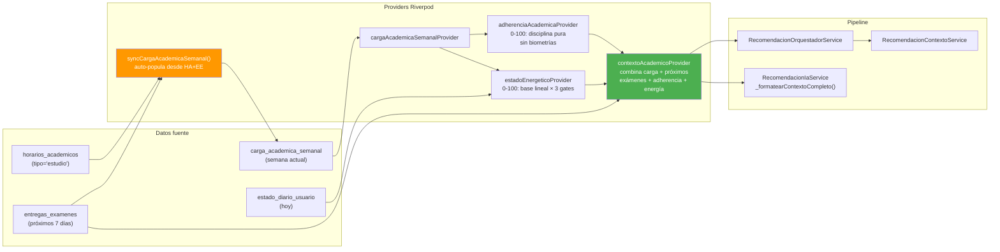

**ContextoAcademico** (DTO definido en `recomendacion_contexto_service.dart`):

| Campo | Tipo | Origen | Uso en pipeline |
|-------|------|--------|-----------------|
| `horasEstudioReales` | `double` | `carga_academica_semanal` | `_calcularFCT()` pondera 25% |
| `nivelEstres` | `double` | `carga_academica_semanal` | `_calcularFCT()` pondera 25% |
| `evaluacionesSemana` | `int` | `carga_academica_semanal` | `_calcularFCT()` pondera 15% |
| `horasSuenoPromedio` | `double` | `carga_academica_semanal` | `_calcularFCT()` pondera 15% |
| `tieneExamenesProximos` | `bool` | `entregas_examenes` (7 días) | Activa modo exámenes: volumen ×0.70 |
| `adherenciaAcademica` | `double` (0-100) | `adherenciaAcademicaProvider` | Informa a Gemini sobre disciplina |
| `estadoEnergetico` | `double` (0-100) | `estadoEnergeticoProvider` | Gates: <30→×0.40, <50→×0.75 |

**`syncCargaAcademicaSemanal()`** se ejecuta automáticamente antes de `_recomendarRutina()`:
1. Consulta `horarios_academicos` de la semana actual (tipo 'estudio') → calcula horas reales
2. Consulta `entregas_examenes` de la semana → cuenta total y completadas
3. UPSERT en `carga_academica_semanal` con datos frescos
4. Invalida 4 providers: `cargaAcademicaSemanalProvider`, `adherenciaAcademicaProvider`, `estadoEnergeticoProvider`, `contextoAcademicoProvider`

### 5.11 JSON Mode y Catálogo Inteligente

**JSON Mode en `_callGemini()`** (`recomendacion_ia_service.dart:1263`):

```dart
data: {
  'contents': [{ 'parts': [{'text': prompt}] }],
  'generationConfig': {
    'response_mime_type': 'application/json',  // ★ Fuerza salida JSON válida
  },
},
```

Si el JSON devuelto no es parseable, se aplica fallback con `_extraerJson()` que intenta 2 estrategias:
1. Extraer de bloque markdown ```json ... ```
2. Encontrar primer `{` o `[` y último `}` o `]`

**Catálogo Inteligente `_filtrarCatalogoParaIA()`** (`recomendacion_ia_service.dart:900`):

Reduce el catálogo de 1000+ ejercicios (~200KB) a **top 60** (~15KB) antes de enviar a Gemini:

```dart
static const _topCatalogo = 60;

List<Map<String, dynamic>> _filtrarCatalogoParaIA({
  required List<EjercicioDb> catalogo,
  required PerfilBienestarDb perfil,
  required String objetivo,
  List<String>? excluirIds,
}) {
  // 1. Filtrar por equipamiento compatible
  // 2. Filtrar por dificultad apta para el nivel
  // 3. Excluir IDs ya usados en el día
  // 4. Ordenar por _scoreParaIA() descendente
  // 5. Tomar top 60
}
```

**Score de relevancia `_scoreParaIA()`:**
- Finalidad del ejercicio coincide con objetivo: +0.50
- Ejercicio compuesto (≤2 músculos objetivo, ≥2 secundarios): +0.20
- Multi-finalidad: +0.15
- Dificultad intermedia: +0.10
- Dificultad principiante: +0.05

**Contexto Unificado `_formatearContextoCompleto()`** (`recomendacion_ia_service.dart:1160`):

Genera un bloque de texto estructurado que se inyecta en los 3 prompts de IA:

```
PERFIL FISICO:
- Objetivo: Fuerza Máxima | Nivel: moderado
- Edad: 22 | Peso: 75.0kg | IMC: 23.4 (Normal)
- Equipamiento: peso corporal, mancuerna, barra | Dias/sem: 4 | Min/sesion: 60

HISTORIAL DEPORTIVO:
- Sesiones: 24 | RPE promedio: 7.3 | Semanas consecutivas: 8
- Dias esta semana: 2
- Ejercicios recientes: ...

ESTADO DIARIO:
- Sueño: 4/5 | Estres: 2/5 | Energia: 4/5 | Dolor: 1/5
- Fatiga: 15/100
- Listo para entrenar: si

CARGA ACADEMICA:
- Horas estudio/semana: 25h | Estrés académico: 4.0/10
- Evaluaciones esta semana: 1 | Sueño promedio: 7.5h
- ¿Exámenes próximos? No
- Adherencia académica: 78/100 | Estado energético: 72/100

SEGURIDAD BIOMETRICA:
- (Reglas de IMC y edad)
```

### 5.12 Parámetros Personalizados por Modalidad

**`_toInput()` en el motor de reglas** (`recomendacion_reglas_service.dart:643`):

Calcula valores iniciales diferenciados por tipo de ejercicio:

| Modalidad | Parámetros calculados | Fórmula |
|-----------|----------------------|---------|
| **Fuerza** (usa peso) | `pesoKg` | `pesoCorporal × %estimado × intensidadRelativa` (clamp 1-300) |
| **Aeróbico** (usa tiempo, NO reps) | `duracionSegundos` | `(minPorSesion×60 / ejerciciosPorDia) × 0.35 × nivelFactor` (clamp 120-3600) |
| **Aeróbico** (usa distancia) | `distanciaMetros` | `(500 + nivel×500) × nivelFactor` (clamp 200-10000) |
| **Isométrico** (usa tiempo, NO reps) | `tiempoIsometricoSegundos` | `15 + nivel×15` (clamp 10-120) |

Donde `nivelFactor = 0.6 + nivelNumerico × 0.15`.

**Progresión isométrica** (`progresion_calculator.dart`):
- `ProgresionEjercicio` incluye `nuevoTiempoIsometricoSegundos`
- Gate RPE ≤5 → +10s isométrico
- Gate RPE ≥9.5 → -15% tiempo isométrico

### 5.13 Validación Extendida post-IA

**`_validarEjercicio()`** (`recomendacion_ia_service.dart:803`) aplica 6 validaciones con fallback al valor base del motor de reglas:

| Campo | Rango válido | Fallback si falla |
|-------|-------------|-------------------|
| `series` | 1–10 | `base.series` |
| `repeticiones` | 1–100 | `base.repeticiones` |
| `segundosDescanso` | 15–600 | `base.segundosDescanso` |
| `duracionSegundos` | 30–7200 | `base.duracionSegundos` |
| `distanciaMetros` | 50–42195 | `base.distanciaMetros` |
| `tiempoIsometricoSegundos` | 5–300 | `base.tiempoIsometricoSegundos` |
| `pesoKg` | 0–300 | `base.pesoKg` |

Además valida:
- `ejercicioId` existe en el catálogo
- Compatibilidad de equipamiento (`_ejercicioUsaEquipamiento()`)
- Dificultad apta para el nivel de actividad del usuario

**`_preservarParamsPreIa()`** (`recomendacion_orquestador_service.dart:375`):
Después del refinamiento IA, restaura `duracionSegundos`, `distanciaMetros` y `tiempoIsometricoSegundos` desde la estructura pre-IA si la IA los dejó `null`. Esto garantiza que los ejercicios de cardio e isométricos mantengan sus parámetros calculados por el motor de reglas.

---

## 6. Influencia del Tiempo por Sesión en la Recomendación

### 6.1 ¿Qué es `minutos_por_sesion`?

Es un campo `INT` en la tabla `perfil_bienestar_usuario` que representa cuántos
minutos tiene disponibles el usuario para cada sesión de entrenamiento. Se
configura durante el onboarding mediante un Slider (15-120 min, default 45) y
se puede modificar posteriormente desde el perfil.

### 6.2 ¿Dónde aparece en los prompts?

Se envía en **los 3 prompts de recomendación de rutina**:

| Prompt | Línea en código | Valor enviado |
|--------|-----------------|---------------|
| `#1` Metadatos | `recomendacion_ia_service.dart:170` | `- Minutos por sesion: ${perfil.minutosPorSesion}` |
| `#2` Estructura completa | `recomendacion_ia_service.dart:420` | `- Minutos por sesion: ${perfil.minutosPorSesion}` |
| `#3` Ejercicios por día | `recomendacion_ia_service.dart:299` | `- Minutos por sesion: ${perfil.minutosPorSesion}` |

### 6.3 ¿Cómo lo usa Gemini?

**No hay reglas explícitas en código.** El modelo de IA recibe el valor como
contexto y decide implícitamente cómo afecta a:

```
┌─────────────────────────────────────────────────────────────────────────────┐
│               INFLUENCIA DE minutos_por_sesion EN LA RUTINA                  │
├─────────────────────────────────────────────────────────────────────────────┤
│                                                                             │
│  30 min/sesión                                                              │
│  ┌────────────────────────────────┐                                         │
│  │ "Poco tiempo"                  │                                         │
│  │ → 4 ejercicios por día         │                                         │
│  │ → 3 series × 10-12 reps        │                                         │
│  │ → Descansos 45-60s             │                                         │
│  │ → Volumen total: ~12 series    │                                         │
│  └────────────────────────────────┘                                         │
│                                                                             │
│  45 min/sesión (default)                                                    │
│  ┌────────────────────────────────┐                                         │
│  │ "Tiempo estándar"              │                                         │
│  │ → 5 ejercicios por día         │                                         │
│  │ → 3-4 series × 8-12 reps       │                                         │
│  │ → Descansos 60-90s             │                                         │
│  │ → Volumen total: ~16 series    │                                         │
│  └────────────────────────────────┘                                         │
│                                                                             │
│  60-90 min/sesión                                                           │
│  ┌────────────────────────────────┐                                         │
│  │ "Tiempo amplio"                │                                         │
│  │ → 6 ejercicios por día         │                                         │
│  │ → 4 series × 8-12 reps         │                                         │
│  │ → Descansos 60-120s            │                                         │
│  │ → Volumen total: ~20 series    │                                         │
│  └────────────────────────────────┘                                         │
│                                                                             │
│  90-120 min/sesión                                                          │
│  ┌────────────────────────────────┐                                         │
│  │ "Tiempo extenso"               │                                         │
│  │ → 7 ejercicios por día          │                                         │
│  │ → 4-5 series × 6-15 reps       │                                         │
│  │ → Descansos variables           │                                         │
│  │ → Volumen total: ~24 series    │                                         │
│  └────────────────────────────────┘                                         │
│                                                                             │
│  ⚠ IMPORTANTE: Estos valores son INDICATIVOS. Gemini decide libremente      │
│  la estructura final. La IA puede ser inconsistente entre llamadas.         │
└─────────────────────────────────────────────────────────────────────────────┘
```

### 6.4 Relación entre Minutos/Sesión y Objetivo

El tiempo por sesión interactúa con el objetivo del usuario para determinar
los tiempos de descanso, y por tanto cuántos ejercicios caben:

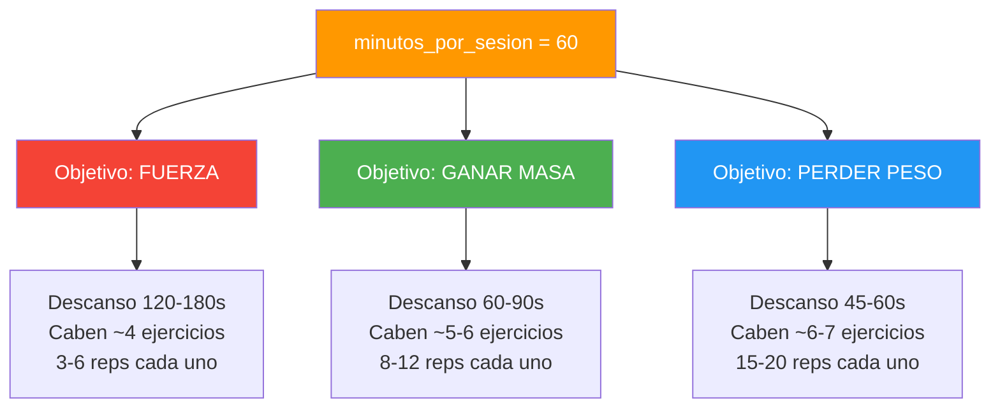

---

## 7. Todos los Factores que Influyen en la Recomendación

### 7.1 Factores del Perfil de Bienestar (10)

| # | Factor | Campo DB | Cómo Influye |
|---|--------|----------|--------------|
| 1 | **Edad** | `edad` | >50: ejercicios de bajo impacto, sin 1RM, calentamiento obligatorio. <18: técnica sobre carga, pesos moderados. |
| 2 | **Sexo** | `sexo` | Contexto general para la IA. |
| 3 | **Peso** | `peso_kg` | Cálculo de IMC y contexto de carga. |
| 4 | **Altura** | `altura_cm` | Cálculo de IMC. |
| 5 | **IMC** | `imc` (calculado) | 4 categorías con reglas de seguridad específicas (ver §7.4). |
| 6 | **Objetivo Principal** | `objetivo_principal` | Define rangos de reps, tiempos de descanso, tipo de ejercicios, RPE objetivo. |
| 7 | **Nivel Actividad** | `nivel_actividad` | sedentario/ligero/moderado/alto → volumen base sugerido. |
| 8 | **Equipamiento** | `equipamiento_disponible` | **Filtra el catálogo completo.** Solo se envían a Gemini los ejercicios compatibles. |
| 9 | **Días/Semana** | `dias_disponibles_semana` | Define la estructura semanal (1-7 días). |
| 10 | **Minutos/Sesión** | `minutos_por_sesion` | Determina cuántos ejercicios caben (10-180 min). |

### 7.2 Factores del Estado Diario (5)

| # | Factor | Campo DB | Cómo Influye |
|---|--------|----------|--------------|
| 11 | **Calidad Sueño** | `calidad_sueno` (1-5) | Si ≤2: evitar ejercicios de alta demanda neuromuscular. |
| 12 | **Nivel Estrés** | `nivel_estres` (1-5) | Contribuye al score de fatiga. |
| 13 | **Nivel Energía** | `nivel_energia` (1-5) | Si ≤2: priorizar movilidad y baja intensidad. |
| 14 | **Dolor Muscular** | `dolor_muscular` (1-5) | Reduce volumen si está elevado. |
| 15 | **Zonas con Dolor** | `zonas_dolor` (text[]) | La IA sustituye ejercicios que trabajen esas zonas. |

### 7.3 Factores del Historial de Entrenamiento (7)

| # | Factor | Campo/Fuente | Cómo Influye |
|---|--------|-------------|--------------|
| 16 | **Total Sesiones** | Agregado `sesiones_registradas` | Contexto de experiencia del usuario. |
| 17 | **RPE Promedio** | Agregado `sesiones_registradas.rpe` | Si >8.0: alerta de sobre-entrenamiento. |
| 18 | **Volumen Semanal** | Calculado `peso × reps` | Para periodización y progresión. |
| 19 | **Días Completados** | Agregado última semana | Mide adherencia real. |
| 20 | **Semanas Consecutivas** | Calculado por fechas | Si ≥4 + RPE>8 = requiere descarga. |
| 21 | **Requiere Descarga** | `requiereDescarga` (bool) | Fuerza semana inicial de descarga. |
| 22 | **Historial Ejercicios** | `series_sesion` JOIN `ejercicios` | Para sobrecarga progresiva (peso, reps, RPE por ejercicio). |

### 7.4 Factores Académicos y Energéticos (6 — NUEVOS v5.0)

| # | Factor | Provider | Cómo Influye |
|---|--------|----------|--------------|
| 23 | **Horas Estudio Reales** | `cargaAcademicaSemanalProvider` | `_calcularFCT()` pondera 25% de la carga total |
| 24 | **Nivel Estrés Académico** | `cargaAcademicaSemanalProvider` | `_calcularFCT()` pondera 25% |
| 25 | **Evaluaciones Semana** | `cargaAcademicaSemanalProvider` | `_calcularFCT()` pondera 15% |
| 26 | **Exámenes Próximos** | `contextoAcademicoProvider` (consulta `entregas_examenes`) | Activa modo exámenes: volumen ×0.70, +30s descanso |
| 27 | **Adherencia Académica** | `adherenciaAcademicaProvider` (0-100) | Informa a Gemini sobre disciplina del usuario. NO castiga por dormir mal. |
| 28 | **Estado Energético** | `estadoEnergeticoProvider` (0-100) | Gates no lineales: <30→×0.40 volumen, <50→×0.75 |

**Cálculo de `adherenciaAcademicaProvider` (0-100):**
- `cumplimientoHoras` (60%): `horasEstudioReales / horasEstudioPlaneadas`
- `completitudTareas` (30%): `entregas_completadas / total_entregas`
- `rachaDias` (10%): `diasUnicosEstudio / 7`

**Cálculo de `estadoEnergeticoProvider` (0-100):**
- Base lineal: `energía×0.30 + sueño×0.25 + recuperación×0.20 + cognitiva×0.15 + estrés×0.10`
- 3 gates no lineales: sueño≤1→×0.40, dolor≥4→×0.60, energía≤1→×0.50
- Previene falsos positivos como "energía=75 con sueño=0"

### 7.5 Factores de la Rutina (5)

| # | Factor | Tipo | Cómo Influye |
|---|--------|------|--------------|
| 29 | **Nombre Rutina** | Input usuario | Contexto semántico para la IA. |
| 30 | **Objetivo Rutina** | Selección usuario | Puede diferir del objetivo principal del perfil. |
| 31 | **Duración Semanas** | Input usuario | Define la periodización exacta. |
| 32 | **Días/Semana** | Input usuario | Puede diferir del perfil. |
| 33 | **Ejercicios Ya Agregados** | Estado actual del editor | La IA no repite ejercicios ya existentes en el día. |

### 7.6 Reglas de Seguridad por IMC y Edad

| Condición | Regla en el Prompt |
|-----------|-------------------|
| IMC > 30 | Priorizar **bajo impacto** articular. Evitar plyométricos. Evitar carga excesiva en rodillas y lumbar. |
| IMC 25-30 | Moderar ejercicios de alto impacto. Buena técnica ante todo. |
| IMC < 18.5 | Evitar déficit calórico extremo. Priorizar **ganancia de masa muscular**. |
| Edad > 50 | Sin 1RM. Rangos 8-15 reps. **Calentamiento articular 5-10 min obligatorio.** |
| Edad < 18 | **Técnica sobre carga.** Evitar pesos máximos. Enfásis en peso corporal. |

### 7.7 Reglas de Programación por Objetivo

| Objetivo | Ejercicios/Día | Reps | Descanso | Peso | RPE |
|----------|---------------|------|----------|------|-----|
| `perder_peso` | 3-4 (circuito) | 15-20 | 45-60s | Moderado | 6-8 |
| `ganar_masa` | 4-5 | 8-12 | 60-90s | Moderado-alto | 7-9 |
| `fuerza` | 3-4 (compuestos) | 3-6 | 120-180s | Alto | 8-9.5 |
| `resistencia` | 5-6 | 15-25 | 30-45s | Bajo-moderado | 5-7 |
| `movilidad` | Variable | 12-15 | 45-60s | Corporal/ligero | 4-6 |
| `fitness_general` | 4-5 | 10-12 | 60-90s | Moderado | 6-8 |

---

## 8. Sistema de Periodización y Detección de Fatiga

### 8.1 Algoritmo de Periodización (`_calcularTipoSemana`)

Cada semana de la rutina recibe automáticamente un tipo al guardarse:

```
rutina_provider.dart:875

_calcularTipoSemana(semanaNum, totalSemanas):
  si totalSemanas ≤ 1 → 'carga'
  si semanaNum == 1  → 'adaptacion'
  si semanaNum == totalSemanas y totalSemanas ≥ 4 → 'descarga'
  si semanaNum == totalSemanas y totalSemanas ≥ 3 → 'pico'
  resto → 'carga'
```

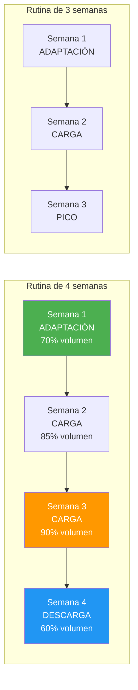

### 8.2 Detección de Fatiga Diaria

El check-in diario alimenta un score compuesto:

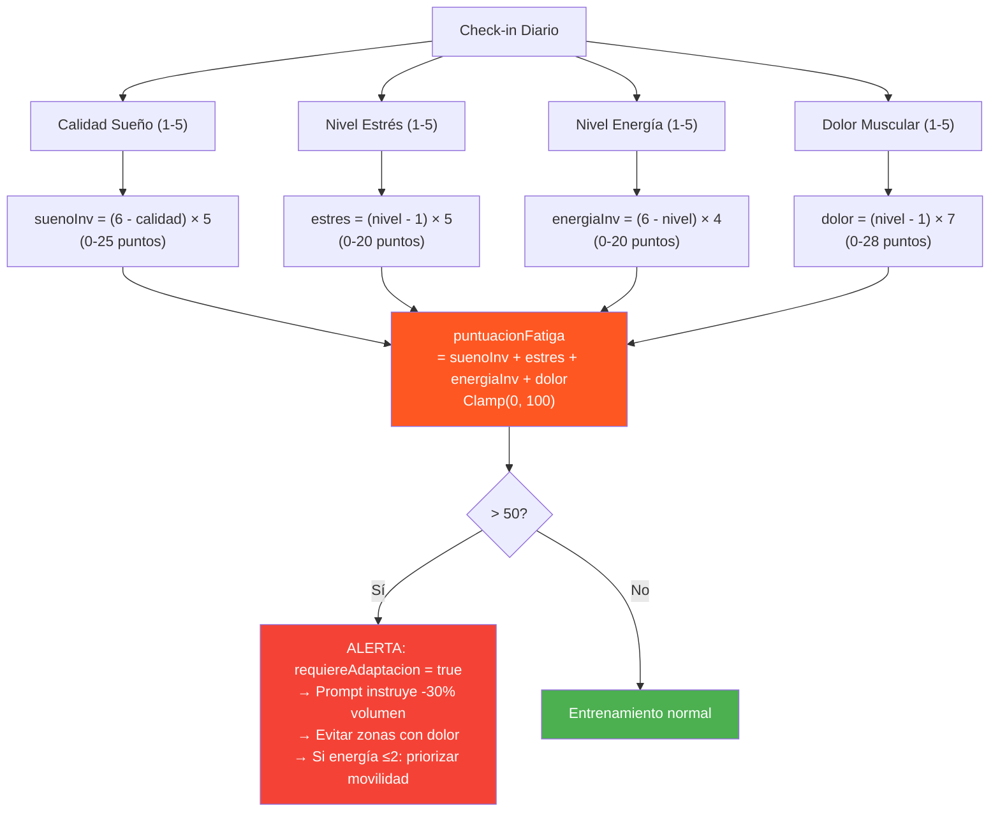

### 8.3 Detección de Sobre-entrenamiento (Periodización)

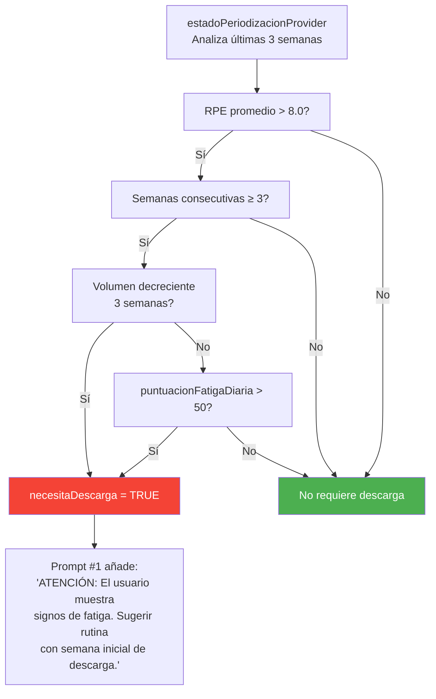

---

## 9. Flujo de Guardado en Base de Datos

### 9.1 Encadenamiento de INSERTs

Cuando el usuario presiona "Crear rutina", se ejecuta `crearRutinaCompleta()`
en `rutina_provider.dart:439`. Las inserciones son **secuenciales**
(no en paralelo) porque cada una depende del `id` generado por la anterior:

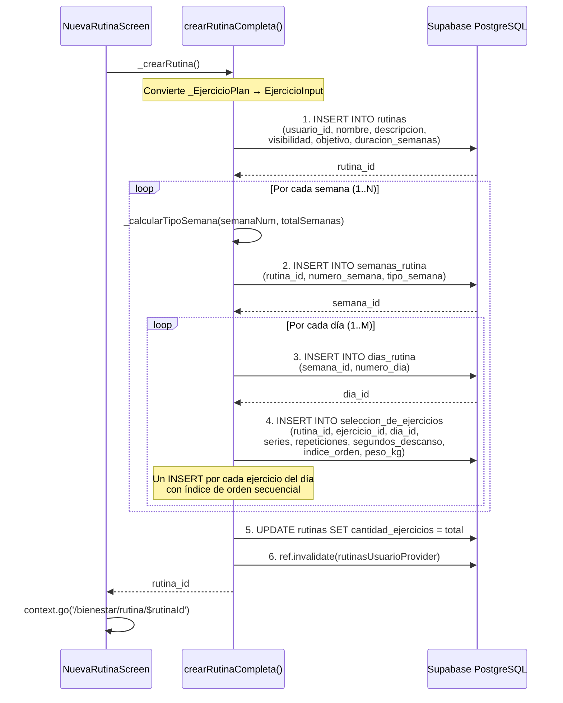

### 9.2 Estructura Jerárquica de Datos

```
rutinas (1)
├── id: UUID
├── usuario_id: FK → auth.users
├── nombre: "Rutina de Fuerza"
├── objetivo: "fuerza"
├── duracion_semanas: 4
├── cantidad_ejercicios: 48
│
├── semanas_rutina (N)
│   ├── semana_id: UUID
│   ├── numero_semana: 1
│   ├── tipo_semana: "adaptacion" | "carga" | "pico" | "descarga"
│   │
│   ├── dias_rutina (M)
│   │   ├── dia_id: UUID
│   │   ├── numero_dia: 1
│   │   │
│   │   ├── seleccion_de_ejercicios (K)
│   │   │   ├── ejercicio_id: FK → ejercicios
│   │   │   ├── series: 3
│   │   │   ├── repeticiones: 10
│   │   │   ├── segundos_descanso: 90
│   │   │   ├── indice_orden: 1
│   │   │   └── peso_kg: null | 22.5
```

---

## 10. Mapeo de Respuestas de IA a Datos Reales

La IA devuelve `exerciseDbId` (string), que es un identificador del catálogo
externo de ejercicios (ExerciseDB). El código debe hacer un match con el UUID
real de la tabla `ejercicios`:

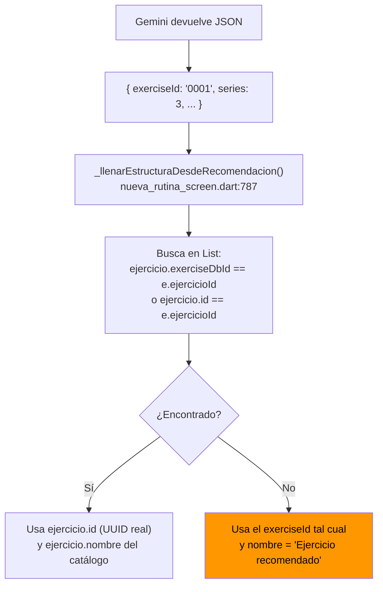

**⚠ Limitación:** Si Gemini devuelve un `exerciseId` que no existe en el
catálogo, el ejercicio se guarda con el ID incorrecto y nombre genérico.

---

## 11. Seguimiento Semanal de Bienestar (Feedback Loop)

El sistema también incluye un provider de seguimiento semanal que no alimenta
directamente a la IA, pero proporciona feedback al usuario sobre su adherencia:

```
bienestar_semanal_provider.dart

BienestarSemanalDto:
  - plan: PlanEntrenamientoSemanalDb?     ← plan creado desde el perfil
  - sesionesCompletadas: int              ← COUNT de sesiones_registradas esta semana
  - sesionesPlanificadas: int             ← plan.sesiones_planificadas
  - cumplimiento: double                  ← sesionesCompletadas / sesionesPlanificadas
  - cumplimientoAnterior: double          ← comparación con semana anterior
  - tendencia: "Mejorando" | "Estable" | "Bajando"
  - proximaAccion: String                 ← sugerencia textual según cumplimiento
```

---

## 12. Manejo de Errores y Cancelación

### 12.1 Cancelación Manual por el Usuario

Desde la versión 3.3, los 3 botones de recomendación IA incluyen un botón de
**"Cancelar"** visible durante la carga. El usuario puede interrumpir la llamada
a Gemini en cualquier momento antes de recibir respuesta:

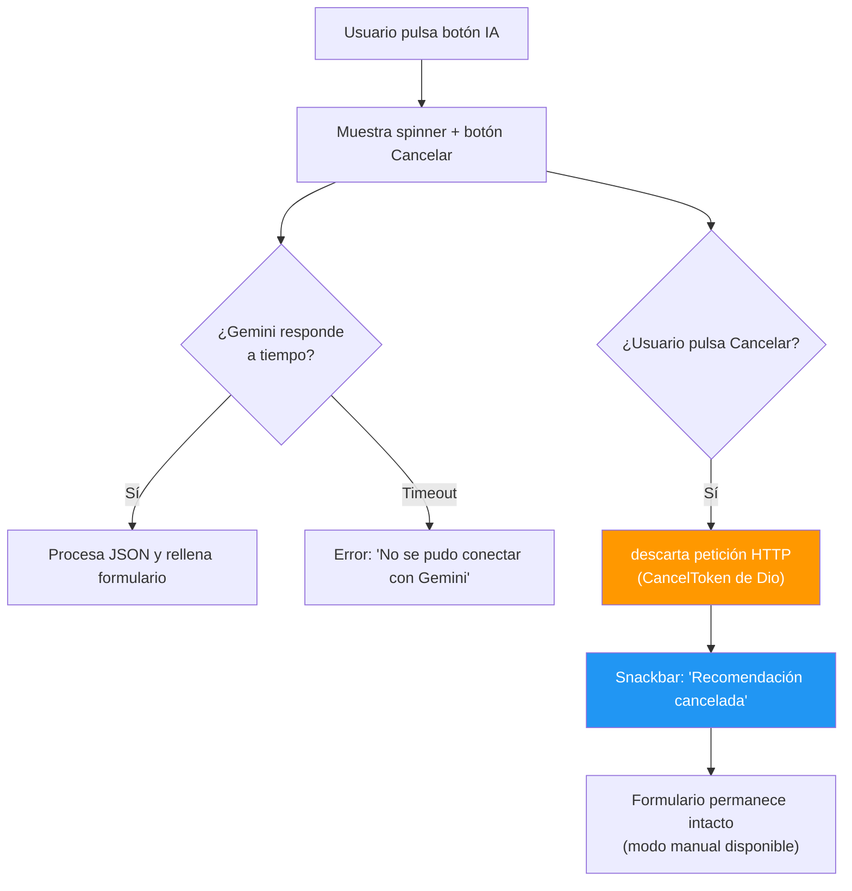

**Implementación técnica:**
- `_callGemini()` recibe un `CancelToken` opcional de `dio`.
- Cada método de recomendación (`_recomendarRutina`, `_recomendarEjercicios`, `_sugerirEjerciciosIA`) crea su propio `CancelToken`.
- Al pulsar "Cancelar", se llama a `cancelToken.cancel()` y se limpia el estado `_cargandoRecomendacion`.
- El botón de cancelar usa un `TextButton` con icono `Icons.close` y texto "Cancelar", visible solo cuando `_cargandoRecomendacion == true`.

### 12.2 Errores en el Servicio de IA

| Tipo de Error | Causa | Mensaje al Usuario |
|---------------|-------|-------------------|
| API Key vacía | `.env` sin `GEMINI_API_KEY` | "Falta GEMINI_API_KEY en el archivo .env" |
| Perfil sin completar | `perfilBienestarProvider` devuelve null | "Completa tu perfil de bienestar para recibir recomendaciones" |
| Sin ejercicios compatibles | Equipamiento no tiene ejercicios | "No hay ejercicios compatibles con tu equipamiento (X, Y)" |
| Gemini auth error | API key inválida (HTTP 400/401/403) | "Error de autenticación con Gemini. Revisa GEMINI_API_KEY." |
| Gemini connection error | Sin internet / timeout | "No se pudo conectar con Gemini en este momento." |
| Gemini sin respuesta | JSON vacío o candidates[] vacío | "Gemini no devolvió respuesta válida" |
| JSON mal formado | Gemini devolvió texto no-JSON | "Gemini generó una respuesta con formato no válido. Inténtalo de nuevo." |
| Sin ejercicios generados | Array vacío en respuesta válida | "Gemini no generó ejercicios válidos" / "La IA no generó ejercicios. Intenta de nuevo." |
| **Usuario cancela** | **CancelToken cancelado por el usuario** | **"Recomendación cancelada" (snackbar informativo, sin penalización)** |

### 12.3 Extracción Robusta de JSON

El método `_extraerJson()` (`recomendacion_ia_service.dart:822`) maneja
múltiples formatos de respuesta de Gemini:

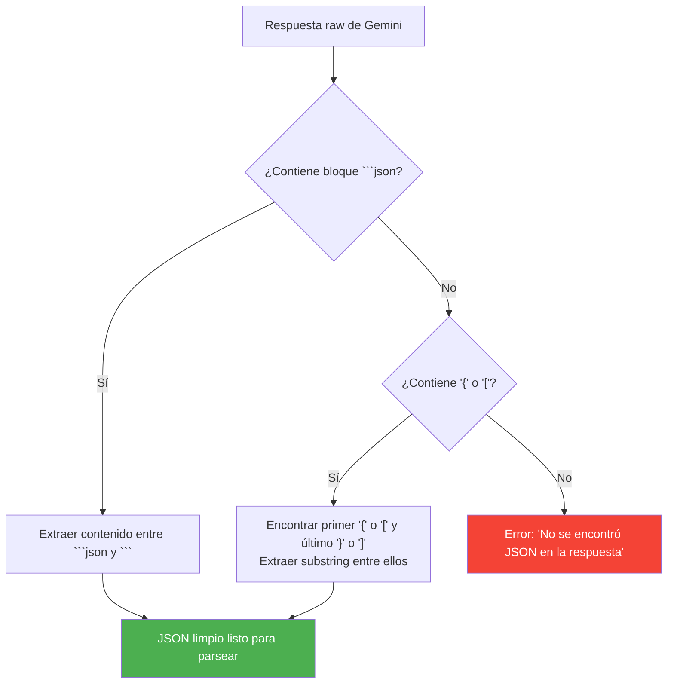

### 12.4 Validación de Ejercicios por Equipamiento

Antes de enviar cualquier prompt, el código filtra el catálogo de ejercicios
para incluir SOLO los compatibles con el equipamiento del usuario:

```
_ejercicioUsaEquipamiento(ejercicio, equipamientoUsuario):
  - peso_corporal siempre es compatible
  - Compara cada equipamiento del ejercicio contra cada equipamiento del usuario
  - Usa mapeo de equivalencias:
    mancuerna ↔ mancuernas
    barra ↔ barra
    polea ↔ polea
    máquina ↔ maquina
    banda_elastica ↔ banda de resistencia
    kettlebell ↔ pesa rusa
```

---

## 13. Selector Manual de Ejercicios

Además de la IA, el usuario puede añadir ejercicios manualmente mediante un
buscador en `_BuscadorEjerciciosSheet`:

```
DiaEditorCard → Botón "Añadir ejercicio" → BottomSheet
  → Buscador con filtros:
    - TextSearch (nombre/descripción)
    - Por parte del cuerpo
    - Por músculo objetivo/secundario
    - Por equipamiento
  → Muestra resultados de v_ejercicios_completos (view denormalizado)
  → Al seleccionar: añade con 3×10×90s por defecto
  → Usuario puede ajustar series/reps/descanso/peso en el editor
```

---

## 14. Diagrama de Arquitectura de Providers (Riverpod — v5.0)

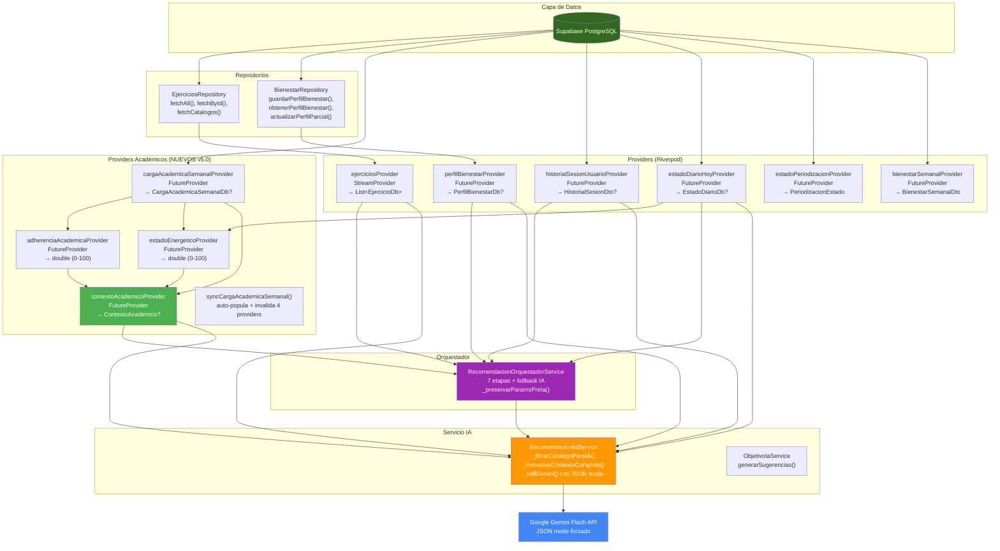

---

## 15. Referencias en el Código Fuente (v5.0)

| Archivo | Líneas Clave | Propósito |
|---------|-------------|-----------|
| `app/lib/shared/utils/string_utils.dart` | 1-63 | **★ Fase 0:** `finalidadesEstandar` (7 valores) + `sanitizarObjetivo()` — fuente única de verdad |
| `app/lib/features/bienestar/infrastructure/parametros_objetivo.dart` | 1-196 | **★ Fase 1:** `ParametrosObjetivo` — tabla de 7 entradas calibrada contra dataset |
| `app/lib/features/bienestar/infrastructure/recomendacion_reglas_service.dart` | 1-710 | **★ Fase 2:** Motor de reglas determinista — split, scoring, selección balanceada, `_toInput()` con params por modalidad |
| `app/lib/features/bienestar/infrastructure/recomendacion_contexto_service.dart` | 1-381 | **★ Fase 3:** Capa de contexto — `ContextoAcademico` con `adherenciaAcademica` y `estadoEnergetico`, FCT, modo exámenes, racha, fatiga, `calcularAjustes()` con gates energéticos |
| `app/lib/features/bienestar/infrastructure/progresion_calculator.dart` | 1-380 | **★ Fase 4:** Sobrecarga progresiva — 1RM, pesos por serie, degradación, progresión isométrica (`nuevoTiempoIsometricoSegundos`) |
| `app/lib/features/bienestar/infrastructure/transicion_objetivo_service.dart` | 1-155 | **★ Fase 5:** Transición entre objetivos — interpolación en 3 fases |
| `app/lib/features/bienestar/infrastructure/recomendacion_ia_service.dart` | 1-1357 | **★ Fase 6:** `refinarRutina()` + `_filtrarCatalogoParaIA()` (top 60) + `_formatearContextoCompleto()` + `_callGemini()` con JSON mode + `_validarEjercicio()` extendida |
| `app/lib/features/bienestar/infrastructure/feedback_engine.dart` | 1-130 | **★ Fase 7:** Feedback post-sesión — degradación dinámica, inactividad |
| `app/lib/features/bienestar/infrastructure/recomendacion_orquestador_service.dart` | 1-412 | **★ Fase 8:** Orquestador del pipeline — 7 etapas, `_preservarParamsPreIa()`, fallback cuando IA no disponible |
| `app/lib/features/bienestar/application/rutina_provider.dart` | — | **★ Fase 9:** `geminiApiKeyProvider`, `recomendacionOrquestadorProvider`, `generarRutinaProvider` (Future.wait paralelo), `cargaAcademicaSemanalProvider`, `adherenciaAcademicaProvider`, `estadoEnergeticoProvider`, `contextoAcademicoProvider`, `syncCargaAcademicaSemanal()` |
| `app/lib/features/bienestar/presentation/nueva_rutina_screen.dart` | — | **★ Fase 9:** Botones "⚡ Generar rápida" + "✨ Recomendar con IA", llama a `syncCargaAcademicaSemanal()` antes de recomendar |
| `app/lib/shared/models/db_models.dart` | 1188-1238 | **★ Modelo:** `CargaAcademicaSemanalDb` — mapea tabla `carga_academica_semanal` |
| `app/lib/shared/widgets/metric_gauge.dart` | 1-248 | **★ Widget:** `MetricGauge` — CustomPainter con arco animado 1200ms, usado en dashboard para adherencia/energía/estudio |
| `supabase/migrations/202606060046_historial_objetivos.sql` | 1-30 | **★ Fase 5:** Tabla `historial_objetivos` con RLS |
| `supabase/migrations/202606060047_failed_reps.sql` | 1-6 | **★ Fase 7:** Columna `failed_reps` en `series_sesion` |
| `supabase/migrations/202606060048_recomendaciones_pendientes.sql` | 1-30 | **★ Fase 7:** Tabla `recomendaciones_pendientes` con RLS |
| `supabase/migrations/20260606_0049_func_daily_recommendations.sql` | 1-101 | **★ Fase 10:** Función `generar_recomendaciones_diarias()` + `pg_cron` |

---

## 16. Limitaciones y Consideraciones Técnicas (v5.0)

### 16.1 Determinismo del Motor de Reglas

- El pipeline determinista (Fases 0-5) produce resultados **reproducibles**: mismo perfil → misma estructura.
- La variabilidad solo se introduce en la Fase 6 (refinamiento IA), que es opcional.
- Sin API key de Gemini, el sistema funciona completamente con el motor de reglas.

### 16.2 Validación Post-IA Robusta

- `_validarEjercicio()` implementa validación extendida con rangos para los 7 parámetros.
- Si Gemini devuelve un ejercicio con equipamiento incompatible → se revierte al original.
- Si Gemini devuelve un `ejercicioId` inexistente → se revierte al original.
- `_preservarParamsPreIa()` garantiza que duración, distancia e isométrico no se pierdan tras refinamiento IA.
- **Ya no se aceptan ejercicios inválidos** (corregido respecto a v3.x).

### 16.3 Rendimiento

- **Paralelización**: `Future.wait` carga 4 providers simultáneamente (redujo 24s → 12s).
- Pipeline determinista: **~3 segundos** (con queries paralelizadas).
- Refinamiento IA: **~9 segundos adicionales** (1 llamada a Gemini con timeout 30s).
- **JSON mode** reduce fallos de parsing y re-intentos.
- **Catálogo inteligente**: ~200KB → ~15KB enviados a Gemini (token savings significativos).
- Las inserciones en BD siguen siendo secuenciales (no en batch).

### 16.4 Integración Académica

- `syncCargaAcademicaSemanal()` se ejecuta antes de cada recomendación para datos frescos.
- `adherenciaAcademicaProvider` (0-100) mide disciplina pura sin penalizar por biometrías.
- `estadoEnergeticoProvider` (0-100) usa gates no lineales para evitar falsos positivos.
- `ContextoAcademico` se pasa como objeto tipado al orquestador y a Gemini vía `_formatearContextoCompleto()`.

### 16.5 Calibración contra Dataset Real

- `ParametrosObjetivo` está calibrado contra `dataset_final.json` (682 ejercicios, 7 finalidades).
- Las modalidades, finalidades de ejercicio y volúmenes semanales reflejan la distribución real del dataset.
- Para futuras expansiones del catálogo, solo hay que actualizar una tabla de 7 entradas.

### 16.6 Seguridad de la API Key

- `GEMINI_API_KEY` se lee de `.env` en cliente Flutter.
- Solo se usa en la Fase 6 (refinamiento), que es opcional.
- Sin API key, el sistema funciona con el motor de reglas determinista.

---

## 17. Resumen Visual del Sistema Completo

```
╔═══════════════════════════════════════════════════════════════════════════════╗
║                    SYNAPTIXFIT — IA RECOMMENDATION SYSTEM                     ║
╠═══════════════════════════════════════════════════════════════════════════════╣
║                                                                               ║
║  ┌─ ONBOARDING ──────────────────────────────────────────────────────────┐  ║
║  │ PerfilFisicoScreen (4 pasos) → PerfilBienestarDb                       │  ║
║  │  ├─ edad, sexo, ciudad                                                 │  ║
║  │  ├─ peso, altura → IMC                                                 │  ║
║  │  ├─ nivelActividad, objetivoPrincipal                                  │  ║
║  │  │   └─ ObjetivoIaService → 5 sugerencias IA                           │  ║
║  │  └─ diasDisponiblesSemana, minutosPorSesion, equipamientoDisponible    │  ║
║  └────────────────────────────────────────────────────────────────────────┘  ║
║                                      │                                        ║
║                                      ▼                                        ║
║  ┌─ CHECK-IN DIARIO ──────────────────────────────────────────────────────┐  ║
║  │ SesionEnVivoScreen → EstadoDiarioDb                                    │  ║
║  │  ├─ calidadSueno (1-5)                                                 │  ║
║  │  ├─ nivelEstres (1-5)                                                  │  ║
║  │  ├─ nivelEnergia (1-5)                                                 │  ║
║  │  ├─ dolorMuscular (1-5)                                                │  ║
║  │  ├─ zonasDolor (text[])                                                │  ║
║  │  └─ puntuacionFatiga (0-100) → requiereAdaptacion si > 50              │  ║
║  └────────────────────────────────────────────────────────────────────────┘  ║
║                                      │                                        │  ║
║                                      ▼                                        │  ║
║  ┌─ CREACIÓN DE RUTINA (v5.0 — Pipeline Híbrido) ───────────────────────┐  ║
║  │ NuevaRutinaScreen                                                      │  ║
║  │                                                                         │  ║
║  │  Paso 1: Metadatos                                                     │  ║
║  │  ┌──────────────────────────────────────────────────────────────┐     │  ║
║  │  │ ⚡ "Generar rutina rápida" (FilledButton, siempre visible)     │     │  ║
║  │  │   → RecomendacionOrquestadorService.generarRutina(usarIa:false)│    │  ║
║  │  │   → Pipeline determinista (Fases 0-5, 7 etapas, <2s)          │     │  ║
║  │  │   → Resultado: estructura completa validada                   │     │  ║
║  │  │                                                                │     │  ║
║  │  │ ✨ "Recomendar rutina con IA" (OutlinedButton, con API key)    │     │  ║
║  │  │   → RecomendacionOrquestadorService.generarRutina(usarIa:true) │     │  ║
║  │  │   → Pipeline + refinarRutina() con Gemini (Fase 6)            │     │  ║
║  │  │   → Gemini mejora nombres, varía 1-2 ejercicios/día, reordena │     │  ║
║  │  └──────────────────────────────────────────────────────────────┘     │  ║
║  │                                                                         │  ║
║  │  Paso 2: Ejercicios (editor semana×día) — relleno automático           │  ║
║  │  Paso 3: Revisión → "Crear rutina"                                     │  ║
║  │   → crearRutinaCompleta() → 4 tablas en cascada                        │  ║
║  │   → _calcularTipoSemana() asigna tipo a cada semana                    │  ║
║  └────────────────────────────────────────────────────────────────────────┘  ║
║                                                                               ║
║  ┌─ POST-CREACIÓN ───────────────────────────────────────────────────────┐  ║
║  │ RutinaDetalleScreen → gestión de rutina existente                      │  ║
║  │ SesionEnVivoScreen → entrenamiento en vivo + registro de series        │  ║
║  │   → iniciarSesion() → finalizarSesion(rpe, duracion) → registrarSerie()│  ║
║  │                                                                         │  ║
║  │ Feedback Post-Sesión (Fase 7):                                          │  ║
║  │   → FeedbackEngine.procesarSesion()                                     │  ║
║  │   → Degradación dinámica basada en failed_reps                          │  ║
║  │   → Inserta en recomendaciones_pendientes                               │  ║
║  │                                                                         │  ║
║  │ Job Nocturno (Fase 10):                                                 │  ║
║  │   → pg_cron ejecuta generar_recomendaciones_diarias() a las 2 AM       │  ║
║  │   → Detecta inactividad 7-30 días y fatiga alta                         │  ║
║  └────────────────────────────────────────────────────────────────────────┘  ║
║                                                                               ║
╚═══════════════════════════════════════════════════════════════════════════════╝
```

---

*Documento generado automáticamente a partir del análisis del código fuente
(12-05-2026). Actualizado 07-06-2026 con Motor de Recomendaciones (Fases 0-10). Para consultar cambios o ampliar secciones, referirse a los
archivos listados en §15.*

---

## 18. Smart Banner: Consejo IA en Dashboard (v6.0)

### 18.1 Diferencias con el pipeline de rutinas

| Característica | Smart Banner | Pipeline Rutinas |
|---------------|-------------|-----------------|
| Prompt | ~1500 chars | ~15000 chars |
| Timeout | 8 segundos | 30 segundos |
| JSON mode | No | Sí |
| Catálogo | No usa | Top 60 ejercicios |
| Contexto | Energía + adherencia + carga | Contexto académico completo |
| Respuesta | Texto libre (1-2 frases) | JSON estructurado |
| Cache | Hive, TTL 1 hora | Sin cache |

### 18.2 Flujo

```
consejoSmartProvider
  ├─ Verifica cache Hive ('smartcache', key = 'smart_banner_{userId}')
  │   └─ Si válido (<1h) → retorna cache
  ├─ ¿Gemini API key configurada?
  │   ├─ Sí → geminiServiceProvider.generarTexto(apiKey, prompt)
  │   │   ├─ Éxito → cachea en Hive → retorna consejo
  │   │   └─ Error/timeout 8s → _generarFallback()
  │   └─ No → _generarFallback()
  └─ _generarFallback(): 5 reglas deterministas basadas en energía/estrés/racha
```

### 18.3 Servicio compartido

`geminiServiceProvider` expone una instancia única de `RecomendacionIaService` para todo el app. El método `generarTexto(apiKey, prompt)` envuelve `_callGemini()` y retorna texto plano.
