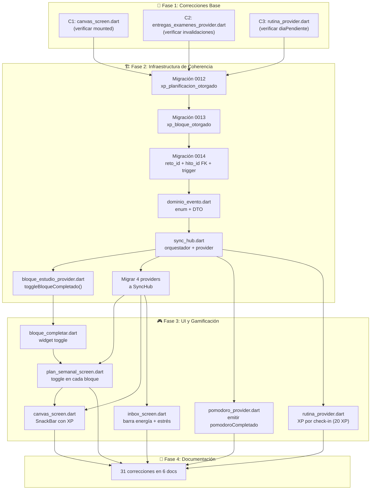
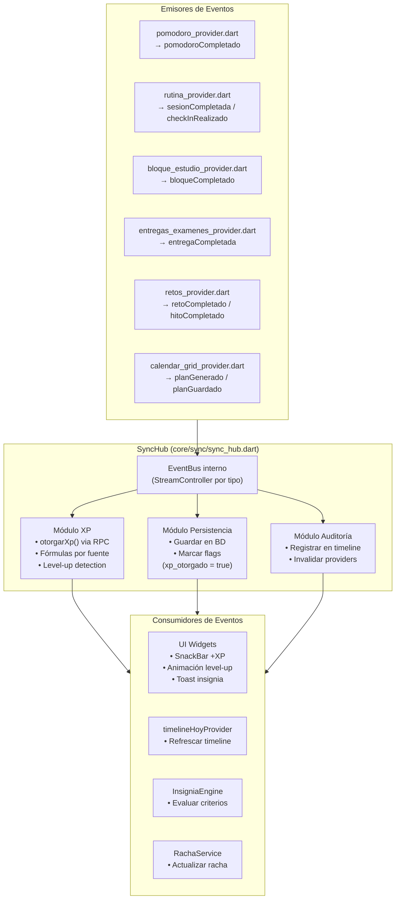
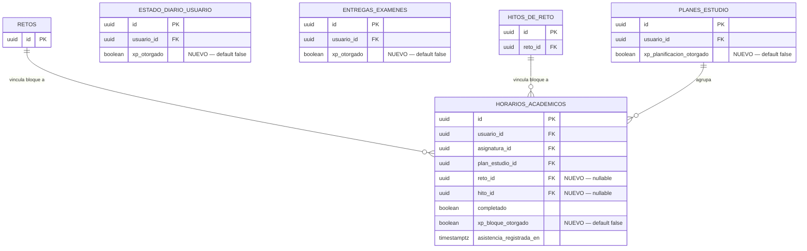
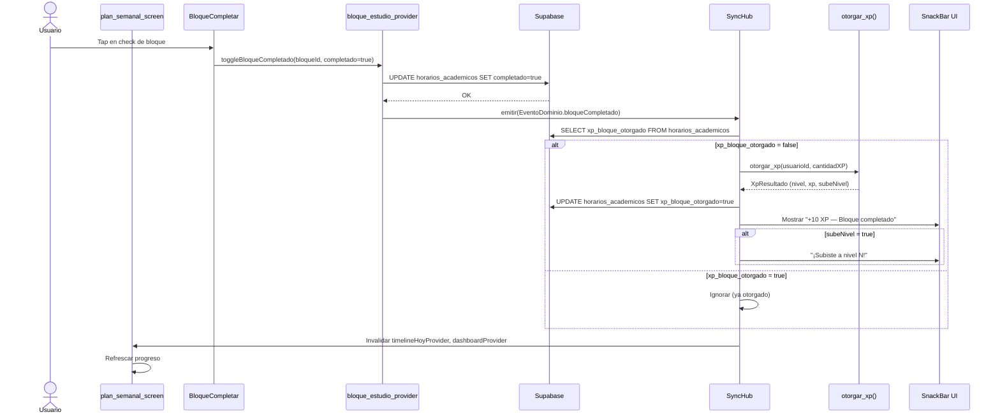

# 19 — Plan de Coherencia y Gamificación (v7.0)

**Versión:** 1.0  
**Fecha:** 17-06-2026  
**Estado:** DISEÑO APROBADO — Pendiente de implementación  
**Propósito:** Plan maestro consolidado que fusiona 4 fases (Correcciones Base → Infraestructura de Coherencia → UI y Gamificación → Documentación) para dotar al sistema de un mecanismo unificado de eventos, XP transversal, y feedback gamificado en todas las superficies de la app.

---

## Resumen Ejecutivo

| Métrica | Valor |
|---------|-------|
| Total archivos a **crear** | 7 |
| Total archivos a **modificar** | 16 |
| Total migraciones **nuevas** | 3 |
| Total docs a **corregir** | 31 cambios en 6 archivos |
| Total líneas estimadas | ~1,900 |
| Tiempo estimado total | ~16 horas |

---

## Diagrama de Dependencias (DAG de Implementación)



---

## Diagrama de Arquitectura del SyncHub



---

## Fase 1 — Correcciones Base (verificar estado)

> **NOTA:** El corrector (`flutter analyze`) verificará si estas 3 correcciones ya están aplicadas. Si no lo están, deben ser las primeras acciones antes de cualquier feature nueva.

### Acción 1.1 — Verificar `canvas_screen.dart`

| Campo | Detalle |
|-------|---------|
| **Archivo** | `app/lib/features/academico/presentation/canvas_screen.dart` |
| **Tipo** | Modificado (corrección) |
| **Depende de** | Ninguna |
| **Esfuerzo** | ~5 líneas |
| **Resultado esperado** | El método `_autocompletar()` verifica `mounted` antes de llamar a `notifier.applyAISuggestions()` para evitar `setState()` en widget no montado. |

**Descripción:** El callback `_autocompletar()` es `async` y el `notifier.applyAISuggestions()` se llama dentro de un `if (mounted)` que ya existe (línea 105). Verificar que el `mounted` check cubra también el caso de navegación rápida hacia atrás mientras la IA está generando.

### Acción 1.2 — Verificar `entregas_examenes_provider.dart`

| Campo | Detalle |
|-------|---------|
| **Archivo** | `app/lib/features/academico/application/entregas_examenes_provider.dart` |
| **Tipo** | Modificado (corrección) |
| **Depende de** | Ninguna |
| **Esfuerzo** | ~3 líneas |
| **Resultado esperado** | `toggleEntregaCompletada()` invalida también `entregasPendientesProvider` además de `timelineHoyProvider`. |

**Descripción:** Actualmente `toggleEntregaCompletada()` solo invalida `timelineHoyProvider` (línea 149). Debe invalidar también `entregasPendientesProvider` para que la lista de pendientes se refresque inmediatamente al marcar/desmarcar una entrega.

### Acción 1.3 — Verificar `rutina_provider.dart`

| Campo | Detalle |
|-------|---------|
| **Archivo** | `app/lib/features/bienestar/application/rutina_provider.dart` |
| **Tipo** | Modificado (corrección) |
| **Depende de** | Ninguna |
| **Esfuerzo** | ~5 líneas |
| **Resultado esperado** | `diaPendienteProvider` excluye correctamente los días cuyo estado ya es `'completado'` en BD, sin depender solo del estado local. |

**Descripción:** Verificar que el `diaPendienteProvider` (línea ~1292) consulta el estado real en BD (`dias_rutina.estado`) y no solo itera con datos cacheados. Si el trigger `trg_dias_rutina_estado` marca un día como completado por cascada, el provider debe reflejarlo sin necesidad de invalidación manual.

---

## Fase 2 — Infraestructura de Coherencia

### Acción 2.1 — Migración 0012: `xp_planificacion_otorgado` en `planes_estudio`

| Campo | Detalle |
|-------|---------|
| **Archivo** | `supabase/migrations/20260617000012_xp_planificacion_otorgado.sql` |
| **Tipo** | **Nuevo** |
| **Depende de** | Fase 1 completa |
| **Esfuerzo** | ~15 líneas SQL |
| **Resultado esperado** | Nueva columna `xp_planificacion_otorgado BOOLEAN NOT NULL DEFAULT false` en `planes_estudio`. Evita que se otorgue XP duplicado al guardar un plan. |

```sql
-- ============================================================
-- Migración 0012: Flag de XP otorgado en planes_estudio
-- Evita duplicación de XP al re-guardar un plan ya premiado
-- ============================================================

ALTER TABLE public.planes_estudio
  ADD COLUMN IF NOT EXISTS xp_planificacion_otorgado BOOLEAN NOT NULL DEFAULT false;

-- Política RLS: el owner puede leer su propio flag, pero solo el SyncHub
-- (via SECURITY DEFINER function) puede actualizarlo a true.
-- Ya existe "Owner access planes_estudio" → cubre SELECT/INSERT/DELETE.
-- Añadir política específica para UPDATE del flag por función RPC.
```

### Acción 2.2 — Migración 0013: `xp_bloque_otorgado` en `horarios_academicos`

| Campo | Detalle |
|-------|---------|
| **Archivo** | `supabase/migrations/20260617000013_xp_bloque_otorgado.sql` |
| **Tipo** | **Nuevo** |
| **Depende de** | 2.1 (0012) |
| **Esfuerzo** | ~20 líneas SQL |
| **Resultado esperado** | Nueva columna `xp_bloque_otorgado BOOLEAN NOT NULL DEFAULT false` en `horarios_academicos`. Cada bloque de estudio solo otorga XP una vez al ser completado. |

```sql
-- ============================================================
-- Migración 0013: Flag de XP otorgado por bloque completado
-- ============================================================

ALTER TABLE public.horarios_academicos
  ADD COLUMN IF NOT EXISTS xp_bloque_otorgado BOOLEAN NOT NULL DEFAULT false;

-- Índice para consultas rápidas del SyncHub (bloques completados sin XP)
CREATE INDEX IF NOT EXISTS idx_horarios_xp_pendiente
  ON public.horarios_academicos (usuario_id, completado, xp_bloque_otorgado)
  WHERE completado = true AND xp_bloque_otorgado = false;
```

### Acción 2.3 — Migración 0014: `reto_id` + `hito_id` FK + trigger en `horarios_academicos`

| Campo | Detalle |
|-------|---------|
| **Archivo** | `supabase/migrations/20260617000014_reto_bloque_fk.sql` |
| **Tipo** | **Nuevo** |
| **Depende de** | 2.2 (0013) |
| **Esfuerzo** | ~35 líneas SQL |
| **Resultado esperado** | Columnas `reto_id` y `hito_id` FK en `horarios_academicos` para vincular bloques de estudio a retos/hitos académicos. Trigger que al completar un bloque asociado a un hito, actualiza el progreso del hito automáticamente. |

```sql
-- ============================================================
-- Migración 0014: Vincular bloques de horario a retos e hitos
-- ============================================================

-- FK opcionales a retos e hitos
ALTER TABLE public.horarios_academicos
  ADD COLUMN IF NOT EXISTS reto_id UUID REFERENCES public.retos(id) ON DELETE SET NULL,
  ADD COLUMN IF NOT EXISTS hito_id UUID REFERENCES public.hitos_de_reto(id) ON DELETE SET NULL;

-- Índices para joins
CREATE INDEX IF NOT EXISTS idx_horarios_reto_id ON public.horarios_academicos(reto_id);
CREATE INDEX IF NOT EXISTS idx_horarios_hito_id ON public.horarios_academicos(hito_id);

-- Trigger: al completar un bloque vinculado a un hito académico,
-- incrementar progreso del hito automáticamente
CREATE OR REPLACE FUNCTION public.actualizar_progreso_hito_desde_bloque()
RETURNS TRIGGER
LANGUAGE plpgsql
SECURITY DEFINER
SET search_path = ''
AS $$
BEGIN
  -- Solo si el bloque se acaba de completar Y tiene hito vinculado
  IF NEW.completado = true AND OLD.completado = false AND NEW.hito_id IS NOT NULL THEN
    -- Incrementar progreso del hito en 1 unidad (1 bloque = 1 unidad de progreso)
    UPDATE public.hitos_de_reto
    SET progreso_actual = LEAST(progreso_actual + 1, porcentaje_peso),
        estado = CASE
          WHEN progreso_actual + 1 >= porcentaje_peso THEN 'completado'
          WHEN estado = 'bloqueado' THEN 'disponible'
          ELSE estado
        END
    WHERE id = NEW.hito_id;
  END IF;
  RETURN NEW;
END;
$$;

DROP TRIGGER IF EXISTS trg_bloque_hito_progreso ON public.horarios_academicos;
CREATE TRIGGER trg_bloque_hito_progreso
  AFTER UPDATE OF completado ON public.horarios_academicos
  FOR EACH ROW
  EXECUTE FUNCTION public.actualizar_progreso_hito_desde_bloque();
```

### Acción 2.4 — `dominio_evento.dart` (enum + DTO del sistema de eventos)

| Campo | Detalle |
|-------|---------|
| **Archivo** | `app/lib/core/sync/dominio_evento.dart` |
| **Tipo** | **Nuevo** |
| **Depende de** | 2.3 (0014) |
| **Esfuerzo** | ~80 líneas |
| **Resultado esperado** | Enum `TipoEventoDominio` con 8 valores y DTO `EventoDominio` inmutable con `id`, `tipo`, `usuarioId`, `datos`, `timestamp`. Base para todo el sistema de eventos. |

```dart
/// Tipos de eventos de dominio reconocidos por el SyncHub.
enum TipoEventoDominio {
  /// Un bloque de estudio fue marcado como completado.
  bloqueCompletado,

  /// Una entrega o examen fue marcado como completado.
  entregaCompletada,

  /// Una sesión de entrenamiento fue finalizada.
  sesionCompletada,

  /// El usuario realizó el check-in diario (estado físico).
  checkInRealizado,

  /// Un plan de estudio semanal fue generado/guardado.
  planGenerado,

  /// Un reto fue completado.
  retoCompletado,

  /// Un hito de reto fue completado.
  hitoCompletado,

  /// Un ciclo Pomodoro de estudio fue completado.
  pomodoroCompletado,
}

/// DTO inmutable que representa un evento de dominio.
class EventoDominio {
  final String id;
  final TipoEventoDominio tipo;
  final String usuarioId;
  final Map<String, dynamic> datos;
  final DateTime timestamp;

  const EventoDominio({
    required this.id,
    required this.tipo,
    required this.usuarioId,
    this.datos = const {},
    required this.timestamp,
  });

  /// Crea un evento con ID autogenerado y timestamp ahora.
  factory EventoDominio.ahora({
    required TipoEventoDominio tipo,
    required String usuarioId,
    Map<String, dynamic> datos = const {},
  }) {
    return EventoDominio(
      id: '${tipo.name}_${DateTime.now().microsecondsSinceEpoch}',
      tipo: tipo,
      usuarioId: usuarioId,
      datos: datos,
      timestamp: DateTime.now(),
    );
  }
}
```

### Acción 2.5 — `sync_hub.dart` (orquestador central + provider)

| Campo | Detalle |
|-------|---------|
| **Archivo** | `app/lib/core/sync/sync_hub.dart` |
| **Tipo** | **Nuevo** |
| **Depende de** | 2.4 (dominio_evento.dart) |
| **Esfuerzo** | ~200 líneas |
| **Resultado esperado** | `SyncHub` (singleton) con `StreamController` por tipo de evento, método `emitir(EventoDominio)`, procesamiento de XP vía RPC `otorgar_xp()`, invalidación automática de providers. Provider Riverpod `syncHubProvider`. |

**Responsabilidades del SyncHub:**
1. **Bus de eventos**: `StreamController<EventoDominio>` broadcast. Cada tipo de evento tiene su propio stream filtrado para consumidores selectivos.
2. **Motor XP**: Al recibir un evento, calcula XP según tabla de fórmulas, llama a RPC `otorgar_xp(p_usuario_id, p_cantidad_xp)`, y si `sube_nivel = true`, emite un evento secundario `nivelSubido`.
3. **Flags anti-duplicado**: Antes de otorgar XP por un bloque/plan/entrega, verifica el flag `xp_otorgado` en BD. Si ya fue otorgado, ignora el evento.
4. **Invalidación**: Después de procesar, invalida `timelineHoyProvider`, `dashboardProvider`, e `insigniasProvider` para refrescar UI.

**Tabla de XP por tipo de evento:**

| Tipo de Evento | XP Base | Fórmula | Flag anti-duplicado |
|---------------|---------|---------|---------------------|
| `bloqueCompletado` | 10 XP | `10 × (duraciónHoras).ceil()` | `horarios_academicos.xp_bloque_otorgado` |
| `entregaCompletada` | 25 XP | Fijo | `entregas_examenes.xp_otorgado` (nueva columna en 0014) |
| `sesionCompletada` | 50 XP | `50 + min(duraciónMin, 90) + (RPE × 5)` | Ya implementado en `finalizarSesion()` |
| `checkInRealizado` | 20 XP | Fijo (1 vez al día) | `estado_diario_usuario.xp_otorgado` (nueva columna en 0014) |
| `planGenerado` | 30 XP | Fijo | `planes_estudio.xp_planificacion_otorgado` |
| `retoCompletado` | 200-1300 XP | `100 × cantidadHitos + 300` (complejo) | Ya implementado |
| `pomodoroCompletado` | 5 XP | Fijo por cada ciclo 25min | Sin flag (acumulable, low stakes) |

### Acción 2.6 — `bloque_estudio_provider.dart` (toggle + emisión de evento)

| Campo | Detalle |
|-------|---------|
| **Archivo** | `app/lib/features/academico/application/bloque_estudio_provider.dart` |
| **Tipo** | **Nuevo** |
| **Depende de** | 2.5 (sync_hub.dart) |
| **Esfuerzo** | ~80 líneas |
| **Resultado esperado** | Provider con método `toggleBloqueCompletado(bloqueId, asignaturaId)` que actualiza el flag `completado` en `horarios_academicos`, verifica `xp_bloque_otorgado`, y emite `EventoDominio.bloqueCompletado` al SyncHub. |

```dart
/// Alterna el estado completado de un bloque de estudio y emite evento al SyncHub.
Future<void> toggleBloqueCompletado({
  required String bloqueId,
  required String asignaturaId,
  required bool completado,
  required WidgetRef ref,
}) async {
  final client = Supabase.instance.client;
  final user = client.auth.currentUser;
  if (user == null) return;

  await client
      .from('horarios_academicos')
      .update({
        'completado': completado,
        'asistencia_registrada_en': completado ? DateTime.now().toIso8601String() : null,
      })
      .eq('id', bloqueId)
      .eq('usuario_id', user.id);

  // Si se completó, emitir evento al SyncHub
  if (completado) {
    final hub = ref.read(syncHubProvider);
    hub.emitir(EventoDominio.ahora(
      tipo: TipoEventoDominio.bloqueCompletado,
      usuarioId: user.id,
      datos: {
        'bloqueId': bloqueId,
        'asignaturaId': asignaturaId,
        'tabla': 'horarios_academicos',
      },
    ));
  }

  // Invalidar providers afectados
  ref.invalidate(horariosSemanaActualProvider);
  ref.invalidate(timelineHoyProvider);
}
```

### Acción 2.7 — Migrar 4 providers existentes a SyncHub

| # | Archivo | Cambio | Depende de | Esfuerzo |
|---|---------|--------|------------|----------|
| 2.7a | `rutina_provider.dart` | `finalizarSesion()` → emitir `sesionCompletada` al SyncHub además de llamar a `otorgarXp()` directamente | 2.5 | ~15 líneas |
| 2.7b | `entregas_examenes_provider.dart` | `toggleEntregaCompletada()` → emitir `entregaCompletada` al SyncHub. Añadir columna `xp_otorgado` en flag. | 2.5 | ~10 líneas |
| 2.7c | `calendar_grid_provider.dart` | Método `guardarPlanEnBD()` → emitir `planGenerado` al SyncHub si `xp_planificacion_otorgado = false` | 2.5 | ~10 líneas |
| 2.7d | `retos_provider.dart` | `completarReto()` / `toggleTareaCompletada()` → emitir `retoCompletado` / `hitoCompletado` al SyncHub | 2.5 | ~15 líneas |

**Principio de migración:** Los providers existentes siguen funcionando igual. La emisión al SyncHub es **adicional**, no sustitutiva. Esto permite:
- Backward compatibility: el código que ya otorga XP directamente (`finalizarSesion()`, `completarReto()`) sigue funcionando.
- El SyncHub añade: invalidación centralizada, emisión de streams para UI, y flags anti-duplicado.
- En el futuro, se puede consolidar toda la lógica de XP en el SyncHub y eliminar las llamadas directas.

---

## Fase 3 — UI y Gamificación

### Acción 3.1 — Widget `bloque_completar.dart`

| Campo | Detalle |
|-------|---------|
| **Archivo** | `app/lib/features/academico/presentation/widgets/bloque_completar.dart` |
| **Tipo** | **Nuevo** |
| **Depende de** | 2.6 (bloque_estudio_provider.dart) |
| **Esfuerzo** | ~100 líneas |
| **Resultado esperado** | Widget reutilizable: `CheckboxListTile` o `IconButton` (toggle check/anillo) que consume `bloqueCompletadoProvider.family(bloqueId)` y llama a `toggleBloqueCompletado()`. Muestra un check animado verde cuando está completado. |

**Diseño:**
- **Estado pendiente:** Círculo vacío gris con borde.
- **Estado completado:** Círculo verde relleno con icono check blanco + micro-animación de escala (200ms `Curves.easeOutBack`).
- **Props:** `bloqueId`, `asignaturaId`, `completado` (valor inicial desde BD).
- **Tooltip:** "Marcar como completado" / "Desmarcar".

### Acción 3.2 — Modificar `plan_semanal_screen.dart`

| Campo | Detalle |
|-------|---------|
| **Archivo** | `app/lib/features/academico/presentation/plan_semanal_screen.dart` |
| **Tipo** | Modificado |
| **Depende de** | 3.1 (bloque_completar.dart) |
| **Esfuerzo** | ~30 líneas |
| **Resultado esperado** | Cada bloque en la vista de día del plan semanal incluye el widget `BloqueCompletar` a la derecha. Al hacer toggle, se emite el evento y se refrescan las barras de progreso. |

### Acción 3.3 — Modificar `canvas_screen.dart` (SnackBar con XP)

| Campo | Detalle |
|-------|---------|
| **Archivo** | `app/lib/features/academico/presentation/canvas_screen.dart` |
| **Tipo** | Modificado |
| **Depende de** | 2.5 (sync_hub.dart) |
| **Esfuerzo** | ~25 líneas |
| **Resultado esperado** | El canvas escucha el stream `syncHubProvider.enEvento(TipoEventoDominio.planGenerado)` y muestra un `SnackBar` con "+30 XP — Plan semanal creado". Si el plan ya tenía XP otorgado, no muestra nada. |

### Acción 3.4 — Modificar `inbox_screen.dart` (barra energía + estrés)

| Campo | Detalle |
|-------|---------|
| **Archivo** | `app/lib/features/academico/presentation/inbox_screen.dart` |
| **Tipo** | Modificado |
| **Depende de** | 2.5 (sync_hub.dart) |
| **Esfuerzo** | ~60 líneas |
| **Resultado esperado** | Nueva sección en la parte superior del inbox (debajo del título) que muestra: 
- **Barra de energía:** `LinearProgressIndicator` coloreado (verde→amarillo→rojo) basado en `estadoDiarioHoyProvider.nivelEnergia`.
- **Barra de estrés:** `LinearProgressIndicator` coloreado inverso (rojo→amarillo→verde, porque menos estrés = mejor) basado en `estadoDiarioHoyProvider.nivelEstres`.
- **Tooltip:** "Tu energía y estrés hoy — afectan la carga recomendada".
- Condición: solo se muestra si existe check-in hoy (`estadoDiarioHoyProvider != null`). |

### Acción 3.5 — Modificar `pomodoro_provider.dart` (emitir pomodoroCompletado)

| Campo | Detalle |
|-------|---------|
| **Archivo** | `app/lib/features/pomodoro/application/pomodoro_provider.dart` |
| **Tipo** | Modificado |
| **Depende de** | 2.5 (sync_hub.dart) |
| **Esfuerzo** | ~20 líneas |
| **Resultado esperado** | Al completar un ciclo de trabajo (25 min), el `PomodoroNotifier` emite `EventoDominio.pomodoroCompletado` al SyncHub con `datos: {'asignaturaId': ...}`. Esto otorga 5 XP por ciclo completado. |

**Integración:** El `PomodoroNotifier` necesita acceso al `SyncHub`. Se pasa vía `Ref` en el provider:
```dart
final pomodoroProvider = StateNotifierProvider<PomodoroNotifier, PomodoroSession>((ref) {
  return PomodoroNotifier(syncHub: ref.read(syncHubProvider));
});
```

### Acción 3.6 — Modificar `rutina_provider.dart` (XP por check-in, 20 XP)

| Campo | Detalle |
|-------|---------|
| **Archivo** | `app/lib/features/bienestar/application/rutina_provider.dart` |
| **Tipo** | Modificado |
| **Depende de** | 2.5 (sync_hub.dart) |
| **Esfuerzo** | ~20 líneas |
| **Resultado esperado** | `guardarEstadoDiario()` emite `checkInRealizado` al SyncHub. El SyncHub otorga 20 XP (1 vez al día, verificado por flag `xp_otorgado` en `estado_diario_usuario`). La UI muestra SnackBar "+20 XP — Check-in diario". |

**Nueva columna requerida para esto:** Se añade a la migración 0014:
```sql
ALTER TABLE public.estado_diario_usuario
  ADD COLUMN IF NOT EXISTS xp_otorgado BOOLEAN NOT NULL DEFAULT false;
```

---

## Fase 4 — Documentación

> El agente `documentacion` ha identificado 31 correcciones necesarias en 6 archivos de `docs/`. Se ejecutan al final porque dependen de que el código de las Fases 1-3 esté estabilizado.

### Resumen de correcciones documentales

| # | Doc | Cambio | Tipo |
|---|-----|--------|------|
| 1-4 | `00-plan-maestro.md` | Actualizar conteo de migraciones (11→14), añadir Fases de Coherencia y Gamificación, actualizar estado a EN PROGRESO, añadir enlaces a `19-plan-coherencia-gamificacion.md` | Modificado |
| 5-10 | `03-architecture.md` | Añadir `core/sync/` en estructura de carpetas, documentar patrón SyncHub, añadir `TipoEventoDominio` en § de dominio, actualizar diagrama de arquitectura con bus de eventos, listar `bloque_estudio_provider.dart`, actualizar conteo de carpetas | Modificado |
| 11-17 | `04-data-model.md` | Documentar nuevas columnas: `xp_planificacion_otorgado`, `xp_bloque_otorgado`, `xp_otorgado` (estado_diario), `reto_id`, `hito_id` en `horarios_academicos`. Documentar triggers nuevos. Actualizar ER con relaciones `horarios_academicos → retos`, `horarios_academicos → hitos_de_reto`. Actualizar tabla de XP con nuevas fuentes (bloque, checkIn, pomodoro). | Modificado |
| 18-22 | `06-frontend.md` | Añadir `bloque_completar.dart` en catálogo de widgets. Documentar `SyncHub` y `EventoDominio`. Actualizar dashboard con SnackBar XP. Documentar barras de energía/estrés en inbox. | Modificado |
| 23-27 | `14-changelog.md` | Añadir sección `[7.0.0]` con las 4 fases: coherencia XP, gamificación, pomodoro XP, check-in XP, barras energía/estrés. | Modificado |
| 28-31 | `AGENTS.md` | Añadir `core/sync/` en estructura, nuevos providers (`syncHubProvider`, `bloqueCompletadoProvider`), nuevas migraciones 0012-0014, actualizar conteo de archivos clave. | Modificado |

### Verificación documental post-implementación

```bash
# 1. Nuevas entidades referenciadas en docs/
grep -rn "SyncHub\|EventoDominio\|bloqueCompletado\|xp_planificacion_otorgado" docs/

# 2. Migraciones documentadas
grep -rn "0012\|0013\|0014" docs/

# 3. Conteo de archivos en docs/ = 20 (19 originales + 19-plan-coherencia)
ls docs/ | wc -l

# 4. AGENTS.md actualizado
grep "sync_hub\|dominio_evento\|bloque_estudio_provider" AGENTS.md
```

---

## Orden de Implementación (Checklist para el Desarrollador)

```
FASE 1 — CORRECCIONES BASE
[ ] 1.1 Verificar canvas_screen.dart (mounted check)
[ ] 1.2 Verificar entregas_examenes_provider.dart (invalidación)
[ ] 1.3 Verificar rutina_provider.dart (diaPendiente)

FASE 2 — INFRAESTRUCTURA DE COHERENCIA
[ ] 2.1 Migración 0012 — xp_planificacion_otorgado en planes_estudio
[ ] 2.2 Migración 0013 — xp_bloque_otorgado en horarios_academicos
[ ] 2.3 Migración 0014 — reto_id + hito_id FK + trigger + xp_otorgado en estado_diario + xp_otorgado en entregas_examenes
[ ] 2.4 CREAR core/sync/dominio_evento.dart — enum + DTO
[ ] 2.5 CREAR core/sync/sync_hub.dart — orquestador + provider
[ ] 2.6 CREAR academico/application/bloque_estudio_provider.dart
[ ] 2.7a Migrar rutina_provider.dart → emitir a SyncHub
[ ] 2.7b Migrar entregas_examenes_provider.dart → emitir a SyncHub
[ ] 2.7c Migrar calendar_grid_provider.dart → emitir a SyncHub
[ ] 2.7d Migrar retos_provider.dart → emitir a SyncHub

FASE 3 — UI Y GAMIFICACIÓN
[ ] 3.1 CREAR bloque_completar.dart — widget toggle
[ ] 3.2 Modificar plan_semanal_screen.dart — toggle en bloques
[ ] 3.3 Modificar canvas_screen.dart — SnackBar con XP
[ ] 3.4 Modificar inbox_screen.dart — barra energía + estrés
[ ] 3.5 Modificar pomodoro_provider.dart — emitir pomodoroCompletado
[ ] 3.6 Modificar rutina_provider.dart — XP por check-in (20 XP)

FASE 4 — DOCUMENTACIÓN
[ ] 4.1 Actualizar 00-plan-maestro.md (4 cambios)
[ ] 4.2 Actualizar 03-architecture.md (6 cambios)
[ ] 4.3 Actualizar 04-data-model.md (7 cambios)
[ ] 4.4 Actualizar 06-frontend.md (5 cambios)
[ ] 4.5 Actualizar 14-changelog.md (5 cambios)
[ ] 4.6 Actualizar AGENTS.md (4 cambios)
```

---

## Diagrama Entidad-Relación (Cambios en DB)



---

## Flujo de Datos: Toggle Bloque → XP → UI



---

## Convenciones

1. **Idioma:** Código en inglés, comentarios DartDoc en español, commits en español (Conventional Commits).
2. **Formato:** `dart format .` + `flutter analyze` después de cada acción. Cero errores.
3. **Migraciones:** Archivos nuevos. Nunca editar migraciones existentes.
4. **Gatekeeping Git:** No commit automático. Pausar tras cada fase y pedir confirmación.
5. **Build runner:** Si se modifican providers que usen `@riverpod`, ejecutar `dart run build_runner build`.
6. **Nombre de rama:** `coordinador/coherencia-gamificacion-v7` (a coordinar con el PM).
