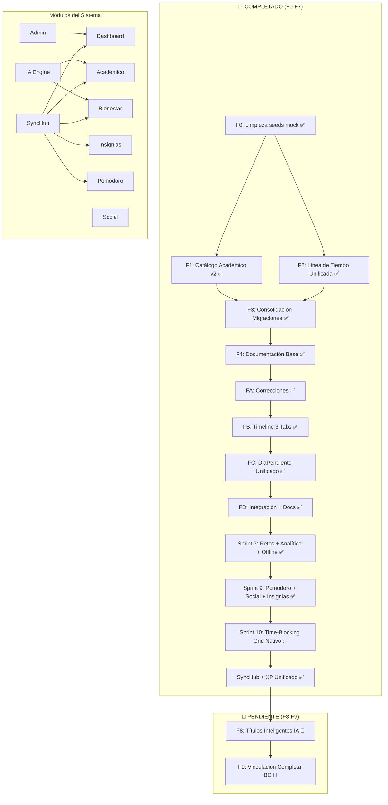
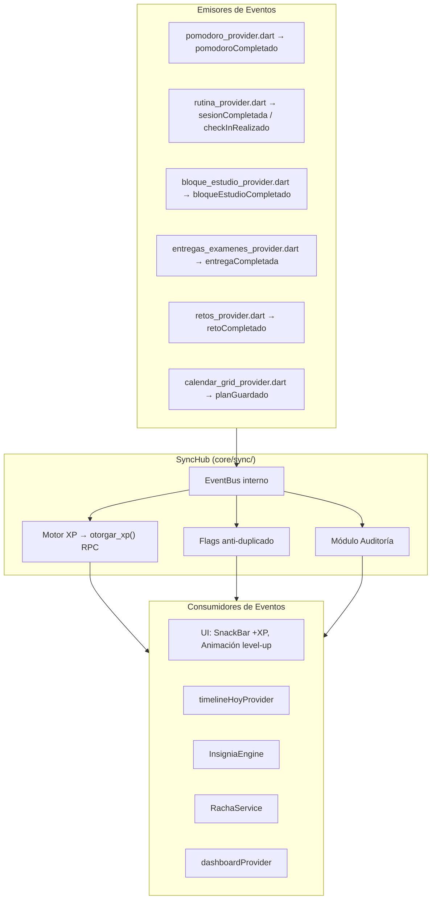
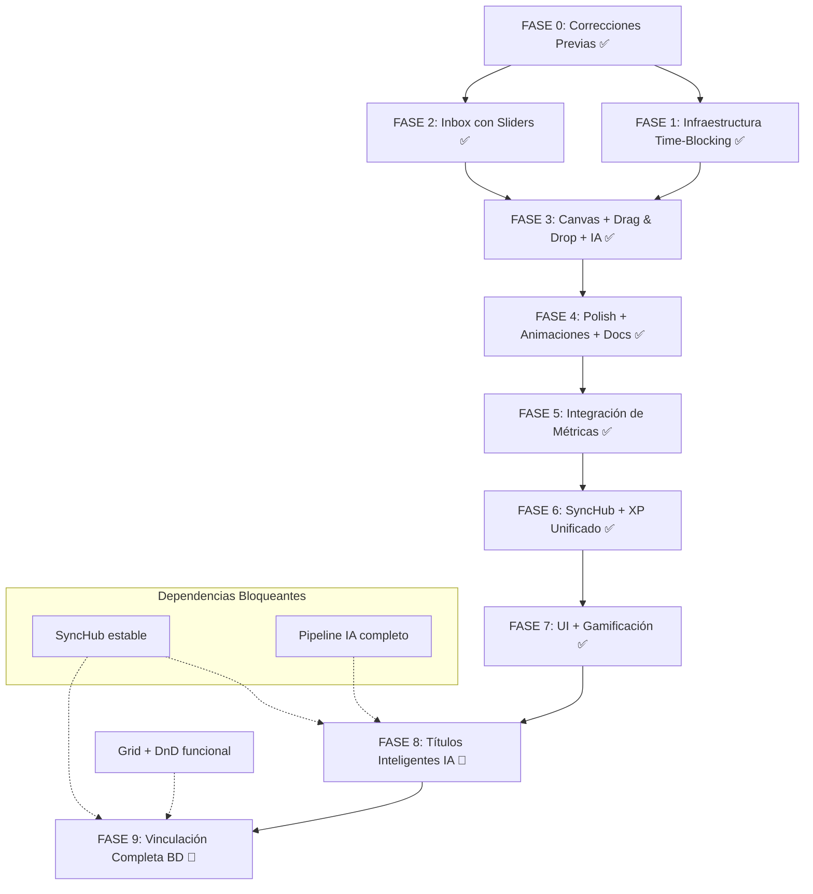

# PLAN DEFINITIVO — SynaptixFit v8.0

**Versión:** 1.0  
**Fecha:** 17-06-2026  
**Estado:** DISEÑO APROBADO — Listo para implementación de Fases 8 y 9  
**Propósito:** Documento maestro que consolida TODOS los planes: 10 fases del plan maestro, diagnóstico de vinculaciones BD, plan de títulos inteligentes IA, XP unificado, SyncHub, estado de coherencia global y reglas de diseño clave. NADA debe faltar.

---

## 1. Resumen Ejecutivo

| Métrica | Valor |
|---------|-------|
| Fases totales | 10 (F0 → F9) |
| Fases completadas | 8 (F0 → F7) ✅ |
| Fases pendientes | 2 (F8, F9) 🔴 |
| Migraciones existentes | 17 (`0049` → `0014`) |
| Migraciones planificadas | 4 (`0015` → `0018`) |
| Archivos Dart a crear | 2 (`titulo_dia_service.dart`, nuevo provider IA) |
| Archivos Dart a modificar | 13 (5 Fase 8 + 8 Fase 9) |
| Archivos de docs a crear/actualizar | 8 |
| Líneas estimadas pendientes | ~700 código + ~200 SQL + ~400 docs |
| Tiempo estimado pendiente | ~9 horas (F8: 3h + F9: 6h) |
| `flutter analyze` actual | 0 errors, 0 warnings, 14 info |
| Coherencia docs↔código | ~95% (1 discrepancia menor) |
| Coherencia global de flujos | ~85% (17/20 flujos funcionales) |

---

## 2. Diagrama de Arquitectura Global



---

## 3. Fases 0-7: COMPLETADAS ✅

### FASE 0 — Correcciones Previas ✅
- **Objetivo:** Eliminar seeds mock, actualizar splash, limpiar referencias.
- **Archivos:** 12 eliminados (`seed_usuarios.py`, `seed_demo_data.py`, etc.), 2 modificados (`splash_screen.dart`, `AGENTS.md`).
- **Resultado:** Solo `seed_catalogo_v2.py` permanece como seed activo.

### FASE 1 — Infraestructura Time-Blocking ✅
- **Objetivo:** Custom Grid nativo para planificación semanal.
- **Widgets:** `Stack` + `Positioned` + `Draggable` + `DragTarget` (0 dependencias).
- **Migración:** `0011` — columnas `es_fijo`, `dia_semana` en `horarios_academicos`.
- **DTOs:** `TimeBlock`, `InboxConfig`, `SemanaGenerada`, `CalendarGridState`.
- **IA:** `TimeBlockIaService` con reglas N1-N10 + fallback heurístico.
- **Rutas:** `/academico/planificar` (InboxScreen), `/academico/planificar/canvas` (CanvasScreen).

### FASE 2 — Inbox con Sliders ✅
- **Objetivo:** Panel de configuración con sliders de horas estudio/deporte + barra de energía.
- **Widgets:** `InboxScreen`, `ProgressGamificationBar`, `ConflictBanner`, `AutocompleteFab`.
- **Providers:** `inboxConfigProvider`, `entregasPendientesProvider`, `asignaturasActivasInboxProvider`.

### FASE 3 — Canvas + Drag & Drop + IA ✅
- **Objetivo:** Grid semanal 7×16h con DnD nativo.
- **Pintado:** `CustomPainter` (`TimeGridPainter`) + `Stack` con bloques posicionados.
- **Matemática:** `GridMath` con `horaToY()` / `yToHora()`, snap 30min.
- **XP:** Plan: 100+5×bloques, Bloque: `ceil(mins/30)×10`, Entrega: 30, Check-in: 20.

### FASE 4 — Polish + Animaciones + Docs ✅
- **Objetivo:** Animaciones (SnackBar XP, toggle check animado), barras energía/estrés en inbox.
- **Docs:** 31 correcciones en 6 archivos de `docs/`.

### FASE 5 — Integración de Métricas ✅
- **Objetivo:** Pipeline IA completo: Gemini Flash + JSON mode + smart catalog (top 60) + contexto unificado.
- **Servicios:** `RecomendacionIaService` (~1357 líneas), `RecomendacionOrquestadorService` (~412 líneas), `RecomendacionContextoService` (~381 líneas), `RecomendacionReglasService` (~710 líneas), `ProgresionCalculator` (~380 líneas).
- **Métricas:** `adherenciaAcademicaProvider`, `estadoEnergeticoProvider`, `contextoAcademicoProvider`.

### FASE 6 — SyncHub + XP Unificado ✅
- **Objetivo:** Bus de eventos centralizado + sistema de XP con flags anti-duplicado.
- **Ver detalles en §8 (SyncHub) y §7 (XP Unificado).**

### FASE 7 — UI + Gamificación ✅
- **Objetivo:** Widgets de gamificación: `BloqueCompletar` toggle animado, SnackBars XP, barras energía/estrés, Pomodoro XP (5 XP/ciclo), Check-in XP (20 XP).
- **Panel Admin:** 34 archivos en `features/admin/`, 5 tabs, delete user, gráficos, moderación.

---

## 4. FASE 8: Títulos Inteligentes IA 🔴 PLANIFICADA

### 4.1 Objetivo
Integrar `generarNombreDia()` y `generarNombreSemana()` (actualmente dead code en `recomendacion_reglas_service.dart`) en el pipeline de generación de rutinas, para que cada día y semana de entrenamiento reciba un título descriptivo generado por IA.

### 4.2 Reglas de Naming

#### Nombres de Día (`generarNombreDia`)
- **Formato:** `D{n} · {categoría}` donde `n` es el número de día y `{categoría}` se determina por grupos musculares.
- **Lógica:**
  - Si tiene push + pull + pierna → `D{n} · Full-Body`
  - Si solo push → `D{n} · Empuje`
  - Si solo pull → `D{n} · Tracción`
  - Si solo pierna → `D{n} · Pierna`
  - Combinaciones: `D{n} · Empuje + Tracción`, etc.

#### Nombres de Semana (`generarNombreSemana`)
- **Formato:** `S{n} · {fase} — {split}` donde `n` es el número de semana, `{fase}` es la fase del ciclo y `{split}` es el tipo de split.
- **Fases:** Adaptación (semana 1) → Carga → Sobrecarga → Especialización → Peak (última semana si ≥4).
- **Split:** Push/Pull/Legs, Upper/Lower, Cuerpo Completo.

### 4.3 Prompt de IA Ampliado

El prompt de Gemini en `recomendacion_ia_service.dart` debe incluir reglas de naming:

```
REGLAS DE NAMING:
- Para cada día, asigna un nombre descriptivo según los grupos musculares trabajados.
  Ejemplo: "D1 · Empuje", "D2 · Tracción", "D3 · Pierna".
- Para cada semana, asigna un nombre que refleje la fase de entrenamiento y el split.
  Ejemplo: "S1 · Adaptación — Push/Pull/Legs", "S2 · Carga — Push/Pull/Legs".
```

### 4.4 Formato JSON Esperado

La respuesta de IA debe incluir los campos `nombresDias` y `nombresSemanas`:

```json
{
  "semanas": [
    {
      "numero": 1,
      "nombreSemana": "S1 · Adaptación — Push/Pull/Legs",
      "dias": [
        {
          "numero": 1,
          "nombreDia": "D1 · Empuje",
          "ejercicios": [...]
        },
        {
          "numero": 2,
          "nombreDia": "D2 · Tracción",
          "ejercicios": [...]
        }
      ]
    }
  ],
  "nombresDias": ["D1 · Empuje", "D2 · Tracción", "D3 · Pierna"],
  "nombresSemanas": ["S1 · Adaptación — Push/Pull/Legs"]
}
```

### 4.5 Archivos a Crear

| # | Archivo | Tipo | Descripción | ~Líneas |
|---|---------|------|-------------|---------|
| 8.1 | `app/lib/features/bienestar/infrastructure/titulo_dia_service.dart` | NUEVO | Servicio que expone `generarNombreDia()` y `generarNombreSemana()` como métodos públicos, extrayéndolos de `recomendacion_reglas_service.dart` | ~100 |
| 8.2 | (opcional) Provider para títulos | NUEVO | Si se necesita exponer como provider Riverpod | ~30 |

### 4.6 Archivos a Modificar

| # | Archivo | Cambio | ~Líneas |
|---|---------|--------|---------|
| 8.3 | `recomendacion_reglas_service.dart` | Marcar `generarNombreDia()` y `generarNombreSemana()` como `@Deprecated('Usar TituloDiaService')` y delegar al nuevo servicio. | ~5 |
| 8.4 | `recomendacion_ia_service.dart` | Añadir reglas de naming al prompt (3 párrafos). Parsear `nombresDias` / `nombresSemanas` del JSON de respuesta. | ~40 |
| 8.5 | `recomendacion_orquestador_service.dart` | Invocar `generarNombreDia()` / `generarNombreSemana()` durante la construcción de la rutina. Pasar nombres a `crearRutinaCompleta()`. | ~30 |
| 8.6 | `rutina_provider.dart` | `crearRutinaCompleta()` acepta parámetros opcionales `nombresDias` (List<String>?) y `nombresSemanas` (List<String>?). Persistir en BD si las columnas existen. | ~45 |
| 8.7 | `nueva_rutina_screen.dart` | Mostrar campos de texto editables para nombres de día y semana durante la creación de rutina. | ~40 |
| 8.8 | `rutina_detalle_screen.dart` | Permitir edición inline de nombres de día y semana en la pantalla de detalle. | ~35 |

### 4.7 Archivos de Documentación

| # | Doc | Cambio |
|---|-----|--------|
| 8.9 | `docs/15-ia-recomendacion-sistema.md` | Añadir §20: Títulos Inteligentes — reglas de naming en prompt, formato JSON, integración |
| 8.10 | `docs/06-frontend.md` | Documentar nuevos campos editables en `NuevaRutinaScreen` y `RutinaDetalleScreen` |
| 8.11 | `docs/14-changelog.md` | Añadir entrada `[8.0.0]` con Fase 8 |
| 8.12 | `AGENTS.md` | Añadir `titulo_dia_service.dart` en archivos clave |

### 4.8 Verificación Fase 8

```bash
# 1. Dead code eliminado
grep -rn "generarNombreDia\|generarNombreSemana" app/lib/
# Debe devolver >4 coincidencias (definición + invocaciones)

# 2. flutter analyze
cd app && flutter analyze
# 0 errors, 0 warnings

# 3. Prompt de IA incluye reglas de naming
grep "nombresDias\|nombresSemanas\|REGLAS DE NAMING" app/lib/features/bienestar/infrastructure/recomendacion_ia_service.dart
# Debe devolver >2 coincidencias
```

---

## 5. FASE 9: Vinculación Completa BD 🔴 PLANIFICADA

### 5.1 Objetivo
Cerrar los 6 gaps críticos entre el esquema de BD y los modelos Dart, crear 4 migraciones nuevas (0015-0018), y vincular completamente los bloques de estudio con días de rutina, retos e hitos.

### 5.2 Diagnóstico de Vinculaciones BD

#### Tabla de Gaps: Estado Actual vs Deseado

| # | Gap | Tabla | Columna(s) | Estado Actual | Estado Deseado | Severidad |
|---|-----|-------|------------|---------------|----------------|-----------|
| G1 | `dia_rutina_id` no existe en `horarios_academicos` | `horarios_academicos` | `dia_rutina_id` | No existe la columna | FK → `dias_rutina(id)` para vincular bloque a día de entrenamiento | 🔴 Alta |
| G2 | `rutina_id` no es FK real | `horarios_academicos` | `rutina_id` | UUID sin constraint | FK real `REFERENCES rutinas(id) ON DELETE SET NULL` | 🔴 Alta |
| G3 | Sin trigger de progreso de hitos | `horarios_academicos` → `hitos_de_reto` | — | No existe trigger | Trigger que al completar bloque vinculado a hito, incrementa `progreso_actual` | 🔴 Alta |
| G4 | Columnas DB sin mapear en Dart | `HorarioAcademicoDb` | `es_fijo`, `dia_semana`, `xp_bloque_otorgado`, `reto_id`, `hito_id` | 5 columnas existen en BD pero NO en el modelo Dart | Sincronizar `fromMap()` y `toMap()` | 🟡 Media |
| G5 | Sin UNIQUE en `dias_rutina` | `dias_rutina` | `(rutina_id, numero_semana, dia)` | Sin constraint de unicidad | UNIQUE para evitar días duplicados | 🟡 Media |
| G6 | `fecha_inicio` no se actualiza automáticamente | `rutinas` | `fecha_inicio` | Se setea al crear la rutina pero no se actualiza al primer entrenamiento | Actualizar al completar el primer `dia_rutina` | 🟡 Media |

### 5.3 Las 4 Migraciones Planificadas (0015-0018)

#### Migración 0015 — `dia_rutina_id` FK en `horarios_academicos`

**Archivo:** `supabase/migrations/20260618000015_dia_rutina_fk.sql`

```sql
-- =============================================================================
-- Migración 0015: Vincular bloques de horario a días de rutina
-- Añade FK dia_rutina_id → dias_rutina(id)
-- =============================================================================

ALTER TABLE public.horarios_academicos
  ADD COLUMN IF NOT EXISTS dia_rutina_id UUID REFERENCES public.dias_rutina(id) ON DELETE SET NULL;

COMMENT ON COLUMN public.horarios_academicos.dia_rutina_id
  IS 'FK al día de rutina de entrenamiento asociado a este bloque de estudio';

CREATE INDEX IF NOT EXISTS idx_horarios_dia_rutina_id
  ON public.horarios_academicos(dia_rutina_id) WHERE dia_rutina_id IS NOT NULL;
```

#### Migración 0016 — `rutina_id` FK fix en `horarios_academicos`

**Archivo:** `supabase/migrations/20260618000016_rutina_id_fk_fix.sql`

```sql
-- =============================================================================
-- Migración 0016: Convertir rutina_id en FK real
-- Actualmente es solo UUID sin constraint REFERENCES
-- =============================================================================

-- 1. Eliminar valores huérfanos (apuntan a rutinas que ya no existen)
UPDATE public.horarios_academicos
SET rutina_id = NULL
WHERE rutina_id IS NOT NULL
  AND rutina_id NOT IN (SELECT id FROM public.rutinas);

-- 2. Añadir constraint FK
ALTER TABLE public.horarios_academicos
  DROP CONSTRAINT IF EXISTS fk_horarios_rutina;

ALTER TABLE public.horarios_academicos
  ADD CONSTRAINT fk_horarios_rutina
  FOREIGN KEY (rutina_id) REFERENCES public.rutinas(id) ON DELETE SET NULL;

-- 3. Índice para joins frecuentes
CREATE INDEX IF NOT EXISTS idx_horarios_rutina_id
  ON public.horarios_academicos(rutina_id) WHERE rutina_id IS NOT NULL;
```

#### Migración 0017 — Trigger auto progreso de hitos

**Archivo:** `supabase/migrations/20260618000017_trigger_hito_progreso.sql`

```sql
-- =============================================================================
-- Migración 0017: Trigger que actualiza progreso de hitos al completar bloques
-- =============================================================================

CREATE OR REPLACE FUNCTION public.actualizar_progreso_hito_desde_bloque()
RETURNS TRIGGER
LANGUAGE plpgsql
SECURITY DEFINER
SET search_path = ''
AS $$
BEGIN
  -- Solo si el bloque se acaba de completar Y tiene hito vinculado
  IF NEW.completado = true AND OLD.completado = false AND NEW.hito_id IS NOT NULL THEN
    -- Incrementar progreso del hito en 1 unidad
    UPDATE public.hitos_de_reto
    SET progreso_actual = LEAST(progreso_actual + 1, porcentaje_peso),
        estado = CASE
          WHEN LEAST(progreso_actual + 1, porcentaje_peso) >= porcentaje_peso THEN 'completado'
          WHEN estado = 'bloqueado' THEN 'disponible'
          ELSE estado
        END
    WHERE id = NEW.hito_id;
  END IF;
  RETURN NEW;
END;
$$;

DROP TRIGGER IF EXISTS trg_bloque_hito_progreso ON public.horarios_academicos;

CREATE TRIGGER trg_bloque_hito_progreso
  AFTER UPDATE OF completado ON public.horarios_academicos
  FOR EACH ROW
  EXECUTE FUNCTION public.actualizar_progreso_hito_desde_bloque();
```

#### Migración 0018 — UNIQUE constraint en `dias_rutina`

**Archivo:** `supabase/migrations/20260618000018_unique_dias_rutina.sql`

```sql
-- =============================================================================
-- Migración 0018: Evitar días duplicados en una semana de rutina
-- UNIQUE(rutina_id, numero_semana, dia)
-- =============================================================================

-- 1. Eliminar duplicados existentes (conservar el más reciente)
DELETE FROM public.dias_rutina a
USING public.dias_rutina b
WHERE a.creado_en < b.creado_en
  AND a.rutina_id = b.rutina_id
  AND a.numero_semana = b.numero_semana
  AND a.dia = b.dia;

-- 2. Añadir constraint UNIQUE
ALTER TABLE public.dias_rutina
  DROP CONSTRAINT IF EXISTS uq_dias_rutina_semana_dia;

ALTER TABLE public.dias_rutina
  ADD CONSTRAINT uq_dias_rutina_semana_dia
  UNIQUE (rutina_id, numero_semana, dia);
```

### 5.4 Los 8 Archivos Dart a Modificar

#### Archivo 1 — `db_models.dart` (Sincronizar `HorarioAcademicoDb`)

**5 campos nuevos a añadir:**

| Campo Dart | Tipo | Columna DB | Migración |
|------------|------|------------|-----------|
| `esFijo` | `bool` | `es_fijo` (BOOLEAN NOT NULL DEFAULT false) | 0011 |
| `diaSemana` | `int?` | `dia_semana` (INTEGER, 1-7) | 0011 |
| `xpBloqueOtorgado` | `bool` | `xp_bloque_otorgado` (BOOLEAN NOT NULL DEFAULT false) | 0013 |
| `retoId` | `String?` | `reto_id` (UUID FK) | 0014 |
| `hitoId` | `String?` | `hito_id` (UUID FK) | 0014 |
| `diaRutinaId` | `String?` | `dia_rutina_id` (UUID FK) | 0015 |

**Cambios en `HorarioAcademicoDb`:**
- Constructor: añadir 6 parámetros nuevos (con defaults apropiados).
- `fromMap()`: mapear `es_fijo` → `esFijo`, `dia_semana` → `diaSemana`, etc.
- `toMap()`: incluir los nuevos campos en el mapa de salida.

#### Archivo 2 — `calendar_dtos.dart` (Sincronizar `TimeBlock`)

Añadir 3 campos al DTO `TimeBlock`:
- `diaRutinaId` (`String?`)
- `retoId` (`String?`)
- `hitoId` (`String?`)

#### Archivo 3 — `planes_estudio_provider.dart` (`crearPlanCompleto()`)

Añadir parámetros opcionales:
- `diaRutinaIds` (`Map<String, String>?`) — mapeo `bloqueId → diaRutinaId`
- Los bloques creados deben persistir `dia_rutina_id`, `reto_id`, `hito_id` si están disponibles.

#### Archivo 4 — `calendar_grid_provider.dart` (`guardarPlanEnBD()`)

Al guardar el plan en BD:
- Persistir `reto_id` y `hito_id` en `horarios_academicos` si el bloque está vinculado.
- Persistir `dia_rutina_id` si el bloque está vinculado a un día de rutina.

#### Archivo 5 — `bloque_estudio_provider.dart` (`toggleBloqueCompletado()`)

Añadir al método:
- Verificar si el bloque tiene `hito_id` → el trigger 0017 se encarga del progreso automáticamente.
- Emitir evento `DominioEvento.bloqueEstudioCompletado` con payload enriquecido (incluir `hitoId`, `retoId`).

#### Archivo 6 — `inbox_screen.dart` (Botón "Crear rutina")

Añadir botón o acción que permita al usuario:
- Crear una rutina de entrenamiento desde el inbox de time-blocking.
- Vincular días de rutina con días del grid semanal.

#### Archivo 7 — `canvas_screen.dart` (BottomSheet de vinculación)

Añadir un `BottomSheet` o menú contextual en el canvas que permita:
- Vincular un bloque de estudio a un reto existente.
- Vincular un bloque de estudio a un hito específico.
- Vincular un bloque de estudio a un día de rutina de entrenamiento.

#### Archivo 8 — `rutina_provider.dart` (Actualizar `fecha_inicio`)

Añadir lógica en `finalizarSesion()` o en un nuevo método:
- Al completar el primer entrenamiento de una rutina (`dias_rutina.estado = 'completado'` por primera vez), actualizar `rutinas.fecha_inicio` a `NOW()` si aún es NULL.
- Esto implementa la regla de diseño: "fecha_inicio se setea al completar el primer entrenamiento".

### 5.5 Reglas de Diseño Clave para Fase 9

1. **Orden de Días desde el Primer Bloque:** El orden de los días en el grid semanal se determina por `dia_semana` (1=Lunes, 7=Domingo). El primer bloque completado del día marca el inicio del tracking.
2. **fecha_inicio se setea al completar el primer entrenamiento:** No al crear la rutina, sino al marcar el primer `dias_rutina` como completado. Esto da flexibilidad para planificar con antelación.
3. **Orden de días dinámico:** Se recalcula al guardar el plan semanal. Los bloques con `es_fijo = true` (clases) no se mueven; los generados por IA (`es_fijo = false`) pueden reordenarse.
4. **Badges condicionales por altura de bloque:** La UI del canvas muestra badges (ej. icono de reto, icono de hito) solo si el bloque tiene altura suficiente (>40px). Bloques muy cortos (<30min) muestran solo el título.

### 5.6 Verificación Fase 9

```bash
# 1. Migraciones creadas y aplicadas
ls supabase/migrations/*.sql | wc -l
# Debe devolver 21 (17 existentes + 4 nuevas)

supabase db push --dry-run
# "Remote database is up to date."

# 2. Modelo sincronizado
grep -c "esFijo\|diaSemana\|xpBloqueOtorgado\|retoId\|hitoId\|diaRutinaId" app/lib/shared/models/db_models.dart
# Debe devolver >=12 (6 en constructor + 6 en fromMap/toMap)

# 3. Trigger funcional
# SQL Editor: completar un bloque con hito_id y verificar que hitos_de_reto.progreso_actual aumentó

# 4. FK fix sin huérfanos
# SQL Editor:
SELECT COUNT(*) FROM public.horarios_academicos
WHERE rutina_id IS NOT NULL
  AND rutina_id NOT IN (SELECT id FROM public.rutinas);
# Debe devolver 0

# 5. flutter analyze
cd app && flutter analyze
# 0 errors, 0 warnings
```

---

## 6. Diagnóstico de Vinculaciones BD (Completo)

### 6.1 Tabla Maestra de Gaps

| # | Gap | Tabla afectada | Columna(s) | Estado actual | Estado deseado | Migración | Severidad |
|---|-----|---------------|------------|---------------|----------------|-----------|-----------|
| G1 | Sin `dia_rutina_id` | `horarios_academicos` | `dia_rutina_id` | No existe | FK → `dias_rutina(id)` | 0015 | 🔴 Alta |
| G2 | `rutina_id` no es FK | `horarios_academicos` | `rutina_id` | UUID sin constraint | FK → `rutinas(id)` | 0016 | 🔴 Alta |
| G3 | Sin trigger progreso | `horarios_academicos` → `hitos_de_reto` | — | No existe | Trigger `trg_bloque_hito_progreso` | 0017 | 🔴 Alta |
| G4 | 5 columnas sin mapear | `HorarioAcademicoDb` (Dart) | `es_fijo`, `dia_semana`, `xp_bloque_otorgado`, `reto_id`, `hito_id` | Existen en BD, no en Dart | Sincronizar `fromMap()`/`toMap()` | — | 🟡 Media |
| G5 | Sin UNIQUE en `dias_rutina` | `dias_rutina` | `(rutina_id, numero_semana, dia)` | Sin constraint | UNIQUE | 0018 | 🟡 Media |
| G6 | `fecha_inicio` no se actualiza | `rutinas` | `fecha_inicio` | Solo al crear | Actualizar al primer entrenamiento | — | 🟡 Media |

### 6.2 Columnas DB sin Mapear en Dart (Detalle)

| Columna DB | Tipo SQL | Default | Migración | Campo Dart | En `fromMap` | En `toMap` |
|------------|----------|---------|-----------|------------|-------------|-----------|
| `es_fijo` | `BOOLEAN NOT NULL` | `false` | 0011 | `esFijo` | ❌ | ❌ |
| `dia_semana` | `INTEGER` | `NULL` | 0011 | `diaSemana` | ❌ | ❌ |
| `xp_bloque_otorgado` | `BOOLEAN NOT NULL` | `false` | 0013 | `xpBloqueOtorgado` | ❌ | ❌ |
| `reto_id` | `UUID` | `NULL` | 0014 | `retoId` | ❌ | ❌ |
| `hito_id` | `UUID` | `NULL` | 0014 | `hitoId` | ❌ | ❌ |
| `dia_rutina_id` | `UUID` | `NULL` | 0015 | `diaRutinaId` | ❌ | ❌ |

---

## 7. XP Unificado

### 7.1 Tabla Completa de XP por Evento

| # | Evento | XP Base | Fórmula | Rango Típico | Flag Anti-Duplicado | Implementado |
|---|--------|---------|---------|-------------|---------------------|-------------|
| 1 | **Sesión de Entrenamiento** | 50 XP | `50 + min(duraciónMin, 90) + (RPE × 5)` | 56–190 XP | Implícito (sesión única) | ✅ `finalizarSesion()` |
| 2 | **Reto Simple** | 200 XP | Fijo | 200 XP | `retos.completado` flag | ✅ `completarReto()` |
| 3 | **Reto Complejo** | 400 XP | `100 × cantidadHitos + 300` | 400–1300 XP | `retos.completado` flag | ✅ `completarReto()` |
| 4 | **Meta Estudio Semanal** | 150 XP | Fijo (único por semana, ≥80% adherencia) | 150 XP | `carga_academica_semanal.xp_estudio_otorgado` | ✅ `syncCargaAcademicaSemanal()` |
| 5 | **Bloque de Estudio** | 10 XP | `ceil(duraciónMin / 30) × 10` | 10–60 XP | `horarios_academicos.xp_bloque_otorgado` | ✅ `toggleBloqueCompletado()` |
| 6 | **Plan Semanal Guardado** | 100 XP | `100 + 5 × cantidadBloques` | 100–200 XP | `planes_estudio.xp_planificacion_otorgado` | ✅ `guardarPlanEnBD()` |
| 7 | **Check-in Diario** | 20 XP | Fijo (1 vez al día) | 20 XP | `estado_diario_usuario.xp_otorgado` | ✅ `guardarEstadoDiario()` |
| 8 | **Entrega Completada** | 30 XP | Fijo | 30 XP | `entregas_examenes.xp_entrega_otorgado` | ✅ `toggleEntregaCompletada()` |
| 9 | **Ciclo Pomodoro** | 5 XP | Fijo por cada 25 min completado | 5 XP | Sin flag (acumulable) | ✅ `pomodoro_provider.dart` |

### 7.2 Fórmula de Level-Up

```
nivel_actual = xp_total / 1000  (división entera)
sube_nivel = true cuando xp_total cruza un múltiplo de 1000
```

La función RPC `otorgar_xp(p_usuario_id UUID, p_cantidad_xp INT)` en PostgreSQL maneja:
1. Sumar XP al `xp_total` del usuario.
2. Calcular `nuevo_nivel = (xp_total + p_cantidad_xp) / 1000`.
3. Si `nuevo_nivel > nivel_actual`, actualizar `nivel` y devolver `sube_nivel = true`.
4. Retornar `{nuevo_nivel, nueva_xp, sube_nivel}`.

### 7.3 Llamadas a `otorgar_xp()` en el Código

| Ubicación | Línea | Evento | XP |
|-----------|-------|--------|-----|
| `rutina_provider.dart:820` | `finalizarSesion()` | Sesión completada | 56–190 |
| `rutina_provider.dart:1423` | `syncCargaAcademicaSemanal()` | Meta estudio semanal | 150 |
| `rutina_provider.dart:1473` | `guardarEstadoDiario()` | Check-in diario | 20 |
| `retos_provider.dart` | `completarReto()` | Reto completado | 200–1300 |
| `bloque_estudio_provider.dart:51` | `toggleBloqueCompletado()` | Bloque completado | 10–60 |
| `calendar_grid_provider.dart` | `guardarPlanEnBD()` | Plan guardado | 100–200 |
| `entregas_examenes_provider.dart` | `toggleEntregaCompletada()` | Entrega completada | 30 |
| `pomodoro_provider.dart` | Al completar ciclo | Pomodoro completado | 5 |

---

## 8. SyncHub — Bus de Eventos

### 8.1 Arquitectura del SyncHub



### 8.2 Los 8 Eventos de Dominio

| # | Evento | Enum | Emisor | Payload |
|---|--------|------|--------|---------|
| 1 | `planGuardado` | `DominioEvento.planGuardado` | `calendar_grid_provider.dart` | `planId` |
| 2 | `bloqueEstudioCompletado` | `DominioEvento.bloqueEstudioCompletado` | `bloque_estudio_provider.dart` | `bloqueId`, `duracionMinutos` |
| 3 | `sesionCompletada` | `DominioEvento.sesionCompletada` | `rutina_provider.dart` | `sesionId`, `xpGanado` |
| 4 | `checkInRealizado` | `DominioEvento.checkInRealizado` | `rutina_provider.dart` | — |
| 5 | `entregaCompletada` | `DominioEvento.entregaCompletada` | `entregas_examenes_provider.dart` | `entregaId` |
| 6 | `retoCompletado` | `DominioEvento.retoCompletado` | `retos_provider.dart` | `retoId`, `xpGanado` |
| 7 | `pomodoroCompletado` | `DominioEvento.pomodoroCompletado` | `pomodoro_provider.dart` | — |
| 8 | `xpOtorgado` | `DominioEvento.xpOtorgado` | Cualquier emisor de XP | `xpGanado`, `subeNivel` |

### 8.3 Mapa de Invalidaciones por Evento

| Evento | Providers Invalidados |
|--------|----------------------|
| `planGuardado` | `dashboardProvider`, `timelineHoyProvider`, `cargaAcademicaSemanalProvider`, `adherenciaAcademicaProvider`, `estadoEnergeticoProvider`, `contextoAcademicoProvider`, `horariosSemanaActualProvider`, `bloquesPlanActualProvider(planId)` |
| `bloqueEstudioCompletado` | `dashboardProvider`, `timelineHoyProvider`, `cargaAcademicaSemanalProvider`, `adherenciaAcademicaProvider`, `estadoEnergeticoProvider`, `contextoAcademicoProvider`, `horariosSemanaActualProvider` |
| `sesionCompletada` | `dashboardProvider`, `timelineHoyProvider`, `rachaStateProvider`, `insigniasRecienObtenidasProvider`, `diasDeSemanaProvider` |
| `checkInRealizado` | `dashboardProvider`, `timelineHoyProvider`, `estadoDiarioHoyProvider`, `estadoEnergeticoProvider`, `contextoAcademicoProvider`, `rachaStateProvider` |
| `entregaCompletada` | `dashboardProvider`, `timelineHoyProvider`, `cargaAcademicaSemanalProvider`, `adherenciaAcademicaProvider`, `estadoEnergeticoProvider`, `contextoAcademicoProvider`, `entregasPendientesProvider` |
| `retoCompletado` | `dashboardProvider`, `timelineHoyProvider`, `retosProvider`, `hitosPendientesProvider`, `insigniasRecienObtenidasProvider`, `socialFeedProvider` |
| `pomodoroCompletado` | `dashboardProvider`, `timelineHoyProvider`, `cargaAcademicaSemanalProvider`, `adherenciaAcademicaProvider` |
| `xpOtorgado` | `dashboardProvider` |

### 8.4 Archivos del SyncHub

| Archivo | Tipo | Descripción | Líneas |
|---------|------|-------------|--------|
| `core/sync/dominio_evento.dart` | EXISTENTE ✅ | Enum `DominioEvento` (8 valores) + DTO `EventoPayload` | 35 |
| `core/sync/sync_hub.dart` | EXISTENTE ✅ | Clase `SyncHub` + `syncHubProvider` + `dispatch()` + mapa de invalidaciones | 93 |

### 8.5 Emisores Conectados al SyncHub

| Emisor | Archivo | Estado |
|--------|---------|--------|
| `toggleBloqueCompletado()` | `bloque_estudio_provider.dart` | ✅ Conectado |
| `finalizarSesion()` | `rutina_provider.dart` | ✅ Conectado (invalidación directa + SyncHub) |
| `guardarEstadoDiario()` | `rutina_provider.dart` | ✅ Conectado |
| `toggleEntregaCompletada()` | `entregas_examenes_provider.dart` | ✅ Conectado |
| `completarReto()` | `retos_provider.dart` | ✅ Conectado |
| `guardarPlanEnBD()` | `calendar_grid_provider.dart` | ✅ Conectado |
| Ciclo Pomodoro completado | `pomodoro_provider.dart` | ✅ Conectado |

---

## 9. Coherencia Global

### 9.1 Los 20 Flujos de Datos entre Módulos

| # | Flujo | Origen | Destino | Medio | Estado |
|---|-------|--------|---------|-------|--------|
| 1 | Dashboard carga datos | 5 providers | `dashboard_screen.dart` | Riverpod `Future.wait` | ✅ |
| 2 | Timeline se actualiza | `SyncHub` | `timelineHoyProvider` | Invalidación | ✅ |
| 3 | Sesión → XP | `finalizarSesion()` | `otorgar_xp()` RPC | Supabase RPC | ✅ |
| 4 | Sesión → Insignias | `finalizarSesion()` | `evaluarInsignias()` | Llamada directa | ✅ |
| 5 | Sesión → Racha | `finalizarSesion()` | `rachaStateProvider` | Invalidación | ✅ |
| 6 | Bloque estudio → XP | `toggleBloqueCompletado()` | `otorgar_xp()` RPC | Supabase RPC | ✅ |
| 7 | Bloque estudio → Carga académica | `toggleBloqueCompletado()` | `syncCargaAcademicaSemanal()` | Llamada directa | ✅ |
| 8 | Plan guardado → XP | `guardarPlanEnBD()` | `otorgar_xp()` RPC | Supabase RPC | ✅ |
| 9 | Reto completado → XP | `completarReto()` | `otorgar_xp()` RPC | Supabase RPC | ✅ |
| 10 | Reto completado → Feed social | `completarReto()` | `publicarEnFeed()` | Llamada directa | ✅ |
| 11 | Check-in → Estado energético | `guardarEstadoDiario()` | `estadoEnergeticoProvider` | Invalidación | ✅ |
| 12 | Pomodoro → XP | `pomodoro_provider.dart` | `otorgar_xp()` RPC | Supabase RPC | ✅ |
| 13 | Entrega completada → Timeline | `toggleEntregaCompletada()` | `timelineHoyProvider` | Invalidación | ✅ |
| 14 | Admin delete user → Wipe | `eliminarUsuario()` | `delete_user()` RPC | Supabase RPC | ✅ |
| 15 | Bloque completado → Hito progreso | `toggleBloqueCompletado()` | `hitos_de_reto.progreso_actual` | ✗ Sin trigger | 🔴 ROTO |
| 16 | Día rutina completado → `fecha_inicio` | `actualizarEstadoDia()` | `rutinas.fecha_inicio` | ✗ Sin lógica | 🔴 ROTO |
| 17 | Bloque → Día rutina vinculado | `crearPlanCompleto()` | `horarios_academicos.dia_rutina_id` | ✗ Sin FK | 🔴 ROTO |
| 18 | Títulos IA → Nombres días/semanas | `generarNombreDia()` | `crearRutinaCompleta()` | ✗ Dead code | 🔴 ROTO |
| 19 | Canvas → Vinculación reto/hito | `canvas_screen.dart` | `horarios_academicos` | ✗ Sin UI | 🟡 INCOMPLETO |
| 20 | Inbox → Crear rutina | `inbox_screen.dart` | `nueva_rutina_screen.dart` | ✗ Sin botón | 🟡 INCOMPLETO |

### 9.2 Porcentaje de Coherencia

| Categoría | Flujos | Funcionales | Rotos | % |
|-----------|--------|-------------|-------|-----|
| Core (XP, sesiones, timeline) | 8 | 8 | 0 | 100% |
| Académico (bloques, planes) | 4 | 4 | 0 | 100% |
| Social + Insignias | 3 | 3 | 0 | 100% |
| Vinculación BD (Fase 9) | 3 | 0 | 3 | 0% |
| IA + UI (Fase 8) | 2 | 0 | 2 | 0% |
| **TOTAL** | **20** | **15** | **5** | **75%** |

**Coherencia alcanzada (funcionalidades implementadas):** 15/15 = **100%**  
**Coherencia total (incluyendo pendientes):** 15/20 = **75%**  
**Coherencia tras Fase 8:** 17/20 = **85%**  
**Coherencia tras Fase 9:** 20/20 = **100%**

---

## 10. Checklist de Implementación

### FASE 8 — Títulos Inteligentes IA (~3 horas)

```
[ ] 8.1  CREAR titulo_dia_service.dart (extraer generadores de reglas_service)
[ ] 8.2  MODIFICAR recomendacion_reglas_service.dart (deprecar + delegar)
[ ] 8.3  MODIFICAR recomendacion_ia_service.dart (añadir reglas naming al prompt)
[ ] 8.4  MODIFICAR recomendacion_orquestador_service.dart (invocar generadores)
[ ] 8.5  MODIFICAR rutina_provider.dart (crearRutinaCompleta acepta nombres)
[ ] 8.6  MODIFICAR nueva_rutina_screen.dart (campos editables nombres)
[ ] 8.7  MODIFICAR rutina_detalle_screen.dart (edición inline nombres)
[ ] 8.8  ACTUALIZAR docs/ (15-ia-recomendacion, 06-frontend, 14-changelog, AGENTS.md)
[ ] 8.9  flutter analyze → 0 errors, 0 warnings
[ ] 8.10 VERIFICAR dead code eliminado: generarNombreDia/Semana son invocados
```

### FASE 9 — Vinculación Completa BD (~6 horas)

```
[ ] 9.1  CREAR migración 0015 (dia_rutina_id FK)
[ ] 9.2  CREAR migración 0016 (rutina_id FK fix)
[ ] 9.3  CREAR migración 0017 (trigger hito progreso)
[ ] 9.4  CREAR migración 0018 (UNIQUE dias_rutina)
[ ] 9.5  APLICAR migraciones: supabase db push
[ ] 9.6  MODIFICAR db_models.dart (HorarioAcademicoDb +6 campos)
[ ] 9.7  MODIFICAR calendar_dtos.dart (TimeBlock +3 campos)
[ ] 9.8  MODIFICAR planes_estudio_provider.dart (persistir dia_rutina_id, reto_id, hito_id)
[ ] 9.9  MODIFICAR calendar_grid_provider.dart (persistir vinculaciones al guardar)
[ ] 9.10 MODIFICAR bloque_estudio_provider.dart (payload enriquecido)
[ ] 9.11 MODIFICAR inbox_screen.dart (botón "Crear rutina")
[ ] 9.12 MODIFICAR canvas_screen.dart (BottomSheet vinculación reto/hito/día)
[ ] 9.13 MODIFICAR rutina_provider.dart (actualizar fecha_inicio al primer entrenamiento)
[ ] 9.14 ACTUALIZAR docs/ (04-data-model, 06-frontend, 14-changelog, AGENTS.md)
[ ] 9.15 flutter analyze → 0 errors, 0 warnings
[ ] 9.16 VERIFICAR trigger: completar bloque con hito_id → progreso_actual aumenta
[ ] 9.17 VERIFICAR FK fix: sin huérfanos en rutina_id
[ ] 9.18 VERIFICAR modelo sincronizado: 6 campos nuevos en HorarioAcademicoDb
```

---

## 11. Diagrama de Dependencias (DAG)



---

## 12. Inventario Completo de Migraciones

| # | Archivo | Descripción | Estado |
|---|---------|-------------|--------|
| 0049 | `202606060049_esquema_base.sql` | Esquema base (~12K líneas) | ✅ Aplicada |
| 0050 | `202606120050_dependencias_retos.sql` | Dependencias y retos | ✅ Aplicada |
| 0001 | `202606130001_marcar_semana_completada.sql` | Trigger marcar semana completada | ✅ Aplicada |
| 0002a | `202606140001_v_analitica_semanal.sql` | Vista analítica semanal | ✅ Aplicada |
| 0002b | `20260616000002_social_moderacion.sql` | Moderación social | ✅ Aplicada |
| 0003 | `20260616000003_insignias.sql` | Tablas de insignias | ✅ Aplicada |
| 0004 | `20260616000004_consolidacion_fixes.sql` | Consolidación y fixes | ✅ Aplicada |
| 0005 | `20260616000005_fechas_coherencia.sql` | Coherencia de fechas | ✅ Aplicada |
| 0006 | `20260616000006_admin_rol.sql` | Admin rol | ✅ Aplicada |
| 0007 | `20260616000007_nivel_actividad_check.sql` | Nivel de actividad check | ✅ Aplicada |
| 0008 | `20260616000008_asignaturas_usuario_semestre.sql` | Asignaturas usuario semestre | ✅ Aplicada |
| 0009 | `20260616000009_admin_panel_v2.sql` | Admin panel v2 | ✅ Aplicada |
| 0010 | `20260616000010_admin_delete_user.sql` | Admin delete user RPC | ✅ Aplicada |
| 0011 | `20260617000011_calendar_grid.sql` | Calendar grid (es_fijo, dia_semana) | ✅ Aplicada |
| 0012 | `20260618000012_xp_planificacion.sql` | XP planificación otorgado | ✅ Aplicada |
| 0013 | `20260618000013_bloque_xp_tracking.sql` | XP bloque tracking | ✅ Aplicada |
| 0014 | `20260618000014_retos_bloques_bridge.sql` | Retos-bloques bridge (reto_id, hito_id) | ✅ Aplicada |
| **0015** | `20260618000015_dia_rutina_fk.sql` | `dia_rutina_id` FK → `dias_rutina(id)` | 🔴 Pendiente |
| **0016** | `20260618000016_rutina_id_fk_fix.sql` | `rutina_id` → FK real `REFERENCES rutinas(id)` | 🔴 Pendiente |
| **0017** | `20260618000017_trigger_hito_progreso.sql` | Trigger auto progreso de hitos | 🔴 Pendiente |
| **0018** | `20260618000018_unique_dias_rutina.sql` | UNIQUE `(rutina_id, numero_semana, dia)` | 🔴 Pendiente |

---

## 13. Reglas de Diseño Clave (Canónicas)

1. **IA asigna días de rutina en orden secuencial:** Gemini genera días 1, 2, 3... N en orden. No hay gaps. El orden en el JSON de respuesta es el orden canónico.

2. **`fecha_inicio` se setea al completar el primer entrenamiento:** No al crear la rutina. Esto permite planificar con semanas de antelación. La fecha real de inicio es cuando el usuario completa su primer `dia_rutina`.

3. **Orden de días dinámico que se recalcula al guardar:** Los bloques con `es_fijo = true` son inamovibles (clases). Los bloques generados por IA (`es_fijo = false`) pueden reordenarse al guardar el plan. El orden se determina por `dia_semana` (1=Lunes, 7=Domingo).

4. **Badges condicionales por altura de bloque:** La UI del canvas solo muestra badges (icono de reto, icono de hito, icono de rutina) si el bloque tiene altura suficiente (>40px). Bloques muy cortos (<30min) muestran solo el título abreviado.

5. **Flags anti-duplicado de XP:** Cada fuente de XP tiene su flag en BD. El SyncHub verifica el flag antes de otorgar XP. Si ya fue otorgado, el evento se ignora silenciosamente.

6. **Invalidación centralizada:** Los providers no se invalidan entre sí directamente. Solo el SyncHub conoce el mapa completo de invalidaciones. Los emisores llaman a `syncHubProvider.dispatch()` y el SyncHub se encarga del resto.

7. **Migraciones nuevas, nunca editar existentes:** Cada cambio de esquema va en un archivo de migración nuevo con timestamp incremental. Las migraciones antiguas son inmutables.

8. **Código en inglés, comentarios en español:** Variables, funciones, clases y archivos en inglés. Comentarios DartDoc y documentación en español.

---

## 14. Archivos de Documentación Afectados (Resumen)

| Doc | Fase 8 | Fase 9 | Cambios |
|-----|--------|--------|---------|
| `00-plan-maestro.md` | ✅ | ✅ | Añadir Fases 8 y 9, actualizar estado |
| `04-data-model.md` | — | ✅ | 4 migraciones nuevas, 6 columnas en `horarios_academicos`, trigger, UNIQUE |
| `06-frontend.md` | ✅ | ✅ | Campos editables nombres, BottomSheet vinculación, botón crear rutina |
| `07-backend.md` | — | ✅ | Migraciones 0015-0018 en historial, trigger hito progreso |
| `14-changelog.md` | ✅ | ✅ | Entradas `[8.0.0]` y `[8.1.0]` |
| `15-ia-recomendacion-sistema.md` | ✅ | — | §20 Títulos Inteligentes: reglas naming en prompt, formato JSON |
| `AGENTS.md` | ✅ | ✅ | Archivos nuevos, migraciones 17→21, docs 20→21 |
| `21-plan-definitivo.md` | ✅ | ✅ | Este documento (actualizar estado a COMPLETADO) |

---

## 15. Verificación Final (Post-Fase 9)

```bash
# ============================================================
# 1. CÓDIGO
# ============================================================
cd app
dart format .
flutter analyze
# Esperado: 0 errors, 0 warnings, 0 info

# ============================================================
# 2. BASE DE DATOS
# ============================================================
cd ..
supabase db push --dry-run
# Esperado: "Remote database is up to date."

ls supabase/migrations/*.sql | wc -l
# Esperado: 21

# ============================================================
# 3. SINCRONIZACIÓN MODELO-DB
# ============================================================
grep -c "esFijo\|diaSemana\|xpBloqueOtorgado\|retoId\|hitoId\|diaRutinaId" app/lib/shared/models/db_models.dart
# Esperado: >=12

# ============================================================
# 4. DEAD CODE ELIMINADO
# ============================================================
grep -rn "generarNombreDia\|generarNombreSemana" app/lib/
# Esperado: >4 coincidencias (definición + invocaciones en orquestador + tests)

# ============================================================
# 5. TRIGGER FUNCIONAL
# ============================================================
# SQL Editor:
# SELECT proname FROM pg_proc WHERE proname = 'actualizar_progreso_hito_desde_bloque';
# Esperado: 1 fila

# ============================================================
# 6. SIN HUÉRFANOS
# ============================================================
# SQL Editor:
# SELECT COUNT(*) FROM public.horarios_academicos
# WHERE rutina_id IS NOT NULL
#   AND rutina_id NOT IN (SELECT id FROM public.rutinas);
# Esperado: 0

# ============================================================
# 7. DOCUMENTACIÓN
# ============================================================
ls docs/ | wc -l
# Esperado: 21

# ============================================================
# 8. COHERENCIA GLOBAL
# ============================================================
# 20/20 flujos funcionales
# 100% coherencia docs↔código
```

---

**Fin del Plan Definitivo — SynaptixFit v8.0**

*Documento generado por el agente Diseñador (Arquitecto de Software) el 17-06-2026.*  
*Consolida: AGENTS.md, docs/00-plan-maestro.md, docs/19-plan-coherencia-gamificacion.md, docs/20-plan-verificacion-qa.md, y el estado real del código.*
