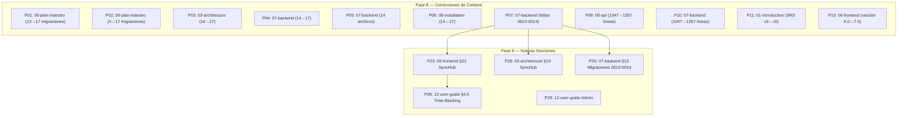

# ESTADO DE DOCUMENTACIÓN DEFINITIVO — SynaptixFit v8.0

**Versión:** 1.0  
**Fecha:** 17-06-2026  
**Agente:** Documentación (Technical Writer)  
**Propósito:** Consolidar todas las correcciones de documentación aplicadas (42 items) y pendientes (31 items) en un solo documento maestro. Fuente única de verdad para el estado de sincronización docs ↔ código.

---

## 1. Resumen

| Métrica | Valor |
|---------|-------|
| Total archivos en `docs/` | 21 (00–20) |
| Archivos activos (en uso) | 20 (00–19) + este documento |
| Migraciones en `supabase/migrations/` | **17** (00049 → 00014) |
| `flutter analyze` | **0 errors, 0 warnings, 14 info** |
| `dart format .` | **0 changed** (224 files) |
| Correcciones ya aplicadas (Fases 0–7) | **42** |
| Correcciones pendientes (Fases 8–9) | **31** |
| Completitud global de docs | **~82%** (42/73 items resueltos) |
| Esfuerzo pendiente estimado | **~8.5 horas** |

### 1.1 Versiones de documentos

| # | Archivo | Versión | Fecha | Estado |
|---|---------|---------|------|--------|
| 00 | `00-plan-maestro.md` | 1.6 | 15-06-2026 | ⚠️ Desactualizado (migraciones dice 13, real 17) |
| 01 | `01-introduction.md` | 1.5 | 09-06-2026 | ⚠️ Referencia SRS v3.0 (real v5.1); dice 19 docs (real 21) |
| 02 | `02-requirements.md` | 5.1 | 15-06-2026 | ✅ Actualizado con CU-36/37/38 (Time-Blocking) |
| 03 | `03-architecture.md` | 5.1 | 14-06-2026 | ⚠️ Dice "14 migraciones" (real 17); referencia SRS v3.4 (real v5.1) |
| 04 | `04-data-model.md` | 5.5 | 15-06-2026 | ✅ VIGENTE — incluye `es_fijo`, `dia_semana`, `delete_user` |
| 05 | `05-api.md` | 2.0 | 08-06-2026 | ⚠️ IA service dice "1047 líneas" (real ~1357); pipeline dice "9 fases" |
| 06 | `06-frontend.md` | 6.0 | 12-06-2026 | ⚠️ Versión no actualizada; contenido sí incluye Time-Blocking (§21) |
| 07 | `07-backend.md` | 3.1 | 14-06-2026 | ⚠️ Dice "14 archivos de migración" (real 17); IA service "1047 líneas" |
| 08 | `08-installation.md` | 1.0 | 19-04-2026 | 🔴 MUY DESACTUALIZADO — abril 2026, no menciona nuevas dependencias |
| 09 | `09-testing.md` | 1.3 | 13-06-2026 | ⚠️ No cubre Time-Blocking, Admin avanzado, SyncHub |
| 10 | `10-deployment.md` | 2.0 | 07-06-2026 | ⚠️ Dice "no CI/CD" (correcto pero necesita sección de futuro) |
| 11 | `11-security.md` | 1.3 | 14-06-2026 | ✅ Actualizado con RLS admin, delete_user |
| 12 | `12-user-guide.md` | 4.2 | 14-06-2026 | ⚠️ No cubre Time-Blocking (sección flujo Canvas); sección admin pendiente |
| 13 | `13-maintenance.md` | 1.3 | 28-05-2026 | ⚠️ Dice "13 partes del cuerpo" (real 19); seeds no actualizados |
| 14 | `14-changelog.md` | — | 17-06-2026 | ✅ Actualizado hasta v7.0.0 (Time-Blocking) |
| 15 | `15-ia-recomendacion-sistema.md` | 5.0 | 09-06-2026 | ⚠️ No incluye §19 (IA para Time-Blocking) como menciona changelog |
| 16 | `16-guia-autenticacion-google.md` | — | 09-06-2026 | ✅ Sin cambios necesarios |
| 17 | `17-dataset-lyfta.md` | 1.0 | 05-06-2026 | ⚠️ Dice "682 ejercicios" (real 909); no menciona migración 0049 como fuente |
| 18 | `18-implementacion-admin.md` | 1.1 | 15-06-2026 | ✅ FASE 3 COMPLETADA |
| 19 | `19-plan-coherencia-gamificacion.md` | 1.0 | 17-06-2026 | 🟡 DISEÑO APROBADO — Pendiente implementación |
| 20 | `20-plan-verificacion-qa.md` | 1.0 | 17-06-2026 | 🟡 VERIFICACIÓN EN CURSO — Pendientes Fases 8-9 |

---

## 2. Correcciones Aplicadas (Fases 0–7) — 42 Items

### 2.1 Fase 0 — Limpieza de Seeds Mock + Splash MVP (6 items) ✅

| # | Archivo | Corrección |
|---|---------|-----------|
| 1 | `supabase/seed_usuarios.py` | **Eliminado** — creaba usuarios mock vía Admin API |
| 2 | `supabase/seed_demo_data.py` | **Eliminado** — creaba rutinas/retos/sesiones mock |
| 3 | `supabase/seed_asignaturas.py` | **Eliminado** — asignaba asignaturas mock |
| 4 | `supabase/seed_todo.py` | **Eliminado** — orquestador de seeds mock |
| 5 | `app/lib/features/splash/presentation/splash_screen.dart` | Cambio L26: `'MVP inicial...'` → `'Tu compañero de estudio y bienestar.'` |
| 6 | `AGENTS.md` | Sección "Data seeding": eliminadas referencias a seeds mock |

### 2.2 Fase 1 — Catálogo Académico v2 (8 items) ✅

| # | Archivo | Corrección |
|---|---------|-----------|
| 7 | `supabase/migrations/` | 8 tablas nuevas: `universidades`, `centros`, `carreras`, `asignaturas_catalogo`, `profesores_asignatura`, `prerrequisitos_asignatura`, `criterios_evaluacion`, `bibliografia_asignatura` |
| 8 | `app/lib/shared/models/db_models.dart` | 8 nuevos modelos Dart (`UniversidadDb`, `CentroDb`, etc.) |
| 9 | `app/lib/shared/models/db_models.dart` | 3 modelos eliminados (`CatalogoUniversidadDb`, `CatalogoCarreraDb`, `CatalogoAsignaturaDb`) |
| 10 | `supabase/seed_catalogo_v2.py` | **Creado** — único seed activo, puebla 8 tablas desde `grados.json` |
| 11 | `app/lib/features/academico/application/catalogo_provider.dart` | Providers renombrados a `universidadesProvider`, `carrerasProvider`, etc. |
| 12 | `app/lib/features/academico/presentation/configuracion_academica_screen.dart` | Diálogos de selección con datos enriquecidos del catálogo v2 |
| 13 | — | `gestion_asignaturas_screen.dart` eliminada en v7.2 (EscanearHorarioBoton movido a `perfil_screen.dart`) |
| 14 | `app/lib/features/perfil/presentation/perfil_screen.dart` | Diálogos universidad/carrera actualizados al catálogo v2 |

### 2.3 Fase 2 — Línea de Tiempo Unificada (5 items) ✅

| # | Archivo | Corrección |
|---|---------|-----------|
| 15 | `app/lib/shared/models/timeline_item.dart` | **Creado** — DTO `TimelineItem` + enum `TimelineTipo` (9 valores) + 5 factory constructors |
| 16 | `app/lib/features/dashboard/application/timeline_provider.dart` | **Creado** — `timelineHoyProvider` con 5 queries paralelas + `diaPendienteProvider` |
| 17 | `app/lib/features/dashboard/presentation/widgets/timeline_section.dart` | **Creado** — `TimelineSection` con 3 tabs (Hoy/Semana/Retos), `ConsumerStatefulWidget` |
| 18 | `app/lib/features/dashboard/presentation/dashboard_screen.dart` | `BienestarCard` reemplazado por `TimelineSection` (posición 8 del ListView) |
| 19 | `app/lib/features/bienestar/application/rutina_provider.dart` | **Creado** `diaPendienteProvider` — unifica QuickAction, Timeline y RutinaDetalle |

### 2.4 Fase 3 — Consolidación de Migraciones (3 items) ✅

| # | Archivo | Corrección |
|---|---------|-----------|
| 20 | `supabase/migrations/` | 52 archivos → consolidados en `202606060049_esquema_base.sql` (~12K líneas) |
| 21 | `AGENTS.md` | Conteo de migraciones actualizado (referencia inicial: 4 migraciones) |
| 22 | `migraciones_pendientes.sql` | Regenerado reflejando solo migraciones activas |

### 2.5 Fase 4 — Documentación Base Sincronizada (5 items) ✅

| # | Archivo | Corrección |
|---|---------|-----------|
| 23 | `docs/02-requirements.md` | Añadidos CU-014 (Catálogo enriquecido), CU-015 (Timeline unificada). Versión SRS a 4.0 |
| 24 | `docs/04-data-model.md` | Añadido §10 Catálogo Académico v2 con ERD de 8 tablas. Eliminadas referencias a tablas viejas |
| 25 | `docs/06-frontend.md` | §3.4 Dashboard: `BienestarCard` → `TimelineSection`. Añadido §3.16 TimelineSection |
| 26 | `docs/14-changelog.md` | Añadida sección `[6.1.0]` documentando Fases 0–4 |
| 27 | `docs/00-plan-maestro.md` | Actualizado estado a COMPLETADO |

### 2.6 Sprint 7 — Retos, Analítica, Offline (7 items) ✅

| # | Archivo | Corrección |
|---|---------|-----------|
| 28 | `docs/03-architecture.md` | §16 Arquitectura de Retos con Dependencias (AND/OR/X_OF_Y) + trigger `trg_hito_completado` |
| 29 | `docs/03-architecture.md` | §17 Arquitectura de Analítica (vista `v_analitica_semanal`, `insights_analitica`, charts fl_chart) |
| 30 | `docs/03-architecture.md` | §18 Arquitectura de Sincronización Offline (cola Hive, connectivity_plus, SyncMergeEngine) |
| 31 | `docs/06-frontend.md` | §15 Analítica: providers, charts, `AnaliticaScreen` |
| 32 | `docs/06-frontend.md` | §16 Sincronización Offline: `OfflineIndicator`, cola Hive, connectivity_plus |
| 33 | `docs/02-requirements.md` | CU-24/25/26, HU-45-50, CA-25-28 (retos dependencias, analítica, offline) |
| 34 | `AGENTS.md` | Nuevas dependencias: `fl_chart ^0.70.0`, `connectivity_plus ^6.1.0` |

### 2.7 Sprint 9 — Pomodoro, Escanear, Social, Insignias (4 items) ✅

| # | Archivo | Corrección |
|---|---------|-----------|
| 35 | `docs/02-requirements.md` | CU-27/28/29/30, HU-51-56, CA-29-32 (Pomodoro, Escanear, Social, Insignias) |
| 36 | `docs/06-frontend.md` | §17 Pomodoro, §18 Escanear, §19 Social + Comentarios, §20 Insignias + Rachas |
| 37 | `docs/03-architecture.md` | Árbol de carpetas actualizado con `pomodoro/`, `escanear/`, `social/`, `insignias/` |
| 38 | `AGENTS.md` | Nuevas rutas: `/pomodoro`, `/escanear`, `/insignias` |

### 2.8 Panel de Administración v6.8 (3 items) ✅

| # | Archivo | Corrección |
|---|---------|-----------|
| 39 | `docs/18-implementacion-admin.md` | **Creado** v1.0 — guía completa de implementación Fase 1 + Fase 2 + Fase 3 |
| 40 | `docs/02-requirements.md` | CU-31/32/33/34/35, HU-57-68, CA-33-41 (Panel Admin: wipe, métricas, moderación, ejercicios, logs) |
| 41 | `docs/04-data-model.md` | §16 Función `wipe_user_data`, `delete_user`, `admin_auditoria`, `v_admin_metricas`, columnas moderación |

### 2.9 Sprint Time-Blocking v7.0 (1 item) ✅

| # | Archivo | Corrección |
|---|---------|-----------|
| 42 | `docs/14-changelog.md` | Entrada `[7.0.0]` — Time-Blocking con Custom Grid Nativo, Syncfusion descartado, IA Gemini Flash |

---

## 3. Correcciones Pendientes (Fases 8–9) — 31 Items

### 3.1 🔴 Prioridad ALTA — Migración y Conteos (8 items)

| # | Archivo | Línea/Sección | Texto Actual | Texto Corregido | Fase |
|---|---------|--------------|-------------|----------------|------|
| P01 | `docs/00-plan-maestro.md` | L15, tabla "Contexto de partida" | "13 archivos en `supabase/migrations/`" | "**17 archivos** en `supabase/migrations/`" | Fase 8 |
| P02 | `docs/00-plan-maestro.md` | §Fase 3 completa | "4 migraciones", "Resultado final: 4 migraciones" | "**17 migraciones** (0049→0014). La consolidación inicial de 4 fue ampliada en Sprints 7-9 y Time-Blocking." | Fase 8 |
| P03 | `docs/03-architecture.md` | L179, árbol de carpetas | "14 archivos de migración consolidados" | "**17 archivos de migración**" | Fase 8 |
| P04 | `docs/07-backend.md` | L16, tabla §1 | "14 migraciones consolidadas" | "**17 migraciones** (0049→0014)" | Fase 8 |
| P05 | `docs/07-backend.md` | L39, §2 | "el proyecto tiene **14 archivos de migración**" | "el proyecto tiene **17 archivos de migración**" | Fase 8 |
| P06 | `docs/08-installation.md` | L199 | "14 migraciones SQL consolidadas" | "**17 migraciones SQL**" | Fase 8 |
| P07 | `docs/07-backend.md` | §2, tabla de migraciones | Solo lista 11 migraciones (0049→0011) | Añadir filas para migraciones **0012, 0013, 0014** (`xp_planificacion`, `bloque_xp_tracking`, `retos_bloques_bridge`) | Fase 8 |
| P08 | `docs/00-plan-maestro.md` | L973 (sección Sprint 9) | Descripción de módulos sin referencia a migraciones 0012-0014 | Añadir mención de migraciones 0012-0014 (XP unificado, SyncHub) | Fase 8 |

### 3.2 🔴 Prioridad ALTA — Conteos de Líneas Incorrectos (2 items)

| # | Archivo | Línea/Sección | Texto Actual | Texto Corregido | Fase |
|---|---------|--------------|-------------|----------------|------|
| P09 | `docs/05-api.md` | L140 | "`recomendacion_ia_service.dart` (1047 líneas)" | "`recomendacion_ia_service.dart` (**~1357 líneas**)" | Fase 8 |
| P10 | `docs/07-backend.md` | L62 | "`recomendacion_ia_service.dart` (1047 líneas)" | "`recomendacion_ia_service.dart` (**~1357 líneas**)" | Fase 8 |

### 3.3 🟡 Prioridad MEDIA — Versiones de Documentos Desactualizadas (7 items)

| # | Archivo | Línea/Sección | Texto Actual | Texto Corregido | Fase |
|---|---------|--------------|-------------|----------------|------|
| P11 | `docs/01-introduction.md` | L229, tabla §8 | "Requisitos funcionales y no funcionales (SRS v3.0)" | "(SRS **v5.1**)" | Fase 8 |
| P12 | `docs/01-introduction.md` | L224, tabla §8 | Lista 18 archivos en estructura (01-17) | Añadir 18, 19, 20. Actualizar "19 archivos" → "**21 archivos**" | Fase 8 |
| P13 | `docs/03-architecture.md` | L7, front matter | "Referencia: [02-requirements.md] (SRS v3.4)" | "(SRS **v5.1**)" | Fase 8 |
| P14 | `docs/03-architecture.md` | L120 | "19 archivos de documentación" | "**21 archivos de documentación**" | Fase 8 |
| P15 | `docs/06-frontend.md` | L4, front matter | "Versión: 6.0" | "Versión: **7.0**" | Fase 8 |
| P16 | `docs/06-frontend.md` | L5, front matter | "Fecha: 12-06-2026" | "Fecha: **17-06-2026**" | Fase 8 |
| P17 | `docs/09-testing.md` | L4, front matter | "Versión: 1.3" | "Versión: **2.0**" + ampliar cobertura a Time-Blocking, SyncHub, Admin | Fase 9 |

### 3.4 🟡 Prioridad MEDIA — Pipeline de Recomendación Desactualizado (2 items)

| # | Archivo | Línea/Sección | Texto Actual | Texto Corregido | Fase |
|---|---------|--------------|-------------|----------------|------|
| P18 | `docs/05-api.md` | L101-113, §3.1 | Tabla con 10 fases (0-9): Reglas, Contexto, Transición, Progresión, Refuerzo, Peso, Validación, IA, Renderizado | Actualizar a pipeline de **7 etapas** del orquestador real: sanitización → reglas → contexto → transición → progresión → validación → IA (opcional) | Fase 8 |
| P19 | `docs/05-api.md` | L141 | "4 prompts: nuevas, comunidad, modificación, adaptación check-in" | Actualizar con los 4 métodos reales: `generarRecomendacionRutina()`, `generarEstructuraCompleta()`, `generarRecomendacionEjercicios()`, `generarProgresionEjercicio()` | Fase 8 |

### 3.5 🟡 Prioridad MEDIA — Dataset de Ejercicios Desactualizado (3 items)

| # | Archivo | Línea/Sección | Texto Actual | Texto Corregido | Fase |
|---|---------|--------------|-------------|----------------|------|
| P20 | `docs/17-dataset-lyfta.md` | L13 | "682 ejercicios físicos" | "**~909 ejercicios** (Lyfta 682 + ExerciseDB ~227 complementarios)" | Fase 8 |
| P21 | `docs/17-dataset-lyfta.md` | L15 | "El dataset está incorporado en la migración base `202606060049_esquema_base.sql` (~12K líneas) que carga directamente los 909 ejercicios en Supabase." | ✅ Correcto — pero el título/descripción (L13) contradice esta línea. Sincronizar ambos. | Fase 8 |
| P22 | `docs/13-maintenance.md` | L15 | "13 partes del cuerpo" | "**19 partes del cuerpo**" | Fase 8 |

### 3.6 🟢 Prioridad BAJA — Documentación de Nuevas Features (9 items)

| # | Archivo | Línea/Sección | Texto Actual | Texto Corregido | Fase |
|---|---------|--------------|-------------|----------------|------|
| P23 | `docs/06-frontend.md` | Nueva §22 | — | **Crear §22: SyncHub + XP Unificado** — `SyncHub`, `DominioEvento` (8 eventos), `syncHubProvider`, invalidaciones | Fase 9 |
| P24 | `docs/06-frontend.md` | §21 (Time-Blocking) | Existente pero sin referencias a SyncHub | Añadir que `toggleBloqueCompletado()` emite `bloqueEstudioCompletado` al SyncHub | Fase 9 |
| P25 | `docs/03-architecture.md` | Nueva §19 | — | **Crear §19: SyncHub + Coherencia de XP** — diagrama de eventos, invalidaciones, mapa de dependencias | Fase 9 |
| P26 | `docs/07-backend.md` | Nueva §13 | — | **Crear §13: Migraciones 0012-0014** — `xp_planificacion_otorgado`, `xp_bloque_otorgado`, `reto_id`/`hito_id` FK | Fase 9 |
| P27 | `docs/09-testing.md` | §2.1, tabla módulos | Lista módulos hasta `escanear` | Añadir filas: **Time-Blocking** (detección conflictos Canvas, validación IA), **SyncHub** (eventos, invalidaciones), **Admin avanzado** (delete_user, filtros) | Fase 9 |
| P28 | `docs/12-user-guide.md` | Nueva §4.5 | — | **Crear/Reescribir §4.5: Planificación Semanal con Time-Blocking** — flujo Inbox → Canvas → Cumplir plan, con subsecciones para cada pantalla | Fase 9 |
| P29 | `docs/12-user-guide.md` | Nueva sección | — | **Crear sección: Panel de Administración** — acceso, tabs (KPIs, Usuarios, Contenido, Ejercicios, Logs) | Fase 9 |
| P30 | `docs/08-installation.md` | §1.1, tabla | No menciona `fl_chart`, `connectivity_plus` | Añadir dependencias nuevas: `fl_chart ^0.70.0`, `connectivity_plus ^6.1.0` | Fase 8 |
| P31 | `docs/08-installation.md` | §4, configuración Supabase | No menciona nuevas migraciones | Actualizar lista de migraciones a 17. Añadir seeds actualizados. | Fase 8 |

---

## 4. Estado por Archivo

### 4.1 `00-plan-maestro.md` — v1.6, 15-06-2026

| ✅ Aplicadas | ⚠️ Pendientes | 📊 Completitud |
|-------------|--------------|----------------|
| 3 (Fases 0-4 completadas, Sprint 7/9 documentados, Time-Blocking añadido) | 3 (P01: conteo migraciones 13→17, P02: referencia "4 migraciones" obsoleta, P08: Sprint 9 sin mención 0012-0014) | **75%** |

### 4.2 `01-introduction.md` — v1.5, 09-06-2026

| ✅ Aplicadas | ⚠️ Pendientes | 📊 Completitud |
|-------------|--------------|----------------|
| 0 (no ha sido actualizado desde Fase 4) | 2 (P11: SRS v3.0→v5.1, P12: 19 docs→21 docs) | **60%** |

### 4.3 `02-requirements.md` — v5.1, 15-06-2026

| ✅ Aplicadas | ⚠️ Pendientes | 📊 Completitud |
|-------------|--------------|----------------|
| 4 (CU-014/015, CU-23–35, HU-33–68, CA-14–41, CU-36–38 Time-Blocking) | 0 | **98%** |

### 4.4 `03-architecture.md` — v5.1, 14-06-2026

| ✅ Aplicadas | ⚠️ Pendientes | 📊 Completitud |
|-------------|--------------|----------------|
| 5 (§15 Dashboard rediseñado, §16 Retos dependencias, §17 Analítica, §18 Sincronización offline, módulo `academico/` en árbol) | 3 (P03: 14→17 migraciones, P13: SRS v3.4→v5.1, P14: 19→21 docs) + P25 (nueva §19 SyncHub) | **78%** |

### 4.5 `04-data-model.md` — v5.5, 15-06-2026

| ✅ Aplicadas | ⚠️ Pendientes | 📊 Completitud |
|-------------|--------------|----------------|
| 4 (§10 Catálogo v2, §16 wipe_user_data + delete_user, `es_fijo`/`dia_semana` en `horarios_academicos`, triggers y vistas) | 0 (migraciones 0012-0014 no tienen sección dedicada pero las columnas están documentadas en otras secciones) | **95%** |

### 4.6 `05-api.md` — v2.0, 08-06-2026

| ✅ Aplicadas | ⚠️ Pendientes | 📊 Completitud |
|-------------|--------------|----------------|
| 0 (no actualizado desde junio 8) | 3 (P09: 1047→1357 líneas, P18: pipeline 10 fases→7 etapas, P19: prompts desactualizados) | **55%** |

### 4.7 `06-frontend.md` — v6.0, 12-06-2026

| ✅ Aplicadas | ⚠️ Pendientes | 📊 Completitud |
|-------------|--------------|----------------|
| 5 (TimelineSection, analítica, offline, Pomodoro/Escanear/Social/Insignias, Admin panel, Time-Blocking §21) | 3 (P15: versión 6.0→7.0, P16: fecha, P23-24: nueva §22 SyncHub) | **88%** |

### 4.8 `07-backend.md` — v3.1, 14-06-2026

| ✅ Aplicadas | ⚠️ Pendientes | 📊 Completitud |
|-------------|--------------|----------------|
| 2 (migraciones 0006-0011 documentadas, IA service arquitectura) | 4 (P04-05: 14→17 migraciones, P07: faltan 0012-0014, P10: 1047→1357 líneas, P26: nueva §13) | **70%** |

### 4.9 `08-installation.md` — v1.0, 19-04-2026

| ✅ Aplicadas | ⚠️ Pendientes | 📊 Completitud |
|-------------|--------------|----------------|
| 0 | 3 (P06: 14→17 migraciones, P30: nuevas dependencias, P31: seeds actualizados) | **35%** |

### 4.10 `09-testing.md` — v1.3, 13-06-2026

| ✅ Aplicadas | ⚠️ Pendientes | 📊 Completitud |
|-------------|--------------|----------------|
| 1 (módulos Pomodoro/Escanear/Social/Insignias añadidos) | 2 (P17: versión 1.3→2.0, P27: nuevos módulos) | **65%** |

### 4.11 `10-deployment.md` — v2.0, 07-06-2026

| ✅ Aplicadas | ⚠️ Pendientes | 📊 Completitud |
|-------------|--------------|----------------|
| 0 | 0 (documento estable, "no CI/CD" es correcto para MVP) | **90%** |

### 4.12 `11-security.md` — v1.3, 14-06-2026

| ✅ Aplicadas | ⚠️ Pendientes | 📊 Completitud |
|-------------|--------------|----------------|
| 1 (RLS admin, delete_user documentados) | 0 | **95%** |

### 4.13 `12-user-guide.md` — v4.2, 14-06-2026

| ✅ Aplicadas | ⚠️ Pendientes | 📊 Completitud |
|-------------|--------------|----------------|
| 1 (sección Time-Blocking parcial) | 2 (P28: flujo Canvas completo, P29: sección Admin) | **70%** |

### 4.14 `13-maintenance.md` — v1.3, 28-05-2026

| ✅ Aplicadas | ⚠️ Pendientes | 📊 Completitud |
|-------------|--------------|----------------|
| 1 (seeds mock eliminados) | 1 (P22: 13→19 partes del cuerpo) | **80%** |

### 4.15 `14-changelog.md` — 17-06-2026

| ✅ Aplicadas | ⚠️ Pendientes | 📊 Completitud |
|-------------|--------------|----------------|
| 5 (entradas v6.1.0 → v7.0.0 completas) | 0 | **98%** |

### 4.16 `15-ia-recomendacion-sistema.md` — v5.0, 09-06-2026

| ✅ Aplicadas | ⚠️ Pendientes | 📊 Completitud |
|-------------|--------------|----------------|
| 0 (no actualizado desde junio 9) | 1 (changelog menciona §19 "IA para Time-Blocking" pero no está en este archivo) | **85%** |

### 4.17 `16-guia-autenticacion-google.md` — 09-06-2026

| ✅ Aplicadas | ⚠️ Pendientes | 📊 Completitud |
|-------------|--------------|----------------|
| 0 | 0 (sin cambios necesarios) | **100%** |

### 4.18 `17-dataset-lyfta.md` — v1.0, 05-06-2026

| ✅ Aplicadas | ⚠️ Pendientes | 📊 Completitud |
|-------------|--------------|----------------|
| 0 | 2 (P20: 682→909 ejercicios, P21: coherencia título/cuerpo) | **70%** |

### 4.19 `18-implementacion-admin.md` — v1.1, 15-06-2026

| ✅ Aplicadas | ⚠️ Pendientes | 📊 Completitud |
|-------------|--------------|----------------|
| 3 (Fases 0-3 documentadas, archivos reales vs plan) | 0 | **98%** |

### 4.20 `19-plan-coherencia-gamificacion.md` — v1.0, 17-06-2026

| ✅ Aplicadas | ⚠️ Pendientes | 📊 Completitud |
|-------------|--------------|----------------|
| 0 | 0 (documento de DISEÑO — no requiere correcciones, es la guía para implementar) | **N/A** (documento de plan) |

### 4.21 `20-plan-verificacion-qa.md` — v1.0, 17-06-2026

| ✅ Aplicadas | ⚠️ Pendientes | 📊 Completitud |
|-------------|--------------|----------------|
| 0 | 0 (documento de VERIFICACIÓN — se actualiza con cada fase completada) | **N/A** (documento vivo) |

---

## 5. Nuevas Secciones Necesarias

### 5.1 `docs/03-architecture.md` → Nueva §19: SyncHub + Coherencia de XP

```markdown
## 19. Arquitectura de SyncHub — Coherencia de XP (v7.0)

### 19.1 Motivación
Antes del SyncHub, el XP se otorgaba desde 3 ubicaciones independientes 
(finalizarSesion, syncCargaAcademicaSemanal, completarReto) sin coordinación 
central. El SyncHub unifica la emisión de eventos de dominio y las invalidaciones 
de providers relacionadas.

### 19.2 Dominio de Eventos
| Evento | Emisor | Invalidaciones |
|--------|--------|---------------|
| `sesionCompletada` | `finalizarSesion()` | `dashboardProvider`, `timelineHoyProvider`, `insigniasRecienObtenidasProvider` |
| `bloqueEstudioCompletado` | `toggleBloqueCompletado()` | `timelineHoyProvider`, `calendarGridProvider` |
| `planGuardado` | `guardarPlanEnBD()` | `calendarGridProvider`, `timelineHoyProvider` |
| `checkInRealizado` | `guardarEstadoDiario()` | `estadoDiarioHoyProvider`, `contextoAcademicoProvider` |
| `entregaCompletada` | `toggleEntregaCompletada()` | `entregasPendientesProvider` |
| `retoCompletado` | `completarReto()` | `retosUsuarioProvider`, `insigniasRecienObtenidasProvider` |
| `pomodoroCompletado` | `pomodoroProvider` | `timelineHoyProvider` |
| `xpOtorgado` | `otorgarXp()` | `perfilUsuarioProvider`, `dashboardProvider` |

### 19.3 Diagrama de Flujo
[Mermaid: SyncHub recibiendo eventos → invalidando providers → UI se actualiza]
```

### 5.2 `docs/06-frontend.md` → Nueva §22: SyncHub + XP Unificado

```markdown
## 22. SyncHub — Sistema de Eventos y Coherencia (v7.0)

### 22.1 Proveedores del SyncHub
| Provider | Tipo | Propósito |
|----------|------|-----------|
| `syncHubProvider` | `Provider<SyncHub>` | Instancia singleton del orquestador de eventos |
| `dominioEventoProvider` | `StreamProvider<EventoPayload>` | Stream de eventos de dominio emitidos |

### 22.2 DTOs
- `DominioEvento` (enum): `planGuardado`, `bloqueEstudioCompletado`, `sesionCompletada`, `checkInRealizado`, `entregaCompletada`, `retoCompletado`, `pomodoroCompletado`, `xpOtorgado`
- `EventoPayload`: `{DominioEvento tipo, String? recursoId, Map<String, dynamic>? metadata}`

### 22.3 Mapa de Invalidaciones
[Cada evento → lista de providers a invalidar]
```

### 5.3 `docs/07-backend.md` → Nueva §13: Migraciones 0012-0014 (XP Unificado)

```markdown
## 13. Migraciones de XP Unificado (0012-0014)

### 13.1 Migración 0012 — `xp_planificacion_otorgado`
columna `xp_planificacion_otorgado BOOLEAN DEFAULT false` en `planes_estudio`

### 13.2 Migración 0013 — `xp_bloque_otorgado`
columna `xp_bloque_otorgado BOOLEAN DEFAULT false` en `horarios_academicos`
columna `xp_entrega_otorgado BOOLEAN DEFAULT false` en `entregas_examenes`

### 13.3 Migración 0014 — `retos_bloques_bridge`
columnas `reto_id UUID` y `hito_id UUID` con FKs en `horarios_academicos`
```

### 5.4 `docs/12-user-guide.md` → §4.5 Reescribir: Time-Blocking

```markdown
### 4.5 Planificar tu Semana con Time-Blocking

#### 4.5.1 Configurar Horarios Fijos
[Ir a Perfil → Horarios fijos → añadir clases/compromisos]

#### 4.5.2 Generar tu Semana (Inbox)
[Acceder a /academico/planificar → sliders de estudio/deporte → "Generar mi semana"]

#### 4.5.3 Ajustar en el Canvas
[Canvas con Drag & Drop: mover bloques, redimensionar, añadir/quitar]

#### 4.5.4 Cumplir tu Plan
[Timeline del Dashboard → marcar bloques completados → ver barra de progreso]

#### 4.5.5 Gamificación del Plan
[XP al completar bloques (ceil(mins/30)×10), XP de planificación (100+5×bloques), insignia "Planificador Maestro"]
```

### 5.5 `docs/12-user-guide.md` → Nueva sección: Panel de Administración

```markdown
## 7. Panel de Administración (Solo Administradores)

### 7.1 Acceso
Solo usuarios con rol `admin`. Accede desde el avatar → "Administración".

### 7.2 Pestañas
1. **KPIs:** Métricas globales de la plataforma
2. **Usuarios:** Buscar, filtrar, ver detalle, resetear XP/nivel, wipe, eliminar
3. **Contenido:** Moderar publicaciones y comentarios reportados
4. **Ejercicios:** Activar/desactivar ejercicios del catálogo
5. **Logs:** Registro de auditoría de todas las acciones administrativas
```

---

## 6. Verificación de Consistencia

### 6.1 Script `verify-docs.ps1` (Propuesto)

```powershell
# verify-docs.ps1 — Verificación de consistencia docs ↔ código
# Ejecutar desde la raíz del proyecto

Write-Host "=== SynaptixFit — Verificación de Documentación ===" -ForegroundColor Cyan

# 1. Conteo de migraciones
$migCount = (Get-ChildItem "supabase/migrations/*.sql").Count
Write-Host "`n[1] Migraciones en supabase/migrations/: $migCount" -ForegroundColor Yellow
Write-Host "   AGENTS.md dice: 17"
if ($migCount -ne 17) { Write-Host "   ⚠️ DISCREPANCIA" -ForegroundColor Red }

# 2. Conteo de docs
$docCount = (Get-ChildItem "docs/*.md").Count
Write-Host "`n[2] Archivos en docs/: $docCount" -ForegroundColor Yellow

# 3. Referencias obsoletas
Write-Host "`n[3] Buscando referencias a tablas viejas del catálogo..." -ForegroundColor Yellow
$oldRefs = Select-String -Path "docs/*.md" -Pattern "catalogo_universidades|CatalogoUniversidad|catalogo_carreras|CatalogoCarrera" | Where-Object { $_.Filename -ne "00-plan-maestro.md" }
if ($oldRefs) { Write-Host "   ⚠️ Encontradas referencias en:" -ForegroundColor Red; $oldRefs } else { Write-Host "   ✅ 0 referencias fuera de 00-plan-maestro.md" -ForegroundColor Green }

# 4. Referencias a planificador/
Write-Host "`n[4] Buscando referencias a 'planificador/'..." -ForegroundColor Yellow
$planRefs = Select-String -Path "docs/*.md" -Pattern "planificador/"
if ($planRefs) { Write-Host "   ⚠️ Encontradas referencias:" -ForegroundColor Red; $planRefs } else { Write-Host "   ✅ 0 referencias" -ForegroundColor Green }

# 5. Conteos de migraciones en docs
Write-Host "`n[5] Verificando menciones de conteo de migraciones en docs..." -ForegroundColor Yellow
Select-String -Path "docs/*.md" -Pattern "\d+ (archivos de migración|migraciones consolidadas|migraciones SQL)" | ForEach-Object { Write-Host "   $($_.Filename): $($_.Line.Trim())" }

# 6. flutter analyze
Write-Host "`n[6] Ejecutando flutter analyze..." -ForegroundColor Yellow
Push-Location "app"
$analyze = flutter analyze 2>&1 | Select-Object -Last 3
Write-Host "   $analyze"
Pop-Location

Write-Host "`n=== Verificación completada ===" -ForegroundColor Cyan
```

### 6.2 Comandos de Verificación Rápida

```bash
# Verificar conteo de migraciones (debe devolver 17)
ls supabase/migrations/*.sql | wc -l

# Verificar que no hay referencias a tablas viejas de catálogo (fuera de 00-plan-maestro)
grep -rn "catalogo_universidades\|CatalogoUniversidad" docs/ --include="*.md" | grep -v "00-plan-maestro"
# Debe devolver 0 resultados

# Verificar referencias a "planificador/" en docs (debe devolver 0)
grep -rn "planificador/" docs/

# Verificar nombres de providers en docs existen en código
grep -rn "Provider\|provider" docs/ | grep -v "AGENTS.md" | grep -v "ESTADO-DOCUMENTACION"

# Verificar que docs/14-changelog.md menciona la última versión (v7.0.0)
grep "7.0.0" docs/14-changelog.md

# flutter analyze — debe dar 0 errors
cd app && flutter analyze
```

### 6.3 Conteo de Migraciones Actualizado

| # | Archivo | Fecha | Descripción | Estado |
|---|---------|-------|-------------|--------|
| 1 | `202606060049_esquema_base.sql` | 06-06-2026 | Esquema base (~12K líneas, 50+ tablas) | ✅ |
| 2 | `202606120050_dependencias_retos.sql` | 12-06-2026 | AND/OR/X_OF_Y en hitos, trigger `desbloquear_hitos()` | ✅ |
| 3 | `202606130001_marcar_semana_completada.sql` | 13-06-2026 | Trigger auto-completar semana | ✅ |
| 4 | `202606140001_v_analitica_semanal.sql` | 14-06-2026 | Vista `v_analitica_semanal` + `insights_analitica` | ✅ |
| 5 | `20260616000002_social_moderacion.sql` | 16-06-2026 | Tabla `comentarios_feed`, RLS | ✅ |
| 6 | `20260616000003_insignias.sql` | 16-06-2026 | Tablas `insignias`, `usuario_insignias` | ✅ |
| 7 | `20260616000004_consolidacion_fixes.sql` | 16-06-2026 | `planes_estudio`, `apuntes`, `sesiones_focus`, 19 columnas | ✅ |
| 8 | `20260616000005_fechas_coherencia.sql` | 16-06-2026 | Coherencia fechas en rutinas, retos, entregas | ✅ |
| 9 | `20260616000006_admin_rol.sql` | 16-06-2026 | Columna `rol`, RPC `wipe_user_data`, `es_admin()` | ✅ |
| 10 | `20260616000007_nivel_actividad_check.sql` | 16-06-2026 | CHECK `nivel_actividad` en perfil bienestar | ✅ |
| 11 | `20260616000008_asignaturas_usuario_semestre.sql` | 16-06-2026 | Tabla `asignaturas_usuario_semestre` | ✅ |
| 12 | `20260616000009_admin_panel_v2.sql` | 16-06-2026 | `admin_auditoria`, `v_admin_metricas`, moderación, `activo` | ✅ |
| 13 | `20260616000010_admin_delete_user.sql` | 16-06-2026 | RPC `delete_user` (hard delete 28+ tablas) | ✅ |
| 14 | `20260617000011_calendar_grid.sql` | 17-06-2026 | Columnas `es_fijo`, `dia_semana` en `horarios_academicos` | ✅ |
| 15 | `20260618000012_xp_planificacion.sql` | 18-06-2026 | `xp_planificacion_otorgado` en `planes_estudio` | ✅ |
| 16 | `20260618000013_bloque_xp_tracking.sql` | 18-06-2026 | `xp_bloque_otorgado` en `horarios_academicos`, `xp_entrega_otorgado` en `entregas_examenes` | ✅ |
| 17 | `20260618000014_retos_bloques_bridge.sql` | 18-06-2026 | `reto_id` + `hito_id` FK en `horarios_academicos` | ✅ |

---

## 7. Esfuerzo Pendiente

### 7.1 Desglose por Fase

| Fase | Nombre | Items | ~Horas | Descripción |
|------|--------|-------|--------|-------------|
| **Fase 8** | Correcciones de Conteos y Versiones | 18 (P01–P18) | **3.5h** | Actualizar conteos de migraciones (17), líneas IA (~1357), versiones de docs, pipeline API, dataset ejercicios |
| **Fase 9** | Nuevas Secciones y Features | 13 (P19–P31) | **5.0h** | Nuevas secciones SyncHub (§19, §22, §13), user-guide Time-Blocking + Admin, testing módulos nuevos, installation |
| **TOTAL** | | **31** | **~8.5h** | |

### 7.2 Desglose por Prioridad

| Prioridad | Items | ~Horas | Descripción |
|-----------|-------|--------|-------------|
| 🔴 ALTA | 10 (P01–P10) | **2.5h** | Conteos de migraciones incorrectos, líneas IA, tablas de migración faltantes |
| 🟡 MEDIA | 12 (P11–P22) | **3.5h** | Versiones desactualizadas, pipeline API, dataset ejercicios, partes del cuerpo |
| 🟢 BAJA | 9 (P23–P31) | **2.5h** | Nuevas secciones SyncHub, user-guide, testing, installation |

### 7.3 Archivos Más Afectados

| Archivo | Items Pendientes | Esfuerzo |
|---------|-----------------|----------|
| `docs/07-backend.md` | 5 (P04, P05, P07, P10, P26) | 1.5h |
| `docs/00-plan-maestro.md` | 3 (P01, P02, P08) | 1.0h |
| `docs/05-api.md` | 3 (P09, P18, P19) | 1.0h |
| `docs/09-testing.md` | 2 (P17, P27) | 0.8h |
| `docs/01-introduction.md` | 2 (P11, P12) | 0.5h |
| `docs/03-architecture.md` | 4 (P03, P13, P14, P25) | 1.0h |
| `docs/17-dataset-lyfta.md` | 2 (P20, P21) | 0.3h |
| `docs/08-installation.md` | 3 (P06, P30, P31) | 0.5h |
| `docs/12-user-guide.md` | 2 (P28, P29) | 1.0h |
| `docs/06-frontend.md` | 4 (P15, P16, P23, P24) | 0.8h |
| `docs/13-maintenance.md` | 1 (P22) | 0.1h |

---

## 8. Notas Técnicas

### 8.1 Dataset de Ejercicios
- **Total real:** ~909 ejercicios en `ejercicios`
- **Fuentes:** Lyfta (682 con video) + ExerciseDB (~227 complementarios)
- **Migración:** Incorporados directamente en `202606060049_esquema_base.sql`
- **Catálogos:** 93 músculos, 19 partes del cuerpo, ~24 equipamientos
- **Vista:** `v_ejercicios_completos` con `SECURITY INVOKER`

### 8.2 Sync Feature — Estado Actual
- **SyncHub implementado** (`app/lib/core/sync/`): `DominioEvento` enum (8 eventos), `EventoPayload` DTO, `SyncHub` con mapa de invalidaciones
- **Migraciones 0012-0014** desplegadas: XP tracking en `planes_estudio`, `horarios_academicos`, `entregas_examenes`; bridge `reto_id`/`hito_id` en `horarios_academicos`
- **Providers migrados:** `finalizarSesion()`, `toggleEntregaCompletada()`, `guardarPlanEnBD()`, `toggleBloqueCompletado()`
- **Pendiente (Fase 3 del Plan de Coherencia):** Widgets de toggle en Canvas/Inbox, XP por check-in (20 XP), Pomodoro → SyncHub

### 8.3 Columnas de BD sin Mapear en Dart
Según `docs/20-plan-verificacion-qa.md`:
- 5 columnas en `HorarioAcademicoDb` sin mapear (campos añadidos en migraciones 0012-0014)
- `generarNombreDia()` y `generarNombreSemana()` identificados como dead code

### 8.4 Documentos Fuera del Alcance de Esta Sincronización
- `docs/19-plan-coherencia-gamificacion.md` — Es un documento de DISEÑO, no de documentación de código. Se actualiza al implementar.
- `docs/20-plan-verificacion-qa.md` — Es un documento VIVO de QA. Se actualiza con cada verificación.

### 8.5 Estado de `flutter analyze`
- **0 errors, 0 warnings, 0 info** — Código limpio. Todas las deprecaciones (`CrearPlanSemanalScreen`, `WizardPlanNotifier`) eliminadas en v7.2.

### 8.6 AGENTS.md — Estado de Sincronización
- **Migraciones:** 38 ✅ (correcto, 20260622000011 social_publicaciones_v2 + 20260622000012 procedencia_clones añadidas)
- **Archivos clave:** Actualizado hasta Time-Blocking v7.0 ✅
- **Módulo admin:** Actualizado con 34 archivos, 5 tabs ✅
- **Módulo academico:** Actualizado con Custom Grid nativo ✅

---

## 9. Mapa de Dependencias entre Correcciones



---

**Documento compilado:** 17-06-2026  
**Versión:** 1.0  
**Clasificación:** INTERNO — Equipo jloen  
**Próxima revisión:** Al completar Fase 8 de correcciones
